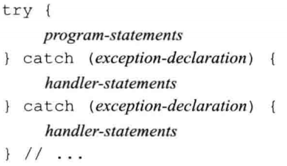

[toc]


# 表达式

## 1. 基础

没有什么值得注意的地方。

## 2. 运算符（%）

$$
m\%(-n)=m\%n\\
(-m)\%n=-(m\%n)
$$

## 3. 位运算符


## 4. sizeof运算符

此运算符返回一条表达式或一个类型名字所占的==字节数==，


## 5. 类型转换

隐式转换：


显示转换：

```c++
cast-name<type>(expression);
```

### static_cast

任何具有明确定义的类型转换，只要不包含底层`const`，都可以使用static_cast。


### const_cast

只能改变运算对象的底层`const`，用来"去掉const性质"


### reinterpret_cast

通常为运算对象的位模式提供较低层次上的重新解释。使用这个是非常危险的，因为下面这个变换不会引发报错。


### 旧式的强制类型转换


## 6. 运算符优先级表

具体见书。


# 语句

### try语句和异常处理




### 标准异常


