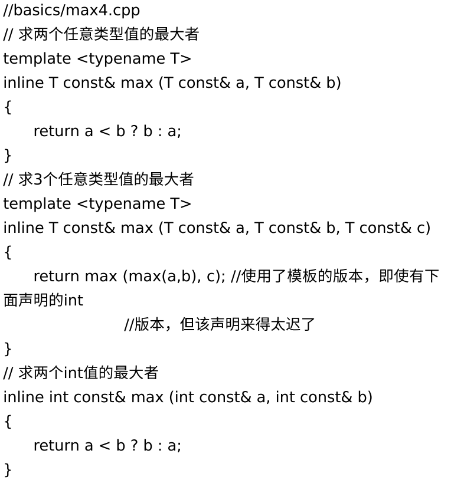

[toc]


# 基础

## 1. 函数模板

### 实参的演绎

:one:**模板实参推导**不适用于**返回类型**（关于这个，可以看`modern C++`的第一章），所以如下情况，必须**显示指定**模板实参列表：

```c++
template<typename T1, typename T2, typename RT> 
RT max (T1 const& a, T2 const& b);
...
max<int, double, double>(4, 4.2);
```

我们也可以通过修改顺序，只显示指定一个实参（比如：用于返回值）：

```c++
template<typename RT, typename T1, typename T2> 
```


### 函数模板的重载

:one:同等条件下，**优先选择非模板函数**（优先条件则谁好谁上）。如果要强迫使用模板，可以显示的指定一个空的模板实参列表：

```c++
max<>(....)
```

:two:因为模板是不允许进行自动类型转化的（隐式类型转换），所以这种情况下，会使用非模板函数：

```c++
template<typename T>
max(T a, T b);
...
max('a', 42.7); //调用非模板函数
```

:three:关于选择哪个重载函数，也有==是否可见==有关，例如：



三参数模板的函数，绝对不会调用非模板函数（`int`版的），因为调用处看不见。

所以说，牢记一条规则：函数的**所有重载版本的声明**，都应该位于**该函数被调用的位置之前**。


