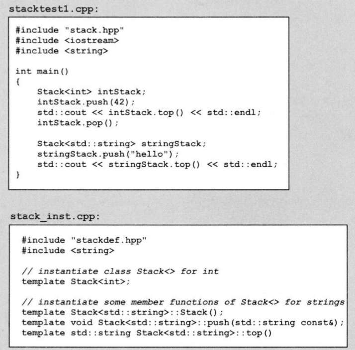

[toc]


# 基础

## 1. 函数模板

### 实参的演绎

:one:**模板实参推导**不适用于**返回类型**（关于这个，可以看`modern C++`的第一章），所以如下情况，必须**显示指定**模板实参列表：

```c++
template<typename T1, typename T2, typename RT> 
RT max (T1 const& a, T2 const& b);
...
max<int, double, double>(4, 4.2);  //由于返回值是第三个，而显示指定必须保证顺序一致，所以要写全
```

我们也可以通过修改顺序，只显示指定一个实参（比如：用于返回值）：

```c++
template<typename RT, typename T1, typename T2> 
```


### 函数模板的重载

:one:**同等条件下**，**优先选择非模板函数**（优先条件，则谁好谁上）。如果要强迫使用模板，可以显示的指定一个空的模板实参列表：

```c++
max<>(....);
```

:two:因为模板是不允许进行**自动类型转化的**（隐式类型转换），所以这种情况下，会使用**非模板函数**：

```c++
template<typename T>
max(T a, T b);
...
max('a', 42.7); //调用非模板函数
```

:three:关于选择哪个重载函数，也有==是否可见==有关，例如：


三参数模板的函数，绝对不会调用非模板函数（`int`版的），因为调用处看不见。

所以说，牢记一条规则：函数的**所有重载版本的声明**，都应该位于**该函数被调用的位置之前**。


## 2. 类模板

### 类模板的特化

:one:可以用**模板实参**来特化**类模板**。和**函数模板的重载**类似，通过特化类模板，你可以优化**基于某种特定类型的实现**。另外，**如果要特化一个类模板，你还要特化该类模板的所有成员函数**。虽然也**可以只特化某个成员函数**，但这个做法并没有特化整个类，也就没有特化整个类模板。

为了特化一个**类模板**，你必须在起始处声明一个`template<>`，接下来声明**用来特化类模板的类型**。这个类型被用作**模板实参**，且必须在**类名的后面**直接指定：

```c++
template<> 
class Stack<std::string> 
{ }
```

进行类模板的特化时，**每个成员函数都必须重新定义为普通函数**，原来模板函数中的每个`T`也相应地被**进行特化的类型**取代：

```c++
void Stack<std::string>::push (std::string const& elem) 
{ 
	elems.push_back(elem); 
} 
```

**特化的实现**可以和**基本类模板( prinmarytemplate)的实现**完全不同。

:two:类模板可以被==局部特化==。你可以在特定的环境下指定类模板的特定实现，并且要求某些模板参数仍然必须由用户来定义。例如：

```c++
template <typename T1, typename T2> 
class MyClass 
{ ... }; 

//局部特化1
template <typename T> 
class MyClass<T,T> 
{ ... }; 

//局部特化2
template <typename T> 
class MyClass<T,int> 
{ ... }; 

```

如果有**多个局部特化**同等程度地匹配某个声明，那么就称该声明具有==二义性==：

```c++
MyClass<int,int> m;   // 错误 : 同等匹配 MyClass<T,T>和MyClass<T,int> 
MyClass<int*,int*> m;  // 错误 : 同等匹配 MyClass<T,T>和MyClass<T1*,T2*> 
```

为了解决第2种二义性，你可以另外提供一个**指向相同类型指针的特化**∶

```c++
template<typename T>
class MyClass<T*,T*> 
{...}
```


### 缺省模板实参

对于**类模板**，你还可以为模板参数定义==缺省值==﹔这些值就被称为**缺省模板实参**；而且，它们还可以**引用**之前的模板参数。例如，在类`Stack<>`中，你可以把用于管理元素的容器定义为第`2`个模板参数，并且使用`std::vector<>`作为**它的缺省值**：

```c++
//basics/stack3.hpp 
#include <vector>
#include <stdexcept> 
template <typename T, typename CONT = std::vector<T> > 
class Stack { 
    
private: 
    
    CONT elems; 
    
public: 
    void push(T const&);   
    
    void pop();  
    
    T top() const;  
    
    bool empty() const 
    {  
        return elems.empty(); 
    } 
}; 
```


### 小结

类模板是具有如下性质的类：

- 在类的实现中，可以有一个或多个类型还没有被指定。

- 为了使用类模板，你可以传入某个具体类型作为模板实参﹔然后编译器将会基于该类型来实例化类模板。


- 对于类模板而言，**只有那些被调用的成员函数才会被实例化**。
- 你可以用某种特定类型**特化类模板**。
- 你可以用某种特定类型**局部特化类模板**。
- 你可以为类模板的参数**定义缺省值**，这些值还可以引用之前的模板参数。


## 3. 非类型模板参数

### 非类型的类模板参数

较之前一章stack例子的实现，你也可以使用**元素数目固定的数组**来实现`stack`。这个方法的优点是：**可以避免内存管理开销**。然而，决定一个栈`stack`的**最佳容量**是很困难的。一个好的解决方法就是：**让栈的用户亲自指定数组的大小**。

```c++
//basics/stack4.hpp 
#include <stdexcept> 

template <typename T, int MAXSIZE> 
class Stack 
{
private: 
    T elems[MAXSIZE];     
    int numElems;    
    
public: 
    Stack();        

    void push(T const&);  
    
    void pop();      
    
    T top() const;    
    
    bool empty() const 
    {  
        return numElems == 0; 
    } 
    
    bool full() const 
    {  
        return numElems == MAXSIZE; 
    }
}; 
```

```c++
Stack<int,20> int20Stack; 
Stack<int,40> int40Stack; 
```

可以看出，每个模板实例都具有自己的类型，因此`int20Stack`和`int40Stack`属于不同的类型，而且这两种类型之间也**不存在显式或者隐式的类型转换**；所以它们之间不能互相替换，更不能互相赋值。

同样，我们可以为模板参数指定**缺省值**：

```c++
template<typename T = int, int MAXSIZE = 100> 
class Stack 
{ ... }; 
```


### 非类型的函数模板实参

你也可以为**函数模板**定义**非类型参数**。例如，下面的函数模板定义了一组用于增加特定值的函数：

```c++
/basics/addval.hpp 
template<typename T, int VAL> 
T addValue(T const& x) 
{ 
    return x + VAL; 
} 
```

借助于**标准模板库**，你可以传递**这个函数模板的实例化体**，给集合中的每一个元素，让它们都增加一个整数值：

```c++
std::transform (source.begin(), source.end(), dest.begin(), addValue<int,5>);
```

另一方面，这个例子有一个问题：`Addvalue<int，5>`是一个**函数模板实例**，而**函数模板实例**通常被看成是：==用来命名一组重载函数的集合==。然而，根据现今的标准，**重载函数的集合并不能被用于模板参数的演绎**。于是，你必须将这个函数模板的实参**强制类型转换**为具体的类型：

```c++
std::transform (source.begin(), source.end(), dest.begin(), (int(*)(int const&))addValue<int,5>);
```


### 非类型模板参数的限制

我们还应该知道，==非类型模板参数是有限制的==。通常而言，它们可以是**常整数（包括枚举值）**或者**指向外部链接对象的指针**。**浮点数和类对象**是不允许作为**非类型模板参数**的：

```c++
//error
template<double VAT>  
double process (double v) 
{ 
    return v * VAT; 
} 

//error
template<std::string name> 
class MyClass 
{ ... }; 
```

> 尝试过了，现在依然不行

你也不能使用**全局指针**作为模板参数：

```c++
template <char const* name> 
class MyClass { }; 

char const* s = ”hello”; //s是一个指向内部链接对象的指针
MyClass<s> x; 
```

然⽽，你可以这样使⽤：

```c++
template <char const* name> 
class MyClass { }; 

extern char const s[] = ”hello”; 
MyClass<s> x;    //OK 
```


### 小结

- **模板**可以具有==值模板参数==，而不仅仅是类型模板参数.
- 对于非类型模板参数，你**不能使用浮点数、类类型的对象和内部链接对象**（例如字符串）作为实参。


## 4. 技巧性基础知识

### 关键字typename

:one:在C++标准化过程中，引入关键字`TypeName`是为了说明：==模板内部的标识符可以是一个类型==。譬如下面的例子：

```c++
template <typename T> 
class MyClass 
{ 
    typename T::SubType * ptr; 
    ... 
}; 
```

上面程序中，第2个`TypeName`被用来说明：`SubType`是定义于类T内部的一种类型。因此，`ptr`是一个指向`T::SubType`类型的指针。

如果不使用**类型名称**，`SubType`就会被认为是**一个静态成员**，那么它应该是**一个具体的变量或对象**，于是，下面表达式：

```c++
T::SubType * ptr 
```

会被看作是**类T的静态成员**`SubType`和`ptr`的乘积。

> 通常而言，当某个依赖于模板参数的名称是一个类型时，就应该使用**类型名**。

:two:让我们来考虑一个`typename`的典型应用，即在模板代码中访问**stl容器的迭代器**：

```c++
//basics/printcoll.hpp 
#include <iostream> 

template <typename T> 
void printcoll (T const& coll) 
{ 
    typename T::const_iterator pos; 
    typename T::const_iterator end(coll.end()); 
    
    for (pos=coll.begin(); pos!=end; ++pos) 
    {
        std::cout << *pos << ' '; 
    } 
    std::cout << std::endl; 
} 
```

:three:我们在引入`typename`之后，发现了一个很相似的问题。考虑下面这个使用标准`bitset`类型的例子：

```c++
template <int N> 
void printBitset (std::bitset<N> const& bs) 
{ 
    std::cout<<bs.template to_string<char, char_traits<char>, allocator<char>>(); 
}
```


### 适用this->

对于**具有基类的类模板**，自身使用名称`x`并不一定等同于`this->x`。即使该`x`是从基类继承获得的，也是如此。例如：

```c++
template <typename T> 
class Base 
{ 
public: 
    void exit(); 
}; 

template <typename T> 
class Derived : Base<T> 
{ 
public: 
    void foo() 
    { 
        exit();   //调⽤外部的exit()或者出现错误 
    } 
};
```

在这个例子中，在`foo()`内部决定要调用哪一个`Exit()`时，并不会考虑**基类Base**中定义的`Exit()`。因此，你如果不是获得一个错误，就是调用了另一个`exit()`。

我们将在9.4.2小节详细讨论这个问题。现在建议你记住**一条规则**：对于那些**在基类中声明，并且依赖于模板参数的符号**（函数或者变量等），你应该在它们前面使用`this->`或者`base<T>:`。


### 成员模板

:one:**类成员也可以是模板**。嵌套类和成员函数都可以作为模板。我们可以通过一个`Stack<>`类模板来说明这种（作为模板的）能力的优点和应用方法。通常而言，**栈之间只有在类型完全相同时才能互相赋值**，其中类型指的是**元素的类型**。就是说，对于**元素类型不同的栈**，你不能对它们进行相互赋值，即使这两种（元素的）类型之间存在**隐式类型转换**。譬如：

```c++
Stack<int> intStack1, intStack2; //int栈 
Stack<float> floatStack;     		//float栈 
... 
intStack1 = intStack2;    //OK
floatStack = intStack1;   //ERROR
```

然而，通过定义一个**身为模板的赋值运算符**，针对元素类型可以转换的两个栈，就可以进行**相互赋值**。为了达到这个目的，你需要这样声明`Stack<>`：

```c++
template <typename T2> 
Stack<T>& operator= (Stack<T2> const&);
```

在这里，进行了**两处改动**：

- 增加了一个赋值运算符的声明，它可以把元素类型为`T2`的栈，赋值给**原来的栈**。
- 栈现在改用`deque`作为元素的**内部容器**。事实上，这是为了满足**新赋值运算符实现**的要求。

**新赋值运算符**的实现大致如下：

```c++
template <typename T>
template <typename T2> 
Stack<T>& Stack<T>::operator= (Stack<T2> const& op2) 
{ 
    if ((void*)this == (void*)&op2)
    {
        return *this; 
    } 
    
    Stack<T2> tmp(op2);
    elems.clear();   
    
    while (!tmp.empty()) 
    {    
        elems.push_front(tmp.top()); 
        tmp.pop(); 
    } 
    
    return *this; 
}
```

可以看到，**模板赋值运算符**并没有取代**缺省赋值运算符**。对于相同类型栈之间的赋值，仍然会调用**缺省赋值运算符**。

> 这里省略了把内部容器类型也作为一个模板参数的`Stack<>`实现，具体见书。

:two:需要再次提醒的是：对于**类模板**而言，==只有那些被调用的成员函数才会被实例化==。因此，如果在元素类型不同的栈之间**没有进行相互赋值**，你就可以使用`vector`来作为**内部容器**。

```c++
Stack<int,std::vector<int> > vStack; 
... 
vStack.push(42);
vStack.push(7); 
std::cout << vStack.top() << std::endl; 
```


### 模板的模板参数

:one:有时，==让模板参数本身成为模板==是很有用的，我们将继续以`Stack`类模板作为例子，来说明**模板的模板参数**的用途.

在堆栈的例子中，如果要使用一个**和缺省值不同的内部容器**，程序员必须**两次指定元素类型**。也就是说，为了指定**内部容器的类型**，你需要同时传递容器的类型和它所含元素的类型。如下：

```c++
Stack<int,std::vector<int> > vStack; 
```

如果我们想要这样呢：

```c++
Stack<int,std::vector> vStack; 
```

为了获得这个特性，你必须把**第2个模板参数**指定为**模板的模板参数**。那么，`Stack`的声明应该如下：

```c++
template <typename T, template <typename ELEM> class CONT = std::deque > 
class Stack
{
private: 
    CONT<T> elems;
....
};
```

不同之处在于，**第2个模板参数**现在被声明为一个**类模板**：

```c++
template <typename ELEM> class CONT 
```

**缺省值**也从`std::deque<T>`变成`std::deque`。

:two:这也是这个例子比较特别的地方：使用**第1个模板参数**作为**第2个模板参数的实例化类型**。一般地，你可以使用**类模板内部的任何类型**来实例化**模板的模板参数**。

我们前面提过：作为模板参数的声明，通常可以使用`typename`来替换关键字`class`。然而，上面的`CONT`是为了定义一个类，因此只能使用关键字`class`。因此，下面的程序是错误的：

```c++
template <typename T, template <typename ELEM> typename CONT = std::deque > 
class Stack;
```

由于在这里，我们并不会用到**“模板的模板参数”的模板参数**（即上面的`Elem`），所以你可以把该名称省略不写：

```c++
template <typename T, template <typename> class CONT = std::deque > 
class Stack;
```

另外，还必须对**成员函数的声明**进行相应的修改。成员函数`Push()`的实现如下：

```c++
template <typename T, template <typename> class CONT> 
void Stack<T,CONT>::push (T const& elem) 
{ 
    elems.push_back(elem);    
}
```

还有，记住：==函数模板并不支持模板的模板参数==。

:three:如果你尝试使用**新版本的Stack**，你会获得一个错误信息：缺省值`std::deque`和模板的模板参数`cont`并不匹配。

对于这个结果，你或许会觉得很诧异，但问题在于：模板的**模板实参**（譬如这里的`std::queue`是一个**具有参数A的模板**，它将替换**模板的模板参数**（譬如这里的`cont`），而模板的模板参数是一个**具有参数B的模板**；匹配过程要求**参数A和参数B必须完全匹配**；然而在这里，我们并==没有考虑模板的模板实参的缺省模板参数==，从而也就使`B`中缺少了这些缺省参数值，当然就**不能获得精确的匹配**。

在这个例子中，问题在于，标准库中的`std::deque`模板还具有另一个参数：即第2个参数（也就是所谓的内存分配器`allocator`），它有一个缺省值。

然而，解决办法总是有的。我们可以重写**类的声明**：

```c++
template <typename T, template <typename ELEM, typename ALLOC = std::allocator<ELEM> > class CONT = std::deque> 
class Stack 
{ 
    private: CONT<T> elems;
    ...
}; 
```


### 零初始化

:one:现在，假如你在编写模板，并且希望**模板类型的变量**都已经用**缺省值**初始化完毕，那么这时你会遇到问题，==内建类型==并不能满足你的要求：

```c++
template <typename T> 
void foo() 
{ 
    T x;	//如果T是内建类型，那x本身是⼀个不缺点值 
} 
```

由于这个原因，我们就应该**显式地调用内建类型的缺省构造函数**，并把缺省值设为`0`。譬如调用`int()`我们将获得缺省值`0`。于是，借助如下代码，我们可以确保对象已经执行了**适当的缺省初始化**，即便对**内建类型对象**也是如此：

```c++
template <typename T> void foo() 
{ 
    T x = T();
}
```

对于类模板，在用**某种类型**实例化该模板后，为了确认它所有的成员都已经初始化完毕，你需要定义一个**缺省构造函数**，通过一个**初始化列表**来初始化**类模板的成员**：

```c++
template <typename T> class MyClass 
{ 
private: 
    T x; 
    
public: 
    MyClass() : x() {} 
    ... 
}; 
```


### 适用字符串作为函数模板的实参

```c++
#include <string> 
template <typename T>
inline T const& max (T const& a, T const& b) 
{ 
    return a < b ? b : a; 
} 

int main() 
{ 
    std::string s; 
    ::max("apple","peach");  	// OK
    ::max("apple","tomato"); 	// ERROR
    ::max("apple",s);     	 	// ERROR
} 
```

问题在于：由于长度的区别，==这些字符串属于不同的数组类型==。也就是说，`Apple`和`peach`具有**相同的类型**`char Const[6]`；然而`tomato`的类型则是：`Char Const[7]`。因此，只有**第一个调用是合法的**，因为该`max()`模板期望的是类型完全相同的参数。然而，如果声明的是==非引用参数==，你就可以使用**长度不同的字符串**，来作为`max()`的参数：

```c++
#include <string> 
template <typename T> 
inline T max (T a, T b) 
{ 
    return a < b ? b : a; 
} 

int main() 
{
    std::string s; 
    ::max("apple","peach");  	// OK
    ::max("apple","tomato"); 	// OK
    ::max("apple",s);    		// ERROR
} 
```

产生这种调用结果的原因是：对于**非引用类型的参数**，在实参演绎的过程中，会出现==数组到指针的类型转换==（这种转型通常也被称为`decay`）。

对于这个问题没有**通用的解决方案**，根据不同的情况，可以选择不同的方法。具体见书。


### 小结

- 如果要访问依赖于模板参数的类型名称，你应该在**类型名称前**添加关键字`typename`。
- 嵌套类和成员函数也可以是模板。在本章的例子中，针对元素类型可以进行隐式类型转换的2个栈，我们实现了通用的赋值操作。然而，在这种情况下，**类型检查依然是存在的**。
- **赋值运算符的模板版本**并没有取代**缺省赋值运算符**。
- **类模板也可以作为模板参数**，我们称之为==模板的模板参数==。
- 模板的模板实参必须精确地匹配。匹配时并不会考虑**“模板的模板实参”的缺省模板实参**。
- 通过**显式调用缺省构造函数**，可以确保模板的变量和成员都已经用一个缺省值完成初始化，这种方法对**内建类型的变量和成员**也适用。


## 5. 模板实战

### 包含模型

:one:我们可以用几种方法来组织**模板源代码**。这一节将给出最常用的方法：==包含模型==（`inclusion model`）。

大多数C和C++程序员会这样组织他们的非模板代码：

- **类**（`class`）和**其他类型**都被放在一个**头文件**中。通常而言，**头文件**是一个扩展名为`.hpp`（或者`.H`、`.h`、`.hh`、`.hxx`）的文件。
- 对于**全局变量和（非内联）函数**，只有**声明放在头文件**中，定义则位于`dot-C`文件。通常而言，`dot-C`文件是指扩展名为`.cpp`（或者`.C`，`C`、`.cc`、`.cxx`）的文件。

这样一切都可以正常运作了。**所需的类型定义**在整个程序中都是**可见的**；并且对于变量和函数而言，**链接器**也不会给出重复定义的错误。

但是如果这样对待**模板**，则会报错。这个错误的原因在于：==函数模板`的定义还没有被实例化==。为了使模板真正得到实例化，编译器必须知道：应该实例化哪个定义以及要基于哪个模板实参来进行实例化。

:two:对于前面的问题，我们通常是采取对待**宏或内联函数**的解决办法：我们把**模板的定义**也包含在**声明模板的头文件**里面，即让**定义和声明都位于同一个头文件中**。

```c++
//basics/myfirst2.hpp 
#ifndef MYFIRST_HPP 
#define MYFIRST_HPP 
#include <iostream> 
#include <typeinfo> 
//声明
template <typename T> 
void print_typeof(T const&); 
//实现
template <typename T> 
void print_typeof(T const& x) 
{ 
    std::cout << typeid(x).name() << std::endl; 
} 
#endif
```

我们称模板的这种组织方式为==包含模型==。通过使用这种模型，你会发现前面的程序可以顺利编译、链接和运行.

:three:针对这一点，我们可以得出**一些结论**：**包含模型**明显增加了**包含头文件**`myfirst.cpp`的开销，这也正是包含模型**最大的不足之处**。在例子中，**主要的开销并不是取决于模板定义本身的大小**，而在于模板定义中所包含的那些头文件（在我们的例子中是<iostream>和<typeinfo>）的大小。你或许已经知道这样会带来**成千上万行的代码**，因为每个诸如`<iostream>`的头文件本身也都包含了**许多类似的模板定义**。

> 因为有了模板，我们没法把头文件的包含，放在`cpp`文件里

在实际应用中，这是一个很严重的问题，因为它大大增加了**编译复杂程序所耗费的时间**。因此我们将在后面几节给出**几种可能的解决方法**。然而，现在的程序大多已经不需要在**编译和链接**上面花上几个小时，将来就更不用说了。

如果不需要考虑**创建期的时间问题**，我们建议你尽量使用**包含模型**来组织**模板代码**。我们在后面会考察另外两种组织模板的方式，但就我们的观点看来，另**外两种组织方式的实际缺陷往往比这里所讨论的创建期开销更加严重**。当然，这两种组织方式也有其他一些**与软件开发的应用方面间接相关的优点**。

从**包含模型**得出的另一个**更微妙的结论**是：**非内联函数模板**与“内联函数和宏”有一个很重要的区别，那就是**非内联函数模板**在调用的位置并不会被扩展，而是当它们基于某种类型**进行实例化**之后，才产生一份**新的函数拷贝**。因为产生函数拷贝是一个**自动化过程**，所以在编译结束的时候，编**译器可能会在不同的文件里产生两份拷贝**，于是，当链接器发现同一个函数具有两种不同的定义时，就会报告一个错误。理论上讲，这并不是我们需要关心的问题，它应该**由C++的编译系统**来解决。而且，事实上大多数情况下都不会出现这种问题，我们根本没有必要太过于在意这个问题。但对于需要创建自身代码库的大项目，我们就要充分注意这个问题。我们将在第10章详细讨论**C++的实例化机制**。


### 显示实例化

:one:C++还提供⼀种**⼿⼯实例化模板**的机制：**显式实例化指示符**（`explicit instantiation directive`）。 

为了说明**手工实例化**，让我们回顾前面那个导致**链接器错误**的例子。在此，为了避免这个**链接期错误**，我们可以通过给程序添加**下面的文件**：

```c++
//basics/myfirstinst.cpp 
#include“myfirst.cpp” 
//基于型double显式print_typeof() 
template void print_typeof<double>(double const&); 
```

> ```c++
> //basics/myfirst.hpp 
> #ifndef MYFIRST_HPP 
> #define MYFIRST_HPP 
> 
> template <typename T> 
> void print_typeof (T const&) 
> 
> #endif //MYFIRST_HPP 
> ```
>
> ```c++
> //basics/myfirst.cpp 
> #include <iostream> 
> #include <typeinfo> 
> #include“myfirst.hpp” 
> 
> template <typename T> 
> void print_typeof (T const& x) 
> { 
>     std::cout << typeid(x).name() << std::endl;
> } 
> ```

==显式实例化指示符==由关键字`template`和紧接其后的**实例化实体（可以是类、函数、成员函数等）的声明**组成，而且，该声明是一个已**经用实参完全替换参数之后的声明**。在例子中，我们针对的是一个普通函数，但该指示符也适用于**成员函数和静态数据成员**。譬如：

```c++
//基于int显式实例化MyClass<>的构造函数 
template MyClass<int>::MyClass(); 
//基于int显式实例化模板max() 
template int const& max(int const&, int const&); 
```

你还可以**显式实例化类模板**，这样就可以同时实例化它的**所有类成员**。但有一点需要注意：对于这些在前面**已经实例化过的成员**，就不能再次对它们进行实例化。

对于每个不同实体，在一个程序中**最多只能有一个显式实例化体**，换句话说，你可以同时显式实例化`print_typeof<int>`和`print_typeof<Double>`，但在同一个程序中每个指示符都**只能够出现一次**。如果不遵循这条规则，通常都会导致**链接错误**。

:two:==人工实例化==有一个**显著的缺点**：我们必须仔细跟踪每个**需要实例化的实体**。对于大项目而言，这种跟踪很快就会带来**巨大负担**；因此，我们并不建议使用这种方法。

然而，**显式实例化**还是有它自身的一些优点的，**实例化可以在需要的时候才进行**。显然，我们因此**避免包含庞大头文件的开销**，更可以**把模板定义的源文件**封装起来；但封装之后，客户端程序就不能基于其他类型来进行额外的实例化了。

:three:让我们来整合**包含模型**和**显式实例化**。


现在，如果我们希望使用**包含模型**，那么只要`#include`头文件`stackdef.hpp`就可以了。反之，如果我们希望**显式实例化模板**，我们就应该`#include`头文件`stack.hpp`，然后再提供一个含有**所需要显式实例化指示符**的`dot-C`文件：





### 分离模型

:one:我们在上一节给出的两种方法都可以正常地工作，也完全符合**C++标准**。然而，标准还给出了另一种机制：==导出模板==（`ExportingTemplate`），这种机制通常也被称为==C++模板的分离模型==。

大体上讲，关键字`export`的功能使用是非常简单的：在一个文件里面**定义模板**，并在模板的定义和声明的前面加上**关键字**`export`。对于上一节的例子，通过使用`export`，我们会得到下面的**函数模板声明**：

```c++
//basics/myfirst3.hpp 
#ifndef MYFIRST_HPP 
#define MYFIRST_HPP 

//模板声明
export template <typename T> 
void print_typeof(T const&); 

#endif //MYFIRST_HPP 
```

即使在**模板定义不可见**的条件下，**被导出的模板**也可以正常使用。在我们的例子中，文件`myfirst 3_hpp`现在只是包含**类模板的成员函数的声明**，但对于使用这些成员已经足够了。和刚开始**导致编译器报错的那个例子**相比，我们只是在代码中添加了关键字`export`，一切就可以顺利通过了.

:two:后面的**重新声明**会隐式地保留这个`export`特性，这也是我们不需要修改文件`myfirst.cpp`的原因所在。就是说，`myfirst.cpp`文件里面的这个定义是隐式`exported`。

实际上，关键字`export`可以应用于**函数模板、类模板的成员函数、成员函数模板和类模板的静态数据成员**。另外，它还可以用于**类模板的声明**，这将意味着**每个可导出的类成员**都被看作==可导出实体==，但类模板本身实际上却没有被导出（因此，类模板的定义仍然需要出现在头文件中）。你仍然可以隐式或者显式地定义**内联成员函数**。然而，==内联函数却是不可导出的==：

```c++
export template <typename T> 
class MyClass 
{ 
    public: void memfun1();   
    void memfun2() 
    {   
        //隐式内联不导 ... 
    } 
        
    void memfun3();   //显式内联不导 ... 
}; 

template <typename T> 
inline void MyClass<T>::memfun3() 
{ ... }
```

> 那么，显然，`export`和`inline`不能同时使用

:three:`export`虽然看起来完美无缺，但它实际上还是**有一些缺点**的。在应用分离模型的最后，**实例化过程需要处理两个位置**：模板被实例化的位置和模板定义出现的位置。

虽然这两个位置在源代码中看起来是**完全分离的**，但系统却为这两个位置**建立了一些看不见的耦合**。就是说，对于我们的例子而言，如果**模板定义的文件**发生了改变，那么不仅该文件需要进行重新编译，所有“对该文件中模板进行实例化的”其他文件**都需要进行重新编译**。

虽然这种耦合和**包含模型的耦合**没有本质的区别，但是这里的耦合**在源代码中是看不见的**。也正是由于它的不可见性，所以那些**基于代码的依赖性管理工具**也将不再适用。这就意味着编译器需要进行一些**额外的处理**，来跟踪这些耦合。这也将导致**程序的创建时间**可能会比**包含模型所需要的创建时间**还要多.

:four:具体分析见书，我们这里直接看看一个更好的、可以切换的方法（**包含模型和分离模型**）：

```c++
/basics/myfirst4.hpp 

#ifndef MYFIRST_HPP
#define MYFIRST_HPP //果USE_EXPORT,使⽤export 
    
#if defined(USE_EXPORT) 
#define EXPORT export 
#else 
#define EXPORT 
#endif 

EXPORT template <typename T> 
void print_typeof(T const&);

#if !defined(USE_EXPORT) 
#include“myfirst.cpp” 
#endif 

#endif //MYFIRST_HPP
```

显然，这个方法很灵活。另外，我们需要重申的是：除了**明显的逻辑区别**之外，这两种模型之间还具有**细微的语义区别**。

对于**被导出的模板**，我们仍然可以对它进行**显式实例化**。在这个例子中，**模板定义**也可以位于另一个文件中，只需在程序中`#include `一个**含有显式实例化的.cpp文件**。


### 预编译头文件

:one:即使不存在模板，**C++头文件**也可以变得非常巨大，从而需要**很长的编译时间**。模板更是增加了编译时间。于是，程序员就呼吁产品厂家实现一种称为==预编译头文件==（预编译头）的机制；该机制是位于**标准的范围之外**的，并且主要依赖于特定产品的实现，但知道**预编译是如何进行的**还是很有裨益的.

==预编译头文件机制==主要依赖于：我们可以使用某种方式来组织代码，让多个文件中**前面的代码都是相同的**。于是，我们可以先编译完这`N`行代码，并把编译器在编译后这一点的**完整状态**储存在一个所谓的**预编译头文件**中。

因此，对于程序中的剩下文件的编译，我们只需要先加载**上面已经保存的状态**，然后从第`N+1`行开始编译就可以了。此时我们还应该知道：**重新加载已保存的状态是一个很快的操作**。

:two:充分利用预处理头文件的**关键之处**在于：尽可能地确认许多文件**开始处的相同代码的最大行数**。在实际应用中，这就意味着文件必须以相同的`#include`指示符开始。因此，注意它们的**被包含顺序**是相当重要的，譬如：

```c++
//不能使用预编译头文件
#include <iostream> 
#include<vector>
#include<list> 

...
    
#include<list> 
#include<vector> 
```

:three:一个技巧：直接创建一个名为`std.hpp`的头文件，让它包含**所有的标准头文件**：

```c++
#include <iostream> 
#include <string> 
#include <vector> 
#include <deque> 
#include <list> 
```

:four:管理**预编译头文件**的一种**可取的方法**是：==对预编译文件进行分层==，即根据**头文件的使用频率和稳定性**来进行分层。于是，对于那些**不会发生变化的头文件**，就很有必要对它们进行预编译。然而，如果头文件是处于一个大型开发项目中，那么对所有的文件都进行预编译所耗费的时间，可能会比重用预编译头文件所节省的时间还要多。因此，解决这个问题的关键之处在于：我们应该**对那些属于更稳定级别的头文件先进行预编译**，然后**在不太稳定的头文件中重用这个稳定的预编译头文件**，从而提高整个编译效率。

例如，假设除了处理前面介绍的`std.hpp`头文件之外，我们还定义了一个`core.hpp`头文件，它包含了我们项目特有的额外功能；可是，`core.hpp`的稳定性低于`std.hpp`的稳定性，那么它大体是这样的：

```c++
#include“std.hpp”
#include“core_data_hpp” 
#include“core_algos.hpp”
... 
```

因为该文件是以`#include“std.hpp”`开头的，编译器将会加载**相关的预编译头文件**，然后从下一行开始编译，而**不会重新编译所有的标准头文件**。当文件`‘core.hpp’`完全经过处理之后，就产生了一个**新的预编译头文件**。于是，应用程序可以使用`#include“core.hpp”`来提供功能更多、速度更快的访问。


### 调试模板

//todo


## 6. 模板术语

### 类模板还是模板类

:one:在C++中，==类和联合都被称为类类型==。如果不加额外的限定，我们通常所说的==“类”==是指：用关键字`class`或者`struct`引入的类类型(类类型)。需要特别注意的一点就是：**类类型包括联合，而类不包括联合**。

术语**类模板**说明的是：该类是一个模板；它代表的是：**整个类家族的参数化描述**。

另一方面，**模板类**通常被用于下面几个方面：

- 作为**类模板**的同义词。
- **从模板产生的类**。
- 具有一个`template-id `名称的类。

类似，我们将使用**函数模板**和**成员函数模板**。


### 声明和定义

:one:==声明是一种C++构造==，它引入一个名称到**某个C++作用域**中。而且，这种引入通常都包含**对所引入名称的一个局部分类**。但是，有效的声明并不要求包含**被引入对象的细节**。

如果已经确定了这种C++构造（即声明）的细节，或者对于变量而言，已经为它分配了内存空间，那么==声明就变成了定义==。对于类类型或函数，这意味着必须提供**一对花括号内部的实体**。对于变量而言，进行初始化和**不具有extern关键字的声明**都是定义。


### 一处定义原则

:one:一处定义原则（`ODR`），这里我们只记住下面的`ODR`的基本原则：

- 和全局变量与静态数据成员一样，在整个程序中，**非内联函数和成员函数**只能被定义一次
- 类类型（包括`struct`与`Union`）和**内联函数**在每个**翻译单元**中最多**只能被定义一次**，如果存在多个翻译单元，则其**所有的定义都必须是等同的**。

一个**翻译单元**是指：预处理一个源文件所获得的结果；

另外，在本书的剩余章节里，我们所说的==可链接实体==指的是下面的实体：非内联函数或者非内联成员函数、全局变量或者静态成员变量，还包括从模板产生的上述这些实体。


