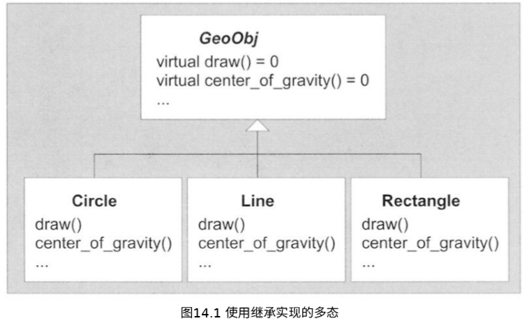
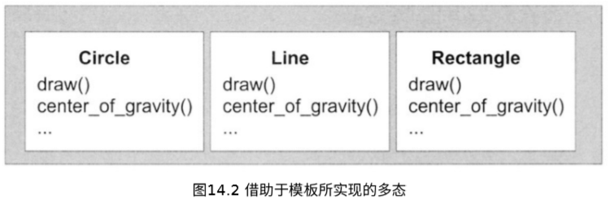
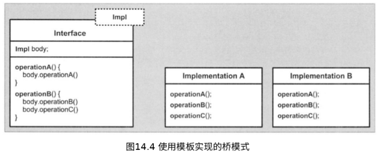
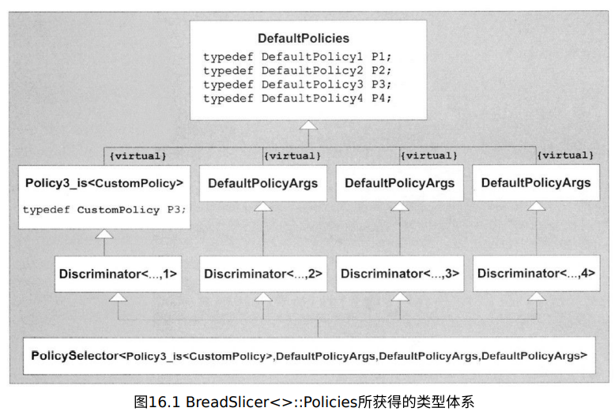

# 模板与设计

## 1. 模板的多态威力

对面向对象的程序设计范例而言，==多态==可以说是一块基石。在`C++`中，这块基石主要是通过**继承和虚函数**来实现的。由于这两个机制（继承和虚函数）都是至少一部分**在运行期进行处理的**，因此我们把这种多态称为==动多态==；我们平常所谈论的**C++多态**指的就是这种动多态。

然而，模板也允许我们使用单一的泛型标记，来关联不同的特定行为；但这种**借助于模板的关联是在编译期进行处理的**，因此我们把这种多态称为==静多态==。在这一章里，我们将重温这两种形式的多态，然后讨论：**在何种情况下，应该使用哪一种多态。**

### 动多态

:one:在这种情况下，==多态的设计思想==主要在于：对于几个相关对象的类型，确定它们之间的一个**共同功能集**；然后在基类中，把这些共同的功能声明为**多个虚函数接口**。



### 静多态

:one:模板也能够被用于实现多态。然而，这种多态并不依赖于在基类中包含公共行为的因素；但仍然存在一种**隐式的公共性**，即应用程序的不同“形状（即类型）”都必须支持某些**使用公共语法的操作**（也就是说，相关的函数必须具有相同的名称）。另外，**具体类之间的定义是互相独立的**。于是，当用具体类对模板进行实例化的时候，这种多态的威力就显示出来了。



```c++
// poly/statichier.hpp 
#include "coord.hpp" 
class Circle 
{ 
    public: 
    void draw() const;
    Coord center_of_gravity() const;
    … 
}; 

class Line 
{ 
    public: 
    void draw() const; 
    Coord center_of_gravity() const; 
    … 
};

… 

// poly/staticpoly.cpp
#include "statichier.hpp" 
#include <vector> 
template <typename GeoObj> 
void myDraw (GeoObj const& obj)
{ 
    obj.draw();
}
...
    
int main() { 
    Line l;

    Circle c, c1, c2; 
    
    myDraw(l);    // myDraw<Line>(GeoObj&) => Line::draw() 
    myDraw(c);    // myDraw<Circle>(GeoObj&) => Circle::draw() 
    ...
}
```


### 动多态和静多态

:one:***术语***

动多态和静多态为不同的C++编程`idioms`提供了支持：

- 通过继承实现的多态是**绑定的和动态的**：
  - 绑定的含义是：对于参与多态行为的类型，具有多态行为的接口是在公共基类的设计中就预先确定的。
  - 动态的含义是：**接口的绑定**是在运行期动态完成的.

- 通过模板实现的多态是**非绑定的和静态的**：
  - 非绑定的含义是：于参与多态行为的类型，它们的接口是没有预先确定的。
  - 静态的含义是：**接口的绑定**是在编译期静态完成的。


:two:通常而言，与动多态相比，静多态被认为具有**更好的类型安全性**；因为静多态在编译期会对所有的绑定操作进行检查。

具体优缺点见书。

:three:这种新形式的静多态带来了**实现设计模式的新方法**。例如，以在C++程序设计中扮演重要角色的==桥模式==为例。我们使用桥模式的目的是：**为了能够在同一接口的多个不同实现中进行切换**。根据`DesignPatternsGoV`所言，我们通常可以使用一个指针来引用具体的实现，然后把所有的调用都委托给这个**包含具体实现的类**，从而达到我们的目的。





### 泛型程序设计

C++模板的每次使用都可以被看成是**泛型程序设计的一个实例**；然而，开发人员却经常认为泛型程序设计本身具有**一个额外的本质特性**：即在一个框架中，设计模板的目的是为了能够得到多种有用的类型组合。


## 2. trait与policy类

### 一个实例：累加一个序列

:one:首先，让我们首先假设所要计算总和的值都是**存储在一个数组**里面的，并且我们还具有一个指向数组第1个元素的指针，以及一个指向数组最后一个元素的后一位的指针，这两个指针之间的所有元素就是我们要进行求总和的元素。现在，让我们先给出一个看起来比较直接的例子：

```c++
// traits/accum1.hpp 
#ifndef ACCUM_HPP 
#define ACCUM_HPP 
template <typename T> 
inline T accum (T const* beg, T const* end) 
{ 
    T total = T(); // 假设T()事实上⽣成⼀个等于0的值
    while (beg != end) 
    { 
        total += *beg; 
        ++beg; 
    } 
    return total; 
} 
#endif // ACCUM_HPP
```

正常调用是没有问题，例如`int`数组，但是如果我们对字符数组使用，会得到意料之外的结果（因为结果溢出了）。我们可以通过引入一个**额外的模板参数**`AccY`来解决这个问题，其中`AccT`描述了变量`total`的类型（同时也是返回类型）。然而，这将会给该模板的所有用户都强加**一个额外的负担**：他们每次调用这个模板的时候，都要指定这个额外的类型。因此，针对我们上面的例子，我们不得不这样编写代码：

```c++
char name[] = "templates"; 
accum<int>(&name[0],&name[length])
```

:two:关于这个额外参数，另一种解决方案是对`accum()`所调用的每个`T`类型都创建**一个关联**，所关联的类型就是用来存储累加和的类型。这种关联可以被看作是类型`T`的一个特征，因此我们也把这个**存储累加和的类型**称为`T`的`trait`。于是，我们可以使用每个模板特化来写出这些关联代码：

```c++
// traits/accumtraits2.hpp 
template<typename T> 
class AccumulationTraits; 

template<> 
class AccumulationTraits<char> 
{ 
public: 
    typedef int AccT; 
}; 

template<> 
class AccumulationTraits<short> 
{ 
public: 
    typedef int AccT; 
}; 

template<> 
class AccumulationTraits<int> 
{ 
public: 
    typedef long AccT; 
}; 

template<> 
class AccumulationTraits<unsigned int> 
{ 
public: 
    typedef unsigned long AccT;
}; 

template<>
class AccumulationTraits<float> 
{ 
public: 
    typedef double AccT; 
};
```

在上面代码中，模板` AccumulationTraits `被称为一个`trait`模板，因为它含有它的参数类型的一个`trait`（通常而言，可以存在多个`trait`和多个参数）。对这个模板，我们并**不提供一个泛型的定义**，因为在我们不知道参数类型的前提下，并不能确定应该选择什么样的类型作为**和的类型**。有了这个想法之后，我们就可以这样改写前面的`accum()`模板：

```c++
// traits/accum2.hpp 
#ifndef ACCUM_HPP 
#define ACCUM_HPP 
#include "accumtraits2.hpp" 

template <typename T> 
inline typename AccumulationTraits<T>::AccT accum (T const* beg, T const* end) 
{ 
    typedef typename AccumulationTraits<T>::AccT AccT; 
    AccT total = AccT(); 
    
    while(beg != end) 
    { 
        total += *beg; 
        ++beg; 
    } 
    return total;
} 

#endif 
// ACCUM_HPP 
```

现在，基本内置类型都不会产生结果数值溢出的问题了。进一步而言，如果有新的类型要使用`accum()`模板，那么只需声明`AccumulationTraits`模板的一个**新的显式特化**，来关联`AccT`和该类型即可。我们还看到，任何类型都可以和`AccT`进行关联，来实现这种特性。

:three:***value trait***

显然，我们并不能保证上面的构造函数`AccT()`会返回一个符合条件的值，可以用来开始这个**求和循环**。而且，类型`AccT`也不一定具有一个**缺省构造函数**。我们需要给`AccumulationTraits`添加一个`value trait`：

```c++
// traits/accumtraits3.hpp 

template<typename T> 
class AccumulationTraits; 

template<> 
class AccumulationTraits<char> 
{ 
public: 
    typedef int AccT; 
    static AccT const zero = 0; 
}; 

template<> 
class AccumulationTraits<short> 
{ 
public: 
    typedef int AccT; 
    static AccT const zero = 0; 
}; 

template<> 
class AccumulationTraits<int> 
{ 
public: 
    typedef long AccT;
    static AccT const zero = 0; 
}; 
…
```

```c++
typedef typename AccumulationTraits<T>::AccT AccT; 
AccT total = AccumulationTraits<T>::zero;
while (beg != end) {
    ...
```

然而，这种解决方案的一个缺点是：在所在类的内部，C++只允许我们对**整型和枚举类型**初始化**静态成员变量**。显然，对于诸如**浮点型的其他类型**，也包括我们自己定义的类，就不能使用上面的解决方案。

但若是在源文件中初始化，编译器通常不会知道位于其他文件的定义。因此，我们趋向于实现下面的这种`value trait`：

```c++
 // traits/accumtraits4.hpp 
template<typename T> 
class AccumulationTraits; 

template<> 
class AccumulationTraits<char> 
{ 
public:
    typedef int AccT; 
    static AccT zero() { 
        return 0; 
    } 
}; 

template<> 
class AccumulationTraits<short> 
{ 
public: 
    typedef int AccT; 
    static AccT zero() 
    { 
        return 0; 
    } 
}; 
...
```

下面是`trait`概念的关键部分：`trait`提供了一种配置具体元素（通常是类型）的途径，而该途径主要是用于**泛型计算**。

:four:***参数化trait***

在上一节所使用的`trait`被称为`fixed trait`，因为一旦定义了这个分离的`trait`，就不能在算法中对它进行改写。然而，在有些情况下我们需要对`trait`进行改写。

从原则上讲，**参数化主要的目的在于：添加一个具有缺省值的模板参数**，而且该缺省值是由我们前面介绍的模板决定的。在这种具有缺省值的情况下，许多用户就可以不需要提供这个额外的模板实参；但对于有特殊需求的用户，也可以**改写这个预设的和类型**。对于这个特殊的解决方案，唯一的不足在于：我们并不能对函数模板预设**缺省模板实参**。

就现在的情况而言，通过把算法实现为**一个类**，我们就可以绕过上面这个不足。这同时也说明了：除了函数模板之外，在类模板中也可以很容易地使用`trait`。在我们的应用程序中，唯一的缺点就是：**类模板不能对它的模板参数进行演绎**，而是必须显式提供这些模板参数。因此，我们需要编写如下形式的代码：

```c++
Accum<char>::accum(&name[0], &name[length]) 
```

```c++
// traits/accum5.hpp 
#ifndef ACCUM_HPP 
#define ACCUM_HPP 
#include "accumtraits4.hpp" 
template <typename T, typename AT = AccumulationTraits<T>> 
class Accum 
{ 
public:
    
    static typename AT::AccT accum (T const* beg, T const* end) 
    { 
        typename AT::AccT total = AT::zero(); 
        while (beg != end) 
        { 
            total += *beg; ++beg; 
        } 
        return total; 
    } 
}; 
#endif // ACCUM_HPP 
```

### Policy和Policy类

:one:还可以有其他种类的累积。例如，我们可以对序列中的给定值进行求积；如果这些值是字符串的话，还可以对它们进行连接。在这所有的情况中，针对`accum()`的所有操作，唯一需要改变的只是`total+=*beg`操作。于是，我们就把这个操作称为该累积过程的一个`policy`。因此，**一个Policy类**就是一个提供了一个接口的类，该接口能够在算法中应用一个或多个`Policy`。

下面是一个例子，它说明了如何在我们的**accum类模板**中引入这样的一个接口：

```c++
// traits/accum6.hpp 
#ifndef ACCUM_HPP 
#define ACCUM_HPP 
#include "accumtraits4.hpp" 
#include "sumpolicy1.hpp" 

template <typename T, typename Policy = SumPolicy, typename Traits = AccumulationTraits<T>> 
class Accum 
{
public: 
    typedef typename Traits::AccT AccT; 
    
    static AccT accum (T const* beg, T const* end) 
    { 
        AccT total = Traits::zero(); 
        while (beg != end) 
        { 
            Policy::accumulate(total, *beg); 
            ++beg; 
        } 
        return total; 
    }
}; 
#endif // ACCUM_HPP
```

其中**SumPolicy类**可以编写如下：

```c++
// traits/sumpolicy1.hpp 
#ifndef SUMPOLICY_HPP 
#define SUMPOLICY_HPP 

class SumPolicy 
{ 
public: 
    template<typename T1, typename T2> 
    static void accumulate (T1& total, T2 const & value) 
    { 
        total += value; 
    } 
}; 
#endif // SUMPOLICY_HPP
```

还有更好的实现方法，之后在讲。

:two:`policy`和`trait`具有许多共同点，但是策略更加注重于行为，而特性则更加注重于类型。

`trait class`：==是一种用于代替模板参数的类==。作为一个类，它可以是有用的类型，也可以是常量；作为一个模板，它提供了一种实现**“额外层次间接性”**的途径，而正是这种**“额外层次间接性”**解决了所有的软件问题。

因此，我们通常都会使用下面这些、并不是非常准确的定义：

- `trait`表述了模板参数的一些自然的额外属性。
- `policy`表述了泛型函数和泛型类的一些**可配置行为**——通常都具有被经常使用的缺省值。

关于两者的更多特征，见书。

:three:还存在另一种实现方法，即使用**类模板**来设计这个`policy class`接口，而这个`policy class`也就被用作**模板的模板实参**。例如，我们可以如下把`SumPolicy`改写成一个模板：

```c++
// traits/sumpolicy2.hpp 
#ifndef SUMPOLICY_HPP 
#define SUMPOLICY_HPP 

template <typename T1, typename T2> 
class SumPolicy 
{ 
public: 
    static void accumulate (T1& total, T2 const & value) 
    { 
        total += value; 
    } 
};
#endif 
// SUMPOLICY_HPP
```

于是，可以对`Accum`的接口进行修改，从而使用一个**模板的模板参数**，如下：

```c++
// traits/accum8.hpp 
#ifndef ACCUM_HPP 
#define ACCUM_HPP
#include "accumtraits4.hpp" 
#include "sumpolicy2.hpp" 

template<typename T, template<typename, typename> class Policy = SumPolicy, typename Traits = AccumulationTraits<T>> 
class Accum 
{ 
public: 
    typedef typename Traits::AccT AccT; 
    static AccT accum (T const* beg, T const* end) 
    { 
        AccT total = Traits::zero(); 
        while (beg != end) 
        { 
            Policy<AccT,T>::accumulate(total, *beg); 
            ++beg; 
        } 
        return total; 
    } 
}; 
#endif // ACCUM_HPP
```

然而，这种利用模板的模板参数的解决方案也存在一个缺点：`policy`类现在必须被写成模板，而且我们的接口中还定义了**模板参数的确切个数**。遗憾的是，这个定义会让我们无法在`policy`中添加**额外的模板参数**。

:four:在我们结束`trait`和`policy`的介绍之前，让我们来看`accum()`的一个新版本，它添加了处理普通迭代器的功能，而不仅仅是指针。有趣的是，该版本的`accum()`仍然允许我们使用**指针**来调用`accum()`，这是因为**C++标准库**提供了所谓的`iterator trait`。因此，我们可以定义`accum()`的初期版本如下：

```c++
// traits/accum0.hpp 
#ifndef ACCUM_HPP 
#define ACCUM_HPP 
#include <iterator> 

template <typename Iter> 
inline typename std::iterator_traits<Iter>::value_type accum (Iter start, Iter end) 
{ 
    typedef typename std::iterator_traits<Iter>::value_type VT; 
    VT total = VT(); // 假设VT()际上⽣成⼀0值 
    while (start != end) 
    { 
        total += *start; 
        ++start; 
    } 
    return total; 
}
#endif // ACCUM_HPP 
```

`iterator_trait`结构封装了迭代器的所有相关属性。由于存在一个**适用于指针的局部特化**，所以普通指针类型也能够使用这些`trait`。


### 类型函数:star:

:one:更准确而言，**函数可以被称为值函数**：函数接收的参数是某些值，而且函数的返回结果也是值。现在，我们要说明的是==类型函数==：一个接收某些类型实参，并且生成**一个类型**作为**函数的返回结果**，例如：`sizeof`。

在这一节后面的内容里，我们将开发一些**具有普遍用途的类型函数**，而且它们都可以被用作`trait`类。

:two:第一个萃取用途是普遍的，我们可以在迭代器的设计中用到：

```c++
// 萃取机 traits
template <class _Iterator>
struct iterator_traits {
  typedef typename _Iterator::iterator_category iterator_category;
  typedef typename _Iterator::value_type        value_type;
  typedef typename _Iterator::difference_type   difference_type;
  typedef typename _Iterator::pointer           pointer;
  typedef typename _Iterator::reference         reference;
};

// 原生指针的traits 偏特化
template <class _Tp>
struct iterator_traits<_Tp*> {
  typedef random_access_iterator_tag iterator_category;
  typedef _Tp                         value_type;
  typedef ptrdiff_t                   difference_type;
  typedef _Tp*                        pointer;
  typedef _Tp&                        reference;
};

// 原生常量指针 pointer-to-const 的traits 偏特化
template <class _Tp>
struct iterator_traits<const _Tp*> {
  typedef random_access_iterator_tag iterator_category;
  typedef _Tp                         value_type;
  typedef ptrdiff_t                   difference_type;
  typedef const _Tp*                  pointer;
  typedef const _Tp&                  reference;
};
```

:three:运用下面的类型函数，我们能够确定某个类型是否为`class`类型：

```c++
// traits/isclasst.hpp 
template<typename T> 
class IsClassT 
{ 
private: 
    typedef char One; 
    typedef struct { char a[2]; } Two; 
    
    template<typename C> 
    static One test(int C::*); 
    
    template<typename C> 
    static Two test(...);
    
public:
    enum { Yes = sizeof(IsClassT<T>::test<T>(0)) == 1 };
    
	enum { No = !Yes };
}; 
```

上面的模板使用了==SFINAE原则==（替换失败并非错误）。这里用到**SFINAE原则**的目的在于找到这样的一个类型构造：它对**class类型**是无效的，而对其他的类型则是有效的；或者相反。于是，在这里我们可以依赖于下面这个事实：只有当`C`是一个**class类型**的时候，身为成员指针的类型构造`C::*`才会是有效的。

> C++允许定义**形参个数和类型不确定的函数**。例如，C语言中的标准函数printf便使用这种机制。在声明不确定形参的函数时，形参部分可以使用省略号 “`…`”代替。“`…`”告诉编译器，在函数调用时不检查形参类型是否与实参类型相同，也不检查参数个数。
>
> 这样我们就可以解释上面了，只有当我们传入class类型时，sizeof的结果才是`1`。

:four:到目前为止，我们已经研究并且开发了**单一类型的类型函数**：即给定一个类型，我们可以定义其它相关的类型或者参数。然而，我们通常都需要开发**依赖于多个实参的类型函数**。一个典型的例子就是`promotion trait `，它在编写运算符模板的时候非常有用。为了继续阐述这种想法，让我们先编写一个函数模板，用于对两个**Array容器**进行相加：

```c++
template<typename T> 
Array<T> operator+ (Array<T> const&, Array<T> const&); 
```

这看起来非常好。但是，由于语言允许我们把一个**char类型的值**加到一个int值，因此我们期望可以对数组也实现这种混合类型的操作，但返回值是什么？

```c++
template<typename T1, typename T2> 
Array<???> operator+ (Array<T1> const&, Array<T2> const&); 
```

然而，借助于`promotion trait`，我们就可以解决上面声明所给出的问题。如下所示：

```c++
template<typename T1, typename T2> 
Array<typename Promotion<T1, T2>::ResultT> operator+ (Array<T1> const&, Array<T2> const&); 
//或者
template<typename T1, typename T2> 
typename Promotion<Array<T1>, Array<T2>>::ResultT operator+ (Array<T1> const&, Array<T2> const&); 
```

实际上，对于`Promotion`模板，并不存在确切的定义；因此，我们最好是让这个基本模板处于**未定义状态**：

```c++
template<typename T1, typename T2> 
class Promotion;
```

另外，如果**两个类型的大小不一样**，那么我们还需要作出另一个选择：我们将提升**类型更强大的类型**。我们可以通过特殊模板`lfThenElse`来实现这一点，它会接受一个布尔的非类型模板参数，然后根据Boolean参数的值，在两个类型参数之中选出其中一个：

```c++
// traits/ifthenelse.hpp 
#ifndef IFTHENELSE_HPP #define IFTHENELSE_HPP 

// 基模: 根据第一个参数1来决是选择参数2，还是参数3 
template<bool C, typename Ta, typename Tb> 
class IfThenElse; 

// true的话则选择2 
template<typename Ta, typename Tb> 
class IfThenElse<true, Ta, Tb> 
{ 
    public: typedef Ta ResultT; 
}; 

// false的话则选择3 
template<typename Ta, typename Tb> 
class IfThenElse<false, Ta, Tb> 
{ 
    public: typedef Tb ResultT; 
}; 

#endif // IFTHENELSE_HPP
```

有了上面的这些代码之后，我们能够根据所需要提升的类型的大小，从而在`T1`、`T2`、`void`三者之间作出选择，并且实现**Promotion模板**如下:

```c++
// traits/promote1.hpp 
// 针对类型提升（type promotion）的基本模板
template<typename T1, typename T2> 
class Promotion 
{ 
public: 
    typedef typename IfThenElse< (sizeof(T1) > sizeof(T2)), T1, 
    		typename IfThenElse< (sizeof(T1) < sizeof(T2)), T2, void >
            ::ResultT >::ResultT ResultT; 
}; 

// traits/promote2.hpp 
// 针对两个相同类型的偏特化 
template<typename T> 
class Promotion<T, T> 
{ 
public: 
    typedef T ResultT; 
};
```

为了记录**基本类型的提升**，我们还需要实现一系列针对基本类型的特化。在此，可以借助宏来减少源代码的数量：

```c++
// traits/promote3.hpp 
#define MK_PROMOTION(T1,T2,Tr)      		\ 
template<> class Promotion<T1, T2> { 	\ 
public:                					\ 
    typedef Tr ResultT;         		\ 
};                   					\ 
										\ 
template<> class Promotion<T2, T1> { 	\ 
public:                					\ 
    typedef Tr ResultT;         	\ 
}; 
```

一旦为基本类型和一些必要的枚举类型定义好了`Promotion`，我们就可以通过**局部特化**来表达其他的提升规则。例如：

```c++
// traits/promotearray.hpp 
template<typename T1, typename T2> 
class Promotion<Array<T1>, Array<T2>> 
{ 
public: 
    typedef Array<typename Promotion<T1,T2>::ResultT> ResultT; 
}; 

template<typename T> 
class Promotion<Array<T>, Array<T>> 
{ 
public: 
    typedef Array<typename Promotion<T,T>::ResultT> ResultT; 
}; 
```

对于最后一个局部特化，我们需要给予更大的关注。我们刚开始可能会认为前面**针对相同类型的特化** （`Promotion<T,T>`）已经考虑了这种情况。然而遗憾的是，就特化程度而言，局部特化`Promotion<Array<T1>,Array<T2>>`和局部特化`Promotion<T,T>`是一样的。为了避免产生这种**模板选择二义性**，我们添加了最后一个局部特化，它比前面两个模板中的任何一个都更加特殊化。


### Policy Trait

到目前为止，我们给出了几个**trait模板**的例子，用于确定模板参数的一些属性：譬如这些参数表示的是什么类型；在混合类型的操作中，应该提升哪一个类型等等。我们把这些trait称为==`property trait`==。

另一方面，还存在其他类型的`trait`，它们定义了**应该如何对待这些类型**，我们把这类trait称为==policy trait==。这让我们想起前面说讨论的`policy class`的概念（而且我们已经指出：`trait`和`policy`之间的区别并不是很明显）；然而，`policy trait`针对的是与模板参数相关的一些更加独有的属性（我们知道，`policy class`通常都是**独立于其他模板参数的**)。

尽管我们通常可以把`property trait`实现为**类型函数**，但是对于`policy trait`而言，我们通常是把该`policy`封装在成员函数内部。在进行深入阐述之前，让我们先来看**一个类型函数的例子**，它定义了一个**用于传递只读参数的policy**。

:one:**参数以何种方式传递**是一个影响性能的大问题，特别是引入了模板之后，就更为复杂。可以使用`policy trait`模板来处理上面这个问题，而且该`policy trait`实际上是一个==类型函数==：该函数可以根据不同的情况（即类型大小)，将把实参类型`T`映射为`T`或者`T const&`，即在这两种类型中挑选出一种**最佳参数类型**。基于下面的例子，我们做出一个近似的假设：对于不大于“2个指针"大小的类型，基本模板将采用**"传值”的方式**传递参数，而对于其他的类型，则采用**“传递const引用”的方式**传递参数。

```c++
template<typename T> 
class RParam 
{ 
public: 
    typedef typename IfThenElse< sizeof(T) <= 2 * sizeof(void*), 
    		T, T const&>::ResultT Type; 
};
```

另一方面，对于**容器类型**，即使`sizeof`函数返回的是一个很小的值，但也可能会涉及到昂贵的拷贝构造函数。因此，我们需要编写如下的许多特化和局部特化：

```c++
template<typename T> 
class RParam<Array<T>> 
{ 
public: 
    typedef Array<T>const& Type; 
}; 
```

由于我们处理的都是C++中的常见类型，所以我们期望在基本模板中能够对**非类类型**以传值的方式进行调用。

```c++
template<typename T> 
class RParam 
{ 
public: 
    typedef typename IfThenElse<IsClassT<T>::No, T, T const&>::ResultT Type; 
};
```

但无论是以上那种方法，现在直接拿来使用，都显得很麻烦。

:two:为了继续针对性能的讨论，我们引入了另一个`policy trait`模板，它将选择出最佳的操作，来**拷贝、交换或者移动**某一特定类型的元素。

因此，我们期望能够用一个**合适的trait模板**，来确定上面所讨论的这些问题。对于泛型定义，我们将区分`class`类型和`nonclass`类型，因为对于`nonclass`类型而言，我们并不需要在意用户自己自定义的拷贝构造函数和拷贝赋值运算符。这一次，我们将使用**继承**，从而能够在两种trait实现中进行选择。

```c++
// traits/csmtraits.hpp 
template <typename T> 
class CSMtraits : public BitOrClassCSM<T, IsClassT<T>::No> 
{ }; 
```

`CSMtraits`的实现完全委托给了`BitOrClassCSM<>`的特化（其中`CSM`是由"copy、swap、move"的第1个字母组成的）。基类的第2个模板参数表示：是否能够安全地使用**位元拷贝**，来实现多种操作。从上面代码可以看出，虽然**泛型定义**保守地假设：不能对**class类型**进行**安全的位元拷贝**，但对某些已知为`POD `（plain old data type）的类型，我们就可以特化`CSMtraits`来获得更好的性能。

```c++
template<> 
class CSMtraits<MyPODType> : public BitOrClassCSM<MyPODType, true> 
{ }; 
```

下面是一个不进行偏特化的例子：

```c++
// traits/csm1.hpp 
#include <new> 
#include <cassert> 
#include <stddef.h> 
#include "rparam.hpp" 
// 基模
template<typename T, bool Bitwise> class BitOrClassCSM; 

template<typename T> 
class BitOrClassCSM<T, false> 
{ 
public: 
    static void copy(typename RParam<T>::ResultT src, T* dst) 
    { 
        *dst = src; 
    } 
    
    static void copy_n(T const* src, T* dst, size_t n) 
    { 
        for (size_tk=0;k<n; ++k) 
        { 
            dst[k] = src[k]; 
        } 
    } 
    
    static void copy_init(typename RParam<T>::ResultT src, void* dst) 
    { 
        ::new(dst) T(src);
    } 
    
    static void copy_init_n (T const* src, void* dst, size_t n) 
    {
        for (size_tk = 0; k < n; ++k) 
        { 
            ::new((void*)((char*)dst + k)) T(src[k]); 
        } 
    } 
    
    static void swap (T* a, T* b) 
    { 
        T tmp(*a); 
        *a = *b; 
        *b = tmp; 
    } 
    
    static void swap_n (T* a, T* b, size_t n) 
    { 
        for (size_tk=0;k<n; ++k) 
        { 
            T tmp(a[k]); 
            a[k] = b[k]; 
            b[k] = tmp; 
        } 
    }
    ...
}; 
```

**位安全版本**的例子中具体见书。


## 3. 模板与继承

### 命名模板参数

:one:许多模板技术往往让**类模板**拖着一长串类型参数；不过许多参数都设有**合理的缺省值**，往往像这样：

```c++
template <typename Policy1 = DefaultPolicy1, 
	      typename Policy2 = DefaultPolicy2, 
		  typename Policy3 = DefaultPolicy3, 
		  typename Policy4 = DefaultPolicy4> 
class BreadSlicer 
{ ... };
```

跟这样的`BreadSlicer<DefaultPolicy1,DefaultPolicy2,Custom>`相比，`BreadSlicer<Policy3= Custom>`显然更有吸引力，下⾯我们来把这吸引力变为现实。

我们的考虑主要是设法将**缺省类型值**放到一个基类中，再**根据需要通过派生覆盖掉某些类型值**。这样，我们就不再直接指定类型实参了，而是通过**辅助类**完成，如`BreadSlicer<Policy3_is<Custom>>`。既然用辅助类做模板参数，每个辅助类都可以描述上述`4`个`policy`中的任意一个，故所有模板参数的缺省值均相同：

```c++
template <typename PolicySetter1 = DefaultPolicyArgs, 
typename PolicySetter2 = DefaultPolicyArgs, 
typename PolicySetter3 = DefaultPolicyArgs, 
typename PolicySetter4 = DefaultPolicyArgs> 
class BreadSlicer 
{ 
     typedef PolicySelector<PolicySetter1, PolicySetter2, PolicySetter3, PolicySetter4> Policies;
}; 
```

剩下的麻烦事就是实现模板`PolicySelector`。这个模板的任务是利用`typedef`将各个模板实参合并到一个单一的类型（即`Disoriminator`)，该类型能够根据**指定的非缺省类型**（如`policy1-is`的`Policy`)，改写缺省定义的typedef成员（如`Default Policies`的`DefaultPolicy1`) 。其中合并的事情可以让继承来干：

```c++
// PolicySelector<A,B,C,D> ⽣成 A,B,C,D作为基类
// Discriminator<> 使Policy Seletor可以多次继承相同的基类
template<typename Base, int D>
class Discriminator : public Base {
};

template <typename Setter1, typename Setter2, typename Setter3, typename Setter4>
class PolicySelector  :  public Discriminator<Setter1, 1>,
                                    public Discriminator<Setter2, 2>,
                                    public Discriminator<Setter3, 3>,
                                    public Discriminator<Setter4, 4> 
{};
```

注意，由于**中间模板**`Discriminator`的引入，我们就可以一致处理各个**Setter类型**（不能直接从多个相同类型的基类继承，但可以借助**中间类**间接继承）。

如前所述，我们还需把缺省值集中到一个基类中：

```c++
class DefaultPolicies {
public:
     typedef DefaultPolicy1 P1;
     typedef DefaultPolicy2 P2;
     typedef DefaultPolicy3 P3;
     typedef DefaultPolicy4 P4;
};
```

不过由于会多次从这个基类继承，我们必须小心以避免**二义性**，故用==虚继承==：

```c++
class DefaultPolicyArgs : virtual public DefaultPolicies {
};
```

最后，我们只需写几个模板覆盖掉**缺省的policy参数**：

```c++
template <typename Policy>
class Policy1_is : virtual public DefaultPolicies {
    public:
    typedef Policy P1; // 
};

template <typename Policy>
class Policy2_is : virtual public DefaultPolicies {
    public:
    typedef Policy P2; //
};
...
```

大功告成。我们把模板`BreadSlicer`实例化为：

```c++
BreadSlicer<Policy3_is<CustomPolicy>> bc;
```

这时模板``BreadSlicer中``的类型``Polices`被定义为：

```c++
PolicySelector<Policy3_is<CustomPolicy>,
                                            DefaultPolicyArgs,
                                            DefaultPolicyArgs,
                                            DefaultPolicyArgs>
```



由类模板`Discriminator`的帮助，我们得到了如图16.1所示的类层次。从中可以看出，**所有的模板实参都是基类**，而它们有共同的虚基类`DefaultPolicies`，正是这个共同的虚基类定义了`P1`、`P2`、`P3`和`P4`的缺省类型；不过，其中一个派生类`Policy3_is<>`重定义了`P3`。根据==优势规则==（domination rule），**重定义的类型隐藏了基类中的定义**，这里没有**二义性问题**。


？


‘


