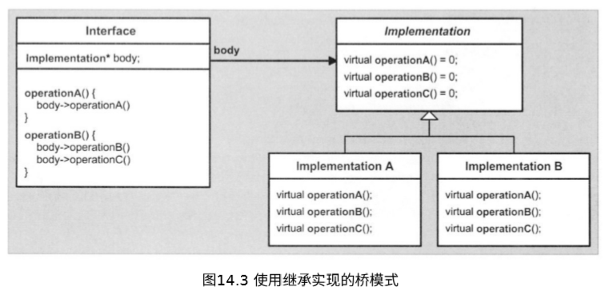

[toc]


# 模板与设计

## 1. 模板的多态威力

对面向对象的程序设计范例而言，==多态==可以说是一块基石。在`C++`中，这块基石主要是通过**继承和虚函数**来实现的。由于这两个机制（继承和虚函数）都是至少一部分**在运行期进行处理的**，因此我们把这种多态称为==动多态==；我们平常所谈论的**C++多态**指的就是这种动多态。

然而，模板也允许我们使用单一的泛型标记，来关联不同的特定行为；但这种**借助于模板的关联是在编译期进行处理的**，因此我们把这种多态称为==静多态==。在这一章里，我们将重温这两种形式的多态，然后讨论：**在何种情况下，应该使用哪一种多态。**

### 1.1 动多态

:one:在这种情况下，==多态的设计思想==主要在于：对于几个相关对象的类型，确定它们之间的一个**共同功能集**；然后在基类中，把这些共同的功能声明为**多个虚函数接口**。


### 1.2 静多态

:one:模板也能够被用于实现多态。然而，这种多态并不依赖于在基类中包含公共行为的因素；但仍然存在一种**隐式的公共性**，即应用程序的不同“形状（即类型）”都必须支持某些**使用公共语法的操作**（也就是说，相关的函数必须具有相同的名称）。另外，**具体类之间的定义是互相独立的**。于是，当用具体类对模板进行实例化的时候，这种多态的威力就显示出来了。


```c++
// poly/statichier.hpp 
#include "coord.hpp" 
class Circle 
{ 
    public: 
    void draw() const;
    Coord center_of_gravity() const;
    … 
}; 

class Line 
{ 
    public: 
    void draw() const; 
    Coord center_of_gravity() const; 
    … 
};

… 

// poly/staticpoly.cpp
#include "statichier.hpp" 
#include <vector> 
template <typename GeoObj> 
void myDraw (GeoObj const& obj)
{ 
    obj.draw();
}
...
    
int main() { 
    Line l;

    Circle c, c1, c2; 
    
    myDraw(l);    // myDraw<Line>(GeoObj&) => Line::draw() 
    myDraw(c);    // myDraw<Circle>(GeoObj&) => Circle::draw() 
    ...
}
```


### 1.3 动多态和静多态

:one:***术语***

动多态和静多态为不同的C++编程`idioms`提供了支持：

- 通过继承实现的多态是**绑定的和动态的**：
  - 绑定的含义是：对于参与多态行为的类型，具有多态行为的接口是在公共基类的设计中就预先确定的。
  - 动态的含义是：**接口的绑定**是在运行期动态完成的.

- 通过模板实现的多态是**非绑定的和静态的**：
  - 非绑定的含义是：于参与多态行为的类型，它们的接口是没有预先确定的。
  - 静态的含义是：**接口的绑定**是在编译期静态完成的。


:two:通常而言，与动多态相比，静多态被认为具有**更好的类型安全性**；因为静多态在编译期会对所有的绑定操作进行检查。

具体优缺点见书。

:three:这种新形式的静多态带来了**实现设计模式的新方法**。例如，以在C++程序设计中扮演重要角色的==桥模式==为例。我们使用桥模式的目的是：**为了能够在同一接口的多个不同实现中进行切换**。根据`DesignPatternsGoV`所言，我们通常可以使用一个指针来引用具体的实现，然后把所有的调用都委托给这个**包含具体实现的类**，从而达到我们的目的。




### 1.4 泛型程序设计

C++模板的每次使用都可以被看成是**泛型程序设计的一个实例**；然而，开发人员却经常认为泛型程序设计本身具有**一个额外的本质特性**：即在一个框架中，设计模板的目的是为了能够得到多种有用的类型组合。


## 2. trait与policy类

### 2.1 一个实例：累加一个序列

:one:首先，让我们首先假设所要计算总和的值都是**存储在一个数组**里面的，并且我们还具有一个指向数组第1个元素的指针，以及一个指向数组最后一个元素的后一位的指针，这两个指针之间的所有元素就是我们要进行求总和的元素。现在，让我们先给出一个看起来比较直接的例子：

```c++
// traits/accum1.hpp 
#ifndef ACCUM_HPP 
#define ACCUM_HPP 
template <typename T> 
inline T accum (T const* beg, T const* end) 
{ 
    T total = T(); // 假设T()事实上⽣成⼀个等于0的值
    while (beg != end) 
    { 
        total += *beg; 
        ++beg; 
    } 
    return total; 
} 
#endif // ACCUM_HPP
```

正常调用是没有问题，例如`int`数组，但是如果我们对字符数组使用，会得到意料之外的结果（因为结果溢出了）。我们可以通过引入一个**额外的模板参数**`AccY`来解决这个问题，其中`AccT`描述了变量`total`的类型（同时也是**返回类型**）。然而，这将会给该模板的所有用户都强加**一个额外的负担**：他们每次调用这个模板的时候，都要指定这个额外的类型。因此，针对我们上面的例子，我们不得不这样编写代码：

```c++
char name[] = "templates"; 
accum<int>(&name[0],&name[length])
```

:two:关于这个额外参数，另一种解决方案是对`accum()`所调用的每个`T`类型都创建**一个关联**，所关联的类型就是用来存储累加和的类型。这种关联可以被看作是类型`T`的一个特征，因此我们也把这个**存储累加和的类型**称为`T`的`trait`。于是，我们可以使用每个模板特化来写出这些关联代码：

```c++
// traits/accumtraits2.hpp 
template<typename T> 
class AccumulationTraits; 

template<> 
class AccumulationTraits<char> 
{ 
public: 
    typedef int AccT; 
}; 

template<> 
class AccumulationTraits<short> 
{ 
public: 
    typedef int AccT; 
}; 

template<> 
class AccumulationTraits<int> 
{ 
public: 
    typedef long AccT; 
}; 

template<> 
class AccumulationTraits<unsigned int> 
{ 
public: 
    typedef unsigned long AccT;
}; 

template<>
class AccumulationTraits<float> 
{ 
public: 
    typedef double AccT; 
};
```

在上面代码中，模板` AccumulationTraits `被称为一个`trait`模板，因为它含有它的参数类型的一个`trait`（通常而言，可以存在多个`trait`和多个参数）。对这个模板，我们并**不提供一个泛型的定义**，因为在我们不知道参数类型的前提下，并不能确定应该选择什么样的类型作为**和的类型**。有了这个想法之后，我们就可以这样改写前面的`accum()`模板：

```c++
// traits/accum2.hpp 
#ifndef ACCUM_HPP 
#define ACCUM_HPP 
#include "accumtraits2.hpp" 

template <typename T> 
inline typename AccumulationTraits<T>::AccT accum (T const* beg, T const* end) 
{ 
    typedef typename AccumulationTraits<T>::AccT AccT; 
    AccT total = AccT(); 
    
    while(beg != end) 
    { 
        total += *beg; 
        ++beg; 
    } 
    return total;
} 

#endif 
// ACCUM_HPP 
```

现在，基本内置类型都不会产生结果数值溢出的问题了。进一步而言，如果有新的类型要使用`accum()`模板，那么只需声明`AccumulationTraits`模板的一个**新的显式特化**，来关联`AccT`和该类型即可。我们还看到，任何类型都可以和`AccT`进行关联，来实现这种特性。

:three:***value trait***

显然，我们并不能保证上面的构造函数`AccT()`会返回一个符合条件的值，可以用来开始这个**求和循环**。而且，类型`AccT`也不一定具有一个**缺省构造函数**。我们需要给`AccumulationTraits`添加一个`value trait`：

```c++
// traits/accumtraits3.hpp 

template<typename T> 
class AccumulationTraits; 

template<> 
class AccumulationTraits<char> 
{ 
public: 
    typedef int AccT; 
    static AccT const zero = 0; 
}; 

template<> 
class AccumulationTraits<short> 
{ 
public: 
    typedef int AccT; 
    static AccT const zero = 0; 
}; 

template<> 
class AccumulationTraits<int> 
{ 
public: 
    typedef long AccT;
    static AccT const zero = 0; 
}; 
…
```

```c++
typedef typename AccumulationTraits<T>::AccT AccT; 
AccT total = AccumulationTraits<T>::zero;
while (beg != end) {
    ...
```

然而，这种解决方案的一个缺点是：在所在类的内部，C++只允许我们对**整型和枚举类型**初始化**静态成员变量**。显然，对于诸如**浮点型的其他类型**，也包括我们自己定义的类，就不能使用上面的解决方案。

但若是在源文件中初始化，编译器通常不会知道位于其他文件的定义。因此，我们趋向于实现下面的这种`value trait`：

```c++
 // traits/accumtraits4.hpp 
template<typename T> 
class AccumulationTraits; 

template<> 
class AccumulationTraits<char> 
{ 
public:
    typedef int AccT; 
    static AccT zero() { 
        return 0; 
    } 
}; 

template<> 
class AccumulationTraits<short> 
{ 
public: 
    typedef int AccT; 
    static AccT zero() 
    { 
        return 0; 
    } 
}; 
...
```

下面是`trait`概念的关键部分：`trait`提供了一种配置具体元素（通常是类型）的途径，而该途径主要是用于**泛型计算**。

:four:***参数化trait***

在上一节所使用的`trait`被称为`fixed trait`，因为一旦定义了这个`trait`，就不能在算法中对它进行改写。然而，在有些情况下我们需要对`trait`进行改写。

从原则上讲，**参数化主要的目的在于：添加一个具有缺省值的模板参数**，而且该缺省值是由我们前面介绍的模板决定的。在这种具有缺省值的情况下，许多用户就可以不需要提供这个额外的模板实参；但对于有特殊需求的用户，也可以**改写这个预设的和类型**。对于这个特殊的解决方案，唯一的不足在于：我们并不能对函数模板预设**缺省模板实参**。

就现在的情况而言，通过把算法实现为**一个类**，我们就可以绕过上面这个不足。这同时也说明了：除了函数模板之外，在类模板中也可以很容易地使用`trait`。在我们的应用程序中，唯一的缺点就是：**类模板不能对它的模板参数进行推导**，而是必须显式提供这些模板参数。因此，我们需要编写如下形式的代码：

```c++
Accum<char>::accum(&name[0], &name[length]) 
```

```c++
// traits/accum5.hpp 
#ifndef ACCUM_HPP 
#define ACCUM_HPP 
#include "accumtraits4.hpp" 
template <typename T, typename AT = AccumulationTraits<T>> 
class Accum 
{ 
public:
    
    static typename AT::AccT accum (T const* beg, T const* end) 
    { 
        typename AT::AccT total = AT::zero(); 
        while (beg != end) 
        { 
            total += *beg; 
            ++beg; 
        } 
        return total; 
    } 
}; 
#endif // ACCUM_HPP 
```

### 2.2 Policy和Policy类

:one:还可以有其他种类的累积。例如，我们可以对序列中的给定值进行求积；如果这些值是字符串的话，还可以对它们进行连接。在这所有的情况中，针对`accum()`的所有操作，唯一需要改变的只是`total+=*beg`操作。于是，我们就把这个操作称为该累积过程的一个`policy`。因此，**一个Policy类**就是一个提供了一个接口的类，该接口能够在算法中应用一个或多个`Policy`。

下面是一个例子，它说明了如何在我们的**accum类模板**中引入这样的一个接口：

```c++
// traits/accum6.hpp 
#ifndef ACCUM_HPP 
#define ACCUM_HPP 
#include "accumtraits4.hpp" 
#include "sumpolicy1.hpp" 

template <typename T, typename Policy = SumPolicy, typename Traits = AccumulationTraits<T>> 
class Accum 
{
public: 
    typedef typename Traits::AccT AccT; 
    
    static AccT accum (T const* beg, T const* end) 
    { 
        AccT total = Traits::zero(); 
        while (beg != end) 
        { 
            Policy::accumulate(total, *beg); 
            ++beg; 
        } 
        return total; 
    }
}; 
#endif // ACCUM_HPP
```

其中**SumPolicy类**可以编写如下：

```c++
// traits/sumpolicy1.hpp 
#ifndef SUMPOLICY_HPP 
#define SUMPOLICY_HPP 

class SumPolicy 
{ 
public: 
    template<typename T1, typename T2> 
    static void accumulate (T1& total, T2 const & value) 
    { 
        total += value; 
    } 
}; 
#endif // SUMPOLICY_HPP
```

还有更好的实现方法，之后在讲。

:two:`policy`和`trait`具有许多共同点，但是==策略更加注重于行为，而特性则更加注重于类型==。

`trait class`：==是一种用于代替模板参数的类==。作为一个类，它可以是有用的类型，也可以是常量；作为一个模板，它提供了一种实现**“额外层次间接性”**的途径，而正是这种**“额外层次间接性”**解决了所有的软件问题。

因此，我们通常都会使用下面这些、并不是非常准确的定义：

- `trait`表述了模板参数的一些自然的额外属性。
- `policy`表述了泛型函数和泛型类的一些**可配置行为**——通常都具有被经常使用的缺省值。

关于两者的更多特征，见书。

:three:还存在另一种实现方法，即使用**类模板**来设计这个`policy class`接口，而这个`policy class`也就被用作**模板的模板实参**。例如，我们可以如下把`SumPolicy`改写成一个模板：

```c++
// traits/sumpolicy2.hpp 
#ifndef SUMPOLICY_HPP 
#define SUMPOLICY_HPP 

template <typename T1, typename T2> 
class SumPolicy 
{ 
public: 
    static void accumulate (T1& total, T2 const & value) 
    { 
        total += value; 
    } 
};
#endif 
// SUMPOLICY_HPP
```

于是，可以对`Accum`的接口进行修改，从而使用一个**模板的模板参数**，如下：

```c++
// traits/accum8.hpp 
#ifndef ACCUM_HPP 
#define ACCUM_HPP
#include "accumtraits4.hpp" 
#include "sumpolicy2.hpp" 

template<typename T, template<typename, typename> class Policy = SumPolicy, typename Traits = AccumulationTraits<T>> 
class Accum 
{ 
public: 
    typedef typename Traits::AccT AccT; 
    static AccT accum (T const* beg, T const* end) 
    { 
        AccT total = Traits::zero(); 
        while (beg != end) 
        { 
            Policy<AccT,T>::accumulate(total, *beg); 
            ++beg; 
        } 
        return total; 
    } 
}; 
#endif // ACCUM_HPP
```

然而，这种利用模板的模板参数的解决方案也存在一个缺点：`policy`类现在必须被写成模板，而且我们的接口中还定义了**模板参数的确切个数**。遗憾的是，这个定义会让我们无法在`policy`中添加**额外的模板参数**。

:four:在我们结束`trait`和`policy`的介绍之前，让我们来看`accum()`的一个新版本，它添加了处理普通迭代器的功能，而不仅仅是指针。有趣的是，该版本的`accum()`仍然允许我们使用**指针**来调用`accum()`，这是因为**C++标准库**提供了所谓的`iterator trait`。因此，我们可以定义`accum()`的初期版本如下：

```c++
// traits/accum0.hpp 
#ifndef ACCUM_HPP 
#define ACCUM_HPP 
#include <iterator> 

template <typename Iter> 
inline typename std::iterator_traits<Iter>::value_type accum (Iter start, Iter end) 
{ 
    typedef typename std::iterator_traits<Iter>::value_type VT; 
    VT total = VT(); // 假设VT()际上⽣成⼀0值 
    while (start != end) 
    { 
        total += *start; 
        ++start; 
    } 
    return total; 
}
#endif // ACCUM_HPP 
```

`iterator_trait`结构封装了迭代器的所有相关属性。由于存在一个**适用于指针的局部特化**，所以普通指针类型也能够使用这些`trait`。


### 2.3 类型函数:star:

:one:更准确而言，**函数可以被称为值函数**：函数接收的参数是某些值，而且函数的返回结果也是值。现在，我们要说明的是==类型函数==：一个接收某些类型实参，并且生成**一个类型**作为**函数的返回结果**，例如：`sizeof`。

在这一节后面的内容里，我们将开发一些**具有普遍用途的类型函数**，而且它们都可以被用作`trait`类。

:two:第一个萃取用途是普遍的，我们可以在迭代器的设计中用到：

```c++
// 萃取机 traits
template <class _Iterator>
struct iterator_traits {
  typedef typename _Iterator::iterator_category iterator_category;
  typedef typename _Iterator::value_type        value_type;
  typedef typename _Iterator::difference_type   difference_type;
  typedef typename _Iterator::pointer           pointer;
  typedef typename _Iterator::reference         reference;
};

// 原生指针的traits 偏特化
template <class _Tp>
struct iterator_traits<_Tp*> {
  typedef random_access_iterator_tag iterator_category;
  typedef _Tp                         value_type;
  typedef ptrdiff_t                   difference_type;
  typedef _Tp*                        pointer;
  typedef _Tp&                        reference;
};

// 原生常量指针 pointer-to-const 的traits 偏特化
template <class _Tp>
struct iterator_traits<const _Tp*> {
  typedef random_access_iterator_tag iterator_category;
  typedef _Tp                         value_type;
  typedef ptrdiff_t                   difference_type;
  typedef const _Tp*                  pointer;
  typedef const _Tp&                  reference;
};
```

:three:运用下面的类型函数，我们能够确定某个类型是否为`class`类型：

```c++
// traits/isclasst.hpp 
template<typename T> 
class IsClassT 
{ 
private: 
    typedef char One; 
    typedef struct { char a[2]; } Two; 
    
    template<typename C> 
    static One test(int C::*); 
    
    template<typename C> 
    static Two test(...);
    
public:
    enum { Yes = sizeof(IsClassT<T>::test<T>(0)) == 1 };
    
	enum { No = !Yes };
}; 
```

上面的模板使用了==SFINAE原则==（替换失败并非错误）。这里用到**SFINAE原则**的目的在于找到这样的一个类型构造：它对**class类型**是无效的，而对其他的类型则是有效的；或者相反。于是，在这里我们可以依赖于下面这个事实：只有当`C`是一个**class类型**的时候，身为成员指针的类型构造`C::*`才会是有效的。

> C++允许定义**形参个数和类型不确定的函数**。例如，C语言中的标准函数printf便使用这种机制。在声明不确定形参的函数时，形参部分可以使用省略号 “`…`”代替。“`…`”告诉编译器，在函数调用时不检查形参类型是否与实参类型相同，也不检查参数个数。
>
> 这样我们就可以解释上面了，只有当我们传入class类型时，sizeof的结果才是`1`。

:four:到目前为止，我们已经研究并且开发了**单一类型的类型函数**：即给定一个类型，我们可以定义其它相关的类型或者参数。然而，我们通常都需要开发**依赖于多个实参的类型函数**。一个典型的例子就是`promotion trait `，它在编写运算符模板的时候非常有用。为了继续阐述这种想法，让我们先编写一个函数模板，用于对两个**Array容器**进行相加：

```c++
template<typename T> 
Array<T> operator+ (Array<T> const&, Array<T> const&); 
```

这看起来非常好。但是，由于语言允许我们把一个**char类型的值**加到一个int值，因此我们期望可以对数组也实现这种混合类型的操作，但返回值是什么？

```c++
template<typename T1, typename T2> 
Array<???> operator+ (Array<T1> const&, Array<T2> const&); 
```

然而，借助于`promotion trait`，我们就可以解决上面声明所给出的问题。如下所示：

```c++
template<typename T1, typename T2> 
Array<typename Promotion<T1, T2>::ResultT> operator+ (Array<T1> const&, Array<T2> const&); 
//或者
template<typename T1, typename T2> 
typename Promotion<Array<T1>, Array<T2>>::ResultT operator+ (Array<T1> const&, Array<T2> const&); 
```

实际上，对于`Promotion`模板，并不存在确切的定义；因此，我们最好是让这个基本模板处于**未定义状态**：

```c++
template<typename T1, typename T2> 
class Promotion;
```

另外，如果**两个类型的大小不一样**，那么我们还需要作出另一个选择：我们将提升**类型更强大的类型**。我们可以通过特殊模板`lfThenElse`来实现这一点，它会接受一个布尔的非类型模板参数，然后根据Boolean参数的值，在两个类型参数之中选出其中一个：

```c++
// traits/ifthenelse.hpp 
#ifndef IFTHENELSE_HPP 
#define IFTHENELSE_HPP 

// 基模: 根据第一个参数1来决是选择参数2，还是参数3 
template<bool C, typename Ta, typename Tb> 
class IfThenElse; 

// true的话则选择2 
template<typename Ta, typename Tb> 
class IfThenElse<true, Ta, Tb> 
{ 
    public: typedef Ta ResultT; 
}; 

// false的话则选择3 
template<typename Ta, typename Tb> 
class IfThenElse<false, Ta, Tb> 
{ 
    public: typedef Tb ResultT; 
}; 

#endif // IFTHENELSE_HPP
```

有了上面的这些代码之后，我们能够根据所需要提升的类型的大小，从而在`T1`、`T2`、`void`三者之间作出选择，并且实现**Promotion模板**如下:

```c++
// traits/promote1.hpp 
// 针对类型提升（type promotion）的基本模板
template<typename T1, typename T2> 
class Promotion 
{ 
public: 
    typedef typename IfThenElse< (sizeof(T1) > sizeof(T2)), T1, 
    		typename IfThenElse< (sizeof(T1) < sizeof(T2)), T2, void >
            ::ResultT >::ResultT ResultT; 
}; 

// traits/promote2.hpp 
// 针对两个相同类型的偏特化 
template<typename T> 
class Promotion<T, T> 
{ 
public: 
    typedef T ResultT; 
};
```

为了记录**基本类型的提升**，我们还需要实现一系列针对基本类型的特化。在此，可以借助宏来减少源代码的数量：

```c++
// traits/promote3.hpp 
#define MK_PROMOTION(T1,T2,Tr)      		\ 
template<> class Promotion<T1, T2> { 	\ 
public:                					\ 
    typedef Tr ResultT;         		\ 
};                   					\ 
										\ 
template<> class Promotion<T2, T1> { 	\ 
public:                					\ 
    typedef Tr ResultT;         	\ 
}; 
```

一旦为基本类型和一些必要的枚举类型定义好了`Promotion`，我们就可以通过**局部特化**来表达其他的提升规则。例如：

```c++
// traits/promotearray.hpp 
template<typename T1, typename T2> 
class Promotion<Array<T1>, Array<T2>> 
{ 
public: 
    typedef Array<typename Promotion<T1,T2>::ResultT> ResultT; 
}; 

template<typename T> 
class Promotion<Array<T>, Array<T>> 
{ 
public: 
    typedef Array<typename Promotion<T,T>::ResultT> ResultT; 
}; 
```

对于最后一个局部特化，我们需要给予更大的关注。我们刚开始可能会认为前面**针对相同类型的特化** （`Promotion<T,T>`）已经考虑了这种情况。然而遗憾的是，就特化程度而言，局部特化`Promotion<Array<T1>,Array<T2>>`和局部特化`Promotion<T,T>`是一样的。为了避免产生这种**模板选择二义性**，我们添加了最后一个局部特化，它比前面两个模板中的任何一个都更加特殊化。


### 2.4 Policy Trait

到目前为止，我们给出了几个**trait模板**的例子，用于确定模板参数的一些属性：譬如这些参数表示的是什么类型；在混合类型的操作中，应该提升哪一个类型等等。我们把这些trait称为==`property trait`==。

另一方面，还存在其他类型的`trait`，它们定义了**应该如何对待这些类型**，我们把这类trait称为==policy trait==。这让我们想起前面说讨论的`policy class`的概念（而且我们已经指出：`trait`和`policy`之间的区别并不是很明显）；然而，`policy trait`针对的是与模板参数相关的一些更加独有的属性（我们知道，`policy class`通常都是**独立于其他模板参数的**)。

尽管我们通常可以把`property trait`实现为**类型函数**，但是对于`policy trait`而言，我们通常是把该`policy`封装在成员函数内部。在进行深入阐述之前，让我们先来看**一个类型函数的例子**，它定义了一个**用于传递只读参数的policy**。

:one:**参数以何种方式传递**是一个影响性能的大问题，特别是引入了模板之后，就更为复杂。可以使用`policy trait`模板来处理上面这个问题，而且该`policy trait`实际上是一个==类型函数==：该函数可以根据不同的情况（即类型大小)，将把实参类型`T`映射为`T`或者`T const&`，即在这两种类型中挑选出一种**最佳参数类型**。基于下面的例子，我们做出一个近似的假设：对于不大于“2个指针"大小的类型，基本模板将采用**"传值”的方式**传递参数，而对于其他的类型，则采用**“传递const引用”的方式**传递参数。

```c++
template<typename T> 
class RParam 
{ 
public: 
    typedef typename IfThenElse< sizeof(T) <= 2 * sizeof(void*), 
    		T, T const&>::ResultT Type; 
};
```

另一方面，对于**容器类型**，即使`sizeof`函数返回的是一个很小的值，但也可能会涉及到昂贵的拷贝构造函数。因此，我们需要编写如下的许多特化和局部特化：

```c++
template<typename T> 
class RParam<Array<T>> 
{ 
public: 
    typedef Array<T>const& Type; 
}; 
```

由于我们处理的都是C++中的常见类型，所以我们期望在基本模板中能够对**非类类型**以传值的方式进行调用。

```c++
template<typename T> 
class RParam 
{ 
public: 
    typedef typename IfThenElse<IsClassT<T>::No, T, T const&>::ResultT Type; 
};
```

但无论是以上那种方法，现在直接拿来使用，都显得很麻烦。

:two:为了继续针对性能的讨论，我们引入了另一个`policy trait`模板，它将选择出最佳的操作，来**拷贝、交换或者移动**某一特定类型的元素。

因此，我们期望能够用一个**合适的trait模板**，来确定上面所讨论的这些问题。对于泛型定义，我们将区分`class`类型和`nonclass`类型，因为对于`nonclass`类型而言，我们并不需要在意用户自己自定义的拷贝构造函数和拷贝赋值运算符。这一次，我们将使用**继承**，从而能够在两种trait实现中进行选择。

```c++
// traits/csmtraits.hpp 
template <typename T> 
class CSMtraits : public BitOrClassCSM<T, IsClassT<T>::No> 
{ }; 
```

`CSMtraits`的实现完全委托给了`BitOrClassCSM<>`的特化（其中`CSM`是由"copy、swap、move"的第1个字母组成的）。基类的第2个模板参数表示：是否能够安全地使用**位元拷贝**，来实现多种操作。从上面代码可以看出，虽然**泛型定义**保守地假设：不能对**class类型**进行**安全的位元拷贝**，但对某些已知为`POD `（plain old data type）的类型，我们就可以特化`CSMtraits`来获得更好的性能。

```c++
template<> 
class CSMtraits<MyPODType> : public BitOrClassCSM<MyPODType, true> 
{ }; 
```

下面是一个不进行偏特化的例子：

```c++
// traits/csm1.hpp 
#include <new> 
#include <cassert> 
#include <stddef.h> 
#include "rparam.hpp" 
// 基模
template<typename T, bool Bitwise> class BitOrClassCSM; 

template<typename T> 
class BitOrClassCSM<T, false> 
{ 
public: 
    static void copy(typename RParam<T>::ResultT src, T* dst) 
    { 
        *dst = src; 
    } 
    
    static void copy_n(T const* src, T* dst, size_t n) 
    { 
        for (size_tk=0;k<n; ++k) 
        { 
            dst[k] = src[k]; 
        } 
    } 
    
    static void copy_init(typename RParam<T>::ResultT src, void* dst) 
    { 
        ::new(dst) T(src);
    } 
    
    static void copy_init_n (T const* src, void* dst, size_t n) 
    {
        for (size_tk = 0; k < n; ++k) 
        { 
            ::new((void*)((char*)dst + k)) T(src[k]); 
        } 
    } 
    
    static void swap (T* a, T* b) 
    { 
        T tmp(*a); 
        *a = *b; 
        *b = tmp; 
    } 
    
    static void swap_n (T* a, T* b, size_t n) 
    { 
        for (size_tk=0;k<n; ++k) 
        { 
            T tmp(a[k]); 
            a[k] = b[k]; 
            b[k] = tmp; 
        } 
    }
    ...
}; 
```

**位安全版本**的例子中具体见书。


## 3. 模板与继承

### 3.1 命名模板参数

:one:许多模板技术往往让**类模板**拖着一长串类型参数；不过许多参数都设有**合理的缺省值**，往往像这样：

```c++
template <typename Policy1 = DefaultPolicy1, 
	      typename Policy2 = DefaultPolicy2, 
		  typename Policy3 = DefaultPolicy3, 
		  typename Policy4 = DefaultPolicy4> 
class BreadSlicer 
{ ... };
```

跟这样的`BreadSlicer<DefaultPolicy1,DefaultPolicy2,Custom>`相比，`BreadSlicer<Policy3= Custom>`显然更有吸引力，下⾯我们来把这吸引力变为现实。

我们的考虑主要是设法将**缺省类型值**放到一个基类中，再**根据需要通过派生覆盖掉某些类型值**。这样，我们就不再直接指定类型实参了，而是通过**辅助类**完成，如`BreadSlicer<Policy3_is<Custom>>`。既然用辅助类做模板参数，每个辅助类都可以描述上述`4`个`policy`中的任意一个，故所有模板参数的缺省值均相同：

```c++
template <typename PolicySetter1 = DefaultPolicyArgs, 
typename PolicySetter2 = DefaultPolicyArgs, 
typename PolicySetter3 = DefaultPolicyArgs, 
typename PolicySetter4 = DefaultPolicyArgs> 
class BreadSlicer 
{ 
     typedef PolicySelector<PolicySetter1, PolicySetter2, PolicySetter3, PolicySetter4> Policies;
}; 
```

剩下的麻烦事就是实现模板`PolicySelector`。这个模板的任务是利用`typedef`将各个模板实参合并到一个单一的类型（即`Disoriminator`)，该类型能够根据**指定的非缺省类型**（如`policy1-is`的`Policy`)，改写缺省定义的typedef成员（如`Default Policies`的`DefaultPolicy1`) 。其中合并的事情可以让继承来干：

```c++
// PolicySelector<A,B,C,D> ⽣成 A,B,C,D作为基类
// Discriminator<> 使Policy Seletor可以多次继承相同的基类
template<typename Base, int D>
class Discriminator : public Base 
{};

template <typename Setter1, typename Setter2, typename Setter3, typename Setter4>
class PolicySelector : public Discriminator<Setter1, 1>,
                                    public Discriminator<Setter2, 2>,
                                    public Discriminator<Setter3, 3>,
                                    public Discriminator<Setter4, 4> 
{};
```

注意，由于**中间模板**`Discriminator`的引入，我们就可以一致处理各个**Setter类型**（不能直接从多个相同类型的基类继承，但可以借助**中间类**间接继承）。

如前所述，我们还需把缺省值集中到一个基类中：

```c++
class DefaultPolicies {
public:
     typedef DefaultPolicy1 P1;
     typedef DefaultPolicy2 P2;
     typedef DefaultPolicy3 P3;
     typedef DefaultPolicy4 P4;
};
```

不过由于会多次从这个基类继承，我们必须小心以避免**二义性**，故用==虚继承==：

```c++
class DefaultPolicyArgs : virtual public DefaultPolicies {
};
```

最后，我们只需写几个模板覆盖掉**缺省的policy参数**：

```c++
template <typename Policy>
class Policy1_is : virtual public DefaultPolicies {
public:
    typedef Policy P1; // 
};

template <typename Policy>
class Policy2_is : virtual public DefaultPolicies {
public:
    typedef Policy P2; //
};
...
```

大功告成。我们把模板`BreadSlicer`实例化为：

```c++
BreadSlicer<Policy3_is<CustomPolicy>> bc;
```

这时模板``BreadSlicer`中的类型`Polices`被定义为：

```c++
PolicySelector<Policy3_is<CustomPolicy>,
               DefaultPolicyArgs,
               DefaultPolicyArgs,
               DefaultPolicyArgs>
```


由类模板`Discriminator`的帮助，我们得到了如图16.1所示的类层次。从中可以看出，**所有的模板实参都是基类**，而它们有共同的虚基类`DefaultPolicies`，正是这个共同的虚基类定义了`P1`、`P2`、`P3`和`P4`的缺省类型；不过，其中一个派生类`Policy3_is<>`重定义了`P3`。根据==优势规则==（domination rule），**重定义的类型隐藏了基类中的定义**，这里没有**二义性问题**。

> 对以上技术进行总结，这里的关键是在于：我们使用了继承来作为技术核心，然后用作为用户参数的派生类来重写基类的成员。
>


### 3.2 空基类优化（EBCO）

#### 布局原则

> C++的设计者不允许类的大小为0，哪怕它什么也没有。

:one:虽然不能存在**零大小**的类，但当空类作为基类时，只要不会与同一类型的另一个对象或子对象分配在同一地址，就不需为其分配任何空间。让我们通过实例来看看这个所谓的==空基类优化==（`EBCO`）：

```c++
// inherit/ebco1.cpp
#include <iostream>
class Empty 
{
	typedef int Int; // typedef成员并不会使类成为非空
};

class EmptyToo : public Empty 
{
};

class EmptyThree : public EmptyToo 
{
};

int main()
{
    std::cout << "sizeof(Empty): " << 
        sizeof(Empty)
        << '\n';
    std::cout << "sizeof(EmptyToo): " <<
        sizeof(EmptyToo)
        << '\n';
    std::cout << "sizeof(EmptyThree): " <<
        sizeof(EmptyThree)
        << '\n';
}
```


想想在空基类的优化下，下例的结果如何：

```c++
// inherit/ebco2.cpp
#include <iostream>
class Empty {
    typedef int Int; 
};

class EmptyToo : public Empty {
};

class NonEmpty : public Empty, public EmptyToo {
};

int main()
{
    std::cout << "sizeof(Empty): " << sizeof(Empty) <<
        '\n';
    std::cout << "sizeof(EmptyToo): " << sizeof(EmptyToo)
        << '\n';
    std::cout << "sizeof(NonEmpty): " <<
        sizeof(NonEmpty) << '\n';
}
```


:two:对空基类优化进行限制的根本原因在于，我们需要能比较**两个指针是否指向同一对象**。由于指针几乎总是用地址作**内部表示**，所以我们必须保证两个不同的地址对应两个不同的对象。

虽然这种约束看起来并不非常重要，但是在实际应用中的许多类都是继承自**一组定义公共类型的基类**，当这些类作为子对象出现在同一对象中时，问题就凸现出来了，此时优化应被禁止。

#### 成员做基类

:one:对于数据成员，则不存在类似**空基类优化**的技术，否则遇到**指向成员的指针**时就会出问题。那么我们不妨考虑将**成员变量**实现为（私有）基类的形式，不过这都需要我们在后面对该类型进行**特殊处理**。

考虑一个平凡的例子：

```c++
template <typename T1, typename T2> 
class MyClass 
{ 
private: 
    T1 a; 
    T2 b;
    … 
};
```

模板参数`T1`和`T2`之一或全部，都很有可能为**空类**，那像上面这样老老实实地表示`MyClass<T1 T2>`就不能得到**最优布局**，每个这样的实例可能会浪费**一个字的内存**。把模板参数**直接作为基类**可以解决这个问题：

```c++
template <typename T1, typename T2> 
class MyClass : private T1, private T2 
{ 
}; 
```

但直接这样写会有问题，例如`T1`不是类，比如`int`或`union`。而且始终有一个大问题：==增加基类会改变接口==。

:two:如果已知一个模板参数的类型必然是**类**，该模板的**另一个成员类型不是空类**，那么有一个办法更可行，其大致想法是借助`EBCO`的东风，把可能为空的类型参数与这个成员“合”起来。比如对于：

```c++
template <typename CustomClass> 
class Optimizable 
{
private: 
    CustomClass info;  // 可能为空 
    void*   storage; 
    … 
}; 
```

我们可将其改写为：

```c++
template <typename CustomClass> 
class Optimizable 
{ 
private: 
    BaseMemberPair<CustomClass, void*> info_and_storage; 
    … 
};
```

即使不管模板`BaseMemberPair`的实现，光`Optimizable`就已经变得更为冗长。但应用了类似方法后，对于使用者而言，**许多模板库的性能都得以显著提高**，故实现的相对复杂是值得的。

```c++
template <typename Base, typename Member> 
class BaseMemberPair : private Base 
{
private: 
    Member member; 
    
public: 

    BaseMemberPair (Base const & b, Member const & m) : Base(b), member(m) { } 
    
    Base const& first() const 
    { 
        return (Base const&)*this; 
    } 
    
    Base& first() 
    { 
        return (Base&)*this; 
    } 
    
    Member const& second() const 
    { 
        return this->member; 
    } 
    
    Member& second() 
    { 
        return this->member; 
    } 
};

```


### 3.3 奇特的递归模板模式（CRTP）

:one:`CRTP`代表了类实现技术中一种通用的模式，即**派生类将本身作为模板参数传递给基类**。最简单的情形如下：

```c++
template <typename Derived> 
class CuriousBase 
{ 
    … 
}; 

class Curious : public CuriousBase<Curious> 
{ 
    … 
}; 
```

```c++
template <typename Derived> 
class CuriousBase 
{ 
    … 
}; 

template <typename T> 
class CuriousTemplate : public CuriousBase<CuriousTemplate<T>> 
{ 
    … 
}; 
```

从这个示例出发，不难再举出使用**模板的模板参数**的方式：

```c++
template <template<typename> class Derived>
class MoreCuriousBase 
{ 
    … 
}; 

template <typename T> 
class MoreCurious : public MoreCuriousBase<MoreCurious> 
{ 
    … 
}; 
```

:two:`CRTP`的一个简单应用是：==记录某个类的对象构造的总个数==。数**对象个数**很简单，只需引入一个整数类型的静态数据成员，分别在**构造函数和析构函数**中进行**递增和递减操作**。不过，要在每个类里都这么写就很繁琐了。有了`CRTP`，我们可以先写一个模板：

```c++
#include <stddef.h> 
template <typename CountedType> 
class ObjectCounter 
{ 
private: 
    static size_t count;  // 存在的对象的个数
    
protected: 
 
    ObjectCounter() 
    { 
        ++ObjectCounter<CountedType>::count; 
    } 
    
	ObjectCounter (ObjectCounter<CountedType> const&)
    {
		++ObjectCounter<CountedType>::count;
    } 
    
    ~ObjectCounter() 
    { -
        -ObjectCounter<CountedType>::count; 
    } 
    
public: 
  
    static size_t live() 
    { 
        return ObjectCounter<CountedType>::count; 
    } 
}; 

// ⽤0来初始化count 
template <typename CountedType> 
size_t ObjectCounter<CountedType>::count = 0;
```

一般地，`CRTP`适用于仅能用作成员函数的接口（如构造函数、析构函数和下标运算算子[]等）的实现提取出来。


### 3.4 参数化虚拟性

:one:C++允许通过模板**直接参数化**`3`种实体：类型、常数和模板。同时，模板还能**间接参数化其他属性**，比如==成员函数的虚拟性==。下面我们来看看这个不同寻常的技术：

```c++
#include <iostream> 
class NotVirtual 
{ }; 

class Virtual 
{ 
public: 
    virtual void foo() { } 
}; 

template <typename VBase> 
class Base : private VBase 
{     
public:
    
    // foo()的虚拟性依赖于它在基类VBase(如果存在基类的话)中的声明
    void foo() 
    { 
        std::cout << "Base::foo()" << '\n'; 
    }
}; 

template <typename V> 
class Derived : public Base<V> 
{ 
public: 
    void foo() 
    { 
        std::cout << "Derived::foo()" << '\n'; 
    } 
}; 

int main() 
{ 
    Base<NotVirtual>* p1 = new Derived<NotVirtual>; 
    p1->foo(); // 调⽤Base::foo() 
    Base<Virtual>* p2 = new Derived<Virtual>; 
    p2->foo(); // 调⽤ Derived::foo() 
}
```

虽然这项技术可以让一个类模板身兼两职：==既可以用作实例化，也可用作继承==，而且两种方式的行为功能完全不同。但是，这无疑是一把双刃剑，除非经过深思熟虑而做出这样的设计决策，否则，一般我们更倾向于为此类模板减负，将功能分散。


## 4. metaprogram

==元编程==含有“==对一个程序进行编程==”的意思。换句话说，编程系统将会执行我们所写的代码，来生成新的代码，而这些新代码才真正实现了我们所期望的功能。通常而言，**元编程**这个概念意味着一种**反射的特性**：元编程组件只是程序的一部分，而且它也只生成一部分代码或者程序。

**我们为什么需要元编程呢**？和大多数程序设计技术一样，**使用元编程的目的**是为了实现更多的功能，并且使花费的开销更小。另一方面，**元编程的最大特点**在于：某些用户自定义的计算可以在程序翻译期进行，而这通常都能够在性能或者接口简单性方面带来好处；甚至为两方面同时带来好处。


### 4.1 metaprogram的第一个实例

:one:==模板实例化机制==是一种**基本的递归语言机制**，可以用于在编译期执行复杂的计算。因此，这种随着**模板实例化**所出现的**编译期计算**通常就被称为==模板元编程==。

在深入了解**元编程的细节**之前，让我们先来看一个简单的例子。下面的程序给出了如何在编译期计算`3`的幂：

```c++
// ⽤于计算3的N次方的基本模板 
template<int N> 
class Pow3 
{ 
public: 
    enum { result = 3 * Pow3<N-1>::result }; 
}; 

// ⽤于结束递归的全局特化
template<> 
class Pow3<0> 
{ 
public: 
    enum { result = 1 }; 
}; 

int main() 
{
    std::cout << "Pow3<7>::result = " << Pow3<7>::result << '\n'; 
} 
```

在这里，`Pow3<>`模板（包含它的特化）就被称为一个`TemplatemetaProgramming`。它描述一些可以在**编译期**进行求值的计算，而这整个求值过程属于**模板实例化过程的一部分**。从表面上看来，上面的这些实现相对比较简单，而且用处也不大；但在某些情况下，==模板元编程==却是非常有用的。


### 4.2 枚举值和静态常量

:one:在原来的**C++编译器**中，在类声明的内部，**枚举值**是声明“==真常值==”（也称为**常量表达式**）的唯一方法。然而，现在的情况已经发生了改变，**C++的标准化过程**引入了**在类内部进行静态常量初始化**的概念。可以使用下面的简短例子来阐明：

```c++
struct TrueConstants 
{ 
    enum { Three = 3 }; 
    static int const Four = 4; 
}; 
```

在上面例子中，`Four`就是一个“**真常量**”（`Constexpr`）——和`Three`一样。

:two:有了上面这个性质之后，我们的**Pow3元程序**可以更改如下：

```c++
template<int N> 
class Pow3 
{ 
public: 
    static int const result = 3 * Pow3<N-1>::result; 
}; 

template<> 
class Pow3<0> 
{
public: 
    static int const result = 1; 
};
```

此版本存在一个**缺点**：==静态成员变量只能是左值==。因此，如果：

```c++
void foo(int const&);
foo(Pow3<7>::result); 
```

那么编译器将必须传递`Pow3<7>::result`的地址，而这会强制**编译器实例化静态成员的定义**，并为该定义分配内存。于是，该计算将不再局限于**完全的“编译期”效果**。

然而，==枚举值却不是左值==。因此，当你通过**引用**传递枚举值的时候，并**不会使用任何静态内存**，就像是以`Constexpr`常量的形式传递这个完成计算的值一样。基于这些考虑，在本书的剩余章节里，我们将会**使用枚举值**，而放弃使用静态常量。


### 4.3 第2个例子：计算平方根

:one:让我们看一个稍微复杂的例子：一个用于计算**值N的平方根**的元程序，如下所示：

```c++
template<int N, int LO = 0, int HI = N> 
class Sqrt 
{ 
public: 
    // 计算中点 
    enum { mid = (LO + HI + 1) / 2 }; 
    
    // 借助二分查找一个较小的result 
    enum { result = (N < mid * mid) ? 
           Sqrt<N, LO, mid-1>::result : 
           Sqrt<N, mid, HI>::result }; 
}; 

// 局部特化，适用于LO等于HI 
template<int N, int M> 
class Sqrt<N, M, M> 
{ 
public: 
    enum { result = M };
};
```

具体分析见书（比较简单，就是一个递归实例化的过程）。

最后，当仔细考察这整个过程的时候，我们会发现最终将会产生**数量庞大的实例化体**，总数大约是`N`的两倍。事实上，这并不是我们所期望的，因为对于大多数编译器而言，**模板实例化通常都会是一个代价高昂的过程**，特别是对于**内存开销**而言。

:two:幸运的是，存在一些限制实例化数量过于庞大的技术。接下来，我们将放弃使用**条件运算符**`?:`，而使用**特化**来选择计算的结果。为了阐明这一点，让我们改写如下：

```c++
#include "ifthenelse.hpp" 
// ⽤于主递骤的基模 
template<int N, int LO = 0, int HI = N> 
class Sqrt 
{
public: 

    enum { mid = (LO+HI+1)/2 }; 
    
    typedef typename 
    IfThenElse<(N < mid * mid), Sqrt<N, LO, mid-1>, Sqrt<N, mid, HI>>::ResultT SubT; 
    
    enum { result = SubT::result }; 

};

// 偏特化
template<int N, int S>
class Sqrt<N, S, S> 
{ 
public: 
    enum { result = S }; 
}; 
```

> ```c++
> // traits/ifthenelse.hpp 
> #ifndef IFTHENELSE_HPP 
> #define IFTHENELSE_HPP 
> 
> // 基模: 根据第一个参数1来决是选择参数2，还是参数3 
> template<bool C, typename Ta, typename Tb> 
> class IfThenElse; 
> 
> // true的话则选择2 
> template<typename Ta, typename Tb> 
> class IfThenElse<true, Ta, Tb> 
> { 
>     public: typedef Ta ResultT; 
> }; 
> 
> // false的话则选择3 
> template<typename Ta, typename Tb> 
> class IfThenElse<false, Ta, Tb> 
> { 
>     public: typedef Tb ResultT; 
> }; 
> 
> #endif // IFTHENELSE_HPP
> ```

基于这种策略，**实例化体的数量**得以趋向于$log_2(N)$：当`N`变得相当大的时候，该策略将能大大减少**元编程的开销**。


### 4.4 适用归纳变量

:one:我们接下来将会考察一个更加自然（接近元编程本质）、可能更加迭代的**`metaprogram`实现**，它也是用于**计算平方根**。

一个“自然且迭代的算法”可以组织如下：为了计算**值N的平方根**，我们编写了一个迭代，在迭代中，`I`的值将会从`O`迭代到`N`，直到`I`的平方等于或者大于`N`。这时l的值就是**N的平方根**。

```c++
template <int N, int I = 0> 
class Sqrt 
{ 
public: 
    enum { result = (I * I < N) ? Sqrt<N, I+1>::result : I }; 
};

template<int N> 
class Sqrt<N,N> 
{ 
public: 
    enum { result = N }; 
};
```

:two:`IfThenElse`版本见书。


### 4.5 计算完整性

:one:`Pow3<>`和`Sqrt`这两个例子说明：一个`template metaProgram`可以包含下面几部分：

- 状态变量：也就是模板参数。
- 迭代构造：通过递归。
- 路径选择：通过使用条件表达式或者特化。
- 整型（即枚举里面的值应该为整型）算法。

**模板实例化**通常都要消耗**巨大的编译器资源**，而且扩展的递归实例化也会很快地降低编译器的效率，甚至耗光所有的可用资源。事实上，**C++标准**建议最多只进行`17`层的递归实例化，但是这并没有写入书面文档中。另一方面，在实际开发中，某些复杂的`template metaProgramming`很容易就会超过这个**17层的限制**。


### 4.6 递归实例化和递归模板实参

:one:考虑下面的递归模板：

```c++
template<typename T, typename U> 
struct Doublify {}; 

template<int N> 
struct Trouble 
{
    typedef Doublify<typename Trouble<N-1>::LongType, 
    				 typename Trouble<N-1>::LongType> LongType; 
};

template<> 
struct Trouble<0> 
{ 
    typedef double LongType; 
}; 

Trouble<10>::LongType ouch;
```


:two:对于`Trouble<10>::Longlype`，编译器可能将会产生一个长度大于`10000`个字符的`mangled name`。

幸运的是，在现今的`C++`程序中，大量使用了嵌套型的`template-id`，新的C+＋编译器实现充分考虑了template-id很长的事实，使用了**智能压缩技术**，从而在**mangled name组织**中大大减少了增长的趋势（例如，`Trouble<10>::LongType`可能被压缩成**只有几百个字符**）。


### 4.7 使用metaprogram来展开循环

:one:接下来，我们要介绍元编程的==首个实用的应用程序==，用于展开数值计算的循环，接下来我们将给出一个**完整的例子**。通常而言，数学库会提供一个用于**计算点乘的函数**。现在让我们来考虑下面这个比较直接的实现：

```c++
template <typename T> 
inline T dot_product (int dim, T* a, T* b)
{
    T result = T(); 
    for (int i = 0; i < dim; ++i) 
    { 
        result += a[i] * b[i]; 
    } 
    return result;
} 
```

该实现实际上耗费的时间却太多了。即使把函数声明为**内联**，也未能获得足够优化的性能。问题在于：对于许多迭代，编译器通常都会优化这种循环，而在这个例子中，这种优化却会带来**反面的效果**。

:two:元编程版本如下：

```c++
template <int DIM, typename T> 
class DotProduct 
{ 
public: 
    static T result(T* a, T* b) 
    { 
        return *a * *b + DotProduct<DIM - 1,T>::result(a + 1, b + 1); 
    } 
};

template <typename T> 
class DotProduct<1, T> 
{ 
public: 
    static T result(T* a, T* b) 
    { 
        return *a * *b; 
    } 
};

template <int DIM, typename T> 
inline T dot_product(T* a, T* b) 
{
    return DotProduct<DIM, T>::result(a,b); 
} 
```

注意，运用这种元程序的程序设计要求：`vector`的元数在编译期是已知的，而且很多情况也确实如此。


## 5. 表达式模板

:one:在这一章里，我们将介绍一种称为==表达式模板==的编程技术。刚开始，是为了支持**一种数值数组的类**而引入该技术的。因此，在这一章里，我们把**数值数组**作为讨论**表达式模板**的着眼点。

> 对于一个**数值数组类**，它需要为**基于整个数组对象的数值操作**提供支持。例如，我们可能需要对两个数组进行求和，最后结果所含的每个元素是两个实参数组中对应元素值之和。

:two:谈到**表达式模板**，我们自然就会想起前面的`Template metaProgramming`。之所以会有这样的联系，一方面是由于：**表达式模板**有时依赖于**深层的嵌套模板实例化**，而这种实例化又和我们在**模板元编程**中遇到的**递归实例化**非常相似；另一方面则是由于：最初开发这**两种实例化技术**都是为了支持**高性能的数组操作**，而这又从另一个侧面说明了==元编程和表达式模板是息息相关的==。当然，这两种技术还是互补的。例如，==元编程==主要用于小的、大小固定的数组，而==表达式模板==则适用于能够在运行期确定大小、中等大小的数组。


### 5.1 临时变量和分割循环

:one:在深入了解表达式模板之前，让我们先来看一种比较简单的、用于实现数值数组操作的模板实现。其中基本的数组模板看起来如下所示（`SArray`的含义是简单数组）：

```c++
#include <stddef.h> 
#include <cassert> 

template<typename T> 
class SArray 
{ 
public: 
    
    explicit SArray (size_t s) : storage(new T[s]), storage_size(s) 
    { 
        init(); 
    } 
    
    SArray (SArray<T> const& orig) : storage(new T[orig.size()]), storage_size(orig.size()) 
    { 
        copy(orig);
    } 
    
    ~SArray() 
    { 
        delete[] storage; 
    } 
    
    SArray<T>& operator= (SArray<T> const& orig) 
    { 
        if (&orig!=this) 
        {
            copy(orig); 
        } 
        return *this; 
    } 
    
    size_t size() const 
    { 
        return storage_size;
    } 
    
    T operator[] (size_t idx) const 
    { 
        return storage[idx]; 
    } 
    
    T& operator[] (size_t idx) 
    { 
        return storage[idx]; 
    }
    
protected: 
    
    void init() 
    { 
        for (size_t idx = 0; idx < size(); ++idx)
        {
            storage[idx] = T();
        }
    } 
    
    void copy (SArray<T> const& orig) 
    { 
        assert(size()==orig.size()); 
        for (size_t idx = 0; idx < size(); ++idx) 
        { 
            storage[idx] = orig.storage[idx]; 
        } 
    } 
    
private: 
    
    T*  storage;
    
    size_t storage_size;
}; 
```

而**数值运算符**可以编码如下：

```c++
// exprtmpl/sarrayops1.hpp
template<typename T> 
SArray<T> operator+ (SArray<T> const& a, SArray<T> const& b) 
{ 
    SArray<T> result(a.size()); 
    for (size_t k = 0; k < a.size(); ++k) 
    { 
        result[k] = a[k] + b[k]; 
    } 
    return result; 
}


template<typename T> 
SArray<T> operator* (SArray<T> const& a, SArray<T> const& b) 
{ 
    SArray<T> result(a.size()); 
    for (size_t k = 0; k < a.size(); ++k) 
    { 
        result[k] = a[k] * b[k]; 
    } 
    return result; 
} 

template<typename T> 
SArray<T> operator* (T const& s, SArray<T> const& a) 
{ 
    SArray<T> result(a.size()); 
    for (size_t k = 0; k < a.size(); ++k) 
    { 
        result[k] = s * a[k]; 
    } 
    return result; 
} 
```

:two:显然，上面的实现是非常低效的，其原因主要是以下两方面：

- 每个运算符操作（除了赋值运算符）至少需要生成了**一个临时数组**。
- 运算符程序的每次使用都要求对实参和结果数组进行**额外的遍历**。

实际上，**每个数值数组程序库的实现**都会面临这个问题，因此通常鼓励我们多使用**包含计算的赋值运算符**（诸如`+=`、`*=`等)，来代替前面纯粹的赋值运算符。使用包含计算的赋值运算符的好处在于：由于实参和结果都是由调用者提供，因此将**不需要创建任何临时对象**。

但这种方法依然有很大的问题。


### 5.2 在模板实参中编码表达式

:one:对于我们前面的问题，存在一个很好的解决方法：直到看到了整个表达式的时候，才对表达式的各个部分进行求值。因此，在进行求值之前，我们必须记录每一个对象和应用到该对象的每个操作。而且，这些操作在**编译期**就已经是确定的了，因此我们可以用**模板实参**进行编码：

```c++
// 1.2 * x + x * y
A_Add<A_Mult<A_Scalar<double>, Array<double>>, A_Mult<Array<double>, Array<double>>>
```

在此，我们组合了**新的基本类模板数组**、类模板`A_Scalar`、类模板`A_Add`和`A_Mult`。


#### 表达式模板的操作数

:one:

```c++
#include "exprops1a.hpp"

// 表示两个操作数之和的对象的所属类 
template <typename T, typename OP1, typename OP2> 
class A_Add 
{ 

private: 
    typename A_Traits<OP1>::ExprRef op1;  // 第1个操作数 
    typename A_Traits<OP2>::ExprRef op2;  // 第2个操作数 
    
public: 
    // 构造函数，⽤于初始化指向操作数的引⽤ 
    A_Add (OP1 const& a, OP2 const& b) : op1(a), op2(b) { } 
    
    // 在求值的时候计算和 
    T operator[] (size_t idx) const 
    { 
        return op1[idx] + op2[idx]; 
    } 
    
    // size代表最大的容量量
    size_t size() const 
    { 
        assert (op1.size()==0 || op2.size()==0 || op1.size()==op2.size()); 
        return op1.size() != 0 ? op1.size() : op2.size(); 
    } 
};

// 表示两个操作数之积的对象的所属类  
template <typename T, typename OP1, typename OP2>
class A_Mult 
{ 

private: 
    typename A_Traits<OP1>::ExprRef op1;  // 第1个操作数  
    typename A_Traits<OP2>::ExprRef op2;  // 第2个操作数
    
public: 
    
    A_Mult (OP1 const& a, OP2 const& b) : op1(a), op2(b) { } 
    
    // 在求值的时计算乘积 
    T operator[] (size_t idx) const 
    { 
        return op1[idx] * op2[idx]; 
    } 
    
    size_t size() const 
    { 
        assert (op1.size()==0 || op2.size()==0 || op1.size()==op2.size()); 
        return op1.size() !=0 ? op1.size() : op2.size(); 
    } 
};
```

```c++
// 用于表示放大倍数的对象的所属类
template <typename T> 
class A_Scalar 
{ 
private: 
    T const& s; // scalar的值 
    
public: 
    // 构造函数，⽤于初始化值 
    A_Scalar (T const& v) : s(v) { } 
    
    // 对于索引（下标）操作而言，每个元素的值都等于scalar（放大倍数）的值 
    T operator[] (size_t) const 
    { 
        return s; 
    } 
    
    //scalar的⼤⼩（即元素个数）为0 
    size_t size() const 
    { 
        return 0; 
    }; 
};
```

:two:你可能还发现了：**运算符类**使用了一个辅助类`A_Traits`，来定义**操作数成员**。事实上，这种做法是很有必要的，主要是因为：通常而言，我们可以**把这些操作数声明为引用类型**，因为大多数局部节点是在**顶层表达式**进行绑定的，因此它们的生命期能够延续到**完整表达式的求值**。

但是，唯一的例外是`A_Scalar`节点，它是在运算符函数内部进行绑定的，所以并不能一直存在到完整表达式的求值。因此，为了使这种指向放大倍数（即`A_Scalar`）的成员能够**一直存在到完整表达式求值**，我们需要对**标量操作数**进行“==传值拷贝==”，而不是“传引用拷贝”。也就是说，我们需要具有以下性质的成员：

- 通常情况下是常数引用：

  ```c++
  OP1 const& op1;
  OP2 const& op2;
  ```

- 但是，对于`scalar`值，则是普通值：

  ```c++
  OP1 op1;
  OP2 op2; 
  ```

因此，我们不难得到其定义：

```c++
template <typename T> 
class A_Scalar;

template <typename T> 
class A_Traits 
{ 
public: 
    typedef T const& ExprRef;
}; 

template <typename T> 
class A_Traits<A_Scalar<T>> 
{ 
    public: typedef A_Scalar<T> ExprRef;
}; 
```

#### Array类型

:one:既然能够使用**轻量级的表达式模板**来对表达式进行编码，接下来我们将创建一个`Array`类型，它既能够针对**占用实际内存的数组**，同时也适用于**表达式模板**。另外，从工程的角度来看，在接口设计方面，我们应该使**设计的数组**既能够与占用存储空间的真实数组尽可能地相似，也要与那些“基于数组”的表达式（如`A_Add`）具有相同的表示。基于这个目的，我们这样声明**`Array`模板**：

```c++
template <typename T, typename Rep = SArray<T>> 
class Array;
```

在上面代码中，**Rep类型**要么是`SArray`，但前提是`Array`必须是一个**占用实际存储空间的数组**；要么是一个用于编码表达式的`template-id`，如`A_Add`和`A_Mult`。我们将使用同一种方式来处理`Array`实例化体，因为将大大简化我们后期的编码。尽管如此，但在实际应用中，数组模板的定义并不需要声明用于区分上面这两种情况。

```c++
#include <stddef.h> 
#include <cassert> 
#include "sarray1.hpp" 

template <typename T, typename Rep = SArray<T>> 
class Array
{
private: 
    Rep expr_rep;  // （访问）数组的数据 
    
public: 
    // 创建具有初始⼤⼩的数组 
    explicit Array (size_t s) : expr_rep(s) { } 
    
    Array (Rep const& rb) : expr_rep(rb) { }
    
    // 针对相同类型的赋值运算符 
    Array& operator= (Array const& b) 
    { 
        assert(size() == b.size()); 
        for (size_t idx = 0; idx < b.size(); ++idx) 
        { 
            expr_rep[idx] = b[idx]; 
        } 
        return *this;
    } 
    
    template<typename T2, typename Rep2> Array& operator= (Array<T2, Rep2> const& b) 
    { 
        assert(size() == b.size()); 
        for (size_t idx = 0; idx < b.size(); ++idx) 
        { 
            expr_rep[idx] = b[idx]; 
        } 
        return *this; 
    } 
    
    size_t size() const 
    { 
        return expr_rep.size(); 
    } 
    
    // 分别针对常量和变量的索引（下标）运算符 
    T operator[] (size_t idx) const 
    { 
        assert(idx < size()); 
        return expr_rep[idx]; 
    } 
    
    T& operator[] (size_t idx) 
    {
        assert(idx < size()); 
        return expr_rep[idx];
    } 
    
    Rep const& rep() const { return expr_rep; } 
    
    Rep& rep() { return expr_rep; }
}; 
```

#### 运算符

:one:显然，对于每个普通的二元运算符，我们必须实现`3`个版本：`array-array`，`array-scalar`和`scalar-array`。例如，为了能够计算前面的**表达式初始值**，我们需要用到了下面的运算符：

```c++
template <typename T, typename R1, typename R2> 
Array<T,A_Add<T,R1,R2> > operator+ (Array<T,R1> const& a, Array<T,R2> const&
b) 
{
    return Array<T, A_Add<T,R1,R2>>(A_Add<T,R1,R2>(a.rep(), b.rep()));
} 

template <typename T, typename R1, typename R2> 
Array<T, A_Mult<T,R1,R2>> operator* (Array<T,R1> const& a, Array<T,R2> const&
b) 
{
    return Array<T, A_Mult<T,R1,R2>>(A_Mult<T,R1,R2>(a.rep(), b.rep()));
} 

template <typename T, typename R2> 
Array<T, A_Mult<T, A_Scalar<T>,R2>> operator* (T const& s, Array<T,R2> const& b) 
{ 
    return Array<T, A_Mult<T,A_Scalar<T>,R2>>(A_Mult<T,A_Scalar<T>,R2>(A_Scalar<T>(s), b.rep())); 
}
```

具体见书，有点晕。


### 5.3 表达式模板的性能与约束

:one:todo


