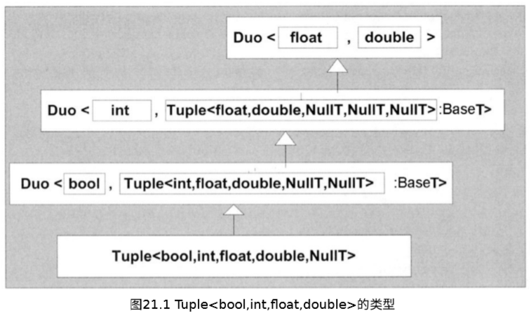
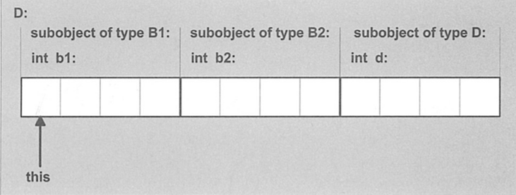

[toc]


# 高级应用程序

## 1. 类型区分:star:

:one:在某些时候，对于一个模板参数，如果能够知道它究竟是内建类型、指针类型、类类型或者其他类型，将会是非常有用的。在本章接下来的内容里，我们将开发一种==普遍适用的类型模板==，它能够帮助我们判断给定类型的许多属性。

### 1.1 辨别基本类型

:one:首先，让我们开发一个用于辨别**某个类型是否为基本类型**的模板。在缺省情况下，我们一方面假定一个类型不是一个基本类型，另一方面我们为**所有的基本类型**都特化该模板：

```c++
// types/type1.hpp
// 基本模板：一般情况下T不是基本类型 
template <typename T> 
class IsFundaT 
{ 
public: 
    enum{ Yes = 0, No = 1}; 
};

// ⽤于特化基本类型的宏 
#define MK_FUNDA_TYPE(T)            \ 
template<> class IsFundaT<T> {        \ 
public:                 \ 
    enum{ Yes = 1, No = 0 };        \ 
};

MK_FUNDA_TYPE(void) 
MK_FUNDA_TYPE(bool) 
MK_FUNDA_TYPE(char) 
MK_FUNDA_TYPE(signed char) 
MK_FUNDA_TYPE(unsigned char)
MK_FUNDA_TYPE(wchar_t) 
MK_FUNDA_TYPE(signed short) 
MK_FUNDA_TYPE(unsigned short) 
MK_FUNDA_TYPE(signed int) 
MK_FUNDA_TYPE(unsigned int) 
MK_FUNDA_TYPE(signed long) 
MK_FUNDA_TYPE(unsigned long) 
#if LONGLONG_EXISTS 
    MK_FUNDA_TYPE(signed long long) 
    MK_FUNDA_TYPE(unsigned long long)
#endif // LONGLONG_EXISTS 
MK_FUNDA_TYPE(float) 
MK_FUNDA_TYPE(double) 
MK_FUNDA_TYPE(long double) 
#undef MK_FUNDA_TYPE 
```

具体逻辑很简单，如果有什么不懂，就看书。


### 1.2 辨别组合类型

:one:==组合类型==是指一些构造自其他类型的类型。**简单的组合类型**包括：普通类型、指针类型、引用类型和数组类型——它们都是构造自单一的基本类型。同时，**`class`类型和函数类型**也是组合类型，但这些组合类型通常都会涉及到多种类型。在此，我们先考虑**简单的组合类型**；另外，我们还将使用**局部特化**对简单的组合类型进行区分。接下来，我们将定义一个类，用于描述**简单的组合类型**；而**类类型和枚举类型**将留到后面考虑：

```c++
template<typename T> 
class CompoundT 
{     
public: 
    enum { IsPtrT = 0, IsRefT = 0, IsArrayT = 0, IsFuncT = 0, IsPtrMemT = 0 }; 
    
    typedef T BaseT; 
    typedef T BottomT; 
    typedef CompoundT<void> ClassT; 
}; 
```

成员类型`BaseT`指的是：用于构造模板参数类型**`T`的直接类型**；而`BottomT`指的是最终去除指针、引用和数组之后的、**用于构造`T`的原始类型**。例如，如果`T`是`int**`，那么`BaseT`将是`int*`，而`BottomT`将会是`int`类型。对于**成员指针类型**，`BaseT`将会是成员的类型，而`ClassT`将会是**成员所属的类的类型**。例如，如果`T`是一个类型为`int(×::*)()`的成员函数指针，那么`BaseT`将会是函数类型`int()`，而`ClassT`的类型则为`X`。如果`T`不是**成员指针类型**，那么`ClassT`将会是将会是`CompoundT<void>`（这个选择并不是必须的，也可以使用一个`noclass`来作为`ClassT`）。

:two:其中，针对**指针和引用**的局部特化是相当直接的：

```c++
// types/type3.hpp 
template<typename T>
class CompoundT<T&> 
{   // 针对引用的局部特化 
public: 
    enum { IsPtrT = 0, IsRefT = 1, IsArrayT = 0, IsFuncT = 0, IsPtrMemT = 0 }; 
    
    typedef T BaseT; 
    typedef typename CompoundT<T>::BottomT BottomT; 
    typedef CompoundT<void> ClassT; 
}; 

template<typename T> 
class CompoundT<T*> 
{   // 针对指针的局部特化 
public: 
    enum { IsPtrT = 1, IsRefT = 0, IsArrayT = 0, IsFuncT = 0, IsPtrMemT = 0 }; 
    
    typedef T BaseT; 
    typedef typename CompoundT<T>::BottomT BottomT; 
    typedef CompoundT<void> ClassT; 
}; 
```

:three:对于**成员指针和数组**，我们可能会使用同样的技术来处理。但是，在下面的代码中我们将发现，与基本模板相比，**这些局部特化**将会涉及到更多的模板参数：

```c++
// types/type4.hpp 
#include <stddef.h> 

template<typename T, size_t N> 
class CompoundT <T[N]> 
{  // 针对数组的局部特化 
public:
    enum { IsPtrT = 0, IsRefT = 0, IsArrayT = 1, IsFuncT = 0, IsPtrMemT = 0 }; 
    
    typedef T BaseT; 
    typedef typename CompoundT<T>::BottomT BottomT; 
    typedef CompoundT<void> ClassT; 
}; 

template<typename T> 
class CompoundT <T[]> 
{  // 针对空数组的局部特化
public: 
    enum { IsPtrT = 0, IsRefT = 0, IsArrayT = 1, IsFuncT = 0, IsPtrMemT = 0 }; 
    
    typedef T BaseT; 
    typedef typename CompoundT<T>::BottomT BottomT; 
    typedef CompoundT<void> ClassT; 
}; 

template<typename T, typename C> 
class CompoundT <T C::*> 
{ // 针对成员指针的局部特化 
public: 
    enum { IsPtrT = 0, IsRefT = 0, IsArrayT = 0, IsFuncT = 0, IsPtrMemT = 1 }; 
    
    typedef T BaseT; 
    typedef typename CompoundT<T>::BottomT BottomT; 
    typedef C ClassT; 
};
```

细心的读者可能会发现：成员`BottomT`的定义要求根据某种类型`T`，对`CompoundT`模板进行==递归实例化==；当`T`不再是**组合类型**的时候，该递归也就结束了。


### 1.3 辨别函数类型

:one:==函数类型更加难以辨别==，原因在于：**参数的数量**可以是任意的，而且就算借助于模板，也不存在一种有限的语法构造，能够完整地描述**参数个数的不确定性**。

另一方面，存在一种部分解决这个问题的方法：以一个**给定整数**为模板参数**个数的上限**，为不同模板实参列表所对应的函数，提供不同的**局部特化**。其中，最简单的几个局部特化大概如下所示：

```c++
// types/type5.hpp 
template<typename R> 
class CompoundT<R()> 
{ 
public: 
    enum { IsPtrT = 0, IsRefT = 0, IsArrayT = 0, IsFuncT = 1, IsPtrMemT = 0 }; 
    
    typedef R BaseT(); 
    typedef R BottomT(); 
    typedef CompoundT<void> ClassT; 
};

template<typename R, typename P1> 
class CompoundT<R(P1)> 
{
public: 
    enum { IsPtrT = 0, IsRefT = 0, IsArrayT = 0, IsFuncT = 1, IsPtrMemT = 0 }; 
    
    typedef R BaseT(P1); 
    typedef R BottomT(P1); 
    typedef CompoundT<void> ClassT;
}; 

template<typename R, typename P1> 
class CompoundT<R(P1, ...)> 
{ 
public: 
    enum { IsPtrT = 0, IsRefT = 0, IsArrayT = 0, IsFuncT = 1, IsPtrMemT = 0 }; 
    
    typedef R BaseT(P1); 
    typedef R BottomT(P1); 
    typedef CompoundT<void> ClassT; 
};
...
```

:two:另外，我们也可以借助==SFINAE原则==来解决这个问题：一个重载函数模板（如下面的`test`）的后面可以是一些显式模板实参（如下面的`U`）；而且对于某些重载函数类型而言，该实参是有效的，但是对于其他的重载函数类型，该实参则可能是无效的。实际上，后面使用**重载解析**对枚举类型进行辨别的技术也使用到了这种方法。

原则在这里的主要用处是：找到一种构造，该构造对函数类型是无效的，但是对其他类型都是有效的；或者完全相反。由于前面我们已经能够辨别出几种类型了，所以我们在此可以不再考虑这些类型。因此，针对上面这种要求，**数组类型就是一种有效的构造**；因为数组的元素是不能为void值、引用或者函数的。于是，这启发了我们编写出下面的代码：

```c++
template<typename T> 
class IsFunctionT 
{
private: 
    typedef char One; 
    typedef struct { char a[2]; } Two; 
    
    template<typename U> 
    static One test(...);
    
    template<typename U> 
    static Two test(U (*)[1]); 
    
public: 
    enum { Yes = sizeof(IsFunctionT<T>::test<T>(0)) == 1 }; 
    enum { No = !Yes }; 
};
```

借助于上面这个模板定义，只有对于那些不能作为数组元素类型的类型，`lsFunctionT::Yes`，才是非零值（即为`1`）。另外，我们应该知道该方法也有一个**不足之处**：并非只有**函数类型**不能作为**数组元素类型**，**引用类型和void类型**同样也不能作为数组元素类型。幸运的是，我们可以通过为**引用类型**提供**局部特化**，以及为**void类型**提供**显式特化**，来解决这个不足：

```c++
template<typename T> 
class IsFunctionT<T&> 
{ 
public: 
    enum { Yes = 0 }; 
    enum { No = !Yes }; 
};

template<> 
class IsFunctionT<void> 
{ 
public: 
    enum { Yes = 0 }; 
    enum { No = !Yes }; 
}; 

template<> 
class IsFunctionT<void const>
{ 
public: 
    enum { Yes = 0 }; 
    enum { No = !Yes }; 
};
```

:three:基于上面例子的这些考虑，我们现在就可以重新改写基本的`CompoundT`模板如下：

```c++
template<typename T> 
class CompoundT 
{     //基本模板 
public:
    enum { IsPtrT = 0, IsRefT = 0, IsArrayT = 0, 
          IsFuncT = IsFunctionT<T>::Yes, IsPtrMemT = 0 }; 
    
    typedef T BaseT; 
    typedef T BottomT; 
    typedef CompoundT<void> ClassT;
};
```

实际上，基本模板的这个实现与前面所给出的那些特化并不冲突。因此，在参数个数已经限定的情况下，借助于前面的特化，还可以访问**返回类型**和**参数类型**。


### 1.4 运用重载解析辨别枚举类型

:one:==重载解析==是一个过程，它会根据**函数参数的类型**，在多个同名函数中选择出一个合适的函数。接下来我们将看到，即使没有进行**实际的函数调用**，我们也能够利用**重载解析**，来确定所需要的结果。

总之，对于测试**某个特殊的隐式转型**是否存在的情况，利用重载解析的方法是相当有用的。在此，我们将要利用==从枚举类型到整型的隐式转型==：它能够帮助我们分辨**枚举类型**。

```c++
// types/type7.hpp 
struct SizeOverOne { char c[2]; }; 

template<typename T, 
         bool convert_possible = !CompoundT<T>::IsFuncT && !CompoundT<T>::IsArrayT> 
class ConsumeUDC 
{ 
public:
    operator T() const; 
}; 

// 到函数类型的转型是不允许的
template <typename T> 
class ConsumeUDC<T, false> { }; 

// 到void类型的转型是不允许的 
template <bool convert_possible> 
class ConsumeUDC<void, convert_possible> { }; 

char enum_check(bool); 
char enum_check(char); 
char enum_check(signed char); 
char enum_check(unsigned char); 
char enum_check(wchar_t); 
char enum_check(signed short); 
char enum_check(unsigned short); 
char enum_check(signed int); 
char enum_check(unsigned int); 
char enum_check(signed long); 
char enum_check(unsigned long); 
#if LONGLONG_EXISTS 
	char enum_check(signed long long); 
	char enum_check(unsigned long long);
#endif 
// LONGLONG_EXISTS 
// 避免从float到int的意外转型 
char enum_check(float); 
char enum_check(double); 
char enum_check(long double); 

SizeOverOne enum_check(...); // 捕获剩余的所有情况

template<typename T> 
class IsEnumT 
{ 
public: 
    enum { Yes = IsFundaT<T>::No && !CompoundT<T>::IsRefT && !CompoundT<T>::IsPtrT 
           && !CompoundT<T>::IsPtrMemT && sizeof(enum_check(ConsumeUDC<T>()))==1 
         }; 
    
    enum { No = !Yes }; 
}; 
```

上面代码的核心在于后面的一个`sizeof`表达式，它的参数是一个**函数调用**。也就是说，该表达式将会返回**函数调用返回值的类型大小**；其中，将应用**重载解析原则**来处理`enum_CHECK()`调用；但另一方面，我们并**不需要函数定义**，因为实际上并没有真正调用该函数。

在上面的例子中，如果实参可以转型为一个整型，那么`enum_check()`，将返回一个`char`值，其大小为`1`。对于其他的所有类型，我们使用了一个==省略号函数==（即`enum_CHECK(...)`），然而，根据==重载解析原则的优先顺序==，**省略号函数**将会是最后的选择。在此，我们对**enum_CHECK()的省略号版本**进行了特殊的处理，让它返回一个大小大于一个字节的类型（即`SizeOverOne`）。

:two:对于函数`enum_check`的调用实参，我们必须仔细地考虑。首先，我们并不知道`T`是如何构造的，或许将会调用一个**特殊的构造函数**。为了解决这个问题，我们可以声明一个返回类型为`T`的函数，然后通过调用这个函数来创建一个`T`。

事实上，更加巧妙的是：对于一个**类类型**`T`，重载解析是有可能选择一个针对整型的`enum_check()`声明的，但前提是该类必须定义一个**到整型的自定义转型**函数。到此，问题已经解决了，因为我们在`ConsumeUDC`模板中已经强制定义了一个**到`T`的自定义转型**，该转型运算符同时也为`sizeof`运算符生成了一个类型为`T`的实参。如果你还没有看出来，让我们来详细地分析这个**调用enum_的表达式**：

- 最开始的实参是一个临时的`ConsumeUDC<T>`对象。
- 如果`T`是一个**基本整型**，那么将会借助于（`ConsumeUdc`的）**转型运算符**来创建一个`enum_check()`的匹配，该`enum_check()`以`T`为实参。
- 如果`T`是一个==枚举类型==，那么将会借助于（`ConsumeUDC`的）**转型运算符**，先把类型转化为`T`，然后调用（从枚举类型到整型的）**类型提升**，从而能够匹配一个**接收整型参数的`enum_check()`函数**（通常而言是`enum_check(int)`）。
- 如果`T`是一个==class类型==，而且已经为该`class`自定义了一个**到整型的转型运算符**，那么这个转型运算符将**不会被考虑**。因为对于以匹配为目的的自定义转型而言，最多只能调用一次；而且在前面已经使用了一个从`ConsumeUDC<T>`到`T`的自定义转型，所以也就**不允许再次调用自定义转型**。也就是说，对`enum_check()`函数而言，**class类型**最终还是未能转型为整型。
- 如果最终还是不能让类型`T`与**整型**互相匹配，那么将会选择`enum_check()`函数的==省略号版本==。

最后，由于我们这里只是为了辨别**枚举类型**，而不是基本类型或者指针类型，所以我们使用了前面已经开发的`lsFundaT`和`CompoundT`类型，从而能够排除这些令`IsEnumT<T>::yes`成为非零的其他类型，最后使得只有枚举类型的`IsEnumT::yes`才等于`1`。


### 1.5 辨别class类型

:one:一种辨别的方法是使用**排除原理**：如果一个类型不是一个基本类型，也不是枚举类型和组合类型，那么该类型就只能是**类类型**。我们可以使用下面这个**直接的模板**，来实现这个原理：

```c++
// types/type8.hpp 
template<typename T> 
class IsClassT 
{ 
public: 
    enum { Yes = IsFundaT<T>::No && IsEnumT<T>::No && !CompoundT<T>::IsPtrT 
           && !CompoundT<T>::IsRefT && !CompoundT<T>::IsArrayT 
           && !CompoundT<T>::IsPtrMemT && !CompoundT<T>::IsFuncT }; 
    
    enum { No = !Yes }; 
}; 
```


### 1.6 辨别所有类型的函数模板

:one:总结之前的各个部分：

```c++
// types/typet.hpp 
#ifndef TYPET_HPP 
#define TYPET_HPP 

// define IsFundaT<> 
#include "type1.hpp" 

// 定义基本模板 CompoundT<> (第一个版本) 
#include "type2.hpp" 

// 定义基本模板 CompoundT<> (第二个版本)  
#include "type6.hpp" 

// define CompoundT<> 的特化
#include "type3.hpp" 
#include "type4.hpp" 
#include "type5.hpp" 

// 定义IsEnumT<> 
#include "type7.hpp" 

// 定义IsClassT<> 
#include "type8.hpp" 

template <typename T> 
class TypeT 
{ 
public: 
    enum { IsFundaT = IsFundaT<T>::Yes, IsPtrT = CompoundT<T>::IsPtrT, 
          IsRefT = CompoundT<T>::IsRefT, IsArrayT = CompoundT<T>::IsArrayT, 
          IsFuncT = CompoundT<T>::IsFuncT, IsPtrMemT = CompoundT<T>::IsPtrMemT,
          IsEnumT = IsEnumT<T>::Yes, IsClassT = IsClassT<T>::Yes 
         };
}; 
#endif 
// TYPET_HPP 
```


### 1.7  后记

:one:对于某个实体，这种能够在程序中获知它的**高层次属性**（诸如类型结构）的能力通常称为==反射==。在这一章中，我们的框架实现了一种**编译期反射**，这种能力也将与==元编程==相得益彰。


## 2. 智能指针

### 2.1 hollder和trulle

:one:本节将介绍两种**智能指针类型**：`Holder`类型独占一个对象；而`Trule`可以使对象的拥有者从一个`Holder`传递给另一个`Holder`。

#### 安全处理异常

:one:比较熟悉，具体见书。

#### holder

:one:它会在下面两种情况下释放**所指向的对象**：本身被释放，或者把另一个指针赋值给它。我们把这种类称为`Holder`，使用该名称的主要理由是：当我们执行各种计算的时候，就意味着安全地持有一个对象。下面就说明如何做到这一点：

```c++
// pointers/holder.hpp 
template <typename T> 
class Holder 
{ 
private: 
    T* ptr;  // 引用它所持有的对象（前提是该对象存在） 
    
public: 
   
    Holder() : ptr(0) {} 
    
    // 针对指针的构造函数: 让该holder引⽤该指针指向的对象 
    explicit Holder (T* p) : ptr(p) { } 
    
    // 析构函数：释放所引用的对象（前提是该对象存在） 
    ~Holder() { delete ptr; } 
    
    // 针对指针的赋值运算符 
    Holder<T>& operator= (T* p) 
    { 
        delete ptr; 
        ptr = p; 
        return *this; 
    } 
    
    // 指针运算符 
    T& operator* () const {
        return *ptr;
    } 
    
    T* operator-> () const 
    { 
        return ptr; 
    } 
    
    // 获取所引用的对象（前提是该对象存在） 
    T* get() const { return ptr; } 
    
    // 释放所引用的对象所有权 
    void release() { ptr = 0; } 
    
    // 和另⼀个holder交换所有权
    void exchange_with (Holder<T>& h) 
    { 
        swap(ptr, h.ptr); 
    } 
    
    void exchange_with (T*& p)
    { 
        swap(ptr, p); 
    } 
    
private: 
    //不向外提供拷贝构造函数和拷贝赋值运算符 
    Holder (Holder<T> const&); 
    
    Holder<T>& operator= (Holder<T> const&); 
};
```

从语义上讲，该`Holder`独占`ptr`所引用对象的所有权。而且，这个对象一定要用`New`操作来创建，因为在销毁`Holder`所拥有对象的时候，需要用到`delete`操作。


#### 资源获取于初始化:star:

:one:`holder`所用到的基本思想是一种称为==资源获取于初始化==或`RAII`的模式。在此，我们可以为释放`policy`引入一些模板参数，从而我们就可以把下面的代码

```c++
void do_something() 
{ 
    // 获取资源 
    RES1* res1 = acquire_resource_1(); 
    RES2* res2 = acquire_resource_2(); 
    … 
    release_resource_2(res); 
    release_resource_1(res); 
}
```

替换为所有符合以下形式的代码：

```c++
void do_something () 
{ 
    Holder<RES1,...> res1(acquire_resource_1()); 
    Holder<RES2,...> res2(acquire_resource_2()); 
    … 
}
```

#### holder的局限

:one:具体见书。（主要是使用上不像裸指针那么方便，特别是参数和返回值都要求裸指针的情况）

```c++
Something* load_something() 
{ 
    Holder<Something> result(new Something); 
    read_something(result.get_pointer()); 
    Something* ret = result.get_pointer(); 
    result.release(); 
    return ret; 
} 
```


#### trule

:one:为了解决上一小节留下的问题，我们引进了一个专门用于传递`Holder`的**辅助类模板**，并把它称为`Trule`。在语言中，它是一个术语，来自于**转移胶囊**的缩写。下面是其定义：

```c++
// pointers/trule.hpp 
#ifndef TRULE_HPP 
#define TRULE_HPP 
template <typename T> 
class Holder; 

template <typename T> 
class Trule 
{ 
private: 
    T* ptr;  

public: 
    Trule (Holder<T>& h) 
    {
        ptr = h.get(); 
        h.release(); 
    } 
   
    Trule (Trule<T> const& t) 
    { 
        ptr = t.ptr; 
        const_cast<Trule<T>&>(t).ptr = 0;
    } 
 
    ~Trule() { delete ptr; } 
    
private: 
    
    Trule(Trule<T>&);       			// 禁⽌将trule作为左值 
    Trule<T>& operator= (Trule<T>&);	// 禁⽌拷贝赋值 
    friend class Holder<T>;
};
#endif // TRULE_HPP 
```

显然，在拷贝构造函数里有些比较别扭的代码：`trule`，通常是作为那些想传递持有的函数的返回类型，也就是说：**trule对象**总是作为**临时对象**出现；因此它们的类型也就只能是==常引用（Reference to-Const）类型==。然而，由于`trule`不能作为一份拷贝，也不能含有一份拷贝，如果我们希望实现**类似于拷贝的操作**，就必须移除原trule的所有权，我们是通过将**被封装指针置为空**，来实现这种移除操作的.

:two:最后，对于上面实现的`Trule`，只有被`Holder`模板所辨识并且使用之后，才能算是完整的，下面我们就给出针对`Holder`的用法：

```c++
// pointers/holder2extr.hpp 
template <typename T> 
class Holder 
{ 
    … 
public: 
    Holder (Trule<T> const& t) 
    { 
        ptr = t.ptr; 
        const_cast<Trule<T>&>(t).ptr = 0;
    } 
    
    Holder<T>& operator= (Trule<T> const& t) 
    { 
        delete ptr; 
        ptr = t.ptr; 
        const_cast<Trule<T>&>(t).ptr = 0; 
        return *this;
    }
}; 
```

为了充分演示对`Holder/trule`作了哪些改善，我们重写了例子：

```c++
// pointers/truletest.cpp 
#include "holder2.hpp" 
#include "trule.hpp" 
class Something { }; 

void read_something (Something* x) 
{ } 

Trule<Something> load_something() 
{ 
    Holder<Something> result(new Something); 
    read_something(result.get()); 
    return result; 
} 

int main() 
{
    Holder<Something> ptr(load_something()); …
} 
```

最终，我们创建了一对使用起来几乎可以**像普通指针一样方便的类模板**。而且这两个类模板还有附加的好处：在由于**抛出异常**，而导致堆栈展开的情况下，可以管理对象的释放，**防止内存泄漏**。


### 2.2 引用计数

:one:实际上，它是一种模板：

```c++
template <typename T … > 
class CountingPtr 
{ 
public: 
    
    explicit CountingPtr (T*); 
    CountingPtr (CountingPtr<T… > const&); 
    
    inline ~CountingPtr();
    CountingPtr<T… >& operator= (CountingPtr<T… > const&); 

    inline T& operator* (); 
    inline T* operator-> (); 
    … 
};
```


#### 计数器在什么地方

:one:最朴素的想法就是把计数器放在指向的对象中。遗憾的是，对于**被指向的对象的类型**，如果在早期设计的时候，完全未考虑**引用计数**，那么我们就无法再把计数器放入对象中。

==单独分配计算器的一种方法==是：对引用计数所在的对象，使用**专用的内存分配器**。实际上，这种分配器可以分配一些额外的存储空间，来保存对应的计数器。

:two:我们将用**计数器的位置**作为**模板的参数**，从而就不需要指出计数器的位置。实际上，这个参数就是我们的计数器`policy`。这种`policy`的接口可以非常简单：只需要包含**一个返回整型值的函数**和**一个为该整型值分配所需空间的函数**，而且后面这个函数并不是必需的。


#### 并发访问计数器

:one:为了**并发访问**计数器，需要某种形式的锁。在接下来的内容里，将不准备说明如何实现这种锁，但是我们会为**计数器**指定一个接口，在足够高的层次上，该接口也将引入**锁操作**。具体而言，我们要求计数器是一个具有以下接口的类：

```c++
class CounterPolicy 
{
public: 
    // 以下4个特殊成员 
    CounterPolicy(); 
    CounterPolicy(CounterPolicy const&); 
    ~CounterPolicy(); 
    CounterPolicy& operator=(CounterPolicy const&); 
    
    // 假设T是指向的的型
    void init(T*);    // 初始化为1，可能为计数器分配空间 
    void dispose(T*);  // 可能涉及计数器空间的释放操作 
    void increment(T*);  // 增1的原子操作 
    void decrement(T*);  // 减1的原子操作 
    bool is_zero(T*);  // 检查是否为0 
    … 
};
```

在此，我们假设该接口所使用的类型`T`是由`CountingPtr`的模板参数提供的。实际上，只有那些需要把**计数器**存储在**被指向对象**中的`policy`，才需要用到这种接口。


#### 析构和释放

:one:鉴于使用**非标准方式**释放对象的情况是肯定存在的，在此引入一种单独的==对象释放policy==是很有必要的。实际上，该`policy`的实现接口非常简单：

```c++
class ObjectPolicy 
{ 
public: 
    ObjectPolicy(); 
    ObjectPolicy(CounterPolicy const&); 
    ~ObjectPolicy(); 
    ObjectPolicy& operator=(ObjectPolicy const&);
	//假设T是所指向对象的类型 
    void dispose (T*);
}; 
```

普遍的做法是：当**智能指针**不再指向任何对象时，把**针对智能指针进行解引用的一些检查**合并起来。另一方面，为这种检查增加一个特殊的`policy`参数也是完全可能的。然而，为了简洁性考虑，我们并不打算在此阐述这种做法；但是如果你对本节的剩余内容都能很好掌握的话，那么要实现这种做法也不难。

:two:对于大多数用`CountingPtr`计数的对象，我们可以使用下面这个简单的对象`policy`：

```c++
// pointers/stdobjpolicy.hpp 
class StandardObjectPolicy 
{ 
public: 
    template<typename T> 
    void dispose (T* object) 
    { 
        delete object; 
    } 
};
```

显然，对于用`New[]`运算符分配的数组，这样做不会起作用。幸运的是，对于这种情况，我们可以轻易地找到一种替代的`policy`：

```c++
// pointers/stdarraypolicy.hpp 
class StandardArrayPolicy 
{ 
public: 
    template<typename T> 
    void dispose (T* array) 
    { 
        delete[] array; 
    }
};
```

:three:在上面两种情况下，我们都将`Dispose()`作为**成员函数模板**来实现。另外，还有另一种替代方法：就是参数化这个`policy`类。


#### CountingPtr模板

:one:现在，我们已确定了`policy`接口，已经可以使用`CountingPtr`接口本身了：

```c++
// pointers/countingptr.hpp 
template<typename T, typename CounterPolicy = SimpleReferenceCount, typename ObjectPolicy = StandardObjectPolicy> 
class CountingPtr : private CounterPolicy, private ObjectPolicy 
{ 
private: 
    // typedef两个简单的别名: 
    typedef CounterPolicy CP; 
    typedef ObjectPolicy OP; 
    
    T* object_pointed_to;   // 所引用的对象 
    //(如果没有引用任何对象，则为NULL) 
    
public: 
    // 缺省构造函数(没有显式初始化，即没有加上explicit关键字): 
    CountingPtr() { this->object_pointed_to = NULL; } 
    
    // ⼀针转型的 (转型⾃⼀内的指针):
    explicit CountingPtr (T* p) { this->init(p);} 
    
    CountingPtr (CountingPtr<T,CP,OP> const& cp) 
        : CP((CP const&)cp), OP((OP const&)cp) 
    { 
        this->attach(cp);	//拷贝指针，并且增加计数值
    } 
    
    ~CountingPtr() { 
        this->detach();    // 减少计数值
    } 
    
    // 针对内建指针的赋值运算符 
    CountingPtr<T,CP,OP>& operator= (T* p) 
    { 
        // 计数指针指针不指向 *p : 
        assert(p != this->object_pointed_to); 
        this->detach();    // 减少计数值 
        				   // (如果计数值为0，则释放该计数器) 
        this->init(p);    // ⽤一个普通指针进⾏初始化 
        return *this; 
    } 
    
    // 拷贝赋值运算符 (考虑⾃⼰给⾃⼰赋值): 
    CountingPtr<T,CP,OP>& operator= (CountingPtr<T,CP,OP> const& cp) 
    { 
        if (this->object_pointed_to != cp.object_pointed_to) 
        {
            this->detach(); 
            CP::operator=((CP const&)cp); // policy进⾏赋值 
            OP::operator=((OP const&)cp); 
            this->attach(cp);  //拷贝指针，并且增加计数值
        } 
        return *this;
    } 
    
    // 使之成为智能指针的运算符: 
    T* operator-> () const 
    { 
        return this->object_pointed_to; 
    } 
    
    T& operator* () const 
    { 
        return *this->object_pointed_to; 
    } 
    
    // 以后在这⾥将可能增加⼀些其他的接⼝ 
    … 
    
private: 
    // 辅助函数: 
    // - ⽤普通指针进⾏初始化 (前提是普通指针存在)
    void init (T* p) 
    { 
        if (p != NULL){ 
            CounterPolicy::init(p); 
        } 
        this->object_pointed_to = p; 
    } 
    
    // - 拷⻉指针，并且增加计数值 (前提是指针存在)
    void attach (CountingPtr<T,CP,OP> const& cp)
    { 
        this->object_pointed_to = cp.object_pointed_to; 
        if (cp.object_pointed_to != NULL) 
        { 
            CounterPolicy::increment(cp.object_pointed_to); 
        } 
    } 
    
    // - 减少计数值 (如果计数值为0，则释放计算器) 
    void detach()
    { 
        if (this->object_pointed_to != NULL) 
        { 
            CounterPolicy::decrement(this>object_pointed_to); 
            if (CounterPolicy::is_zero(this->object_pointed_to)) 
            { 
                // 如果有必要的话，释放计数器: 
                CounterPolicy::dispose(this->object_pointed_to); 
                // 使⽤object policy来释放所指向的对象: 
                ObjectPolicy::dispose(this->object_pointed_to); 
            } 
        } 
    }
}; 
```

> 阅读上诉代码，我们回忆一下之前我们所学习的：如果用裸指针初始化多个智能指针，则会产生多个计数块，现在我们不难理解了。

有一点需要注意：由于==空指针并没有一个可关联的计数器==，所以在减少计数值之前，必须先显式地检查空指针的情况。


#### 一个简单的非侵入式计数器

:one:让我们先来看一个针对计数器的`policy`，它并不把计数器存储于**所指向对象的内部**，也就是说，它是一种==非侵入式的计数器`policy`==。

对于计数器而言，最主要的问题是：==如何分配存储空间==。事实上，同一个计数器需要被多个`CountingPtr`所共享；因此，它的生命期必须持续到最后一个智能指针被释放之后。通常而言，我们会使用一种**特殊的分配器**来完成这种任务，这种分配器专门用于**分配大小固定的小对象**。这种工业分配器不在这里深度讨论，我们将假设存在两个函数`alloc_Counter()`和`dealloc_Counter()`，用于管理**存储`Size_t`类型的内存空间**。有了这些假设之后，我们就可以这样编写一个**简单的计数器**：

```c++
// pointers/simplerefcount.hpp 
#include <stddef.h> // 用于size_t的定义
#include "allocator.hpp" 

class SimpleReferenceCount 
{ 
private: 
    size_t* counter;  // 已经分配的计数器 
    
public: 
    SimpleReferenceCount () { counter = NULL; } 
    
    // 缺省的拷贝构造函数和拷贝赋值运算符都是允许的， 
    // 因为它们只是拷贝这个共享的计数器 
    
public:     
    // 分配计数器，把它的值初始为1: 
    template<typename T> 
    void init (T*) 
    { 
        counter = alloc_counter(); 
        *counter = 1; 
    } 
    
    // 释放该计数器: 
    template<typename T> 
    void dispose (T*) 
    { 
        dealloc_counter(counter); 
    }
    
    template<typename T> 
    void increment (T*) 
    { 
        ++*counter; 
    } 
    
    template<typename T> 
    void decrement (T*) 
    { 
        --*counter; 
    }
    
    template<typename T> 
    bool is_zero (T*) 
    { 
        return *counter == 0; 
    }
}; 
```


#### 一个简单的侵入式计数器

:one:在被引用的对象中，为了选择**计数器的位置**，我们用了一个**类型未确定的成员指针参数**。由于计数器被作为**对象的一部分**来分配，所以从某种意义上而言，这种策略的实现要比前面的非侵入式例子更加简单，但是这里的**成员指针语句的用法**并不是很广泛：

```c++
// pointers/memberrefcount.hpp 
template<typename ObjectT,   // 包含计数器类型 
		 typename CountT,   // 计数器的类型 
		 CountT ObjectT::*CountP> // 计数器的位置 
class MemberReferenceCount {
public: 
    void init (ObjectT* object) 
    { 
        object->*CountP = 1; 
    } 
    
    // 对于计数器的释放，并不需要显式执行任何操作: 
    void dispose (ObjectT*) { } 
    
    void increment (ObjectT* object) { ++object->*CountP; } 
    
    void decrement (ObjectT* object) { --object->*CountP; } 
    
    template<typename T> bool is_zero (ObjectT* object){
        return object->*CountP == 0;
    }
}; 
```

如果使用这种`policy`的话，那么在类的实现中，就可以很快地写出**类的引用计数指针类型**。其中**类的设计框架**大概如下所示：

```c++
class ManagedType 
{
private: 
    size_t ref_count;
    
public: 
    typedef CountingPtr<ManagedType, MemberReferenceCount<ManagedType, size_t, &ManagedType::ref_count> > Ptr; 
    … 
}; 
```

有了上面这个定义之后，我们就可以使用`ManagedType::Ptr`，方便地引用“那些用于访问`ManagedType`对象的”引用计数指针类型（在此为智能指针类型`CountingPtr`）。


#### 隐式转换:star:

:one:内建指针可以被用于以下几种隐式转型：

- 到`void*`类型的转型。
- 到被指向的对象的一个基类指针的转型。
- 到`bool`类型的转型（若指针为空则为`false`，否则为`true`）。

我们希望在`CountingPtr`模板中仿效这些转型，但是就像我们将会看到的一样，要实现这些转型并不是很容易。另外，一些程序员希望：**智能指针**可以转型为==相应的内建指针类型==（例如，一些人希望计数`Ptr<int Const>`可以转型为`int Const*`类型）。

遗憾的是，由于我们假设所有**指向被引用计数对象的指针**都是`CountingPtr`类型，所以如果实现到内建指针类型的隐式转型，将会使这个假设==自相矛盾==。因此我们没有提供这样的转型。

**:two:**另一方面，到**CountingPtr的特化**的隐式转型却可能是很有用的。例如，我们可以假想存在一个到`CountingPtr<void>`类型的隐式转型。然而这里有一个限制：由于**void类型**并不能包含一个计数器，所以**侵入式计数器Policy**就不能采用这种转型。同样地，**到基类特化的转型与侵入式计数器政策也是不相容的**。

虽然如此，我们还是可以将这种**隐式转型**加入到`CountingPtr`模板中。而且，为了考虑上面这些不兼容的情况，我们规定：当转型与**给定的计数器`policy`**不兼容时，将会发生**实例化错误**。其中这种隐式转型看起来大概如下：

```c
template<typename T2, typename CP2, typename OP2> 
class CountingPtr; 

friend template <typename S>  
CountingPtr(CountingPtr<S, OP, CP> const& cp) : OP((OP const&)cp), CP((CP const&)cp), object_pointed_to(cp.object_pointed_to) 
{ 
    if (cp.object_pointed_to != NULL) 
    { 
        CP::increment(cp.object_pointed_to); 
    } 
} 
```

:three:到`bool`的转型看起来可能会更加直接。我们只需要为`CountingPtr`增加一个**用户自定义的转型运算符**：

```c++
operator bool() const
{ 
    return this->object_pointed_to != (T*)0;
}
```

但上面这个写法会引发很多问题（具体见书）。对于这个问题，一种简单但经常被忽视的**解决方法**是：定义一个==到成员指针类型的转型==（注意，这里不是到**内建指针类型**）。事实上，==成员指针类型也支持到bool类型的隐式转型==，但是它与普通指针是有区别的：因为对于**删除操作**或**指针算法**而言，成员指针是无效的。下面我们通过给`CountingPtr`模板添加一些代码，来阐明如何使用这种技术：

```c++
private: 
	class BoolConversionSupport { int dummy; }; 

public: 

	operator BoolConversionSupport::*() const 
    { 
        return this->object_pointed_to ? &BoolConversionSupport::dummy : 0; 
    } 
```

另外，由于没有增加**成员变量**，所以这样做并不会增加`CountingPtr`的大小。另一方面，我们通过使用一个==私有嵌入类==，避免了与**客户代码**发生潜在的冲突。


#### 比较

//todo


## 3. Tuple

### 3.1 duo

:one:`Duo`的目的是：把两个对象聚集到一个单一类型。这与标准库的`std::pair`类模板非常类似，但由于我们将要给这个比较基础的属性加一些**相对特殊的功能**，同时也为了避免与标准库的`pair`发生混淆，所以接下来我们将定义一个不同于`pair`的名字；为了简单起见，我们这里把这个名字定义为`duo`：

```c++
template <typename T1, typename T2> 
struct Duo 
{ 
    T1 v1;  
    T2 v2;   
};
```

例如，对于某些需要判断**返回结果是否有效**的函数而言，这个`duo`就是很有用的，例如：

```c++
Duo<bool,X> result = foo(); 
if (result.v1)
{ 
    // 结果是有的，回值是result.v2 
    … 
} 
```

一方面，我们可以对上面的**基本功能**进行扩展，从而可以获得某些便利。首先，我们可以给`duo`增加两个构造函数：

```c++
template <typename T1, typename T2> 
class Duo 
{ 
public: 
    T1 v1;   
    T2 v2;
    
    Duo() : v1(), v2() { } 
    Duo (T1 const& a, T2 const& b) : v1(a), v2(b) { } 
}; 

template <typename T1, typename T2> 
inline Duo<T1,T2> make_duo (T1 const& a, T2 const& b) 
{ 
    return Duo<T1,T2>(a,b); 
} 
```

对`duo`的进一步优化是提供==域类型的访问==，从而可以在`duo`的上面创建**适配器模板**：

```c++
typedef T1 Type1; 
typedef T2 Type2;
enum { N = 2 };  // 域的个数
```

:two:一个更加强大、清晰的实现：

```c++
// tuples/duo1.hpp 
#ifndef DUO_HPP 
#define DUO_HPP 

template <typename T1, typename T2> 
class Duo 
{ 
public: 
    typedef T1 Type1;
    typedef T2 Type2; 
    enum { N = 2 };  
    
private: 
    T1 value1;    
    T2 value2;    
    
public: 
    
    Duo() : value1(), value2() { } 
    
    Duo (T1 const & a, T2 const & b) : value1(a), value2(b) { } 
    
    // ⽤于在构造期间，进⾏隐式的类型转换 
    template <typename U1, typename U2> 
    Duo (Duo<U1,U2> const & d) : value1(d.v1()), value2(d.v2()) { }
    
    // ⽤于在赋值期间，进⾏隐式的类型转换 
    template <typename U1, typename U2> 
    Duo<T1, T2>& operator = (Duo<U1,U2> const & d)
    {
        value1 = d.value1; 
        value2 = d.value2; 
        return *this;
    } 
    
    // ⽤于访问域的函数（域访问函数） 
    T1& v1() { return value1;} 
    
    T1 const& v1() const { return value1; } 
    
    T2& v2() { return value2; } 
    
    T2 const& v2() const { return value2; }
}; 

template <typename T1, typename T2, typename U1, typename U2> 
inline bool operator == (Duo<T1,T2> const& d1, Duo<U1,U2> const& d2) 
{ 
    return d1.v1()==d2.v1() && d1.v2()==d2.v2(); 
} 

template <typename T1, typename T2, typename U1, typename U2> 
inline bool operator != (Duo<T1,T2> const& d1, Duo<U1,U2> const& d2) 
{ 
    return !(d1==d2);
} 

// 针对创建和初始化的辅助函数 
template <typename T1, typename T2> 
inline Duo<T1,T2> make_duo (T1 const & a, T2 const & b) 
{ 
    return Duo<T1,T2>(a,b); 
} 
#endif 
```


### 3.2 可递归duo

:one:考虑如下的递归定义：

```c++
Duo<int, Duo<char, Duo<bool, double>>> q4;
```

`q4`的类型就是所谓的可递归`duo`。它是一个**实例化自Duo模板的类型**，而且它的第`2`个类型实参本身就是一个`Duo`。从理论上而言，我们完全可以对第`1`个参数进行递归，但是为了统一起见，在本主题所讨论的内容里，我们将只把第`2`个模板实参作为可递归`Duo`，也就是说，第`2`个模板实参本身就是一个`Duo`。


#### 域的个数

```c++
// tuples/duo2.hpp 
template <typename A, typename B, typename C> 
class Duo<A, Duo<B,C> > 
{ 
public: 
    typedef A    T1;      
    typedef Duo<B,C> T2; 
    enum { N = Duo<B,C>::N + 1 };
private: 
    T1 value1;         // 1域的值 
    T2 value2;         // 2域的值 
public: 
    // 其他的公共成员都不需要改变 
    … 
}; 
```

:one:为了完整性考虑，我们还需要为`duo`提供一个==局部特化==，作为上面递归的出口。在此，这个出口是一个只包含一个域的`duo`：

```c++
template <typename A>
struct Duo<A,void> 
{
public: 
    typedef A T1;
    typedef void T2; 
    enum { N = 1 };  
private: 
    T1 value1;    
public: 
    Duo() : value1() { } 
    
    Duo (T1 const & a) : value1(a) { } 
    
    T1& v1() { return value1; } 
    T1 const& v1() const {return value1; } 
    
    void v2() { } 
    void v2() const { } 
    …
};
```


#### 域的类型

:one:让我们先看看类型函数`DuoT`的代码，它用于获取可递归`duo`的第`n`个类型。其中泛型定义如下：

```c++
template <int N, typename T> 
class DuoT 
{ 
public: 
    typedef void ResultT;  // 一般情况下，结构类型是void 
}; 
```

这个==基本模板==保证了以下的事实：对于`non-duo`而言，结果类型为`void`。对于非递归的`duo`，我们也可以定义**两个简单的局部特化**，用于获取每个域的类型：

```c++
// 针对普通duo第1个域的特化 
template <typename A, typename B> 
class DuoT<1, Duo<A,B> > 
{ 
public: 
    typedef A ResultT;
}; 

// 针对普通duo第2个域的特化 
template <typename A, typename B> 
class DuoT<2, Duo<A,B> > 
{ 
    public: typedef B ResultT;
};
```

有了上面这些特化之后，我们就可以这样定义**可递归duo**的第`N`个域的类型：一般情况下，它等于第`2`个域（本身也是一个duo）的第`N-1`个域的类型：

```c++
template <int N, typename A, typename B, typename C>
class DuoT<N, Duo<A, Duo<B,C> > > 
{ 
public: 
    typedef typename DuoT<N-1, Duo<B,C>>::ResultT ResultT; 
}; 
```

另外，针对可递归`duo`第1个域的类型的特化如下，它将用于==终止递归==：

```c++
template <typename A, typename B, typename C> 
class DuoT<1, Duo<A, Duo<B,C>>> 
{
public: 
    typedef A ResultT; 
}; 
```

对于可递归`Duo`第`2`个域的类型而言，为了避免和**非递归的Duo**产生==二义性==，我们还需要为它提供一个**局部特化**：

```c++
template<typename A, typename B, typename C>
class DuoT<2, Duo<A, Duo<B, C> > > 
{ 
public:
    typedef B ResultT; 
}; 
```


#### 域的值

:one:在一个可递归`duo`中，就操作而言，抽取第`N`个值与抽取第`N`个类型是类似的，只是抽取第`N`个值要稍微复杂一些。为了能够抽取第`N`个值，我们需要实现一个形为`Val<N>(DIO)`的接口。但是在实现该接口的过程中，我们需要先实现一个**辅助类模板**`DuoValue`，因为==只有类模板才能够被局部特化（函数模板现在不可以）==，而偏特化能够帮助我们高效地抽取第`N`个值。下面就是`Val()`函数如何进行委托的代码：

```c++
//返回变量duo的第N个值
template <int N, typename A, typename B> 
inline typename TypeOp<typename DuoT<N, Duo<A, B> >::ResultT>::RefT val(Duo<A, B>& d) 
{ 
    return DuoValue<N, Duo<A, B> >::get(d); 
}
//返回常量duo的第N个值
template <int N, typename A, typename B> 
inline typename TypeOp<typename DuoT<N, Duo<A, B> >::ResultT>::RefConstT val(Duo<A, B> const& d) 
{ 
    return DuoValue<N, Duo<A, B> >::get(d); 
} 
```

```c++
// 基本模板，针对求 (duo) T 的第N个值 
template <int N, typename T> 
class DuoValue 
{ 
public: 
    static void get(T&) { } 
    
    static void get(T const&) { } 
};

// 针对普通duo的第1个域的特化 
template <typename A, typename B>
class DuoValue<1, Duo<A, B> > 
{ 
public: 
    static A& get(Duo<A, B> &d) 
    { 
        return d.v1(); 
    } 
    
    static A const& get(Duo<A, B> const &d) 
    { 
        return d.v1(); 
    } 
}; 

// 针对普通duo的第2个域的特化 
template <typename A, typename B>
class DuoValue<2, Duo<A, B> > 
{ 
public: 
    static A& get(Duo<A, B> &d) 
    { 
        return d.v2(); 
    } 
    
    static A const& get(Duo<A, B> const &d) 
    { 
        return d.v2(); 
    } 
}; 

// 针对可递归duo的第N个值的特化 
template <int N, typename A, typename B, typename C>
struct DuoValue<N, Duo<A, Duo<B,C>>> 
{ 
    static typename TypeOp<typename DuoT<N-1, Duo<B,C> >::ResultT>::RefT
    get(Duo<A, Duo<B,C>> &d) 
    { 
        return DuoValue<N-1, Duo<B,C> >::get(d.v2()); 
    } 
    
    static typename TypeOp<typename DuoT<N-1, Duo<B,C> >::ResultT>::RefConstT 
    get(Duo<A, Duo<B,C> > const &d) 
    { 
        return DuoValue<N-1, Duo<B,C> >::get(d.v2()); 
    } 

}; 

// 针对可递归duo的第一个1域的特化 
template <typename A, typename B, typename C> 
class DuoValue<1, Duo<A, Duo<B,C> > > 
{ 
public: 
    tatic A& get(Duo<A, Duo<B,C> > &d) 
    { 
        return d.v1(); 
    } 
    
    static A const& get(Duo<A, Duo<B,C> > const &d) 
    { 
        return d.v1(); 
    } 
};

// 针对可递归duo的第一个2域的特化 
template <typename A, typename B, typename C> 
class DuoValue<2, Duo<A, Duo<B,C> > > 
{ 
public: 
    tatic A& get(Duo<A, Duo<B,C> > &d) 
    { 
        return d.v2().v1(); 
    } 
    
    static A const& get(Duo<A, Duo<B,C> > const &d) 
    { 
        return d.v2().v1(); 
    } 
};
```


### 3.3 tuple构造

:one:从上一节我们知道，**可递归duo的嵌套结构**有助于展现**元编程技术的应用**。然而，对一个普通程序员而言，总是期望可以获得**该结构的一种简单接口**，从而可以在日常工作中容易地使用这种结构。为了实现这种接口，我们可以定义**一个含有多个参数的可递归`tuple`模板**，并让它派生自一个**可递归duo类型**，其中该`duo`类型的域个数是有限制的；在此，我们假设`tuple`最多只具有`5`个域；但若要提供更多的域，原理是完全一样的。

为了使`tuple`的大小（即**域个数**）是可变的，我们声明了一些**无用的类型参数**，它们的缺省值是一个`null`类型；在此，我们特地定义了一个`NullT`类型，用于代表这种空类型。之所以使用`NullT`，而不使用`void`，是因为我们需要创建该类型（即`NulIT`）的参数，而`void`是不能作为参数类型的：

```c++
class NullT { };

template<typename P1, 
        typename P2 = NullT, 
        typename P3 = NullT, 
        typename P4 = NullT, 
        typename P5 = NullT> 
class Tuple : public Duo<P1, typename Tuple<P2,P3,P4,P5,NullT>::BaseT>
{
public: 
    typedef Duo<P1, typename Tuple<P2,P3,P4,P5,NullT>::BaseT> BaseT; 
    // 构造函数: 
    Tuple() {} 
    Tuple(TypeOp<P1>::RefConstT a1, 
          TypeOp<P2>::RefConstT a2, 
          TypeOp<P3>::RefConstT a3 = NullT(), 
          TypeOp<P4>::RefConstT a4 = NullT(), 
          TypeOp<P5>::RefConstT a5 = NullT()) : BaseT(a1, Tuple<P2,P3,P4,P5,NullT> (a2,a3,a4,a5)) 
    { }
};

// 用于终止递归的特化
template <typename P1, typename P2> 
class Tuple<P1, P2, NullT, NullT, NullT> : public Duo<P1,P2> 
{
public: 
    typedef Duo<P1,P2> BaseT; 
    
    Tuple() {} Tuple(TypeOp<P1>::RefConstT a1, 
                     TypeOp<P2>::RefConstT a2, 
                     TypeOp<NullT>::RefConstT = NullT(), 
                     TypeOp<NullT>::RefConstT = NullT(), 
                     TypeOp<NullT>::RefConstT = NullT()) : BaseT(a1, a2) 
    { }
}; 

Tuple<bool,int,float,double> t4(true,42,13,1.95583);
```

最后的层次体系将会如下图所示：



:two:而其他的特化将会考虑`tuple`是一个`singleton`（即只具有一个域）的情形：

```c++
template <typename P1> 
class Tuple<P1,NullT,NullT,NullT,NullT> : public Duo<P1,void> 
{ 
public: 
    typedef Duo<P1,void> BaseT; 
    Tuple() {} Tuple(TypeOp<P1>::RefConstT a1, 
                     TypeOp<NullT>::RefConstT = NullT(), 
                     TypeOp<NullT>::RefConstT = NullT(), 
                     TypeOp<NullT>::RefConstT = NullT(), 
                     TypeOp<NullT>::RefConstT = NullT()) : BaseT(a1) 
    { } 
}; 
```

make_tuple函数：

```c++
...

template <typename T1, typename T2> 
inline Tuple<T1,T2> make_tuple(T1 const &a1, T2 const &a2) 
{ 
	return Tuple<T1,T2>(a1, a2); 
} 

template <typename T1, typename T2, typename T3> 
inline Tuple<T1,T2,T3> make_tuple(T1 const &a1, T2 const &a2, T3 const &a3) 
{ 
    return Tuple<T1,T2,T3>(a1, a2, a3); 
}
...
```


## 4. 函数对象和回调

:one:==函数对象==（也称为==仿函数==）是指：**可以使用函数调用语法进行调用的任何对象**。在C程序设计语言中，有`3`种类似于函数调用语法的实体：函数、类似于函数的宏和函数指针。由于函数和宏实际上并不是对象，因此**在C语言中，我们只把函数指针看成仿函数**。

然而在C++中，还存在其他的函数对象：对于类类型，我们可以重载==函数调用运算符==；还存在函数引用（引用函数）的概念；另外，**成员函数和成员函数指针也都有自身的调用语法**。事实上，并不是每个概念的可用性都是一样的，但如果能**把仿函数的概念和模板所提供的编译期参数化机制结合起来**，那么将会给我们带来非常强大的程序设计技术。


### 4.1. 直接调用、间接调用与内联调用

:one:一般情况下，当`c`或者`C++`编译器遇到一个**非内联函数的定义**时，它会为该函数的定义生成机器码，并把这些机器码存储在一个目标文件中。同时，它还创建了一个与这些机器码相关联的名称。在`C`中，这个名称通常就是函数本身的名称；而在C++中，该名称还要加上**参数类型的编码**，从而即使在出现函数重载的情况下，也能够获得唯一的名称（最后这个名称通常称为`mangled name`，有时也称为`decorated name`）。譬如，当编译器看到一个如下的调用：

```c++
f(); 
```

它将会生成函数`f`的机器码。对于大多数机器语言来说，**调用指令**本身需要例行程序`f`的**起始位置**。这时就出现了两种情况：该起始位置可能成为指令的一部分（在这种情况下，这种指令也被称为==直接调用==），也可能位于**内存或机器寄存器的某处**（==间接调用==）。事实上，大多数现代的计算机体系结构都提供了这两种程序调用指令；但是==直接调用的执行效率比间接调用要高出不少==。实际上，随着计算机体系结构的不断复杂化，直接调用和间接调用之间的效率差距也不断增大。因此，**编译器通常都会尽可能地生成直接调用指令**。

:two:**链接器**在函数名称确定时，可以确定直接调用的具体位置。遗憾的是，当函数名称并不确定的时候，就只能使用**间接调用**了。使用**函数指针**进行调用的例子通常就都属于这种情况：

```c++
void foo(void (*pf)()) 
{ 
    pf(); // 通过函数指针pf进⾏间接调⽤
} 
```

:three:关于内联函数的优越性，具体见书的分析。


### 4.2 函数指针与函数引用

:one:考虑下面函数`foo()`这个相当简单的定义：

```c++
extern "C++"
void foo() throw() 
{ }

// 少见的函数引用
FooT& rf = foo;
rf();   
```

具体见书。


### 4.3 成员函数指针

:one:为了充分理解**普通函数指针**和**成员函数指针**之间的区别，我们需要知道：典型的C++编译器是如何处理成员函数调用的。通常而言，函数调用语法大概具有`p->mf()`的形式。在此，`p`是一个指向对象或派生对象的指针，它以某种隐藏参数的形式传递给`mf()`，大多是作为**this指针的形式**传递给`mf()`。

成员函数`mf()`既可以是在`p`所指向的派生对象中定义的，也可以是该派生对象从基类继承下来的。例如：

```c++
class B1
{ 
private: 
    int b1; 
    
public: 
    void mf1(); 
}; 

void B1::mf1() 
{ 
    std::cout << "b1=" << b1 << std::endl;
} 
```

作为一个成员函数，`mf1()`能够被类型为`B1`的对象调用；因此，它的指针将会引用类型为`B1`的对象。接下来，再添加一些代码：

```c++
class B2
{ 
private: 
    int b2;
    
public: 
    void mf2();
}; 

void B2::mf2() 
{ 
    std::cout << "b2="<<b2<<std::endl;
}

class D: public B1, public B2 
{ 
private: 
    int d; 
}; 
```

有了上面这个定义之后，`D`类型对象不但具有`B1`类型对象的行为，同时也具有`B2`类型对象的行为。为了实现`D`类型对象的这种特性，一个`D`对象就需要既包含一个`B1`对象，也包含一个`B2`对象。在我们今天所知道的几乎所有的**32位编译器**中，`D`对象在内存中的==组织方式==都将会如下图所示。



现在我们考虑下面的代码：

```c++
int main() 
{ 
    D obj; 
    obj.mf1(); 
    obj.mf2(); 
}
```

调用`obj.mf 2()`要求：`obj`中`B2`类型子对象的地址，并把它作为隐含参数传递给函数`mf2()`。假设内存中的分布如前面图所给出的典型实现，那么该地址将是`obj`的地址加上`4`个字节。在知道了这些条件之后，**C++编译器**就可以容易地生成**用于调整地址的代码**。另外，对于调用`mf1()`，就不需要执行这种地址调整，因为`obj`的地址就是（`obj`中的）`B1`子对象的地址。

然而，如果使用的是==成员函数指针==，那么编译器将不知道应该如何进行地址调整，为了说明这一点，考虑如下代码：

```c++
void call_memfun (D obj, void (D::*pmf) ())
{
    (obj.*pmf)();
} 

int main() 
{ 
    D obj; 
    call_memfun(obj, &D::mf1); 
    call_memfun(obj, &D::mf2); 
} 
```

于是，我们可以得出一个结论：对于某些**成员函数指针**，除了需要知道函数的地址之外，还需要知道**基于这个指针的地址调整**。然而，如果我们对**成员函数指针**进行**强制类型转换**，这种地址调整通常都会发生改变。

上面给出这些讨论的目的是为了说明：**成员函数指针和函数指针之间的本质区别**。然而，当我们面对的是**虚函数**的时候，这些本质区别又是远远不够的。因此，对于**成员函数指针**，许多编译器通常都使用了==3-值结构==，分别是指下面`3`个值：

- 成员函数的地址，如果是一个虚函数的话，那么该值为`NULL`。
- 基于`this`的地址调整。
- 一个虚函数索引。

最后，我们知道对于通过**成员函数指针**访问成员函数的操作，实际上是一个**二元操作**，因为它不仅仅需要知道**对应的成员函数指针**（即下面的`pmf`)，还需要知道包含该成员函数的对象（即下面的`obj`）。于是，在语言中引入了**特殊的成员指针取引用运算符** `.*`和`->*`：

```c++
(obj.*pmf)(… );
(ptr->*pmf)(… ) 
```


### 4.4 class类型的仿函数

在`C++`语言中，虽然**函数指针**直接就是**现成的仿函数**；然而，在很多情况下，如果使用**重载了函数调用运算符的类类型对象**的话，可以给我们带来很多好处：譬如灵活性、性能，甚至二者兼备。

#### class类型仿函数的第1个实例	

:one:一个简单的例子：

```c++
// functors/functor1.cpp 
#include <iostream> 
// 含有返回常值的函数对象的类 
class ConstantIntFunctor
{
private: 
    int value;  
public:  
    ConstantIntFunctor (int c) : value(c) { } 
    
    //“调⽤” 
    int operator() () const 
    { 
        return value;                       
    } 
}; 

void client (ConstantIntFunctor const& cif) 
{ 
    std::cout << "calling back functor yields " << cif() << '\n'; 
}

int main() 
{ 
    ConstantIntFunctor seven(7);
    ConstantIntFunctor fortytwo(42); 
    client(seven); 
    client(fortytwo); 
} 
```

该例子同时也说明了——在实际应用中，==类型仿函数的优点==所在：能够在函数中关联某些状态（也即**成员变量**），这可能也是**类类型仿函数最重要的优点**。而对于回调机制而言，这种优点能够带来功能上的提升。因为对于一个函数而言，我们现在能够根据不同的参数（主要指**成员变量**）来生成不同的函数实例（如前面的`7`和`42`）。


#### class类型仿函数的类型

:one:与函数指针相比，**类型仿函数**除了具有**状态信息**之外，还具有其他的特性。实际上，如果一个**类类型仿函数**并没有包含任何状态的话，那么它的行为完全是由它的类型所决定的。于是，我们可以以**模板实参的形式**来传递该类型，用于自定义**程序库组件的行为**。

对于上面这种实现，一个经典的例子是：以某种顺序对元素进行排序的**容器类**，其中**排序规则**就是一个**模板实参**。另外，==由于排序规则是容器类型的一部分==，所以如果对某个特定容器混合使用**多种不同的排序规则**，类型系统通常都会给出错误.

:two:C++标准库中的`set`和`map`容器就是以上面这种方式进行参数化的。例如，假设我们使用相同的元素类型（如`Person`）定义了两个`set`，但两个`set`具有**不同的排序规则**，那么如果对这两个`set`进行比较，将会导致一个**编译期错误**：

```c++
#include <set> 
class Person { … }; 

class PersonSortCriterion { 
public: 
    bool operator() (Person const& p1, Person const& p2) const 
    { 
        // 返回 p1 是否 ''⼩于'' p2
        … 
    } 
}; 

void foo() 
{ 
    std::set<Person, std::less<Person>> c0, c1; //⽤operator < （⼩于）进⾏排序
    std::set<Person, std::greater<Person>> c2;  // ⽤operator > （⼤于）进⾏排序
    std::set<Person, PersonSortCriterion> c3; 
    …   //⽤⽤户⾃定义的排序规则进⾏排序    
    c0 = c1;     // 正确: 相同的类型
    c1 = c2;     // 错误: 不同的类型 … 
    if (c1 == c3) 
    {  
        // 错误: 不同的类型
        … 
    } 
} 
```

举个`STL`的`std::less`的简化实现：

```c++
namespace std 
{ 
    template <typename T> 
    class less 
    { 
        public: bool operator() (T const& x, T const& y) const 
        { 
            return x < y; 
        } 
    }; 
} 
```

### 4.5 指定仿函数

#### 作为模板类型实参的仿函数

:one:**传递仿函数**的一个方法是让它的类型作为一个**模板实参**。然而类型本身并不是一个**仿函数**，因此客户端函数或者客户端类必须创建一个**给定类型的仿函数对象**。当然，只有**类类型仿函数**才能这么做，**函数指针**则不可以；而且函数指针本身也不会指定任何行为。另外，也不存在一种能够传递包含状态的类型的机制。

下面是函数模板的一个雏形，它接收一个**类类型的仿函数**作为**排序规则**：

```c++
template <typename FO> 
void my_sort (… ) 
{ 
    FO cmp;
    if (cmp(x,y)) 
    { 
       
    }                                          …
} 

my_sort<std::less<…>>(…);
```

#### 作为函数调用实参的仿函数

:one:另一种传递仿函数的方法是：**以函数调用实参的形式**进行传递。这就允许调用者在**运行期**构造函数对象（可能使用一个**非虚的构造函数**)。

就作用而言，**函数调用实参**和**函数类型参数**本质上是类似的，唯一的区别在于：当传递参数的时候，函数调用实参需要拷贝一个**仿函数对象**。这种拷贝开销通常是很低的，而且实际上如果该仿函数对象**没有成员变量**的话，那么这种拷贝开销也将接近于`0`。考虑`my_sort`例子在这一点上的变化：

```c++
template <typename F> 
void my_sort (… , F cmp) 
{ 
    … 
    if (cmp(x,y)) 
    { 
    } 
    …
}

my_sort (…, std::less<…>()); 
```

在本书编写的时候，**这种仿函数规范技术的优点**可能在于：==可以传递函数指针来作为实参==。例如：

```c++
bool my_criterion () (T const& x, T const& y); 
// 以函数对象为实参，进行函数调用
my_sort(…, my_criterion); 
```

#### 结合函数调用参数和模板类型参数

:one:通过定义缺省函数调用实参，可以结合以上两种方法：

```c++
template <typename F>
void my_sort (… , F cmp = F()) 
{ 
    … 
    if (cmp(x,y)) 
    {
        … 
    } 
    … 
} 

bool my_criterion () (T const& x, T const& y); 

// 借助于模板实参传递进来的仿函数，来调⽤排序函数 
my_sort<std::less<… >>(…);
// 借助于值实参（即函数实参）传递进来的仿函数，来调⽤排序函数
my_sort(…, std::less<…>());
// 借助于值实参（即函数实参）传递进来的指针，来调⽤ 
my_sort(… , my_criterion); 
```

**C++标准库的排序集合类**也是以上面这种方式进行定义的。另外，**排序规则**也可以在运行期以**构造函数实参的形式**进行传递：

```c++
class RuntimeCmp 
{ 
    … 
}; 
// 以编译期模板实参的形式传递排序规则 
// (使⽤排序规则的缺省构造函数)
set<int, RuntimeCmp> c1; 
// 以运行期构造函数实参的形式传递排序规则 
set<int, RuntimeCmp> c2(RuntimeCmp(… ));
```

#### 作为非类型模板实参的仿函数

:one:我们同样也可以通过**非类型模板实参的形式**来提供**仿函数**。然而，正如我们在前面章节所述，**类类型的仿函数**（更普遍而言，应该称为`class`类型的对象）将**不能作为一个有效的非类型模板实参**。例如，下面的代码就是==无效的==：

```c++
class MyCriterion 
{ 
public: 
    bool operator() (SomeType const&, SomeType const&) const; 
}; 

template<MyCriterion F>  // ERROR: MyCriterion是⼀个class类型 
void my_sort (… ); 
```

然而，我们可以让一个**指向类类型对象的指针或者引用**作为**非类型实参**，这也启发了我们编写出下面的代码：

```c++
class MyCriterion 
{ 
 public: 
    virtual bool operator()(SomeType const&, SomeType const&) const = 0; 
}; 

class LessThan : public MyCriterion 
{ 
public: 
    virtual bool operator() (SomeType const&, SomeType const&) const; }; 

template<MyCriterion& F> 
void sort (… );

LessThan order; 
sort<order> (… );       		// 错误: 要求派生类到基类的转型
sort<(MyCriterion&)order> (… ); // 非类型模板实参所引用的必须是
								// 一个简单的名称（不能含有转型） 
```

在上面这个例子中，我们的目的是：为了在**抽象基类**中描述这种**排序规则的接口**，并且在**非类型模板实参**中使用**该抽象类型**。就我们的想法而言，我们是为了能够在**派生类**（如`LessThan`）中来实现基类（`MyCriterion`）。遗憾的是，`C++`并不允许这种实现方法，在`C++`中，**借助于引用或者指针的非类型实参**必须能够和参数类型精确匹配，==从派生类到基类的转型是不允许的==，而**进行显式类型转换也会使实参无效，同样也是错误的**。

:two:根据我们前面的例子，我们可以得出一个结论：==类型的仿函数并不适合以非类型模板实参的形式进行传递类==。相反，**函数指针**（或者**函数引用**）却可以是有效的**非类型模板实参**。


#### 函数指针的封装

:one:假设我们具有一个框架，它需要接收一些**仿函数**，而这里的仿函数指的是**类类型的仿函数**，诸如上一节例子中的排序规则。而且，我们还具有一些来自以前（非模板）程序库的函数，我们希望这些函数也能够作为仿函数来进行传递。

为了解决上面的问题，我们可以对函数调用进行封装。例如：

```c++
class CriterionWrapper { 
public: 
    bool operator() (…) 
    {
        return wrapped_function(…);
    }
};
```

在此，`wrapped_function(...)`是一个合法的函数，我们希望它也能够适合我们前面所假设的那个**更加普遍的仿函数框架**，即==接收类类型仿函数的框架==。

实际上，对于要把一个合法的函数嵌入一个接收类类型仿函数框架的情况，并不是少见的例子。因此，我们希望可以定义一个模板，从而可以方便地嵌入这种函数：

```cc
template<int (*FP)()> 
class FunctionReturningIntWrapper 
{ 
public: 
    int operator() () 
    { 
        return FP(); 
    } 
}; 
```

:two:下面是一个完整的例子：

```c++
#include <vector> 
#include <iostream> 
#include <cstdlib> 
// ⽤于把函数指针封装成函数对象的封装类 
template<int (*FP)()> 
class FunctionReturningIntWrapper 
{ 
public: 
    int operator()() 
    { 
        return FP();
    }
}; 

// 要进行封装的函数实例 
int random_int() 
{ 
    return std::rand(); 
} 

// 客户端，它使用由模板参数传递进来的函数对象类型 
template <typename FO> 
void initialize (std::vector<int>& coll) 
{ 
    FO fo;
    for (std::vector<int>::size_type i = 0; i < coll.size(); ++i)
    {
        coll[i] = fo(); // 调⽤由函数对象表示的函数
    }
} 

int main() 
{
    vector std::vector<int> v(10);
    // ⽤封装函数来（重新）初始化vector的值
    initialize<FunctionReturningIntWrapper<random_int>>(v); 
    
    for (std::vector<int>::size_type i=0; i<v.size(); ++i) 
    {
        std::cout << "coll[" << i << "]: " << v[i] << std::endl; 
    } 
}
```

注意，我们不能把一个**具有C链接的函数指针**直接传递给类模板`FunctionReturningIntWrapper`，例如：

```c++
initialize<FunctionReturningIntWrapper<std::rand>>(v); 
```

可能就会是错误的，因为`std::Rand()`是一个**来自C标准库的函数**（因此也就具有==C链接==）。然而，我们可以引入一个`typedef`，从而就可以使一个**函数指针类型**具有合适的链接：

> 关于链接：[复习](https://zhuanlan.zhihu.com/p/106781089)

```c++
// 针对具有C链接的函数指针的类型 
extern "C" typedef int (*C_int_FP)(); 

// ⽤于把函数指针封装成函数对象的封装类  
template<C_int_FP FP> 
class FunctionReturningIntWrapper 
{ 
public: 
    int operator()() 
    { 
        return FP(); 
    } 
}; 
```


### 4.6 内省

在程序设计上下文中，==内省==指的是一种**能够查看自身的能力**。例如，我们在第15章设计了一个可以查看类型，并且判断它究竟属于何种宏观类型的模板。对于仿函数而言，同样也需要具备一些内省能力：例如，查看仿函数接收多少个参数、仿函数的返回类型、仿函数的第n个参数的类型等。

要使任何一个仿函数都实现内省的能力并不是很容易的。例如，在下面这个仿函数中，如何才能编写一个类型函数，用来查看**第2个参数的类型**呢？

```c++
class SuperFunc 
{ 
public: 
    void operator() (int, char**); 
};
```

某些C++编译器提供了一个**特殊的类型函数**——也就是我们熟知的`typeof`。它能够查看并且给出它的**实参表达式的类型**。有了这个，我们可以开始考虑解决问题了。

#### 分析一个仿函数的类型

:one:在我们的框架中，我们只是处理==class类型的仿函数==，并且要求框架可以提供以下这些与仿函数相关的属性：

- 仿函数参数的个数（作为一个成员枚举常量`NumParams`） 。
- 仿函数每个参数的类型（通过成员typedef `Param1T`、`Param2T`、`Param3T`来表示）。
- 仿函数的返回类型（通过一个成员typedef `ReturnT`来表示)。例如，我们可以这样编写`PersonSortCriterion`，使之适合我们前面的框架：

```c++
class PersonSortCriterion 
{ 
public: 
    enum { NumParams = 2 }; 
    typedef bool ReturnT; 
    typedef Person const& Param1T; 
    typedef Person const& Param2T;
    
    bool operator() (Person const& p1, Person const& p2) const 
    { 
       ...
    }   
}; 
```

:two:另外，对于**仿函数**而言，还有其他许多值得表现出来的特性。例如，我们可能希望知道：==某个仿函数是否具有副作用==；借助于这些信息，我们就可以安全地对某些特定的泛型模板进行优化。这种没有副作用的仿函数，我们通常把它称为==纯仿函数==。而如果能够内省这个属性（即纯仿函数）是非常有用的，因为编译器有时候就需要判断一个仿函数是否是纯仿函数。例如，通常而言，**排序规则就必须是纯仿函数**，否则的话排序操作的结果将会是毫无意义的。

> ==纯函数==的定义是：
>
> 1. 如果函数的调用参数相同，则永远返回相同的结果。它不依赖于程序执行期间函数外部任何状态或数据的变化，必须只依赖于其输入参数。
>
> 2. 该函数不会产生任何**可观察的副作用**，例如网络请求，输入和输出设备或数据突变（mutation）。


#### 访问参数的类型:star:

:one:我们通常都希望能够获得最大的灵活性。在这个例子中，我们期望能够编写一个类型函数，对于一个给定的仿函数类型和一个常数`N`，可以给出该仿函数第`N`个参数的类型。于是，我们将需要为下面的基本模板编写多个==偏特化==：

```c++
template<typename FunctorType, int N> 
class FunctorParam; 
```

这里就出现了一个困难：如果`N`值大于**仿函数的参数个数**，那么`FunctorParam<F,N>::Type`的值将会是什么呢？一种解决方案就是让这种情况导致一个**编译错误**。虽然该解决方案很容易实现，但这会大大减弱`FunctorParam`类型函数的有用性。第`2`个解决方案是让该情况下`FunctorParam<F,N>::Type`的值为`void`，遗憾的是类型`void`自身会有很多限制。例如，函数不能接收类型为`void`的参数，我们不能创建指向`void`类型的引用。

:two:因此，我们可能会趋向于考虑第`3`种解决方案：`FunctorParam<F,N>::Type`的值为一个**私有的成员class类型**。这种类型的对象是不能够被创建的，但就用法而言，却几乎没有任何约束。下面就是一个实现例子：

```c++
#include "ifthenelse.hpp" 
template <typename F, int N> 
class UsedFunctorParam; 

template <typename F, int N> 
class FunctorParam 
{ 
private: 
    class Unused 
    { 
    private: 
        class Private {};
        
    public: 
        typedef Private Type; 
    }; 
    
public: 
    typedef typename 
    IfThenElse<F::NumParams >= N, UsedFunctorParam<F, N>, Unused>::ResultT::Type Type; 

}; 

template <typename F> 
class UsedFunctorParam<F, 1>
{ 
public:
    typedef typename F::Param1T Type;
}; 
```

对于模板`UsedFunctorParam`，每一个特定的`N`值，都需要像上面一样进行偏特化。而编写这些局部特化的一个==更加简洁的方式==是使用下面的==宏==：

```c++
#define FunctorParamSpec(N)            \ 
template<typename F>            \ 
class UsedFunctorParam<F, N> {       \ 
public:                  \ 
    typedef typename F::Param##N##T Type;  \ 
} 
… 
FunctorParamSpec(2); 
FunctorParamSpec(3); 
… 
FunctorParamSpec(20);
```

#### 封装函数指针

:one:在上一小节中，我们借助于成员`typedef`的形式，使**仿函数类型**能够支持**某些内省**。然而，由于要实现这些**内省的约束**，==函数指针不再适用于我们的框架==。幸运的是，如我们前面所讨论的，我们可以通过**封装函数指针**来**绕过这种限制**。接下来，让我们开发一个小工具，它能够封装**最多具有2个参数的函数**（封装含有多个参数的函数的原理和做法是一样的，在此为了使讨论更加简洁，所以也就只选择2个参数)）。而且，我们只参数化**具有C++链接的函数**；对于**具有C链接的函数**，解决方法也是类似的，我们在前面已经阐述过了。

接下来给出的解决方案将会涉及到`2`个组件︰类模板`FunctionPtr`，它的实例就是封装函数指针的仿函数类型；**重载函数模板**`func_ptr`，它接收**一个函数指针为参数**，然后返回一个**相应的、适合该框架的仿函数**。其中，类模板`FuntionPtr`将由返回类型和参数类型进行参数化：

```c++
template<typename RT, typename P1 = void, typename P2 = void> 
class FunctionPtr; 
```

因为我们需要封装的是**函数指针**，所有我们需要有一个工具，它能够根据参数的类型，来创建**函数指针类型**。我们通过下面的**局部特化**来实现这个目的：

```c++
// 基本模板，⽤于处理参数个数最大的情况: 
template<typename RT, typename P1 = void, typename P2 = void, typename P3 = void> 
class FunctionPtrT 
{ 
public: 
    enum { NumParams = 3 }; 
    typedef RT (*Type)(P1, P2, P3); 
}; 

// ⽤于处理两个参数的局部特化 
template<typename RT, typename P1, typename P2> 
class FunctionPtrT<RT, P1, P2, void> 
{ 
public: 
    enum { NumParams = 2 }; 
    typedef RT (*Type)(P1, P2); 
}; 

// ⽤于处理一个参数的局部特化
template<typename RT, typename P1> 
class FunctionPtrT<RT, P1, void, void> 
{ 
public: 
    enum { NumParams = 1 };
    typedef RT (*Type)(P1); 
}; 

// ⽤于处理0个参数的局部特化
template<typename RT> 
class FunctionPtrT<RT, void, void, void> 
{ 
public: 
    enum { NumParams = 0 }; 
    typedef RT (*Type)(); 
};
```

对于上面这个**仿函数类型**，它把它的参数传递给**所封装的函数指针**。然而，**传递一个函数调用实参**是可能会产生副作用的：如果相应的参数属于**类类型**（而不是一个指向类类型的引用），那么在传递的过程中，将会调用**该类类型的拷贝构造函数**。为了避免这个额外的开销，我们需要编写一个类型函数；在一般情况下，该类型函数不会改变**实参的类型**，而当参数是属于**类类型**的时候，它会产生一个指向该类类型的==Const引用==。借助于在第15章中开发的`TypeT`模板和熟知的`lfThenElse`功能模板，我们可以这样准确地实现这个类型函数：

```
#include "typet.hpp" #include "typeop.hpp" // 于class型，ForwardParamT<T>::Type 是⼀常⽤ // 于其他的有型，ForwardParamT<T>::Type是
型
// 于void型，ForwardParamT<T>::Type是⼀哑型 （Unused） template<typename T> class ForwardParamT { public: typedef typename IfThenElse<TypeT<T>::IsClassT, typename TypeOp<T>::RefConstT, typename TypeOp<T>::ArgT >::ResultT Type; }; template<> class ForwardParamT<void> { private:
class Unused {}; public: typedef Unused Type;
}; 
```


