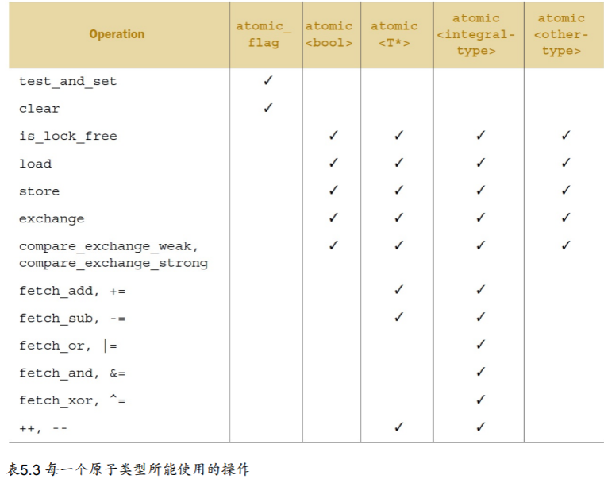

# 3. 同步并发操作

C++提供了==条件变量==和==期望==来进行线程同步。

## 3.1 等待一个事件或其他条件

 :one:标准C++库提供了两个条件变量的实现：	`std::condition_variable`和`std::condition_variable_any`。这两个实现都包含在`<condition_variable>`头文件的声明中。两者都需要与一个**互斥量**一起才能工作（互斥量是为了同步）；前者仅限于与`std::mutex`一起工作，而后者可以和**任何满足最低标准的互斥量**一 起工作，从而加上了`_any`的后缀。

因为`std::condition_variable_any`更加通用，这就可能从体积、性能，以及系统资源的使用方面产生额外的开销，所以`std::condition_variable`一般作为首选的类型，当对灵活性有硬性要求时，我们才会去考虑`std::condition_variable_any`。

怎么使用呢？

```c++
 std::mutex mut;
std::queue<data_chunk> data_queue; // 1
std::condition_variable data_cond;

void data_preparation_thread()
{
    while(more_data_to_prepare())
    {
        data_chunk const data = prepare_data();
        std::lock_guard<std::mutex> lk(mut);
        data_queue.push(data); // 2
        data_cond.notify_one(); // 3
    }
}

void data_processing_thread()
{
    while(true)
    {
        std::unique_lock<std::mutex> lk(mut); // 4
        data_cond.wait(
        	lk,[]{return !data_queue.empty();}); // 5
        
        data_chunk data = data_queue.front();
        data_queue.pop();
        lk.unlock(); // 6
        process(data);
        if(is_last_chunk(data))
        	break;
    }
}
```

具体分析可以见书P 66，或者自己分析。需要注意：`std::condition_variable`的`notify_one()`成员函数，对等待的线程（如果有等待线程）进行通知。

:two:使用条件变量构建**线程安全队列**：

```c++
#include<condition_variable>
#include<thread>
#include<mutex>
#include<queue>
#include<memory>

template<typename T>
class threadsafe_queue {
private:
	mutable std::mutex mut; //互斥量必须是可变的

	std::queue<T>data_queue;
	std::condition_variable data_cond;
public:
	threadsafe_queue() {}
	threadsafe_queue(threadsafe_queue const& other) {
		std::lock_guard<std::mutex> lk(other.mut);
		data_queue = other.data_queue;
	}

	void push(T new_value) {
		std::lock_guard<std::mutex> lk(mut);
		data_queue.push(new_value);
		data_cond.notify_one();
	}

	void wait_and_pop(T& value) {
		std::unique_lock<std::mutex> lk(mut);
		data_cond.wait(lk, [this] {return !data_queue.empty();});
		value = data_queue.front();
		data_queue.pop();
	}

	std::shared_ptr<T> wait_and_pop() {
		std::unique_lock<std::mutex> lk(mut);
		data_cond.wait(lk, [this] {return !data_queue.empty();});
		std::shared_ptr<T> res(std::make_shared<T>(data_queue.front()));
		data_queue.pop();
		return res;
	}

	bool try_pop(T& value) {
		std::lock_guard<std::mutex> lk(mut);
		if (data_queue.empty())
			return false;
		value = data_queue.front();
		data_queue.pop();
		return true;
	}

	bool empty() {
		std::lock_guard<std::mutex> lk(mut);
		return data_queue.empty();
	}
};
```


## 3.2 使用期望等待一次性事件

:one:`future`线程会周期性的等待或检查，事件是否触发；在检查期间也会执行其他任务。直到对应的任务触发，而后等待期望的状态会变为**“就绪”(ready)**。一个“期望”可能是数据相关的，也可能不是。当事件发生时（并且期望状态为就绪），**这个“期望”就不能被重置**。

在C++标准库中，有两种“期望”，使用两种类型模板实现，声明在头文件`<future>`中：==唯一期望==( `std::future<>` )和==共享期望==( `std::shared_future<> `)。这是仿照 `std::unique_ptr`和 `std::shared_ptr` 。 

后者的实现中，所有实例会在同时变为**就绪状态**，并且他们可以访问与事件相关的**任何数据**。这些**关联的数据**就是它们成为模板的原因。在与数据无关的地方，可以使用 `std::future `与 `std::shared_future `的特化模板。

`std::thread`执行的任务不能有返回值，**这个问题将在使用“期望”后解决**；

:two:解决方法是使用`std::async`启动一个==异步任务==，其返回一个`std::feature`对象（持有函数返回值）。我们需要时，只需要在上面调用`get()`。一个简单的例子：

```c++
#include <future>
#include <iostream>
int find_the_answer_to_ltuae();
void do_other_stuff();
int main()
{
    std::future<int> the_answer = std::async(find_the_answer_to_ltuae);
    do_other_stuff();
    std::cout<<"The answer is "<<the_answer.get()<<std::endl;
}

```

与 `std::thread` 做的方式一样， `std::async`允许通过添加额外的调用参数，向函数传递额外的参数。当第一个参数是一个指向成员函数的指针，第二个参数提供有这个函数成员类的具体对象（不是直接的，就是通过指针，还可以包装在 `std::ref `中），剩余的参数可作为**成员函数的参数**传入。否则，第二个和随后的参数将作为函数的参数。

```c++
#include <string>
#include <future>
struct X
{
    void foo(int,std::string const&);
    std::string bar(std::string const&);
};

X x;
auto f1 = std::async(&X::foo,&x,42,"hello"); // 调用p->foo(42, "hello")，p是指向x的指针
auto f2 = std::async(&X::bar,x,"goodbye"); // 调用tmpx.bar("goodbye")， tmpx是x的拷贝副本

struct Y
{
	double operator()(double);
};
Y y;
auto f3 = std::async(Y(),3.141); // 调用tmpy(3.141)，tmpy通过Y的移动构造函数得到
auto f4 = std::async(std::ref(y),2.718); // 调用y(2.718)

X baz(X&);
std::async(baz, std::ref(x)); // 调用baz(x)

class move_only
{
public:
    move_only();
    move_only(move_only&&)
    move_only(move_only const&) = delete;
    move_only& operator=(move_only&&);
    move_only& operator=(move_only const&) = delete;
    void operator()();
};
auto f5 = std::async(move_only()); // 调用tmp()，tmp是通过std::move(move_only())构造得到
```

:three:可以在函数调用之前使用一个额外参数来指定究竟使用什么启动方式，这个参数为`std::launch`类型：

- `std::launch::deferred`，表面该函数调用会延迟，直到在future上调用`wait()`或`get()`。
- `std::launch::async`表明该函数必须允许在它自己的线程上。
- 1|2：表明可以由具体实现来选择。这是默认的。

在本章的后面和第8章中，你将会再次看到这段程序，使用 `std::async `会让**分割算法到各个任务中变的容易**，这样程序就能并发的执行了。

### 任务与期望

`std::packaged_task<>`对一个函数或可调用对象，绑定一个期望。当`std::packaged_task<>`对象被调用，它就会调用**相关函数或可调用对象**，将期望状态置为**就绪**，返回值作为**关联数据**存储。

其**模板参数**为**函数签名**，例如`int(string&, double*)`。当然也无需严格匹配，只要可以进行转换。

```c#
#include <deque>
#include <mutex>
#include <future>
#include <thread>
#include <utility>
std::mutex m;
std::deque<std::packaged_task<void()> > tasks;
bool gui_shutdown_message_received();
void get_and_process_gui_message();

void gui_thread() // 1
{
    while(!gui_shutdown_message_received()) // 2
    {
        get_and_process_gui_message(); // 3
        std::packaged_task<void()> task;
        {
            std::lock_guard<std::mutex> lk(m);
            if(tasks.empty()) // 4
            	continue;
            task = std::move(tasks.front()); // 5
            tasks.pop_front();
		}
	task(); // 6
	}
}

std::thread gui_bg_thread(gui_thread);

template<typename Func>
std::future<void> post_task_for_gui_thread(Func f)
{
    std::packaged_task<void()> task(f); // 7
    std::future<void> res = task.get_future(); // 8
    std::lock_guard<std::mutex> lk(m); // 9
    tasks.push_back(std::move(task)); // 10
    return res;
}

```

### 使用`std::promises`

`std::promise` 提供设定值的方式（类型为T），这个类型会和`std::future`对象相关联。一对 `std::promise/std::future`提供一个可行的机制；等待线程可以阻塞期望，同时，提供数据的线程可以使用“promise”来对相关值进行设置，将“**期望**”的状态置为“**就绪**”。

可以通过`get_future()`成员函数来获取与一个给定的 `std::promise` 相关的 `std::future` 对象。当“promise”的值设置完毕（使用`set_value()`成员函数），对应“**期望**”的状态变为“**就绪**”，并且可用于检索**已存储的值**。当你在设置值之前销毁 `std::promise` ，将会存储一个==异常==。

```c++
#include <future>
void process_connections(connection_set& connections)
{
    while(!done(connections)) // 1
    {
        for(connection_iterator // 2
            connection = connections.begin(), end = connections.end();
            connection != end;
            ++connection)
            {
                if(connection->has_incoming_data()) // 3
                {
                    data_packet data = connection->incoming();
                    std::promise<payload_type>& p = connection->get_promise(data.id); // 4
                    p.set_value(data.payload);
                }
                if(connection->has_outgoing_data()) // 5
                {
                    outgoing_packet data =
                    connection->top_of_outgoing_queue();
                    connection->send(data.payload);
                    data.promise.set_value(true); // 6
                }
        	}
    }
}
```

### 考虑异常

之前的三种方法都没有考虑异常。但实际上，如果线程上的函数引发异常，该异常会存储在`future`中，代替所存储的值，变为就绪，并且对`get()`的调用会重新引发**所存储的异常**。

这同样发生在将函数**封装**入`std::packaged_task`的时候，以及`std::promise`。当你希望存入的是一个异常而非一个数值时，你就需要调用`set_exception()`成员函数，而非`set_value()`。这通常是用在一个catch块中：

```c#
extern std::promise<double> some_promise;
try
{
	some_promise.set_value(calculate_value());
}
catch(...)
{
	some_promise.set_exception(std::current_exception());
}
```

这里使用了 `std::current_exception() `来检索抛出的异常；可用 `std::copy_exception() `作为一个替换方案，`std::copy_exception() `会直接存储一个新的异常而不抛出：

```c++
some_promise.set_exception(std::copy_exception(std::logic_error("foo ")));
```

当异常类型是已知的，这就比使用`try/catch`块更加清晰，就应该优先被使用；不是因为代码实现简单，而是它给编译器提供了**极大的代码优化空间**。

直到现在，所有例子都在用 `std::future `。不过， `std::future` 也有局限性，很多线程在等待的时候，只有一个线程能获取等待结果。当多个线程需要等待相同的事件的结果，你就需要使用 `std::shared_future` 来替代 `std::future` 了。


### 多个线程的等待

在每一个 `std::shared_future`的独立对象上，成员函数调用返回的结果还是不同步的，所以为 了在多个线程访问一个独立对象时，避免数据竞争，必须使用锁来对访问进行保护。优先使用的办法：让每个线程都拥有自己对应的拷贝对象。这样，当每个线程都通过自己拥有的 `std::shared_future `对象获取结果，那么多个线程访问**共享同步结果**就是安全的。


`std::shared_future `的实例同步 `std::future `实例的状态。当 `std::future `对象没有与其他对 象共享同步状态所有权，那么所有权必须使用 `std::move` 将所有权传递到 `std::shared_future` ，其默认构造函数如下：

```c++
std::promise<int> p;
std::future<int> f(p.get_future());
assert(f.valid()); // 1 "期望" f 是合法的
std::shared_future<int> sf(std::move(f));
assert(!f.valid()); // 2 "期望" f 现在是不合法的
assert(sf.valid()); // 3 sf 现在是合法的
```

`std::future` 有一个`share()`成员函数， 可用来创建新的`std::shared_future `，并且可以直接转移“**期望**”的所有权。这样也就能保存很多类型，并且使得代码易于修改：

```c++
std::promise< std::map< SomeIndexType, SomeDataType, SomeComparator,
SomeAllocator>::iterator> p;
auto sf = p.get_future().share();
```


## 3.3 有时间限制的等待

:one:之前介绍过的所有**阻塞调用**，将会阻塞一段不确定的时间，将线程挂起直到等待的事件发生。在很多情况下，这样的方式很不错，但是在其他一些情况下，就需要限制一下线程等待的时间。

等待时间的设置有2种方式：

- 时延方式，等待一段指定时间
- 绝对时间，等待到固定的时间点。

处理**持续时间**的变量以“`for`”作为后缀，处理**绝对时间**的变量 以`until`作为后缀。而每个又有两个重载版本，其中一个重载只是等待信号触发，或时间超期；亦或是一个虚假的唤醒，并且唤醒时，会检查**锁**提供的谓词，并且只有在检查为`true`时才会返回（这时条件变量的条件达成），或直接超时。

### 时钟

:one:对于C++标准库来说，时钟就是信息源。时钟是一个类，提供了四种不同的信息：现在时间、时间类型、时钟节拍、**通过时钟节拍的速率，判断时钟是否稳定**。

**时钟的当前时间**可以通过调用静态成员函数`now()`从时钟类中获取；例如， `std::chrono::system_clock::now()` 返回系统时钟的当前时间。

**时钟节拍**被指定为`1/x`秒，这是由时间周期所决定——一个时钟一 秒有25个节拍，因此一个周期为` std::ratio<1, 25> `，当一个时钟的时钟节拍每2.5秒一次， 周期就可以表示为 `std::ratio<5, 2> `。

当**时钟节拍**均匀分布，并且不可调整，这种时钟就称为==稳定时钟==。当` is_steady`静态数据成员为`true`时，表明这个时钟就是稳定的。通常情况下， `std::chrono::system_clock` 是不稳定的，因为是可调的。

稳定闹钟对于超时的计算很重要，所 以C++标准库提供一个稳定时钟 `std::chrono::steady_clock `。`std::chrono::high_resolution_clock` 可能是标准库中提供的具有**最小节拍周期**的时钟。

:two:==时延==是时间部分最简单的；`std::chrono::duration<> `函数模板能够对**时延**进行处理（线程库使用到的所有C++时间处理工具，都在 `std::chrono` 命名空间内)。第一个模板参数是一个**类型表示**（比如，int，long或double），第二个模板参数是制定部分，表示每一个单元所用秒数。例如，当几分钟的时间要存在`short`类型中时，可以写成 `std::chrono::duration<short, std::radio<60, 1>>` ，因为**60秒**是才是**1分钟**，所以第二个参数写成 `std::ratio<60, 1> `。另一 方面，当需要将毫秒级计数存在`double`类型中时，可以写成 `std::chrono::duration<short, std::radio<1000, 1>>` ，因为1秒等于1000毫秒。

标准库在` std::chrono `命名空间内，为**延时变量**提供一系列**预定义类型**：nanoseconds[纳秒] , microseconds[微秒] , milliseconds[毫秒] , seconds[秒] , minutes[分]和hours[时]。==显示转换==可以由 `std::chrono::duration_cast<>` 来完成。

```c#
std::chrono::milliseconds ms(54802);
std::chrono::seconds s = std::chrono::duration_cast<std::chrono::seconds>(ms);
```

这里的结果就是截断的，而不是进行了舍入，所以`s`最后的值将为`54`。

**基于时延的等待**可由 `std::chrono::duration<> `来完成。例如，你等待一个“期望”状态变为就绪 ，最多35毫秒：

```c++
std::future<int> f = std::async(some_task);
if(f.wait_for(std::chrono::milliseconds(35)) == std::future_status::ready)
	do_something_with(f.get());
```

基**于时延的等待**是使用内部库提供的**稳定时钟**，来进行计时的。难以预料的系统调度和不同操作系统的**时钟精度**都意味着：在线程中，从调用到返回的实际时间可能要比`35`毫秒长。

:three:==时间点==可以用 `std::chrono::time_point<> `的类型模板实例来表示，实例的第一个参数用来指定所**要使用的时钟**，第二个函数参数用来表示**时间的计量单位**（特化的 `std::chrono::duration<> `)。

**时间戳**是时钟的一个基本属性，但是不可以直接查询。当两个时钟共享一个时间戳时，其中一个`time_point`类型可以与另一个时钟类型中的`time_point`相关联，可以通过对指定time_point类型使用`time_since_epoch()`来获取时间戳。这个成员函数会返回一个**时延值**，这个时延值是**指定时间点**到时钟的时间戳 。

可以通过 `std::chrono::time_point<> `实例来加/减时延，来获得一个**新的时间点**。

可以减去一个时间点（二者需要共享同一个时钟），结果是两个时间点的时间差：

```c++
auto start = std::chrono::high_resolution_clock::now();
do_something();
auto stop = std::chrono::high_resolution_clock::now();
std::cout << ”do_something() took “
<< std::chrono::duration<double, std::chrono::seconds>(stop - start).count()
<< ” seconds”<< std::endl;
```

```c++
#include <condition_variable>
#include <mutex>
#include <chrono>
std::condition_variable cv;
bool done;
std::mutex m;
bool wait_loop()
{
    auto const timeout = std::chrono::steady_clock::now() + std::chrono::milliseconds(500);
    std::unique_lock<std::mutex> lk(m);
    while(!done)
    {
        if(cv.wait_until(lk, timeout) == std::cv_status::timeout)
            break;
    }
    return done;
}
```

### 具有超时功能的函数

使用超时的**最简单方式**就是，对一个**特定线程**添加一个**延迟处理**；当这个线程无所事事时， 就不会**占用**可供其他线程处理的**时间**。

:one:使用==睡眠==，​两个处理函数分别是`std::this_thread::sleep_for()`和 `std::this_thread::sleep_until()` 。

超时可以配合**条件变量**和`future`一起使 用。**超时**甚至可以在尝试获取一个**互斥锁**时使用。 `std::mutex`和`std::recursive_mutex`都不支持超时锁，但是 `std::timed_mutex` 和 `std::recursive_timed_mutex `支持。这两种类型也有`try_lock_for()`和` try_lock_until()`成员函数。

C++标准库中**支持超时的函数**：参数列表为“延时”必须是 `std::duration<> `的实例，而列出为“时间点”必须是 `std::time_point<> `的实例。


## 3.4 使用同步操作简化代码

**同步工具的使用**在本章称为==构建块==，你可以只关注那些需要同步的操作，而非具体使用的机制。当需要为程序设计并发时，这是一种**简化代码的方式**，提供更多的**函数化方法**。比起在多个线程间直接共享数据，每个任务拥有自己的数据应该会更好，并且结果可以对其他线程进行**广播**，这就需要使用**“期 望”**来完成了。

### 使用期望的函数化编程

术语==“函数化编程”（functional programming ( FP )）==引用于一种编程方式，这种方式中的函数结果只依赖于传入函数的参数，**不依赖外部状态**。

> 当共享数据没有被修改，那么就不存在条件竞争，并且没有必要使用互斥量去保护共享数据。

C++是一个多范型的语言，其也可以写出FP类型的程序，特别在支持**lambda表达式**之后。**“期望”**作为拼图的最后一块，它使得==函数化编程模式并发化==（`FP-style concurrency`）在C++中成为可能；**一个“期望”对象可以在线程间互相传递，并允许其中一个计算结果依赖于另外一个的结果，而非对共享数据的显式访问**。

为了描述在**函数化(PF)并发**中使用**“期望”**，让我们来看看一个简单的实现——**快速排序算法**。

```c++
template<typename T>
std::list<T> sequential_quick_sort(std::list<T> input)
{
    if(input.empty())
    {
    	return input;
    }
    
	std::list<T> result;
    //使用splice()将输入的首个元素(中间值)放入结果列表中。
    result.splice(result.begin(), input, input.begin()); // 1
    T const& pivot = *result.begin(); // 2
    //std::partition() 对列表进行重置，并返回一个指向首元素(不小于“中间”值)的迭代器。
    auto divide_point = std::partition(input.begin(), input.end(),
    						[&](T const& t){ return t < pivot; }); // 3
    
    std::list<T> lower_part;
    lower_part.splice(lower_part.end(), input, input.begin(), divide_point); // 4
    
    //递归调用
    auto new_lower(sequential_quick_sort(std::move(lower_part))); // 5
    auto new_higher(sequential_quick_sort(std::move(input))); // 6
    
    //再次使用splice()，将result中的结果以正确的顺序进行拼接
    result.splice(result.end(), new_higher); // 7
    result.splice(result.begin(), new_lower); // 8
    return result;
}
```

快速排序——FP模式线程强化版：

```c++
#include <thread>
#include <future>
#include <list>
#include <algorithm>

template<typename T>
std::list<T> parallel_quick_sort(std::list<T> input) {
	if (input.empty()) {
		return input;
	}

	std::list<T> result;
	result.splice(result.begin(), input, input.begin());
	T const& pivot = *result.begin();

	auto divide_point = std::partition(input.begin(), input.end(),
		[&](T const& t) {return t < pivot;});

	std::list<T> low_part;
	low_part.splice(low_part.end(), input, input.begin(), divide_point);
	std::future<std::list<T>> new_lower(std::async(&parallel_quick_sort<T>, std::move(low_part)));

	auto new_higher(parallel_quick_sort(std::move(input)));
	result.splice(result.end(), new_higher);
	result.splice(result.begin(), new_lower.get());

	return result;
}
```

这里最大的变化是，当前线程不对小于**“中间”值**部分的列表进行排序，使用 `std::async()` 在另一线程对其进行排序。可以如之前一样对`new_higher`进行拼接。但是，`new_lower`列表是` std::future>` 的实例，而非是一个简单的列表，所以你需要调用get()成员函数在调用`splice()`之前去检索数值。在这之后，等待后台任务完成，并且将结果移入splice() 调用中；get()返回一个包含结果的**右值引用**，所以这个结果是可以移出的。

比起使用 `std::async()` ，可以写一个`spawn_task()`函数对`std::packaged_task` 和 `std::thread `做简单的包装

```c++
template<typename F,typename A>
std::future<std::result_of<F(A&&)>::type>
spawn_task(F&& f,A&& a)
{
    typedef std::result_of<F(A&&)>::type result_type;
    
    std::packaged_task<result_type(A&&)> task(std::move(f)));
    
    std::future<result_type> res(task.get_future());
    
    std::thread t(std::move(task),std::move(a));
    t.detach();
    return res;
}

```

另一种避开共享可变数据的并发编程范式是`CSP`。

### 使用消息传递的同步操作

==CSP==的概念十分简单：当没有**共享数据**，每个线程就可以进行独立思考，其行为纯粹基于其所接收到的信息。

具体见书。


## 3.5 总结

**同步操作**对于使用并发编写一款多线程应用来说，是很重要的一部分：**如果没有同步，线程 基本上就是独立的**，也可写成单独的应用，因其任务之间的相关性，它们可作为一个群体直接执行。本章，我们讨论了各式各样的同步操作，从基本的**条件变量**，到“**期望**”、“**承诺**”，再到打包任务。我们也讨论了**替代同步的解决方案**：**函数化模式编程**，完全独立执行的函数， 不会受到外部环境的影响；还有，**消息传递模式**，以消息子系统为中介，向线程异步的发送消息。


# 4. C++内存模型和原子类型操作

## 4.1 内存模型基础

这里从两方面来讲内存模型：一方面是**基本结构**，这个结构奠定了与内存相关的基础；另一方面就是**并发**。

### 对象和内存位置

C++程序中的所有数据都是由对象（`objects`）构成。像`int`或`float`这样的对象就是**简单基本类型**；当然，也有用户自定义类的实例。

无论对象是怎么样的一个类型，**一个对象都会存储在一个或多个内存位置上**。每一个**内存位置**不是一个**标量类型的对象**，就是一个**标量类型的子对象**，比如，`unsigned short`、` my_class*`或**序列中的相邻位域**。当你使用**位域**，就需要注意：虽然相邻位域中是不同的对 象，但仍视其为相同的内存位置。


这里有**四个需要牢记的原则**：

1. 每一个变量都是一个对象，包括作为其成员变量的对象。
2. 每个对象至少占有一个内存位置。 
3. 基本类型都有确定的内存位置（无论类型大小如何，即使他们是相邻的，或是数组的一部分）
4. 相邻位域是相同内存中的一部分。

### 对象、内存位置和并发

如果不去规定两个不同线程对同一内存地址访问的顺序，那么访问就不是**原子的**；并且，当 两个线程都是`write`时，就会产生**数据竞争**和**未定义行为**。

> 未定义的行为是C++中最黑暗的角落。

你可以使用**原子操作**来避免**未定义行为**。当然，这不会影响竞争的产生——==原子操作并没有指定访问顺序==——但**原子操作**把程序拉回了**定义行为的区域**内。

在我们了解**原子操作**前，还有一个有关对象和内存地址的概念需要重点了解：==修改顺序==。

### 修改顺序

每一个在C++程序中的对象，都有确定好的**修改顺序**（modification order），在**对象的初始化开始阶段**确定。在大多数情况下，这个顺序不同于执行中的顺序，但是在给定的执行程序中，所有线程都需要遵守这顺序。如果对象不是一个**原子类型**，你必要确保有**足够的同步操作**，来确定每个线程都遵守了**变量的修改顺序**。


## 4.2 C++中的原子操作和原子类型

==原子操作==是一类**不可分割的操作**，它的状态要不就是**完成**，要不就是**未完成**。

### 标准原子类型

:one:**标准原子类型**（`atomic types`）可以在头文件`<atomic>`中找到。虽然可以使用**互斥量**去达到**原子操作**的效果，但**只有在这些类型上的操作是原子的**。**标准原子类型**都很相似：它们大多数有一个`is_lock_free()`成员函数，这个函数允许用户决定是否直接对一个**给定类型**使用原子指令（`x.is_lock_free()`返回`true`），或对编译器和运行库使用**内部锁**（`x.is_lock_free()`返回`false`）。

只有` std::atomic_flag `类型不提供`is_lock_free()`成员函数。这个类型是一个**简单的布尔标志**，并且在这种类型上的操作都需要是**无锁的**；

剩下的原子类型都可以通过特化 `std::atomic<> `**类型模板**而访问到，并且拥有更多的功能，但可能不都是**无锁的**。

:two:除了直接使用 `std::atomic<> `类型模板外，你可以使用在表5.1中所示的**原子类型集**。在同一程序中混合使用**备选名**与` std::atomic<> `**特化类名**，会使代码的移植大打折扣。


通常，**标准原子类型是不能拷贝和赋值**，他们没有**拷贝构造函数**和**拷贝赋值操作**。但是，因为可以**隐式转化**成对应的内置类型，所以这些类型**依旧支持赋值**。它们都支持**复合赋值符**：+=, -=, *=, |= 等等。并且使用**整型**和**指针**的特化类型还支持` ++ `和` --`。

:three:每种函数类型的操作都有一个**可选内存排序参数**，这个参数可以用来指定**所需存储的顺序**。 操作分为三类：


### `std::atomic_flag`的相关操作

:one:`std::atomic_flag `是**最简单的标准原子类型**，它表示一个**布尔标志**。这个类型的对象可以在两个状态间切换：**设置**和**清除**。它就是那么的简单，只作为一个**构建块**存在。我从未期待这个类型被使用，除非在十分特别的情况下。

`std::atomic_flag `类型的对象必须被`ATOMIC_FLAG_INIT`初始化。初始化标志位是“**清除**”状 态。这没得选择：

```c++
std::atomic_flag f = ATOMIC_FLAG_INIT;
```

这是是唯一需要以如此特殊的方式初始化的原子类型，但它也是**唯一保证无锁的类型**。

:two:当**标志对象**已初始化，那么只能做三件事情：**销毁**，**清除**或**设置**（查询之前的值）。这些事情对应的函数分别是：**clear()成员函数**，和**test_and_set()成员函数**。`clear()`和` test_and_set()`成员函数可以指定好**内存顺序**。**clear()是一个存储操作**，所以不能有 `memory_order_acquire`或`memory_order_acq_rel`语义，但是`test_and_set()`是一个**“读-改写”操作**，所有可以应用于任何内存顺序标签。每一个原子操作，默认的内存顺序都是 `memory_order_seq_cst`。

```c++
f.clear(std::memory_order_release); // 1
bool x = f.test_and_set(); // 2
```

> 你不能拷贝构造另一个 std::atomic_flag 对象；你不能将一个对象赋予另一个 std::atomic_flag 对象。这并不是 std::atomic_flag 特有的，而是所有原子类型共有的。 一个原子类型的所有操作都是原子的，因为赋值和拷贝调用了两个对象，这就破坏了操作的原子性。在这样的情况下，拷贝构造和拷贝赋值都会将第一个对象的值进行读取，然后再写入另外一个。对于两个独立的对象，这里就有两个独立的操作了，合并这两个操作必定是不原子的。因此，操作就不被允许。

:three:**有限的特性集**使得 `std::atomic_flag` 非常适合于作==自旋互斥锁==。初始化标志是“**清除**”，并且**互斥量**处于**解锁状态**。为了锁上互斥量，循环运行`test_and_set()`直到旧值为`false`，就意味着线程已经被设置为`true`了。**解锁互斥量**是一件很简单的事情，将**标志清除**即可。

> 由于 std::atomic_flag 局限性太强，因为它没有**非修改查询操作**，它甚至不能像普通的布尔标志那样使用。所以，你最好使用 std::atomic<bool>
>
> - **互斥锁**加锁失败后，线程释放CPU，给其他线程；
> - **自旋锁**加锁失败后，线程会忙等待，直到它拿到锁；

```c++
class spinlock_mutex
{
    std::atomic_flag flag;
public:
    spinlock_mutex(): flag(ATOMIC_FLAG_INIT) {}
    
    void lock()
    {
    	while(flag.test_and_set(std::memory_order_acquire));
    }
    
    void unlock()
    {
    	flag.clear(std::memory_order_release);
    }
};

```

###  `std::atomic<bool>`的相关操作

:one:最基本的原子整型类型就是 `std::atomic` 。如你所料，它有着比 `std::atomic_flag `更加齐全的布尔标志特性。虽然**它依旧不能拷贝构造和拷贝赋值**，但是你可以使用一个**非原子的bool类型**构造它，所以它可以被初始化为`true`或`false`。

```c++
std::atomic<bool> b(true);
b = false;
```

虽然有**内存顺序语义指定**，但是使用`store()`去写入还是好于` std::atomic_flag` 中限制性很强的`clear()`。同样的，`test_and_set()`函数也可以被更加通用的`exchange()`成员函数所替换，`exchange()`成员函数允许使用**新值**替换已存储的值，并且返回**原始值**。`std::atomic<bool>` 也支持对**值的普通查找**，其会将对象隐式的转换为一个普通的`bool`值，或显示的调用`load()`来完成。

```c++
std::atomic<bool> b;
bool x = b.load(std::memory_order_acquire);
b.store(true);
x = b.exchange(false, std::memory_order_acq_rel);
```

:two:还提供了一种新的存储方式，叫做==“比较/交换”==：**当前值**与**预期值**一致时，存储新值的操作。形式表现为`compare_exchange_weak()`和 `compare_exchange_strong()`成员函数。

> “比较/交换”操作是原子类型编程的基石

对于`compare_exchange_weak()`函数，当原始值与预期值一致时，**存储也可能会不成功**。这被称为“==伪失败”== （spurious failure），因为造成这种情况的原因是**时间**，而不是**变量值**。因为`compare_exchange_weak()`可以“**伪失败**”，所以这里通常使用一个**循环**：

```c++
bool expected = false;
extern atomic<bool> b; // 设置些什么
while(!b.compare_exchange_weak(expected, true) && !expected);
```

> 在这个例子中，循环中expected的值始终是false，如果一直**伪失败**。
>
> bool  compare_exchange_weak (T& expected, T val, ...)
>
> - if true, it replaces the *contained value* with val   ；
>
> - if false, it replaces expected with the *contained value* .

:three:“比较/交换”函数可以接受两个**内存顺序参数**，这就就允许**内存顺序语义**在成功和失败中有所不同。一般来说，**失败情况的内存顺序不会比成功的更严格**（所以一般是其子集？）。如果没有为失败指定，则默认其和成功一致。

`std::atomic<bool>` 和 `std::atomic_flag `的不同之处在于，` std::atomic `不是无锁的； 为了保证操作的原子性，其实现中需要一个**内置的互斥量**。当处于特殊情况时，你可以使用` is_lock_free()`成员函数，去检查` std::atomic<bool> `上的操作是否无锁。这是另一个，除了 `std::atomic_flag `之外，**所有原子类型都拥有的特征**。

### std::atomic<T*>指针运算

:one:这是第二简单的，所提供的新操作是==指针算数运算==。基本操作由`fetch_add()`和`fetch_sub()`提供，可以在**存储地址**上做**原子加法**和**减法**，为`+=`，` -=`，` ++`和`--`提供简易的封装。

如果x是 `std::atomic<foo*>` 类型的数组的首地址，然后`x+=3`让其偏移到第四个元素的地址，并且返回一个普通的 **Foo* 类型值**，这个指针值指向数组中第四个元素。` fetch_add()`和`fetch_sub()`的返回值略有不同，让`x`指向第四个元素，但函数返回指向第一个元素的地址。这种操作也被称为==“交换-相加”==。

正像其他操作那样，返回值是一个**普通的 T* 值**，而非是 `std::atomic `对象的引用

```c++
class Foo{};
Foo some_array[5];
std::atomic<Foo*> p(some_array);
Foo* x = p.fetch_add(2); // p加2，并返回原始值
assert(x == some_array);
assert(p.load() == &some_array[2]);
x = (p -= 1); // p减1，并返回原始值
assert(x == &some_array[1]);
assert(p.load() == &some_array[1]);
```

:two:函数也允许**内存顺序语义**作为给定函数的参数：

```c++
p.fetch_add(3, std::memory_order_release);
```

对于运算形式，指定顺序语义是不可能的，因此总是有`memory_order_seq_cst`语义。

### 标准原子整型的操作

:one:只有除法、乘法和移位操作不在其中（其他基本都可以）。因为，**整型原子值**通常用来作计数器，或者是掩码，所以以上操作的缺失显得不是那么重要；如果需要，额外的操作可以将`compare_exchange_weak()`放入循环中完成。

### std::atomic<>初级类模板

:one:除了**标准原子类型**之外，允许用户使用**自定义类型**创建一个**原子变量**。不是任何自定义类型都可以使用 `std::atomic<>` 的，需要满足一定的标准才行：为了使用 `std::atomic<UDT>` （UDT是用户定义的）

- ==这个类型必须有平凡`trival`的拷贝赋值运算符==。这就意味着这个类型**不能有任何虚函数或虚基类**，及必须使用**默认的拷贝赋值操作**
- 不仅如此，自定义类型中**所有的基类**和**非静态数据成员**也都需要支持**拷贝赋值操作**。
- 这个类型必须是“**位可比的**"。这与对赋值的要求差不多，要确定其对象可以使用` memcmp()`对**位**进行比较。

> 这(基本上)就允许编译器使用`memcpy()`，或等价操作，因为它们的实现中没有用户代码。

以上**严格的限制**都是依据**第3章中的一个建议**：不要将锁定区域内的数据，以**引用**或**指针**的形式，作为参数传递给用户提供的函数。通常情况下，编译器不会为` std::atomic<UDT>`类型生成**无锁代码**，所以它将对**所有操作**使用一个**内部锁**。如果用户提供的**拷贝赋值**或**比较操作**被允许，那么这就需要传递**保护数据的引用**作为一个参数，这就有悖于指导意见了。

:two:如果UDT类型的大小如同（或小于）一个`int`或 `void*` 类型时，大多数平台将会对 `std::atomic` 使用**原子指令**。有些平台可能会对用户自定义类型（两倍于`int`或 `void*` 的大小）特化的 `std::atmic<UDT>` 使用原子指令。



### 原子操作的非成员函数

:one:以上我们讨论的都是原子类型的**成员操作**，但实际上也存在对应的**非成员函数**，而且还进行了变种（是否指定**内存顺序标签**，形式上是否有`_explicit`后缀），例如：

```c++
std::atomic_store(&atomic_var, new_value);
std::atomic_store_explicit(&atomic_var, new_value, std::memory_order_release);
```

需要注意的是，这些非成员函数都是兼容C的，所以它们没有**按引用**参数，而都是**按指针**传递。

:two:**标准原子类型**不仅仅是为了避免**数据竞争**所造成的**未定义操作**，它们还允许用户对不同线程上的操作进行==强制排序==。这种强制排序是**数据保护和同步**操作的基础 。


## 4.3 同步操作和强制顺序

:one:假设你有**两个线程**，一个向数据结构中**填充数据**，另一个**读取数据结构中的数据**。为了避免**恶性条件竞争**，第一个线程设置一个标志，用来表明数据已经准备就绪，并且第二个线程在这个标志设置前不能读取数据。下面的程序清单就是这样的情况：

```c++
#include <vector>
#include <atomic>
#include <iostream>
std::vector<int> data;
std::atomic<bool> data_ready(false);

void reader_thread()
{
    while(!data_ready.load()) // 1
    {
    	std::this_thread::sleep(std::milliseconds(1));
    }
    std::cout<<"The answer = "<<data[0]<<"\m"; // 2
}

void writer_thread()
{
	data.push_back(42); // 3
	data_ready = true; // 4
}
```


### 同步发生

:one:==同步发生==：只能在原子类型之间进行的操作。例如对一个**数据结构**进行操作（对互斥量上锁），如果数据结构包含有**原子类型**，并且操作内部执行了一定的**原子操作**，那么这些操作就是**同步发生关系**。

**基本想法**：如果**线程A**存储了一个值，并且**线程B**读取了这个值，**线程A的存储操作**与**线程B的载入操作**就是**同步发生的关系**。

### 先行发生

:one:==先行发生==关系是一个程序中，基本构建块的操作顺序；它指定了某个操作去影响另一个操作。如果源码中**操作A**发生在**操作B**之前，那么A就先行与B发生。以下是**无序操作**：

```c++
#include <iostream>
void foo(int a,int b)
{
	std::cout<<a<<”,”<<b<<std::endl;
}

int get_num()
{
    static int i=0;
    return ++i;
}

int main()
{
	foo(get_num(),get_num()); // 无序调用get_num()
}
```

以上是**排序线性**（单线程），线程间的先行比较简单，依赖于**同步发生**：如果**操作A**在一个线程上，与另一个线程上的**操作B**同步，那么`A`就线程间先行与`B`。这具备**传递性**。

### 原子操作的内存顺序:star:

:one:里有**六个内存序列选项**可应用于对原子类型的操作：

+ memory_order_relaxed
+ memory_order_consume
+ memory_order_acquire
+ memory_order_release
+ memory_order_acq_rel
+ memory_order_seq_cst

虽然有六个选项，但是**它们仅代表三种内存模型**：

+ **排序一致序列**（sequentially consistent）
+ **获取-释放序列** （memory_order_consume, memory_order_acquire, memory_order_release和 memory_order_acq_rel）
+ **自由序列**（memory_order_relaxed）

:two:**默认序列**命名为“**排序一致**”（sequentially cons），是因为它意味着，**程序中的行为从任意角度去看，序列顺序都保持一致**。如果**原子类型实例**上的所有操作都是**序列一致的**，那么一个**多线程程序的行为**，就以某种特殊的排序执行，**好像单线程那样**。（这个排序最简单）

从**同步的角度**看，对于同一变量，**排序一致的存储操作**同步相关于**同步一致的载入操作**。这就提供了一种对两个（以上）线程操作的**排序约束**，但是排序一致的功能要比排序约束大的多。 所以，对于使用排序一致原子操作的系统上的**任一排序一致的原子操作**，**都会在对值进行存储以后，再进行加载**。

简单是要付出代价的。在一个**多核弱排序的机器**上，它会加强**对性能的惩罚**，因为整个序列中的操作都必须在多个处理器上保持一致，可能需要对处理器间的同步操作进行扩展 （代价很昂贵！）。

```c++
#include <atomic>
#include <thread>
#include <assert.h>
std::atomic<bool> x,y;
std::atomic<int> z;

void write_x()
{
	x.store(true,std::memory_order_seq_cst); // 1
}

void write_y()
{
	y.store(true,std::memory_order_seq_cst); // 2
}

void read_x_then_y()
{
    while(!x.load(std::memory_order_seq_cst));
    if(y.load(std::memory_order_seq_cst)) // 3
    	++z;
}

void read_y_then_x()
{
    while(!y.load(std::memory_order_seq_cst));
    if(x.load(std::memory_order_seq_cst)) // 4
    	++z;
}

int main()
{
    x = false;
    y = false;
    z = 0;
    std::thread a(write_x);
    std::thread b(write_y);
    std::thread c(read_x_then_y);
    std::thread d(read_y_then_x);
    a.join();
    b.join();
    c.join();
    d.join();
    assert(z.load() != 0); // 5, 几乎不可能触发
}
```


==序列一致是最简单、直观的序列，但也是最昂贵的内存序列==，因为它需要**对所有线程进行全局同步**。在一个多处理系统上，这就需要**处理期间**进行大量并且费时的**信息交换**。

> 如果`std::memory_order_seq_cst` 同时存在`store`(写）和`load`(读）那么顺序一致性模型保证==写必须在读之前发生==。

:two:**非排序一致内存模型**。意味着**不同线程**看到**相同操作**，不一定有着相同的顺序。

不仅是要摒弃**交错执行操作**的想法，你还要**放弃**使用编译器或处理器**重排指令**的想法。在没有明确的顺序限制下，**唯一的要求就是，所有线程都要统一对每一个独立变量的修改顺序**。 对不同变量的操作可以体现在不同线程的不同序列上，提供的值要与**任意附加顺序限制**保持一致。

让我们进入非排序的世界。

:three:自由序列（`memory_order_relaxed`）。==没有任何同步关系==。在**同一线程**中对于**同一变量**的操作还是**服从先发执行**的关系。唯一的要求是，访问同一线程中的单个原子变量**不能重排序**；当一个给定线程已经看到一个原子变量的特定值，线程随后的**读操作**就**不会**去检索变量**较早值**。

```c++
#include <atomic>
#include <thread>
#include <assert.h>
std::atomic<bool> x,y;
std::atomic<int> z;

void write_x_then_y()
{
    x.store(true, std::memory_order_relaxed); // 1
    y.store(true, std::memory_order_relaxed); // 2
}

void read_y_then_x()
{
    while(!y.load(std::memory_order_relaxed)); // 3
    if(x.load(std::memory_order_relaxed)) // 4
    	++z;
}

int main()
{
    x = false;
    y = false;
    z = 0;
    std::thread a(write_x_then_y);
    std::thread b(read_y_then_x);
    a.join();
    b.join();
    assert(z.load() != 0); // 5，可能会触发
}
```

此时，**写**就不必在**读**之前了。因为**加载x的操作**④可能读取到`false`，即使**加载y的操作**③读取到 `true`，并且**存储x的操作**①先发与**存储y的操作**②。`x`和`y`是两个不同的变量，所以这里**没有顺序去保证每个操作产生相关值的可见性**。


一个略微复杂的例子：

```c++
#include <thread>
#include <atomic>
#include <iostream>
std::atomic<int> x(0),y(0),z(0); // 1
std::atomic<bool> go(false); // 2
unsigned const loop_count = 10;
struct read_values
{
	int x,y,z;
};

read_values values1[loop_count];
read_values values2[loop_count];
read_values values3[loop_count];
read_values values4[loop_count];
read_values values5[loop_count];

void increment(std::atomic<int>* var_to_inc,read_values* values)
{
    while(!go)std::this_thread::yield(); // 3 自旋，等待信号
    for(unsigned i = 0; i < loop_count; ++i)
    {
        values[i].x = x.load(std::memory_order_relaxed);
        values[i].y = y.load(std::memory_order_relaxed);
        values[i].z = z.load(std::memory_order_relaxed);
        var_to_inc->store(i+1, std::memory_order_relaxed); // 4
        std::this_thread::yield();
    }
}

void read_vals(read_values* values)
{
    while(!go)	std::this_thread::yield(); // 5 自旋，等待信号
    for(unsigned i = 0; i < loop_count; ++i)
    {
        values[i].x = x.load(std::memory_order_relaxed);
        values[i].y = y.load(std::memory_order_relaxed);
        values[i].z = z.load(std::memory_order_relaxed);
        std::this_thread::yield();
    }
}

void print(read_values* v)
{
    for(unsigned i = 0; i < loop_count; ++i)
    {
        if(i)
        	std::cout<<",";
        std::cout<<"("<<v[i].x<<","<<v[i].y<<","<<v[i].z<<")";
    }
	std::cout<<std::endl;
}

int main()
{
    std::thread t1(increment,&x,values1);
    std::thread t2(increment,&y,values2);
    std::thread t3(increment,&z,values3);
    std::thread t4(read_vals,values4);
    std::thread t5(read_vals,values5);
    go = true; // 6 开始执行主循环的信号
    t5.join();
    t4.join();
    t3.join();
    t2.join();
    t1.join();
    print(values1); // 7 打印最终结果
    print(values2);
    print(values3);
    print(values4);
    print(values5);
}

```

**自由的原子操作**难以处理。他们必须与**原子操作**结合使用，这些原子操作必须有**较强的排序语义**，为了让内部线程同步变得更有用。我强烈建议**避免自由的原子操作**，除非它们是硬性要求的，并且在使用它们的时候需要十二分的谨慎。

> 总结来说，线程内原子操作按**代码顺序**进行，但是线程间的顺序是任意的

:four:**获取释放序列**。获取额外的**同步**，且不使用全局排序一致。

这个序列是**自由序列(relaxed ordering)的加强版**；虽然操作依旧没有统一的顺序，但是在这个序列引入了**同步**。在这种序列模型中，**原子加载就是“获取”操作** (memory_order_acquire)，**原子存储就是“释放”操作**，原子`读-改-写`操作（例如`fetch_add()`或`exchange()`）在这里，不是“获取”，就是“释放”，或者两者兼有。

同步在**线程释放和获取间**，是成对的（pairwise）。释放操作与获取操作同步，这样就能读取已写入的值。这意味着不同线程看到的序列虽还是不同，但这些序列都是受限的。

```c++
#include <atomic>
#include <thread>
#include <assert.h>
std::atomic<bool> x,y;
std::atomic<int> z;

void write_x()
{
	x.store(true,std::memory_order_release);
}

void write_y()
{
	y.store(true,std::memory_order_release);
}

void read_x_then_y()
{
    while(!x.load(std::memory_order_acquire));
    if(y.load(std::memory_order_acquire)) // 1
   		++z;
}

void read_y_then_x()
{
    while(!y.load(std::memory_order_acquire));
    if(x.load(std::memory_order_acquire))
        ++z;
}

int main()
{
    x = false;
    y = false;
    z = 0;
    std::thread a(write_x);
    std::thread b(write_y);
    std::thread c(read_x_then_y);
    std::thread d(read_y_then_x);
    a.join();
    b.join();
    c.join();
    d.join();
    assert(z.load()!= 0); // 3
}

```

在这个例子中**断言③**可能会触发（和**自由序列**一样），因为可能在加载**x②**和**y③**的时候，读取到的是`false`。因为`x`和`y`是由不同线程写入，所以序列中的**每一次释放到获取**都不会影响到其他线程的操作。


> 对于读取的结果，两个**读取线程**看到的是**两个完全不同的世界**。如前所述，这可能是因为这里没有对**先行顺序**进行强制规定导致的。

**获取-释放操作**会影响**序列中的释放操作**：

```c++
#include <atomic>
#include <thread>
#include <assert.h>
std::atomic<bool> x,y;
std::atomic<int> z;
void write_x_then_y()
{
    x.store(true,std::memory_order_relaxed); // 1 自旋，等待y被设置为true
    y.store(true,std::memory_order_release); // 2
}

void read_y_then_x()
{
    while(!y.load(std::memory_order_acquire)); // 3
    if(x.load(std::memory_order_relaxed)) // 4
    	++z;
}

int main()
{
    x = false;
    y = false;
    z = 0;
    std::thread a(write_x_then_y);
    std::thread b(read_y_then_x);
    a.join();
    b.join();
    assert(z.load() != 0); // 5
}

```

看到头大，具体见书。


**:five:获取-释放序列**和`memory_order_consume`的**数据相关性**。

`memory_order_consume`很特别：它**完全依赖于数据**，并且其展示了与**线程间先行关系**的不同之处。

这里有**两种新关系**用来处理**数据依赖**：前序依赖（`dependency-ordered-before`）和携带依赖 （`carries-a-dependency-to`）。就像`sequenced-before`，**携带依赖**对于数据依赖的操作， 严格应用于一个独立线程和其基本模型；如果A操作结果要使用操作B的操作数，而后A将携带依赖与B。如果A操作的结果是一个标量，比如`int`，当A的结果存储在一个变量中，并且这个变量需要被其他操作使用，此关系也是适用的。这个操作是也是可传递的，所以当A携带依赖B，并且B携带依赖C，就可以得出A携带依赖C。 

这种内存序列的一个很重要使用方式，是在**原子操作**载入**指向数据的指针**时。当使用 `memory_order_consume`作为加载语义，并且`memory_order_release`作为之前的存储语义， 你要保证**指针指向的值**是**已同步的**，并且不需要对其他任何非独立数据施加任何同步要求。 下面的代码就展示了这么一个场景。

```c++
struct X
{
	int i;
	std::string s;
};

std::atomic<X*> p;
std::atomic<int> a;

void create_x()
{
    X* x = new X;
    x->i = 42;
    x->s = "hello";
    a.store(99, std::memory_order_relaxed); // 1
    p.store(x, std::memory_order_release); // 2
}

void use_x()
{
    X* x;
    while(!(x = p.load(std::memory_order_consume))) // 3
    	std::this_thread::sleep(std::chrono::microseconds(1));
    assert(x->i == 42); // 4
    assert(x->s == "hello"); // 5
    assert(a.load(std::memory_order_relaxed) == 99); // 6
}

int main()
{
    std::thread t1(create_x);
    std::thread t2(use_x);
    t1.join();
    t2.join();
}
```

有时，你不想为**携带依赖**增加其他的**开销**。你想让编译器在寄存器中缓存这些值，以及优化重排序操作代码，而不是对这些依赖大惊小怪。这种情况下，你可以使用`std::kill_dependecy() `来显式打破**依赖链**。`std::kill_dependency() `是一个简单的函数模板，其会复制**提供的参数**给返回值，但是依旧会打破**依赖链**。例如，当你拥有一个全局的**只读数组**，当其他线程对**数组索引**进行检索时，你使用的是 `std::memory_order_consume` ，那么可以使用 `std::kill_dependency() `让编译器知道这里不需要重新读取该数组的内容，就像下面的例子一样：

```c++
int global_data[] = { … };
std::atomic<int> index;
void f()
{
    int i = index.load(std::memory_order_consume);
    do_something_with(global_data[std::kill_dependency(i)]);
}
```

### 一点思考和总结:star:


就目前了解到的内存顺序，总结下自己浅薄的理解：

- 自由序列。这个只保证线程间的代码顺序（这个都不保证，还写什么代码，去搞量子code），线程间则是神魔乱舞，不知道编译器给你优化成什么顺序。所以说限制太大（给你的自由过了火），不推荐使用。（不保证任何线程读取的数据是否是**脏数据**）

- `memory_order_consume`。这个会保证两个线程间的获取-释放的同步，但只会保证依赖的代码的顺序，无关对象不会关心，不像下一个模型，位于获取之前的**任何指令**都关心。

- 获取-释放序列。一开始没怎么搞懂，但后面有了点认知，关键在于**成对**，这是它和全局一致序列的最大区别。多个线程间的获取（store）和释放（release\load）是成对的，这意味着只有这两个保证顺序，A写了5，成对的B释放读取A（5），但单身狗C永远不确定A的值，也就是不保证A和C的同步顺序。此外呢，这个内存顺序还有个特点，如果A之前有其他原子获取操作，那么这个顺序B是知道的，那么B会继承这个先行关系。

- 顺序一致序列。等于在保持单线程顺序的同时，将线程间的顺序插入重排，例如：1 ： ABC，2：DEF，3：UVW，可能的顺序为：ADEWVFWBC。这样其实对于线程1来说，它就知道了线程2和3的执行顺序。其实也就和单线程没有什么区别了。

  一篇优秀教程：[内存模型](https://www.codedump.info/post/20191214-cxx11-memory-model-1/):star::star:

