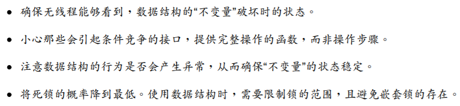
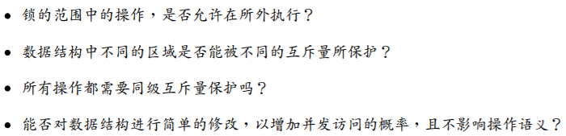
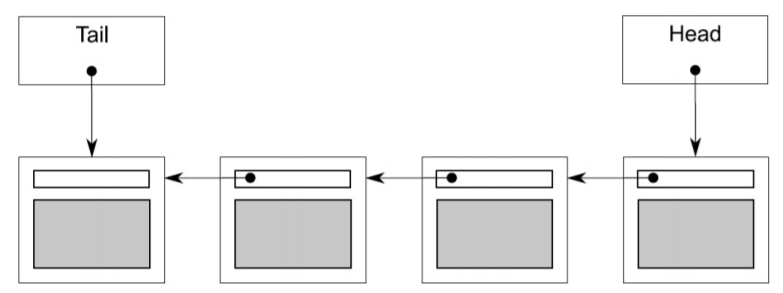

# 5. 设计基于锁的并发数据结构

## 5.1 为并发设计的含义是什么

设计**并发数据结构**，意味着多个线程可以并发的访问这个数据结构，线程可对这个数据结构做相同或不同的操作，并且每一个线程都能在**自治域**中看到该数据结构。且在**多线程环境**下，无数据丢失和损毁，维持所有**不变量**，且无**条件竞争**。这样的数据结构， 才能称为==线程安全==。

**实际的设计意义**并不止上面提到的那样：为线程提供并发访问数据结构的机 会。本质上，使用**互斥量**是提供**互斥特性**：在互斥量的保护下，同一时间内只有一个线程可以获取互斥锁。

这被称为==序列化==（`serialzation`）：**线程轮流访问被保护的数据**。这其实是对数据进行串行访问，而非并发。因此，需要对**数据结构的设计**进行仔细斟酌，确保其能**真正并发访问**。

### 并发设计的指导与建议

当设计并发数据结构时，有**两方面**需要考量：一是确保访问是**安全**的，二是能**真正的并发访问**。



在思考上诉**设计细节**前，你还需要考虑这个数据结构对于使用者来说**有什么限制**；当一个线程通过一个**特殊的函数**对数据结构进行访问时，那么还有**哪些函数**能被其他的线程**安全调用**呢？

第二个方面是，==确保真正的并发访问==。这里没法提供更多的指导意见；不过，作为一个数据结构的设计者，在设计数据结构时，自行考虑以下问题：



这些问题都源于一个指导思想：==如何让序列化访问最小化，让真实并发最大化==。

## 5.2 基于锁的并发数据结构

基于锁的并发数据结构设计，需要确保访问线程**持有锁的时间最短**。对于只用一个互斥量的数据结构来说，这十分困难。需要保证数据不被锁之外的操作所访问到，还要保证不会产生**条件竞争**。而使用**多个互斥元**则会产生**死锁**。

### 使用锁的线程安全栈

先把第3章（笔记中第二章）中**线程安全的栈**拿过来看看：(这里试图实现一个线程安全版的` std:stack<>` )

```c++
#include <exception>
struct empty_stack: std::exception
{
	const char* what() const throw();
};

template<typename T>
class threadsafe_stack
{
private:
    std::stack<T> data;
    mutable std::mutex m;

public:
    threadsafe_stack(){}

    threadsafe_stack(const threadsafe_stack& other)
    {
        std::lock_guard<std::mutex> lock(other.m);
        data = other.data;
    }
    
    threadsafe_stack& operator=(const threadsafe_stack&) = delete;
    
    void push(T new_value)
    {
        std::lock_guard<std::mutex> lock(m);
        data.push(std::move(new_value)); // 1
    }
    
    std::shared_ptr<T> top()
    {
        std::lock_guard<std::mutex> lock(m);
        if(data.empty()) throw empty_stack(); // 2
        std::shared_ptr<T> const res(std::make_shared<T>(std::move(data.top()))); // 3
        data.pop(); // 4
        return res;
    }
    
    void pop(T& value)
    {
        std::lock_guard<std::mutex> lock(m);
        if(data.empty()) throw empty_stack();
        value = std::move(data.top()); // 5
        data.pop(); // 6
    }
    
    bool empty() const
    {
        std::lock_guard<std::mutex> lock(m);
        return data.empty();
    }
};
```

首先，**互斥量**`m`能保证**基本的线程安全**，那就是对每个成员函数进行**加锁保护**。这就保证在同一时间内，只有一个线程可以访问到数据，所以能够保证，数据结构的“**不变量**”被破坏时，不会被其他线程看到。

**序列化线程**会隐性的**限制程序性能**，这就是**栈**争议声最大的地 方：当一个线程在等待锁时，它就会无所事事。当一个线程需要等待时，其会定期检查`empty()`或`pop()`，以及对`empty_stack `异常进行关注。这样的现实会限制栈的实现的方式，在线程等待的时候，会浪费宝贵的资源去检查数据，这就使**内部锁**失去存在的意义——造成资源的浪费。

### 使用锁和条件变量的线程安全队列

```c++
template<typename T>
class threadsafe_queue
{
private:

    mutable std::mutex mut;
    std::queue<T> data_queue;
    std::condition_variable data_cond;

public:
    
    threadsafe_queue()
    {}
    
    void push(T new_value)
    {
        std::lock_guard<std::mutex> lk(mut);
        data_queue.push(std::move(data));
        data_cond.notify_one(); // 1
    }
    
    void wait_and_pop(T& value) // 2
    {
        std::unique_lock<std::mutex> lk(mut);
        data_cond.wait(lk, [this]{return !data_queue.empty();});
        value = std::move(data_queue.front());
        data_queue.pop();
    }
    
    std::shared_ptr<T> wait_and_top() // 3
    {
        std::unique_lock<std::mutex> lk(mut);
        data_cond.wait(lk, [this]{return !data_queue.empty();}); // 4
        std::shared_ptr<T> res(std::make_shared<T>(std::move(data_queue.front())));
        data_queue.pop();
        return res;
    }
    
    bool try_pop(T& value)
    {
        std::lock_guard<std::mutex> lk(mut);
        if(data_queue.empty())
            return false;
        value = std::move(data_queue.front());
        data_queue.pop();
        return true;
    }
    
    std::shared_ptr<T> try_pop()
    {
        std::lock_guard<std::mutex> lk(mut);
        if(data_queue.empty())
            return std::shared_ptr<T>(); // 5
        std::shared_ptr<T> res(std::make_shared<T>(std::move(data_queue.front())));
        data_queue.pop();
        return res;
    }
    
    bool empty() const
    {
        std::lock_guard<std::mutex> lk(mut);
        return data_queue.empty();
    }
};
```

`wait_and_pop()`函数是等待队列向栈进行输入的一个解决方案；比起持续调用`empty()`，等待线程调用`wait_and_pop()`函数和数据结构处理等待中的**条件变量**的方式要好很多。对于` data_cond.wait()`的调用，直到队列中有一个元素的时候，才会返回，所以你就不用担心会出现一个**空队列的情况**了，还有，数据会一直被**互斥锁**保护。因为**不变量**这里并未发生变化， 所以函数不会添加**新的条件竞争或是死锁**。

==异常安全在这里的会有一些变化==，当不止一个线程等待对队列进行`push`操作时，只会有一个线程，因得到`data_cond.notify_one()`，而继续工作着。但是，如果这个工作线程在 `wait_and_pop()`中抛出一个异常，例如：构造新的` std::shared_ptr<> `对象④时**抛出异常**，那么==其他线程则会永世长眠==。

替代方案是，当有异常抛出的时候，让`wait_and_pop()`函数调用`notify_one()`，从而让个另一个线程可以去尝试索引**存储的值**。另一种替代方案就是，将`std::shared_ptr<> `的初始化过程移到`push()`中，并且存储 `std::shared_ptr<> `实例，而非直接使用数据值，下面就是进行的这种修改：

```c++
void push(T new_value)
{
    std::shared_ptr<T> data(
    std::make_shared<T>(std::move(new_value))); // 5
    std::lock_guard<std::mutex> lk(mut);
    data_queue.push(data);
    data_cond.notify_one();
}

std::shared_ptr<T> wait_and_pop()
{
    std::unique_lock<std::mutex> lk(mut);
    data_cond.wait(lk,[this]{return !data_queue.empty();});
    std::shared_ptr<T> res = data_queue.front(); // 3
    data_queue.pop();
    return res;
}
```

如同**栈**的例子，使用**互斥量**保护整个数据结构，不过会限制队列**对并发的支持**。要对数据结构实现进行具体的控制，需要提供更多**细粒度锁**，来完成更高级的并发。


### 使用细粒度锁和条件变量的线程安全队列

对于队列来说，最简单的数据结构就是**单链表**了，就如图那样。队列里包含一个头指针， 其指向链表中的第一个元素，并且每一个元素都会指向下一个元素。从队列中删除数据，其实就是将**头指针**指向下一个元素，并将之前**头指针指向的值**进行返回。



具体讨论见书。下面直接给出带有**虚拟节点**的队列：

```c++
template<typename T>
class queue
{
private:
    struct node
    {
        std::shared_ptr<T> data; // 1
        std::unique_ptr<node> next;
    };
	
    std::unique_ptr<node> head;
	node* tail;
public:
    queue(): head(new node), tail(head.get()) // 2
    {}
    
    queue(const queue& other) = delete;
    queue& operator=(const queue& other) =d elete;
    
    std::shared_ptr<T> try_pop()
    {
        if(head.get() == tail) // 3
        {
        	return std::shared_ptr<T>();
        }
        std::shared_ptr<T> const res(head->data); // 4
        std::unique_ptr<node> old_head = std::move(head);
        head = std::move(old_head->next); // 5
        return res; // 6
    }
    
    void push(T new_value)
    {
        std::shared_ptr<T> new_data(std::make_shared<T>(std::move(new_value))); // 7
        std::unique_ptr<node> p(new node); //8
        tail->data = new_data; // 9
        node* const new_tail = p.get();
        tail->next = std::move(p);
        tail = new_tail;
    }
};
```

这个方法本质上，头部节点`head`始终指向傀儡节点。这样可以避免多线程下的数据竞争。怎么说呢？如果队列为空，`try_pop`不会访问`head->next`；而加入一个节点，`head`和`tail`就指向了不同的节点。

> 旧有方法（见书）在队列只有一个节点时，会产生数据竞争。

现在的`push()`只能访问`tail`，而不能访问`head`，这就是一个进步。`try_pop()`访问`head`和`tail`，但是`tail`只需在最初进行比较，所以**存在的时间很短**。**重大的提升**在于，**虚拟节点**意味着`try_pop()`和`push()`不能对同一节点进行操作，所以这里已经不再需要互斥了。那么，你只需要使用**一个互斥量**来保护`head`和`tail`就够了。那么，**现在应该锁哪里**？

```c++
template<typename T>
class threadsafe_queue
{
private:
    struct node
    {
        std::shared_ptr<T> data;
        std::unique_ptr<node> next;
    };
    
    std::mutex head_mutex;
    std::unique_ptr<node> head;
    std::mutex tail_mutex;
    node* tail;
    
    node* get_tail()
    {
        std::lock_guard<std::mutex> tail_lock(tail_mutex);
        return tail;
    }
    
    std::unique_ptr<node> pop_head()
    {
        std::lock_guard<std::mutex> head_lock(head_mutex);
        if(head.get() == get_tail())
        {
            return nullptr;
        }
        
        std::unique_ptr<node> old_head = std::move(head);
        head = std::move(old_head->next);
        return old_head;
    }
    
public:
    threadsafe_queue(): head(new node), tail(head.get())
    {}
    
    threadsafe_queue(const threadsafe_queue& other) = delete;
    threadsafe_queue& operator=(const threadsafe_queue& other) = delete;
    
    std::shared_ptr<T> try_pop()
    {
        std::unique_ptr<node> old_head = pop_head();
        return old_head ? old_head->data : std::shared_ptr<T>();
    }
    
    void push(T new_value)
    {
        std::shared_ptr<T> new_data(std::make_shared<T>(std::move(new_value)));
        std::unique_ptr<node> p(new node);
        node* const new_tail = p.get();
        
        std::lock_guard<std::mutex> tail_lock(tail_mutex);
        tail->data = new_data;
        tail->next = std::move(p);
        tail = new_tail;
    }
};
```

