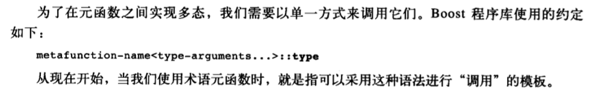
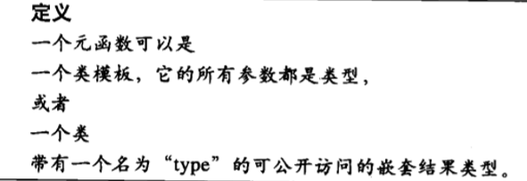
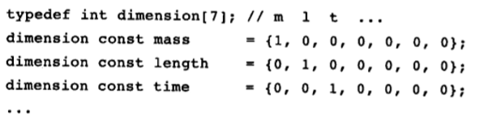
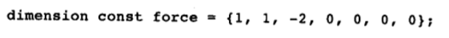
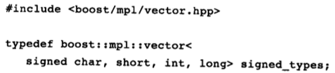

[toc]


# 1. 概述

:one:==元程序就是用于操纵代码的程序==。


## 1.1 在C++中进行元编程

:one:下面的**元程序**将**无符号的十进制数值**转换为等价的**二进制值**，允许我们用一种易辨识的形式来表示二进制常数：

```c++
template<unsigned long N>
struct binary
{
	static unsigned const long value = binary<N/10>::value * 2 + N % 10;
};

template<>
struct binary<0>
{
	static unsigned const long value = 0;
};
```

> 对于上诉程序的**输入检查**，将在后续章节补充

C++语言的**编译期组成部分**通常称为“==纯函数性语言==”，因为它和`Haskell`这样的语言具有一个共同的特性：==元数据是不可变的==（常性的，`immutable`），并且元函数没有副作用。结果导致**编译期C++**没有任何与**用于运行期C++中的非常量变量**相对应的东西。由于你无法在不检查其终结条件中一些可变的东西的状态的情况下编写一个**有限循环**，因此==在编译期无法实现迭代==。因此，对于C++元程序来说，**递归是惯用的手段**。

:two:远比**在编译期进行数值计算**的能力重要得多的是：`C++`**对类型进行计算的能力**。（第二章之后，相信我，你会很熟悉它）


## 2.2 为什么进行元编程

:one:采用元程序**最显而易见的理由**是：通过在程序启动之前做尽可能多的工作，我们可以==获得速度更快的程序==。

使用元程序的一个**更微妙但也更重要的理由**是：这种做法可以使得**计算结果**和**目标语言**进行更深入地互动。

将元程序与其他代码、尤其是**其他元程序**进行**接口连接**，会变得平滑得多。

> 研究下Boost元编程库（MPL）


# 2. Trait和类型操纵

## 2.1 类型关联

:one:在C++中，可以在编译期进行操纵的实体称为==元数据==，大致可以分为两个：类型`types`和非类型。==任何种类的元数据都可用做模板参数==。第1章中使用的**常量整数值**就属于一种非类型，此范畴还包括**可在编译期知道的几乎任何其他值**，包括其他整型、枚举、函数和**“全局”对象的指针和引用**，以及**指向成员的指针**。

> 接下里就是一大串文字，来说明为什么我们需要`type-trait`。这里就跳过了。


## 2.2 元函数

:one:`trait`模板的**参数和嵌套类型**在编译期发挥了类似于**普通函数的参数和返回值**在运行期发挥的作用。

除了**传递和返回**的是类型，`trait`模板还展示了两个显著的特征，它们在普通函数身上是看不到的：

- ==特化==。我们只要通过添加一个特化，就可以针对其参数特定的“值”**非侵入性地修改**模板的结果。
- 多个返回值。普通函数传递多个实参但只返回一个值。而`trait`通常具有不止一个返回结果。例如，`std::iterator_trait`包含五个嵌套类型：`value_type`、`ref`、指针等。

尽管如此，类模板足够像函数，我们可以从这种类似中获得一些真正的好处。为了深入理解 “类模板用作函数“ 的思想，我们将使用术语==元函数==。元函数是` Boost MPL`的一个极为重要的抽象，对它们的形式化是发挥其威力的一个关键。我们将在第`3`章深入讨论元函数，但是在此我们打算探讨一下有关元函数与`trait`的之间的一个重要区别。

:two: 云里雾里。\\\todo




## 2.3 数值元函数

Todo.


## 2.4 Boost Type Traits程序库概览

:one:现在似乎已经进入官方标准，可以直接进行使用了。

> 文档：https://www.boost.org/doc/libs/1_77_0/libs/type_traits/doc/html/index.html

但之后介绍还是按照书中进行描述。

todo.


## 2.5 元函数的定义




# 3. 深入探索元函数

有了前面的基础知识作铺垫，我们准备考察**模板元编程技术**的一个最基本的应用：为传统的不进行类型检查的操作添加静态类型检查。为此，我们将考察一个来自自然科学和工程学的实例。在考察该例子的过程中，你将会学到一些重要的新的概念，并且体会使用`MPL`进行==高阶元编程==。

## 3.1 量纲分析

:one:理论上，物理计算的首要原则是：数值并非是独立的，大多数物理量都附带有==量纲==。我们一不小心就会将**量纲**置之脑后，这是很危险的事情。

**手工检查类型**是项单调乏味的工作，并且容易导致出错。当人们感到厌烦时，注意力就会分散，从而容易犯错误。然而，**类型检查**这类工作看上去不正是计算机所擅长的吗？如果我们能够为**物理量和量纲**建立一个C++类型的框架，那么我们从公式中就可以捕获错误，从而不必等它们在现实世界中导致严重问题的时候。

防止**量纲不同的物理量互操作**并不难：我们可以简单地用类来表现量纲，并且只允许相同的类（量纲）互操作。但问题并不只这么简单，由于不同的量纲可以通过**乘法或除法**结合起来，从而产生任意复杂的新量纲。例如，**牛顿定律**：（它将力和质量、加速度联系起来）
$$
F=ma
$$

> 我们除了将数量相乘之外，还必须将量纲相乘，这可以帮助我们确信结果是有意义的。

### 量纲的表示

:one:国际标准制定了`7`个基本量纲，然后**一个复合量纲**可以看成若干**基本量纲的幂的乘积**。我们可以使用一个数组，`7`个元素每一个对应一个不同的量纲，其值则表示**对应量纲的幂次**：





然而，如果我们想要将**量纲**融入到**类型系统**中去，这些数组就无法胜任了：它们的类型全都相同。而我们需要的是**自身能够表示数值序列的类型**，从而使得两个质量的类型是相同的，而质量和长度的类型则不同。幸运的是，为我们提供了一组**表示类型序列**的措施。例如，我们可以如下方式为**内建的带符号整型**构建一个序列：



