# 让自己习惯C++

## 1. 导读

### 术语

下面是每一位程序员都应该了解的一份小小的`C++`词汇。

:one:所谓`声明式`是告诉编译器某个东西的名称和类型，但略去细节：

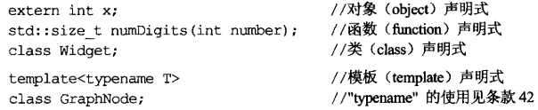

每个函数的声明揭示其**签名式**，也就是参数和返回类型。一个函数的签名式等同于该函数的类型。

:two:==定义式==的任务是提供编译器一些声明式所遗漏的细节。对对象而言，**定义式是编译器为此对象拨发内存的地点**。对函数和函数模板而言，定义式提供了代码本体。对类和类模板而言，定义式列出它们的成员：

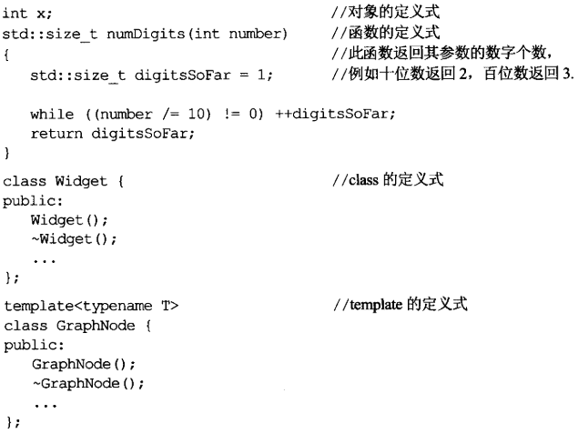

:three:==初始化==是“给予对象初值”的过程。`default`构造函数要么无实参，要么每个参数都有缺省值。

除非我有一个好理由允许构造函数被用于隐式类型转换，否则我会把它声明为`explicit`。（这是个好习惯）

注意，`=`语法也可以用来调用**拷贝构造函数**：

```c++
Widget w3 = w2; //拷贝构造函数
```

其实，拷贝构造和拷贝赋值很容易区别。如果一个新对象被定义（如`w3`），一定会有个构造函数被调用，不可能调用赋值操作；反之亦然。

:four:在`C++`中，==不明确行为==包括：解引用空指针、数组越界。==接口==一般是指函数的签名，或类的可访问元素。

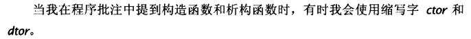

------


### 命名习惯

continue

------


### TR1和Boost

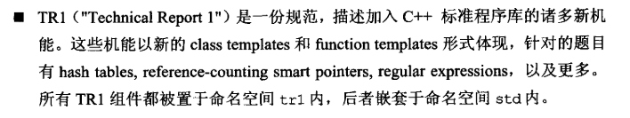

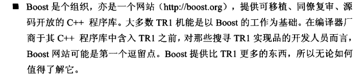

------


## 2. 条款01：视C++为一个语言联邦

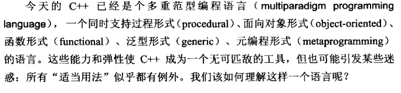

:one:最简单的方法是将`C++`视为一个由相关语言组成的联邦，而非单一语言。主要有四个主要的次语言：

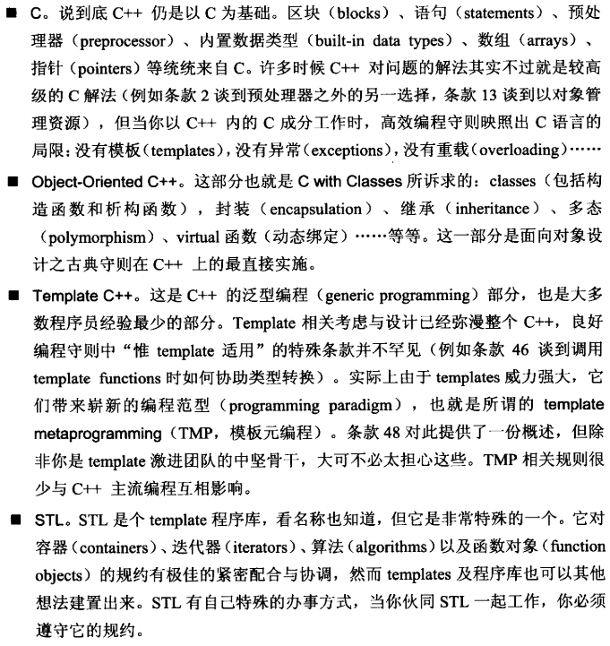

:two:当我们从一个次语言切换到另外一个，导致搞笑编程守则要求我们改变策略时，不要感到惊讶。例如对内置（`c_like`）类型而言，**值传递**通常比引用传递高效，但是当我们移到**对象驱动的c++**，由于用户自定义的构造函数和析构函数存在，**引用传递**往往更好。

:three:C++==高效编程守则==视状况而变化，取决于你使用C++的哪一部分。


## 3. 条款02：尽量以const，enum，inline替换#define

这条或许可以讲成：==宁可以以编译器替换预处理器==。

```c
#define ASP 1.6
```

记号名称`ASP`也许从未被编译器看见——在处理源码之前，它就被预处理器移走了。于是ASP可能没进入符号表。于是当我们使用此常量但获得一个编译错误信息时，会很疑惑，因为这个错误信息也会会提到1.6而不是ASP。

```c++
const double Asp = 1.6;
```

:one:当我们以常量替换`#define`，有两种特殊情况：

+ 第一是定义常量指针。由于常量定义通常被放在头文件内，因此有必要将指针声明为`const`。

+ 第二个是class专属常量。为了确保此常量至多只有一份实体，你必须让它成为一个`static`成员：

  ```c++
  class A
  {
  	static const int Num = 5;
  };
  ```

  :star:这里的`Num`是其声明式而非定义式，通常C++要求对我们使用的任何东西提供一个定义式，但如果它是个class专属常量，又是`static`且为整数类型（ints、chars、bools），则需要特殊处理。==只要不取它们的地址==，我们可以声明并使用它们而无须提供定义式。如果要取地址，则必须提供定义式：

  ```c++
  const int A::Num;
  ```

  由于此类常量在声明时获得初值，因此定义时不可以再设初值。

> \#define不重视作用域

:two:如果我们编译器不允许使用上诉方式，给同是成员的数组指定大小，可以使用所谓的==the enum hack==。其理论基础是：一个属于枚举类型的数值可充当`ints`被使用：

```c++
class B
{
	enum{ Num = 5};
	int Score[Num];
};
```

`enum hack`的行为比较像`#define`，而不是`const`，例如，对常量取地址合法，但对`enum`取地址不合法。而且==Enums==绝不会导致非必要的内存分配。

:three:一个`#define`的误用情况是以它实现宏：

```c++
#define CALL(a,b) f((a) > (b) ? (a) : (b))
```

任何时候，**必须记得为宏中所有实参加上小括号**。但就算这样，也会有如下问题：

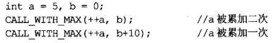

既可以获得宏带来的效率（没有函数调用的开销）以及安全问题，我们只需写出`模板内联函数`：

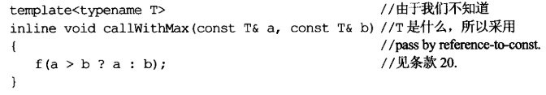

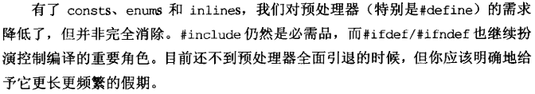

:four:总结：

+ 对于单纯常量，最好以`const`对象或`enum`替换`#define`
+ 对于形似函数的宏，最好使用`inline`函数替换`#define`


## 4. 条款03：尽可能使用const

:one:如果`const`出现在`*`号左边，表示被指物是常量；如果出现在右边，表示指针自身是常量。至于`const`和**类型的位置**没有区分的意义：

```c++
const A *a;
A const *a; //和上面等价 
```

:two:声明迭代器为`const`就像声明指针为`const`一样（即声明一个`T* const`指针）。如果我们希望这个迭代器指向的东西不可改变，则使用`const_iterator`：

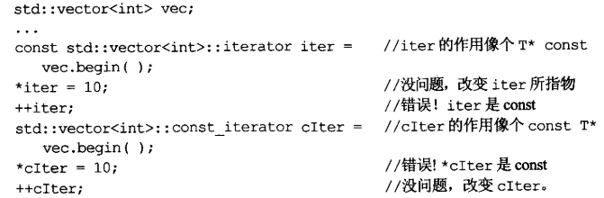

:three:const最具威力的用法是面对**函数声明**时的应用。

+ **令函数==返回一个常量值==，往往可以降低因客户错误而造成的意外**，而又不至于放弃安全性和高效性。考虑下列有**理数类**：

  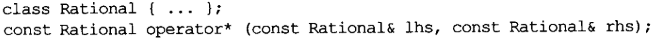

  如果不返回一个常量，会有如下的错误写法：

  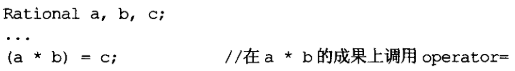

  除非我们需要改动参数或`local`对象，否则将他们声明为`const`，可以省下恼人的错误，例如：想要输入`==`而输成`=`的错误。

+ ==const成员函数==。两个好处：1、使得类接口比较容易被理解，可以得知哪个函数可以改动对象而谁又不行。2、使“操作const对象”成为可能。因为条款20指出，改善`C++`程序效率的一个根本方法是以`pass by reference-to-const`方式传递对象，而此技术可行的前提是：我们有`const`成员函数可用来处理取得（并经修饰而成）的`const对象`。

  此外，注意，两个成员函数如果只是**常量性**不同，也会==重载==。

  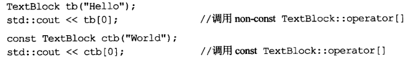

+ ==bitwise constnesss==：成员函数只有在不更改对象的任何成员变量时才可以说是`const`。但这个存在逻辑陷阱，例如：一个更改了`指针所指物`的成员函数算不算；又或者返回一个指向内部数据的引用（外部可以通过它修改类内部数据）。

+ ==logical constness==：一个`const`成员函数可以修改它所处理的对象内的某些`bits`，但只有在客户端侦测不出的情况下才得如此。如果我们希望在满足`bitwise`的情况下，在`const`成员函数内部修改数据，则需要将对应的成员声明成`mutable`。

  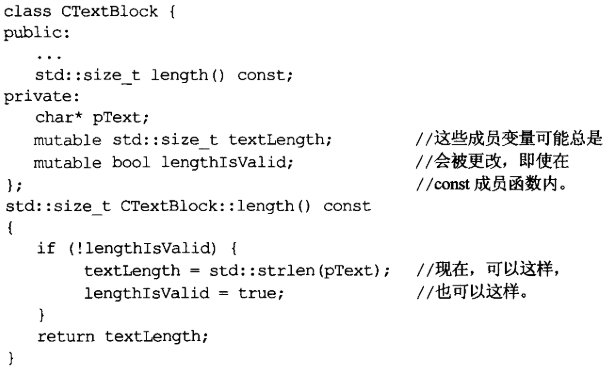

+ 在`const`和`non-const`成员函数中避免重复。运用`const`成员函数实现出其`non-const`孪生兄弟的技术值得了解，但反向做法是错误的（`non-const`不保证不修改数据）。具体见书P 23。

  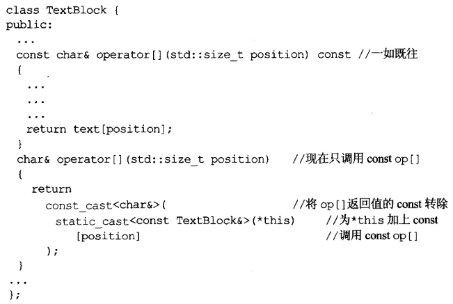

:four:总结：

+ 将某些对象声明为`const`可帮助编译器侦测出错误用法。
+ 编译器强制实施`bitwise constness`，但我们编写程序时应该使用`概念上的常量性`。
+ 当`const`和`non-const`成员函数有着**实质等价的实现**时，令`non-const`版本调用`const`版本可避免代码重复。


## 5. 条款04：确认对象被使用前已被初始化

关于“将对象初始化”这事，`C++`似乎反复无常。

```c++
int x
```

在某些语境下`x`被保证初始化（0），但在其他语境却不保证。具体怎么判断的规则比较复杂，但最佳处理方法就是：永远在使用对象之前先将它**初始化**。

:one:对于无任何成员的内置类型，必须手工初始化；至于内置类型之外的任何东西，使用**构造函数**进行初始化，且构造函数将对象的每一个成员初始化。但我们需要区分**赋值**和**初始化​**：

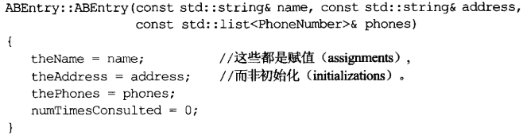

`C++`规定，在进入构造函数本体之前，对象的成员变量（不包括内置类型）的初始化动作（构造函数）发生，因此函数内发生的是**赋值操作**。所以更好的**构造函数写法**是使用`member initialization list`：

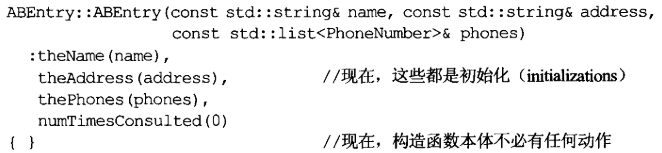

具体效率比较：前一种（**默认构造+赋值**）<  后一种（**拷贝构造**）。甚至我们可以使用==成员初值列==来覆盖合成的默认构造函数：

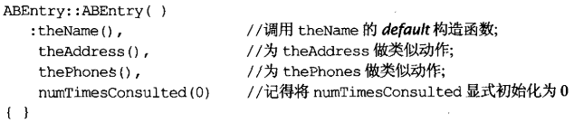

:two:总是在**初值列**中列出所有成员变量​。虽然对于**内置类型**而言，其初始化和赋值的成本相同，但在某些情况下也一定使用初值列。如果成员是`const`或引用，**它们就一定需要初值，不能被赋值。**不要考虑诸多情况，我们总是列出所有。

初值列中的初始化次序，最好和声明次序相同（实际的初始化也是）。

:three:==​static对象==：global对象、定义在`namespace`作用域内的对象、声明为`static`的对象。

函数内的`static`对象称为`local static`对象，其他情况的则为`non-local static`对象。==编译单元==是指产出单一目标文件的那些源码，基本上它时单一源码文件+其所包含的头文件。

我们关心的问题涉及两个源码文件，当其中一个编译单元内的`non-local static`对象的**初始化动作**使用了另一个编译单元内的`non-local static`对象，这个对象可能尚未初始化，因为C++对“定义于不同编译单元内的`non-local static`对象”的**初始化次序**无明确意义。

一个解决方法是：将这个`non-loacl static`搬到专属函数内（在函数内声明为`static`），将其转换为`loacl static`，返回一个它的引用。用户调用这个函数来涉及这个对象。（不就是==单例模式==）

这个手法的基础在于：C++保证，函数内的`static`对象会在“首次遇上该对象的定义式”时被初始化。而这有个隐藏的好处，没有使用这个函数，就不会有这个`static`的构造和析构开销。

:four:总结：

+ 为==内置对象==进行**手工初始化**，因为C++不保证初始化他们。
+ 构造函数最好使用==成员初值列==。而不要在构造函数中使用赋值操作。
+ 为免除"跨编译单元的初始化次序"问题，请以`local static`对象替换`non-local static`对象。


