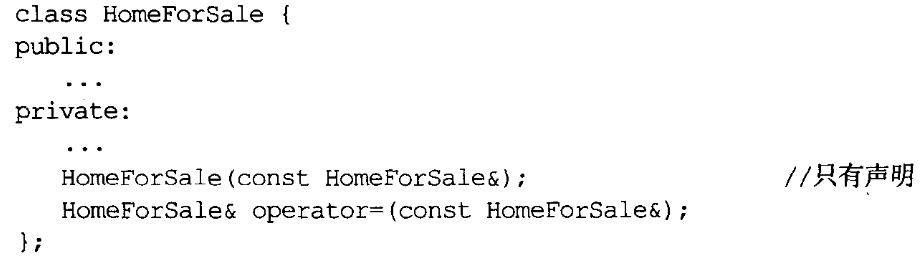

# 构造/析构/赋值运算

## 1. 条款05：了解C++默默编写并调用哪些函数

:one:编译器能默认生成的：拷贝构造函数、拷贝赋值函数、析构函数、构造函数（**未自定义时才有**）。

所有这些函数都是`public`且`inline`。惟有当这些函数被调用时，它们才会被编译器创建出来。

==注意==：编译器产出的析构函数是个`non-virtual`，但如果其**基类**声明有**虚析构函数**，则其也会具有**虚属性**。

:two:编译器有时会拒绝生成`operator=`（只有当生成的代码合法，且有机会证明它有意义）。考虑如下代码：


首先，`C++`不允许引用改指向不同对象，其次我们到底是要修改指针的指向，还是修改指针指向的内存区域？再者`const`对象不能修改。所以，当含有**引用成员**或`const`成员时，编译器拒绝为其生成**默认的拷贝赋值函数**。此外，如果某个基类将拷贝构造函数声明为`private`，则其派生类也不能实参默认的拷贝赋值函数。

## 2. 条款06：若不想使用编译器自动生成的函数，就该明确拒绝

:one:一个**简单的做法**是将该函数声明为`private`，来覆盖默认的，然后不去实现它：（缺点：友元会越过我们的设置）



:two:使用`C++`新特性：

```c++
NoCopy(const NoCopy&) = delete;
```


## 3. 条款07：为多态基类声明`virtual`析构函数

:one:不这么做的后果，我们也很清楚：派生类对象的额外部分（基类部分之外）不会被释放，因为调用的是基类的析构函数。

> 不要继承那些没有实现虚析构函数的类，包括STL

:two:当一个类不会被当作基类，使用**虚析构函数**不是个好主意。

为了**实现虚函数**，必须携带一些信息。这些信息通常是一个所谓`VPTR`指针指出。其指向一个由函数指针构成的数组，称为==虚函数表==`vtbl`。每一个带有`virtual`函数的类都有一个相应的vtbl。当对象调用某一虚函数时，实际被调用的函数取决于该对象的`vptr`所指的那个`vtbl`。

然后呢，一个本来很简单的类，要分出**额外的空间**来存储`vptr`。


## 4. 条款08：别让异常逃离析构函数

:one:`C++`并不禁止**析构函数**抛出**异常**，但它不鼓励你这样做。考虑一个数组，第一个元素释放时抛异常了，但其他元素也要继续被销毁，所以继续调用析构函数，但如果第二个也抛异常了呢？在**两个异常同时存在**的情况下，程序**不结束执行**就会导致==不明确行为==。

:two:但如果析构函数必须执行一个动作，而该动作可能会在失败时抛出异常，该怎么办？可以使用两个办法：

+ 抛出异常就结束程序，调用`std::abort`，阻止异常从析构函数传播出去。
+ 吞下引发的异常（不throw）。这不是个好主意，但代价小些。

当然，**最好的方法是重构代码，不让这个动作由析构函数承担**。


## 5. 条款09：绝不在构造和析构过程中调用虚函数

:one:首先，在派生类的构造函数中，先调用基类的构造函数，然后这个时候，如果基类的构造函数调用了虚函数，这个虚函数依然是基类版本，不会是派生类版本。可以这样说：**在基类构造期间，虚函数不是虚函数**。

除了避免使用派生类还没初始化的成员，更根本的原因是：==在派生类对象的基类构造期间，对象的类型是基类而不是派生类==。


## 6. 条款10：令operator=返回一个reference to *this

:one:赋值采用**右结合律​**：

```c++
x=y=z=15;
analys:	x=(y=(z=15));
```

为了实现连锁赋值，赋值操作符必须返回一个引用指向操作符的左侧实参。


