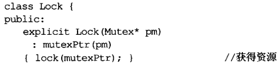

# 资源管理

所谓资源就是，一旦用了它，将来必须还给系统。

## 1. 条款13：以对象管理资源

:one:总是依赖我们手动`delete`是不行的：会有各种原因（抛异常、循环内的break登），跳过它造成内存泄漏。

:two:而把资源放入对象内，我们可依赖C++的==析构函数自动调用机制==确保资源被释放（本条款背后的一半思想）。

:three:许多资源被动态分配于**堆**内，而后被用于单一区块或函数内。它们应该在控制流离开那个区域或函数时被释放。==智能指针==就是为此而设计的，是一个`类指针`对象。其析构函数自动对其所指对象调用`delete`。

这体现了`以对象管理资源`的两个关键想法：

+ 获得资源后立刻放进**管理对象**。
+ **管理对象**运用**析构函数**确保资源被释放。

注意，智能指针的行为虽然类似**垃圾回收**，不同的是智能指针无法打破环状引用（例如：两个其实已经没有被使用的对象彼此互指，因而好像还处于被使用的状态）。

:four:智能指针这种`以对象管理资源`的例子，都在其析构函数内做`delete`而不是`delete[]`动作，这意味我们==不能在动态分配的数组上使用智能指针==，但是这样​做会通过编译。

:five:总结：​

+ ==RAII==：资源取得时机便是初始化时机。

+ 使用基于`以对象管理资源`的智能指针来管理资源，原理是：析构函数自动对其所指对象调用`delete`。

## 2. 条款14：在资源管理类中小心`copying`行为

:one:并非所有资源都是`heap-based`，对于这种资源，智能指针往往不适合管理它。所以我们需要自己写一个管理类。

假设我们使用`C API`处理类型为`Mutex`的互斥器对象，有如下函数：

为确保绝不会忘记将一个被锁住的`mutex`解锁，我们基于`RAII`建立如下类：

:two:似乎很不错，但如果我们复制`Lock`对象呢：

怎么处理呢？一般是如下方法：

+ 禁止复制。禁止拷贝函数。

+ 对底层资源祭出==引用计数法==。也就是`shared_ptr`的做法。

  具体怎么做呢？通常只需要内含一个`shared_ptr`成员变量，但智能指针的缺省行为是：当引用次数为`0`时，删除其所指物。而**我们要的是解除锁定而非删除**。所以我们需要为智能指针指定**自定义删除器**，所以此时代码如下（删除器指定，这里没有列出）：

  

  > 类的析构函数会自动调用非静态成员的析构函数

+ 复制底部资源，亦或是转移底部资源的拥有权

:three:总结：

## 3. 条款15：在资源管理类中提供对原始资源的访问

:one:我们在很多情况下，需要使用原始资源，其中最简单的方法是，智能指针的`get()`成员函数。​

智能指针也重载了**指针取值操作符**（`->`和`*`），它们允许隐式转换至**底部原始指针**。

:two:对于我们自己设计的资源管理类（包含：管理特殊的资源），​可以显示转换：

也可以使用`类型转换运算符`，进行隐式转换：

:three:总结：

## 4. 条款16：成对使用new和delete时要采用相同形式

:one:相对于单一对象，**数组所用的内存**通常还包括`数组大小`的记录，参考下图：

因此，使用`delete`和`delete []`所做的行为是完全不同的。如果对单一对象调用`delete`，编译器可能会认为本来是数据的地方存放的是数组大小，引发未知错误。

总而言之：new和delete，new[]和delete[]成对使用。

## 5. 条款17：以独立语句将`newed`对象置入智能指针

考虑如下函数：

:one:虽然我们在此使用智能指针，但上诉调用依然可能**泄漏资源**。实际上，在调用上诉函数之前，编译器要进行如下操作：

但问题是执行顺序的弹性很大。C++只保证`new Widget`在`shared_ptr构造函数`之前，而priority的位置随意。而如果`priority`的位置在第二位，然后它抛异常了，那么`widget`创建出来了，但它并没有放进智能指针，而造成内存泄漏。

所以说，把它们分开：

:two:总结：

+ 以独立语句将`newed`对象置入智能指针内，如果不这样左，一旦异常被抛出，有可能导致难以察觉的资源泄漏。

