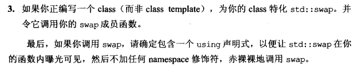

# 设计与声明

## 1. 条款18：让借口容易被正确使用，不易被误用

:one:首先必须考虑用户可能做出什么样的错误。例如，设计一个用来表现日期的类：

貌似没啥问题，但用户可能会输入如下错误：

而许多**客户端错误**可以因为==导入新类型==而获得预防：

预防客户错误的另一个办法是：限制类型内什么事可做，什么事不能做。常见的限制是加上`const`。

:two:另一个一般性准则：应该尽量让你的`types`的行为与内置`types`一致。这样就能提供行为一致的接口。​

:three:总结：（re-reading）

## 2. 条款19：设计class犹如设计type

:one:如何设计高效的类呢？首先要面对如下问题：

## 3. 条款20：宁以`pass-by-reference`替换`pass-by-value`

:one:默认条件下，进行**值传递**，需要一次拷贝构造函数调用和一次析构函数调用。（再考虑下成员、基类和其成员，这个数量还会猛增）

:two:**引用传递**则没有这种额外开销。注意，其`const`是重要的：值传递保证了只会修改传入值的副本​；而引用传递需要`const`声明来保证这个性质。

引用传递还能避免==对象切割问题==：当派生类被认为是基类进行值传递时，会调用基类的构造函数，而派生类部分会舍弃。（虚调用就无了，这样的话多态就无了）

:three:引用往往以指针实现出来，因此**引用传递实际传递的是指针**。因此如果对象属于内置类型​（如：int），值传递往往效率更高。这个也适用于STL的迭代器和函数对象，因为习惯上他们都被设计为值传递。

小型对象也是引用传递。

:four:总结：

## 4. 条款21：必须返回对象时，别妄想返回其引用

:one:考虑如下代码：

**任何函数如果返回一个引用，指向某个局部对象（stack），都将一败涂地**。那么我们考虑在`heap`内构造一个对象：

但我们还是需要调用构造函数，而且还需要`delete`，并且有些情况还不好阻止内存泄漏：

对于如上代码，我们需要两次`delete`，但我们无法合理取得那个隐藏的指针。

:two:一个==必须返回新对象​==的函数的正确写法是，让那个函数返回一个新对象：

:three:总结：

## 5. 条款22：将成员变量声明为private

:one:为什么不能是public？

+ **语法一致性**。这样类的可访问接口都是函数，就不需要考虑是否需要加`()`。

+ 可以让我们对成员变量的处理有更精确的控制。可以实现出“不准访问”、“只读访问”、“读写访问”：

  

+ 封装。隐藏实现细节：可以直接返回成员，也可以进行处理后再返回。

  

:two:不用`protected`似乎也满足前两个理由，但它的封装性呢？应该大于`public`吧。答案令人惊讶：并非如此。

下一个条款会告诉我们，成员变量的封装性与"成员变量的内容改变时所破坏的代码数量"成==反比==。

总而言之，只有两种访问权限：`private`（提供封装）和其他（不提供封装）

:three:总结：

## 6. 条款23：宁以非成员、非友元替换成员函数

关于条款，具体看书。

一般是配合命名空间：

## 7. 条款24：若所有参数皆需类型转化，请为此采用非成员函数

:one:本书开头说过：令**类**支持**隐式类型准换**通常是个糟糕的注意。当然存在例外，最常见的例外是在建立数值类型（例如：有理数）时。​

:two:当我们想支持算术运算时，是写成成员函数，还是非成员呢？​先写出熟悉的成员形式：

但我们会遇到如下问题：

第一个可以，是因为`2`进行了隐式类型转化，而第二个错误是因为：`lhs`必须是类对象，而且编译器也找不到参数对应的非成员版本。

那为什么第二个进行隐式转换呢？==只有当参数被列于**参数列**内，这个参数才是隐式转换的合格参与者==。（而lhs默认是`*this`，绝不是隐式转换的合格参与者）

:three:所以说让我们写一个非成员版本：

最后一个问题是这个函数是否应该是友元？答案是不。首先这个函数不用使用**类的私有成员**，其次和大多数人相对不一样：**成员函数的反面是非成员函数**，而不是友元函数。如果一个函数与类相关，但不应该成为成员函数，第一个要考虑的是非成员函数，而不是友元。==无论何时，如果可以避免友元，就尽量避免==。

:four:总结：

## 8. 条款25：考虑写出一个不抛出异常的swap函数

:one:`swap`是个有趣的函数，原本它只是`STL `的一部分，而后成为**异常安全性编程的脊柱**。非凡的重要性之外它也带来了非凡的复杂度。其典型实现：（支持拷贝构造和拷贝赋值）

:two:但这个版本实在平平无奇，多个复制操作开销。我们考虑所谓的==priml手法==（pointer to implementation）：

一旦要置换两个Widget对象值，我们唯一需要的就是置换其`pImpl`指针，但缺省的`swap`算法不知道这一点。我们可以针对`Widget`将`std::swap`特例化：

但以上通过不了编译，因为指针是私有成员。所以我们添加如下公有成员：

这种做法不仅能通过编译，还能与STL容器有一致性（它们也是这样做的）。

:three:如果上诉类都是**模板类**，我们在编写`std::swap`时会遇到问题，因为我们不能==偏特化==一个函数模板，只能偏特化一个类模板。而替代做法是添加一个重载版本：

但`std`是个特殊的命名空间，我们可以全特化std内的模板，但不能添加新的模板到`std`里头，所以我们应该将上诉**函数模板**放入自定义的命名空间：

后续讨论具体见书。

:four:

