# 实现

## 1. 条款26：尽可能延后变量定义式的出现时间

:one:如果我们定义了一个变量（类实例），但实际却没有使用它（在某些情况下），那么会无故增加构造和析构成本，所以尽量延后它的定义时间。

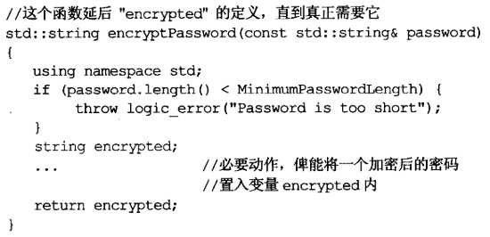

:two:另外，我们最好少使用**拷贝赋值**，如果可以，直接进行拷贝初始化：

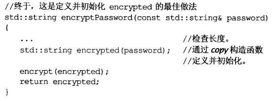

这才是"**尽可能延后**"的真正意义：应该延后到这份定义，直到能够给它初值实参为止。这样可以避免构造非必要对象。

:three:考虑循环（我确实经常碰到），​有两种行为：

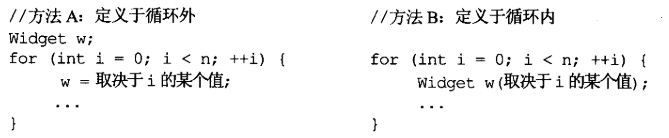

就成本考虑，各自如下：

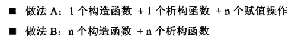

由于A的作用域更大，对程序的**可理解性**和**易维护性**造成冲击，因此除非**赋值成本**确实很低，不然一般应该使用做法B。

## 2. 条款27：尽量少做转型动作

:one:C++的==四种转型==以及特点：

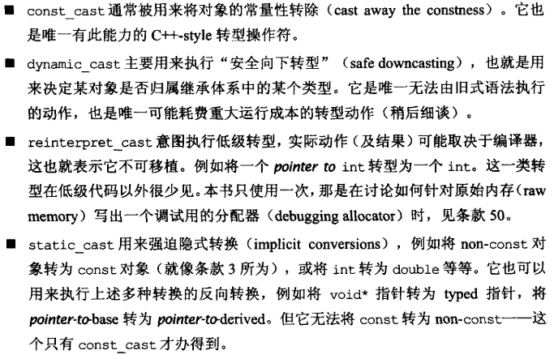

:two:类型转化往往真的令编译器编译出运行期间执行的代码：

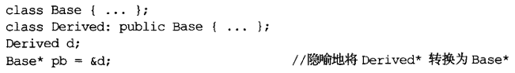

这个情况下，有时候会有一个**偏移量**在运行期间被施行于`Derived*`指针上，用以取得正确的`Base*`指针值。

这个例子表明，单一对象可能拥有一个以上的地址。实际上，在`C++`中，一旦使用多重继承，这事几乎一直发生。

:three:考虑很多框架下（比如UE4），都会要求派生类在实现虚函数的开始，要调用基类的**对应虚函数**，如下是个错误的例子：

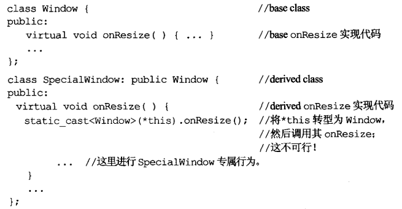

这里调用的不是当前对象上的函数，而是稍早**转型动作**所建立的一个==*this对象的基类部分==的暂时副本上的`onResize()`。这肯定是不行的（如果修改数据，改的只是副本的）。正确的写法如下：

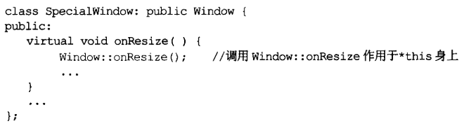

:four:`dynamic_cast`执行速度相当慢。之所以需要，通常是因为我们想在一个你认定为派生类对象上执行**派生类操作函数**。但我们手上只有一个指向基类的指针或引用，你只能靠它们来处理对象，有两个**一般性做法**可以避免这个问题（避免使用`dynamic_cast`）：

+ 使用容器，并在其中存储直接指向**派生类对象**的指针：

  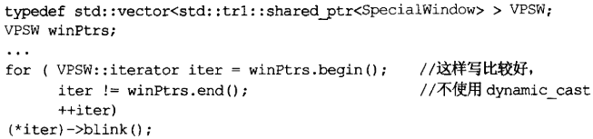

  当然，这种做法就失去了多态，但具备类型安全性。

+ 使用虚函数（额）。

:five:总结：

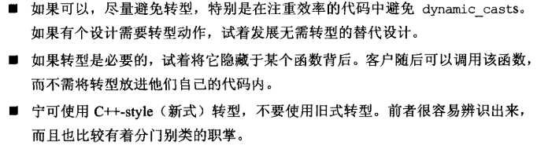

## 3. 条款28：避免返回`handles`指向对象内部成分

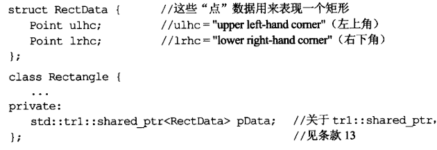

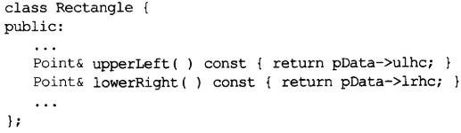

:one:上诉设计不会报错，但却是错误的。我们一方面将成员函数设置为`const`，说明它们只提供数据，不希望用户更改；另外一方面，却传出了数据的引用，这让用户可以修改其内部数据。

返回的是指针和迭代器都是一样的情况，因为它们都是所谓`handles`。

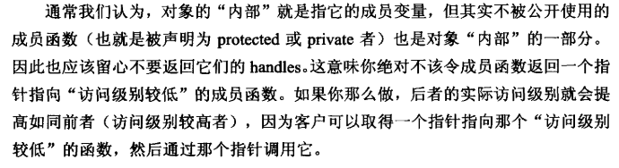

解决方法也很简单，只要在返回类型上加上`const`：

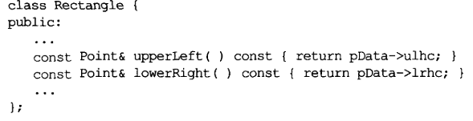

:two:哪怕如此，依然会带来`空悬handles`的问题：这种`handles`所指的东西不复存在。最常见的来源是**函数返回值**。

上诉代码，比较明显，`pUpperLeft`会指向一个不在存在的对象。这也是本条款的原因之一。

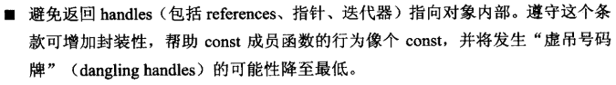

## 4. 条款29：为异常安全而努力是值得的

:one:考虑一个用于多线程的GUI类，它有一个**互斥器**：

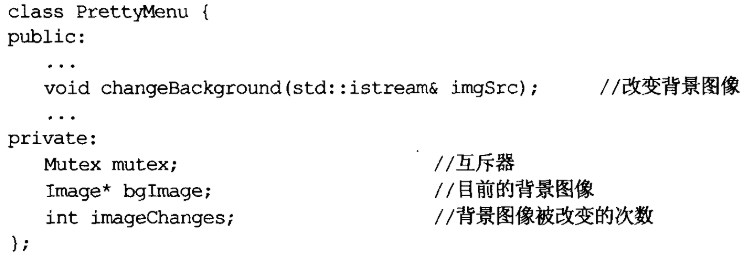

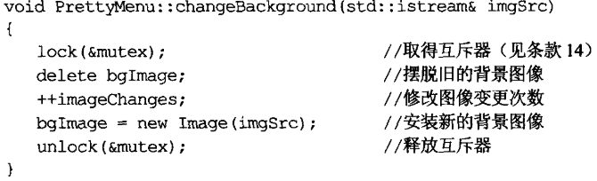

从`异常安全`的角度，这个函数很糟糕，因为它没有满足两个条件：

+ 不泄漏任何资源。例如，一旦`new Image`失败，对`unlock`的调用就不会执行，于是互斥器就永远被把持住了。
+ 不允许数据破坏。如果`new Image`失败，则`bgImage`指向一个已被删除的对象

第一个问题，条款14的`以对象管理资源`已经解决：

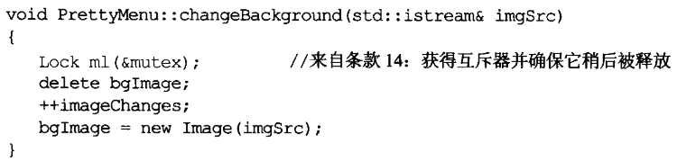

:two:在解决第二个问题之前，进行科普：==异常安全函数==需要提供以下三个保证之一：

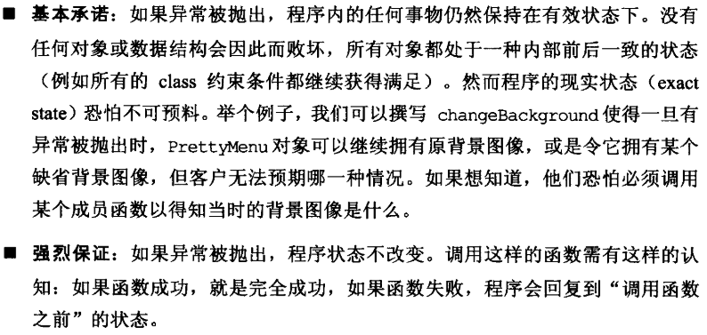

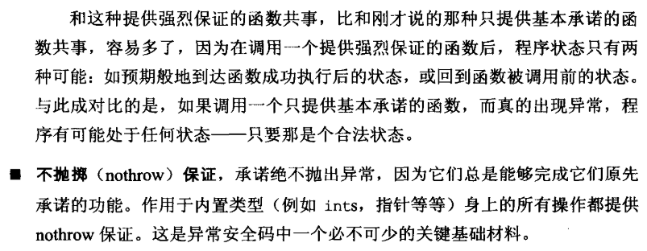

虽然`nothrow`保证看起来最好，但对大部分函数而言，还是要满足前两者之一。对于这里的例子，进行`强烈保证`不是很困难：

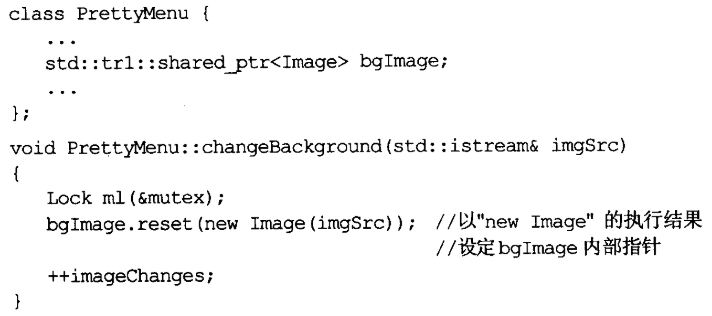

:three:但目前还不是`强烈保证`，因为输入流`ImgSrc`在异常抛出之前，其==读取记号==可能改变。​

:four:暂时先不考虑这个，有一个一般化的设计策略很典型地会导致`强烈保证`，即`copy and swap`。原理很简单：获取要修改对象的副本，修改其副本，这样失败了也没关系，原件没有更改；成功了，则进行`swap`。

实现上，通常是将所有“==隶属对象的数据==”从**原对象**放进**另一个对象**内，然后赋予对象一个指针，指向哪个所谓的实现对象，这种手法常被称为`pimpl idiom`：

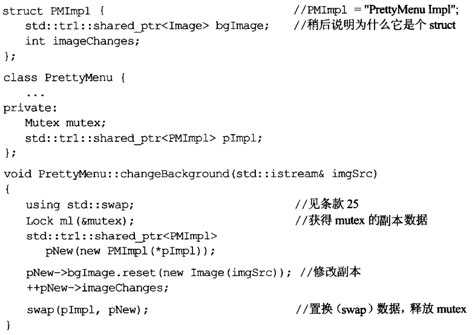

`copy and swap`并不保证整个函数有`强烈保证`，为了了解原因，我们考虑`changeBackGround`的一个抽象概念：`someFunc`

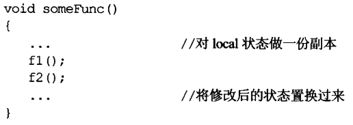

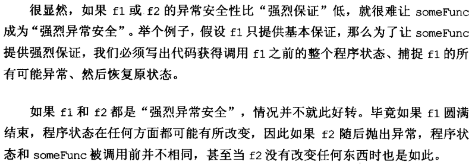

除了以上原因，`强烈保证`的效率也不高，所以说，当这个保证不切实际时，我们就必须提供`基本保证`，而这是个合理的选择。但要注意：如果`someFunc`调用的函数没有提供任何异常安全保证，其自身也不可能提供任何保证。

因此，一个系统要么是具有，要么是没有异常安全性，不存在部分的说法。

:five:

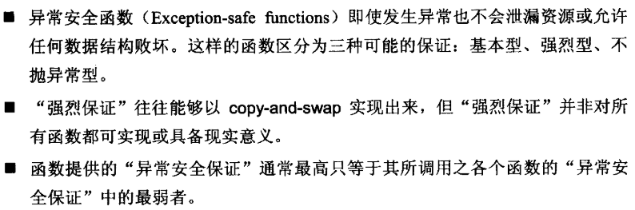

## 5. 条款30：透彻了解`inlining`的里里外外

:one:对于==内联函数==，免除**函数调用的开销**只是最浅显的。由于**编译器最优化机制**通常是被设计来浓缩那些"不含函数调用“的代码，所以编译器能对`inline`函数执行==语境相关最优化==。​

:two:由于内联函数的背后思想是：将调用都以函数本体替换之。这样会增加==目标码==的大小​，而这可能会导致额外的换页行为，伴随而来的是**效率损失**。

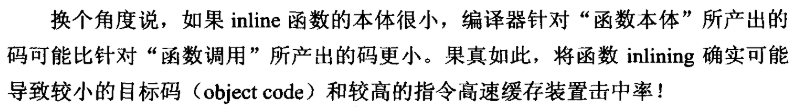

内联函数的隐喻方式是：将函数定义在类定义式内。

:three:大部分编译器会拒绝**太过复杂的内联函数**；所有对虚函数的调用都会使`inlining`落空。

所以说，是否内联取决于编译器。同时，编译器通常不对"**通过函数指针进行的调用**"实施`inlining`。

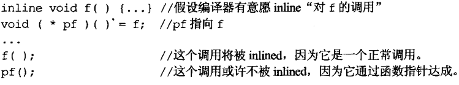

:four:实际上，**构造函数**和**析构函数**往往是内联的**糟糕候选人**。看着是空的，但编译器实际上为其生成了很多代码：

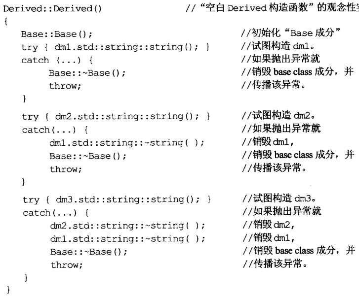

:five:`inline`函数无法随着程序的升级而升级。一旦改变内联函数，用到它的所有地方都需要重新辨析。

对程序开发而言，大部分调式器对`inline`函数都束手无策。

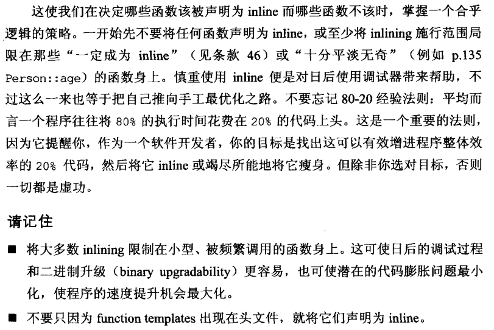

## 6. 条款31：将文件的编译依存关系降至最低

:one:修改一点点，要重新编译大部分，这在于`C++`没有把接口从实现中分离这件事做得很好。类的定义式不仅只详细叙述了类接口，还包括十足的**实现细目**：

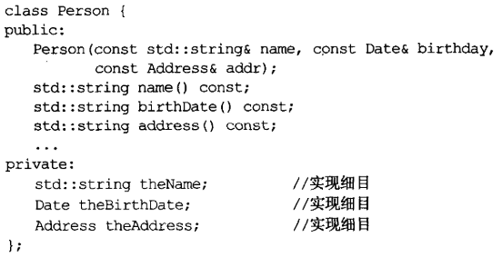

所以需要对应的头文件，这样`Address`类一旦改变，所有使用它的类都要进行重新编译。

:two:具体见书。

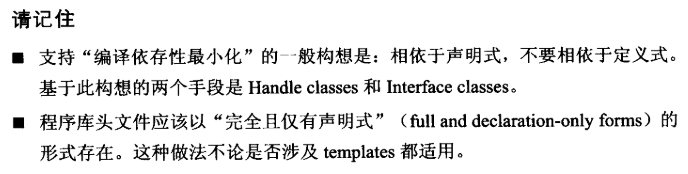