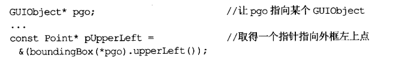

# 实现

## 1. 条款26：尽可能延后变量定义式的出现时间

:one:如果我们定义了一个变量（类实例），但实际却没有使用它（在某些情况下），那么会无故增加构造和析构成本，所以尽量延后它的定义时间。

:two:另外，我们最好少使用**拷贝赋值**，如果可以，直接进行拷贝初始化：

这才是"**尽可能延后**"的真正意义：应该延后到这份定义，直到能够给它初值实参为止。这样可以避免构造非必要对象。

:three:考虑循环（我确实经常碰到），​有两种行为：

就成本考虑，各自如下：

由于A的作用域更大，对程序的**可理解性**和**易维护性**造成冲击，因此除非**赋值成本**确实很低，不然一般应该使用做法B。

## 2. 条款27：尽量少做转型动作

:one:C++的==四种转型==以及特点：

:two:类型转化往往真的令编译器编译出运行期间执行的代码：

这个情况下，有时候会有一个**偏移量**在运行期间被施行于`Derived*`指针上，用以取得正确的`Base*`指针值。

这个例子表明，单一对象可能拥有一个以上的地址。实际上，在`C++`中，一旦使用多重继承，这事几乎一直发生。

:three:考虑很多框架下（比如UE4），都会要求派生类在实现虚函数的开始，要调用基类的**对应虚函数**，如下是个错误的例子：

这里调用的不是当前对象上的函数，而是稍早**转型动作**所建立的一个==*this对象的基类部分==的暂时副本上的`onResize()`。这肯定是不行的（如果修改数据，改的只是副本的）。正确的写法如下：

:four:`dynamic_cast`执行速度相当慢。之所以需要，通常是因为我们想在一个你认定为派生类对象上执行**派生类操作函数**。但我们手上只有一个指向基类的指针或引用，你只能靠它们来处理对象，有两个**一般性做法**可以避免这个问题（避免使用`dynamic_cast`）：

+ 使用容器，并在其中存储直接指向**派生类对象**的指针：

  

  当然，这种做法就失去了多态，但具备类型安全性。

+ 使用虚函数（额）。

:five:总结：

## 3. 条款28：避免返回`handles`指向对象内部成分

:one:上诉设计不会报错，但却是错误的。我们一方面将成员函数设置为`const`，说明它们只提供数据，不希望用户更改；另外一方面，却传出了数据的引用，这让用户可以修改其内部数据。

返回的是指针和迭代器都是一样的情况，因为它们都是所谓`handles`。

解决方法也很简单，只要在返回类型上加上`const`：

:two:哪怕如此，依然会带来`空悬handles`的问题：这种`handles`所指的东西不复存在。最常见的来源是**函数返回值**。

上诉代码，比较明显，`pUpperLeft`会指向一个不在存在的对象。这也是本条款的原因之一。

