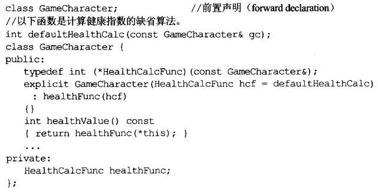

# 继承和面向对象设计

## 1. 条款32：确定你的`public`继承塑膜出`is-a`关系

:one:以`C++`进行面向对象编程，==最重要的一个规则是==：`public`继承意味着`is-a`的关系。​

任何函数如果期望获得一个类型为基类（或指向person的指针和引用）的实参，也愿意接受一个派生类对象。但注意，这一切的前提是`public `继承，不适用于`private`或`protected`继承。

## 2. 条款33：避免遮掩继承而来的名称

:one:在这个继承关系中，以作用域为基础的==名称遮掩规则==并没有改变，以至于：`base::mf1`和`Base::mf3`不再被`Derived`继承：

这些行为背后的基本理由是：为了防止你在程序库或应用框架内建立新的派生类时，附带地从疏远的基类继承重载函数。

:two:如果实在想要这么做，可以使用`using`声明式：

:three:但有时候并不想要继承基类的所有函数，虽然在`public`继承下不可能发生，因为违反了`is-a`思想。所以这里我们考虑`private`继承，我们只想继承无参数版本，可以使用==转交函数==：

:four:

## 3. 条款34：区分接口继承和实现继承

:one:令人意外的是：==我们可以为纯虚函数提供定义==，但调用它的唯一途径是使用时，明确指出其类名称。​

+ 第一个错误是将所有函数声明为非虚函数。
+ 第二个则是都声明为虚函数。

:two:

## 4. 条款35：考虑虚函数以外的其他选择

:one:借由`Non-Virtual Interface`手法实现`Template Method`​模式。（NVI手法）

:two:藉由`Function Pointers`实现`Strategy`模式。​这里直接将行为和对象分开来，而是在对象构造时，给它一个指向具体行为的指针：

这样可以给予对象更大的弹性——运行期间，可以改变行为的实现方式。

:three:籍由`tr1::function`完成`strategy`模式。这样的对象可持有任何**可调用物**（函数指针、函数对象、成员函数指针），只要其签名式兼容于需求端：

有关更多细节，以及古典的策略模式，可见书P 177。

:four:总结：

## 5. 条款36：绝不重新定义继承而来的`non-virtual`函数

非虚函数意味着`不变性`，而`public`继承是一种`is-a`，如果重定义非虚函数，则违反了这个规则。

## 6. 条款37：绝不重新定义继承而来的缺省参数值

:one:首先，无论指针指向什么，它的静态类型都是`shape*`（以上为例）。

:two:回到正题，参见如下代码：

`Rectangle::draw`函数的缺省参数值应该是`GREEN`，但由于`pr`的静态类型是`shape*`，所以此调用的缺省参数值应该来自`shape class`而非`Rectangle class`。这多么奇怪，基类和派生类各处一半力。

以上不仅限于指针，即使把指针换成引用，问题依然存在。

:three:如果给派生类指定一样的缺省参数值呢？那我改变基类的缺省参数值，不就又不一致了。

所以说，聪明的做法是使用**条款35**，使用替代虚函数的设计。

:four:总结：

绝对不要重新定义一个继承而来的缺省参数值，因为缺省参数值都是静态绑定，而虚函数（唯一应该覆写的东西）却是动态绑定的。

## 7. 条款38：通过复合塑模出`has-a`或"根据某物实现出"

关于以上两者如何区分，具体见书P 186。

## 8. 条款39：明智而谨慎地使用`private`继承

:one:`private`继承的首要规则：编译器**不会自动**将一个派生类对象**转换**为一个基类对象；派生类**继承的所有基类成员**都会变成`private`属性。

:two:`private`继承意味着`implemented-in-terms-of`（根据某物实现出）。如果你让类D继承类B，用意是为了采样类B中已经备妥的某些特性，而不是两者存在什么关系。

`private`继承在软件设计层面上没有意义，其意义只及于软件实现层面。

