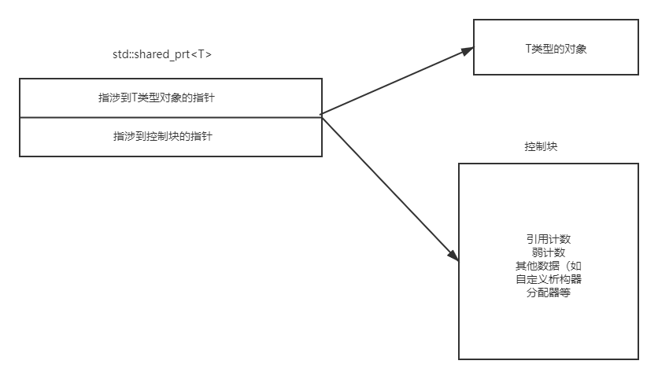

# 1. 条款18：使用`std::unique_ptr`管理具备专属所有权的资源

:one:每当我们需要智能指针时，`std::unique_ptr`基本上应是手头首选，可以认为在默认情况下，`std::unique_ptr`和裸指针有着相同的尺寸。（这意味裸指针满足要求的极端情况下，`std::unique_ptr`一般也会满足）。

:two:`std::unique_ptr`不允许复制，是个只移类型。一个常见用法是在**对象继承谱系**中作为**​工厂函数的返回类型**。

默认使用`delete`进行析构，但是我们可以为其指定**自定义析构器**。

具体使用情况分析，见书P 117。

:three:`std::unique_ptr`还有一个非常吸引人的特性：可以方便转化为`shared_ptr`（可以进行隐式转换）


# 2. 条款19：使用std::shared_ptr管理具备共享所有权的资源

:one:垃圾回收和析构综合的结果：构造，计数递增；析构，计数递减。

:two:`std::shared_ptr`使用引用计数，会带来一些问题：其大小是裸指针的两倍；引用计数的内存必须动态分配；引用计数的递增和递减都必须是**原子操作**（原子操作比原始操作要更慢）。

对于`unique_ptr`，析构器是智能指针类型的一部分，而对于`shared_ptr`则不是如此。

```c++
uniqur_ptr<Widget, decltype(loggingDel)> upw(new Widhget, loggingDel);

shared_ptr<Widget> spw(new Widget, loggingDel);
```

这样哪怕析构器不同，`shared_ptr`指针也能存放在一个容器中。回头一想，无论析构器有多大，`shared_ptr`的大小都是裸指针的两倍，这是为什么呢？一切可见下图：



:three:控制块何时创建呢?

+ `std::make_shared`总是创建一个控制块
+ 从具备专属所有权的指针出发构造一个`std::shared_ptr`。
+ 当`std::shared_ptr`构造函数使用**裸指针**作为实参调用。

==不要多次使用一个裸指针构造智能指针，这会产生多个控制块==（多个计数，会产生多个析构等问题）。而且，根据这个大节的规则，==我们尽量不要使用裸指针来构造智能指针==。

```c++
auto pw = new Widget; //裸指针
std::shared_ptr<Widget> spw1(pw, loggingDel);
std::shared_ptr<Widget> spw2(pw, loggingDel);
```

:four:哪怕计数为`1`，`shared_ptr`也不能转换成`unique_ptr`，它是霸道的。

`shared_ptr`不能来处理数组，没有所谓的`std::shared_ptr<T[]>`，所以也不能从`std::unique_ptr<T[]>`转换而来。


# 3. 条款20：对于类似`std::shared_ptr`但有可能空悬的指针使用`std::weak_ptr`

:one:`std::weak_ptr`看上去一点也不智能，不能提领，也不能检查是否为空。这是因为`std::weak_ptr`不是一种独立的智能指针，而是`std::shared_ptr`的一种补充。

weak一般是通过shared创建的，两者指涉到相同的位置，但不影响引用计数。

```c++
std::shared_ptr<T> spw = make_shared<T>();
std::weak_ptr<T> wpw（spw）;

spw = nullptr; //引用计数为0，wpw空悬
```

`std::weak_ptr`的空悬也被称做失效，可以直接测试：

```c++
if(wpw.expired())....
```

但`weak`没有提领（不能直接获取指涉对象），而其**空悬测试不是原子操作**，而解决方法是将其转变为`shared`（上一条款说了，其提领是原子操作），可以使用如下两种方法：

```
shared_ptr<T> spw = wpw.lock(); //
//or
shared_ptr<T> spw<wpw>;
```

:two:`weak`的应用场景：非严格继承谱系的数据结构中，可以来打破闭环（shared_ptr会导致**内存泄漏**）；缓存以及观察者的列表实现。

但对于严格继承谱系的数据结构，父节点指向子节点使用`std::unique_ptr`，子节点指向父节点使用裸指针，是个更优的方法，来打破闭环。

具体分析见书P 122。

:three:``weak_ptr`不干涉对象的共享所有权，因此不会影响计数，但实际上控制块里还有第二个引用计数，`weak_ptr`操作的就是第二个引用计数。


# 4. 条款21：优先选用`std::make_unique`和`shared_ptr`，而非直接使用`new`

:one:`std::make_unique`是`c++14`的，但其基础版本的实现很简单：

```c++
template<typename T, typename... Ts>
std::unique_ptr<T> make_unique(Ts&&... params)
{
	return std::unique_ptr<T>(new T(std::forward<Ts>(params)...))
}

...
std::shared_ptr<T> spw(new T);
```

而我们使用new，则本质上会进行两次，这很明显没有上述好。

:two:第二个理由是**异常安全，不会发生内存泄露**。这一点在effective C++中已经提及过一遍，是编译时**代码实际顺序**导致的问题——`new`和构造智能指针之间会插入其他语句！而这些语句会发生异常导致抛出！

:three:内存分配也会优化。`new`会先分配对象，再分配控制块；而`make_shared`一次搞定。

:four:问题，之前也说过，`make`系列**不能自定义析构器**。此外，对形参进行完美转发的代码使用的是`()`，而非`{}`，所以对于下列代码产生的是10个20：

```c++
auto upv = std::make_unique<vector<int>>(10, 20);
```

这也就是`make_unique`会出问题的两种情况：自定义析构器、大括号初始化物。

:five:对于`std::shared_Ptr`，不建议使用make系列函数的额外场景包括：（具体见书 P140）:star:

+ 自定义内存管理类
+ 内存紧张的系统、非常大的对象，以及存在比指涉到相同对象的`std::shared_ptr`生存期更久的`std::weak_ptr`。（这是由于控制块的存在，而new和make所产生的对象和控制块的分配区域不同，之前说过，当时是优点）