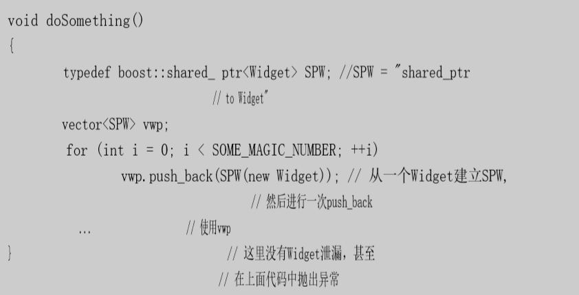

[toc]


# 容器


# 1. 条款1：仔细选择你的容器

:one:C++中有很多你可以支配的容器，但是你意识到有多少吗？

- 标准STL**序列容器**：vector、string、deque和list。
- 标准STL**关联容器**：set、multiset、map和multimap。
- **非标准序列容器** slist和rope。`slist`是一个**单向链表**，`rope`本质上是一个**重型字符串**。
- 非标准关联容器hash_set、hash_multiset、hash_map和hash_multimap。

> `vector`是一种可以默认使用的序列类型，当很频繁地**对序列中部进行插入和删除**时应该用`list`，当大部分**插入和删除发生在序列的头或尾时**可以选择`deque`这种数据结构。

:two:首先我需要介绍一种**STL容器的分类方法**，它被讨论的次数并不多——**连续内存容器和基于节点的容器的区别**。

- **连续内存容器**（也叫做==基于数组的容器==）在一个或多个**动态分配的内存块**中保存它们的元素。如果插入或者删除，**在同一个内存块的元素**就必须向上或者向下移动，来为新元素提供空间或者填充原来被删除的元素。标准的连续内存容器是`vector`、`string`和`deque`。非标准的`rope`也是连续内存容器。
- **基于节点的容器**在每个内存块中**只保存一个元素**。容器元素的插入或删除只影响**指向节点的指针**，而不是节点自己的内容。所以当有东西插入或删除时，元素值不需要移动。`list`和`slist`是基于节点的，所有的**标准关联容器**也是（它们的典型实现是==平衡树==）。

> **非标准的散列容器**使用不同的基于节点的实现，

:three:在容器间选择的==主要策略==：

- 在容器的任意位置插入一个新元素？需要**序列容器**，关联容器做不到。
- 关心元素在容器中的**顺序**吗？如果不，**序列容器**就是可行的选择。
- 你需要哪一类迭代器 ？如果必须是**随机访问迭代器**，在技术上你就只能限于`vector`、`deque`和`string`
- 当插入或者删除数据时，是否非常在意容器内**现有元素的移动**？ 如果是，你就必须放弃**连续内存容器**。
-  容器中的数据的**内存布局兼容C**吗？ 如果是，你就只能用`vector`。
- 查找速度：散列容器 > 排序的`vector` > 标准的关联容器
- 如果不希望**底层实现**使用了**引用计数**，则不能使用`string`和`rope`——替代品是`vector<char>`。
- 如果需要有**可靠地回退插入和删除的能力**，使用基于节点的容器。
- 要把迭代器、指针和引用的**失效次数减到最少**吗？ 如果是，你就应该使用**基于节点的容器**，因为在这些容器上**进行插入和删除不会使迭代器、指针和引用失效**。
- 可以使用随机访问迭代器，而且插入发生在容器结尾时，指针和引用不会失效，最佳选择是`deque`。


# 2. 条款2：小心对“容器无关代码”的幻想

> `STL`是建立在泛化之上的。**数组泛化为容器**，参数化了所包含的对象的类型。**函数泛化为算法**，参数化了所用的迭代器的类型。**指针泛化为迭代器**，参数化了所指向的对象的类型。

:one:**独立的容器类型泛化为序列或关联容器**，而且类似的容器拥有类似的功能。标准的内存相邻容器都提供**随机访问迭代器**，标准的基于节点的容器都提供**双向迭代器**。

具体见书。


# 3. 条款3：是容器里对象的拷贝操作轻量而正确

:one:当你向容器中添加一个对象，进入容器的是**对象的拷贝** 。拷进去，拷出来，这就是STL的方式。

> 现在应该是移动了

如果你用一个拷贝过程很昂贵的对象填充一个容器，那么一个简单的操作——把对象放进容器也会是一个**性能瓶颈**。

:two:由于继承的存在，**拷贝会导致分割**。那就是说，如果你以基类对象建立一个容器，而你试图插入派生类对象，那么当对象拷入容器的时候，对象的派生部分会被删除。

所以还是**传入指针**（最好是智能指针），来避免分割，而且还快。


# 4. 条款4：用`empty`来代替检查`size()`是否为`0`

:one:`empty`的**典型实现**是一个返回**size是否返回0**的==内联函数==。

你应该首选`empty`，而且理由很简单：对于所有的标准容器，`empty`是一个**常数时间的操作**，但对于一 些`list`实现，`size`花费**线性时间**。

什么造成`list`这么麻烦？为什么不能也提供一个常数时间的`size`？答案是对于`list`特有的`splice`有很多要处理的东西。考虑这段代码：

```c++
list<int> list1; 
list<int> list2; 
... 
list1.splice(                                   // 把list2中        
    list1.end(), list2,                     // 从第一次出现5到        
    find(list2.begin(), list2.end(), 5),            // 最后一次出现10    
    find(list2.rbegin(), list2.rend(), 10).base()   // 的所有节点移到list1的结尾。 
);                                              

```

具体分析见书。


# 5. 条款5：尽量使用区间成员函数代替它们的单元素兄弟

:one:给定两个`vector`，`v1`和`v2`，使`v1`的内容和`v2`的**后半部分**一样的**最简单方式**是什么？

```c++
v1.assign(v2.begin() + v2.size() / 2, v2.end()); 
```

这个测验设计为做两件事。

- 第一，它来提醒你`assign`成员函数的存在，太多的程序员没注意到这是一个很方便的方法。它对于**所有标准序列容器**（vector，string，deque和list）都有效。
- 演示为什么**区间成员函数**优先于它们的**单元素替代品**。 
  - 一般来说使用**区间成员函数**可以输入更少的代码。 
  - **区间成员函数**会导致代码更清晰更直接了当。

//todo


# 6. 条款6：警惕C++最令人恼怒的解析

:one:假设你有一个`int`的文件，你想要把那些`int`拷贝到一个`list`中。这看起来像是一个合理的方式：

```c++
ifstream dataFile("ints.dat"); 
list<int> data(istream_iterator<int>(dataFile),                
               istream_iterator<int>());
```

这段代码**可以编译**，但在运行时，它什么都没做。

:two:考虑如下函数声明：

```c++
int g(double (*pf)());  // g带有一个指向函数的指针作为参数
```

另一种方式是`pf`使用**非指针语法**来声明：（在`C`和`C++`中都有效）

```c++
int g(double pf());     // 同上；pf其实是一个指针
```

照常，**参数名可以省略**，所以这是`g`的第三种声明，去掉了`pf`这个名字：

```c++
int g(double ());               // 同上；参数名省略
```

用这些声明做了热身，我们准备检查本条款**开头的代码**。这里再写一遍：

```c++
list<int> data(istream_iterator<int>(dataFile), istream_iterator<int>()); 
```

打起精神，这声明了一个**函数data**，它的返回类型是`list<int>`。这个函数`data`带有两个参数：

- 第一个参数叫做`dataFile`。它的类型是`istream_iterator<int>`。`dataFile`左右的括号是多余的，而且被忽略。
-  第二个参数没有名字。它的类型是指向一个没有参数，而且返回`istream_iterator<int>`的**函数指针**。

奇怪吗？但这符合C++里的==一条通用规则==——==几乎任何东西都可能被分析成函数声明==。

> 所以，我有时会这样
>
> ```
> A a(); //函数声明，而不是使用类A的默认构造函数来生成新的实例。
> ```

:three:**用括号包围一个实参的声明是不合法的**，但用括号包围**一个函数调用**的观点是合法的，所以增加一对括号：

```c++
list<int> data((istream_iterator<int>(dataFile)), istream_iterator<int>()); 
```

不幸的是，目前并非所有编译器都知道它。一个更好的解决办法是:

```c++
ifstream dataFile("ints.dat"); 
istream_iterator<int> dataBegin(dataFile); 
istream_iterator<int> dataEnd; 
list<int> data(dataBegin, dataEnd);
```


# 7. 条款7：当使用`new`得指针的容器时，记得在销毁容器前`delete`那些指针

:one:当容器容纳的是指向**通过new分配的对象的指针**时，他们就错 了。当一个指针的容器被销毁时，会销毁它包含的每个元素，但**指针的“析构函数”是无操作**！

所以还是用==智能指针==吧。




# 8. 条款8：永不建立auto_ptr的容器（unique_ptr）

:one:`auto_ptr`的容器（`COAPs`）是**禁止的**。试图使用它们的代码都**不能编译**。当你拷贝一个`auto_ptr`时，`auto_ptr`所指向对象的所有权被转移到拷贝的`auto_ptr`，而被拷贝的`auto_ptr`被设为` NULL`。

例如，在排序过程`sort`中，对象中的一个或多个`auto_ptr`可能已经被设为`NULL`。


# 9. 条款9：在删除选项中仔细选择

:one:假定你有一个**标准STL容器**，`c`，容纳`int`，而你想把`c`中所有值为`1963`的对象都去掉。完成这项任务的方法因**不同的容器类型**而不同：

- 如果你有一个**连续内存容器**（vector、deque或string），最好的方法是`erase-remove`惯用法（参见条款32）：

  ```c++
  c.erase(remove(c.begin(), c.end(), 1963), c.end()); 
  ```

- `list`的成员函数`remove`更高效：

  ```c++
  c.remove(1963); 
  ```

- 当`c`是**标准关联容器**（即，set、multiset、map或multimap）时，使用任何叫做`remove`的东西都是**完全错误的**。 这样的容器没有叫做`remove`的**成员函数**，而且使用remove算法**可能覆盖容器值**（参见条款`32`），潜在地破坏容器。解决问题的适当方法是调用`erase`：

  ```c++
  c.erase(1963); 
  ```

  这不仅是正确的，而且很高效，只花费**对数时间**。（**序列容器**的基于删除的技术需要**线性时间**）

:two:让我们现在稍微修改一下这个问题。不是从`c`中除去**特定值的物体**，让我们消除**下面判断式返回真的每个对象**：

```c++
bool badValue(int x);   // 返回x是否是“bad”
```

- 对于**序列容器**（vector、string、deque和list），我们要做的只是把每个`remove`替换为`remove_if`，然后就完成了：

  ```c++
  c.erase(remove_if(c.begin(), c.end(), badValue), c.end());
  
  c.remove_if(badValue);
  ```

- 对于**标准关联容器**，它不是很直截了当。有两种方法处理该问题，**一个更容易编码，另一个更高效**。

  - “更容易但效率较低”的解决方案用`remove_copy_if`把我们**需要的值**拷贝到一个新容器中，然后把原容器的内容和新的交换：

    ```c++
    AssocContainer<int> c;  // c现在是一种标准关联容器
    AssocContainer<int> goodValues;
    remove_copy_if(c.begin(), c.end(), 
    			   inserter(goodValues, goodValues.end()), badValue); 
    c.swap(goodValues);
    ```

    这种方法的**缺点**是它拷贝了所有不删除的元素。

  - 直接从**原容器**删除元素：

    ```c++
    for (AssocContainer<int>::iterator i = c.begin(); i != c.end(); )
    {
        if(badValue(*i)) c.erase(i++);
        else i++;
    }
    ```

:three:进一步修改该问题。不仅删除`badValue`返回真的每个元素，而且每当一个元素被删掉时，我们也想把一条消息写到**日志文件**中。

- 对于关联容器，这说多容易就有多容易，因为做一个微不足道的修改就行了：

  ```c++
  for (AssocContainer<int>::iterator i = c.begin(); i != c.end(); )
  {
      if(badValue(*i))
      {
      	c.erase(i++);
      	logFile << "Erasing " << *i <<'\n';
      }
      else 
      	i++;
  }
  ```

- 现在是vector、string和deque给我们带来麻烦。我们不能再使用`erase-remove`惯用法，因为没有办法让`erase`或` remove`写日志文件。不能使用刚刚为**关联容器**开发的循环，调用`erase`不仅使所有**指向被删元素的迭代器**失效，也使**被删元素之后的所有迭代器**失效。我们必须对vector、string和deque采用**不同的战略**。

  ```c++
  for (AssocContainer<int>::iterator i = c.begin(); i != c.end(); )
  {
      if(badValue(*i))
      {
      	logFile << "Erasing " << *i <<'\n';
          c.erase(i);
      }
      else 
      	++i;
  }
  ```

  

# 10. 条款10：注意分配器的协定和约束

:one:==分配器==最初被设想为**抽象内存模型**，在那种情况下，分配器在它们定义的内存模型中**提供指针和引用的typedef**才有意义。在C++标准里，类型`T`的对象的默认分配器（巧妙地称为`allocator<T>`）提供`typedef allocator<T>::pointer`和`allocator<T>:: reference`，而且也希望用户定义的分配器也提供这些`typedef`。

> C++老手立即发现这有问题，因为在C++里没有办法捏造引用。这样做要求有能力重载`operator.`。


[一个分配器的实现](http://www.josuttis.com/cppcode/myalloc.hpp.html)


# 11. 条款11：理解自定义分配器的正确用法

//todo
