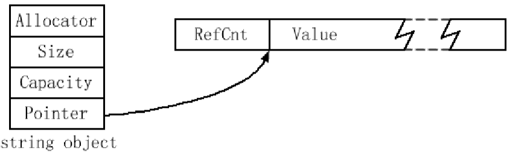
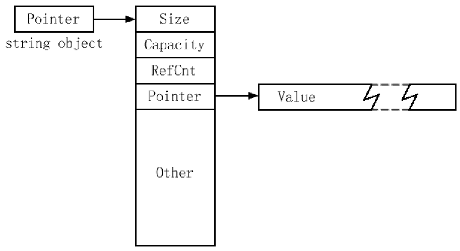
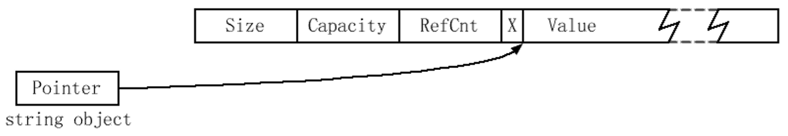
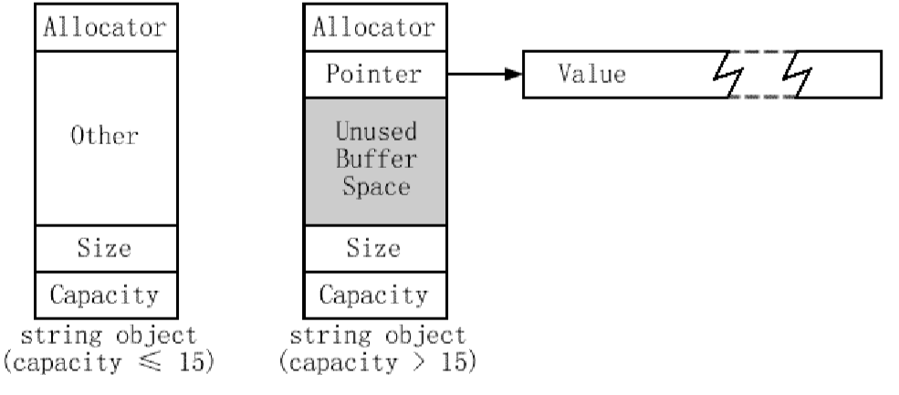

[toc]


# 1. 条款13：尽量使用vector和string来代替动态分配的数组

:one:就是表面意思。


# 2. 条款14：使用reserve来避免不必要的重新分配

:one:对于`vector`和`string`，只要需要更多空 间，就以`realloc`等价的思想来增长。这个类似于`realloc`的操作有四个部分：

1. 分配**新的内存块**，它有容器目前容量的**几倍**。在大部分实现中，`vector`和`string`的容量每次以`2`为因数增长。
2. 把所有元素从**容器的旧内存**拷贝到它的**新内存**。 
3. 销毁**旧内存中的对象**。 
4. 回收旧内存。

每次这些步骤发生时，所有指向`vector`或`string`中的**迭代器、指针和引用都会失效**。`reserve`成员函数允许你最小化**必须进行的、重新分配的次数**。在解释`reserve`为什么可以那么做之前，简要介绍有时候**令人困惑的四个相关成员函数**。在标准容器中，只有`vector`和`string`提供了所有这些函数：

- `size()`告诉你容器中**有多少元素**。它没有告诉你：容器为它容纳的元素分配了多少内存。 
- `capacity()`告诉你容器在它已经分配的内存中**可以容纳多少元素**——**总共可以容纳多少元素**，而不是还可以容纳多少元素。如果你想知道一个`vector`或`string`中**有多少没有被占用的内存**，你必须从`capacity()`中减去`size()`。
-  `resize(Container::size_type n)`强制把容器改为容纳`n`个元素。调用`resize`之后，`size`将会返回`n`。
- `reserve(Container::size_type n)`强制容器把它的容量改为至少`n`，提供的`n`**不小于当前大小**。这一般强迫进行**一次重新分配**，因为容量需要增加。如果`n`小于当前容量，`vector`忽略它，这个调用什么都不做。

**避免重新分配的关键**是使用`reserve`尽快把**容器的容量**设置为足够大，最好在容器被构造之后立刻进行。

:two:假定你想建立一个容纳`1-1000`值的`vector<int>`。没有使用`reserve`：

```c++
vector<int> v; 
for (int i = 1; i <= 1000; ++i) 
	v.push_back(i);
```

在大多数**STL实现**中，这段代码在循环过程中将会导致`2`到`10`次重新分配。把代码改为使用`reserve`，我们得到这个：

```c++
vector<int> v; 
v.reserve(1000); 
for (int i = 1; i <= 1000; ++i) 
	v.push_back(i);
```

通常有两个情况使用`reserve`来避免**不必要的重新分配**。第一个可用的情况是当你确切或者大约知道**有多少元素**将最后出现在容器中。那样的话，就像上面的`vector`代码，你只是提前`reserve`适当数量的空间。第二种情况是**保留你可能需要的最大的空间**，然后，一旦你添加完全部数据，修整掉任何多余的容量。


# 3. 条款15：小心string实现的多样性

:one:一个`string`对象的大小是多少？换句话说，`sizeof(string)`返回什么值？`string`和`char*`指针一样大的实现很常见，也很容易找到 `string`是`char*`7倍大小的`string`实现。为什么会有差别？实际上每个`string`实现都容纳了下面的信息：

- 字符串的大小，也就是它**包含的字符的数目**。
- 容纳字符串字符的**内存容量**。
- 这个字符串的值。

另外，一个`string`可能容纳：

- 它的配置器的拷贝。

**依赖引用计数的string实现**也包含了：

- **这个值的引用计数**。

:two:在实现`A`中，每个**string对象**包含一个它配置器的拷贝，字符串的大小，它的容量，和一个指向包含引用计数（`RefCnt`）和字符串值的**动态分配的缓冲区的指针**。在这实现中，一个使用默认配置器的字符串对象是**指针大小的四倍**。



:three:实现`B`的**string对象和指针一样大**，因为在结构体中只包含一个指针。再次，这里假设**使用默认配置器**。正如实现A，如果使用**自定义配置器**，这个` string`对象的大小会**增加大约配置器对象的大小**。



:four:**实现C的string对象**总是等于指针的大小，但是这个指针指向**一个包含所有与string相关的东西的动态分配缓冲器**：它的大小、容量、引用计数和值。缓冲区也容纳一些关于**值可共享性的数据**，我们在这里不考虑这个主题，所以我标记为`X`。



:five:**实现D的string对象**是一个**指针大小的七倍**（仍然假设**使用了默认配置器**）。这个实现**没有使用引用计数**，但每个`string`包含了一个**足以表现最多15个字符的字符串值的内部缓冲区**。因此小的字符串可以被整个保存在string对象中。当一个`string`的容量超过`15`时，缓冲器的第一部分被用作**指向动态分配内存的一个指针**，而字符串的值存放在那块内存中：



:six:考虑如下代码：

```c++
string s("Perse");
```

在实现`D`下将会没有动态分配，在实现`A`和`C`下一次，而在实现`B`下两次（一次是string对象指向的对象，一次是**那个对象指向的字符缓冲区**）。

更多分析见书。这里进行总结：

- 字符串值可能是或可能不是**引用计数的**。默认情况下，很多实现的确是用了引用计数，但它们通常提供了关闭的方法，一般是通过预处理器宏。
- string对象的大小可能从`1`到至少`7`倍`char*`指针的大小。
- 新字符串值的建立可能需要`0`、`1`或`2`次**动态分配**。 
- string对象可能是或可能不共享**字符串的大小和容量信息**。 
- string可能是或可能不支持每对象配置器。 
- 不同实现对于最小化字符缓冲区的配置器有不同策略。


# 4. 条款16：如何将vector和string的数据传给遗留的API

:one:已经存在的**遗留的C风格API**接受的是**数组和char*指针**，而不是 `vector`和`string`对象。这样的API函数还将会存在很长时间，如果我们要有效使用`STL`的话，就必须和它们和平共处。 

幸运的是，这很容易。如果你有一个`vector`对象`v`，而你需要得到一个指向`v`中数据的指针，以使得它可以**被当作一个数组**，只要使用`&v[0]`就可以了。对于`string`对象`s`，相应的咒语是简单的`s.c_str()`。

```c++
void doSomething(const int* pInts, size_t numInts);
doSomething(&v[0], v.size());
```

