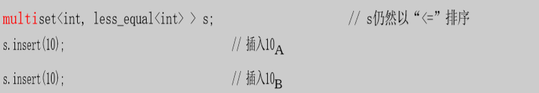

[toc]


# 关联容器


# 1. 条款19：了解相等和等价的区别

:one:`find`算法和**set的insert成员函数**是很多必须**判断两个值是否相同的函数的代表**。但它们以不同的方式完成，`find `对“相同”的定义是==相等== ，基于`operator==`。`set::insert`对“相同”的定义是==等价== ，通常基于`operator<`。因为有定义不同，所以有可能一个定义规定了两个对象有相同的值，而另一个定义判定它们没有。

**相等的概念是基于operator==的**。如果表达式“x == y”返回`true`，`x`和`y`有相等的值，否则它们没有。这很直截了当，但要牢牢记住，因为`x`和`y`有相等的值并**不意味着所有它们的成员有相等的值**。

:two:**等价**是基于在一个有序区间中**对象值的相对位置**。等价一般在**标准关联容器**（比如，set、multiset、map和multimap）的一部分——**排序顺序方面**有意义。

两个对象`x`和`y`如果在关联容器`c`的排序顺序中没有哪个排在另一个之前，那么它们关于`c`使用的**排序顺序**有等价的值。

```c++
!(w1 < w2)                              // w1 < w2时它非真 
&&                                      // 而且 
!(w2 < w1)                                // w2 < w1时它非真
```

在一般情况下，用于关联容器的比较函数不是`operator<`或`less`，它是**用户定义的判断式**。例如，对于关联容器`c`：

```c++
!c.key_comp()(x, y) && !c.key_comp()(y, x) 
```

`c.key_comp()`返回一个函数（或一个**函数对象**）。

:three:要完全领会**相等和等价的含义**，考虑一个忽略大小写的`set<string>`，也就是set的比较函数忽略字符串中字符大小写。这样的比较函数会认为“STL”和“stL”是等价的。

```c++
set<string, CIStringCompare> ciss;     // CIStringCompare就是我们自定义的类，用于忽略大小写
```

```c++
ciss.insert("Persephone");              // 一个新元素添加到set中 
ciss.insert("persephone");              // 没有新元素添加到set中
```

如果我们现在使用`set`的**find成员函数**搜索字符串“persephone”，搜索会成功，但如果我们用非成员的find算法，搜索会失败：

```c++
if (ciss.find("persephone") != ciss.end())...           // 这个测试会成功
if (find(ciss.begin(), ciss.end(), "persephone") != ciss.end())...        // 这个测试会失败
```

那是因为`persephone`等价于`Persephone`，但不等于它。

**:four:标准关联容器保持有序**，所以每个容器必须有一个定义了怎么保持东西有序的比较函数（默认是`less`）。**等价是根据这个比较函数定义的**，所以标准关联容器的用户只需要为他们要使用的任意容器指定一个**比较函数**。

如果**关联容器**使用**相等**来决定两个对象**是否有相同的值**，那么每个关联容器就需要，除了它用于排序的比较函数，还需要一个用于**判断两个值是否相等的比较函数**。当在STL中需要相等时，习惯是简单地直接调用`operator==`。

但如果使用相等来决定是否插入新值，会有很多问题，如果我们根据是否相等，来决定是否将新值插入`set`，那么这两个虽然不相等，但**等价的值的顺序**应该怎么排呢？


# 2. 条款20：为指针的关联容器指定比较类型

:one:当我们在`set`中存储指针，例如`string*`，我们希望可以按字典序进行排序，但实际上由于存储的是指针，所以实际上默认是对指针进行排序，而指针的值是地址：

```c++
set<string*> ssp; 
//=
set<string*, less<string*>> ssp; 
//完整展开是
set<string*, less<string*>, allocator<string*>> ssp;
```

如果你想要`string*`指针以字符串值确定顺序被储存在`set`中，你不能使用**默认比较仿函数类** `less<string*>`。你必须改为写自己的**比较仿函数类**，它的对象带有`string*`指针并按照指向的字符串值来进行排序。就像这样：（关于这个继承的基类，可以见条款`40`）

```c++
struct StringPtrLess: public binary_function<const string*, const string*, bool>
{        
	bool operator()(const string *ps1, const string *ps2) const        
	{                
		return *ps1 < *ps2;        
	} 
};
```

然后你可以使用`StringPtrLess`作为ssp的比较类型：

```c++
typedef set<string*, StringPtrLess> StringPtrSet;
StringPtrSet ssp; 
```

:two:或者你想象并写出了**泛型的解引用仿函数类**，然后让它和`transform`与`ostream_iterator`连用：

```c++
// 当本类型的仿函数被传入一个T*时，它们返回一个const T& 
struct Dereference 
{        
	template <typename T>        
	const T& operator()(const T *ptr) const        
    {                
        return *ptr;        
    } 
};

transform(ssp.begin(), ssp.end(),                           
          ostream_iterator<string>(cout, "\n"),  
          Dereference());                      
```

要点是无论何时，你建立一个**指针的标准关联容器**，你必须记住**容器会以指针的值排序**。这基本上不是你想要的，所以你几乎总是需要**建立自己的仿函数类**作为比较类型。

:three:大多数时候，你的比较类型只是**解引用指针**，并比较所指向的对象（就像上面的`StringPtrLess`做的那样）。鉴于这种情况，你手头最好也能有一个用于那种比较的仿函数模板。像这样：

```c++
struct DereferenceLess {        
	template <typename PtrType>                
    bool operator()(PtrType pT1, PtrType pT2) const              
    {                                       
        return *pT1 < *pT2;                
    } 
};

```

这样的模板消除了写像`StringPtrLess`那样的类的需要，因为我们可以改为使用`DereferenceLess`：

```c++
set<string*, DereferenceLess> ssp;   // 行为就像set<string*, StringPtrLess>
```


# 3. 条款21：永远让比较函数对相等的值返回`false`

:one:我们建议一个`set`，比较类型用`less_qual`，插入一个`10`（$10_A$），之后又插入一个`10`（$10_B$），对于后一个插入，`set`遍历它的内部数据结构，以查找哪儿适合插入$10_B$。最终，它总要检查$10_B$是否与$10_A$相同，也就是要检查：（使用`<=`，因为我们的比较类型用的是`less_qual`）

```c++
!(10A <= 10B) && !(10B <= 10A)                          // 测试10A和10B是否等价
```

结果是：

```c++
false && false
```

好吧，$10_A$和$10_B$并不等价，所以$10_B$也能插入`set`。在技术上而言，这个做法导致**未定义的行为**，但是通常的结果是`set`以拥有了**两个为10的值的拷贝**而告终，也就是说它不再是一个`set`了。==通过使用less_equal作为我们的比较类型，我们破坏了容器==！此外，任何对相等的值返回`true`的比较函数都会做同样的事情。

需要确保你用在**关联容器上的比较函数**总是对**相等的值**返回`false`。

:two:这对`set`和`map`很有意义，因为这些容器**不能容纳复本**。但是`multiset` 和`multimap`怎么样呢？那些容器可能包含副本，但是实际上，这也是不行的。

回到之前的例子，这次我们使用`multiset`



问题在哪呢？对于`multiset`，**相同的复本应该是等价的**，但是通过上诉方式存入的两个`10`并不是等价的，这也**破坏了标准关联型容器的定义**。


# 4. 条款22：避免原地修改`set`和`multiset`的键

:one:本条款的动机很容易理解。正如所有标准关联容器，`set`和`multiset`保持它们的元素有序，这些容器的正确行为依赖于它们保持有序。 如果你改了关联容器里的一个元素的值（例如，把10变为1000），新值可能不在正确的位置，而且那将**破坏容器的有序性**。

对于`map`和`multimap`特别简单，因为试图改变这些容器里的键值，将**不能编译**。但是它对`set`和`multiset`却是可能的。对于`set<T>`或`multiset<T>` 类型的对象来说，储存在容器里的元素类型只不过是`T`，并非`const T`。

具体的更多分析见书。


# 5. 条款23：考虑用有序`vector`代替关联容器

:one:被认为是**常数时间查找的散列容器**要好于保证了对数时间查找的`set`、`map`。即使你需要的就只是**对数时间查找的保证**，标准关联容器仍然可能不是你的最佳选择。和直觉相反，对于标准关联容器，所提供的性能也经常劣于**本该比较次的vector**。

> 标准关联容器的典型实现是**平衡二叉查找树**。一个平衡二叉查找树是一个对**插入、删除和查找的混合操作**优化的数据结构。

为什么一个**（有序的）vector的二分法查找**比 一个二叉树的二分法查找提供了更好的性能？其中的一个是**大小问题**；另一个是**引用局部性问题**。

:two:在**有序vector**中存储数据很有可能比在**标准关联容器**中保存相同的数据**消耗更少的内存**；当**页面错误**值得重视的时候，在有序vector中通过二分法查找可能比在一个标准关联容器中查找更快。

当然，**有序vector的大缺点**是它必须**保持有序**！当一个新元素插入时，大于这个新元素的所有东西都必须向 上移一位。同样的，如果一个元素从vector中被删除，所有大于它的元素都要向下移动。**vector的插入和删除都很昂贵**，但是关联容器的插入和删除则很轻量。这就是为什么只有**当查找几乎不和插入和删除混合时**，使用有序vector代替关联容器才有意义。

:three:关于具体怎么操作有序vector，具体见书。（主要是怎么对代替`map`的`vector<pair<a,b>>`进行排序）


# 6. 条款24：当关乎效率时应该在`map::operator`和`map-insert`之间仔细选择

:one:`map`的`operator[]`函数是个奇怪的东西。它与vector、deque和string的operator[]函数无关，也和**内建的数组**` operator[]`无关。相反，map::operator[]被设计为简化“**添加或更新**”功能——检查键`k`是否已经在`map`里。如果不，就添加上，以`v`作为它的对应值。如果`k`已经在`map`里，它的关联值被更新成`v`。

```c++
map<int, Widget> m; 
m[1] = 1.50;

//此时是添加，换句话说，这个语句等于
typedef map<int, Widget> IntWidgetMap;
pair<IntWidgetMap::iterator, bool> result = m.insert(IntWidgetMap::value_type(1, Widget())); 

result.first->second = 1.50;   
```

现在已经很清楚为什么这种方法**可能降低性能**了。我们先默认构造一个`Widget`，然后我们立即赋给它新值。 如果**用想要的值构造Widget**，比**默认构造Widget然后进行赋值**显然更高效，我们就应该用直截了当的**insert调用** 来替换`operator[]`的使用（包括它的构造加赋值）：

```c++
m.insert(IntWidgetMap::value_type(1, 1.50)); 
```

通常节省了**三次函数调用**：一个建立临时的默认构造Widget 对象，一个销毁那个临时的对象和一个对Widget的赋值操作。那些函数调用越昂贵，你通过使用`map-insert`代替`map::operator[]`就能节省越多。


:two:现在我们理解了当“**增加**”被执行时，`insert` 比`operator[]`更高效。当我们做**更新**时，情形正好相反，

```c++
m[k] = v;
...
m.insert(IntWidgetMap::value_type(k, v)).first->second = v; 
```

`insert`的调用需要` IntWidgetMap::value_type`类型的实参（即`pair<int, Widget>`），所以当我们调用`insert`时，我们必须构造和析构一个那种类型的对象。那耗费了一对构造函数和析构函数，也会造成一个`Widget`的构造和析构，因为 `pair<int, Widget>`本身包含了一个`Widget`对象，`operator[]`没有使用`pair`对象，所以**没有构造和析构pair和Widget**。

集合上诉谈论，可以写出一个不错的效率函数，具体见书。


# 7. 条款25：熟悉非标准散列容器

:one:首先呢，目前`STL`已经包含了**散列容器**了哦。散列容器的名字是unordered_set、unordered_multiset、unordered_map和 unordered_multimap。

**散列容器是关联容器**，因此你不该惊讶，正如所有关联容器，它们需要知道储存在容器中的**对象类型**，用于 这些对象的**比较函数**，以及用于这些对象的**分配器**。另外，散列容器需要**散列函数的说明**。下面是散列容器声明：

```c++
template<typename T,                
		typename HashFunction,                
		typename CompareFunction,                
		typename Allocator = allocator<T> > 
class hash_container;
```

:two:由于作者写这本书时的时代局限性，后续讨论可见书。


