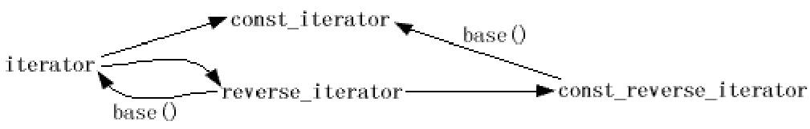
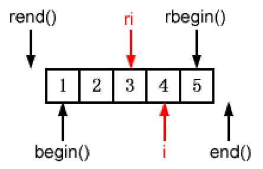
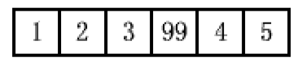

[toc]


# 迭代器


# 1. 条款26：尽量用iterator代替const_iterator，reverse_iterator和 const_reverse_iterator

:one:每个标准容器类都提供四种迭代器类型。对于`container<T>`而言，`iterator`的作用相当于`T*`， 而`const_iterator`则相当于`const T*`。

让我向你演示两个东西。第一，看看`vector<T>`的`insert`和`erase`的样式：

```c++
iterator insert(iterator position, const T& x); 
iterator erase(iterator position); 
iterator erase(iterator rangeBegin, iterator rangeEnd);
```

每个标准容器都包含了和这差不多的函数，虽然**返回类型**因容器类型的不同而不同。需要注意的是：这些方 法只接受**iterator类型的参数**，而不是`const_iterator`、`reverse_iterator`或`const_reverse_iterator`。虽然容器类支持四种迭代器类型，但**其中的一种类型有着其他所没有的特权**，那就是`iterator`。

:two:第二个东西是这张图，它显示了==几种迭代器之间存在的转换关系==：



图中显示了从`iterator`到`const_iterator`、从`iterator`到`reverse_iterator`，和从`reverse_iterator`到`const_reverse_iterator`可以进行隐式转换。并且，`reverse_iterator`可以通过调用其**base成员函数**转换为`iterator`。`const_reverse_iterator`也可以类似地通过base转换成为`const_iterato`r。一个图中无法显示的事实是：==通过`base`得到的也许并非你所期待的`iterator`==。

你应该发现了**没有办法从一个`const_iterator`转换得到一个`iterator`**，也无法从`const_reverse_iterator`得到` reverse_iterator`。这一点非常重要，因为这意味着如果你有一个`const_iterator`或者`const_reverse_iterator`，你会发现很难让它们和**容器的一些成员函数**合作。那些成员函数要求`iterator`。

> 千万不要傻乎乎的宣称**const迭代器**一无是处。不，它们可以与**算法**默契配合，因为算法通常并不关心迭代器是什么类型，只要是适当的种类就可以了，很多容器的成员方法也接受const迭代器。

:three:如果你要指出**插入的位置或删除的元素**时，const迭代器“几乎”没有用。这暗示了**并不是完全没用**。如果你找到了一个方法可以从`const_iterator`或`const_reverse_iterator`得到一个`iterator`，那么它们就有用。（关于这个，具体见条款`27`，但是这个技术并不普遍适用）


# 2. 条款27：用distance和advance把const_iterator转化成iterator

:one:一个比较直接的想法是**类型转换**，例如：（但实际上不行）

```c++
typedef deque<int> IntDeque;            // 方便的typedef 
typedef IntDeque::iterator Iter; 
typedef IntDeque::const_iterator ConstIter; 
ConstIter ci; 
Iter i(const_cast<Iter>(ci));   // 仍是个错误！不能从const_iterator转化为iterator！
```

使用**强制类型转化**也许在`vector`或`string`的代码时能够编译，但这是我们马上要讨论的非常特殊的情形。

==包含类型转化的代码不能通过编译的原因在于==，对于这些容器而言，`iterator`和`const_iterator`是**完全不同的类**。它们之间并不比`string`和`complex<float>`具有更多的血缘关系。在两个毫无关联的类之间进行`const_cast`是荒谬的，所以`reinterpret_cast`、`static_cast`甚至**C风格的类型转换**也会导致同样的结果。

不能编译的代码对于`vector`和`string`容器来说也许能够通过编译。那是因为通常情况下大多数实现都会采 用**真实的指针**作为那些容器的迭代器。就这种实现而言，`vector<T>::iterator`是`T*`的`typedef`，而`vector<T>:: const_iterator`是`const T*`的`typedef`。但是，即使是在这种实现中， `reverse_iterator`和`const_reverse_iterator`也是==真正的类==，所以你仍然不能直接用`const_cast`把`const_reverse_iterator`映射成`reverse_iterator`。

> 正如**条款50**解释的，这些实现通常只会在`Release`模式时，才使用指针表示`vector`和`string`的迭代器。所有这些事实表明，把**const迭代器**映射为**迭代器**是病态的，即使是对`vector`和`string`来说也是如此，因为**移植性**很值得怀疑。

:two:如果你得到一个`const_iterator`，并且可以访问**它所指向的容器**，那么有一种安全的、可移植的方法获取它所对应的`iterator`，而且，用不着陷入**类型系统的转换**。下面是解决思路的本质，虽然在它编译前还要稍作修改：

```c++
typedef deque<int> IntDeque;            // 方便的typedef 
typedef IntDeque::iterator Iter; 
typedef IntDeque::const_iterator ConstIter; 

IntDeque  d; 
ConstIter ci;
...                                     // 让ci指向d
Iter i(d.begin());                      // 初始化i为d.begin() 
advance(i, distance(i, ci)); 			// 把i移到指向ci位置
```

这个任务得到了**两个函数模板**`advance`和`distance`的帮助，它们都在`<iterator>`中声明。`distance`返回两个指向同一个容器的**iterator之间的距离**；`advance`则用于将一个iterator**移动指定的距离**。如果`i`和`ci`指向同一个容器，那么表达式`advance(i, distance(i, ci))`会将`i`移动到与`ci`相同的位置上。

如果这段代码能够通过编译，它就能完成**这种转换任务**。但似乎事情并不那么顺利。想知道为什么，先来看 看`distance`的定义： 

```c++
//difference_type：用来表示两个迭代器之间的距离
template<typename InputIterator> 
typename iterator_traits<InputIterator>::difference_type 
distance(InputIterator first, InputIterator last);
```

当遇到**distance调用**时，你的编译器需要根据使用的**实参类型**推断出`InputIterator`的类型。再来看看我所说的不太正确的distance调用：

```c++
advance(i, distance(i, ci));                    // 调整i，指向ci位置
```

有两个参数传递给`distance`，`i`和`ci`。`i`的类型是`Iter`，但`ci`是`ConstIter`。要顺利地调用`distance`，你需要**排除歧义**。最简单的办法就是**显式的指明**distance调用的**模板参数类型**：

```c++
advance(i, distance<ConstIter>(i, ci));
```

另一个我们现在一直避开，却很值的考虑的实际问题是：==这个技巧的效率如何==？答案很简单。取决于你所转换的究竟是什么样的迭代器。 对于**随机访问的迭代器**（比如`vector`、`string`和`deque`的）而言，这是**常数时间的操作**。对于**双向迭代器**（也就是，所有其它容器和包括散列容器的一些实现）而言，这是**线性时间的操作**。


# 3. 条款28：了解如何通过reverse_iterator的base得到iterator

:one:调用`reverse_iterator`的`base`成员函数可以产生“对应的”`iterator`。我们首先把从数字`1-5`放进一个`vector`中，然后产生一个指向`3`的`reverse_iterator`，并且通过 `reverse_iterator`的`base`初始化一个`iterator`：

```c++
vector<int> v; 
v.reserve(5);                                   // 参见条款14 
for(int i = 0；i < 5; ++ i) {                   // 向vector插入1到5        
    v.push_back(i); 
} 

vector<int>::reverse_iterator ri = find(v.rbegin(), v.rend(), 3); 
vector<int>::iterator i(ri.base());            // 使i和ri的base一样
```

执行上述代码后，可以想到产生的结果就像这样： 



先让我们假设你要在`ri`指出的位置上把一个新元素插入`v`。特别的，我们假设你要插入的值是`99`。记住`ri`在上图中遍历的顺序是**自右向左**，而且**插入操作**会将新元素插入到`ri`位置，并且将原先`ri`位置的元素移到遍历过程的**“下一个”位置**，我们认为`3`应该出现在`99`的左侧。插入操作之后，`v`看起来像这样：



当然，我们不能用`ri`来指定插入的地方，因为它不是一个`iterator`。我们必须用`i`来代替。如上所述，当`ri`指向`3 `时，`i`就是`ri.base()`指向`4`。如果我们用`i`指向插入位置，也是正确的。 

> 对于`insert`操作而言，`ri`和`ri.base()`是等价的，而且`ri.base()`真的是`ri`对应的`iterator`。

:two:如果你要删除`ri`指向的元素，你**不能直接使用`i`**了，因为`i`与`ri`不是指向同一个元素。因此，你要删除的是`i`的前一个元素。

```c++
vector<int> v; 
...                                             // 向v插入1到5，同上
vecot<int>::reverse_iterator ri = find(v.rbegin(), v.rend(), 3);          // 同上，ri指向3 
v.erase(--ri.base());                           // 尝试删除ri.base()前面的元素；
```

这个设计并不存在什么问题，但对于**大多数vector和string的实现**，它无法通过编译。在这样的实现下，`iterator`会采用**内建的指针**来实现，所以`ri.base()`的结果是一个**指针**。==C和C++都规定了不能直接修改函数返回的指针==。

如果你不能减少**调用base的返回值**，只需要先增加**reverse_iterator的值**，然后再调用`base`

```c++
v.erase((++ri).base()); 
```

:three:现在已经很清楚了，`reverse_iterator`的`base`成员函数**返回一个“对应的”iterator的说法并不准确**。对于**插入操作**而言，的确如此；但是对于**删除操作**，并非如此。当需要把`reverse_iterator`转换成`iterator`的时候，有一点非常重要的是你必须知道**怎么处理返回的iterator**，因为只有这样才能决定**得到的iterator是否是你需要的**。


# 4. 条款29：需要一个一个字符输入时考虑使用istreambuf_iterator

:one:假设我们要把**一个文本文件**拷贝到**一个字符串对象**中。似乎可以用一种很有道理的方法完成：

```c++
ifstream inputFile("interestingData.txt"); 
string fileData((istream_iterator<char>(inputFile)), istream_iterator<char>());   
```

很快你就会发现这种方法无法把**文件中的空格**拷贝到字符串中。那是因为`istream_iterators`使用`operator>>`函数来进行读取，而且`operator>>`函数在默认情况下**忽略空格**。

假如你想**保留空格**，要做的就是覆盖默认情况。只要清除**输入流的skipws标志**就行了：

```c++
ifstream inputFile("interestingData.txt"); 
inputFile.unset(ios::skipws);     
```

唉，你会发现**它们的拷贝速度**不像你想象的那么快。`istream_iterators`所依靠的`operator>>`函数进行的是**格式化输入**，这意味着每次你调用的时候它们都必须做**大量工作**（具体工作见书）。

:two:一个更高效的方法是使用`STL`最好的秘密武器之一：`istreambuf_iterators`。你可以像`istream_iterator`一样使用` istreambuf_iterator`，但`istream_iterator<char>`对象使用`operator>>`来从**输入流**中读取**单个字符**。 `istreambuf_iterator<char>`对象进入**流的缓冲区**，并直接读取下一个字符。

```c++
ifstream inputFile("interestingData.txt"); 
string fileData((istreambuf_iterator<char>(inputFile)), istreambuf_iterator<char>());
```

`istreambuf_iterator`==不忽略任何字符==。它们只抓取流缓冲区的下一个字符。

