[toc]


# 算法


# 1. 条款30：确保目标空间足够大

:one:当程序员想向容器中**插入对象**，但并没有告诉`STL`他们所想的时，问题出现了。这是一个常见的方法：

```c++
int transmogrify(int x); // 这个函数从x
						 // 产生一些新值
vector<int> values;
... 					 // 把数据放入values
vector<int> results; 	 
transform(values.begin(), values.end(), results.end(), transmogrify); 
 // 这段代码有bug
```

`transform`通过对**目标区间的元素**写入结果，`transform`会把`transmogrify`应用于`values[0]`，并把结果赋给``*results.end()``。然后它会把`transmogrify`应用于 `value[1]`，并把结果赋给``*(results.end()+1)``。那只能带来灾难，因为在``*results.end()``没有对象，``*(results.end()+1)``也没有。

正确方法是调用`back_inserter`来产生**指定目标区间起点的迭代器**：

```c++
vector<int> results; 						 // 把transmogrify应用于
transform(values.begin(), values.end(), 		// values中的每个对象，
 		 back_inserter(results),			 // 在results的结尾
 		 transmogrify); 				   // 插入返回的values
```

在内部，`back_inserter`返回的迭代器会调用`push_back`，所以你可以在任何提供`push_back`的容器上使用 `back_inserter`（也就是任何**标准序列容器**：`vector`、`string`、`deque`和`list`）。

如果你想让一个算法在**容器的前端**插入东西，你可以使用`front_inserter`。在内部，`front_inserter`利用了`push_front`，所以`front_insert`只和提供那个成员函数的容器配合（也就是`deque`和`list`）：

```c++
... 								// 同上
list<int> results; 					  // results现在是list
transform(values.begin(), values.end(),  // 在results前端
 		  front_inserter(results), 	  // 以反序
		  transmogrify); 			// 插入transform的结果
```

> 因为`front_inserter`用`push_front`把每个对象添加到`results`，`results`中的对象顺序会和`values`中对应的对象顺序**相反**。

:two:有点惊人的是`inserter`允许你强制算法把**它们的结果**插入容器中的**任意位置**：（通过条款`15`预设大小来减少内存分配的消耗）

```c++
vector<int> values; 	// 同上
...
vector<int> results; 	// 同上，除了现在
... 				 // 在调用transform前
 					// results已经有一些数据
results.reserve(results.size() + values.size()); 
transform(values.begin(), values.end(), 						// 把transmogrify的
 			inserter(results, results.begin() + results.size()/2), // 结果插入
 			transmogrify); 									// results的中间
```

:three:本条款论证了这个主题的很多变化，但我希望你能牢牢记住**本质**。无论何时你使用一个**要求指定目的区间的算法**，确保**目的区间已经足够大**，或者在算法执行时**可以增加大小**。如果你选择**增加大小**，就使用**插入迭代器**，比如`ostream_iterators`或从`back_inserter`、`front_inserter`或`inserter`返回的迭代器。

如果**足够大**，必须确保使用的内存区域是**已经初始化好的对象**，而不是**原始内存区域**。

```c++
transform(values.begin(), values.end(), results.end(), transmogrify);    //error
transform(values.begin(), values.end(), results.begin(), transmogrify);  //right
```


# 2. 条款31：了解你的排序选择

:one:当很多程序员想到**排序对象**时，只有一个算法出现在脑海：`sort`。

有时候你不需要**完全排序**。比如，如果你有一个`Widget`的`vector`，你想选择`20`个质量最高的`Widget`发送给客户，排序以鉴别出`20`个最好的`Widget`，剩下的可以**保持无序**。你需要的是**部分排序**，有一个算法叫做`partial_sort`：

```c++
bool qualityCompare(const Widget& lhs, const Widget& rhs)
{
 	// 返回lhs的质量是不是比rhs的质量好
}
...
partial_sort(widgets.begin(), 		 // 把最好的20个元素
 			widgets.begin() + 20,  // （按顺序）放在widgets的前端
 			widgets.end(),
 			qualityCompare);
```

如果只是能把`20`个最好的`Widget`给`20`个最好的客户，但你不关心哪个`Widget`给哪个客户， `partial_sort`就给了你多于需要的东西。在那种情况下，你需要的只是**任意顺序的、20个最好的Widget**。`STL`有一个算法精确的完成了你需要的，它叫做`nth_element`：

```c++
nth_element(widgets.begin(), // 把最好的20个元素
 			widgets.begin() + 19, // 放在widgets前端，
			 widgets.end(), // 但不用担心
			 qualityCompare); // 它们的顺序
```

:two:那引出一个重要的问题。当有**元素有同样质量**的时候这些算法怎么办？比如假设有`12`个元素质量是`1`级，`15`个元素质量是`2`级。当多个元素有等价的值时，`sort`怎么判断**元素的顺序**？

`partial_sort`和`nth_element`以任何它们喜欢的方式排序**值等价的元素**，而且你**不能控制**它们在这方面行为。

> 对于**完整的排序**，你有稍微多一些的控制权。有些排序算法是==稳定的==。在稳定排序中，如果一个区间中的两个元素有**等价的值**，它们的相对位置**在排序后不改变**。因此，如果在（未排序的）`widgets vector`中`Widget A`在 `Widget B`之前，而且两者都有**相同的质量等级**，那么稳定排序算法会保证在这个vector排序后，`Widget A`仍然在`Widget B`之前。**不稳定的算法没做这个保证**。
>

`partial_sort`是不稳定的。`nth_element`、`sort`**也没有提供稳定性**。如果当你排序的时候需要**稳定性**，你可能要使用`stable_sort`。`STL`并不包含`partial_sort`和 `nth_element`的稳定版本。

:three:现在谈谈`nth_element`，这个名字奇怪的算法是个**引人注目的多面手**。除了能帮你找到区间顶部的`n`个元素， 它也可以用于找到**区间的中值**，或者找到**指定百分点的元素**：

```c++
vector<Widget>::iterator begin(widgets.begin()); 	 // 方便地表示widgets的
vector<Widget>::iterator end(widgets.end()); 		// 起点和终点迭代器的变量
vector<Widget>::iterator goalPosition;
goalPosition = begin + widgets.size() / 2;

nth_element(begin, goalPosition, end,  // 找到widgets中中等
 			qualityCompare); 		// 质量等级的值
```

:four:假设，你不需要鉴别出`20`个质量最高的`Widget`。取而代之的是，你需要鉴别出所有**质量等级**为`1`或`2` 的。当然你可以按照质量排序这个`vector`，然后搜索第一个质量等级比`2`差的。一个**更好的策略**是使用`partition`算 法，它重排区间中的元素，以使**所有满足某个标准的元素**都在**区间的开头**。

```c++
bool hasAcceptableQuality(const Widget& w)
{
	 // 返回w质量等级是否是2或更高;
}
// 把所有满足hasAcceptableQuality的widgets移动到widgets前端，
vector<Widget>::iterator goodEnd = partition(widgets.begin(), 
                              widgets.end(), 		 // 并且返回一个指向第一个
									 hasAcceptableQuality);  // 不满足的widget的迭代器
```

此调用完成后，从``widgets.begin()``到`goodEnd`的区间容纳了所有质量是`1`或`2`的`Widget`，从`goodEnd`到`widgets.end ()`的区间包含了所有**质量等级更低的Widget**。如果在分割时保持同样质量等级的`Widget`的**相对位置**很重要， 我们自然会用`stable_partition`来代替`partition`。

:five:算法`sort`、`stable_sort`、`partial_sort`和`nth_element`需要**随机访问迭代器**，所以它们可能只能用于`vector`、`string`、 `deque`和数组。对**标准关联容器**排序元素没有意义，因为这样的容器使用**它们的比较函数**来保持有序。唯一我们可能会但不能使用sort、stable_sort、partial_sort或nth_element的容器是`list`，`list`通过提供`sort`**成员函数**做了一些补偿。（有趣的是，`list::sort`提供了==稳定排序==。）

`partition`和`stable_partition`不同，它们只需要**双向迭代器**。因此你可以在**任何标准序列迭代器**上使用`partition`和`stable_partition`

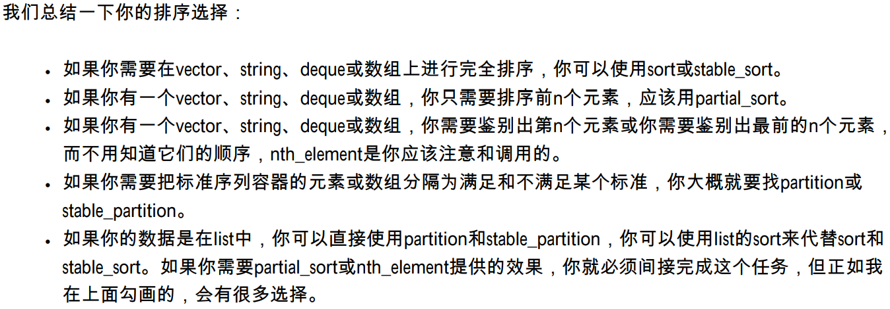

:six:在本条款讨论的算法排序如下，**需要更少资源（时间和空间）的算法**列在前面：

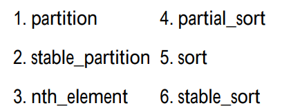


# 3. 条款32：如果你真的想删除东西的话，就在类似remove的算法后接上erase

:one:我将从`remove`的复习开始这个条款，因为`remove`是`STL`中==最糊涂的算法==。这是`remove`的声明：

```c++
template<class ForwardIterator, class T>
ForwardIterator remove(ForwardIterator first, ForwardIterator last, const T& value);
```

就像所有算法，`remove`接收指定它操作的**元素区间的一对迭代器**。它不接收一个容器，所以`remove`不知道它作用于哪个容器。此外，`remove`也不可能发现容器，因为**没有办法从一个迭代器获取对应于它的容器**。

想想怎么从容器中除去一个元素。==唯一的方法==是调用那个容器的一个**成员函数**，几乎都是`erase`的某个形式。而因为`remove`无法知道它**正在操作的容器**，所以`remove`不可能从一 个容器中除去元素。这解释了**另一个令人沮丧的观点**——从一个容器中`remove`元素**不会改变容器中元素的个数**。

```c++
vector<int> v; // 建立一个vector<int> 用1-10填充它
v.reserve(10); // （调用reserve的解释在条款14）
for (int i = 1; i <= 10; ++i) {
    v.push_back(i);
}

cout << v.size(); 			    // 打印10
v[3] = v[5] = v[9] = 99; 		  // 设置3个元素为99
remove(v.begin(), v.end(), 99);   // 删除所有等于99的元素
cout << v.size(); 				// 仍然是10
```

==remove并不“真的”删除东西，因为它做不到。==

:two:我们现在需要复习的是`remove`做了什么。非常简要地说一下，`remove`移动指定区间中的元素，直到**所有“不删除的”元素**在区间的开头。**返回值**是区间的**“新逻辑 终点”**。

举个例子：

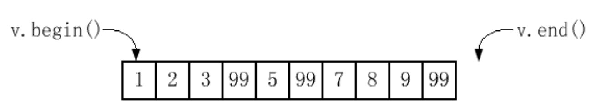

```c++
vector<int>::iterator newEnd(remove(v.begin(), v.end(), 99));
```

这是调用后`v`看起来的样子：

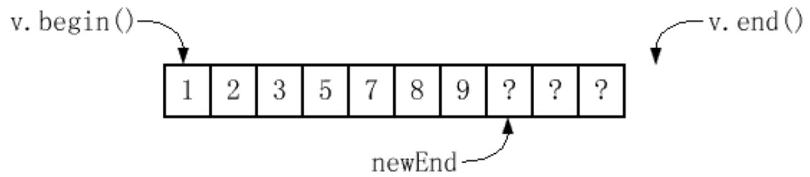

> 这里我用**问号**来标明那些在**概念上已经从v中被删除，但继续存在的元素**的值。

`remove`并没有改变区间中**元素的顺序**，所以不会把**所有“删除的”元素**放在结尾，并安排所有**“不删除的”值**在开头。虽然标准没有要求，但一般来说区间中在**新逻辑终点**以后的元素仍**保持它们的原值**。调用完`remove`后，在我知道的所有实现中，`v `看起来像这样：

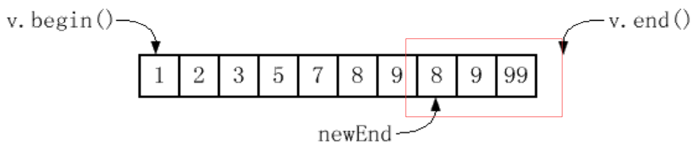

> 如果你不想失去任何值，你可能应该调用`partition`或`stable_partition`，而不是`remove`， `partition`在条款`31`中描述。

在内部，`remove`遍历这个区间，把要**“删除的”值**覆盖为**后面要保留的值**。你可以想象`remove`完成了**一种压缩**，被删除的值表演了在压缩中**被填充的洞的角色**。

:three:只有**容器成员函数**可以除去容器元素，而那是本条款的整个要点：如果你真的要删除东西的话，你应该在`remove`后面接上`erase`。这个调用很直截了当：

```c++
vector<int> v; // 正如从前
v.erase(remove(v.begin(), v.end(), 99), v.end()); // 真的删除所有等于99的元素
cout << v.size(); // 现在返回7
```

把`remove`的返回值作为`erase`区间形式**第一个实参**传递很常见，这是个惯用法。事实上，`remove`和`erase`是亲密联盟，这两个整合到`list`成员函数`remove`中。这是`STL`中唯一名叫`remove`又能从容器中除去元素的函数：

```c++
list<int> li; // 建立一个list,放一些值进去
li.remove(99);
```


# 4. 条款33：提放在指针的容器上使用类似remove的算法

:one:你在管理一堆动态分配的`Widgets`，每一个都可能通过检验，你把结果指针保存在一个`vector`中：

```c++
class Widget{ 
public:        
    ...        
    bool isCertified() const;      		// 这个Widget是否通过检验        
    ... 
};

vector<Widget*> v;                      // 建立一个vector然后用 
...                             		// 动态分配的
Widget v.push_back(new Widget);         // 的指针填充
```

你自然会想到转向`erase-remove`惯 用法，虽然这次你使用了`remove_if`：

```c++
v.erase(remove_if(v.begin(), v.end(),      		// 删除未通过检验的                       
        not1(mem_fun(&Widget::isCertified))),   // Widget指针 
        v.end());                               // 关于mem_fun的信息 
```

摧毁容器中的一个指针也不会删除**指针指向的东西** ，当调用`erase`时，极可能你已经泄漏了资源。我们假设在调用`remove_if`前，`v`看起来像这样，我已经指出了未通过检验的`Widget`：

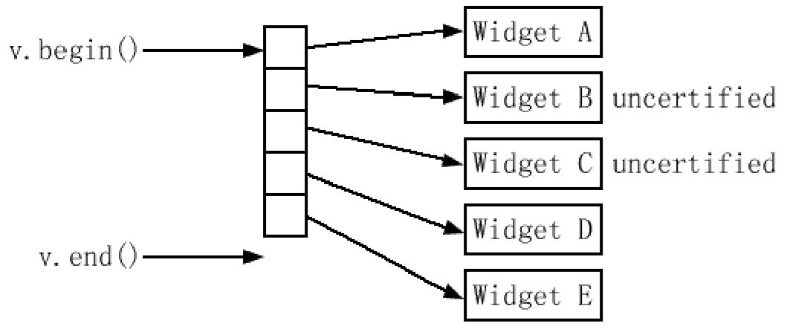

在调用`remove_if`后，一般来说`v`看起来像这样（包含从`remove_if`返回的迭代器）：

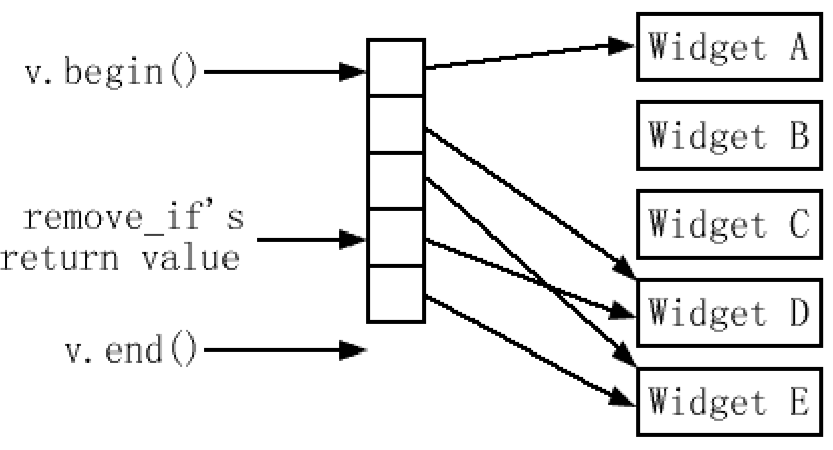

一旦`remove_if`和`erase`返回后，情况看起来像这样：

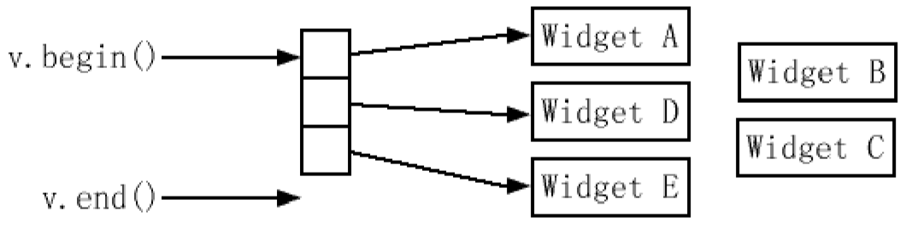

:two:如果你无法避免在那样的容器上使用`remove`，排除这个问题一种方法是在应用`erase-remove`**惯用法**之前先**删除指针**，并设置它们为空，然后除去**容器中的所有空指针**：

```c++
void delAndNullifyUncertified(Widget*& pWidget)  // 如果*pWidget是一个 
{                                                // 未通过检验Widget，        
    if (!pWidget->isCertified()) {               // 删除指针                
        delete pWidget;                          // 并且设置它为空                
        pWidget = 0;        
    } 
}

for_each(v.begin(), v.end(),                    // 把所有指向未通过检验Widget的 
         delAndNullifyUncertified);      		// 指针删除并且设置为空

v.erase(remove(v.begin(), v.end(),              // 从v中除去空指针 
               static_cast<Widget*>(0)),        // 0必须映射到一个指针，
        		v.end());                       // 让C++可以正确地推出remove的第三个参数的类型
```


# 5. 条款34：注意那个算法需要有序区间

:one:最常见的就是一些算法需要**有序值的区间**，既可以和**有序**，又可以和**无序区间**合作的算法很少，但当操作**有序区间**的时候它们最有用。这里有一个**只能操作有序数据**的算法的表：

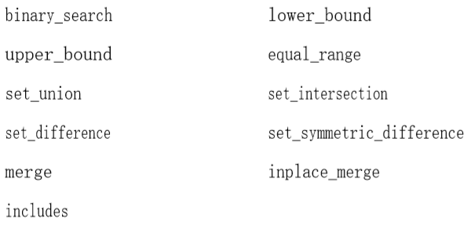

另外，下面的算法一般用于**有序区间**，虽然它们不要求：

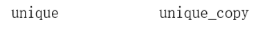

:two:首先，让我们熟悉一下这些算法。

- ==搜索算法== `binary_search`、`lower_bound`、`upper_bound`和`equal_range`（参见条款`45`）需要**有序区间**，因为它们使用**二分法查找**来搜索值，这些算法保证了**对数时间的查找**，但作为交换的是，你必须给它们**已经排过序的值**。
- 算法`set_union`、`set_intersection`、`set_difference`和`set_symmetric_difference`的四人组提供了**线性时间**设置它们名字所提出的操作的性能。
- `merge`和`inplace_merge`执行了有效的**单遍合并排序算法**：它们读取**两个有序区间**，然后产生一个包含了两个源区间所有元素的**新有序区间**。它们以**线性时间**执行，如果它们不知道**源区间已经有序**就不能完成。
- 最后一个需要有序区间的算法是`includes`。它用来检测**是否一个区间的所有对象也在另一个区间中**。因为 `includes`可能假设它的两个区间都已经有序，所以它保证了**线性时间性能**。
- `unique`的行为是：从每个**相等元素的连续组**中去除第一个以外所有的元素——从一个区间**去除所有重复值**。你必须先确保所有重复值一个接着一个。猜到什么了？那是**排序**完成的东西之一。`unique`从一个区间除去元素的方式和`remove`一样，也就是说它**只是区分出不除去的元素**。

:three:不同的区间可能以不同的方式排序，所以保证给`STL`所使用的排序**相关信息一致**是很重要的。


# 6. 条款35：通过`mismatch`或`lexicographical`比较，实现简单的忽略大小写字符串比较

:one:一个STL菜鸟最常问的问题是：我怎么使用`STL`来进行**忽略大小写的字符串比较**？这是一个令人迷惑的简单问题。

想要使用忽略大小写比较的程序员通常需要**两种不同的调用接口**， 一种类似`strcmp`（返回一个负数、零或正数），另一种类似`operator`（返回`true`或`false`）。因此我会演示怎么使用**STL算法**实现两种调用接口。

下面的字符比较显然是一个**过分简单的解决方案**，但它类似`strcmp`进行的字符串比较：

```c++
int ciCharCompare(char c1, char c2)                     // 忽略大小写比较字符 
{                                               
    // c1和c2，如果c1 < c2返回-1，                                                
    // 如果c1==c2返回0，如果c1 > c2返回1        
    int Ic1 = tolower(static_cast<unsigned char>(c1));
    int Ic2 = tolower(static_cast<unsigned char>(c2));
        
    if (Ic1 < Ic2) return -1;        
    if (lc1 > Ic2) return 1;        
    return 0; 
}
```

:two:在我们可以调用`mismatch`之前，我们必须先满足它的前提。特别是，我们必须确定一个字符串是否比另一个短，**短的字符串作为第一个区间传递**：

```c++
int ciStringCompareImpl(const string& s1,               // 实现请看下文
                        const string& s2);

int ciStringCompare(const string& s1, const string& s2) 
{        
    if (s1.size() <= s2.size()) return ciStringCompareImpl(s1, s2);        
    else return -ciStringCompareImpl(s2, s1); 
}
```

在`ciStringCompareImpl`中，大部分工作由`mismatch`来完成。它返回**一对迭代器**，表示了区间中**第一个对应的字符不相同的位置**：

```c++
int ciStringCompareImpl(const string& si, const strings s2) 
{        
    
    typedef pair<string::const_iterator,         // PSCI = “pair of
    			 string::const_iterator> PSCI;   // string::const_iterator”  
    
    PSCI p = mismatch(                  // 下文解释了 
        s1.begin(), s1.end(),           // 为什么我们                        
        s2.begin(),                     // 需要not2；参见 
        not2(ptr_fun(ciCharCompare)));  // 条款41解释了为什么 
    
    // 我们需要ptr_fun        
    if (p.first == s1.end()) 
    {                               
        // 如果为真，s1等于s2, 或s1比s2短        
        if (p.second == s2.end()) return 0;                      
        else return -1;
    }  
    
    return ciCharCompare(*p.first, *p.second);     // 两个字符串的关系和不匹配的字符一样
}                                                       

```

唯一可能感到奇怪的是传给`mismatch`的判断式，也就是 `not2(ptr_fun(ciCharCompare))`。当字符匹配时这个判断式返回`true`，因为当判断式返回`false`时`mismatch`会停止。（具体见书，但这里的主要作用是取反`bool`，因为两个字符相等时，`ciCharCompare`返回`0`，也就是`false`，所以我们需要取反）

:three:第二个方法`ciStringCompare`是产生一个**合适的STL判断式**：可以在**关联容器**中用作**比较函数**的函数。这 个实现很短也很好，因为我们需要做的是把`ciCharCompare`修改为一个**有判断式接口**的字符比较函数，然后把进行字符串比较的工作交给STL中名字第二长的算法——`lexicographical_compare`：

```c++
bool ciCharLess(char c1, char c2)                    // 返回在忽略大小写 
{                                                    // 的情况下c1是否                                                               			  // 在c2前面；   
    tolower(static_cast<unsigned char>(c1)) <        // 条款46解释了为什么
        tolower(static_cast<unsigned char>(c2));     // 一个函数对可能比函数好
}                                                               


bool ciStringCompare(const string& s1, const string& s2) 
{        
    return lexicographical_compare(s1.begin(), s1.end(),   // 关于这个
                                   s2.begin(), s2.end(),   // 算法调用的   
                                   ciCharLess);            // 讨论在下文 
}
```

`lexicographical_compare`是`strcmp`的泛型版本。`strcmp`只对**字符数组**起作用，但`lexicographical_compare`对所有任何类型的值的区间都起作用。同时，`strcmp`总是比较两个字符来看看它们的关系是相等、小于或大于另一 个。`lexicographical_compare`可以传入一个决定两个值是否满足一个**用户定义标准的二元判断式**。


# 7. 条款36：了解`copy_if`的正确实现

:one:STL有很多有趣的地方，其中一个是有`11`个名字带`“copy”`的算法：

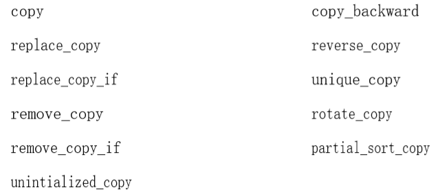

但没有一个是`copy_if`。这意味着你可以`replace_copy_if`，你可以`remove_copy_if`，你可以`copy_backward`或者` reverse_copy`，但如果你只是简单地想要**拷贝一个区间中满足某个判断式的元素**，你只能自己做。

比如，假设你有一个函数来决定一个`Widget`是否有缺陷的：

```c++
bool isDefective(const Widget& w);
```

而且你希望把一个`vector`中所有有缺陷的`Widget`写到`cerr`。如果存在`copy_if`，你可以简单地这么做：

```c++
vector<Widget> widgets; 
... 
copy_if(widgets.begin(), widgets.end(),                 // 这无法编译：
        ostream_iterator<Widget>(cerr, "\n"),   		// STL中并没有copy_if 
        isDefective);
```

这里有一个合理的`copy_if`，很多人（包括我）曾经知道的实现：

```c++
template<typename InputIterator,                                // 一个不很正确的
		typename OutputIterator,                // copy_if实现
		typename Predicate> 
OutputIterator copy_if(InputIterator begin,
                       InputIterator end,  
                       OutputIterator destBegin, 
                       Predicate p) 
{        
    return remove_copy_if(begin, end, destBegin, not1(p)); 
}
```

这个方法是基于这个观点——虽然`STL`并没有让你说“拷贝每个**判断式为true的东西**”，但它的确让你说了“拷贝**除了判断式不为true以外的每个东西**”。要实现`copy_if`，似乎我们需要做的就只是加一个`not1`在传给`copy_if`的判断式前面，然后把这个结果判断式传给`remove_copy_if`，结果就是上面的代码。

你的STL平台将会敌视这段代码，因为它试图对`isDefective`应用`not1`，`not1`不能直接应用于一个**函数指针**，函数指针必须先传给`ptr_fun`。要调用这个`copy_if`实现，你必须传递的不仅是一个函数对象，而且是一个==可适配的函数对象==。

这是`copy_if`正确的微不足道的实现：

```c++
template<typename InputIterator,                                
		typename OutputIterator,       
		typename Predicate> 
OutputIterator copy_if(InputIterator begin,                                
          			   InputIterator end,                                
            		   OutputIterator destBegin,                                
           	           Predicate p) 
{

    while (begin != end) 
    {                
        if (p(*begin))*destBegin++ = *begin;
        ++begin;        
    }
       
    return destBegin; 
}
```


# 8. 条款37：用accumulate或for_each来统计区间

:one:有时候你需要把**整个区间**提炼成一个**单独的数**，或，更一般地，一个单独的对象。对于一般需要的信息，有特殊目的的算法来完成这个任务，比如，`count`告诉你区间中有多少等于某个值的元素，而`count_if`告诉你有多少元素满足一个判断式。区间中的最小和最大值可以通过`min_element`和`max_element`获得。

有时，你需要用一些**自定义的方式**统计（summarize）区间，STL为你准备了那样的算法，它叫作`accumulate`。你可能不熟悉` accumulate`，因为，不像大部分算法，它不存在于<algorithm>。取而代之的是，它和**其他三个“数值算法”**都在<numeric>中。（那三个其它的算法是`inner_product`、`adjacent_difference`和`partial_sum`。）

:two:`accumulate`存在**两种形式**。带有**一对迭代器和初始值**的形式，可以返回初始值，加上**由迭代器划分出的、区间中的值**的和：

```c++
list<double> ld;                                        // 建立一个list，放 
...                                                     // 一些double进去 
double sum = accumulate(ld.begin(), Id.end(), 0.0);     // 计算它们的和，                                                        					 // 从0.0开始
```

> 注意初始值指定为0.0，不是简单的0

`accumulate`的另一种形式，带有一个**初始值**与一个**任意的统计函数**。比如，考虑怎么使用`accumulate`来计算容器中的**字符串的长度和**。要计算这个和，`accumulate`需要知道两个东 西。第一，同上，它必须知道**和的开始**。在我们的例子中，它是`0`。第二，它必须知道每次看到一个**新的字符串**时，怎么更新这个和：

```c++
string::size_type                                       // string::size_type的内容 
stringLengthSum(string::size_type sumSoFar,             // 请看下文
                const string& s) {        
    return sumSoFar + s.size(); 
}
```

这个函数的函数体非常简单，但你可能发现自己陷于`string::size_type`的出现。不要那样。每个标准STL容器都有一个`typedef`叫做`size_type`，那是容器计量东西的类型。对于标准容器，你可以把`Container::size_type`看作`size_t`写法的一个奇异方式。

我们可以让`accumulate`这么使用`stringLengthSum`：

```c++
set<string> ss;                                 /
...                                            
string::size_type lengthSum = accumulate(ss.begin(), ss.end(), 0, stringLengthSum);    
```

计算**数值区间的积**甚至更简单，因为我们不用写自己的求和函数。我们可以使用标准`multiplies`**仿函数类**：

```c++
vector<float> vf;                               // 建立float的容器 
...                                             // 进行一些操作 
float product = accumulate(vf.begin(), vf.end(), 1.0f, multiplies<float>());
```

这里唯一需要小心的东西是记得把`1`（作为`float`，不是`int`！）作为**初始统计值**，而不是`0`。如果我们使用`0`作为开始值，结果会总是`0`，因为`0`乘以任何东西也是`0`，不是吗？

:three:**最后一个例子**有一些晦涩。它完成寻找`point`的**区间的平均值**，`point`看起来像这样：

```c++
struct Point {        
    Point(double initX, double initY): x(initX), y(initY) {}        
    double x, y; 
};
```

**求和函数**应该是一个叫做`PointAverage`的**仿函数类的对象**，但在我们察看`PointAverage`之前，让我们看看它在调用`accumulate`中的使用方法：

```c++
list<Point> lp; 
... 
Point avg = accumulate(lp.begin(), lp.end(), Point(0, 0), PointAverage());
```

`PointAverage`通过记录它看到的**point的个数**，和它们**x和y部分的和**来工作。每次调用时，它更新那些值，并返回目前检查过的point的平均坐标，因为它对于区间中的每个点只调用一次，它把**x与y的和**除以区间中的**point的个数**，忽略传给`accumulate`的**初始point值**，它就应该是这样：

```c++
class PointAverage : public binary_function<Point, Point, Point> 
{    
    // 参见条款40 
public: 
    
    PointAverage(): numPoints(0), xSum(0), ySum(0) {}
    
    const Point operator()(const Point& avgSoFar, const Point& p) 
    {                
        ++numPoints;                
        xSum += p.x;                
        ySum += p.y;                
        return Point(xSum/numPoints, ySum/numPoints);        
    }
    
private:        
    size_t numPoints;       
    double xSum;        
    double ySum; 
};
```

:four:上诉实现实际有问题，具体见书。那很好，因为它给我了一个机会来提起`for_each`，另一个可以**用于统计区间**，而且没有`accumulate`那么多限制的算法。

`for_each`带有**一个区间和一个函数**（一般是一个**函数对象**）来调用区间中的每个元素，但传给`for_each`的函数**只接收一个实参**（当前的区间元素），而且当完成时`for_each`返回它的函数。值得注意的是，传给（而且后来要返回）`for_each`的函数可能有**副作用**。

除了副作用问题，`for_each`和`accumulate`的不同主要在**两个方面**：

- 首先，`accumulate`的名字表示它是一个**产生区间统计的算法**，`for_each`听起来好像你只是要**对区间的每个元素进行一些操作**。用`for_each`来统计一个区间是合法的，但是它没有`accumulate`清楚。
- 其次，`accumulate`直接返回那些我们**想要的统计值**，而`for_each`返回一个**函数对象**，我们必须从这个对象中提取**想要的统计信息**。在C++里，那意味着我们必须给**仿函数类**添加一个**成员函数**，让我们找回**追求的统计信息**。

这是最后一个例子，这次使用`for_each`而不是`accumulate`：

```c++
struct Point {...);                                     // 同上 
              
class PointAverage : public unary_function<Point, void> 
{            // 参见条款40 
public:        
    PointAverage(): xSum(0), ySum(0), numPoints(0) {} 
    
    void operator()(const Point& p)        
    {                
        ++numPoints;                
        xSum += p.x;                
        ySum += p.y;        
    }        
    
    Point result() const        
    {                
        return Point(xSum/numPoints, ySum/numPoints);       
    }
    
private:        
    size_t numPoints;        
    double xSum;        
    double ySum; 

};
              
list<Point> Ip; 
...
Point avg = for_each(lp.begin(), lp.end(), PointAverage()).result;
```

