# 条款1：Iterators

:one:设计准则：绝对不要提领一个无效的迭代器。

使用`iterators`时，务必清楚以下四点:

1. 有效的数值：这个迭代器可以提领吗？如果你写`*e.end()`，绝对是个错误。
2. 有效的寿命：这个迭代器被使用时还有效吗？或是它已经因为某些操作而变得无效了。
3. 有效的范围：一对`iterators` 是否组成一个有效范围？
4. ==不合法的操作行为==：**代码**是否企图修改**内建类型的暂时物件**，像`--e.End()`这样？


# 条款2-3：不区分大小写的string

:one:写一个不分大小写的字符串类型，它其它方面都与标准库中的`string`类相同。

首先，我们不难知道`std::string`的本质：

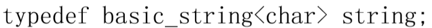

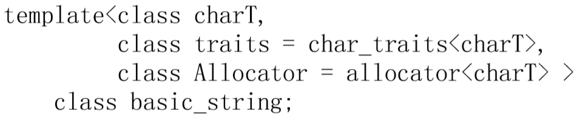

关键点是`char_trait`部分，它决定了字符的**相互作用和比较运算**（`!`运算）。如果你希望在`string`这些操作上有不同的行为，我们所要做的只是提供一个不同的`char_trait`模板。这是最容易的方法：

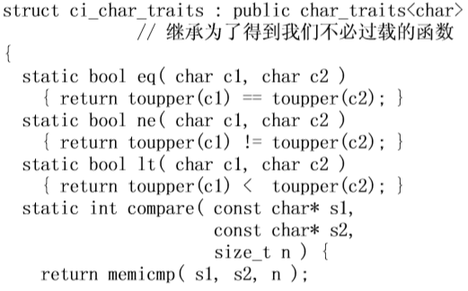

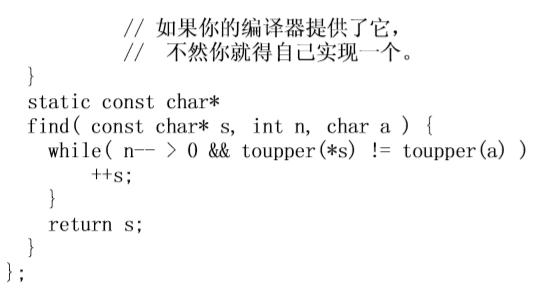

:two:最终将合并：

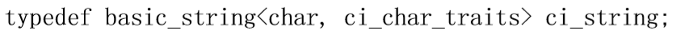


# 条款4-5：具有最大可复用性的通用Containers

:one:为下面的==定长向量类==实现**拷贝构造操作**和**拷贝赋值操作**，以提供**最大的可用性**。提示：请考虑用户代码可能会用它做哪些事情。

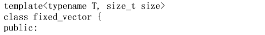

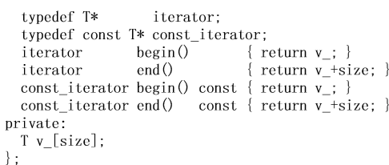

:two:答案如下：

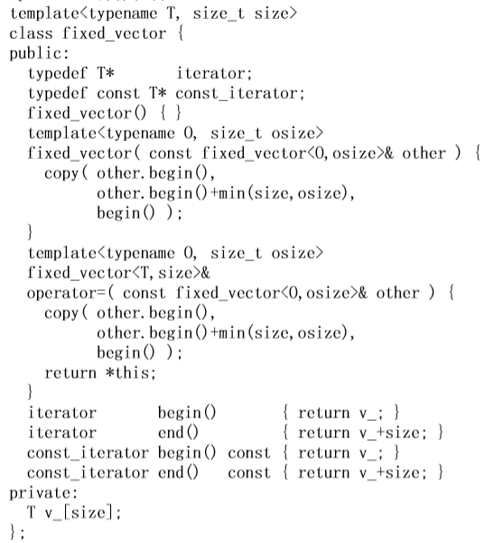

:three:进行分析。

你以为原本默认构造的拷贝构造和复制函数都不会生成了吗？不！真正的**拷贝构造函数或者拷贝赋值运算符**只对完全相同类型的对象施以**构造或赋值操作**。举个例子：

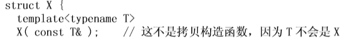

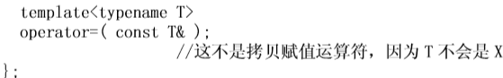

由于==模板构造函数终究不是拷贝构造函数==，因此这种模板的出现并**不会隐藏**原来隐含的拷贝构造函数之声明。如此一来，我们在解答中给出的代码实际上与原来问题中的原始代码==有着相同的拷贝构造函数和拷贝赋值运算符==——因为编译器始终生成它们隐含的版本。我们所做的改动只是**增强了构造操作和赋值操作的可适应性**，而不是替换掉了旧有的版本。

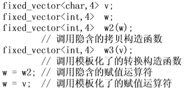

由此可以看出，本条款的问题所寻求的==真正答案==其实是：提供了具有可适应性的“从其它固定向量进行构造和拷贝的操作”，而不是具有可适应性的“拷贝构造操作和拷贝赋值操作”——它们早就存在了。

:four:我们增加的两个操作具有如下两个主要用途：

- 支持可变的类型（包括继承在内）

  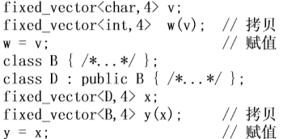

- 支持可变的大小。

  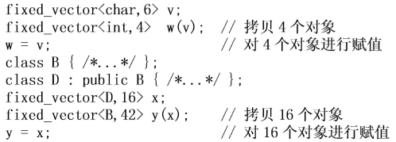

:five:另一种解答：标准库风格。

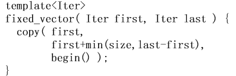

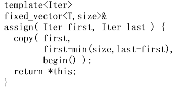

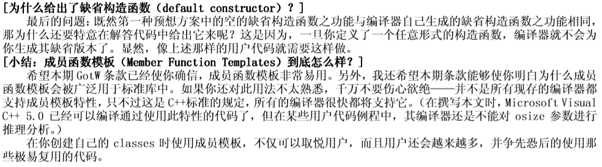


# 条款6：临时对象

:one:让性能优化无法达到的罪魁祸首之一就是临时对象。考虑一下代码有几个不必要的临时对象：

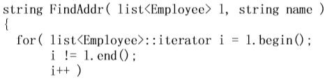

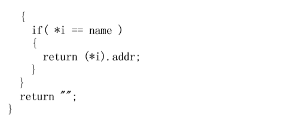

:two:答案：

首先，函数的两个参数形式都是性能不高的，应该使用**常量引用**，而不是值传递。

> 规则：请使用`const&`，而不是传值拷贝。

然后，我也看出来了哈哈：`++i`要比`i++`效率更高，原因就是后增操作要返回一个包括递增前的值的临时对象（实现上也确实如此）。

> 规则：非必要，请使用先增操作，避免使用后增操作。

```
*i == name
```

这里没有体现`Employee`类，但如果想让它行得通，则要么来一个转换成`String`的操作，要么通过一个**转换构造函数**来得到一个字符串。然而两种方法都会产生**临时对象**。

> 尽可能显式的使用构造函数。

> 绝对不要返回局部对象的引用

:three:其实还有很多可以优化的地方，诸如：避免对`end()`进行多余的调用 。程序员可以使用一个`const_iterator`。


# 条款7：使用标准库


# 条款8-17：异常处理的安全性

:one:实现如下==异常-中立的容器==。要求：`Stack`对象的状态必须保持其**一致性**；即使有内部操作**抛出异常**，堆栈对象也必须是**可析构的**；`T`的异常必须能够传递到其调用者那里。

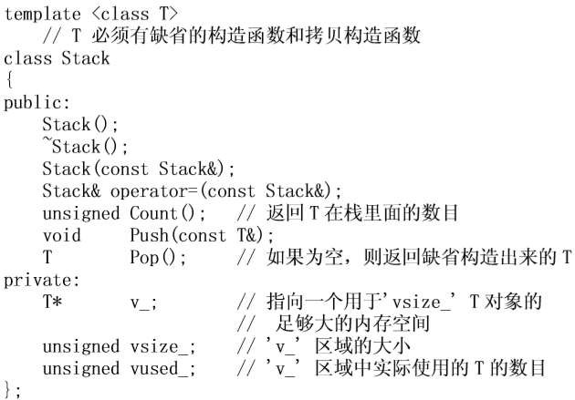

附加题：

- 根据当前的`C++`标准，标准库中的容器是==异常安全==还是==异常中性==？
- 应该让容器成为**异常中性**吗？为什么？有什么**折衷方案**吗？
- 容器应该使用**异常规则**吗？堆栈：比如，我们到底应不应该作诸如`Stack::Stack()throw(bad_alloc);`的声明？

挑战极限的问题：

- 由于在目前许多的编译器中使用`try`和`Catch`会给你的程序带来一些**额外的负荷**，所以在我们这种**低级的可复用容器**中，最好避免使用它们。你能在不使用`try`和`catch`的情况下，按照要求实现`Stack`所有的成员函数吗？

:two:解答。

现在我们来看看实现。我们对`T`有一个要求，就是`T`的**析构函数不能抛出异常**。这是因为，如果允许`T`的析构函数抛出异常，那我们就很难在保证代码安全性的前提下进行实现了。

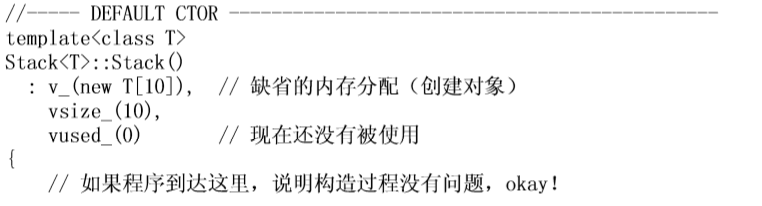

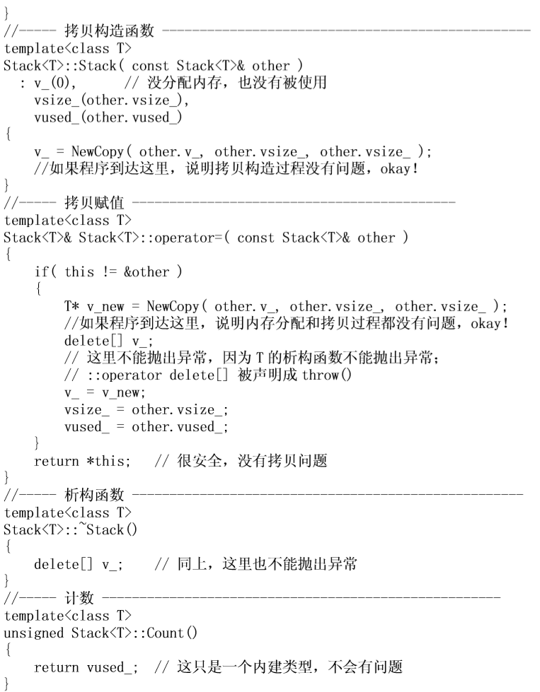

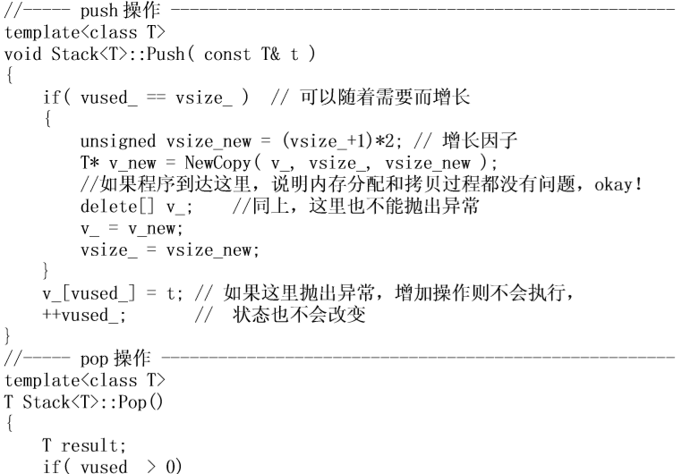

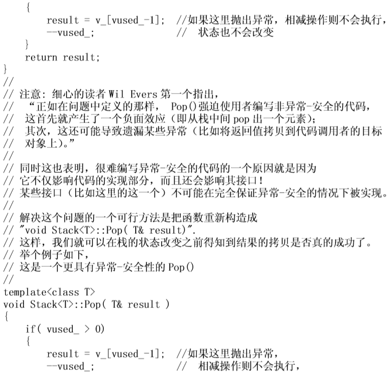

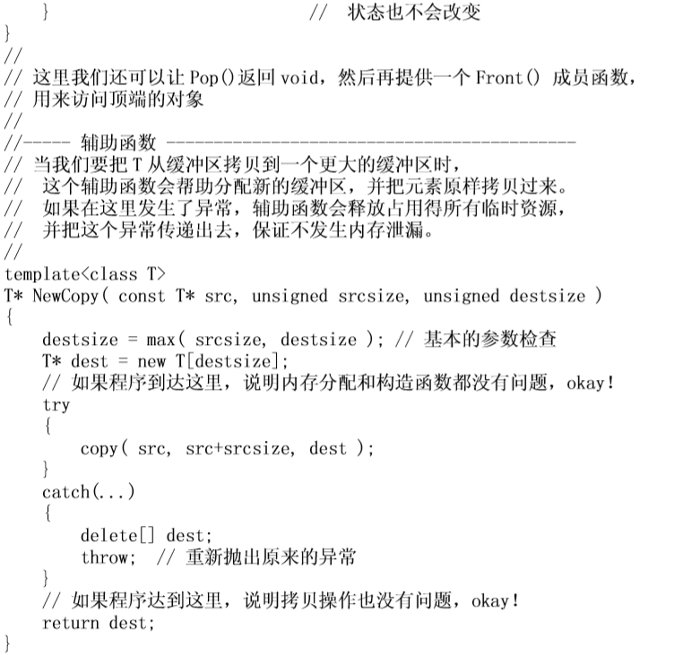

:three:对附加题的解答。

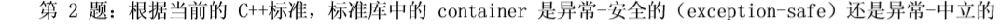

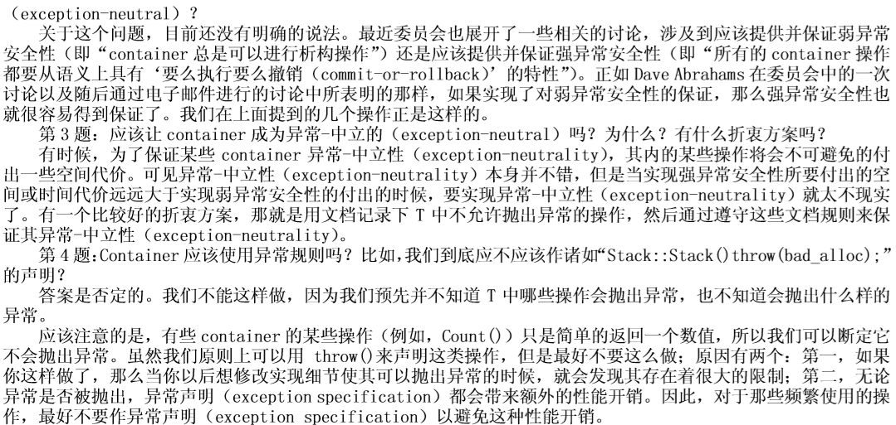

:four:极限挑战问题的解答。

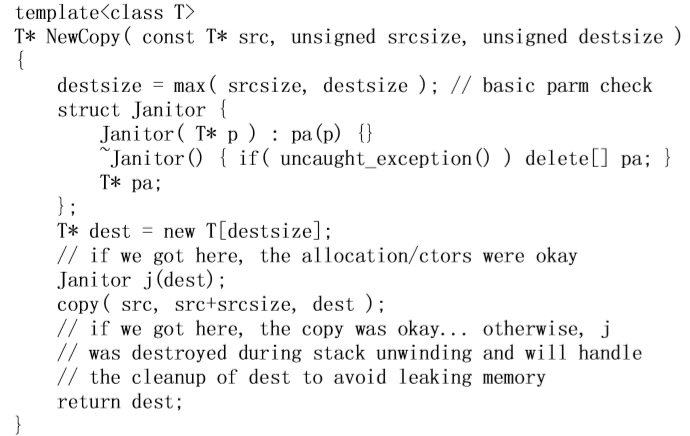

## 理解:star:

> 以上建立在：1、内建类型的各个操作，不会抛异常；2、模板参数T的析构函数不会抛异常。所以我们在上面实际会产生异常的只有两个地方：`NewCopy`函数和`result = v[...]`这个`T`的拷贝赋值上。
>
> 目前，还没看懂的是`pop()`那里的分析。
>
> 仔细看了会，我觉得问题在于旧版的`pop`是`return result;`，这里有一个局部对象产生和赋值，但这个时候发生错误抛异常，虽然状态改变了，但我们实际上并没有获得栈顶元素，下次再次进行调用，我们也只会获得中间的元素。甚至于，明明栈非空，却告诉调用者栈已经空了！。有点理解下面这段话了：
>
> 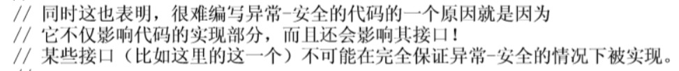


# 条款18：代码的复杂性(1)

:one:问题：在没有任何其它附加信息的情况下，下列代码中可以有多少条**执行路径**？

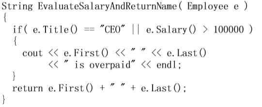

假设：

- 忽略对**函数参数**求值时的不同顺序，以及由**析构函数**抛出的异常。
- 调用的函数被认为具有**原子性**。

:two:==23==。`3`条和异常无关的路径，`20`条暗藏的路径，都与异常有关。

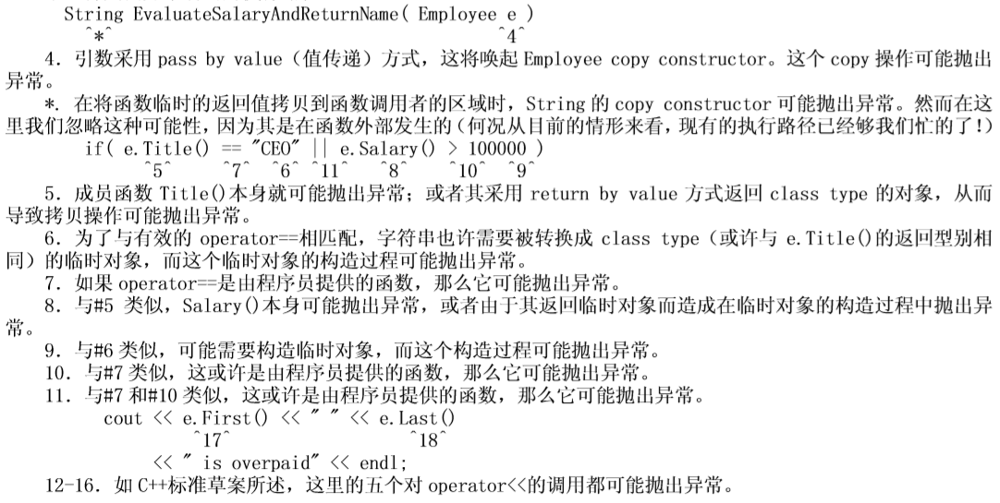

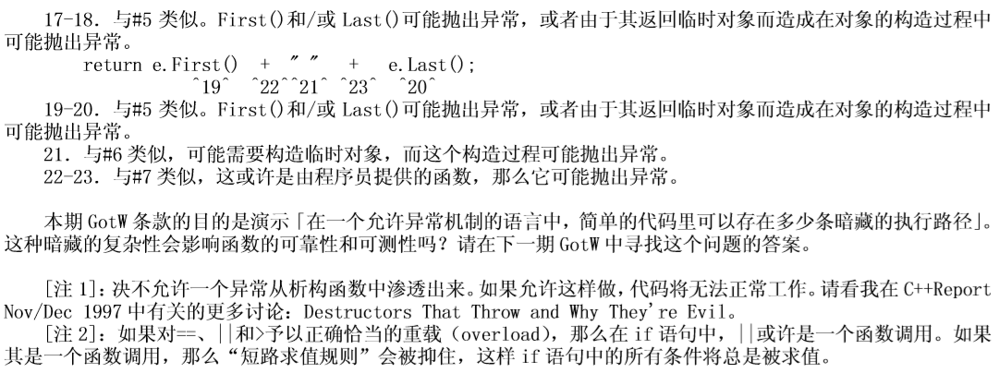


# 条款19：代码的复杂性(2)

:one:问题：让我们来考虑上一个条款里的那个函数。这个函数是**异常安全的**，出现异常时仍能**正常工作**；还是**异常中立的**，能将所有异常都**转给调用者**？


如果它是**异常安全的**，那它是**基本保证**，还是**强力保证**；如果他不是**异常安全的**，那该如何对其进行修改以使其进行修改，以支持**基本保证或强力保证**。

> 异常保证是关于==确保对象处于一致状态==，以便可以**安全地销毁对象**（==基本保证==），或撤消对对象的所有操作以便在**抛出异常时对象恢复到其先前状态**（==强保证==）


## 解答

:two:如题所述，我们假设所有被调用的函数——包括流函数（`stream function`）在内——都是**异常安全的**（即可能抛出异常，但在抛出异常时**无副作用**），并且假设所使用到的所有对象——包括**临时对象**在内——也都是**异常安全的**（即当这些对象被销毁时，其占用的资源也都能被清理）。

然而`stream`却偏偏要对此使个拌儿——这缘于其可能产生的**“不可回滚”副作用**。例如，运算符`<<`可能会在输出了字符串的一部分之后**抛出一个异常**，而此时已经被输出的那部分是**无法被“反输出”的**；同样，`stream`的错误状态也会在此时被设置。在大部分情况下，我们都忽略这些情形；本次讨论的重点是考查：==当函数具有两个互不相同的副作用时，如何使函数成为异常安全的==。

那么，上面函数就会有一个矛盾！考虑`cout`输出和`return`。

- 如果`return`抛异常，那么实际上，什么也不会return出去，所以状态没有改变，这是**强力保证**。
- 如果`cout`抛异常，则有两个条件：
  - 第一个，`cout`的输出到一半抛异常，此时状态无法恢复，因为已经输出一部分了。
  - 第二个，`cout`输出完之后才抛异常，更是如此。

:three:要满足强力保证，函数的行为应该是：要么两件事都圆满完成，要么就是遇到该函数抛出异常，两件事都不做。我们可以达成这样的要求吗？下面是一种我们可能会尝试的方式：（==第一次尝试==）

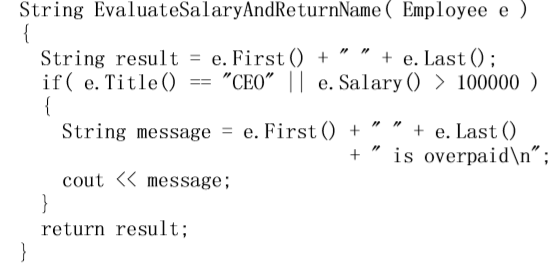

> 应当注意到：为了只使用一个`<<`，所以用换行符代替了`endl`。
>
> ==主要是做了啥呢==？就是把输出信息提前合并好，避免输出信息使用多个`<<`。这样的话，输出信息时不会输出到一半突然抛异常，同时在返回函数那一行也不会抛异常了（没有考虑后面说的、隐藏的拷贝构造和拷贝赋值）

到现在，我们仍然有一个微小的瑕疵，它如下面的用户代码所示（开始考虑了）：

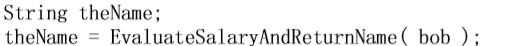

由于函数的结果采用了**按值返回方式**，因此**字符串的拷贝构造函数**被唤起；拷贝赋值运算符也被唤起，用来将结果拷贝到`theName`。如果这两个拷贝操作中有任一个失败了，那么函数的副作用就已发生效应，而其结果也就无法挽回的丢失了。

:four:能否做得更好一些？可以通过“==避免拷贝操作==”来避免这个问题。这即是说，我们让函数接受一个`string&`，并将返回值放在这个参数中：（==第二次尝试==）

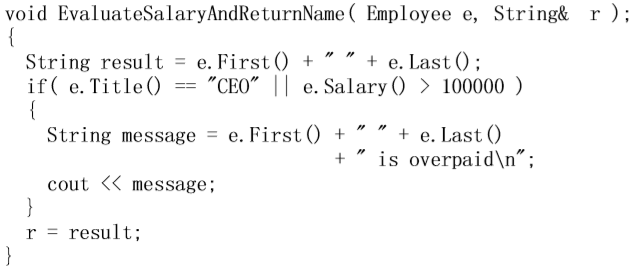

然而这个时候，已经解决的问题又出现了：`r=result`抛异常，导致信息被`cout`了，但赋值却失败了。

:five:使用`auto_ptr`来尝试：（==第三次尝试==）

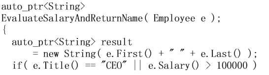

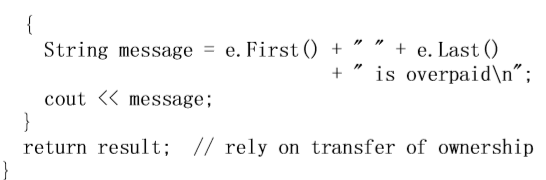

这正是解题的诀窍所在。我们有效的隐藏了**产生第二个副作用的操作 `return`**，同时也保证了在第一个副作用完成后（`cout`），只使用**不抛出异常的操作**把结果安全的返回给函数调用者。那么这样做的代价呢？正如在实现**强异常安全性**时经常发生的那样，这种强安全性==以效率为代价==：我们使用了**额外的动态内存分配**。

:six:具体总结见书。

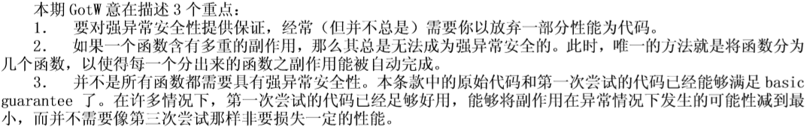


# 条款20：Class技术

:one:找出下列`class`的不好代码风格，还有一些错误：

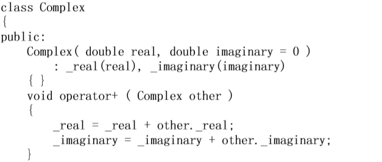

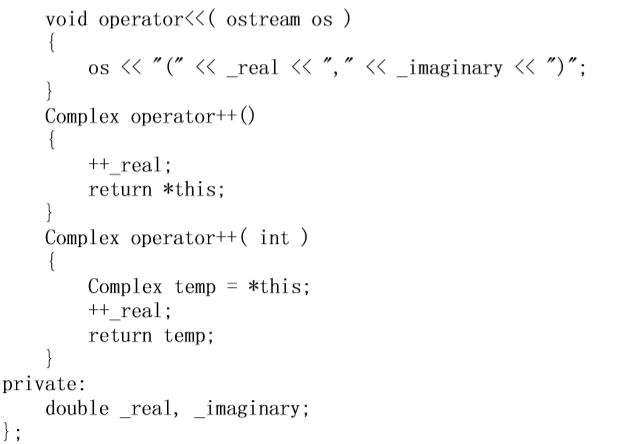


## 解答:star:

:two:首先是`constructor`，以下这个`constructor`允许发生==隐式转换==。

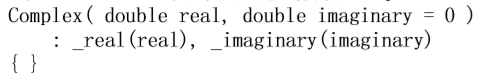

由于第二个参数有预设值，此函数可被视为单一参数的`constructor`，并因此得以允许一个`double`转换为一个`Complex`。在本例中这也许是好的，但一如我们在条款`6`所见，这样的转换可能并非总在意图之中。一般而言，==让你的构造函数成为`explicit`是个好主意==，除非你审慎地决定允许**隐式转换**。

> 设计准则：小心隐式转换所带来的**隐式暂时对象**。避免这东西的一个好办法就是：==尽可能让构造函数成为显式==，并且**避免写出转换运算子**。

:three:`operator+`效率不够，传入参数应该是`const&`方式。此外，`a=a+b`应该重新写为`a+=b`。虽然由于这里是`double`，导致这种修改没有过多优化，但如果是`class`类型，则效率的改善十分明显。

> 设计准则：尽量以`by Const&`的方式来传递参数。
>
> 设计准则：尽量写`a op=b`；而不要写成`a=a op b`。

:four:`operator+`不应该是个**成员函数**。如果`operator+`是个成员函数，一如本例所示，那么当你决定允许其他型别**隐式转换**为`Complex`时，`operator+`可能无法以很自然的形式工作。具体地说：只能写`a=b+1.0`，而无法写为`a=1.0+b`，因为`member operator+`要求以一个`Complex`做为其**左侧引数**。

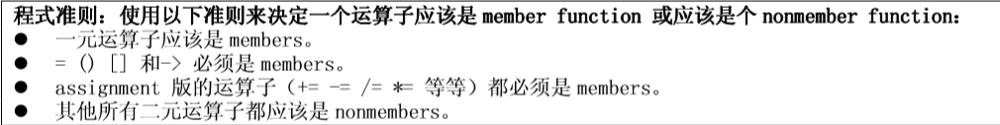

:five:`operator+`不应该修改`this`值。它应该传回一个临时对象，内含相加总和。

:six:如果定义了`operator+`，也应该定义`operator+=`，并且使用`+=`为基础实现`+`。

:seven:`operator<<`不应该成为一个成员函数。更深一层，`operator<<`的返回类型应该是`ostream&`，以便准许**串链式输出动作**。

后续分析见书。


# 条款21：虚函数:star:

todo.


# 条款22：Classes之间的关系（1）

:one:有一个网路应用程式，拥有两种通讯行为，每一种行为有自己的协议：

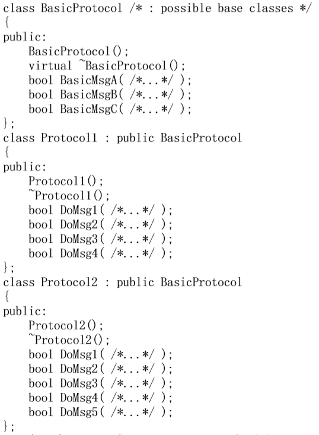

每一个`DoMsg…()`成员函数都调用`BasicProtocol::Basic…()`执行共同的工作，然后`DoMsg…()`另外再执行其实际工作。每一个类都还可以有其他的成员，但你可以假想所有重要的成员都已呈现出来。

请评论此设计，有任何东西需要改变吗？如果有，为什么？

:two:上面的描述明显是`is implemented in terms of`，这种关系在`C++`中应该以`private`继承或**成员关系**来完成。

> 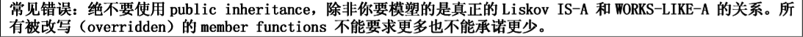

:three:设计准则：绝对不要以`public inheritance`复用`base class`内的代码；`public inheritance`是为了被复用——被那些 [以多型方式运用base objects] 的代码复用。

下面是更详细的说明：

1. 基类没有提供任何虚函数。这意味着它并不意图以多型的方式被使用。

2. 基类没有任何`protected`成员。这意味没有任何衍生接口，这对任何继承类型，都是一个强烈的反对暗示。

3. 所有衍生类都只使用基类的`public`接口。这意味它们并没有因为自己是派生类而受益。‘

   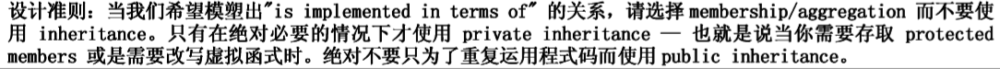


