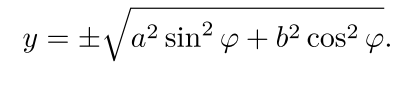
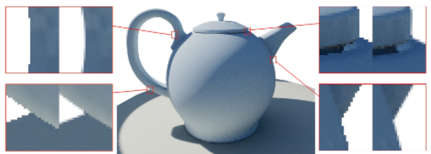
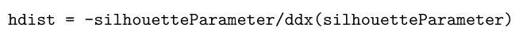

[toc]


# 各向异性Kuwahara过滤


## 1. 介绍

用于图像抽象的`edge-preserving filte`的流行例子是**双边滤波器**和**平均移动**`mean shift`。两者都在平滑**低对比度区域**的同时保留了**高对比度的边缘**。因此，它们对于高对比度的图像可能会失败，因为在这些图像中，要么没有进行抽象处理，要么由于使用的阈值，相关信息被删除。对于低对比度的图像，它们也经常失败，因为在这些图像中，通常有太多的信息被去除。

克服这一限制的**边缘保护滤波器**是==Kuwahara滤波器==。基于局部区域的`flattening`，**Kuwahara滤波器**在高对比度区域适当**去除细节**，在低对比度区域维持形状边界。因此，它在整个图像中保持一个**大致统一的抽象水平**，同时提供一个**整体绘画风格外观**。Kuwahara滤波器在有噪声的情况下是**不稳定的**，并有**块状伪影**的问题。为了改进**原始的Kuwahara滤波器**，已经提出了一些扩展和修改。


## 2. Kuwahara滤波器

总体思路是将**滤波器内核**分为`4`个**矩形子区域**，这些子区域重叠一个像素。然后，滤波器的值由一个**方差最小的子区域的平均值**来定义。


$|W_k|=(r+1)^2$是**像素数**，**平均值**$m_k$为：


**方差**的计算：


假设颜色通道的**方差不相关**，则：


在下图中，显示了用**Kuwahara滤波器**处理的图像，明显可以看到伪像。这些都是由于使用了**矩形子区域**造成的。此外，如果存在**噪声**或子区域具有相同的方差，则子区域的选择过程是**不稳定的**。


```c++
uniform sampler2D src; 
uniform int radius;

void main (void) { 
    vec2 src_size = textureSize2D(src , 0); 
    vec2 uv = gl_FragCoord.xy / src_size; 
    float n = float (( radius + 1) * (radius + 1));
    vec3 m[4]; vec3 s[4]; 
    for (int k = 0; k < 4; ++k) 
    {
        m[k] = vec3 (0.0); 
        s[k] = vec3 (0.0);
    }
    
    struct Window { int x1, y1, x2 , y2; }; 
    Window W[4] = Window [4]( Window( -radius , -radius , 0, 0 ),
                            Window( 0, -radius , radius , 0 ),
                            Window( 0, 0, radius , radius ),
                            Window( -radius , 0, 0, radius )
                            );
    
    for (int k = 0; k < 4; ++k) 
    { 
        for (int j = W[k].y1; j <= W[k].y2; ++j) 
        { 
            for (int i = W[k].x1; i <= W[k].x2; ++i) 
            { 
                vec3 c = texture2D(src , uv + vec2(i,j) / src_size ).rgb; 
                m[k] += c; 
                s[k] += c * c;
            } 
    	} 
	}
	
	float min_sigma2 = 1e+2; 
	for (int k = 0; k < 4; ++k) 
	{ 
        m[k] /= n; 
        s[k] = abs(s[k] / n - m[k] * m[k]);
        float sigma2 = s[k].r + s[k].g + s[k].b; 
        if (sigma2 < min_sigma2) { 
            min_sigma2 = sigma2; 
            gl_FragColor = vec4(m[k], 1.0);
        }
	}
}
```


## 3. 优化的Kuwahara滤波器

为了克服**不稳定子区域**选择过程的限制，定义了一个新的标准。不选择单一的子区域，而是将结果定义为**各子区域平均值的加权和**。权重是根据**子区域的变量**来定义的。这导致了**更平滑的区域边界和更少的伪影**。为了进一步改善这一点，矩形子区域被**圆盘上的平滑加权函数**所取代


我们从构建**加权函数**开始。我们通过定义**特征函数**，将**平面**划分为`N`个相等的**扇形**，这些特征函数在扇形上为`1`，否则为`0`：


$G_{\sigma}$标准偏差为`σ`的**高斯函数**。为了定义**平滑加权函数**。首先对不同扇形的**特征函数**$X_k$进行**卷积**，然后与高斯相乘。（下面这个公式后面会说，直接进行**预计算**得到）


**卷积使特征函数平滑**，使它们略微重叠。乘法实现的是**随着半径的增加而衰减**。因此，有平均值和方差：


我们设置：


过滤的输出是：


**加权系数**$\alpha_k$的定义保证了**标准差低的扇形**被赋予**更多的权重**。参数`q`控制了**输出的锐度**。在我们的例子中，我们使用$q=8$。**加权函数**$w_k$是很难计算的，因为它们的计算需要**卷积**。

目前还不知道解析方案。由于$w_k$不依赖于**像素的位置**，一个直接的方法是==预计算==。在我们的实现中，我们使用了一种略有不同的方法，所有的$w_k$都是通过对纹理图进行**双线性采样**而得到的。我们使用这种方法是因为它可以很容易地推广到**各向异性的过滤**，这将在下一节中讨论。

求**旋转矩阵**，按**逆时针方向**的角度φ进行旋转。：


因为$X_k=X_0\circ R_{-2\pi k/N}$，然后高斯函数是**旋转不变的**，所以：


这里，$\circ$表示**函数的组合**。对于我们的实现来说，将$w_0$存入到了一张$32\times 32$的纹理$K_0$中，通过下列公式得到：


并将原点移至**纹理图的中心**。下图说明了计算的不同步骤。现在假设`r>0`表示所需的**滤波器半径**。那么加权函数$w_k$可以被近似为


```c++
uniform sampler2D src; 
uniform sampler2D K0; 
uniform int N; 
uniform int radius; 
uniform float q;
const float PI = 3.14159265358979323846;

void main (void) { 
    vec2 src_size = textureSize2D(src , 0); 
    vec2 uv = gl_FragCoord.xy / src_size;
    vec4 m[8]; 
    vec3 s[8]; 
    for (int k = 0; k < N; ++k) 
    { 
        m[k] = vec4 (0.0); 
        s[k] = vec3 (0.0);
    }

    float piN = 2.0 * PI / float(N); 
    mat2 X = mat2(cos(piN), sin(piN), -sin(piN), cos(piN ));
    for ( int j = -radius; j <= radius; ++j ) 
    { 
        for ( int i = -radius; i <= radius; ++i ) 
        { 
            vec2 v = 0.5 * vec2(i,j) / float(radius ); 
            if (dot(v,v) <= 0.25) 
            { 
                vec3 c = texture2D(src, uv + vec2(i,j) / src_size ).rgb; 
                for (int k = 0; k < N; ++k) 
                { 
                    float w = texture2D(K0, vec2 (0.5, 0.5) + v).x;
                    m[k] += vec4(c * w, w); 
                    s[k] += c * c * w;

                    v *= X;
                } 
            } 
        } 
    } 

    vec4 o = vec4 (0.0); 
    for (int k = 0; k < N; ++k) { 
        m[k].rgb /= m[k].w; 
        s[k] = abs(s[k] / m[k].w - m[k].rgb * m[k].rgb);
        float sigma2 = s[k].r + s[k].g + s[k].b; 
        float w = 1.0 / (1.0 + pow (255.0 * sigma2 , 0.5 * q)); // alpha
        o += vec4(m[k].rgb * w, w);
    }
    gl_FragColor = vec4(o.rgb / o.w, 1.0);
}
```


## 4. 各向异性的Kuwahara滤波器

改进的**Kuwahara滤波器**未能捕捉到**方向性特征**，并导致了`clustering`伪影。**各向异性的Kuwahara滤波器**通过使滤波器适应**输入的局部结构**来解决这些限制。**在同质区域，滤波器的形状应该是一个圆，而在各向异性区域，滤波器应该成为一个椭圆**，其**主轴**与图像特征的主要方向一致。


### 方向和各向异性的估计

局部方向和各向异性的估计是基于**结构张量**`structure tensor`的**特征值和特征向量**。我们直接从输入的RGB值计算结构张量。设`f`为输入图像，设置是`Sobel`滤波器的水平和垂直**卷积掩码**：


`f`的偏导数可以通过以下方估算：


其中`⋆`表示**卷积**。那么，`f`的**结构张量**定义为：


这里，$\cdot$表示**标量乘积**。**结构张量的特征值**对应于`f`的**最小和最大变化率的平方**。**特征向量对应于各自的方向**。选择与**最小变化率**相对应的特征向量，可以得到一个**矢量场**，如上图（`b`），这个向量场不连续。为了平滑矢量场，对**结构张量**进行了**平滑处理**。上图（`c`）中显示了应用**高斯滤波器**的结果。平滑结构张量是对**张量的线性操作**，但对特征向量的影响是**高度非线性的**，在几何上与**主成分分析**相对应。在我们的例子中，我们使用了一个标准偏差`σ = 2.0`的**高斯滤波器**。请注意，我们**不对张量进行归一化**。因此，对应于**具有大梯度的边缘的结构张量在平滑过程中得到更多的权重**。因此，边缘的方向信息被分配到边缘的邻近区域。

**结构张量的特征值**为非负实数，由以下公式给出


以**最小变化率**为方向的**特征向量**由以下公式给出


我们通过以下方式定义**局部方向**：


为了测量**各向异性的程度**，我们使用[Yang]中提出的方法：


**各向异性**`A`的范围从`0`到`1`，其中`0`对应的是**各向同性**，`1`对应的是**完全各向异性**。上图（`e`）。

```c++
//计算结构张量的代码
uniform sampler2D src;
void main (void) { 
    vec2 src_size = textureSize2D(src , 0); 
    vec2 uv = gl_FragCoord.xy / src_size; 
    vec2 d = 1.0 / src_size;
    vec3 c = texture2D(src , uv).xyz; 
    vec3 u = ( 
            -1.0 * texture2D(src , uv + vec2(-d.x, -d.y)).xyz + 
            -2.0 * texture2D(src , uv + vec2(-d.x, 0.0)).xyz + 
            -1.0 * texture2D(src , uv + vec2(-d.x, d.y)).xyz + 
            +1.0 * texture2D(src , uv + vec2( d.x, -d.y)).xyz + 
            +2.0 * texture2D(src , uv + vec2( d.x, 0.0)).xyz + 
            +1.0 * texture2D(src , uv + vec2( d.x, d.y)).xyz ) / 4.0;

    vec3 v = ( 
    		-1.0 * texture2D(src , uv + vec2(-d.x, -d.y)).xyz + 
            -2.0 * texture2D(src , uv + vec2( 0.0, -d.y)).xyz + 
            -1.0 * texture2D(src , uv + vec2( d.x, -d.y)).xyz + 
            +1.0 * texture2D(src , uv + vec2(-d.x, d.y)).xyz + 
            +2.0 * texture2D(src , uv + vec2( 0.0, d.y)).xyz + 
            +1.0 * texture2D(src , uv + vec2( d.x, d.y)).xyz ) / 4.0;
            
    gl_FragColor = vec4(dot(u, u), dot(v, v), dot(u, v), 1.0); //E F G H
}

//这两者间需要进行一个高斯 filter pass

//计算角度和各向异性
uniform sampler2D src;
void main (void) 
{ 
    vec2 uv = gl_FragCoord.xy / textureSize2D(src , 0); 
    vec3 g = texture2D(src , uv).xyz;
    
	float lambda1 = 0.5 * (g.y + g.x + sqrt(g.y*g.y - 2.0*g.x*g.y + g.x*g.x + 4.0*g.z*g.z));
	float lambda2 = 0.5 * (g.y + g.x - sqrt(g.y*g.y - 2.0*g.x*g.y + g.x*g.x + 4.0*g.z*g.z));
	vec2 v = vec2(lambda1 - g.x, -g.z); 
    
    vec2 t; 
    if (length(v) > 0.0) 
    { 
        t = normalize(v);
	} 
    else 
    { 
        t = vec2 (0.0, 1.0);
	} 
    float phi = atan(t.y, t.x);
	float A = (lambda1 + lambda2 > 0.0)? (lambda1 - lambda2) / (lambda1 + lambda2) : 0.0;
    gl_FragColor = vec4(t, phi , A);
}
```

### 过滤过程

**滤波**是用上一节的思路进行的，但要**重新定义加权函数**。我们首先计算一个椭圆的**边界矩形**。一个主轴为`a`、次轴为`b`的对齐椭圆的定义是：


通过将`x`和`y`旋转一个角度`φ`，我们得到一个旋转的椭圆方程式。


这是一个两变量的**二次多项式**，通过扩展和收集项，它可以被重写成**规范化形式**：


**水平极值**位于`y`方向上的**偏导数消失**的地方：


将`y`代入方程：


因此**椭圆的水平极值**由以下公式给出


同理，得到**椭圆的垂直极值**：



假设$r>0$是所需的**过滤器半径**。$\phi$为**局部方向**，`A`为上一节中定义的**各向异性**。我们使用[Pham 06]中提出的方法来定义一个**椭圆的滤波器形状**。为了根据各向异性的大小调整**偏心率**，我们设定


参数$\alpha$是一个**调谐参数**`tuning parameter`。对于$\alpha \rightarrow \infty$，主轴`a`和副轴`b`收敛于`1`。我们在所有的例子中都使用$\alpha = 1$，这导致**最大偏心率**为`4`。由`a`、`b`和`φ`定义的椭圆，其主轴与图像方向一致。它**在各向异性区域有很高的偏心率**，在各向同性区域则成为一个**圆**。然后，让：


$SR_{\phi}$将**椭圆上的点**映射到半径为`0.5`的圆盘上。因此，椭圆上的加权函数可以定义为：


滤波器计算值的定义与`generalized Kuwahara`滤波器的情况相同，即公式为


**各向异性的Kuwahara滤波器**的实现与**广义的Kuwahara**滤波器的实现非常相似。因此，如下代码中只显示了各向异性的Kuwahara滤波器的**方差计算**。

```c++
vec4 t = texture2D(tfm , uv); 
float a = radius * clamp ((alpha + t.w) / alpha , 0.1, 2.0); 
float b = radius * clamp(alpha / (alpha + t.w), 0.1, 2.0);

float cos_phi = cos(t.z); 
float sin_phi = sin(t.z);

mat2 R = mat2(cos_phi , -sin_phi , sin_phi , cos_phi ); 
mat2 S = mat2 (0.5/a, 0.0, 0.0, 0.5/b); 
mat2 SR = S * R;

int max_x = int(sqrt(a*a * cos_phi*cos_phi + b*b * sin_phi*sin_phi ));
int max_y = int(sqrt(a*a * sin_phi*sin_phi + b*b * cos_phi*cos_phi ));

for (int j = -max_y; j <= max_y; ++j) 
{ 
    for (int i = -max_x; i <= max_x; ++i) 
    { 
        vec2 v = SR * vec2(i,j); 
        if (dot(v,v) <= 0.25)
        { 
            vec3 c = texture2D(src , uv + vec2(i,j) / src_size ).rgb; 
            for (int k = 0; k < N; ++k) 
            { 
                float w = texture2D(K0, vec2 (0.5, 0.5) + v).x;
                m[k] += vec4(c * w, w); 
                s[k] += c * c * w;
                v *= X;
            }
        }
    }
}
```


而这下面的代码中，显示了$N=8$的优化方差计算。为了减少**纹理查询的次数**，四个权重被打包到一个RGBA纹理图中。这个**纹理图**是通过对第3节中的权重函数`w0,...,w3`进行采样来构建的，如前所述。此外，还使用了椭圆**围绕原点对称的特性**：


# 后处理阶段的边缘抗锯齿



## 1. 介绍

本章介绍了一种**选择性**像素混合的**边缘抗锯齿新方法**。它所需要的空间只是`MSAA`的一小部分，并且与**延迟渲染**兼容。

### 问题

由于**延迟渲染**具有较大的单次采样成本，因此对其进行超采样是昂贵的。

对`MSAA`的硬件支持现在已经成为标准。现代GPU提供了各种MSAA选项，如`quincunx`。`MSAA`的缺点是**帧缓冲器的内存和带宽要求**与**样本数**成正比，所以高样本数的成本很高。

所以使用`MSAA`来实现**高质量的抗锯齿**，在内存大小和带宽方面是非常昂贵的。在目前的控制台硬件上，**帧缓冲器大小的限制**意味着即使在`2×MSAA`的情况下实现`1280×720`也有很大的成本。因此许多游戏在较低的分辨率下禁用`MSAA`（《**光环3**》）。

> SSAA则是时间上太昂贵了

本章介绍了一种新的方法，可以有效地为实时三维应用提供**高质量的边缘抗锯齿**。它适用于延迟渲染，并允许禁用`MSAA`。该技术复制了在高质量抗锯齿渲染中出现的、由于**不同的覆盖率**而导致的、边缘上微妙的**像素范围的梯度**。它不需要**额外的几何体**或额外的`pass`。

分两个阶段执行。首先，图像被渲染 ，没有`MSAA`。作为渲染的一部分，关于**接近剪影边缘**的提示被写到**帧缓冲区**。然后进行**后处理**，使用这些**提示**来更新**边缘像素**以提供**抗锯齿**。

算法核心部分为**像素着色器**提供了一种有效的方法来计算**最近的剪影边缘位置**。这种技术也可以应用于`shadow map`的`magnification`，并提供了一种保留**尖锐边缘**的`upScaling`方法。


## 2. 寻找最近的剪影边

首先，约定下术语：顶点的**外向矢量**`outward vector`是在该点相遇的所有三角形的**表面法线的归一化加权平均**。**剪影边**`silhouette edge`是**背向三角形**和**正向三角形**共享的边。

存在的两个问题是：**剪影边缘可能在拓扑上与当前三角形相距甚远**（形象点，**数组ID**）。以及光栅化器不会写入**与三角形重叠但中心在三角形之外的像素**。我们对这两个问题的解决方案是，将任何**至少有一个背向三角形的顶点**向外偏移，至少远到足以在**物体周围**呈现一个额外的**k像素边界**。当然，对于所有**重合的顶点**，`adjoining-back-face`测试结果和**偏移矢量**必须是相同的，以防止模型裂开）


上图显示了**顶点偏移**在截面上的工作方式，偏移量为**一个像素**。这种操作解决了上述的两个问题。首先，通过以这种方式偏移顶点，我们渲染了一组**额外的与原始几何体接壤的像素**；如果$k>=\sqrt{1/ 2}$，那么这些额外的像素将包括所有**与原始几何体重叠的像素**。其次，如果我们在渲染几何体时启用**背面剔除**，我们可以确信，**任何接近剪影的像素都会在一个三角形内，并且至少有一个顶点在剪影边缘**。换句话说，通过这种**几何变化**明确地形成剪影，可以**避免寻找剪影边缘**。

顶点程序输出变量`silhouetteParameter`：如果顶点被偏移，则为`0`，如果为`1`。如果启用了**背面剔除**，内插值不是`1`的唯一情况：像素在一个三角形内，至少有一个顶点在**剪影边缘**。

`silhouetteParameter`的内插值在某种程度上类似于距离：它在**剪影边缘**为`0.0`，并向内部增加。然而，三角形的**一个或多个内部顶点**可能就在边界区域之外，也可能在相当远的地方，所以**与边界的距离**不是`silhouetteParameter`的函数。

我们可以分别使用`DirectX`和`OpenGL`中的`ddx/ddy`或`dfdx/dfdy`指令来计算**屏幕空间**中**剪影参数**的偏导数。有了这些信息，我们可以估算出水平和垂直方向上**剪影边缘的像素数**：




根据这两个值，我们可以计算出到**剪影边缘最近点**的位置或**矢量的近似值**，如果需要的话，可以将其写入**帧缓冲区**。

> 以上方法由于插值和透视校正的存在，可能是数学几何上不正确的，但依然适用于我们的目标


## 3. 后处理过程

这项技术的==总体目标==是**让几何体边缘看起来是超采样的**。与剪影边缘重叠的像素应该是相关物体颜色的混合，并**按覆盖率加权**。

现在，我们只考虑**最简单的情况**，即一个像素有**单一的剪影边缘**穿过它。由于我们在渲染帧缓冲区时没有进行任何形式的超采样或多采样，所以像素的颜色完全是由单一物体引起的：这将被称为**前景色**。如果不渲染**贡献三角形**，该像素的渲染就会不同；这种新的颜色被称为**背景色**。

如果我们把自己限制在一个**标准的帧缓冲区**内，每一个像素只保存一个颜色，而不是某种**深层帧缓冲器**，就没有办法知道一个像素的**实际前景和背景颜色**。我们可以通过对这些像素的**一个邻居**进行采样来近似计算**背景色**。选择的邻居**越远**，邻居的颜色与实际背景颜色之间的**相关性就越低**。

根据第2节中描述的方法，对于每个像素，我们都有**精确到亚像素的数值**，即到剪影边缘的**水平和垂直像素数**。如果我们将采样限制在一个近邻，那么后处理只能影响到**物体最边缘的像素**（见下图：`hatched`像素是唯一被影响的）。


相关的像素是那些与**边缘的水平或垂直距离**小于一个像素的像素，即$min(abs(hdist), abs(vdist))<1.0$，`hdist`和`vdist`是上面定义的水平和垂直距离。考虑到这一限制，很自然给出前景和背景颜色之间的**混合系数**：


**这个选择**意味着在第2节的**顶点偏移讨论**中，==k的最小值是1==；更大值会简单地增长对象而**不影响边缘质量**。接近边缘的像素将逐渐受到**背景颜色**的影响；中心仅在三角形内的像素将有一个非常接近背景颜色的颜色。从示例图中可以看出，**模糊处理**将**锯齿状的阶梯状边缘**变成了一系列平滑的、像素范围内的梯度。

给定一个小于`1`的**混合系数**，下一个问题是：**应该对哪个邻居像素进行采样以找到近似的背景颜色**（见上图：很多地方的唯一选择是**对角线相邻的邻居**。因此，一个简单的选择是选择$(sign(hdist), sign(vdist))$的邻居）。原则上，我们可以计算出**边缘位置和方向**，然后用任意的**像素滤波函数**来计算**覆盖率的估计值**，以用于混合前景和背景颜色。我们将忽略这一点，原因有二：

- 首先，背景色是通过对它的一个邻居进行取样来逼近的，而这种**逼近的质量随着距离的增加而急剧下降**。将样本限制在一个近邻是**最安全的选择**。

- 第二，**后处理操作对速度要求很高**，所以长时间的计算会直接影响帧率。鉴于hdist和vdist，后处理步骤的伪代码如下：

  ```c++
  colbase = sourceImage[pixelPos.x, pixelPos.y]; 
  colneb = sourceImage[pixelPos.x + sign(hdist), pixelPos.y + sign(vdist )];
  blendfactor = min(abs(hdist), abs(vdist )); 
  colfinal = lerp(colneb, colbase, blendfactor );
  ```

现在已经知道了**后处理的要求**，我们将转向**帧缓冲器**中存储的内容。由于任何额外数据都会对**内存带宽**产生相应的要求，额外的或更高位深度的`RT`是一个昂贵的选择，因此尽量减少存储在帧缓冲器中的`tip`的大小是非常重要的。

后期处理需要计算**采样偏移**和**混合系数**。它对`hdist`和`vdist`没有其他需要。如果我们将**样本偏移量**限制在**四个对角线角落**，那么它可以用两个比特来存储。混合因子可以采取任何位数：例如，**两个位**意味着四个`level`，这比`4×MSAA`（有五个）要差。对于实现，我们选择了**六位**，允许`64`个不同的**混合水平**。

这个选择将一些额外的工作从**后处理**转移到了**着色器**上：现在还必须找到四个**对角线邻居**中的哪一个是**合适的选择**，计算**混合系数**，并将所有这些信息编码到`alpha`通道中。


## 4. 完善

在大多数情况下都能正确地提供**抗锯齿**，但也有一些情况下会失败。

- **没有相邻三角形的边缘**（"开放边缘"）。这类边缘应该总是被归类为**剪影边缘**并接受**边缘模糊处理**。因此，解决方案是**标记任何在开放边缘上的顶点**，使它们自动通过**相邻-背面测试**。对于这些顶点，**向外方向**必须以不同的方式来定义：每个在**有关顶点**相遇的**开放边缘**都会贡献一个与开放边缘和三角形法线成直角的向量；最终的**向外方向**应该是这些向量的**加权平均值**。

- **具有不连续渲染的边缘**。这包括材质边界、不连续的法线、不连续的着色参数，不连续的UV。对于这类边缘，应该**始终启用边缘模糊**。如果`adjoining-back-face test`通过，那么就像往常一样操作，但是如果失败了，那么在边缘上，前景和背景之间的**混合值**是`50%`而不是`0%`。

- **三角形的三个顶点都通过了相邻-背面的检验**。见下图。想象一下，一个立方体从一个轴上看，只有一个面是可见的。在这种情况下，**该面的所有四个顶点都会与背对的三角形相邻**；剪影参数在任何地方都会是`0.0·，**导数法**对边缘距离的预测会失败。解决这个问题的一个办法是**对几何进行细分**，使有潜在问题的面有一个**中心顶点**，但这并不总是可行。

  

- 像素大小的三角形。

- **像素大小的缝隙**。由于第2.2节中描述的**顶点偏移**，几何体之间的**细小间隙**（比如手指之间的间隙）会消失。

- **Alpha blending**。`Alpha-blended billboard textures`不需要抗锯齿，形状是由纹理的`alpha`而不是几何体提供的。在渲染这些情况时，帧缓冲区中的**边缘模糊提示的更新**应该被**禁用**。

- **在深度缓冲区中相交的表面**。我们的方法在这种情况下**不提供抗锯齿**。


## 5. GPU实现和结果

### 偏移顶点

**向外矢量**是必须的，但是由于主要限制是：它对**所有重合的顶点**都是一样的，所以通常可以重新使用现有的**顶点法线**。对于具有不连续法线的形状，比如立方体，这是不可能的。如果**具有不连续法线的边**的数量较少，那么为每条这样的边插入一个**四边形**，**将不连续的顶点连接在一起**。调整**同质空间**`homogeneous space`中**最终投影顶点位置**（`hPos`）的示例代码如下：

```c
hPos.xy += normalize(screenNormal.xy) * hPos.w * 2.0 * aaExtrudeDistPixel () / screenSizePixel ();
```

- `screenNormal`是顶点法线，投影到屏幕空间。
- `aaExtrudeDistPixel()`返回 "k"，即**挤压距离**（像素），例如，`1.5`。
- `screenSizePixel() `返回屏幕尺寸，例如 `float2(1280, 720)`。

在**顶点程序**中实施精确的`adjoining-back-face test`是复杂而昂贵的，特别是对于有皮肤的角色。然而，剪影的结构足够强大，可以经受住不精确的测试。这里有**三个基本选项**，代表了顶点数据量、复杂性和准确性之间的权衡。

- 最基本的测试，适合于**低曲率的表面**。

```c++
dot(eye_vertex_vector , outward_vector ) >= 0
```

- 近似于**圆锥体的相邻三角形集合**。**阈值参数**等于`-cos`（半圆锥角），可以**预计算**并存储在**顶点流**中。这个测试更有用，但在**鞍点**`saddle points`上会失败。

```c++
dot(normalize(eye_vertex_vector), outward_vector) > threshold
```

- 每个顶点上，存储从该顶点相交的三角形中选择的**四个表面法线**。这是最准确的方法，但**需要最多的顶点数据和程序时间**。

```c++
(dot(normalize(eye_vertex_vector), plane_normal[0]) > 0) || (dot(normalize(eye_vertex_vector), plane_normal[1]) > 0) || (dot(normalize(eye_vertex_vector), plane_normal[2]) > 0) || (dot(normalize(eye_vertex_vector), plane_normal[3]) > 0)
```

当测试不准确时，问题在于剪影是在**理想的剪影边缘**的前面还是后面形成的。如果是在后面，那么就有一个危险，就是**顶点的偏移量**不够大，无法在**非偏移几何体**提供的**剪影边缘**上看到，这就会出现**锯齿**。增加`k`可能会有帮助。然而，每增加一个`k`的单位都会**明显地增大屏幕上的物体**，所以提高测试的质量可能是一个更好的选择。

如果剪影边在前面，那么就会有**可见的三角形**，对于这些三角形，所有顶点都通过了**相邻-背面测试**，因此**剪影参数**（`silhouetteParameter`）在这些三角形上将一直为`0`。

### 采样偏移和混合

```c++
//Pixel shader code given silhouetteParameter

float derivX = dFdx(silhouetteParameter ); 
float derivY = dFdy(silhouetteParameter );
vec2 approxEdgeDist = vec2(-silhouetteParameter/derivX, -silhouetteParameter/derivY );

// hdist and vdist , packed into a vector 
float coverage = min(abs(approxEdgeDist.x), abs(approxEdgeDist.y));
vec2 postStep = vec2(sign(approxEdgeDist.x), sign(approxEdgeDist.y)); 
// Encode the postprocess step and coverage , 
// to be written out to the 8-bit alpha channel 
float encodedPostStepX = (postStep.x >= 0) ? 128 : 0; 
float encodedPostStepY = (postStep.y >= 0) ? 64 : 0; 
float encodedValInt  = encodedPostStepX + encodedPostStepY + (saturate(coverage) * 63);
finalColor.a = encodedValInt /255.0;
```

当`GPU`将最终的浮点颜色写入每通道8位的**帧缓冲器**时，必须注意**避免量化问题**。因为0.0映射到0，1.0映射到255，最好的解决办法是将所需的值编码为[0, 255]的整数，然后除以255，这样**8位量化**就没有影响了。

一个能**稍微改善质量的变化**是将第5.1节中描述的变量`screenNormal`传入**像素着色器**中，并使用它来确定后处理的**采样偏移**。偶尔有的像素在`ddx/ddy`方法下会出现问题，而这个变化可以改善它们。

```c++
float2 postStep = float2(sign(screenNormal.x), sign(-screenNormal.y));
```

`-y`说明**纹理坐标与屏幕空间相比是垂直翻转的**。

一个三角形的所有三个顶点都有可能通过**相邻-背面测试**，**剪影参数**将是一个常数`0`，导数计算失败。在这种情况下，最好的选择是将**覆盖率**设置为`0`，并如上所述基于`screenNormal`设置**后处理的样本偏移**。这将抹去**剪影边缘的一像素宽的三角形**，这是因为相邻的背面测试不准确，这是最常见的问题情况。在大的三角形上，所有的像素将被对角线移动一步，但这不太可能造成明显的问题，除了可能出现的**边缘异化**。

### 混合边缘像素

```c++
//Unpacking a number in floating point. 2.5.3

float encodedAAVal = sourceColor.a * 255; 
vec3 unpackedAAVal = frac(float3(encodedAAVal / 256, encodedAAVal / 128, encodedAAVal / 64) );
vec2 postStep; 
postStep.x = ( unpackedAAVal.x >= 0.5) ? + 1.0 : -1.0; 
postStep.y = ( unpackedAAVal.y >= 0.5) ? + 1.0 : -1.0; 
float coverage = unpackedAAVal.z;
```

### 开销

略。//todo


## 6.  结果


上图显示了复杂背景的交互，包括一个`4×MSAA`的渲染图供比较。**放大的区域**显示了对**邻近像素**进行采样以接近背景颜色的效果：可以看到背景中一些间接接近边缘的线条在混合区域中被抵消了一个像素。这幅图像是用第5节中描述的`four-plane adjoining-back-face test`来渲染的。\

有皮肤的角色比**静态几何图形**更难支持：鞍点很常见，这意味着许多三角形的三个顶点都通过了相**邻-背面测试**。最后，`skinning`使**相邻-背面测试**变得复杂：对一个`skinned`的角色实施四面测试是很困难的，而且需要相当多的额外顶点数据。

出于这个原因，我们对下图所示的**带皮角色**使用了一个简单而不太准确的测试。在这里，我们使用了**锥体测试**，**阈值**为`-0.2`，所有顶点的`k`值为`1.5`像素。锥体测试并不精确，**一些剪影的边缘没有抗锯齿**。


## 7. 其他应用

### Shadow Mapping


使**像素着色器**能够以**亚像素的精度**来估计**阴影边缘的位置**，这开启了一些有趣的可能性。一个应用是`Shadow Mapping`：如果关于阴影边缘位置的提示和深度一样被编码，那么`magnification`代码就可以使用这些信息来提供一个**亚像素精度的锐利边缘**（见图2.8）。

在对阴影图进行采样时，使用了一个自定义的`magnification function`而不是**双线性过滤**。给定阴影贴图纹理上的一个位置，对周围的四个`texels`进行采样。这四个`texels`提供的`distance-to-edge equation`被计算，与对应于**最高距离-边缘值**的`texels`相关的深度值被用于**阴影测试**。

> This means the shadow edge will run outside the group of texels that the shape rasterized to (without this property, clean intersections of silhouette edges are not possible).

下面的**像素着色器代码**实现了这一点。给出`silhouetteParameter`，这段代码将把`plane equation`编码为一种颜色，并写入`32bpp`的**RGBA帧缓冲器**中。

```c++
//Sampling the shadow map

float derivX = dFdx(silhouetteParameter); 
float derivY = dFdy(silhouetteParameter);

vec2 vecToEncode = vec2 (0.0, 0.0); 
float encWeight = 0.0; 
if(silhouetteParameter < 1.0) {
    float d = sqrt(( derivX*derivX ) + ( derivY*derivY )) * 1.0; 
    vecToEncode.x = derivX / d; 
    vecToEncode.y = derivY / d;
    encWeight = silhouetteParameter / d;
} 
destColor.r = saturate (0.5 + vecToEncode.x * 0.5);
destColor.g = saturate (0.5 + vecToEncode.y * 0.5);
destColor.b = encWeight;
```

下一步是`shadowmap magnification`，如下所示。样本点周围的四个`texel`的颜色是colAA、colAB、colBA和colBB；`depthAA`等是对应的**四个深度**。`baseUV`保存样本点的`UV`，四舍五入到最近的texel。`fracUV`包含UV坐标的**小数部分**，即`（0,0）`与`texel AA`重合，`（1，1）`与`texel BB`重合。

```c++
// Sample shadow edge hints for the relevant four texels/points 
vec4 colAA = texture2D(shadowEdgeHintMap , baseUV + (vec2(0 ,0) * singleUVStep));
vec4 colBA = texture2D(shadowEdgeHintMap , baseUV + (vec2(1 ,0) * singleUVStep));
vec4 colAB = texture2D(shadowEdgeHintMap , baseUV + (vec2(0 ,1) * singleUVStep));
vec4 colBB = texture2D(shadowEdgeHintMap , baseUV + (vec2(1 ,1) * singleUVStep));

// Sample shadowmap depths for the relevant four texels/points 
float depthAA = texture2D(shadowDepthMap , baseUV + (vec2 (0 ,0) * singleUVStep)).r;
float depthBA = texture2D(shadowDepthMap , baseUV + (vec2 (1 ,0) * singleUVStep)).r;
float depthAB = texture2D(shadowDepthMap , baseUV + (vec2 (0 ,1) * singleUVStep)).r;
float depthBB = texture2D(shadowDepthMap , baseUV + (vec2 (1 ,1) * singleUVStep)).r;

// Calculate the distance -to -edge function for the four points
vec3 weightFuncAA = CalcWeightFunction(vec2 (0,0), colAA ); 
vec3 weightFuncBA = CalcWeightFunction(vec2 (1,0), colBA ); 
vec3 weightFuncAB = CalcWeightFunction(vec2 (0,1), colAB ); 
vec3 weightFuncBB = CalcWeightFunction(vec2 (1,1), colBB );

// Evaluate the distance -to -edge function for the four points 
vec3 fracPosH = vec3(fracUV.x, fracUV.y, 1.0); 
float weightAA = dot(weightFuncAA , fracPosH ); 
float weightBA = dot(weightFuncBA , fracPosH ); 
float weightAB = dot(weightFuncAB , fracPosH ); 
float weightBB = dot(weightFuncBB , fracPosH );

// Find the least distance -to -edge value , and use the 
// corresponding depth for the shadow test. 
float leastDistToEdge = -10.0; 
float depthForTest =0.0; 
if(weightAA >leastDistToEdge) { leastDistToEdge = weightAA; depthForTest = depthAA; }
if(weightBA >leastDistToEdge) { leastDistToEdge = weightBA; depthForTest = depthBA; } if(weightAB >leastDistToEdge) { leastDistToEdge = weightAB; depthForTest = depthAB; } if(weightBB >leastDistToEdge) { leastDistToEdge = weightBB; depthForTest = depthBB; }

// depthForTest contains the depth to be used for the shadowmap test.
```

`CalcWeightFunction()`函数（如下）解压了**距离-边缘方程**的参数。它是通过对**返回的向量**与一个**同质二维坐标**的点积进行计算的）。

```c++
vec3 CalcWeightFunction(vec2 samplePt , vec3 sampleCol)
{
	vec2 unpackedDist = (sampleCol.rg - 0.5) * 2.0; 
    float baseWeight = sampleCol.b; 
    vec3 rc = 0; 
    rc.x = unpackedDist.x; 
    rc.y = unpackedDist.y; 
    rc.z = baseWeight; 
    // Skew the function slightly to artificially increase the 
    // distance -to -edge value as the queried point gets further 
    // from the key corner. This provides a clearly defined 
    // nearest corner in cases where the distance -to -edge value 
    // is a constant 1, because there is no nearby edge. 
    //当被查询点离关键角越来越远时，将函数略微倾斜，以人为地增加距离-边缘值。这在距离边缘值为常数1的情况下，提供了一个明确定义的最近角，因为附近没有边缘。
    vec2 fallVec = vec2(1,1) - (samplePt * 2); 
    rc.xy += fallVec * -0.02; 
    rc.z -= (rc.x * samplePt.x) + (rc.y * samplePt.y); 
    return rc;
} 
```

另外，**阴影图测试**可以应用于`corner points` （例如，如果有阴影，取值为0，如果没有，取值为1），然后将产生的四个值混合起来，产生一个**更柔和的边缘**。这可以被扩展到产生一个**抗锯齿的阴影边缘**。

当三角形覆盖了一个相当大的区域时，这个方法效果不错。但**对于小的、采样不足的三角形来说，边缘质量就会下降**。

### Upscaling

//todo

