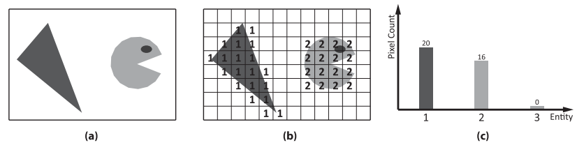
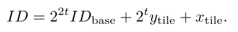

[toc]


# Environment Mapping with Floyd-Steinberg Halftoning


## 1. 介绍


一般想法是使用蒙特卡洛积分：


正如我们之前在其他地方了解到的，**可见性**$V$是最耗时的。**实时环境映射算法**通常会**忽略这个因素**，从而忽略环境照明的阴影。然而，对于渲染逼真的图像，**这种简化是不可接受的**。因此，在这一章中，我们研究了正确计算包含遮挡的`Environment Mapping `。

毫无疑问，为了性能考虑，我们的**采样数**应该尽可能少。对于一个给定的样本数，==正交误差==取决于两个因素：

- **重要性采样**。密度`p`在多大程度上模仿了积分项？
- **分层**`Stratification`。有限数量样本的**经验分布**在多大程度上遵循由`p`定义的**理论分布**？


## 2. 参数化环境贴图

一个可能的参数化是：用**球面角**$\theta^/,\phi^/$来表达方向$w^/$。其中$\phi^/\in[0,2\pi]$，θ′∈[0，π/2]。然后，**纹理坐标**$(u,v)$从**单位区间**被缩放到这个范围。例如，在**球形照明**的情况下，一个方向被**参数化为**：


环境贴图明显**不是均匀分布**的，不同的**实体角**∆ω取决于**纹理坐标**`v`：


**反射辐射度**的积分也可以在**纹理空间**中进行计算：（**分辨率**为$(R_u,R_v)$）


其中：


当然，考虑环境贴图的所有`texels`实在太耗时，所以我们需要重要性采样。


## 3. 重要性采样

**蒙特卡洛方法**使用**概率密度**来**选择样本点**。根据**重要性抽样**的概念，我们应该找到一个模仿`product form integrand`的密度`p`。为了定义一个合适的密度，我们通常要执行以下**三个主要步骤**：

- 首先，我们决定哪些因子的**乘积形式积分**`product form integrand`将被模仿，并找到一个通常是**矢量值**的积分因子的**标量近似**。在我们的案例中，**环境照明**`E`和**反射系数**`R`是矢量值，因为它们为红、绿、蓝光的波长分配了不同的值。频谱`L`可以·转换为标量，它是红、绿、蓝三色**强度的加权和**。**由此产生的标量近似积分被称为重要性函数**，用`I`表示。请注意，由于环境照度是由纹理定义的，**重要性函数也由二维图像表示**。当我们想强调这一特性时，我们把**重要性函数**称为`importance map`。

  有几种选择来定义**重要性函数**，因为有**不同的选择**来选择那些**被模仿的积分因子**。最简单的方法是==BRDF采样==，它**模仿反射因子的亮度**。另一方面，==光源采样==`Light-source sampling`将**重要性函数**设定为**环境照明的亮度**。最后，==乘积抽样==`product sampling includes`将积分的**一个以上的因子**纳入重要性函数。例如，**重要性函数可以是环境照明和反射因子的乘积的亮度**（双乘积采样），或者它甚至可以包含一个**廉价的可见度因子**，该因子由物体中的一些简单的**代理几何形状**所近似（三乘积采样）。

- 由于**密度**应该被**归一化**，**重要性函数的积分**需要对**整个领域**进行计算。这种计算可以利用这样一个事实：**重要性函数**也被定义为一个**二维数组或纹理**，类似于**环境照明的纹理图**：（请注意，**重要性函数**应该作为**重要性抽样**的一个步骤进行积分。这意味着**重要性函数的计算和积分必须比原始积分要便宜得多**。）


- 最后，**密度**被定义为**重要性函数**和**归一化常数**的比率：

  

  

在构建了`importance map`并计算了**总和**`S`之后，可以用以下简单的方法以**概率密度**`p`抽取样本。我们产生`M`个**统计上独立**的随机数`r1, ... . , rM`，它们**均匀分布在单位区间**内。然后对于每个随机数，扫描`importance map`的二维数组，并将**重要性值**加在一起。这个运行总和与$r_iS$进行比较。当**运行总和**变大时，停止扫描，并将当前`texel`视为样本。可以很容易地看出，这个过程将选择一个`texel`，其**概率与它的值成正比**。


不幸的是，应用**统计学上独立的随机样本**在许多情况下提供了**糟糕的结果**。为了证明这个问题，我们用**光源采样**来寻找环境地图上的方向性样本（上图）。结果是令人失望的，因为以**与亮度成比例的概率**进行独立的随机`texel`选择，并**不能保证样本组会有很好的分层**。我们在地图的重要部分仍然有很大的空白区域（**欠采样**），而样本组则集中在一个不重要的小区域（**过采样**）。下一节提出的方法有效简单，与简单的随机方法相比，几乎没有开销。


## 4. 解决方案

本章提出的方法的**目标**是：产生模仿`importance map`的==良好分层样本==。它很有效，实施起来也很简单，甚至比随机抽样还要快。所提出的方法是基于这样的认识：**重要性抽样相当于数字半色调**`digital halftoning`。

**半色调**是一种用于在**黑白显示器**上渲染**灰度图像**的技术（见图3.3）。其**原理**是：在较亮的区域放更多的白点，在较暗的区域放更少的白点。一个像素周围区域的**白点的空间密度**预计将与该特定像素的**灰度等级**成**正比**。如果我们把**原始图像的灰度级**看作是一个**重要性函数**，把得到的**图像的白色像素**看作是**样本位置**，那么我们可以看到半色调相当于一个确定性的重要性采样算法。**重要性采样和半色调的等价性源于它们都是频率调制器**。频率调制器的输入是`upscal image`或`importance map`，输出是由输入指定频率的**离散样本集合**。


这一等价关系适用于**任意的半色调算法**，包括在量化前向原始图像添加**随机噪声**或**周期性图案**的随机和有序半色调方法，或者**误差扩散半色调方法**，其中`Floyd-Steinberg`算法是最有效。误差扩散半色调比随机或有序半色调提供的结果更好，因为它**不是简单地进行独立的局部决策，而是收集和分配信息给邻近的像素**。

因为它考虑到了**邻域的灰度**，所以**采样位置是分层的**，与随机或抖动的方法相比，产生的图像更平滑，减少了噪音。由于这些良好的特性，我们开发了基于`Floyd-Steinberg`方法。

### Floyd-Steinberg Sampler

采样算法采用`importance map`，并计算出所有`texel`的总和`S`。然后，**采样**就是在`map`上执行`Floyd-Steinberg halftoning`，将**阈值**设置为$S/(2M)$，其中`M`是**预期样本的数量**。在下图中，**阈值**和**误差**分别用红线和白条表示。**半色调算法**将**误差值**初始化为`0`，并逐行扫描`map`，在行的末端改变**扫描顺序**。在每个`texel`中，误差值与阈值的比较可能有两种结果。**如果误差不大于阈值，那么这里就不生成样本**（该`texel`变成黑色），误差**保持不变**。**如果误差大于阈值，那么这个texel就是一个样本**。**误差值**减少$S/M$，也就是说，我们计算图3.4中**黑色部分**所代表的**误差的负补数**。

M

在这两种情况下，在进入下一个`texel`之前，该`texel`的**剩余误差**被分配给其**未访问的邻居**。该方法以类似的方式继续进行，直到所有的`texel`都被访问过。

下列清单显示了这个算法的实现，它被优化为**几何着色器**。每次着色器被调用时，它会处理大小为`R.x × R.y`的`importance map`，其值是通过`getImportance`函数查询的。它发出`32`个方向样本，**样本选择的概率**存储在`alpha`通道中。函数`getSampleDir`返回与`importance map`的一个`texel`相关的方向。我们避免维护一个**实际的重要性值数组**，只存储**被带到下一行的重要性**。变量`cPixel`包含要**转移到下一个像素的重要性**，`cDiagonal`必须添加到下一个像素下面，而`cRow`是一个数组，打包成`float4`向量，包含**要添加到下一行像素的重要性**。每一行都以四个像素为单位进行处理，之后可以将收集到的四个变量`acc`的值打包到`cRow`数组中。`cRow`的大小是`RX4`，也就是`importance map`的宽度除以`4`。每次读取`importance map`时，`importance map`被加载到变量`I`中，再加上从邻居那里结转过来的重要性，得到变量`Ip`中修改后的重要性。

```c++
[maxvertexcount (32)] 
void gsSampler( inout PointStream<float4> samples)
{ 
    uint M = 32; 
    float S = 0; 
    
    [loop]
    for(uint v = 0; v < R.y; v++) 
        [loop]
        for(uint u = 0; u < R.x; u++) 
            S += getImportance(uint2(u, v));
    
    float threshold = S / 2 / M; 
    float4 cRow[RX4] = {{0,0,0,0}, {0,0,0,0}, {0,0,0,0}, {0,0,0,0}}; 
    float cPixel = 0, cDiagonal = 0, acc[4]; 
    [loop]
    for(uint j = 0; j < R.y; j++) 
    { 
        uint kper4 = 0; 
        [loop]
        for(uint k = 0; k < R.x; k += 4) 
        { 
            for(uint xi = 0; xi < 4; xi++) 
            { 
                float I = getImportance(uint2(k + xi, j)); 
                float Ip = I + cRow[kper4][xi] + cPixel; 
                if(Ip > threshold) { 
                    float3 dir = getSampleDir(uint2(k + xi, j)); 
                    //存储方向，以及I/S
                    samples.Append(float4(dir, I / S)); 
                    Ip -= threshold * 2;
                } 
                //y轴上的下一个，即（x, y+1)，记得加上(x-1, y)的对角线补误差
                acc[xi] = Ip * 0.375 + cDiagonal; 
                //x轴上的下一个，即（x+1，y)
                cPixel = Ip * 0.375; 
                //对角线，(x+1, y+1)
                cDiagonal = Ip * 0.25;
            } 
            cRow[kper4++] = float4(acc[0], acc[1], acc[2], acc[3]);
        } 
        
        //扫描线算法，先0->n ,然后n->0。
        j++; 
        kper4--; 
        [loop]
        for(int k = R.x - 5; k >= 0; k -= 4)
        { 
            for(int xi = 3; xi >= 0; xi--) 
            { 
                float I = getImportance(uint2(k + xi, j)); 
                float Ip = I + cRow[kper4][xi] + cPixel; 
                if(Ip > threshold ) 
                { 
                    float3 dir = getSampleDir(uint2(k + xi, j)); 
                    samples.Append(float4(dir, I / S)); 
                    Ip -= threshold * 2;
                } 
                acc[xi] = Ip * 0.375 + cDiagonal;
                cPixel = Ip * 0.375;
                cDiagonal = Ip * 0.25;
            } 
            cRow[kper4--] = float4(acc[0], acc[1], acc[2], acc[3]);
        } 
    }
}
```


### 光源采样的应用

在**光源采样**中，**重要性函数**是基于**环境照度**的，我们还考虑到不同的`texel`对应不同的**立体角**：


忽略**余弦加权BRDF**和**可见度**会降低**重要性采样**。但由于**重要性函数**只取决于**光照方向**，与被渲染的点`x`无关，所以对所有被渲染的点只需执行**一次采样**。


### 乘积采样的应用

乘积采样将积分的一个以上的因子纳入重要性函数。请注意，==包含所有因素是不可行的==，因为**重要性的计算必须比积分的计算更便宜**。在**环境映射**中，昂贵的部分是**能见度测试**，所以我们要么忽略重要性中的遮挡，要么用一些更便宜的近似值来代替它。**重要性函数**被定义为：


其中，$V^,$是**可见项的近似**。**双重乘积抽样** `Double product sampling`设定V˜=1，假设在生成时**环境总是可见的**。另外，我们可以通过计算与**代理几何体**的交点来近似可见性，例如，物体内部的球体。在这种情况下，我们谈论的是**三乘积采样**。我们必须强调的是，近似可见度因子和代理几何体只用于定义`importance map`和生成**重要方向**。不幸的是，要找到一个在物体内部的**简单代理几何体**并不容易。例如，在下图中，将一个球体放入角色的头部是很直接的，但为车轮定义一个代理几何体是很困难的。


与光源采样不同，现在的**重要性函数**还取决于渲染点`x`，并间接地取决预`x`处的**法向量**。这意味着我们**不能**对所有渲染点的环境图进行**一次全局处理**，而是要对每一个渲染点**重复进行**包括**Floyd-Steinberg半色调**在内的采样过程。因此，在光源取样中，`Floyd-Steinberg`取样器没有开销，但如果**光线追踪**比**重要性图的生成和处理**更昂贵，那么**乘积采样就会产生开销**。


## 思考

看这节的时候，脑子总是忍不住去想BRDF预计算的`split sum`，然后就又去看了`learn opengl`的`IBL`那一节。毕竟两者都是`IBL`，都是对**辐射度方程**下功夫。

就我个人的思考，我们之前比较熟悉的**预计算BRDF**，和这里的算法，在重要性采样上当然是一样的。区别是流程不同：

- 预计算BRDF：选择需要拟合的因子，也就是GGX-NDF项 $\rightarrow$ 根据**低差异序列**产生良好的采样点  $\rightarrow$ 传入对应的重要性采样函数 $\rightarrow$ 返回采样点，计算权重 $\rightarrow$ 累加求和，除以采样数，存入贴图 $\rightarrow$ 实际运算读取。

  重要性采样的数据 ： 入射方向（实际求得是反射方向，转了个弯）。

- 这里的算法，没有预计算：选择需要拟合的因子，例如光源 $\rightarrow$ 遍历重要性map，根据本章算法，决定这个光源值是否为采样点，如果是，存取它的方向和$I/S$ $\rightarrow$ 实际计算。

写的是一坨屎，哎

我们要求解$L(x)=\int f(x)dx=\int A\cdot B \cdot Cdx$，选取$A$做拟合因子，则对应概率密度函数为$pdf=A(x)/\int A(y)dy$。然后我们可以使用**低差异序列**或本文的`Floyd-Steinberg Sampler`产生`M`个**分层良好的采样点**，对于每个采样点，就是计算的值$f(x)/pdf$。最后累积求和，在除以`M`。


# Hierarchical Item Buffers for Granular Occlusion Culling


## 1. 介绍

**最常见的算法**是在**应用阶段**采用`frustum`和`portal`剔除，以排除**不可见的几何体**，通常以**分层的数据结构**组织。更复杂的算法在**离线预处理**中预先计算**整个可见性集**，以便进行有效的**实时可见性计算**。

> [概念复习](https://www.pianshen.com/article/21791500904/)

最近在（`occlusion`）**剔除领域**的进展，采用**硬件`occlusion`查询**作为高效的**从点到面**的**可见性确定机制**，由**图形硬件**提供。**几何图形**根据现有的**深度缓冲区**被**光栅化**，**通过深度测试的像素**被计算出来。然后，**查询结果**读回应用程序，因此保守的、**基于可见性的剔除**必然会使`CPU`和`GPU`的异步执行**同步化**；最近引入的`occlusion predicates`试图**避免这个问题**。

除此之外，`GPU`利用内置的`early-z`优化功能，在**像素着色器**执行之前，丢弃**未能通过深度测试的像素**。然而，**这种优化在某些情况下会失效**，例如，在**像素着色器**写入**深度值**的情况下。

在[Engelhardt and Dachsbacher 09]中，作者描述了一种方法，它以一种**对输出敏感的方式**从**点的可见性**中计算。它被设计用来补充`early-z`优化，并扩展现有的**基于GPU的剔除方法**，特别是对于**涉及昂贵着色器的渲染技术**。通过计算**可配置粒度**的可见性，它可以灵活地适应不同的用户和着色器需求。也就是说，它能够计算**不同实体的可见性**，即单个基元、成批的基元或整个（成批的）物体。

这是通过使用一个`item buffer`的变体来实现的。**实体**被分配了一个**标识符**并被渲染到`item buffer`中。之后，利用**基于GPU的散射**对`item buffer`中**每个实体的出现**进行**计数**。由于该方法完全在`GPU`上执行，因此很容易实现，而且不需要任何应用反馈。例如，这可以在**几何着色器和细分着色器**中实现**基于可见度的剔除**和**LOD控制**，并进一步实现在禁用`early-z`优化的情况下的剔除。


## 2. 分层的Item Buffers

我们方法的基础是著名的`item buffer`。与原始方法类似，我们为每个**通过深度测试的栅格化实体**存储一个**唯一的标识符**（`ID`）。例如，一个实体可以是一个单独的三角形、一个三角形集群、一个实例化的`Draw Call`中的单独实例，或者在最简单的情况下，一个物体。因此，一个实体的类型定义了**查询的粒度**。之后，如下图所示，我们采用**直方图算法**来计算每个`ID`的**出现次数**，从而计算出一个**实体的可见度**。



为了计算**直方图**，我们在`GPU`上使用了**散射算法**。`item buffer`被重新解释为一个**点列表**，**顶点着色器**从`ID`中计算出一个**bin索引**。每个`bin`存储一个**计数器**，通过渲染**点基元**，我们在**直方图渲染目标**中使用**加法混合**来增加**计数器**。之后，**一个实体的可见性**可以在**任何着色器阶段**被查询。


### ID分配

很明显，**给实体分配ID**在算法中起着不可或缺的作用。在最简单的情况下，每个对象可以被分配一个ID。这样的ID可以是用户指定的属性，但系统生成的语义，如**基本或实例ID**也是可能的。然而，可以使用**更复杂的分配方案**，使屏幕空间的**子区域的可见性查询**成为可能。 因此，我们将屏幕空间细分为$2t\times 2t$的`tile`，并计算出**最终的ID**，如下所示。 



这样的分配方案不仅允许查询**一个实体在屏幕特定区域的可见性**，而且还能以**分层的方式**建立一个**四叉树类型的结构**进行查询。例如，考虑下图（b）。三角形在`tile`$[0,1]\times [2,3]$中的**可见性**可以通过对**层次结构的单一访问**来查询


### DX10实现

为了将分层`item buffer`整合到**Direct3D 10**的渲染管道中，必须实现以下步骤：创建`item buffer`和**散射**。

==Creating the item buffer==。创建`item buffer`分两步进行。首先，我们将**所有的遮挡物**渲染到**深度缓冲区**（如下清单）。在第二遍`pass`中，我们渲染**所有的实体**，同时留下**深度测试**，以及**写到深度缓冲区**的功能。然后，**像素着色器**计算实体的`ID`，将**直方图坐标计算**与**散射**解耦，计算出**相应的bin索引**，即直方图纹理中的一个**纹理坐标**。

[List 1]()

```c++
//HLSL pixel shader for rendering into an item buffer 

cbuffer cbHistogramDimensions {
    float2 hDim; 	// Width & height of histogram
    float2 tDim; 	// Width & height of a tile in pixels float3
    float3 idScaling; // = float3 (2ˆ(2t), 2ˆt, 1) 
};

struct PS_ID { 
    float4 Position : SV_POSITION; 
    float BaseID : TEXCOORD0;
}; 

float2 psRenderItemBuffer(in PS_ID vsIn) : SV_TARGET0{
    // Base ID and tile IDs 
    float3 ID = float3(vsIn.BaseID, floor(vsIn.Position.xy) / tDim);
    
    // Composed ID 
    float itemID = dot(idScaling, ID);
    
    // Relative histogram texture coordinates [0 ,1]ˆ2  
    float tmp = itemID / hDim.x;
    float x = frac( tmp ); 
    float y = floor( tmp ) / hDim.y;
    
    // Relative viewport coordinates [ -1;1]ˆ2 
    return (-1 + 2 * float2(x,y) + 1 / hDim);
}
```

==Scattering==。**散射**是该算法的第二道`pass`（如下所示）。**直方图渲染目标**被绑定到**输出合并阶段**，**混合阶段**被配置为执行**加性混合**`additive blending`。在上一环节中获得的`item buffer`被绑定为**顶点着色器的输入**，一个与`item buffer`的**像素数**一样大的**点列表**被渲染出来。

从系统生成的**顶点ID**中，计算出进入`item buffer`的查找坐标，以加载在前一程序中计算出的**直方图bin坐标**，然后直接发送到**光栅化阶段**。

[List 2]()

```c++
Texture2D<float2> tItemBuffer;
float4 vsScatter(in uint VertexID : SV_VERTEXID ) : SV_POSITION { 
    uint w,h;
    tItemBuffer.GetDimensions(w, h);
    uint x = VertexID % w; 
    uint y = VertexID / w;
    return float4(tItemBuffer.Load(int3(x, y, 0)), 0, 1); 
}
```

作为**最后也是可选的步骤**，本地支持的**mipmap生成方案**可以被用来构建**直方图上的层次结构**。请注意，由于这个创建方案中**固有的过滤功能**，**直方图中的计数器**必须增加$2^{2t}$，以确保**最粗层次的正确结果**。

在实现该算法时，应该考虑到关于散射的**潜在性能瓶颈**。**散射**可能会通过向**同一个bin**发送**点基元**来触发许多连续的增量，因此会产生大量的`overDraw`，从而降低**整体散射性能**。尤其是当`screen tiling`保持在较低的水平，并且实体在`item buffer`中覆盖了很大的区域时，情况更是如此。

**另一个导致性能下降的原因**是在实体被栅格化后**没有被覆盖的像素**。不幸的是，这些像素在散射前不能被丢弃，可能会导致大量的`overDraw`。幸运的是，这些像素可以在**散射过程**中通过初始化`item buffer`的**bin索引**或**直方图坐标**来移除，**该坐标不在直方图视口内**。因此，我们可以依靠栅格化阶段，在散射时**自动剔除这些点基元**。

[List 3]()

```c++
//The scattering compute shader for generating the entity histogram
RWTexture2DArray<uint> Histogram : register(u0); 
Texture2D<uint> ItemBuffer : register(t0);

[numthreads(32, 32, 1)] 
void CSMain( 
    uint3 GID : SV_GROUPID , 
    uint3 DTID : SV_DISPATCHTHREADID , 
    uint3 GTID : SV_GROUPTHREADID , 
    uint GI : SV_GROUPINDEX)
{
    // Input dimensions 
    uint w0, h0, s0; 
    uint w1, h1; 
    Histogram.GetDimensions(w0, h0, s0); 
    ItemBuffer.GetDimensions(w1, h1);
    
    // xy pixel coordinate in the item buffer 
    int2 pixelIndex = DTID.xy;
    
    // Entity ID 
    uint entityID = ItemBuffer[pixelIndex];
    
    // xy pixel coordinate in the histogram 
    uint2 tileIndex = pixelIndex * uint2(w0, h0) / uint2(w1, h1);
    
    // Interlocked increment 
    InterlockedAdd(itemHistogram[int3(tileIndex, entityID)], 1);
}
```


### DX11实现

//todo


### 流程总结

个人理解：

- 第一个`pass`，类似于`early z`，填充**深度缓冲区**，但注意，我们只考虑**被标记为遮挡物的物体**。
- 第二个`pass`，开启**深度测试**和**写深度**（因为这一个`pass`，我们是渲染所有物体），保证了被遮挡的物体不会写到`item buffer`。我们在像素着色器中，计算当前像素的`ID`（不同物体的`baseId`，乘以$2^{2t}$，保证了ID间的差异化），然后根据这个`ID`，计算得到直方图的bin坐标，转化为视口坐标后输出。最终，我们得到了`item Buffer`。（注意，和某些视图不一致的是，`item Buffer`存的是直方图处的坐标，而不是直接的`ID`）。代码对应`list 1`。
- 第三个`pass`，散射。本质上来说，就是**统计次数**，**更新直方图**。但要注意几点：首先，管道流程是：顶点着色器（`list 2`）$\rightarrow$计算着色器（`list 3`）。**顶点着色器**直接将结果输出到了`item buffer`中，然后**计算着色器**读取纹理，获得顶点对应的`ID`值（这个过程感觉文中没有提及），然后更新**直方图**。

一个疑问：为什么直方图是三维索引？

```c++
// Interlocked increment 
InterlockedAdd(itemHistogram[int3(tileIndex, entityID)], 1);
```


## 3. 应用

我们应用`item Buffer`**可见性确定算法**来加快`instanced shadow casters`的体积阴影渲染技术。**实例化**大大减少了同一物体的许多实例的`Draw call`开销，阴影体能够产生**高度精确的阴影**，但渲染成本相当高。自从引入了几何学，`shader shadow volumes`可以直接在`GPU`上创建。因此，这种算法现在能够像处理**纯静态场景**一样优雅地处理**动态场景**。不幸的是，`shadow volume extrusion`可能相当昂贵，特别是对于许多或复杂的物体。此外，`the extruded shadow volumes`必须被光栅化，这将消耗**大量的填充率**。

我们的解决方案：如果`shadow caster`位于另一个`shadow caster`的**阴影体积**内，我们就不挤压`extruding`阴影体积。这种情况可以通过从**光源的角度**应用**可见度传递**来轻松检测。

在我们的例子中，`shadow caster`是通过**实例化**来渲染的，即时生成的**实例ID**用来识别`item Buffer`中的每一个实例。然后，`volume extrusion pass`直接在`GPU`上查询可见性，并且只在**实例从光源处可见**的情况下创建一个`shadow volume`。关于实现的更多细节，请参考网络资料中的源代码。


## 4. 结果

下图显示了对Geforce 8800 GTX gaphics显卡上渲染的某一帧的**渲染时间的深入分析**。该应用程序用**一个实例化的绘制调用**渲染了`400`个`shadow caster`。可以看出，`volume extrusion pass`占用了整个帧的大量时间。在这个例子中，使用了`512×512`像素的`item Buffer`，而最终的图像是以`1280×720`像素的分辨率渲染的。`item Buffer`的**创建和散射**都花费了**大约两毫秒的时间**。在这个例子中，仅散射就花了大约一毫秒。请注意，散射过程的帧时间并不取决于实体的数量，而是取决于`item Buffer`的分辨率。


我们的剔除方法比**其他所有的渲染路径**都要好。在应用中以**较大的优势**胜出。由于几何着色器的成本很高，删减是相当有利的，而且渲染性能也明显提高。有趣的是，在我们的应用场景中，即使是少量的物体，**以遮挡为前提的渲染**也会暴露出**相当低的性能**。


## 5. 总结

我们提出了一种直接在GPU上操作的**剔除方法**，这种方法**对应用程序完全透明**，而且非常容易实现，特别是在下一代硬件和图形API上。我们已经证明，只需很少的开销，每帧的渲染时间就可以大大减少，**特别是对于昂贵的着色器或昂贵的渲染技术**。它特别针对早期着色器阶段，如几何着色器，我们相信它的目标应用是多方面的。它也为**基于可见性的LOD控制**和**细分着色器的剔除**提供了可能性。


