[toc]


# Realistic Depth of Field in Postproduction


## 1. 介绍

在这一章中，我们提出了一个交互式的、GPU加速的**DOF实现**，通过**自动边缘改进**和**基于物理的参数**来扩展现有方法的能力。**散焦效果**`Defocus`通常由**模糊半径**控制，但也可以由**基于物理的属性**驱动。我们的技术支持使用**灰度深度图图像**和**参数**（如焦距、光圈值`f-stop`、主体大小`subject magnitude`、相机距离和**图像的真实深度**）对图像和序列进行**后期散焦**`postproduction defocus`。


## 2. DOF方程

**真实的景深**是合成实景和CGI图像的必要条件。如果使用真实世界的**摄像机参数**来配置景深，那么结果的质量就会提高。用一个任意的距离`D`代替**远处距离**，该距离的**模糊盘直径**`b`是：

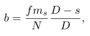

其中，$f$是焦距，$m_s$是`subject magnitude`，$N$是光圈值，$s$是**对焦距离**。**光圈数**可以用以下公式计算：

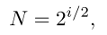

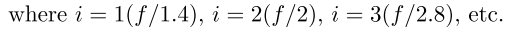

在现实世界的相机中，`f-number`通常以**离散的步骤**调整，称为`f-stops`。每个值都标有相应的`f`数，代表着**光强度比前一档减半**。这相当于**瞳孔和光圈的直径**减少了$\sqrt{2}$或大约`1.414`。当背景处于`DOF`的**极限远处**时，**模糊盘的直径**等于**混淆圈**`circle of confusion (CoC)` $c$，而模糊是难以察觉的。`CoC`是一个**光学斑点**，是由于在对**点源**进行**成像**时，来自镜头的光线没有达到**完美的焦点**而造成的。

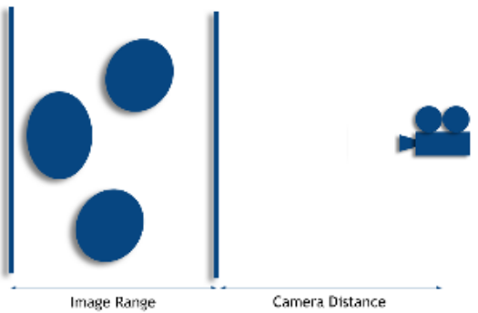

根据这些公式，艺术家可以设置**相机的焦距**、`subject magnitude`和`f-stop`。**带有深度图的图像序列**通常不包含**真实的物理距离值**。用户必须提供**图像范围**，它代表**图像的前景和背景距离**，以及**相机距离**——是**相机与图像前景的距离**。摄像机和焦点之间的**实际物理距离**计算为

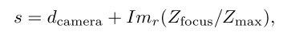


其中，$Im_r$是相机距离，$Z_{focus}$是焦点的深度，$Z_{max}$是深度图的最大深度。让$x_d$为**当前像素与焦点的距离**。这个距离是根据以下公式计算的：

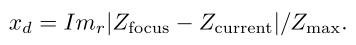

使用以上参数，模糊参数`b`可以定义如下：

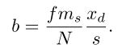

## 3. 相机透镜拟合

**光圈的结构**一般都是由**光圈叶片**构成，形成光圈形状。**光圈的形状**影响到胶片上的**光束形状**。**更多的叶片**会在结果影像上产生**更多的圆形光束形状**。这样的光圈形状可以用**曲线**来构建，也可以作为一个**自定义的位图图像**来读取。**自定义图像光圈遮罩**使得基于**真实相机光圈**产生**散焦效果**成为可能。与[Kraus and Strengert 07]中的**高级分层模糊**不同，我们的方法使用**局部邻域搜索**，根据**图像的深度特性**来近似最终的像素颜色

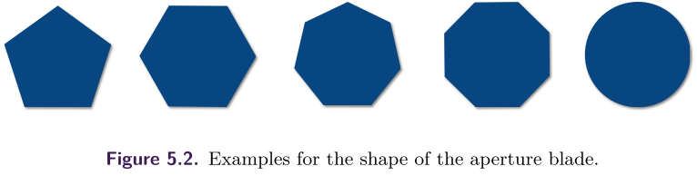

我们的**景深系统**根据**当前像素的深度值**使用了几个掩码。为了实现**无缝的景深效果**，**光圈核矩阵**需要有**奇数的宽度和高度**，而且必须是**内插的**。**景深的平滑变化**需要**亚像素精度**和**浮点值的掩码**。**当前的内核掩码是用原来相邻的内核计算的**。例如，如果新的内核尺寸是12.4×12.4，我们就从11×11和13×13的内核中用**线性内插法**生成新的掩码。


## 4. 曝光拟合

在**曝光过程**中，**胶片**或**CCD单元**记录**曝光值**。胶片经过化学处理和扫描，或**CCD矩阵值**被读取和转换以获得**数字图像**。最终图像`I`被转化为**像素值**，没有任何额外的物理属性。**曝光值**通过**非线性映射**转换为**像素值**。

同样在**曝光过程**中，每个`disk of light`都会在**胶片**上贡献**一个邻域**。理论上，这导致了**像素值的卷积**，类似于**高斯模糊**；然而，**简单地对像素值进行卷积**不会产生与现实世界中**失焦相同的视觉结果**。我们使用[Cyril等人，05]的想法来模拟这种现象，使用一个**反向映射的胶片**`film`。我们还想在**曝光空间**中混合贡献像素的效果。

### Improvements by Local Neighborhood Blending

目前的**景深后期处理实现**通常不能产生真实的结果；**边缘往往被不正确地模糊**，产生诸如**颜色渗出**`color bleeding`和**变暗的轮廓**`darkened silhouettes`等伪影。在下面的章节中，我们提出了一种用于消除这些假象的==局部邻域技术==。我们的方法使用了一种**边缘成像算法**，用于实习自动的、真实的景深，**分三个步骤进行**：**像素累积**、像素再累积和**绽放**`bloom`。

:one:***Pixel Accumulation***

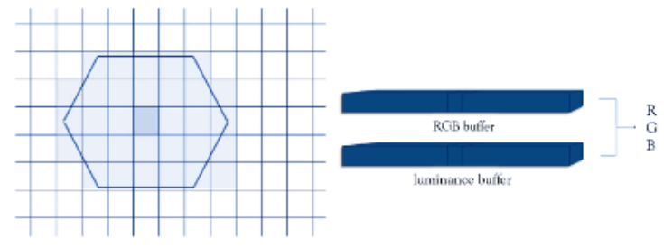

**当前像素的颜色**是由**相邻像素的颜色和亮度值**根据**光圈遮罩**`aperture mask`（上图）计算出来的。来自相邻像素的R、G、B和亮度通道被累积到**不同的缓冲区**。**参加累积的邻居的数量取决于Z-深度**。在一幅图像中，两个不同距离的物体相互靠近，其结果可能包含**伪影**，因为各层使用了**不同的遮罩尺寸**。让我们把`epsilon`值定义为**最小的深度差**，在这个深度差之上，两个图层才会出现不同的**掩膜尺寸**，也就是说，在图像中存在着边缘。在这里，**原始图像中的主像素总是被模糊得最厉害的那个**。为了得到更真实的结果，**更清晰的像素**必须使用与**更失焦的像素相关的深度值**重新计算。**最终的颜色**是**基于距离的原始颜色**和**重新计算的颜色**的**加权平均值**。如果背景中的物体看起来更清晰，我们就会忽略累积步骤中超出指定距离的像素，这个距离称为`samplingRadius`。

[list 1]()

```c++
//Pixel accumulation scheme

for all neighboring pixels 
{ 
    // a.) Luminance: 
    L = 0.3 * R + 0.59 * G + 0.11 * B; 
    // b.) Multiply luminance with the aperture mask value 
    multL = F(z) * L, 
    // where F(z) scales the mask based on the pixel distance. 
    // c.) Accumulate the resulting value with the RGB values. 
    pixel->r += neighborColor->r * multL; 
    pixel->g += neighborColor->g * multL; 
    pixel->b += neighborColor->b * multL; 
    // d.) Accumulate the luminance of the pixel. 
    pixel->lum += multL;
} 
// After accumulation , calculate the final color from 
// the color and luminance buffers. 
if (pixel->lum > 0) 
{ 
    pixel->r /= pixel->lum; 
    pixel->g /= pixel->lum; 
    pixel->b /= pixel->lum;
} 
```

:two:***Pixel Re-accumulation***

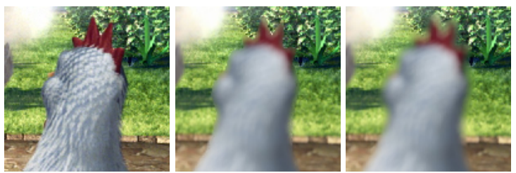

**像素的重新计算阶段**是以不同的方式执行的，这取决于**焦点的位置**：**第一种情况**是当焦点位于前景和背景之间，**另一种情况**是当物体都在焦点后面时。

在第一种方法中，如果前景比背景更容易失焦，那么就需要用属于前景像素的内核重新计算，并以两个像素的距离加权。由于**前景像素的内核更大**，重新计算所需的值（深度、距离）可以在前景像素的积累步骤中定义。所以只有当所有的像素计算都准备好了，才可以处理**前景的重新计算**。重新计算是基于以前的计算技术，使用新的计算内核，但所有相邻的像素都参与计算。

[list 2]()

```c++
//Collecting parameters of foreground re-accumulation.

float dist = (abs(imgX - neighX) * abs(imgX - neighX) + abs(imgY - neighY) * abs(imgY - neighY)); 
float distScale = 1.0f - dist / zKernel->r; 
if (distScale > recalcDist[neighborIndex]) recalcDist[neighborIndex] = distScale;
if (zValue > recalcZValue[neighborIndex]) { 
    recalcZDepth[neighborIndex] = zDepth; 
    recalcZValue[neighborIndex] = zValue;
} 
```

在第二种方法中，**背景的重新计算**是基于层，其中图像被划分为**N个范围**，相邻的像素按其深度值进行分组 ：

[list 3]()

```c++
//Collecting parameters of background re-accumulation
int group = neighborPixel->group; 
pixelCategoriesNum[group ]++; 
if (distScale > pixelCategoriesDist[group]) pixelCategoriesDist[group] = distScale;
if (neighborPixel->zDepth < pixelCategoriesZDepth[group]) 
{ 
    pixelCategoriesZDepth[group] = neighborPixel->zDepth; 
    pixelCategoriesZValue[group] = neighborPixel->zValue;
}
```

当前的像素是根据每个**主导层**重新计算的。如果一个图层的**距离**和它所包含的**像素数**高于一个**指定的阈值**，那么**这个图层就是主导的**：

[list 4]()

```c++
if (pixelCategoriesDist[i] > 0.05f && pixelCategoriesNum[i] > zKernel->size / 40) {
    reaccumulateBG(image, &kernel, pixelCategoriesZDepth[i], pixelCategoriesZValue[i], pixelCategoriesDist[i], pos, i);
}
```

基于每个像素的**重新计算**可以在计算步骤之后立即进行。在**重新计算阶段**，只有那些在当前层或在其后面的像素才会被考虑在内。**离摄像机较近的图层的像素会被跳过**。

:three:***Bloom***

为了在**累积和再累积步骤**中获得**更真实的高光**，根据**距离**和**光圈内核**为相邻的像素定义了一个**乘法器值**。使用外部` bloom`参数，控制`bloom`的强度。

[list 5]()

```c++
for all pixels { 
	for all neighbors 
	{ 
		float multiplicator = (1.0f - distance / zKernel->r) * (recalcZDepth[pos] ? recalcZDepth[pos] : imagePixels[pos].zDepth); 
		if (multiplicator > 0)
			bloomValues[neighborIndex] += multiplicator; 
	}
} 
float bloomScale = bloomValues[pos] * bloomAmount /1000.0f; 
newColor = bloomScale * white + (1.0f - bloomScale) * pixelColor;
```


## 5. CUDA加速计算

这种景深方法已经通过NVIDIA的`CUDA API`上实现。通过**CUDA架构**，程序的**计算密集型部分**可以被卸载到`GPU`上。我们的技术中**高度可并行的部分**可以被隔离成在GPU上执行的函数。一个给定的函数可以像许多线程一样被多次并行执行。由此产生的程序被称为==内核==。在我们的实现中，**每个线程计算一个单一的像素**。

//todo


## 6. 结果

对我们的后处理技术的一个**可能的扩展**是：**每帧使用多张图像**。使用这种扩展，输入场景被渲染成**独立的前景和背景层**，这些背景层被散焦成单一输出图像。另一种可能的算法是渲染**具有多个颜色和深度值的深度图像**。我们算法的缺点是**去焦问题**通常有$O(n^2)$的复杂性。随着内核大小和图像大小的增加，计算可能需要几分钟才能完成。对于这个问题，[Kass等人，06]提出了一个**基于扩散的解决方案**，具有**线性复杂度**，但光圈大小被限制在`Gaussian one`。我们的实现对景深效应给予了**更多的控制**，并通过缓存**重复的内核计算**和**代理图像计算**来保持可扩展性，以获得更快的反馈。

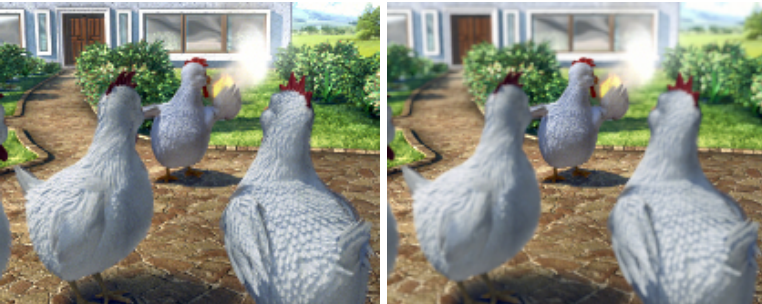


# Real-Time Screen Space Cloud Lighting

## 1. 介绍

实时渲染**美丽的云**是非常具有挑战性的，因为云表现出**多种散射**，很难在保持**交互式帧率**的同时进行计算。大多数游戏无法承担计算**物理上正确的云**的计算成本。本章介绍了一种极其简单的**屏幕空间技术**，用于实时渲染可信的云。这项技术已经在`PS3`上实现，并在游戏*《神秘海域》*中使用。

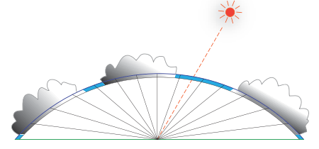

这项技术并不注重**严格的物理精度**，而是依赖于**重现云的经验外观**。这种技术**适用于地面场景**，玩家停留在地面上，只能**从远处观看云层**。`Lighting`是创造美丽和真实的云的最重要的方面之一。当太阳光穿过云层时，它被云层颗粒**吸收、散射和反射**。当从上图中所示视角看云时，**离太阳最近的云显得最亮**。这种现象是由于太阳光到达**云的背面部分**，然后通过**多次散射事件**，重新出现在**云的正面部分**（离观看者最近）。这一观察是本章技术的**一个关键部分**。为了重现这一**视觉线索**，在屏幕空间中进行**简单的点状模糊**或**方向性模糊**，就足以**模仿光线通过云层的散射**。


## 2. 实现

我们的**云渲染技术分三次执行**。首先，**云的密度**（还有阴影项）被渲染到一个`RT`。**云的密度是一个标量值**，可以由艺术家来绘制。接下来，**密度图被模糊化**。最后，**模糊的密度图被用来渲染具有散射外观的云**。

### Lighting

当光线穿过云层时，它被云层中的颗粒**衰减和散射**。在云层上的某一点，有直接**从太阳**到达的**入射光**，也有通过**一次或多次反弹**到达该点的**散射光**。到达云层上某一点的光有的被吸收，有的被散射到云层深处，最后出现在另一侧（离观众最近的一侧）。对**云的照明**涉及到计算**沿照明射线穿过云的光量**。[Mitchell 07]通过对从观看者到光源的光线进行采样求和，估计每个像素点的光源被遮挡的概率。我们将**云粒子**视为**透明的遮挡物**，并将**透明度**考虑在内。

在照明过程中，我们计算在云层上的每个像素点**通过云粒子的光量**。云层将在第`2.2`节描述。我们使用一个**密度图**来表示每个像素上的**云的密度**。在**第一遍渲染的密度图**对**太阳的位置**是模糊的。

**太阳的位置**是通过**透视变换**太阳在每个像素处的**光线方向矢量**而得到的。注意，==如果光线与视图光线$V$垂直，模糊就会变得有方向性==，而当**太阳**在**视图位置**$Pos_{camera}$后面时，模糊的方向应该是**倒置的**。请参考[Kozlov 04]关于透视变换方向性矢量的详细讨论。

对模糊有几个要求。**模糊的权重**根据与太阳的距离而**下降**，因为**远处的粒子受内散射的影响较小**。另外，模糊的长度或强度应该根据**世界空间的距离**进行调整。示例代码见清单1：

[list 1]()  （这个着色器可以通过适当地设置`SCALE`和`OFFSET`常量来提供**平行或点状模糊**）

```c++
// Pixel shader input 
struct SPSInput { 
    float2 vUV : TEXCOORD0;
	float3 vWorldDir : TEXCOORD1; 
    float2 vScreenPos : VPOS;
}; 

// Pixel shader 
float4 main( SPSInput Input ) 
{ 
    // compute direction of blur. 
    float2 vUVMove = Input.vScreenPos * SCALE + OFFSET;
    
    // Scale blur vector considering distance from camera. 
    float3 vcDir = normalize(Input.vWorldDir); 
    float fDistance = GetDistanceFromDir(vcDir); 
    vUVMove *= UV_SCALE / fDistance;
    
    // Limit blur vector length. 
    float2 fRatio = abs( vUVMove / MAX_LENGTH ); 
    float fMaxLen = max(fRatio.x, fRatio.y); 
    vUVMove *= fMaxLen > 1.0f ? 1.0f / fMaxLen : 1.0f;
    
    // Compute offset for weight. 
    // FALLOFF must be negative so that far pixels affect less.
    float fExpScale = dot(vUVMove ,vUVMove) * FALLOFF;
    
    float fShadow = tex2D(sDensity, Input.vUV).a; 
    float fWeightSum = 1.0f; 
    for ( int i = 1; i < FILTER_RADIUS; ++i ) { 
        float fWeight = exp(fExpScale * i); 
        fShadow += fWeight * tex2D(sDensity, Input.vUV + vUVMove * i).a;
        fWeightSum += fWeight;
    } 
    
    fShadow /= fWeightSum;
    
    // 0 means no shadow and 1 means all shadowed pixel. 
    return fShadow;
}
```

### 离天空和云层的距离

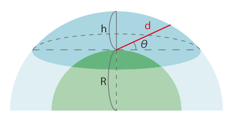

我们在最后一个`pass`将**天空**渲染成一个**屏幕四边形**。在像素着色器中，**屏幕位置**被反向投射到**世界方向**，并被用来计算**光线穿过大气层的距离**。这个距离被用来**估计散射的数量**。当玩家站在地面上时，**大气层的体积**可以把它想象成**被一个平面切割的球体的一部分**。显然，当太阳在地平线上时，光线必须比太阳直接在头顶上时走得更远才能到达观看者。光线穿过大气层的距离`d`是：

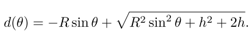

复用这个公式，但带入**云层的高度**$h^/$，可以获得**离云层的距离**。

### 散射

在最后一个`pass`，天空、云层和所有其他几何体都使用[Hoffman and Preetham 02]的**日光散射**进行渲染。这里是方程式：

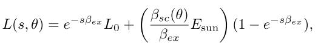

其中，$s$是离视点的距离，$\beta_{ex}$是消光系数，$\beta_{sc}(\theta)$是相位函数，$E_{sun}$是太阳光，$L_o$是来自表面的光。对于太阳，$L_o=0$；对于**云层**，**模糊后的密度图**用来计算$L_o$。我们通过**缩放和添加**一个`ambient`来计算$L_o$。**密度图**也被用来作为**透明度**。

为了使场景更加自然，我们扩展方程：

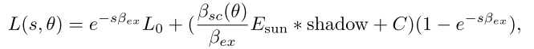

其中，`shadow`是阴影项，表示被云投射的阴影。它在第二个`pass`中使用**不同的衰减参数**进行计算，并存储在`blurred map `的另一个通道中。尽管我们渲染`shadow map`来投射云层的阴影，但在**乌云下的地形**可能会有一个发光的部分，这破坏了自然的外观。因此，**这个阴影项可以有效地使云层下的地面变暗**。术语`C`是一个常数，可以用作**标准的雾参数**，这对艺术家很有用。


## 3. 结果

云被渲染成一个`uniform grid`。一**个云层纹理**包括每个通道的**四个密度纹理**。**每个通道代表不同的云层**，并根据第一个`pass`的天气情况在**像素着色器**中进行混合。它还可以通过**滚动纹理坐标**来实现**动画效果**。

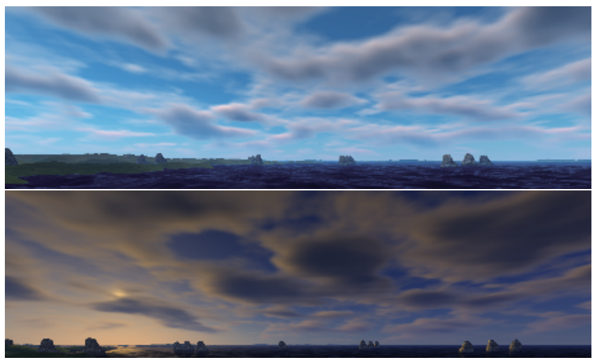

用于模糊的`RT`的大小是**屏幕分辨率的四分之一**，这就足够了，因为云层往往有些虚无缥缈和低频。


## 4. 扩展

//todo


## 5. 总结

我们讨论了一种实时渲染**令人信服的天空**的技术。由于云的形状与照明脱钩**，程序性云的生成和动画是可能的**。我们忽略了大气层的某些物理特性，以创造一个更有效的技术。例如，我们没有考虑大气的密度——为了创造逼真的日落和日出，这一属性是必要的。我们也忽略了**进入云层的光线的颜色**。在一个有日落或日出的场景中，只有靠近太阳的区域应该被照得明亮而有色彩。有必要采取**更多基于物理的方法**来模拟太阳和云层之间的散射，以获得更自然的结果。


## 6. 源码分析

让我们看看源码，做个总结（大佬的代码写的就是好）。首先，我们抛开作者构建的**DX渲染管线**，**以着色器为主线**进行源码分析。

文中的三个`pass`，在代码中实际上是四个`pass`（实际上更多，最后一个`pass`是天空、云层、地面三个渲染`pass`的合并），让我们一个个来看。

:one:首先是`source/Cloud.cpp`中的`pass 1`，正如注释所言，是根据`Cloud.bmp`，获取云层的阴影项，存入`RT`。

> `cloudGrid`负责两个map的生成（网格grid），`cloud`负责模糊和云层的最终渲染（四边形）

```c++
// Pass 1 : Render clouds to a shadow map 
if ( SetRenderTarget( pDev, m_pShadowMap ) ) {
    // Clouds are always far away so shadowmap of clouds does not have to have depth.
    // Only transparency is stored to the shadowmap. 
    pDev->Clear( 0, NULL, D3DCLEAR_TARGET, 0xFFFFFF, 1.0f, 0 );
    if (m_shadowShader.Begin(pDev, &m_grid)) {
        // Since the cloud grid is viewed from outside, reverse cullmode.
        pDev->SetRenderState( D3DRS_CULLMODE, D3DCULL_CW );
        m_grid.Draw( pDev );
        m_shadowShader.End();
        // restore
        pDev->SetRenderState( D3DRS_CULLMODE, D3DCULL_CCW );
    }
```

进入`CloudShadow.hlsl` ， 首先是**顶点着色器**：（坐标系和`Unity`相同，`y`为**向上方向**）

```glsl
//------------------------------------------------
// Vertex shader parameters
//------------------------------------------------
float4x4 mW2C;   // world to projection matrix
float4 vXZParam; // scale and offset for x and z position
float2 vHeight;  // height parameter
float3 vEye;     // view position
float4 vUVParam; // uv scale and offset
void mainVS(out SVSOutput _Output, in SVSInput _Input)
{
	// compute world position
	float4 vWorldPos;
	vWorldPos.xz = _Input.vPos.xy * vXZParam.xy + vXZParam.zw;
	// height is propotional to the square distance in horizontal direction.
	float2 vDir = vEye.xz - vWorldPos.xz;
	float fSqDistance = dot( vDir, vDir );
	vWorldPos.y = fSqDistance * vHeight.x + vHeight.y;
	vWorldPos.w = 1.0f;
	
	// transform and projection
	_Output.vPos = mul( vWorldPos, mW2C);
	
	// texture coordinate 
	_Output.vTex = _Input.vPos.zw * vUVParam.xy + vUVParam.zw;
}

```

这里需要注意的是，这里的坐标处理，是为了最后输出在`RT`的正确位置；然后我们是**以网格为几何体**来渲染这个`pass`，而不是四边形。（为什么不这样做呢？）。关于`vHeight`，我找了一下：

```c++
// Adjust the height so that clouds are always above.
// cloud height = m_fDefaultHeight + m_fFallOffHeight * squaredistance_in_horizontal
FLOAT fRange = 0.5f * pCamera->GetFarClip();
FLOAT fHeight = fRange * 0.12f;
m_fDefaultHeight = fHeight + pCamera->GetEyePt()->y;
m_fFallOffHeight  = - ( 0.1f / fRange ) * (  pCamera->GetEyePt()->y / fHeight + 1.0f );
```

我们实际需要在片元着色器中需要的是`vTex`（缩放和平移过的，产生动画）：（`fCloudCover`是艺术家控制的参数，作为简单的浮点数，控制云层的浓度）

```c++
float4 mainPS(in SPSInput _Input) : COLOR0
{
	float4 clTex = tex2D( sCloud, _Input.vTex );
	
	// blend 4 channel of the cloud texture according to cloud cover 
	float4 vDensity;
	vDensity = abs( fCloudCover - float4( 0.25f, 0.5f, 0.75f, 1.0f ) ) / 0.25f;
	vDensity = saturate( 1.0f - vDensity );
	float _fDensity = dot( clTex, vDensity );

	// 0 : shadowed, 1 : lit 
	return 1.0f-_fDensity;
}
```

:two:第二个`pass`是处理获得密度，和前一个`pass`共同组成了我们文中的第一个`pass`，唯一的区别是​输出，当然这个是符合我们逻辑的，密度越大（density），阴影项越大（这了`0`代表最大阴影，所以是逆序）

```c++
// Pass 2 : Render cloud density 
		if ( SetRenderTarget( pDev, m_pDensityMap ) ) {
			pDev->Clear( 0, NULL, D3DCLEAR_TARGET, 0, 1.0f, 0 );
			if (m_densityShader.Begin(pDev, &m_grid)) {
				m_grid.Draw( pDev );
				m_densityShader.End();
			}
```


```c++
float4 mainPS(in SPSInput _Input) : COLOR0
{
	float4 clTex = tex2D( sCloud, _Input.vTex );
	
	// blend 4 channel of the cloud texture according to cloud cover 
	float4 vDensity;
	vDensity = abs( fCloudCover - float4( 0.25f, 0.5f, 0.75f, 1.0f ) ) / 0.25f;
	vDensity = saturate( 1.0f - vDensity );
	float _fDensity = dot( clTex, vDensity );
	return _fDensity;
}
```

:three:第三个`pass`（文中的第二个`pass`），​紧接着而来，主要是对模糊**上一步的密度图**：

```c
// Pass 3 : Blur the density map
if ( SetRenderTarget( pDev, m_pBlurredMap ) ) {
    m_blur.Blur( pDev, m_pDensityMap );
}
```

流程大体上就是**文中的清单代码**，不过**变量命名**不太一致：

```glsl
float4 mainPS(in SPSInput _Input) : COLOR0
{
	// compute ray direction 
	float3 _vWorldPos = _Input.vWorldPos.xyz/_Input.vWorldPos.w;
	float3 _vRay = _vWorldPos - vEye;	
	float _fSqDistance = dot( _vRay, _vRay );
	_vRay = normalize( _vRay );

	// compute distance the light passes through the atmosphere.	
	float _fSin = _vRay.y;
	float _fRSin = vParam.x * _fSin;
	float _fDistance = sqrt( _fRSin * _fRSin + vParam.y ) - _fRSin;

	// Compute UV offset.
	float2 _vUVOffset = _Input.vTex.zw / FILTER_WIDTH * (vParam.z / _fDistance);

	// limit blur vector
	float2 _len = abs( _vUVOffset * invMax );
	float _over = max( _len.x, _len.y );
	float _scale = _over > 1.0f ? 1.0f/_over : 1.0f;
	_vUVOffset.xy *= _scale;

	// scale parameter of exponential weight
	float4 _distance;
	_distance = dot( _vUVOffset.xy, _vUVOffset.xy );
	_distance *= vFallOff;

	// blur 
	float2 _uv = _Input.vTex.xy;
	float4 _clOut = tex2D( sDensity, _uv );
	float4 _fWeightSum = 1.0f;
	for ( int i = 1; i < FILTER_WIDTH; ++i ) {
		float4 _weight = exp( _distance * i );
		_fWeightSum += _weight;
		
		float2 _vMove = _vUVOffset * i;		
		float4 _clDensity = tex2D( sDensity, _uv + _vMove );
		_clOut += _weight * _clDensity;
	}
	_clOut /= _fWeightSum;

	return _clOut;
}
```

:four:最后一个就是场景绘制的各个`pass`，注意，**我们绘制云时开启了透明度混合**，

```c++
// Clear the render target and the zbuffer 
V( pd3dDevice->Clear( 0, NULL, D3DCLEAR_TARGET | D3DCLEAR_ZBUFFER, D3DCOLOR_ARGB( 0, 45, 50, 170 ), 1.0f, 0 ) );

// Draw Ground 
g_Ground.Draw( pd3dDevice );

// Draw sky plane 
g_skyPlane.Draw( pd3dDevice );

// Draw clouds 
pd3dDevice->SetRenderState(D3DRS_ALPHABLENDENABLE, TRUE);
pd3dDevice->SetRenderState(D3DRS_ALPHATESTENABLE, TRUE);
pd3dDevice->SetRenderState(D3DRS_SRCBLEND, D3DBLEND_SRCALPHA);
pd3dDevice->SetRenderState(D3DRS_DESTBLEND, D3DBLEND_INVSRCALPHA);

g_cloud.DrawFinalQuad( pd3dDevice );
```

天空最简单，因为$L_o=0$：

```c++
float4 mainPS(in SPSInput _Input) : COLOR0
{
	// ray direction 
	float3 _vWorldPos = _Input.vWorldPos.xyz/_Input.vWorldPos.w;
	float3 _vRay = _vWorldPos - vEye;	
	float _fSqDistance = dot( _vRay, _vRay );
	_vRay = normalize( _vRay );

	// calcurating in-scattering 	
	float _fVL = dot( litDir, -_vRay );
	float fG = scat[1].w + scat[0].w * _fVL;
	fG = rsqrt( fG );
	fG = fG*fG*fG;
	float3 _vMie = scat[1].rgb * fG;
	float3 _vRayleigh = scat[0].rgb*(1.0f + _fVL*_fVL);
	float3 _vInscattering = scat[2] * (_vMie + _vRayleigh) + scat[4].rgb;
	
	// compute distance the light passes through the atmosphere
	float _fSin = _vRay.y;
	float _fRSin = scat[2].w * _fSin;
	float _fDistance = sqrt( _fRSin * _fRSin + scat[3].w ) - _fRSin;
	
	float3 fRatio = exp( -scat[3].rgb * _fDistance );	
	float4 _color;
	_color.rgb = (1.0f-fRatio) *_vInscattering;
	_color.a = 1.0f;

	return _color;
}
```

然后云层的$L_0$比较特殊：

```c++
float3 ApplyScattering( float3 _clInput, float3 _vRay )
{
	// calcurating in-scattering 	
	float _fVL = dot( litDir, -_vRay );
	float fG = scat[1].w + scat[0].w * _fVL;
	fG = rsqrt( fG );
	fG = fG*fG*fG;
	float3 _vMie = scat[1].rgb * fG;
	float3 _vRayleigh = scat[0].rgb*(1.0f + _fVL*_fVL);
	float3 _vInscattering = scat[2] * (_vMie + _vRayleigh) + scat[4].rgb;
	
	// compute distance to the cloud
	float _fSin = _vRay.y;
	float _fRSin = vDistance.x * _fSin;
	float _fDistance = sqrt( _fRSin * _fRSin + vDistance.y ) - _fRSin;
			
	float3 fRatio = exp( -scat[3].rgb * _fDistance );		
	return lerp( _vInscattering, _clInput, fRatio );
}


float4 mainPS(in SPSInput _Input) : COLOR0
{
	float4 _clDensity = tex2D( sDensity, _Input.vTex.xy );
	float4 _clLit     = 1.0f - tex2D( sLit, _Input.vTex.xy );

	// light cloud   这就是那个特殊的Fo
	float3 _clCloud = cAmb + cLit * _clLit.r;
	
	// compute ray direction	
	float3 _vWorldPos = _Input.vWorldPos.xyz/_Input.vWorldPos.w;
	float3 _vRay = _vWorldPos - vEye;	
	float _fSqDistance = dot( _vRay, _vRay );
	_vRay = normalize( _vRay );
		
	// apply scattering 
	float4 _color;
	_color.rgb = ApplyScattering( _clCloud, _vRay );
	_color.rgb = saturate(_color.rgb);
	_color.a = _clDensity.a;

	return _color;
```

关于地形的`pass`，基本类似，但要使用`shadow map`，所以需要传入对于的坐标变换矩阵。

```c++
// shadowmap position
_Output.vShadowPos = mul( _Input.vPos, mL2S);
...
// Cloud shadow is not depth but transparency of shadow.
float4 _clShadow = tex2D( sShadow, _Input.vShadowPos.xy/_Input.vShadowPos.w );
```

:five:最终结果：

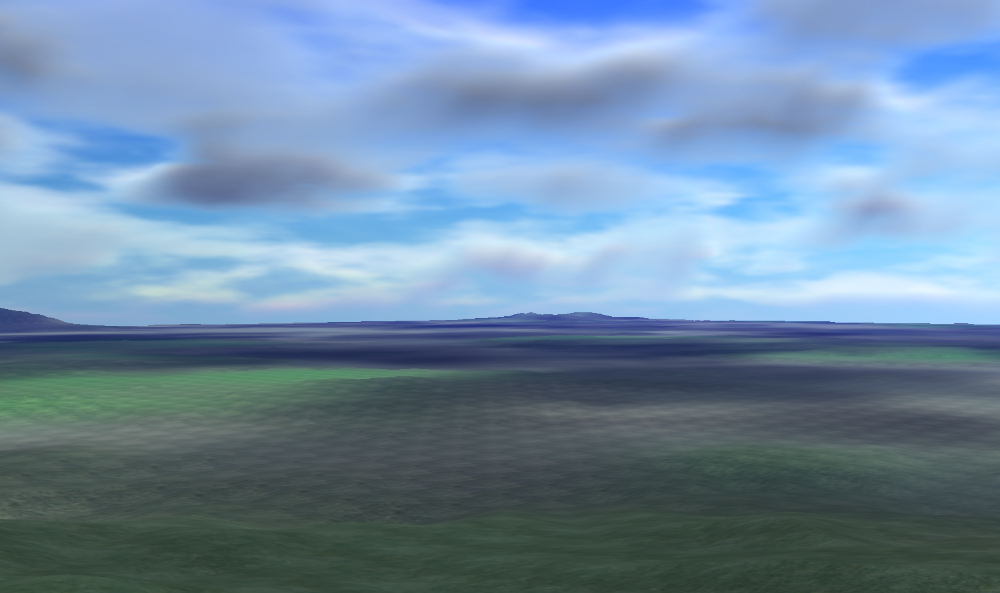

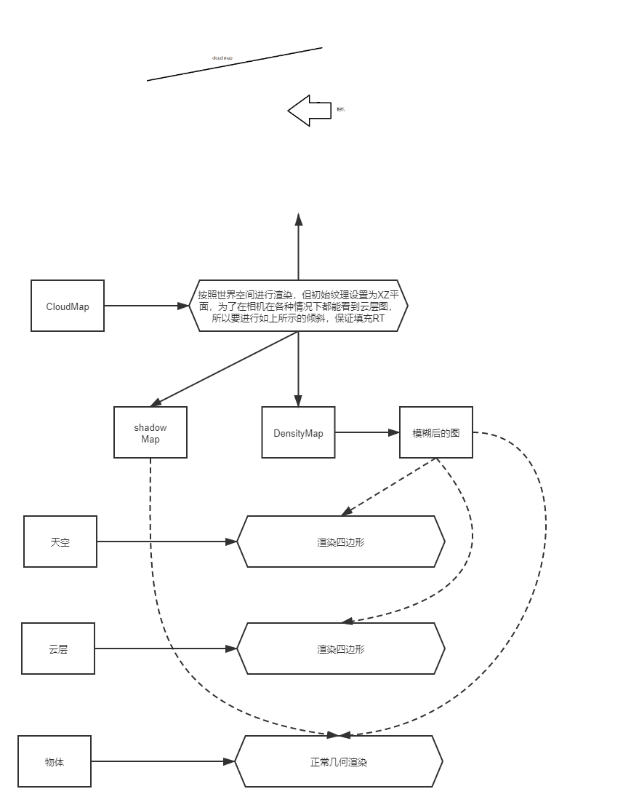


