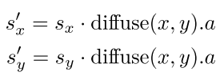

[toc]


# Screen-Space Subsurface Scattering


## 1. 介绍

我们提出了一种能够在**屏幕空间**模拟**次表面散射**的算法，作为一个**后处理过程**，该算法将渲染帧的`depth-stencil`和`color buffer`作为输入。


## 2. 纹理空间方法

### 次表面散射和扩散曲线

**均匀的次表面散射**可以通过使用称为**扩散曲线**的**一维函数**来近似。**扩散曲线**定义了**光在物体表面下传播时的衰减情况**，或者换句话说，它描述了**光强度**$R(r)$如何作为**入射点**$r$的**径向距离函数**而衰减。如下图所示，**大部分光强**在靠近入射点的地方，当它与**物体的内部结构**相互作用后**迅速衰减**，然后通过表面出射。


### 辐照度纹理

应用**扩散曲线**意味着计算表面每一点的入射点和相邻点的辐照度，这导致了计算的浪费。为了进行有效的`profile`计算，创建了一个**辐照度贴图**——也被称为光照贴图`light map`——它存储了**表面每一点的入射光线**，并作为`light cache`，在这个意义上，它使你能够**计算每一点的光照度一次**，**但多次使用该值**。（下图左）


### 高斯和抖动核

一旦计算出**辐照度图**，应用`profile`就只需要对该图进行**二维卷积**即可。以前有几项工作对**如何有效地执行这种卷积**提供了详细的见解，都是针对**皮肤渲染的具体情况**。

d'Eon采用的方法包括用**高斯之和**来逼近这个**冗长的二维卷积**，它可以被分成**更快的一维卷积**。总而言之，使用这种**高斯和**渲染**次表面散射**包括以下步骤：

- 渲染辐照度图。
- 用**六个高斯**对辐照度图进行**模糊处理**。
- 渲染场景，计算**六个高斯的加权和**，这将近似于原始`diffusion profile`。

在渲染**辐照度图**时（以及在**接下来的模糊**中），会**失去**`2`个本来由**GPU隐含执行的优化**，即**背面剔除**和**视锥体剔除**。Jimenez提出的渲染管道中**重新引入了这两项优化**。他们还根据一个简单的、基于深度的方法，对每个物体的**辐照度图大小**进行了**优化调制**。

### 纹理空间的问题

目前的**实时次表面散射算法**依赖于**纹理空间方法**，它有一些**内在的问题**，可以通过在**屏幕空间**工作来轻松解决。我们概述了其中**最重要的问题**：（具体分析见书）

- 需要额外措施，来带回GPU优化
- 每一个要渲染的对象都需要自己的辐照度图。
- 渲染**大量具有次表面散射的物体**并不高效。
- **辐照度图**强制对模型顶点进行**两次转换**。
- 光照通常要计算两次。
- 纹理空间，尚不知道如何利用`early z`优化
- 世界空间中的相邻点在纹理空间中可能并不相邻。显然，这将在纹理空间的`diffusion`中引入误差（在屏幕空间中自然避免）。


## 3. 屏幕空间方法

### 大纹理

我们的算法将`diffusion`近似的计算从**纹理空间**转换到**屏幕空间**。我们**不需要计算辐照度图**并将其与`diffusion profile`进行**卷积**，而是**直接将卷积应用于最终确定的图像**。下图显示了算法的概况。


由于**次表面散射**应该只应用于渲染方程的**漫反射分量**，我们可以**分别存储**漫反射和镜面反射成分，为此我们可以使用多个`RT`或**主渲染目标的alpha通道**。然而，我们发现，**将次表面散射同时应用于漫反射和镜面反射分量会产生非常吸引人的效果**，因为：

- **镜面反射分量被软化**，创造了一个更自然的外观，**减少了明显的锯齿**；
- 它为**镜面反射的高光部分**创造了漂亮的`bloom`效果。

为了有效地**屏蔽**掉不需要处理的**像素**，我们使用**模板缓冲区**。这极大地提高了物体远离摄像机时的性能，因此在屏幕空间中占据了很小的面积。

我们的算法也需要**线性深度信息**，我们将其渲染到一个**额外的渲染目标**中。我们把这个深度和`depth stencil buffe`一起使用，用于执行**模板测试**和**基于深度的高斯`LOD`**。我们可以**直接访问深度缓冲区**，但是我们不能同时使用**同一个深度缓冲区**作为输入纹理和`depth stencil buffer`，所以我们必须**创建一个副本**。

有了`depth-stencil`信息的输入，我们就可以将`diffusion profile`直接应用到**最终渲染的图像**上。对于皮肤渲染，我们使用==四高斯拟合的三层皮肤模型==，定义于[d'Eon and Luebke 07]（详见第`3.3`节），并且将它们各自作为**两个分离的一维卷积**（**水平和垂直模糊**）进行。在屏幕空间中，我们需要**考虑到以下因素**：

- **远离摄像机的像素**需要比靠近摄像机的像素**更窄的内核宽度**。

- **与相机成陡峭角度的像素也需要更窄的核**。

由此，我们可以得到**拉伸系数**`stretch factors`：


其中，$d(x,y)$是**像素的深度**（`depth map`中的），`ssslevel `表示图像中的**全局次表层散射水平**，`correction`调节**该次表层散射随深度梯度的变化**，`maxdd `限制**导数的影响**。**这种导数限制**对于**非常柔软的材料**（如大理石）是**必需的**，因为在**非常特殊的照明条件**下，在**深度不连续处**可能会出现**微妙的伪影**。这些假象是由在这些地方的**巨大导数引起的**，它在局部上抵消了次表面散射的影响。这种**拉伸**`stretching`类似于**纹理空间算法**中进行的**UV拉伸**。

然后将**拉伸系数**乘以**每个高斯的宽度**，以获得最终的**内核宽度**：


在物体的**剪影边缘处**，**导数将非常大**，这意味着**内核将非常窄**，从而**限制了背景像素渗入`bleeding`物体的像素**。`ssslevel`的值受**物体在三维空间中的尺寸**、用于渲染场景的**视场和视口尺寸**的影响，而`maxdd`只取决于**物体的尺寸**。本章中的图像使用的固定值是$sslevel=31.5,correction=800,maxdd=0.001$；这些值是根据经验选择的。

下列清单显示了水平模糊的情况。我们的次表面散射方法只需要两个`pass`，一个用于水平模糊，另一个用于垂直模糊。

[list 1]()

```c++
float width; 
float sssLevel, correction, maxdd; 
float2 pixelSize; 
Texture2D colorTex, depthTex;

float4 BlurPS(PassV2P input) : SV_TARGET 
{ 
    float w[7] = { 0.006, 0.061 , 0.242 , 0.382 , 0.242 , 0.061, 0.006 };
    
    float depth = depthTex.Sample(PointSampler, input.texcoord).r;
    float2 s_x = sssLevel / (depth + correction * min(abs(ddx(depth)), maxdd ));
    float2 finalWidth = s_x * width * pixelSize * float2 (1.0, 0.0);
    
    float2 offset = input.texcoord - finalWidth; 
    float4 color = float4 (0.0, 0.0, 0.0, 1.0); 
    for (int i = 0; i < 7; i++) 
    { 
        float3 tap = colorTex.Sample(LinearSampler, offset).rgb; 
        color.rgb += w[i] * tap; 
        offset += finalWidth / 3.0;
    }
    
    return color;
}
```

人物的某些区域，如**头发或胡须**，应该**从这些计算中排除**。因此我们可能希望在这些地方**局部禁用次表面散射**。为此，我们可以使用**漫反射纹理**的`alpha`通道来调节这个**局部次表面散射水平**。在主渲染过程中，我们需要将这个纹理的`alpha`通道存储到**主渲染目标**的`alpha`通道中。然后，在我们的后期处理过程中，我们将使用以下**修改后的拉伸因子**：



接下来是我们算法的**两个关键优化**。

### 基于深度的高斯LOD

在屏幕空间进行`diffusion`，可以让我们在**远离模型的过程**中以像素为单位**禁用高斯**。窄高斯对远离相机的像素影响不大，因为**大部分样本都会落在同一个像素上**。我们可以利用这一点来节省计算量。为此，我们使用以下**不等式**（基于上一节的**最终内核宽度**，假设摄像机面对的多边形具有**零值的导数**）：


如果当前像素的**内核宽度**小于`0.5`，我们可以**跳过**这个像素的**模糊处理**。我们可以使用**深度测试**来有效地**实现这一优化**。对于d(x, y)：


那么我们只需要在**深度值**为$2\cdot width \cdot ssslevel$时渲染用于**执行卷积的四边形**，并将**深度测试函数**配置为==大于==。然而，我们发现，使用$0.5\cdot width \cdot ssslevel$反而可以**更快地禁用**，而**没有任何明显的弹出**。

虽然我们有一份**线性空间**的`depth-stencil buffer`的复制，但出于**精度问题**，原始`depth-stencil buffer `被保留在**非线性空间**。这意味着我们必须将**不等式的左边**转化为**同样的非线性空间**，并将产生的**非线性深度值**钳制在$[0,1]$。

### Alpha混合工作流

使用**n个高斯**来逼近`diffusion profile`意味着我们需要`n`个`RT`来存储**辐照度**。为了尽可能地**减少内存占用**，我们在**运行过程**中积累**高斯和**，而不需要在最后一个`pass`中对它们进行求和·。为了完成这一任务，我们需要两个额外的`RT`。


第一个渲染目标用于存储迄今为止计算出的**最宽的高斯**（RT1），第二个用于通常的渲染目标`ping ponging`（RT2）。包括两个步骤：

- 对`RT2`进行**水平高斯模糊处理**。
- 通过从水平模糊的`RT2`中取，执行**垂直高斯模糊**，并使用**多个渲染目标**（`MRT`）输出到`RT1`和`RTF`（**最终渲染目标**）。对于`RTF`，我们使用一个**alpha混合操作**。**混合操作所需的确切权重**将在下面的段落中进行研究。

我们需要对**n个高斯**进行求和，如下所示：


其中，$w_i$是权重向量（RGB通道各不相同）。`k`是第一个其宽度足以对最终图像产生明显的影响的高斯。由于我们**可能不会计算所有的高斯**，我们需要找到一组值$w_i^/$，它将在前面的每一步`i`产生一个**归一化的结果**：


然后我们只需要配置**阿尔法混合**，使用混合系数，如下所示：


其中，$blendFactor=w_i$。下列清单：

[list 2]()

```c++
BlendState BlendingAccum { 
    BlendEnable [0] = FALSE; // RT2 
    BlendEnable [1] = TRUE; // RTF 
    SrcBlend = BLEND_FACTOR; 
    DestBlend = INV_BLEND_FACTOR;
};
```

**下表**显示了皮肤和大理石**四高斯拟合的原始权重** ($w_i$)，以及我们的屏幕空间方法所使用的**修正权重**（$w_i^/$).  在皮肤的情况下，**第一个高斯太窄而不明显**。因此，我们使用了**未模糊的原始图像**，从而节省了一个高斯的计算。请注意，两个拟合的第一个高斯的权重都是`1.0`；原因是第一个高斯不需要与之前的混合高斯混合。

请注意，由于我们是在**前一个高斯的基础**上进行的，我们必须**减去前一个高斯的方差来得到实际方差**。例如，对于皮肤拟合中**最宽的高斯**，我们会有$2.0062-0.2719=1.7343$。请记住，**上诉清单**中显示的应该传递给着色器的**宽度**是**标准差**，因此在这种情况下，它应该是$\sqrt{1.7343}$。


### 抗锯齿和Antialiasing and Depth-Stencil

出于效率的考虑，在使用`MSAA`时，我们可能希望使用**已解决的渲染目标**（`downsampled`到`MSAA 1x`）来执行**所有的后期处理**，以**节省内存带宽**。然而，这意味着我们不能使用**原始的MSAA模版缓冲区**来执行`depth-based blur modulation or the stenciling`。

我们探索了两种方法来解决这个问题：

- 使用**动态分支**来进行`stenciling`
-  对`depth-stencil buffe`进行降采样，以便能够使用`hardware stenciling`

这两种方法都依赖于在主`pass`中生成**包含深度和模版值的多样本渲染目标**，为此可以使用多个渲染目标。我们发现，使用用`hardware stenciling`的方法优于**动态分支**的方法。


## 4. 模型准备

大多数艺术家通常采用的方法是**使法线比物理上的要软得多**。当使用**次表面散射**进行渲染时，最好的结果是使用**更粗糙的法线**，因为**次表面散射将负责软化光照**。


## 5. 结果

//todo


## 6. 总结

我们提出了一种高效的算法，能够在屏幕空间中渲染**真实的次表面散射**。这种方法减少了**缓冲区管理**和艺术家的努力。当物体处于**中等距离**时，它的**性能**与Hable等人的方法**相似**，并且随着物体数量的增加，其**扩展性更好**。我们的方法能更好地适用于其他材料。在特写镜头下，它确实失去了一些性能以换取质量，但它能够保持原始d'Eon方法的肉感。然而，在这样的特写镜头下，玩家很有可能会**密切关注角色的脸部**，所以我们认为为了以最好的质量来渲染角色的皮肤，**花费额外的资源是值得的**。我们相信，我们的**次表面散射算法的实现非常简单**，要求不多，并在性能、通用性和质量之间取得了**良好的平衡**。


# The Skylanders SWAP Force Depth-of-Field Shader


## 1. 介绍

本章介绍了**Vicarious Visions公司**在生产中使用的**景深（`DoF`）着色器**。摄影师认识到，**焦外物体上的每个点都会模糊成相机光圈的形状，这通常是一个圆盘、八边形或六边形**。他们把一个**模糊点的边界圆**称为该点的==混乱圈==（`CoC`）。当`CoC`的半径为**半个像素或更小**的时候，一个**物体是在焦点上**（对于数字图像）。摄影师将`CoC`半径**小于半个像素的深度范围称为焦点区域**。他们把这个范围称为==景深==。

**DoF产生的原因**是相机镜头上的**每一个点**都有轻微不同的`viewpoint`，而**最终的图像**是由所有这些`viewpoint`的图像合成的。既然**目标是模糊图像的一部分**，我们就**不需要渲染一个完美的结果**。对一个典型的画面有**选择地应用一些后处理的模糊过滤器**应该就足够了。像其他许多游戏引擎一样，我们的引擎也采用了这种方法。


我们区分了三个深度范围：**远场**，物体因距离太远而模糊；**焦点场**，物体在焦点内；**近场**，物体因离摄像机太近而模糊。**后处理DoF着色器**本质上是一个**具有空间变化内核的模糊滤波器**。内核的变化方式带来了==三个挑战==：

- 首先，与典型的**高斯或盒式模糊**不同，**DoF模糊必须考虑深度边缘**。例如，这种效果不应该让一个**模糊的远处物体**渗入一个**较近的清晰物体**。最关键的是要保留`occlusion`的**远-焦-近的顺序**。然而，一个领域内相邻物体的图像的**不正确模糊**往往是无法察觉的。
- 其次，在防止`bleeding`时，效果也**不能在近场的模糊物体上产生尖锐的剪影**。这些尖锐的剪影是**以前的方法**中主要的**视觉伪影**。
- 第三，在不影响性能的情况下，**前景物体**必须能够模糊足够宽（最多为**屏幕宽度的10%**）。旧有方法需要对**模糊半径**`r`进行$O(r^2)$操作，并且会破坏纹理$/L1$缓存。

我们引擎中的**DoF后处理**是快速的，并能产生**高质量的近场和远场模糊**，而且几乎**没有可察觉的颜色渗漏**。它读取一个**带有特别编码的$\alpha$通道的颜色缓冲区**，并在**不同大小的缓冲区**上通过三个 "全屏 "2D`passes`产生令人信服的**DoF效果**。

我们对以前的方法的改进部分是

- **单独处理近场**，在近场产生**模糊的剪影**

- 在**模糊的近场物体**后面进行绘画，

- **选择性的背景模糊内核**，

- 使用`CoC`而不是深度，来同时解决`occlusion`和模糊问题，

- 用双渲染目标**并行处理多个模糊**。

  

## 2. 算法

下图显示了我们算法的结构。输入是一个**颜色缓冲区**，其（经过缩放和偏置的）**带符号的CoC半径**存储在**alpha通道**中。在典型的**分离式模糊模式**中，先进行**两次水平方向的模糊处理**，然后进行**垂直方向的模糊处理**，最后**将模糊的图像与清晰的输入进行合成**。每个模糊`pass`处理**两个纹理**：一个代表**焦点和远场**，一个代表**近场的物体**（有一个**alpha通道**用于**覆盖**）


### 输入

**颜色输入缓冲区**的**alpha通道**中的半径是**有符号的**，这意味着：**像素的半径**`r`在$[-maximum blur，+maximum blur]$的范围内，**远场物体有一个负的半径**，**近场物体有一个正的半径**，$0.5 < r < 0.5$在**焦点区域**。在一个物理上正确的**CoC模型**下，这个**有符号的半径**自然产生。它模拟了一个事实，即**光圈的轮廓**在远场**出现倒置**。. 这种反转对于我们**所模拟的光圈**来说是**无关紧要的**，但我们依赖**带符号的半径**是出于另一个原因：**有符号的半径随深度单调下降**，所以如果$r_A<r_B$，那么`A`点比`B`点更接近相机。因此，每个像素的**单一有符号的半径值**避免了用单独的值来编码一个点的视野、半径和深度。


我们支持**两种方法**来计算**有符号半径**。第一种是从上图得出的**物理上正确的模型**。假设`a`是镜头的半径，$z_F<0$是**聚焦面的深度**，`R`是**世界空间（相对于屏幕空间）的半径**。通过相似三角形，在深度为`z`的点的屏**幕空间半径r**为：


**比例常数**取决于**屏幕分辨率和视场**。我们的艺术团队认为，这种物理模型对他们**试图指导的特定类型的镜头**的控制力很差。他们**更喜欢第二种模式**，即艺术家**手动放置四个平面**（**近模糊、近清晰、远清晰、远模糊**）。对于**近模糊和远模糊的平面**，艺术家们**明确指定CoC半径**。在**近清晰和远清晰的平面**上，**半径为1/2像素**。然后，**平面之间深度的CoC被线性内插**。范围之外半径被`clamp`在这些平面的数值上。

### Blur Passes

这两个模糊`pass`彼此相似。每一个都读取一个固定长度的`adjacent samples`集，无论是水平还是垂直的，并计算两个加权和。代码的关键外循环部分显示如下：

[list 1]()

```c++
#if HORIZONTAL
	const int2 direction = int2(1, 0);
#else
	const int2 direction = int2(0, 1);

...
// Accumulates the blurry image color 
blurResult.rgb = float3 (0.0f); 
float blurWeightSum = 0.0f;

// Accumulates the near -field color and coverage 
nearResult = float4 (0.0f); 
float nearWeightSum = 0.0f;

// Location of the central filter tap (i.e., "this" pixel’s location) 
// Account for the scaling down by 50% during blur 
int2 A = int2(gl_FragCoord.xy) * (direction + ivec2 (1));
float packedA = texelFetch(blurSourceBuffer, A, 0).a; 
float r_A = (packedA * 2.0 - 1.0) * maxCoCRadiusPixels;

// Map large negative r_A to 0.0 and large positive r_A to 1.0 
float nearFieldness_A = saturate(r_A * 4.0);

for (int delta = -maxCoCRadiusPixels; delta <= maxCoCRadiusPixels; ++delta) 
{
    // Tap location near A
    int2 B = A + (direction * delta);
    
    // Packed values 
    float4 blurInput = texelFetch(blurSourceBuffer, clamp(B, int2(0), textureSize(blurSourceBuffer, 0) - int2(1)), 0);
    
    // Signed kernel radius at this tap , in pixels
    float r_B = (blurInput.a * 2.0 - 1.0) * float(maxCoCRadiusPixels);
    // [Compute blurry buffer] ... 
    // [Compute near -field super blurry buffer and coverage] ....
}

blurResult.a = packedA; 
blurResult.rgb /= blurWeightSum; 
nearResult /= nearWeightSum;
```

两个**模糊的内核部分**的细节如下。也请看我们的演示源代码，它包含了大量的注释，解释了优化和替代实施。让`A`是内核的中心样本，`B`是一个附近的样本（注意$B=A$包括在我们考虑的样本集合中）。 我们按以下方式计算样本B的权重：

```c++
if A is in the near field: 
	// Inpaint behind A using some arbitrary constant weight k ≈ 1. 
	wB = k
else if B is not in the near field: 
	// Obey occlusion; note that both r values are always negative in 
	// this case.
	wB = max(0, min(1, |rA − rB + 1.5|))· Gaussian (BA)
else:
	// Avoid divide -by -zero if every sample pair hits this case. 
	wB = ε
```

在实践中，我们通过用`lerps`实现分支来**平滑过渡**。我们的演示源代码中`VVDoF blur.glsl`的相关部分是

```c++
float weight = 0.0;
float wNormal = 
    // Only consider mid - or background pixels (allows inpainting of the 
    // near field). 
    float (! inNearField(r_B)) *
    
	// Only blur B over A if B is closer to the viewer (allow 0.5 pixels 
    // of slop and smooth the transition ). 
    saturate(abs(r_A) - abs(r_B) + 1.5) *
    
	// Stretch the Gaussian extent to the radius at pixel B.
    gaussian[clamp(int(float(abs(delta) * (GAUSSIAN_TAPS - 1)) / (0.001 + abs(r_B * 0.5))) , 0, GAUSSIAN_TAPS )];

weight = lerp(wNormal, 1.0, nearFieldness_A ); 
// far - + mid -field output b
lurWeightSum += weight; 
blurResult.rgb += blurInput.rgb * weight;
```

我们计算出水平`pass`中独立的**近场缓冲区**的覆盖值（$\alpha$）为：


```c++
float4 nearInput; 
#if HORIZONTAL 
	nearInput.a = float(abs(delta) <= r_B) * saturate(r_B * invNearBlurRadiusPixels * 4.0);
	nearInput.a *= nearInput.a;
	nearInput.a *= nearInput.a;
	// Compute premultiplied -alpha color. 
	nearInput.rgb = blurInput.rgb * nearInput.a;

#else 
    // On the second pass , use the already -available alpha values. 
    nearInput = texelFetch(nearSourceBuffer, clamp(B, int2(0), textureSize(nearSourceBuffer , 0) - int2 (1)), 0);

#endif 
    weight = float(abs(delta) < nearBlurRadiusPixels ); 
    nearResult += nearInput * weight; 
    nearWeightSum += weight;
}
```

我们根据经验调整了这一**覆盖率下降曲线**，以便在**近场极度模糊**时提供**良好的覆盖率**，并平稳地消退到**焦点场**。例如，在图8.5中，**近场的失焦栅栏必须有足够的覆盖率，以便在大范围内涂抹白色像素**，而我们仍然希望**进入聚焦场的过渡**看起来像逐渐聚焦，而不是简单地在单独的模糊和清晰的图像之间徘徊。这对**后处理DoF算法**来说是一个极其困难的情况，以前的实时方法不能很好地处理。

**近场缓冲区**预先乘以alpha值，被写入颜色通道，在随后的**垂直通道**中，**颜色和阿尔法都被模糊化了**。

```c++
// -*- c++ -*-
/**
 \file VVDoF_blur.glsl

 Computes the near field blur.  This is included by both the horizontal
 (first) and vertical (second) passes.

 The shader produces two outputs:

 * blurResult

   A buffer that is the scene blurred with a spatially varying Gaussian
   kernel that attempts to make the point-spread function at each pixel
   equal to its circle of confusion radius.

   blurResult.rgb = color
   blurResult.a   = normalized coc radius

 * nearResult

   A buffer that contains only near field, blurred with premultiplied
   alpha.  The point spread function is a fixed RADIUS in this region.

   nearResult.rgb = coverage * color
   nearResult.a   = coverage

 */
#include "compatability.glsl"
#line 30

/** Maximum blur radius for any point in the scene, in pixels.  Used to
    reconstruct the CoC radius from the normalized CoC radius. */
uniform int         maxCoCRadiusPixels;

/** Source image in RGB, normalized CoC in A. */
uniform sampler2D	blurSourceBuffer;

uniform int         nearBlurRadiusPixels;
uniform float       invNearBlurRadiusPixels;


#if HORIZONTAL
	const int2 direction = int2(1, 0);
#else
	const int2 direction = int2(0, 1);

	/** For the second pass, the output of the previous near-field blur pass. */
	uniform sampler2D  nearSourceBuffer;
#endif

#if __VERSION__ < 130
#	define nearResult gl_FragData[0]
#	define blurResult gl_FragData[1]
#else
	out layout(location = 0) float4 nearResult;
	out layout(location = 1) float4 blurResult;
#endif

    
bool inNearField(float radiusPixels) {
    return radiusPixels > 0.25;
}

void main() {

    const int GAUSSIAN_TAPS = 6;
    float gaussian[GAUSSIAN_TAPS + 1];
    
    // 11 x 11 separated Gaussian weights.  This does not dictate the 
    // blur kernel for depth of field; it is scaled to the actual
    // kernel at each pixel.
    gaussian[6] = 0.00000000000000;  // Weight applied to outside-radius values
    gaussian[5] = 0.04153263993208;
    gaussian[4] = 0.06352050813141;
    gaussian[3] = 0.08822292796029;
    gaussian[2] = 0.11143948794984;
    gaussian[1] = 0.12815541114232;
    gaussian[0] = 0.13425804976814;
    
    // Accumulate the blurry image color
    blurResult.rgb  = float3(0.0f);
    float blurWeightSum = 0.0f;
    
    // Accumulate the near-field color and coverage
    nearResult = float4(0.0f);
    float nearWeightSum = 0.000f;
    
    // Location of the central filter tap (i.e., "this" pixel's location)
    // Account for the scaling down by 50% during blur
    int2 A = int2(gl_FragCoord.xy) * (direction + ivec2(1));
    
    float packedA = texelFetch(blurSourceBuffer, A, 0).a;
    float r_A = (packedA * 2.0 - 1.0) * maxCoCRadiusPixels;
    
    // Map r_A << 0 to 0, r_A >> 0 to 1
    float nearFieldness_A = saturate(r_A * 4.0);

    
    for (int delta = -maxCoCRadiusPixels; delta <= maxCoCRadiusPixels; ++delta)	{
        // Tap location near A
        int2   B = A + (direction * delta);

        // Packed values
        float4 blurInput = texelFetch(blurSourceBuffer, clamp(B, int2(0), textureSize(blurSourceBuffer, 0) - int2(1)), 0);

        // Signed kernel radius at this tap, in pixels
        float r_B = (blurInput.a * 2.0 - 1.0) * float(maxCoCRadiusPixels);
        
        /////////////////////////////////////////////////////////////////////////////////////////////
        // Compute blurry buffer

        float weight = 0.0;
        
        float wNormal  = 
            // Only consider mid- or background pixels (allows inpainting of the near-field)
            float(! inNearField(r_B)) * 
            
            // Only blur B over A if B is closer to the viewer (allow 0.5 pixels of slop, and smooth the transition)
            saturate(abs(r_A) - abs(r_B) + 1.5) *
            
            // Stretch the Gaussian extent to the radius at pixel B.
            gaussian[clamp(int(float(abs(delta) * (GAUSSIAN_TAPS - 1)) / (0.001 + abs(r_B * 0.5))), 0, GAUSSIAN_TAPS)];

        weight = lerp(wNormal, 1.0, nearFieldness_A);

        // far + mid-field output 
        blurWeightSum  += weight;
        blurResult.rgb += blurInput.rgb * weight;
        
        ///////////////////////////////////////////////////////////////////////////////////////////////
        // Compute near-field super blurry buffer
        
        float4 nearInput;
		#if HORIZONTAL
            // On the first pass, extract coverage from the near field radius
            // Note that the near field gets a box-blur instead of a Gaussian 
            // blur; we found that the quality improvement was not worth the 
            // performance impact of performing the Gaussian computation here as well.

            // Curve the contribution based on the radius.  We tuned this particular
            // curve to blow out the near field while still providing a reasonable
            // transition into the focus field.
            nearInput.a = float(abs(delta) <= r_B) * saturate(r_B * invNearBlurRadiusPixels * 4.0);
            nearInput.a *= nearInput.a;
            nearInput.a *= nearInput.a;

            // Compute premultiplied-alpha color
            nearInput.rgb = blurInput.rgb * nearInput.a;
            
		#else
            // On the second pass, use the already-available alpha values
            nearInput = texelFetch(nearSourceBuffer, clamp(B, int2(0), textureSize(nearSourceBuffer, 0) - int2(1)), 0);
        #endif
                    
        // We subsitute the following efficient expression for the more complex: weight = gaussian[clamp(int(float(abs(delta) * 		// (GAUSSIAN_TAPS - 1)) * invNearBlurRadiusPixels), 0, GAUSSIAN_TAPS)];
        weight =  float(abs(delta) < nearBlurRadiusPixels);
        nearResult += nearInput * weight;
        nearWeightSum += weight;
    }
    
    #if HORIZONTAL
        // Retain the packed radius on the first pass.  On the second pass it is not needed.
        blurResult.a = packedA;
	#else
        blurResult.a = 1.0;
	#endif

    // Normalize the blur
    blurResult.rgb /= blurWeightSum;

    // The taps are already normalized, but our Gaussian filter doesn't line up 
    // with them perfectly so there is a slight error.
    nearResult /= nearWeightSum;  
}

```

### 合并

合成通道读取**原始输入缓冲区**以及低分辨率的**模糊近场和远场缓冲区**。它根据每个像素的`CoC`，在**原始输入和模糊的远场缓冲区**之间插值像素。然后，它将**近场缓冲区**与**预先乘以阿尔法混合的结果**相混合。

```c++
uniform sampler2D packedBuffer;
uniform sampler2D blurBuffer;
uniform sampler2D nearBuffer;

const float coverageBoost = 1.5;

void main() {
    int2 A = int2(gl_FragCoord.xy);

    float4 pack    = texelFetch(packedBuffer, A, 0);
    float3 sharp   = pack.rgb;
    float3 blurred = texture(blurBuffer, gl_FragCoord.xy * g3d_sampler2DInvSize(packedBuffer)).rgb;
    float4 near    = texture(nearBuffer, gl_FragCoord.xy * g3d_sampler2DInvSize(packedBuffer));

    // Normalized Radius
    float normRadius = (pack.a * 2.0 - 1.0);

    // Boost the blur factor
    //normRadius = clamp(normRadius * 2.0, -1.0, 1.0);

    if (coverageBoost != 1.0) {
        float a = saturate(coverageBoost * near.a);
        near.rgb = near.rgb * (a / max(near.a, 0.001f));
        near.a = a;
    }

    // Decrease sharp image's contribution rapidly in the near field
    if (normRadius > 0.1) {
        normRadius = min(normRadius * 1.5, 1.0);
    }

    result = lerp(sharp, blurred, abs(normRadius)) * (1.0 - near.a) + near.rgb;
}
```

一个编译时常数，`coverageBoost`，允许增加**近场的部分覆盖率（alpha）**，以**使其感觉更充实**。这应该始终是`1`。如果在模糊的近场区域和清晰的中场之间**有明显的过渡线**，那么就**减少coverageBoost**。


## 3. 总结

我们知道，景深是《**天空之城SWAP Force**》艺术指导的一个重要效果，其**视觉效果**更像一部**CG动画电影**，而不是传统的视频游戏。通过解决对模糊现象的感知，而不是基础物理学，我们能够在一系列目标平台上**实现高质量和高性能**。

以前的**实时景深方法的主要限制**是：**糟糕的近场模糊**和**模糊与清晰区域之间的过渡**。我们的效果克服了这两个限制。在一般情况下，**景深与半透明表面的相互作用仍然是有问题的**；不过，我们已经描述了成功**应用于这种表面的前向渲染技术**。


