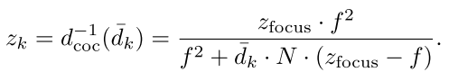

[toc]


# Simulating Partial Occlusion in Post-Processing Depth-of-Field Methods 


## 1. 介绍

我们研究了所谓的**部分遮挡效应**`partial occlusion effect`：由于**景深**而模糊的、靠近相机的物体实际上是**半透明的**，因此导致**背景物体部分可见**。


## 2. DOF

在深度为`z`的焦外`fragment`的所谓`circle of confusion`（CoC）可以计算为：{**1**}


其中，`f`是焦距，`N`是`f-stop number`，$z_{focus}$是离焦平面的距离。这个方程是基于==薄透镜模型==的，这足以模拟`DoF`。为了模拟`DoF`，每个`fragment`都根据其`CoC`在**后处理**中被**模糊化**了。

然而，如果**失焦物体的模糊度**增加，`fragments`就会被强烈地抹去，**变得透明**，从而显示出背景信息，如下图（b）所示。目前的**光栅化渲染**并不存储**被遮挡的片段**，因此不可能准确地模拟这种**透明性**。要做到这一点，**必须存储或内插闭塞的信息**。大多数正确模拟`partial occlusion`的DoF方法将**场景内容**存储在**深度层**中。将`fragments`分配到各层的一种方法可以**基于深度**，其优点是可以**均匀模糊**每个深度层。==分层DoF方法==中突出的伪影是**离散化伪影**。各层被模糊化，因此**物体的边界**被抹去。当这个被抹去的层与其他层混合时，由于**不透明度的降低**，被抹去的边界区域在**物体的边界**出现了一个**环形伪影**。


一种避免这种情况的方法是，首先将**场景内容**渲染成**层**，然后使用**光追**来组合这些层。这是一个昂贵的操作，但可以避免前面提到的**离散化伪影**，并允许模拟**额外的镜头效果**。


## 3. 算法前瞻

下面几节介绍的方法是一种==分层DoF方法==。我们首先将**场景**分解成**深度层**，每层包含**一定深度范围的像素**。然后用一个根据**深度层的CoC大小**的过滤器对所产生的层进行**模糊处理**，然后再**进行合成**。这种方法可以处理`partial occlusion`，因为**隐藏的物体**在更远的深度层中被表示出来，并对合成有所贡献。

为了**避免**对场景进行**K次渲染**，我们使用一个**A缓冲区**来生成==输入缓冲区==。请注意，每个**输入缓冲区**可以包含**来自场景的全部深度范围的片段**，而一个**深度层**则由其**相关的深度范围**来约束。然后，我们通过将**输入缓冲区**分解为**深度范围**来生成**深度层**，这比单独渲染每个深度层快得多。

为了避免**离散化伪影**，我们不对每个深度层使用**硬边界**，而是在每个深度层之间进行**平滑过渡**——由**消隐函数**`matting functions`给出。此外，我们还展示了一种在**一个步骤中**，有效计算**模糊**和**层组成**的方法。

算法大致分为如下几步：

- 以**不排序的方式**将**场景**渲染到一个**A缓冲区**中，包含来自**前面片段**和**被遮挡片段**的颜色和深度。对这些片段进行**排序**，产生输入缓冲区$I_0$到$I_{M-1}$。
- 根据`matting function`和**片元深度**，将输入缓冲区的片元分解成**K个深度层**$L_0$到$L_{k-1}$。因此，渲染的场景现在是以**分层的形式**存储的，每一层都有一定深度范围的片元。
- 根据每一层的`CoC`对其进行模糊处理，并从**距离最远的一层**开始进行**alpha混合**。我们对这一步骤进行了优化，在这一步骤中，我们以**递归的方式**进行混合和模糊：每个层$L_k$都被混合到**组合缓冲区**$I_{front}$（包含焦点层前面的层）或$I_{back}$（容纳焦点层后面的层），其中在**每个混合步骤**之后，**组成缓冲区被模糊化**。最后，组合缓冲区被混合在一起


## 4. 渲染

我们使用了一个**A-buffer**来**避免重新渲染场景**。我们的`A-buffer`由深度为`M`的==3D纹理==（$A_0$到$A_{M-1}$）和用于**计数片元**的纹理`C`组成。当场景被渲染时，每个被处理的片元都会在**片段的屏幕坐标处**增加计数纹理。注意，**计数器的增加必须是原子性的**，这意味着纹理中的一个值不应该被平行地改变。基于计数器，**片元的计算颜色**被写入纹理位置$A_c$中，其中`c`是增加的**计数器的值**。因此，由显卡处理的所有片元都以**未经排序的方式**存储在3D纹理`A`中。计数器最初被设置为`0`。


接下来，`A`中的所有片元按**深度排序**并写入**输入缓冲区** （$I_0$到$I_{M-1}$为颜色，$Z_0$到$Z_{M-1}$为深度），因此每个屏幕位置最多允许`M`个片段。请注意，只有`C`个片段需要被排序。因此，**排序的工作量取决于场景的复杂性**。我们使用**冒泡排序算法**对片段进行排序。我们对`A-buffer`的实现是受[Crassin 10]中的实现的启发，需要`OpenGL 4.2`的**原子操作**，以及**图像加载**和**图像存储**功能。

下列清单中显示了如何渲染到`A-buffer`中的伪代码

[List 1]()

```glsl
coherent uniform layout(size4x32) image2DArray abufferImg; 
coherent uniform layout(size1x32) uimage2D abufferCounterImg
void main(void) 
{ 
    // atomic increment of the counter 
    int c = int(imageAtomicInc(abufferCounterImg, coord.xy));
	vec4 val = ShadeFragment();  // compute shading color 
    val.w = coord.z; // depth used for sorting
	// store fragment into A-buffer 
    imageStore(abufferImg, ivec3(coord.xy, c), val);
}
```


## 5. 场景合成


**输入缓冲区**$I_0$到$I_{M-1}$被分解成**K个深度层**$L_0$到$L_{k-1}$。只有`C`个片元需要被`matted`，这就减少了**较简单场景**的消解成本`matting costs`。对于每个**深度层**，都有**分割深度**（称为==锚点==）。==分解==是通过将片元与**消隐函数**相乘来完成的，其中**消隐函数**对于每个深度层$L_k$都是不同的。


符号`A⊕B`表示`A`在`B`上的**α-混合**。

### 消隐函数

==消隐函数==保证了物体在**层间的平滑过渡**。特殊的消光函数（==上面带点的==）在**后层边界**保留了一个**硬切**`hard cut`，以避免**背景片元**在**前景层**上混合的情况。计算公式为：


其中$z_{k-2}$到$z_{k+1}$定义了**层边界的锚点**。下列清单显示了如何在**片段着色器**中进行`matting`处理的伪代码。

[list 2]()

```c++
// anchor points array 锚点数组
uniform float anchor [4];

// fragment counter and input buffer textures 
uniform layout(size1x32) uimage2D abufferCounterImg; 
uniform layout(size4x32) image2DArray inputBufferImg;

void main(void) 
{ 
    int C = int(imageLoad(abufferCounterImg, coord.xy).r); 
    vec4 finalColor = vec4(0, 0, 0, 0); 
    for(int c = 0; c < C; ++c) 
    { 
        vec4 val = imageLoad(inputBufferImg, vec3(coord.xy, c)); 
        vec4 color = vec4(val.rgb, 1.0); 
        float depth = val.z; // depth is stored in alpha channel
		// check if fragment is within z_{k-2} and z_{k+1}, 
        // or z_{k} if (c!=0) 
        if(anchor[3] <= depth && depth < anchor[(c==0)?0:1]) 
        { 
            float w = 1.0; // weight 
            // z_{k} < z 
        	if(anchor [1] < depth) { 
                w = (anchor [0] - depth) / (anchor [0] - anchor [1]);
			} 
            // z < z_{k-1} 
            else if ( depth < anchor [2]) 
            { 
                w = (depth - anchor [3]) / (anchor [2] - anchor [3]);
			}
			// alpha blending 
            finalColor += (1.0f - finalColor.a) * color * w;
		} 
  	} 
}
```

### 锚点

`layer matting`依赖于锚点，**锚点的间隔**是根据**模糊方法的滤波大小**而定的，与[Kraus and Strengert 07]类似。这意味着一个深度层$L_k$的**层边界的位置**是由所选择的**模糊方法的滤波器大小**（近似于$d_k$，该层的`CoC`）决定的。由于深度层中的所有片段都将被**均匀模糊化**，==锚点应该相对于滤波器的大小均匀分布==。因此，我们使用一个深度层和其相邻层的平均`CoC`。


如果我们忽略公式(**1**)的**绝对值计算**，我们可以**反转**这个公式，根据过滤器的大小计算出近似的深度值：{**5**}



请注意，位于**焦点平面**后面的深度层（$k > k_{focus}$）的`CoCs`（$d_k$）将是负的，而且公式（**5**）只适用于以下情况：


离摄像机最远的锚点，$z_{K-1}$，受到这个约束的限制。在对最前面的一层（$L_0$）和后面的一层（$L_{K-1}$）进行`matting`时必须特别注意，如下图所示，所有深度小于最前面的锚点（$z_0$）的片元被`matted`入$L_0$，深度超过后面锚点（$z_{K-1}$）的片元被`matted`入$L_{K-1}$。


为了模拟DoF，必须生成**足够数量的深度层**，横跨整个场景的深度范围。如果渲染的场景的**深度范围较小**，简单地使用**近处和远处的剪切平面**会产生**空的深度层**。因此，一个更好的方法是使用一个动态适应的`frustum`，可以通过查看**边界框的深度**或者通过计算**帧缓冲区的最小-最大mipmap**来实现。


## 6. 模糊和合成

每个深度层$L_k$都有一个`CoC` $d_k$，决定了**模糊滤波器的宽度**。我们使用**高斯滤波器**，因为它们是**可分离的**，可以递归应用，并产生平滑的结果。从`CoC`到高斯核`H`的标准偏差`σ`的映射根据经验选择为：


我们可以分别对每一层进行卷积，但这很昂贵。我们使用==递归滤波==的方法，从最远的层开始，在每个合成步骤后进行滤波。因此，**离焦点平面越远的图层，越容易被模糊化**。

特别是，深度层被混合到场景的**前面、后面和焦点部分**的三个所谓的**合成缓冲区**之一（$I_{front}, I_{back}, I_{focus}$)。**后者**只填入**焦点内的深度层**（$L_{k_{focus}}$），而**其他深度层**则分别从**最前面和最远的深度层**开始，迭代合成到**前面和后面的合成缓冲区**。必须使用这两个组合缓冲区，因为否则就不可能保持**各层的正确深度顺序**。在每次**组成迭代之间**，用**高斯滤波器**$H_k$对**合成缓冲区**进行**模糊处理**，其中索引`k`与最近组成的深度层$L_k$相同。组成是通过**alpha混合**完成的，**前面的组成缓冲区**在下一个深度层上混合，对于**后面的组成缓冲区**，深度层在组成缓冲区上混合。

[list 3]()

```c++
GLuint pDepthLayer[K]; // storing the depth layers 
GLuint bufferFront, bufferFocus, bufferBack; // composition b

// do front buffer compositing 
bindAndClearFbo(bufferFront); 
for(uint k = 0 ; k < kFocus ; ++k) 
{ 
    glBlendFunc(GL_ONE_MINUS_DST_ALPHA, GL_ONE); 
    blendLayer(pDepthLayer[k]); 
    blurBuffer(bufferFront, computeSigmaForLayer(k));
}

// do focus buffer compositing 
bindAndClearFbo(bufferFocus); 
blendLayer(pDepthLayer[kFocus]);

// do back buffer compositing 
bindAndClearFbo(bufferBack); 
for( uint k = K - 1 ; k > kFocus ; --k) 
{ 
    glBlendFunc(GL_ONE, GL_ONE_MINUS_SRC_ALPHA); 
    blendLayer(pDepthLayer[k]); 
    blurBuffer(bufferBack, computeSigmaForLayer(k));
}
```

根据需要，可以用**较小的滤波核尺寸**实现**更强的模糊**。例如，一个深度层$L_0$将被模糊 $k_{focus} - 1$ 次。递归模糊的结果类似于用**高斯核** $H_k$模糊，其中**滤波宽度**（以`σ`为单位）是所有应用的递归滤波大小的**欧几里得距离**：


这意味着$L_0$层的**模糊程度**与使用更大的滤波器$H_0$（由上诉公式计算的$\sigma_0$）进行模糊处理时一样强烈。尽管过滤结果并不完全相同，但由于**每层单独模糊**时可以**避免闭塞**，其结果足以接近`DoF`。在我们的实现中，我们对递归高斯使用的**标准偏差**为$\sigma_k = |k - k_{focus}|$，因此在**焦平面周围**有**较小的核大小变化**，这导致**较少的可见分级**。

最后的合成`I`是：


### 归一化

由于使用了**消隐函数**，导致**深度层扩大**，**离散化伪影**大多被避免了。然而，在某些情况下（例如，几乎垂直的平面），这种伪影仍然可能出现，但它们可以通过==归一化结果==（用$\alpha$除以颜色）进一步减少。请注意，对于**消光和模糊**，使用的是**预乘的颜色**（$color\times\alpha$）。


## 7. 结论

我们展示了一种渲染高质量DoF效果的算法，特别是包括`partial occlusion`效果。我们使用一个**A缓冲区**来避免重新渲染场景。通过**递归高斯滤波器**，可以有效地**模拟高模糊半径**。随着更快的模糊方法的使用（Box模糊等），我们的方法可以被用于实时应用，如游戏。请注意，改变模糊的方法也会改变深度层的数量和它们之间的间距。


# Second-Depth Antialiasing


## 1. 介绍

`MLAA`和`MSAA`的根本区别在于，**前者完全是一种后处理操作**。这意味着，该算法提供了一个**完成的渲染图像**，然后它对其进行分析和**抗锯齿处理**。它的工作原理是首先**检测图像中的边缘**（例如，由相邻像素之间的亮度差异定义），然后将**这些边缘**分类为**一组形状**。从这些形状中，它重建**原始边缘**，并使用它来计算**用于与相邻像素混合的覆盖值**。`MLAA`最初是一种基于CPU的光线跟踪器技术，但后来被其他人扩展到GPU实现。在写这篇文章的时候，一些游戏已经以某种形式将`MLAA`作为他们的抗锯齿解决方案。另一个非常流行的技术是**快速近似抗锯齿**（`FXAA`），由于其**简单的单通道实现**，是一个非常方便的选择。

上述和其他一些方法可以被描述为==后处理抗锯齿技术==。**与场景渲染脱钩是一个很大的优势**，可以使引擎的设计**更加模块化**。缺点是，这些方法所基于的启发式方法并不准确，**可能会失败或导致伪影**。还有一些分析技术正在出现。这些技术并不试图从缓冲区恢复信息，而是**利用场景的先验知识**。这方面的例子包括**距离-边缘抗锯齿**（`DEAA`）和**几何缓冲区抗锯齿**（`GBAA`）。通过使用关于**底层几何的可用信息**，这些方法可以提供更准确的结果。缺点是它们需要更多的引擎支持，因此不具备模块化的特点，可能需要在引擎中进行更多的维护工作。

本章将介绍一种**半分析方法**，它对游戏引擎的数据**要求很低**，以完成其工作。


## 2. 算法

### 前瞻

这种技术使用**常规的深度缓冲区**和一个**包含第二层深度的缓冲区**。前者应该已经有了；但是，后者不是引擎通常拥有的东西。幸运的是，**它的生成相对简单**，如果引擎已经使用了`pre-Z pass`，那么只需要做一个微不足道的改变即可。

这项技术的基本思想是：使用**深度的斜率**来计算**原始边缘的位置**。如果我们通过**深度样本**画一条线并找到交点，这就是**原始边缘的位置**。这假定在边缘的另一边有一个**相邻的三角形**，通常情况下应该是这样的（有一些例外）。为了理解这一点，我们必须首先理解**深度的基本属性**。

### 理解深度

一个**深度缓冲区**可以包含**数量惊人的有用信息**。例如，在延迟着色中，通常只从**深度缓冲区的值**和它的**屏幕空间位置**中提取一个**像素的世界位置**。深度缓冲区也有一些**有趣的特性**，对这种技术来说是至关重要的。在进入这个技术的细节之前，我们需要提出的==关键见解==是：==深度缓冲区实际上是线性的==。人们通常说`Z`是**非线性的**。这种说法通常是在**Z缓冲区**的背景下进行的，指的是**深度缓冲区中的深度值在视距方面的分布**。确实存在深度缓冲区中**深度值的非线性分布**，至少在**透视投影**中是这样。在一个**传统的深度缓冲区**中，从近平面的`0`到远平面的`1`，值`0.5`绝对不是接近中间。事实上，它**非常接近于近平面**。


**深度缓冲区**中的绝大部分数值都会落在非常接近`1`的地方，中间的数值会是`0.999`这样的。这当然会导致精度的显著损失，这是一个问题。在过去，这个问题的解决方案是一个**W缓冲区**，一些硬件支持这个缓冲区，提供**深度值的线性分布**。实际上，`z`和`w`之间的差别并不大；`z`本质上是`w`和一个**稍大的比例系数**，而且`z`从**近平面**开始，而`w`从**眼睛位置**开始。所以`z`和`w`都是线性的，但存储在**Z缓冲区**的是$z/w$，它不是线性分布的。

虽然 $z/w$的**数值分布**是**非线性的**，但另一方面，它在屏幕空间中的**像素与像素之间的梯度是线性的**。如果你有三个相邻的像素属于同一个表面，或共面的表面，你可以期望**第一个像素到第二个像素的深度值的差**等于**第二个像素到第三个像素的差**（忽略精度问题）。换句话说，==屏幕空间的梯度是不变的==。这在下图中得到了直观的体现。

**恒定梯度**对于硬件来说是一个非常理想的属性，因为 $z/w$值可以简单地在**三角形顶点**计算，然后在整个三角形内**线性插值**。除了简化光栅器之外，这个属性还有利于一些**较新的硬件特性**，比如`Z-compression`：在相对可能的情况下，一些屏幕空间的`tile`——例如$8\times 8$像素——被**同一个基元**完全覆盖，整个`tile`的深度值可以用三个值、两个梯度和一个偏移量来**编码**，或者基本上是**一个平面方程**。假设该值被存储为三个`32`位的**浮点数**，这意味着**读写深度的带宽**将减少不少于**95%**。


**屏幕空间的线性**也是一个在软件方面非常有用的属性。它使得写一个**准确的边缘检测程序**变得容易。鉴于**一个基元内的梯度是恒定的**，如果我们检测到一个像素的左边和右边的`depth delta`是不同的，我们就知道那里有**一个边缘**，在垂直方向上也是如此。我们还可以利用这一信息来找到**产生深度值的原始几何边缘**的位置。这就是这项技术的基础。

### 方法

这种技术从**深度缓冲区的值**中分析性地提取**原始几何边缘**。有两种类型的边缘需要分别处理，即折痕`creases`和剪影边缘`silhouette edges`。**折痕是指一个基元与相邻的基元相遇的地方**，例如，墙壁之间的拐角，而**剪影边缘**是指**边缘的另一边没有相邻的基元**，而是有某种背景的地方。该算法将首先检测深度缓冲区中是否存在不连续的情况。如果没有，我们就处于一个基元的中间，没有必要进行抗锯齿。如果存在不连续，它将首先尝试将其解析为**折痕**。如果失败了，它就假定它是在处理一个**剪影**，并以此来解决它。

***Edge detection***

:one:检测**深度缓冲区的不连续性**是相当直接的。对于来自**同一基元的像素**，我们希望左边的delta等于右边的，或者说$left + right − 2 × center = 0$。当然，由于**精度有限**等原因，我们需要某种`epsilon`。一个相对于中心样本的`epsilon`就很好用。下列清单是着色器的**边缘检测部分**。请注意，我们在这里同时检测**水平和垂直的不连续性**。为了简化理解，**本章的其余部分将只涉及水平情况，但在两个方向上的操作是相同的**。如果我们在两个方向上都检测到有效的边缘，我们将根据**边缘在哪个方向上更接近**的情况来决定**采用哪个方向**

[list 1]()

```c++
bool edge_x = (abs(dx1 + dx2 - 2 * dc) > 0.00001 f * dc); 
bool edge_y = (abs(dy1 + dy2 - 2 * dc) > 0.00001 f * dc);
```

***Creases***

:two:一旦确定我们有一条边，我们就会尝试将其解决为**一条折痕**。如果我们有一条折痕，那么**原始几何**就会让**两个基元**在某个点相遇。在下图中，蓝色和绿色基元在**紫色的点**上相遇。**红点**代表我们的**深度缓冲器样本**。只要屏幕空间中的梯度不变，通过**线的交点**可以简单地找到**这个边缘点**。


在下列清单中，我们在**水平方向**上计算交点。这个**数学运算**是相对简单的，得到的值是相对于**中心样本位置**的坐标。如果交点在任一方向的某个像素内，就成功地解决了这个**折痕**。否则，这里没有有效的交叉点，表明我们正在处理一个**剪影边缘**。如果我们有一个有效的折痕，**我们只在交点落在半个像素内时使用它**。这是因为如果相交点在**更远的地方**，它**实际上是在相邻像素的区域内**，而且应该由这个像素来做**混合处理**。

```c++
if (edge_x) {
    float k0 = dx1 - dx0; // Left slope 
    float k1 = dx3 - dx2; // Right slope 
    float m0 = dx1 + k0; // Left offset 
    float m1 = dx2 - k1; // Right offset 
    offset.x = (m1 - m0) / (k0 - k1); // Intersection point
    is_silhouette = (abs(offset.x) > 1.0f); 
    offset.x = (abs(offset.x) < 0.5f) ? offset.x : 0.5f;
}
```

***Silhouette edges***

:three:到目前为止，我们只需要一个**标准的深度缓冲区**。不幸的是，当我们有一个**剪影边缘**时，我们没有一个**相邻的基元**，其**深度值**可用于导出**几何边缘**。**背景基元**与我们可以利用的**前景基元**没有任何特别的**共同之处**。在下图 中，仅从红点来看，我们唯一能知道的是**第二个和第三个样本之间有一个空隙**，所以边缘就在那里的某个地方，但**我们没有办法知道那个蓝色基元在这个间隙上延伸了多远**。我们在这里**真正需要的是网格中相邻的基元的深度**。对于剪影的情况，**相邻的基元将在基元的后面**，**并背对着查看者**。因此，**我们需要为这些隐藏的表面提供第二层深度值**，因此这项技术被称为：==第二深度抗锯齿==。在本章后面会有更多关于我们如何生成第二深度层的内容。不过请注意，要使这一技术发挥作用，我们需要**封闭的几何体**。**如果没有背面的基元存在，边缘就会留下锯齿**。


一旦你有了**第二层的深度值**，**剪影**的情况就和**折痕**的情况很相似了。我们需要**向左**和**向右**分别做**一个测试**。然后，我们选择哪一个碰巧最终**更接近中心像素**。同样，如果边缘被确定为在**离中心半个像素以内**，我们就可以使用这个**边缘距离信息**进行混合。

[list 3]()

```c++
if (edge_x) {
    float k0 = sdx3 - sdx2; // Right second-depth slope 
    float k1 = dx3 - dx2; // Right slope 
    float k2 = sdx1 - sdx0; // Left second-depth slope 
    float k3 = dx1 - dx0; // Left slope
    
    float m0 = sdx2 - k0; // Right second -depth offset 
    float m1 = dx2 - k1; // Right offset 
    float m2 = sdx1 + k2; // Left second -depth offset 
    float m3 = dx1 + k3; // Left offset 
    
    float offset0 = (m1 - m0) / (k0 - k1); // Right intersection 
    float offset1 = (m3 - m2) / (k2 - k3); // Left intersection
    
    // Pick the closest intersection. 
    offset.x = (abs(offset0) < abs(offset1)) ? offset0 : offset1; 
    offset.x = (abs(offset.x) < 0.5f) ? offset.x : 0.5f;
}
```

到边缘的距离可以转换为这个像素上的**相邻基元的覆盖率**，可以用来与相邻的像素**进行混合**。我们只与水平或垂直的邻居其中一个混合。这可以通过简单地使用**线性纹理滤波器**和适当地**偏移纹理坐标**在单个样本中完成。这方面的代码见清单。

[list 4]()

```c++
// Convert distances to a texture coordinate shift for filtering. 
if (abs(offset.x) > abs(offset.y)) 
{
	offset.x = 0; 
    offset.y = ((offset.y >= 0) ? 0.5f : -0.5f) - offset.y;
} 
else 
{
	offset.x = (( offset.x >= 0) ? 0.5f : -0.5f) - offset.x; 
    offset.y = 0;
}
return BackBuffer.Sample(Linear, TexCoord + offset * PixelSize);
```

***生成第二深度***

:four:生成**第二个深度层**的直接方法是将场景渲染到一个具有`front-face剔除`功能的**深度目标**。这相当于一个`pre-Z pass`，只是它只用来生成**第二个深度纹理**。不过，仅仅为此增加一个几何 `pass`似乎有点过分。==一个更好的方法==是使用这个`pass`而不是**传统的pre-Z通道**：在这里我们**生成这个纹理**并同时得到一个**完整的pre-Z**。首先我们将场景绘制到**深度缓冲区**，并进行**正面剔除**，然后复制到**第二个深度纹理**，然后继续进行**主场景渲染**，像往常一样使用**背面剔除**。缓冲区中的第二深度值一般来说仍然在最前面的表面覆盖的地方，**理论上允许几乎相同的剔除效率**。这就是样本代码默认使用的方法。

关于这种方法有两点需要注意：

- 首先，**第二深度的pre-Z通道**比传统的pre-Z通道**把深度值放在更远的地方**。`Hierarchical-Z`（Hi-Z）硬件通常会存储**一个低精度但保守的最远的深度值**。
  - 对于非常接近`back-face`的东西。例如，站在墙后面的东西——可能会出现**硬件无法剔除这些像素**的情况。在这些情况下，传统的`pre-Z pass`可能**更有效**，这取决于**硬件的情况**。
  - 还有一种情况是**物体相交**，所以**背面的深度值**实际上是在**相交物体的正面**后面。在这些情况下，我们确实失去了**Hi-Z剔除**的效果。
- 第二件要注意的事情是，**第二个深度的pre-Z通道**通常渲染得更快，这可能会，也可能不会带来**更好的整体性能**。它之所以更快，是因为**大量的几何体后面没有任何东西**。
  - **最远的表面**在`pre-Z pass`中不会增加任何开销，因为它后面**没有任何东西可以剔除**。对于一个室内场景，最远的表面总是朝前的。对于室外场景，如果你认为天幕是一个正面的表面，情况也是如此。这意味着，如果你把正面渲染成`pre-Z`，你也会把后面**没有东西的墙**渲染成`pre-Z`，==这是一种浪费==。
  - 另一方面，在现实中，背面总是会有一些东西。对于样本程序中的那种**封闭几何体**，这是一种保证。当然，对于**真正的游戏几何体**来说，也有例外。**地形本身通常不是封闭的几何体**，也就是说，**它没有背面**，因此，如果在`pre-Z pass`  之后立即绘制，**第二深度的pre-Z通道**将不会剔除它后面的天空盒。当然，这在实践中是可以解决的，即在**主场景渲染**中，在`sky`之前**绘制地形**。在这种情况下，**第二深度的pre-Z通道**将提供地形所需的所有**自我剔除**，同时不会浪费**任何宝贵的光栅操作**来填充屏幕的大片区域，而**屏幕后面基本上只有天空盒**。

还有其他可想而知的方法来生成**第二个深度缓冲区** ，潜在优势是**根本不需要`pre-Z pass`或第二个几何通道**。例如，一种方法是使用**几何着色器**将三角形发送到**渲染目标阵列**中的**两个不同的片元**，这取决于面孔`facingness`的大小。一个片元包含`front-faces`，另一个包含`back-faces`。另一种方法是使用一个DX11风格的**片元链接列表**。如果这被用于**与顺序无关的透明度**，我们就可以在那里准备好**第二层**。全屏`pass`可以从片段列表中提取**第一层和第二层的深度**，并写到一个**单独的缓冲区**。这两种方法都没有应用于`SDAA`，所以目前还不清楚是否存在**任何潜在的问题**，也不清楚它们在现实世界的应用中的性能。


## 3. 结果

todo


## 4. 结论

**未来的工作**有几个方面可以改进。`resolve pass`需要**非常繁重的纹理取值**，这是这项技术的一个**主要瓶颈**。鉴于所有的样本都是针对**多个相邻的像素**进行重新获取的，可以通过**计算着色器**优化。通过共享样本，以ALU的增加来换取**纹理获取的显著减少**。

最好是用更好的方法来生成**第二深度的值**，以避免需要**一个完整的pre-Z通道**。另外，一个值得研究的方法是将该技术的折痕解决方案与其他的剪影边缘方法相结合，例如，**几何后处理抗锯齿**（`GPAA`），这将消除对**第二深度缓冲区**的需求。同时，典型场景中**剪影边缘的数量**相对较少，所以**GPAA的栅格化**开销应该保持在一个合理的水平。当使用非常密集的几何体时，这种技术可能会失去其有效性。

在这种情况下，**相邻的像素**通常来自**不同的基元**。这是因为本章介绍的实现是通过**相邻深度值之间的差**来计算**深度斜率**。一个不同的方法可能是将**梯度与深度值**一起存储。这样一来，**解析着色器**就不需要对任何相邻的像素进行采样，应该能够更好地处理**非常密集的几何体**，但代价是**额外的存储**和**输出过头**。另一方面，解析着色器可能会**运行得更快**。

