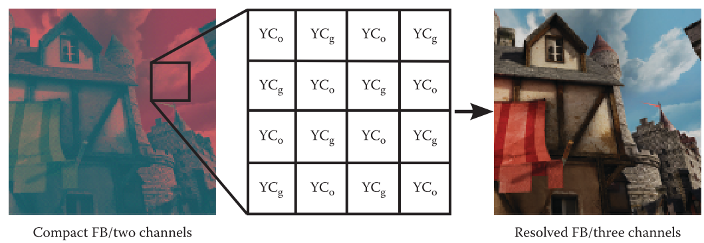

# Practical Framebuffer Compression


## 1. 介绍

当使用存储多个**中间渲染缓冲区**的算法时，**帧缓冲区的总内存**会进一步增加，例如**延迟渲染**，或者为了驱动**高密度显示器**而简单地以**非常高的分辨率**进行渲染，这是移动和桌面计算的一个最新趋势。这些因素都大大增加了内存，给`GPU`的**内存子系统**带来了巨大的压力。

硬件制造商已经认识到这一事实，并且大多数已上市的`GPU`都包括了一个**存储器**。今天的`GPU`包括一种**无损的帧缓冲器压缩形式**。虽然这些**压缩方案的细节**没有公开披露，但根据`GPU`的性能特点，可以安全地假设，这些算法主要是利用了这样一个事实：**一个片元着色器**在每个被覆盖的基元上**只能执行一次**，而且**同一颜色**可以被分配给许多**子像素样本**。值得注意的是，根据信息理论，没有**无损压缩算法**能够保证**固定速率的编码**，而这是提供**快速随机访问**所需要的；因此，这些算法**只能节省带宽，而不能节省存储**。

在本章中，我们描述了一种实用的**有损的帧缓冲区压缩方案**，基于**色度子采样**，适用于现有`GPU`和`API`。使用我们的方法，**彩色图像**可以只用==2==个**帧缓冲通道**，而不是`3`个，从而**减少存储**，更重要的是，**减少**光栅化过程的**带宽要求**。在实现各种渲染管道时，这种**内存占用的减少**是有价值的。**我们的方法与前向渲染和延迟渲染都是兼容的**，它不影响任何**硬件无损压缩**的效果，而且可以与其他有损方案一起使用，比如最近提出的**基于表面的抗锯齿**（`SBAA`），以进一步减少**总的存储**和**带宽消耗**。虽然我们的方法是有损的，但它并没有导致任何明显的质量下降。


## 2. 色彩空间转换

`HSV`对**亮度的空间变化**比**色度**更敏感。许多图像和视频编码系统，如`JPEG`和`MPEG`，都利用了这一事实，以提高**压缩率**，同时又**不损失质量**。这通常是通过以**低于色度的空间分辨率**表示**图像的色度成分**来实现的，这一过程通常被称为==色度子采样==。这个过程构成了我们方法的基础。

**光栅化片元的颜色**应首先被分解为**亮度**和**色度**成分。已经提出了很多变换来执行这一操作。在h.264压缩中首次引入的==RGB到YCoCg的变换==，已经被证明比其他类似的变换（如`YCbCr`）具有**更好的压缩性能**。实际的变换由以下公式给出：


**YCoCg色彩空间**中的**色度值**（`CoCg`）可以是**负值**。当输入**RGB范围**为$[0,1]$时，输出**CoCg范围**为$[-0.5, 0.5]$​。因此，当在**无符号8位定点`fixed`渲染目标**上进行渲染时，应该在这些值上加一个`0.5`的**偏置**，以使它们**保持正值**。在将**压缩的渲染目标**转换回**RGB色彩空间**之前，应该从**CoCg值**中**减去这个偏置**。

值得注意的是，为了避免在此**转换过程**中出现任何**舍入错误**。与**RGB数据**相比，**YCoCg组件**应以**两个额外的比特精度**进行存储。当`YCoCg`和`RGB`数据使用相同的精度时，我们测量了在众所周知的==柯达无损真彩色图像套件==中，转换为`YCoCg`并返回的平均峰值**信噪比**（`PSNR`）为`52.12 `dB。这种**精度损失**对于我们的目的来说是**微不足道的**，`HSV`也无法感知。


## 3. 色度复用

利用**色度子采样**的一个选择是：在**渲染过程**完成后对**渲染目标**进行==降采样==。这种方法的问题在于，我们**只能在后处理操作中利用带宽降低的优势**，但在**实际的光栅化过程**中却无法利用。

相反，我们的方法直接使用**两个通道**渲染彩色图像：

- 第一个通道存储每个像素的亮度，
- 第二个通道存储输入片段的色度橙色（Co）或色度绿色（Cg），

以**棋盘格的方式**交错排列，如下图所示。这种特殊的安排对应于$2:1$的**亮度-色度比**，并提供$3:2$​​​的**压缩比**，因为使用了**两个颜色通道**而不是三个。许多**视频压缩编解码器**使用相同的亮度-色度比，在文献中被称为$4:2:2$。



为了在`GPU`上创建**压缩的帧缓冲区**，应用程序可以请求一个**只有两个颜色通道的渲染缓冲区**，或者使用一个更传统的**四色通道的格式**，并使用**空闲的通道**来存储额外数据。后一种情况在**延迟渲染管线**中特别有用。

渲染管道的**光栅化阶段**产生的`fragment`应该以**正确的交错格式**直接发射出去。这可以通过以下清单的代码轻松实现。在这段代码中，颜色首先被转换为**YCoCg颜色空间**，根据目标像素的坐标，**YCo或YCg通道**被发射到`framebuffer`中。

[list 1]()

```c++
// Convert the output color to YCoCg space. 
vec3 YCoCg = RGB2YCoCg(finalColor.rgb);
// Store the YCo and YCg in a checkerboard pattern. 
ivec2 crd = gl_FragCoord.xy; 
bool isBlack = ((crd.x & 1) == (crd.y & 1)); 
finalColor.rg = ( isBlack ) ? YCoCg.rg : YCoCg.rb;
```

这种方法还可以在**片段着色过程**中提供一些小的额外好处，即`fragment`可以在着色器代码的早期转换为**双通道交织格式**，然后任何**进一步的处理**可以**只在YCoCg色彩空间的两个通道上进行**，而不是三个。实际好处取决于**着色器中使用的确切着色算法**和**底层GPU架构**。

在我们的方法中，==色度子采样==是通过**点采样**进行的，**没有使用**任何复杂的**下采样滤波器**。理论上，这可能会导致**色度成分的锯齿**，因为我们已经将其**采样率**减半，但在实践中我们没有观察到任何严重的锯齿问题。


## 4. 色度重建

在读取**压缩帧缓冲区**的值时，**缺失的色度信息**都应从**邻近的像素**中重建。最简单的方法是将**缺失的色度值**复制到邻近的像素上。如下图所示，在**多边形的边缘**，即**色度转换较强的地方**，这种最近的过滤器会产生一些**明显的马赛克伪影**。使用来自四个相邻像素的**双线性插值**可以减轻这些伪影，但并**不能完全消除它们**。请注意，这些伪影在静止图像中不容易被`HSV`发现，因为亮度总是正确的，但当**涉及运动时**，它们会变得**更加明显**。


为了消除这些**重建伪影**，我们设计了一个简单而有效的**边缘定向滤波器**，其中`4`个最近的**色度样本的权重**是根据对**该样本的亮度梯度**计算的。如果梯度的值大于一个**特定的阈值**，表明有一个**边缘**，那么相应的色度样本的**权重为零**。否则，**权重为1**。这可以用下面的方程紧凑地表示：


我们用**真实游戏的帧缓冲区**进行的实验表明，算法对这个**阈值**不是很敏感，`30/255`左右的值在`PSNR`方面有类似的质量。然而，我们观察到，这个特定的值（`30/255`）倾向于**最小化**原始和压缩帧缓冲区之间的**最大差异**。

**梯度**可以通过简单的**水平和垂直差**来计算，如下列清单中所示。当所有的权重都为`0`时，我们采取的策略是将**色度**设置为`0`，这发生在我们找不到亮度相似的邻居时。此外，为了避免处理**帧缓冲区边缘**的特殊情况，即只考虑**帧边界内的像素**，我们在对**帧缓冲区像素采样**时使用了 "==镜像重复== "的`wrap`模式。还值得注意的是，这个过滤器的实现使用了**条件赋值**，在大多数`GPU`架构上，==条件赋值的速度明显快于分支==。

[list 2]()

```c++
// Return the missing chrominance (Co or Cg) of a pixel: 
//a1 -a4 are the four neighbors of the center pixel a0. 
float filter(vec2 a0, vec2 a1, vec2 a2, vec2 a3, vec2 a4) 
{
    vec4 lum = vec4(a1.x, a2.x, a3.x, a4.x); 
    vec4 w = 1.0 - step(THRESH, abs(lum - a0.x)); 
    float W = w.x + w.y + w.z + w.w; 
    // Handle the special case where all the weights are zero. 
    W = (W == 0.0) ? W : 1.0 / W; 
    return (w.x * a1.y + w.y * a2.y + w.z * a3.y + w.w * a4.y) * W;
} 
```

**帧缓冲区的质量**是非常重要的，因此重构应足够强大，以处理**最具挑战性的情况**，如**高频内容**和**强色度转换**，而不引入任何可见的伪影。这些具有挑战性的情况被**边缘定向滤波器**处理而没有任何**视觉伪影**。高动态范围（`HDR`）为**色度子采样**方案提供了一些额外的挑战，因为**亮度的HDR**倾向于**夸大高动态对比边缘的任何 "色度泄漏" `chrominance leaking`**。在我们的方法中，**面向边缘的重建性质防止了任何色度泄漏的出现**，即使是在动态对比度极高的边缘，如下图所示的边缘。在该图的测试中，将我们的技术与Emil Persson的一个著名的演示结合起来，将我们的**紧凑格式**与**多采样抗锯齿**（`MSAA`）、**HDR渲染目标**和MSAA解析前的**适当色调映射**结合起来。


为了测试在移动场景中的**时间稳定性**，我们进行了两个实验。在第一个实验中，我们使用了上图的演示，并移动了**摄像机**。但由于**真实游戏的内容**可能要求更高，也用我们的方法对**真实游戏的帧缓冲序列**进行了编码。在这两次测试中，在时间上似乎都很稳定。

### 优化

我们的方法的`GLSL`或`HLSL`实现必须执行**五个取数**，即考虑中的实际像素和它的四个邻居，以便为**边缘定向滤波器**提供信息。这些取数大部分来自**纹理缓存**，在大多数`GPU`中是非常有效的，因此在大多数架构上的开销应该是相当小的。值得注意的是，通过利用**ALU的本地共享内存**，`GPGPU`实现可以完全**避免多余的取数**。此外，较新的架构，如Nvidia的Kepler，提供了**战线内数据交换指令**，如`SHFL`，可以用来**在同一战线的线程之间交换数据**，而**不需要接触共享内存**。尽管如此，由于GPGPU的功能并不是在所有的平台上都有，因此研究如何**在传统的着色语言实现上减少取数是非常有趣的**。我们在这里重点研究**减少内存取数**，而不是ALU指令。

> 算术逻辑单元(arithmetic and logic unit) 是能实现多组算术运算和逻辑运算的组合逻辑电路，简称ALU。

为此，我们可以巧妙地使用着色语言的**内置部分导数指令**。根据OpenGL规范，部分导数`dFdx`和`dFdy`是用**局部差分法**计算的，但没有规定计算的确切精度。使用一些精心选择的**测试模式**，我们发现对于每个**正在被光栅化的2×2像素块**，`dFdx`和`dFdy`指令分别返回2×1和1×2大小的像素块的相同值。假设C是存储在每个像素上的色度（Co或Cg），很容易看出，我们可以通过下面的代码片段有效地计算**[CoCg]**。

```c++
bool isBlack = ((crd.x & 1) == (crd.y & 1)); 
vec2 tmp = (isBlack )? vec2(C,0) : vec2(0,C); 
vec2 CoCg = abs(dFdx(tmp));
```

`crd`是每个像素的**整数坐标**。在这种情况下，**缺失的色度**已经从**水平方向的邻居**那里复制过来了，但是同样的原理也可以应用在垂直方向，使用`dFdy`指令。使用这种方法，我们可以从**同一2×2栅格化块**中的两个邻居中读取缺失的色度，甚至**不需要接触GPU的内存子系统**，从而将所需的总取数从`5`个减少到`3`个。


## 5. 抗锯齿

当用我们的技术对**多样本帧缓冲区**进行渲染时，每个像素将包含多个**色度橙色**（`Co`）样本或多个**色度绿色**（`Cg`）样本，但**绝不会是两者的混合**。因此，在应用第4节的**去马赛克滤波器**之前，可以像往常一样对帧缓冲区进行解析。唯一的限制是**，解析的重建滤镜不应宽于一个像素**，以**避免错误地混合Co和Cg样本**。这意味着，如果硬件的自动解析操作使用了更宽的滤镜，就应该使用一个自定义的解析通道。我们还应该注意到，**如果更宽的重建滤波器是可取的，它们可以只用于亮度通道**。


## 6. 混合

由于RGB到YCoCg的所有操作都是**线性的**，混合可以可以直接在**YCoCg色彩空间**中执行。

如第2节所述，在向**无符号定点渲染目标**进行渲染时，我们在**色度值**中加入了`0.5`的**偏置**，以使其保持正值，因为这些缓冲区不支持**有符号值**。这不会给**传统的alpha混合**带来任何问题，因为**偏置会一直保持在0.5**，并且**可以在转换回RGB时轻松减去**。然而，**当使用其他混合模式时，比如加法混合，偏置将被累积**，并会产生`clamp`伪影。因此，当使用**加法混合**来累积`N`个`fragment`时，我们应该从**帧缓冲区的色度**中减去`0.5`N，但在许多情况下，**N是未知的或难以计算的**。一个可能的解决方案是在着色器内部执行**混合操作**，在正确的$[-0.5, 0.5]$​​范围内，通过读写**同一渲染目标**（使用`texture_barrier`扩展），但这种方法只限于特定的平台和使用情况。然而，**这种限制只涉及无符号8位渲染目标上的某些混合模式**。高质量的渲染通常需要HDR格式，这在我们的方法中是很容易处理的。


## 7. 表现

//todo


## 8. 总结

//todo


# Coherence-Enhancing Filtering on the GPU


## 1. 介绍

**方向性特征**和**流线型结构**对大多数人来说是愉快的。它们也是**许多传统艺术形式**中备受追捧的特性，如绘画。加强**图像中的方向一致性**有助于**明确区域边界和特征**。

本章介绍了一种**图像和视频减影技术**，**强调增强特征的方向一致性**。它建立在将**扩散**与**锐化滤波**结合起来**进行图像抽象**的想法之上，其目的**不是简化图像特征的形状**，而是通过使用**保留曲率的平滑方法**来保留形状，以**增强一致性**。更具体地说，**平滑是在变化最小的方向上进行的**（下图`a`），而**锐化是在正交方向上进行的**（下图`b`）。我们没有用**偏微分方程**（`PDE`）来模拟这个过程并进行求解，而是**使用局部滤波器**进行近似。因此，只需几次迭代就能获得良好的抽象结果。这也导致了一个**更稳定的算法**，使时间上连贯的视频处理成为可能。


与传统的抽象方法相比，所提出的方法在**方向性特征的增强**和**各向同性区域的平滑**之间提供了一个**良好的平衡**。如下图所示，该技术保留并**增强了方向性特征**，同时**提高了对比度**，这有助于**明确边界和特征**。


下图显示了**该技术的示意图**。输入的是**灰度或彩色图像**（所有例子都使用**RGB颜色空间**）。该算法迭代运行，用户定义的迭代次数控制**抽象的强度**。在每次迭代中，都会进行自适应`flow-guided smoothing`和**锐化**。这两种技术都需要关于**局部结构的信息**，这些信息通过对**平滑结构张量的特征值**分析获得，并在每次迭代中计算两次，**一次在平滑之前，另一次在锐化之前**。每一次迭代，结果都会变得更接近于**片状恒定图像**，有大面积的平滑甚至是平坦的图像区域，这些区域没有定义不同的方向。由于为这些区域定义**有效的方向**对**算法的稳定性**非常重要，所以在这种情况下**使用之前计算的结构张量**。

对于**第一次计算**，在**没有先前计算结果**的情况下，将**对结构张量进行松弛**。最后一个计算，用**小的滤波核**对边缘进行``flow-guided smoothing`。


总结来说，就是平滑和锐化的迭代过程，只不过在每次操作之前，都要根据输入求得当前的结构张量（而求的过程中，又需要上一个张量结果，来保证稳定性，所以多出了`2`条线，显得流程很复杂）


## 2. 本地方向估计（Local Orientation Estimation）

为了指导**平滑**和**锐化过滤**操作，必须估计每个像素上的**主要局部方向**。对于具有**非消失导数**的**平滑灰度图像**，一个合理的选择是：由**等分曲线**（即**具有恒定灰度值的曲线**）的**切线空间**给出的局部方向。因为**对于光滑图像来说，梯度是垂直于等值线的**，所以**局部方向可以很容易地通过旋转90度从梯度向量中得出**（下图）。不幸的是，**真实的图像很少是平滑的**，梯度的计算对噪声和其他图像伪影非常敏感。足够光滑，所有的梯度向量都会指向**相同的方向**。然而，加入**少量的高斯噪声**，就会**导致梯度的噪声**和**糟糕的方向估计**。一个可能的解决方案是==将梯度计算归一化==，例如在计算导数之前**对图像进行平滑处理或使用高斯导数**。然而，由于这些方法也会去除**高频各向异性的图像结构**，如头发，它们通常不适合我们的目的。相反，将计算**最小二乘法意义上的平均梯度向量**，从而得到**结构张量**。


### Smoothed Structure Tensor

对于灰度图像的每一个点`x`，让`g(x)`是`x`处的**梯度矢量**（将**图像**与一个合适的**导数算子**进行**卷积计算**得到）。如前所述，对于典型的图像，这些梯度对于**我们的目的**来说是**不够平滑的**。简单平滑**梯度向量**是不可取的，因为**梯度向量**在极值附近有**相反的符号**，会互相抵消（下图）。因此，需要一个更复杂的方法。例如，我们可以寻找一个与**邻域内梯度向量**相近的向量。为了衡量一个单位向量`v`对**梯度向量**`g(x)`的**近似程度**，可以使用==标量积== $⟨g(x), v⟩$​​​​​​，可以被解释为`g(x)`在`v`上的**投影长度**。此外，用**空间变化的权重**进行混合，对**距离较远的梯度**影响较小。因此，**想要的单位向量**是一个**加权标量积之和最大的向量**：{**1**}


对于**空间权重**，一个二维高斯函数：


$N(x)$集是点`x`的领域，有着合理的边界（例如$3\rho$）；$|G_{\rho}|=\sum_{y\in N(x)}G_{\rho}(y-x)$是**归一化项**。方程（**1**）不能直接求解，但将**标量积** $⟨g(y),v⟩$ 以**矩阵形式**重写为$g(y)^Tv$​，并利用**标量积的对称性**，可得：


此外，由于`v`不依赖于`y`，根据**线性关系**，可以看出：{**2**}


**外积** $g(y)g(y)^T$​被称为`x`处的**结构张量**，$J_{\rho}(x)$​被称为`x`处的==平滑结构张量==。由于它是由**外积的非负系数加权之和**，**平滑结构张量**是一个**对称的、正的、半有限2×2矩阵**。因此，从**Rayleigh-Ritz定理**可以看出，方程`2`的解是：由与$J_{\rho}(x)$​**主要特征值相关的特征向量**给出的。特征值是**实数**，因为$J_{\rho}(x)$​是对称的；而且是**非负数**，因为$J_{\rho}(x)$​是正的、半无限的。**主要特征值**衡量的是**主要特征向量方向**上的**平方变化率**。因此，它的**平方根**可以被看作是一个**广义的梯度强度**。另一方面，**较小特征值**（一般有两个嘛，小的那个）可以被看作是对**近似误差的测量**。

到目前为止，只考虑了**灰度图像**的情况。最直接的方法是通过**联合求解所有颜色通道的方程1**来将前面的讨论扩展到**彩色图像**，从而得到方程：


其中，`n`是颜色通道。另一种表达**外积之和**的方便方法是作为**偏导数的标量积**：


### 结构张量的特征分析

在本节中，将讨论如何以**数值稳定的方式**计算结构张量的特征值和特征向量，或更普遍的**对称的、正的、半有限2×2矩阵**。尽管**直接的实现**会导致**合理的结果**，但是精心设计的实现，能够通过处理**浮点数精度问题**而达到**更好的准确性**。


作为**正半无限**`positive semidefinit`，意味着$E,G≥0,EG≥F^2$​​​​。因此，从$E+G=0$​​可以看出，$F=0$​​，这意味着**矩阵为零**。现在让我们假设$E+G>0$​，**计算特征值**需要解决**特征多项式 **$det(A-Iλ)=0$​​，这是一个**二次方程**，可以用流行的**二次方程的一元形式**得到：


**二次方程**在以**直接方式**实施时有**数字问题**。==减法是有问题的==，因为它们可能会因为抵消而导致**精度的损失**。在主要特征值的情况下，只有**平方根下的减法是一个问题**，因为假设$E+G>0$​。减法最好实现为$(E-G)^2$​，因为这样可以**避免灾难性的抵消**，而代之以良性的抵消：


对于**较小特征值**的计算，我们必须注意在**平方根**前面做**减法**。一个常见的方法是利用**特征值的乘积**等于其**行列式**的属性：


注意，$λ1>0$，因为我们假设$E+G>0$。由于四舍五入的误差，$EG-F^2$可能变成**负数**，因此最好计算 $max(0, EG-F^2)$。

回顾一下，==一个对称矩阵具有正交的特征向量==。因此，只计算其中一个特征向量就足够了，因为另一个可以通过**旋转向量90度**找到。让我们首先假设特征值是不同的，这可以通过检查平方根`R`是否为`0`而轻易验证。在这个假设下，我们有**一个定义明确的主要特征向量**，可以通过解决以下**线性系统**来找到：


根据结构，$A- λI$是单数，因此这两个方程是**线性依赖的**。因此，一个方程的解也将是另一个方程的解，为我们提供了**两个备选方案**：


如果$E - G < 0$，则选择$η_1$；如果$E - G ≥ 0$，则选择$η_2$。首先，由于`sum`中的第一项是**正数**，所以避免了**减法抵消**。其次，如果$F=0$，相应地，$R=|E-G|/2$​，那么计算出的向量就被保证为**非零**。最后，如果平方根`R`为零，我们就有一个倍数为`2`的**单一特征值**，并且**特征空间是二维的**。

**一个局限性**是，$\sqrt{a^2 + b^2}$的计算，如果不以**更高的精度**计算，可能会出现**下溢或溢出**。避免这种问题的常见方法是：交换`a`和`b`，使$|a|>|b|$，然后计算$|a|\sqrt{1 + (b/a)^2}$​。

[list 1]()

```c++
//Eigenanalysis of a symmetric positive semidefinite 2 × 2 matrix.
inline __host__ __device__ void solve_eig_psd( float E, float F, float G, float& lambda1 , float& lambda2 , float2& ev )
{
    float B = (E + G) / 2;
    if (B > 0) 
    { 
        float D = (E - G) / 2; 
        float FF = F*F; 
        float R = sqrtf(D*D + FF); 
        lambda1 = B + R; 
        lambda2 = fmaxf(0, E*G - FF) / lambda1 ;
    	if (R > 0) 
        { 
            if (D >= 0) 
            { 
                float nx = D + R; 
                ev = make_float2(nx, F) * rsqrtf(nx*nx + FF);
            }
            else
            { 
                float ny = -D + R; 
                ev = make_float2(F, ny) * rsqrtf(FF + ny*ny);
            }
        } 
        else 
        { 
            ev = make_float2 (1, 0);
        
        }
    }
	else 
    { 
        lambda1 = lambda2 = 0; 
        ev = make_float2 (1, 0);
    }
}
```


### 结构张量松弛

在**低对比度区域**，**信噪比很低**，使得**梯度的形成不可靠**。因此，**估计的方向几乎是随机的**，没有什么价值。然而，**适当的方向信息**对所提出的算法至关重要。因此，本节将讨论**一种替换不可靠的结构张量的方法**。如前所述，**主要特征值的平方根是对梯度大小的概括**，因此可以用来识别**具有可靠结构张量的点**：{**4**}


其中，$\tau_r$​是控制参数。现在的想法是寻找一个**平滑的函数**`s `，它可以插值定义在$∂ \Omega$​上的结构张量`S`。这样一个函数是：


众所周知，这个问题等同于求解**拉普拉斯方程**$∆s=0$，以及相应的**狄里奇边界条件**$s|_{∂Ω}=S|_{∂Ω}$​。**拉普拉斯算子的离散化**产生了一个**大的稀疏线性方程组**：


可以用任何**线性系统的求解技术**来解决这个问题。最简单的方法之一是：假设在第`i`个方程中只有第`i`个参数是**未知的**，其他参数固定不变。独立求解这些方程中的每一个，并迭代这个过程，就能收敛到解决方案，这就是所谓的**雅可比方法**。更具体地说，让$s^k_{i,j}$​​​表示第`k`步在像素$(i,j)$​​处的**结构张量**；那么一个**雅可比松弛步骤**由以下公式给出：


由于计算涉及到一个`convex combination`，结果又是一个**正半无限矩阵**，因此是定义明确的。不幸的是，通常**需要大量的迭代**。获得一个**足够近似的解决方案**需要大约`50,000`次雅可比迭代。即使在**现代高端GPU**上，这也需要**几秒钟的时间**来计算。雅可比步骤的实现见：

[list 2]()

```c++
__global__ void jacobi_step(gpu_plm2<float4> dst) 
{ 
    const int ix = blockDim.x * blockIdx.x + threadIdx.x; 
    const int iy = blockDim.y * blockIdx.y + threadIdx.y; 
    if (ix >= dst.w || iy >= dst.h) return;
    
	float4 st = tex2D(texST, ix, iy); 
    if (st.w < 1) { 
        st = make_float4((make_float3(tex2D(texST, ix + 1, iy)) + 					                  make_float3(tex2D(texST, ix - 1, iy)) + 
             make_float3(tex2D(texST, ix, iy + 1)) + 
             make_float3(tex2D(texST, ix, iy - 1))) / 4, 0);
	} 
    dst(ix, iy) = st;
}
```

**雅各比迭代**对于消除**残差中的高频振荡**是有效的。但当残差变得平滑时，它们的表现就相当差了。==多网格方法==通过在**更粗的层次**上求解残差来解决这个问题。这里采用了一种类似的方法，它可以被视为**多网格求解器的简化变体**，其中**避免了对残差的计算**。作为第一步，使用方程`4`确定哪些**结构张量**应该保持不变。为此，使用**第四颜色通道**，`1`表示边界像素，否则使用`0`。


一个**Jacobi迭代**计算**相邻像素的平均值**；因此，它需要**大量的迭代**，直到**边界上的值扩散到内部**。显然，**加快扩散速度**的一个简单方法是**在一个更粗的网格上进行计算**。由于转移到**更粗的网格**可以**反复进行**，这就产生了一个**金字塔形的图像**。从一个较细的层次移到一个较粗的层次被称为`restriction`。一个较粗的金字塔级别上的像素被定义为较细的金字塔级别上**四个像素的平均值**。一旦达到**最细的金字塔层**，金字塔将以**从粗到细的方式**处理。**在每个金字塔级别上，要进行一到三次雅可比迭代**。然后，通过使用**双线性插值**对结果进行取样，替换下一个**更细的金字塔级别**上的非边界像素。这些操作被重复进行，直到达到**最细的金字塔层**。**限制和插值操作的实现**见列表`3`和`4`。

[list 3]()

```c++
//restiction operation
__global__ void restrict(const gpu_plm2<float4> st, gpu_plm2<float4> dst)
{
    const int ix = blockDim.x * blockIdx.x + threadIdx.x; 
    const int iy = blockDim.y * blockIdx.y + threadIdx.y; 
    if (ix >= dst.w || iy >= dst.h) return;
    
    float4 sum = make_float4 (0); 
    float4 tmp; 
    tmp = st(2*ix, 2*iy ); if (tmp.w > 0) { sum += tmp; } 
    tmp = st(2*ix+1, 2*iy ); if (tmp.w > 0) { sum += tmp; } 
    tmp = st(2*ix, 2*iy+1); if (tmp.w > 0) { sum += tmp; } 
    tmp = st(2*ix+1, 2*iy+1); if (tmp.w > 0) { sum += tmp; } 
    
    if(sum.w > 0) sum /= sum.w; 
    dst(ix, iy) = sum;
}
```

[list 4]()

```c++
//interpolation operation
__global__ void interpolate(const gpu_plm2<float4> st_fine, gpu_plm2<float4> dst)
{
    const int ix = blockDim.x * blockIdx.x + threadIdx.x; 
    const int iy = blockDim.y * blockIdx.y + threadIdx.y; 
    if (ix >= dst.w || iy >= dst.h) return;
    
    float4 st = st_fine(ix, iy); 
    if (st.w < 1) 
    { 
        st = make_float4(make_float3( 
                tex2D(texST, 0.5f * (ix + 0.5f), 
                      		 0.5f * (iy + 0.5f))), 0);
    } 
    dst(ix, iy) = st;
}
```


## 3. Flow-Guided Smoothing

设$v: R^2→R^2$是一个**矢量场**，让$(a，b)$是一个**开放区间**。一条曲线$γ: (a, b) → R^2$，对于所有 $t∈(a, b)$满足$γ′(t) = v(γ(t))$ 被称为**向量场**`v`的==积分曲线或流线==。综合来看，**每个像素的平滑结构张量的次要特征向量**定义了一个**矢量场**，该矢量场**平滑到符号的变化**，并与**图像特征**紧密相连。`flow-guided smoothing`的总体思路是:通过追踪**相应的流线**，按照**次要特征向量**进行**过滤操作**。与**图像的等值线**相比，由**平滑结构张量**定义的**流线**要平滑得多。


//todo
