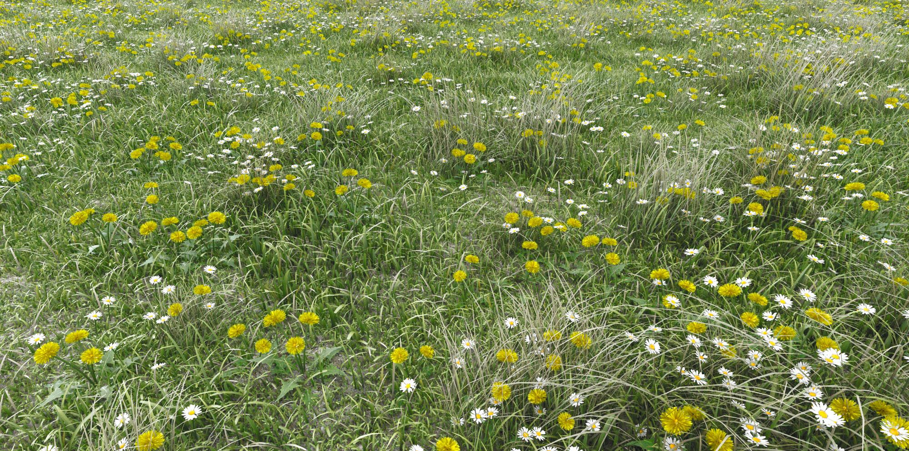
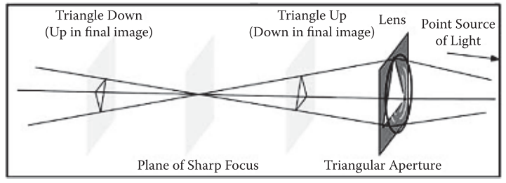

# Screen-Space Grass



## 1. 介绍

在这一章中，我们介绍了一种在**屏幕空间**中真实渲染**背景草**的新颖技术。


## 2. 驱动

**渲染远处草地**的通常方法需要生成和处理**大量的几何体或实例**，这将消耗大量的`CPU`和`GPU`资源，主要局限性在于它**不太适合覆盖大地形**。为了解决这个问题，我们考虑了一个问题：当人们在远处看草的时候，实际上看到的是什么？你看不到许多单独的草叶，也看不到任何详细的草的运动。你所看到的是一些**嘈杂运动**、风的模式，以及一些只在边界区域（草停止的地方，地形变为其他材料）的草叶。根据这些观察，我们决定使用**屏幕空间的噪声**来实现我们的草。

这种技术的优点在于它**非常便宜，非常逼真**。它不需要任何额外的资源或预处理，它在整个地形上有**很好的扩展性**，而且它可以扩展到场景中的**很远的距离**。它也很容易集成到现有的渲染管线中。**这种技术并不包括附近的草的渲染**，在那里单个的草是实际可见的。近距离草地渲染是一个非常好的话题，鼓励读者去看[Pelzer 04]和[Whatley 05]。

> [Pelzer 04] Kurt Pelzer. “Rendering Countless Blades of Waving Grass.” In GPU Gems, edited by Randima Fernando, Chapter 7. Upper Saddle River, NJ: Addison-Wesley, 2004.
> 		[Whatley 05] David Whatley. “Toward Photorealism in Virtual Botany.” In GPU Gems 2, edited by Matt Pharr, Chapter 1. Upper Saddle River, NJ: Addison- Wesley, 2005.


## 3. 技术

==屏幕空间草==（`SSG`）在后期处理中被渲染成**全屏四边形**。它需要某种我们从**相机空间位置**得到的**每像素深度信息**，但它也可以用于**没有深度信息的渲染管道**（通过读取其他方式的深度信息或**忽略障碍物检测**）。完整的算法包括两个阶段。

- 地形模版遮蔽
- 后处理`pass`

在渲染地形的时候，我们必须用一个**独特的模版值**对其进行`stencil-mask`。我们对**地形**使用`2`的模版遮罩值，对其他东西使用`1`。

在后处理过程中，我们用**SSG着色器**执行全屏`pass`。该**SSG着色器**对两种纹理进行采样：**场景的颜色缓冲区**和**位置纹理**（或者可以衍生出位置的**深度缓冲区**）。颜色纹理用于**颜色采样**和**污点效果**，而**位置纹理**则用于**草地比例**和**物体障碍物检测**。`SSG`应该在**不透明的渲染阶段和光照完成后**计算。这样我们就有了最终的帧缓冲区颜色，但在**边缘检测、雾化和其他后处理效果**之前，应该计算`SSG`。

### 生成真实的草噪声

为了产生**草噪音**，我们使用了一个简单的**垂直由上向下的污点`smudge`**。这是一个非常简单的想法，可以产生真实的**草噪音**和**边缘鳍`edge fins`**。

在现实中，草是向上生长的，但在我们的案例中，**将草向下 "涂抹`smudging`"**简化了我们的**模版蒙版**，因为它允许我们使用**原始地形几何图形**来生成**模版蒙版**（在同一`pass`中）。要创建一个**向上的污点`smudge`**，我们需要以某种方式将**模版蒙版**向上延伸。对于我们的`smudge`功能，我们使用了一个简单的调制的**屏幕空间量化**。

```c++
float xx = inSPos.x / TDeviceSize [0].x; 
float yy = inSPos.y / TDeviceSize [0].y; 
float d = _blend(len, 0, 500, 100, 500);
float dclose = _blend(len, 0, 20, 30, 1); 
d *= dclose; 

yy += xx * 1000 / d; 

float yoffset = frac( yy * d ) / d;
```

来自`inTex0.xy - float2( 0 , yoffset )`的**源像素**将被渲染到`Tex0.xy`的**目标像素**（输出像素。通过这个公式，我们可以得到一个**垂直的草地污损效果**，如下图。为了打破**有规律的垂直线条**并增加一点噪音，我们把：

```c++
yy += xx * 1000
```


然而，对于某些游戏来说，为了达到某种视觉效果**，直的垂直线**可能实际上是可取的。以达到某种视觉效果（例如，《工业巨人3》使用直线；见下图）。


**模版遮盖区域**上边缘的地形像素将被**模版遮盖空间以外的像素**弄脏，形成地形山脊顶部的**草叶效果**，如下图所示。


### 是真实的草吗

**整个地形**不一定是由**草**组成的。我们也希望能够渲染道路、泥土和沙地，以及其他没有被草覆盖的区域。我们还希望支持在草地地形之上渲染物体。当然，这样的物体被`stencil`遮挡住了；**草污效果**会把它们误认为是草的像素（源像素），即使它们正好在`stencil`标记的区域之外（`stencil`标记的区域像素只保证不成为**SSG效果**的**目标像素**）


**模板遮蔽的地形**中不含草的区域可以通过**简单的测试**来过滤掉——检查像素是否为**绿色**。虽然这看起来太简单了，但我们发现它在检测草地方面效果很好。

```c++
int isgreen = backcolor.g > backcolor.r + 0.01f && backcolor.g > backcolor.b + 0.01f;
```

这个**检测绿色像素**的简单测试是要求`stencil mask`的主要原因。如果我们没有`stencil mask`，那么屏幕上所有的绿色像素都会被视为草。当然，有了模版遮蔽，我们还可以得到一点速度上的优化，因为只有**地形像素**被**SSG着色器**处理。其他游戏可能会发现使用一个**备用的alpha通道**来标记他们的草，而不是依靠**像素颜色**来检测草，这样更方便。值得一提的是，**类似的噪声效果**对于模拟远处树木上的**微观树叶运动**也是非常好的。

**视觉伪影**可能是由于**不属于地形的源像素**被弄脏而造成的。当一个物体被渲染在地形之上时就会发生这种情况（例如，树木和其他道具）。为了检测这些像素，我们必须从**源像素的位置纹理**中提取一个额外的样本。如果源像素比目标像素更靠近摄像机，那么**它就不应该被污损到目标像素**上（另见图13.7）。

```c++
float4 poscs2 = tex2D( Color1SamplerPoint , uvoffset ); 
if( poscs2.z < poscs.z ) return backcolor;
```


## 4. 总结


## 5. 限制

`smudge`效果的实现是完全垂直的，因为它**不使用摄像机的倾斜**，因此对于**倾斜摄像机的游戏**来说是不方便的。我们需要为这种情况开发**另一个污点函数**。

我们还想在草丛噪声功能中加入**逼真的风动**。一个非常有趣的效果：使用**目标像素的颜色**作为一个**额外的噪声调节器**：

```c++
yy += backcolor.g * 0.04f;
```

如前所述，类似的效果也可以用来模拟**远处树木的微观树叶噪声**。


## 6. SSG源码

***SSG.fx***

```c++
float4 TDeviceSize [2]; // rtt size in TDeviceSize[0].xy 
float4 TTimer [1]; 		// game time in TTimer [0].w

void vsmain(float3 inPos : POSITION ,
			float3 inTex : TEXCOORD ,
			//
            out float4 outPos : POSITION ,
            out float4 outTex0 : TEXCOORD0 ) 
{
	outPos = inPos; 
    // 
    outTex0 = inTex; 
    // half pixel offset 
    outTex0.xy += TDeviceSize [1].zw; // 0.5f / rtt size in [1].zw
}

float _blend(float val , float val0 , float val1 , float res0 , float res1)
{
	if( val <= val0 ) return res0; 
    if( val >= val1 ) return res1; 
    //
    return res0 + (val - val0) * (res1 -res0) / (val1 - val0);
}

float4 psmain(float4 inTex0 : TEXCOORD0 , 
              float2 inSPos : VPOS) : COLOR 
{
    // get target depth 
    float4 poscs = tex2D( Color1SamplerPoint , inTex0.xy);
    
    // 
    float len = length(poscs.xyz);
    // 
    float4 backcolor = tex2D(Color0SamplerPointClamp, inTex0.xy);
    
    // check if color is green (aka grass) 
    int isgreen = backcolor.g > backcolor.r + 0.01f && backcolor.g > backcolor.b + 0.01f;
    
    // 
    if( isgreen ) {
    	float4 color =0;
        // rtt size in TDeviceSize [0].xy 
        float xx = inSPos.x / TDeviceSize [0].x; 
        float yy = inSPos.y / TDeviceSize [0].y; 
        // 
        float d = _blend( len , 0 , 500 , 100 , 500 ); 
        float dclose = _blend( len , 0 , 20 , 30 , 1 ); 
        // 
        d *= dclose;
        // 
        yy += xx * 1000;
        // add a little wind movement 
        yy += TTimer [0].w * 0.004f; 
        // 
        float yoffset = frac( yy * d ) / d; 
        // 
        float2 uvoffset =i nTex0.xy - float2(0, yoffset ); 
        // 
        color = tex2D(Color0SamplerPointClamp, uvoffset);
        // check if obstructed
        // get source depth 
        float4 poscs2 = tex2D( Color1SamplerPoint , uvoffset );
        // check if source is closer to camera than target 
        if( poscs2.z < poscs.z ) return backcolor; 
        // blend a bit 
        return lerp( backcolor , color , saturate( 1-yoffset * d / 3.8 ) );
	} 
    // 
    return backcolor;
}

technique defaultshader {
    pass p0 {
        CullMode = None;
        ZEnable = false;
        ZWriteEnable = false; // 
        StencilEnable = true; 
        StencilFunc = Equal;
        StencilPass = Keep;
        StencilFail = Keep;
        StencilZFail = Keep; 
        StencilRef = 2; // stencil mask is set to 2
        // 
        VertexShader = compile vs_3_0 vsmain (); 
        PixelShader= compile ps_3_0 psmain (); 
    } 
}

```


# Screen-Space Deformable Meshes via CSG with Per-Pixel Linked Lists


## 1. 介绍

在这一章中，我们描述了一种**变形网格方法**，该方法通过使用存储在`GPU`内存中的**每像素链接列表数据结构**，实现**构造实体几何（CSG）算法**。通过这种方法，所提出的**CSG算法**能够有一个**恒定的传递次数**。这与标准的**基于图像的CSG**实现形成鲜明对比，后者**所需的渲染次数**随着场景的深度复杂性而**线性增加**。尽管`union`、`intersection`和`difference CSG`操作都可以通过这种方法进行渲染，但本章重点讨论`difference`操作，因为它可以产生一个**可变形的网格场景**。此外，在一个特定的情况下，对CSG算法的行为进行了修改，以适当地针对**可变形网格的情况**。这里提出的解决方案是通用的，不对**场景的拓扑结构**做任何假设，并且适用于任何凹、凸或平面的网格。

//todo 

//PS：不是很感兴趣，估计不会补充了


# Bokeh Effects on the SPU


## 1. 介绍

许多游戏使用景深（`DOF`）来将玩家的注意力集中在**画面的某一特定部分**，并在渲染的图像中加强**深度幻觉**。通常情况下，为了创造游戏中的**景深镜头效果**，我们对**帧缓冲区的副本**进行模糊处理，并根据每个像素到焦平面的距离，在模糊和非模糊的版本之间进行插值。多年来，使用的模糊技术只是一个**简单的高斯模糊**，以接近镜头效果；

然而，一种新的技术即将出现，使我们能够实现一个**更真实的、电影般的DOF效果**。它被称为 "==虚化==`bokeh`"，一个日语单词，意思是 "迷惑 "或 "眩晕"。在我们的语境中，我们用它来限定应用于**图像失焦部分**的**模糊的审美质量**。通常情况下，**虚化效果会使高光或光源模糊成圆盘**，或显示相机镜头中虹膜片数量的形状。


在2011年GDC大会上，由虚幻引擎驱动的**Samaritan技术**演示中展示了一个`DirectX11`实现。这种技术增强了`DOF`的效果，使之更接近于我们经常在电影中看到的样子。但在本章中，我将重点介绍基于精灵`sprite-based`的方法，它被应用于`PS 3`，并带有==协同处理单元==（`SPU`）的扭曲`twist`！ 本章将解释如何使用`SPU`来分析**帧缓冲区的亮度**并生成**虚化的绘制调用**，而不是使用`DX11 API`中的计算着色器、几何着色器或`DrawInstancedIndirect`调用功能。


## 2. 场景背后的虚化

要了解什么是==虚化效果==，我们首先需要了解**景深**。**景深**是指物体出现在焦点平面上的距离。这个区域以外的物体被认为是**失焦的**，会显得**很模糊**。要理解的一件事是，物体不会突然从清晰变成不清晰。当它离焦点越远，它就会逐渐失焦。由于它是一个**梯度**，我们用**混淆圈（CoC）**的大小来**量化模糊程度**。一个特定像素的`CoC`值越大，你对其应用的模糊度就越大。反之，`CoC`值越小，该像素就越清晰。


`CoC`值将在$[0, 1]$​的范围内变化，并将表明该像素的**对焦或失焦程度**。==模糊量==，一般以**像素大小**为单位，将乘以像素的`CoC`，以找到帧缓冲区中特定像素的模糊量。最大的模糊值将由游戏驱动，艺术家们可以通过调整来实现所需的**DOF效果**。

那么，虚化与这一切有什么关系？嗯，**虚化与镜头的光圈密切相关**，或者更准确地说，==光圈的形状==。在真正的相机上，通过镜头的光量是由光圈控制的。如下图所示，安装在镜头中的**一组叶片**控制着**进入相机的光线**。通常情况下，在**完全打开光圈**的情况下，你会有一个漂亮的**圆形虚化形状**。





## 3. 基于精灵的方法

**基于精灵的虚化效果**非常简单易懂，而且非常灵活，允许艺术家修改以达到预期的效果。其主要思想是：对帧缓冲区的每个像素进行分析，分析其亮度：


为了分析**帧缓冲区的每个像素**，你从一个**滤波核**开始，分析当前像素周围的像素。内核的大小越大，亮度计算的成本就越高。（见上图）在我的测试中，采用一个简单的案例，所以**内核大小**等于`1`，**缓冲区降级`2`倍**。结果在性能和质量上都相当不错。使用**过滤内核**，计算每个像素的亮度，**如果亮度像素高于某个阈值，就在像素的屏幕空间位置生成一个纹理精灵**（见下图）。这个**亮度阈值**可以由艺术家编辑，这样他们就可以调整：当**像素失焦**时，在哪个亮度值上会产生一个**虚化精灵**。对每个像素进行**阈值测试**，就能得到一个**能产生虚化精灵的像素列表**。最后一步是为**虚化精灵**计算一个**适当的比例**。规模通常有一个最大的尺寸，这也是艺术家可以编辑的。在这一步，**像素的深度值被用来确定该像素的失焦程度**。这代表了前面提到的**混乱圈**，在其最大值时，它代表了一个**完全开放的光圈**。


简而言之，你需要计算**像素的失焦程度**，并对你将产生的$1×1$**虚化精灵**应用一个**像素比例**。像素失焦越多，精灵在屏幕上就会越大。如果比例值是`20`像素，那么在**完全失焦的像素**处生成的虚化精灵将是$20×20$像素。(见下图）


在这个过程的最后，你将得到一个包含以下内容的**精灵列表**：

- 像素的`x`屏幕空间位置
- 像素的`y`屏幕空间位置
- 像素的`z`线性值，需要在像素着色器中对**虚化的精灵**进行**深度测试**。
- 虚化纹理的**UV坐标**。
- 像素的**CoC值**，用于**调整混合量**以保持能量的节约。
- 像素的颜色值

## 4. Let’s SPUify This!

在`PS3`上，==内存被一分为二==：**主内存**和**视频内存**。由于性能和内存占用的原因，典型管道将**主颜色缓冲区**放在**视频内存**中。由于`SPU`喜欢在**主内存中的缓冲区**工作（读/写模式），第一步是将**主颜色缓冲区**转移到**主内存中**。`SPU`可以在放在视频存储器中的缓冲区上工作，但写入速度会比较慢。

在**现实合成器**（`RSX`）将颜色缓冲区转移到主存储器后。`SPU`可以开始**分析扫描线**，以找到每个可能的位置来生成一个**虚化精灵**。基本上，`SPU`将在主内存中**保留的顶点缓冲区**中写入**精灵信息**，`RSX`将处理这些信息以显示**虚化精灵**。然后**SPU程序**会修补之前在命令缓冲区中**预留的绘制调用**，并删除**跳转到自我**（`JTS`）。在这个过程中，我们计算出**色调映射**步骤中所需要的**颜色缓冲区的平均亮度**，使我们能够**节省**图形处理单元（`GPU`）的**降频步骤**，以找到颜色缓冲区的平均亮度


该效果非常类似于DirectX 11 API中的**虚化效果**，使用计算着色器。让我们详细介绍一下不同的步骤。
1. 将**颜色缓冲区**转移到**主内存**。你可以根据你想要的虚化效果的预算或质量，以**全分辨率或半分辨率**传输
2. 准备`n`个**SPU作业**，在**颜色缓冲区的一个子部分**工作，分析**像素亮度**。
3. 每个`SPU`用**虚化精灵的信息**填充一个**顶点缓冲区**。
4. 在`PPU`上，在命令缓冲区中为`SetDrawArrays`保留空间。由于`SetDrawArrays`命令在命令缓冲区中的大小是可变的，这取决于顶点的数量，我们必须声明**顶点的最大数量**，并在命令缓冲区中保留该空间。在每个`SetDrawArrays`之前插入`JTS`命令，这样`RSX`就会等待直到`SPU`完成。
5. 在`PPU`上，我们发出`n`个绘制调用，工作在`n`个顶点缓冲区上，这取决于我们决定生成的**处理帧缓冲区的SPU作业的数量**：例如，如果我们决定创建两个SPU作业，这两个作业将工作在一半的帧缓冲区上，我们将需要在PPU上发出**两个绘制调用**，每个使用自己的顶点缓冲区（所以是两个顶点缓冲区）并由SPU作业进行修补。请注意，精灵是以**加法混合模式**在颜色缓冲区的顶部渲染的。
6. 在`SPU`上，每个虚化工作分析像素，并为每个通过亮度阈值的像素**生成一个虚化精灵**，并以`CoC`系数进行**缩放**。该比例被钳制为**最大的虚化比例大小**（在像素空间）。
7. 每个精灵都被写入**顶点缓冲区**（屏幕空间中的x、y、z位置 + UVs + 颜色），`SetDrawArrays`被补上正确数量的顶点。其余的保留空间用`NOP`来填充

```c++
void SetDrawArrays( ContextData *thisContext, const uint8_t mode ,const uint32_t first , const uint32_t count)
```


8. `SPU`给`JTS`打补丁，以便`RSX`能够处理·图形命令。
9. `RSX`使用**加法混合法**绘制**每一批虚化精灵**。
10. **深度测试**是在像素着色器中完成的，因为我们在顶点缓冲区中有精灵的**Z位置**。
11. 调整混合量以能量守恒。

有多种方法可以隐藏`SPU`所做的**亮度分析**和虚化的调用步骤。我的案例中，决定在混合对象之后立即启动`RSX`传输。这给`SPU`留下了足够的时间来分析帧缓冲区并填充顶点缓冲区，`RSX`将用它来显示帧缓冲区上面的虚化精灵。要记住的是要小心不要让`RSX`停滞。这一切的一个好处是，通过在`SPU`上进行亮度计算，你可以免费获得总的帧亮度！


