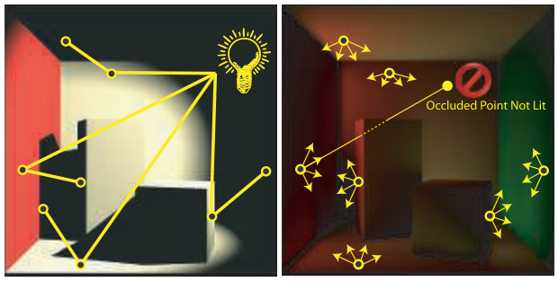
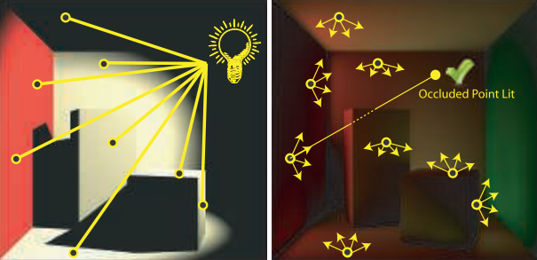

[toc]

# Fast, Stencil-Based Multiresolution Splatting for Indirect Illumination

## 1. 介绍

在选择**交互式全局照明算法**时，必须考虑重要的权衡：

- **屏幕空间近似**，虽然容易实现，但通常只在**相邻的几何体之间**实现互动，而且在图像不连续处会出现问题。
- **光线追踪技术**在完全动态的场景中存在困难，需要许多光线来**避免欠采样**。
- **即时辐射解决方案**，通常基于**反射阴影图**，强调`GPU`的**填充率**，并与用于近似照明的**虚拟点灯数量**成线性关系。

本章介绍了对**交互式即时辐射度解决方案**的改进，通过使用==多分辨率拼接==，大大降低了填充率，并演示了使用**模板缓冲器**的有效实现。与最初的**多分辨率拼接**不同，这个实现没有通过**几何着色器**进行**放大**，因此仍然在`GPU`的**快速路径**上。相反，我们利用**GPU的分层模版剔除功能**，在适当的分辨率下有效地渲染照明。

## 2. 回顾：立即辐射度

快速渲染**复杂光照**的一种方法是**即时辐射度**，这实际上有点名不符实。**即时辐射度**可以被认为是**双向路径追踪的一个变种**，即从光源和视点追踪路径，然后结合起来以**减少**计算出的**光照度的变化**。下图描述了**即时光照度的双向方法**是如何工作：

- 首先，**光子**被发射出来。这些光子可能会反弹若干次，每个光子与表面的交点都成为一个**虚拟的点光**（或`VPL`）。
- 在第二阶段，**来自眼睛的路径**被发射出来，沿着路径的**每个交叉点**收集来自`VPLs`和**原始灯光**的直接光线。

图形硬件可以通过为每个`VPL`渲染一个**阴影图**，并使用**标准的硬件灯光**来执行每个像素的着色计算，来加速**即时的辐射性**。然而，**路径发射**通常发生在`CPU`上，动态场景中的**高质量照明**需要每一帧有成千上万的`VPLs`（和它们的**阴影图**`shadow maps`）。

## 3. 回顾：Reflective Shadow Maps

**反射阴影贴图**`Reflective Shadow Maps`通过**增加一些假设**来提高**即时辐射性的性能**，这些假设允许完全在`GPU`上有效实现。特别是，**全局照明**被限制在`single bounce`。此外，`VPL`的**可见性被忽略**，允许`VPL`照亮所有像素。基本算法如下：

1. 渲染一个由**位置、法线和颜色**组成的`shadow map`。
2. 从这个阴影图中选择`VPLs`
3. 直射光渲染
4. 对于每个VPL：
   - 

