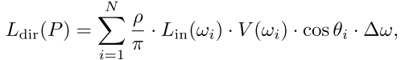

[toc]


# Fast, Stencil-Based Multiresolution Splatting for Indirect Illumination


## 1. 介绍

在选择**交互式全局照明算法**时，必须考虑重要的权衡：

- **屏幕空间近似**，虽然容易实现，但通常只在**相邻的几何体之间**实现互动，而且在图像不连续处会出现问题。
- **光线追踪技术**在完全动态的场景中存在困难，需要许多光线来**避免欠采样**。
- **即时辐射解决方案**，通常基于**反射阴影图**，强调`GPU`的**填充率**，并与用于近似照明的**虚拟点灯数量**成线性关系。

本章介绍了对**交互式即时辐射度解决方案**的改进，通过使用==多分辨率拼接==，大大降低了填充率，并演示了使用**模板缓冲器**的有效实现。与最初的**多分辨率拼接**不同，这个实现没有通过**几何着色器**进行**放大**，因此仍然在`GPU`的**快速路径**上。相反，我们利用**GPU的分层模版剔除功能**，在适当的分辨率下有效地渲染照明。


## 2. 回顾：立即辐射度

快速渲染**复杂光照**的一种方法是**即时辐射度**，这实际上有点名不符实。**即时辐射度**可以被认为是**双向路径追踪的一个变种**，即从光源和视点追踪路径，然后结合起来以**减少**计算出的**光照度的变化**。下图描述了**即时光照度的双向方法**是如何工作：

- 首先，**光子**被发射出来。这些光子可能会反弹若干次，每个光子与表面的交点都成为一个**虚拟的点光**（或`VPL`）。
- 在第二阶段，**来自眼睛的路径**被发射出来，沿着路径的**每个交叉点**收集来自`VPLs`和**原始灯光**的直接光线。


图形硬件可以通过为每个`VPL`渲染一个**阴影图**，并使用**标准的硬件灯光**来执行每个像素的着色计算，来加速**即时的辐射性**。然而，**路径发射**通常发生在`CPU`上，动态场景中的**高质量照明**需要每一帧有成千上万的`VPLs`（和它们的**阴影图**`shadow maps`）。


## 3. 回顾：Reflective Shadow Maps


**反射阴影贴图**`Reflective Shadow Maps`通过**增加一些假设**来提高**即时辐射性的性能**，这些假设允许完全在`GPU`上有效实现。特别是，**全局照明**被限制在`single bounce`。此外，`VPL`的**可见性被忽略**，允许`VPL`照亮所有像素。基本算法如下：

1. 渲染一个由**位置、法线和颜色**组成的`shadow map`。
2. 从这个阴影图中选择`VPLs`
3. **直射光**渲染
4. 对于每个VPL：
   - 在`eye-space`中以`VPL`为中心画一个 "飞溅"
   - Each **splat fragment** illuminates **one pixel** from **a single VPL**
   - 将这些`fragments`混合到**直接照明缓冲区**中。

对于一个完整的解决方案，每个`VPL`都必须影响到每个像素，这就要求每个`VPL`都有一个**全屏溅射**`full-screen splat`。不幸的是，这将消耗大量的填充率，并随着**分辨率**或**VPL采样**的增加而**迅速降低性能**。降低溅射过程中使用的**缓冲器分辨率**可以提高性能，但代价是在**不连续的地方**和高频的法线变化上**模糊照明**。另外，可以在`VPL`周围渲染**较小的聚焦溅射**，但由于`VPL`不能影响每个像素，结果会显得**不自然的黑暗**。


## 4. Multiresolution Splatting

==多分辨率溅射==`Multiresolution splatting`通过将`splats`渲染到**不同分辨率的多个缓冲区**来解决填充率问题。这允许每个`VPL`的`full-screen splat`，但允许**自适应选择`splat`的分辨率**，以减少**光照变化缓慢**时的填充率。在不能接受模糊的地方，`splats`以高分辨率渲染。

使用原始的`splatting`技术，每个`full-screen splat`覆盖一百万个`fragments`（$1024^2$）。`Multiresolution Splatting`将其减少到大约`60000`个多分辨率`fragments`，如下图中。


### 实现Multiresolution Splatting

实现这种**多分辨率方法**与第3节中的技术非常相似：

1. 渲染一个由位置、法线和颜色组成的`shadow map`。
2. 从这个**阴影图**中选择`VPLs`。
3. 从`eye`进行直射光渲染。
4. 对于每个`VPL`：
   - 绘制一个**全屏的 "飞溅"**。
   - 每个`splat fragment`照亮一个来自单一`VPL`的`texel`，尽管这个`texel`最终可能影响到多个像素。
   -  将每个片段混合到**适当的多分辨率缓冲区**。

5. 合并、上采样和内插**多分辨率缓冲区**。
6. 将**插值后的照明**与直射光结合起来。

这有两个关键的**算法差异**：`splats`被分割成不同分辨率的`fragments`群（在步骤4b），**多分辨率缓冲区**在与直射光混合之前需要**上采样到最终分辨率**（在步骤6）。这些将在第4.2和4.3节讨论。

### 迭代Splat细化

事实证明，在**不同的分辨率**下将`splats`分割成`clusters of fragments`是相当耗时的。我们之前的工作使用了迭代细化的方法，如下图所示。对于每个`VPL`，这种迭代方法在可能的**最粗的照明缓冲区分辨率**下产生一个`full-screen splat`。在每个片段中，我们确定这种**粗放的采样**是否由于**片段内部的不连续**而使光照变得不可接受。**不可接受的模糊**会导致将该片段细化为**四个更细的分辨率片段**。否则，**粗略的样本**将被单独留下。这个过程反复进行，直到**没有不可接受的模糊存在**或者我们细化到**最终的图像分辨率**。


我们的实现使用一个**廉价的预处理程序**来执行**初始的粗$16^2$​​​​​​​​​​​采样**，并存储到一个**小的顶点缓冲区**。**外部for循环**由`CPU`管理，每个循环周期调用一个**渲染`pass`**。一个**几何着色器**处理每个`patch`，检查图像的**不连续性**，并有选择地输出原始输入`patch`或`4`个细化`patch`。输出的`patch`列表要么被**反复细化**，要么被渲染，作为多分辨率的`fragments`（见下清单）。


这里，`multiresolution fragments`在每个`VPL`渲染一次。我们发现**颠倒循环的顺序**，只渲染一次多分辨率片元，并从所有的`VPLs`收集照明，通常会有更好的性能。此外，迭代`patch`细化可以在每个`splat`处发生一次，也可以在每一帧发生一次。第二种方法导致**更高的性能**，以换取更不灵活的细化度量。


### Upsampling多分辨率照明缓冲区

由于我们的**多分辨率照明缓冲区**包含**不同分辨率的片元**以及大的空区域，我们需要一个==上采样阶段==来重新创建一个完全填充的高分辨率缓冲区。这种上采样基本上使用了 "**推拉"填隙算法**中的 **"拉 "的步骤**。最粗分辨率的缓冲区被上采样`2`倍，**双线性插值**只发生在有效的纹理之间（即那些被`coarse splat fragments`覆盖的纹理）。内插的结果与**下一个更精细的分辨率缓冲区**相结合，上采样、内插和结合的过程**反复进行**，直到达到**一个完整的、全分辨率的间接照明缓冲区**。

请注意，一个$w_i$​​必须是非零的（否则`InvalidTexel( p, coarserImage )`将为真）。


## 5. Fast Stencil-Based Multiresolution Splatting

//todo


# Screen-Space Directional Occlusion


## 1. 介绍

对于大型动态场景，**实时全局照明**仍然是一个未解决的问题。目前，实时帧率只能通过近似值来实现。其中一个近似方法是**环境遮蔽**（`AO`），由于其良好的视觉质量和简单的实现，经常被用于计算机游戏中。其**基本思想**是预先计算**网格表面**几个地方的**平均可见度值**。然后在运行时将这些值与图形硬件提供的**无遮挡光照度**相乘。通常情况下，**可见度值是预先计算的**，并存储在网格的每个顶点或`texel`上。**平均可见度**是通过在**表面点的上半球**发射一些射线并计算**被阻挡的射线的数量**来计算的。由于可见度和光照的分离，`AO`只是实际光照的一个粗略的近似，但其结果往往**在视觉上是可信的**。

在本章中，我们提出了一个`AO`的扩展，它可以正确地显示**定向和彩色的阴影**，并额外计算**一个间接的光线反弹**。由于我们的方法是在**图像空间**中工作的，它与场景的复杂性无关。


## 2. SSAO

`AO`的一个缺点是，它**只适用于静态场景**。如果为每个顶点或`texel`预先计算了可见度值，那么如果网格发生变形，这些值就会失效。[Bunnell 06]和[Hoberock and Jia 07]提出了一些关于**动态场景**的最初想法，即用**圆盘的层次结构**来逼近几何。**处理动态场景的最简单方法**是根据帧缓冲区的信息计算`AO`，即所谓的`SSAO`。在这里，**深度缓冲区**被用来即时计算**平均可见度值**，而不是预先计算。`GPU`的计算能力足以实时计算`SSAO`。此外，这种方法不需要任何特殊的场景几何表示，因为只有**帧缓冲区中的信息**被用来计算**遮挡值**。


为了解释我们方法的不同之处（见上图），首先看看标准`SSAO`的计算方法：对于帧缓冲区中的每个像素，我们检查一些**邻近的像素**并读取它们的**深度值**。这使我们能够计算出**相应的三维位置**，我们可以在那里放置一个用户定义的小球。现在为每个球体计算一个**闭塞值**，它取决于球体相对于**接收点**的实体位置。这些闭塞值都被累积为一个单一的环境闭塞值。最后，用标准的`GPU`流水线计算来自所有方向的**未被遮挡的光照**，`AO`值与这个**未被遮挡的光照**相乘。

### SSAO的问题

**环境遮蔽**通常显示**空腔**和**接触阴影**的变暗，但所有**入射光线的方向性信息**都被忽略了。发生这种情况是因为只有**几何图形**被用来计算**环境遮挡**，而**实际的照明被忽略**了。一个典型的案例如下图所示：在入射光线有**方向性变化**的情况下，**环境遮蔽**会显示**错误的颜色**。因此，我们将`SSAO`延伸到更现实的照明，我们称之为==屏幕空间定向遮挡==（`SSDO`）。由于我们在`fragment`程序中**循环通过**一些相邻的像素，我们可以为每个像素计算一个**单独的可见度值**，而不是将所有的信息折叠成一个**AO值**。因此，==基本的想法==是：使用来自每个方向的**入射光线的可见度信息**，只从可见的方向进行照明，从而形成一个**定向照明**。对于`SSDO`的进一步描述，假设我们有一个深的**帧缓冲区**，其中包含每个像素的**位置、法线和反射率值**。


## 3. SSDO

由于我们**不能直接发出射线**来测试**给定方向的可见性**，我们需要对可见性进行**某种近似计算**。这里我们假设每个**点周围的局部几何**是一个**高度场**。因此，**对可见性的测试**简化为**测试一个采样点是在表面以下还是以上**。所有**低于表面**的采样点都被视为**遮挡物**，而**高于表面**的采样点则被归类为**可见**。我们的算法如下图所示，可以总结如下：

- 首先，在像素的三维点周围放置一个**半球**，该半球沿**表面法线方向**。这个半球的半径 $r_{max}$是一个用户参数，决定了搜索阻挡物的**局部邻域的大小**。
- 然后，一些**三维采样点**均匀地分布在半球内。同样，采样点的数量`N`是一个**用户参数**，用于时间质量的权衡。现在我们测试每个采样方向的光照。
- 我们将每个采样点**反投影**到`deep frame buffer`。我们可以读取**表面上的三维位置**，并将每个点移动到表面上。如果采样点**向观察者移动** ，它最初是在表面以下的，它被归类为==被阻挡==。如果它**远离观察者**，那么它最初是在表面以上的，它被归类为==可见==。
- 在下图中，只有`C`是可见的，所以只计算`p-C`方向上的光照。


### 直接照明


对于**自然光照**，我们使用一个**环境图**。由于我们试图保持**较少的样本数量**，我们在**预处理**中模糊了环境图。**滤波器的内核**被调整为**一个样本的实体角度**。通过这种方式，我们计算出一个采样方向的实体角度的**平均辐射度**，并避免了**闪烁的假象**。由于环境图中**每个像素的实体角度都不同**，因此需要一个**空间变化的过滤器**。然而，我们发现可见的误差很小，因此**使用了一个具有固定核大小的高斯滤波器**。最后，直接照度可以按以下方式计算：



其中，$\Delta w=\frac{2\pi}{N}$​。

请注意，我们使用的环境图包含**两个主要的光源**：天花板上的**橙色灯**和从窗户进来的**浅蓝色光照**。`AO`不能正确地显示所产生的阴影，因为**传入的光照被忽略了**，只使用**平均可见度值**。所以产生的`AO`基本上由**静态的、灰色的接触阴影**组成。但事实上，这种光照导致了**两个彩色的、有方向性的阴影**，用`DO`可以正确地再现。下图显示了`DO`和`AO`之间的**视觉差异**：


下列清单显示了**GLSL片段程序**的主要部分，用于计算` SSDO`。我们使用了一个`deep`**帧缓冲区**，它包含了世界坐标和法线（`positionTexture`和`normalTexture`）。此外，我们使用**预计算**好的**随机采样点**，这些采样点均匀地分布在**一个单位半球**中。这些采样点被存储在一个**二维纹理**（`seedTexture`）中，其中每一行包含`N`个不同的采样点。

然后每个像素根据**像素的位置**选择**不同的线**（见第`4`节）。然后，围绕**像素法线**的`local frame`被计算出来，**采样点**被**半球半径**（`sampleRadius`）缩放并旋转到`local frame`中。然后，这个**世界空间的采样位置**被探测到**当前帧的缓冲区**，并计算出**相应的纹理坐标**（`occluderTexCoord`）。

接下来，我们在这个纹理坐标处**读取位置缓冲区**，并获取**缓冲区深度和采样深度**。由于我们沿着**负的Z轴**观察，所有的深度值都将是**负的**。如果`-sampleDepth`小于`-depth`，说明**采样点向观察者移动**，我们发现了一个遮挡者。由于实际原因，我们忽略了**投影采样位置**在半球之外的遮挡者。否则，**所有物体的剪影边缘都会变暗**。我们不使用`0`和`1`来表示可视性，而是增加一个**用户控制的参数**来调整**SSDO的强度**。因此，辐射的总和 `directRadianceSum`可能会变成负数，我们必须在循环后将其`clamp`为`0`。

[list 1]()

```c++
// Read position and normal of the pixel from deep framebuffer. 
vec4 position = texelFetch2D(positionTexture, ivec2(gl_FragCoord.xy), 0);
vec3 normal = texelFetch2D(normalTexture, ivec2(gl_FragCoord.xy), 0);

// Skip pixels without geometry. 
if(position.a > 0.0) {
	vec3 directRadianceSum = vec3 (0.0); 
    vec3 occluderRadianceSum = vec3 (0.0); 
    vec3 ambientRadianceSum = vec3 (0.0); 
    float ambientOcclusion = 0.0;
	
    // Compute a matrix that transform from the unit hemisphere. 
    // along z = -1 to the local frame along this normal 
    mat3 localMatrix = computeTripodMatrix(normal);
	
    // Compute the index of the current pattern. 
    // We use one out of patternSize * patternSize 
    // pre -defined unit hemisphere patterns (seedTexture ). 
    // The i’th pixel in every sub -rectangle uses always 
    // the same i’th sub -pattern. 
    int patternIndex = int(gl_FragCoord.x) % patternSize + (int(gl_FragCoord.y) % patternSize) * patternSize;
	
    // Loop over all samples from the current pattern. 
    for(int i = 0; i < sampleCount; i++) {
		
        // Get the i’th sample direction from the row at 
        // patternIndex and transfrom it to local space. 
        vec3 sample = localMatrix * texelFetch2D(seedTexture, ivec2(i, patternIndex), 0).rgb;
		vec3 normalizedSample = normalize(sample);
		
        // Go sample -radius steps along the sample direction , 
        // starting at the current pixel world space location. 
        vec4 worldSampleOccluderPosition = position + sampleRadius * vec4(sample.x, sample.y, sample.z, 0);

        // Project this world occluder position in the current 
        // eye space using the modelview -projection matrix.
        // Due to the deferred shading , the standard OpenGL 
        // matrix can not be used.
        vec4 occluderSamplePosition = (projectionMatrix * modelviewMatrix) * worldSampleOccluderPosition;
		
        // Compute the pixel position of the occluder: 
        // Do a division by w first (perspective projection), 
        // then scale/bias by 0.5 to transform [-1,1] -> [0 ,1]. 
        // Finally scale by the texure resolution. 
        vec2 occluderTexCoord = textureSize2D(positionTexture, 0) * (vec2(0.5) + 0.5 * (occluderSamplePosition.xy / occluderSamplePosition.w));
        
		// Read the occluder position and the occluder normal 
        // at the occluder texture coordinate. 
        vec4 occluderPosition = texelFetch2D(positionTexture, ivec2(occluderTexCoord), 0);
		vec3 occluderNormal = texelFetch2D(normalTexture , ivec2(occluderTexCoord), 0);
		
        // Compute depth of current sample pos. in eye space. 
        float depth = (modelviewMatrix * worldSampleOccluderPosition).z;
	
        // Compute depth of corresponding (proj.) pixel position. 
        float sampleDepth = (modelviewMatrix * occluderPosition ).z + depthBias;
        
        // Ignore samples that move more than a 
        // certain distance due to the projection 
        // (typically singularity is set to hemisphere radius ). 
        float distanceTerm = abs(depth - sampleDepth) < singularity ? 1.0 : 0.0;
		
        // Compute visibility when sample moves towards viewer. 
        // We look along the -z axis , so sampleDepth is 
        // larger than depth in this case. 
        float visibility = 1.0 - strength * (sampleDepth > depth ? 1.0 : 0.0) * distanceTerm;
		
        // Geometric term of the current pixel towards the 
        // current sample direction 
        float receiverGeometricTerm = max(0.0, dot(normalizedSample, normal));

        // Compute spherical coordinates (theta , phi) 
        // of current sample direction. 
        float theta = acos(normalizedSample.y); 
        float phi = atan(normalizedSample.z, normalizedSample.x); 
        if (phi < 0) phi += 2 * PI;
        
		// Get environment radiance of this direction from 
        // blurred lat/long environment map. 
        vec3 senderRadiance = texture2D(envmapTexture , vec2( phi / (2.0 * PI), 1.0 - theta / PI)).rgb;
		
        // Compute radiance as the usual triple product 
        // of visibility , radiance , and BRDF.
		// For practical reasons , we post -multiply 
        // with the diffuse reflectance color. 
        vec3 radiance = visibility * receiverGeometricTerm * senderRadiance;
        
		// Accumulate the radiance from all samples. 
        directRadianceSum += radiance;

        // Indirect light can be computed here 
        // (see Indirect Light Listing) 
        // The sum of the indirect light is stored 
        // in occluderRadianceSum
        [list 2]
	}
    
    // In case of a large value of -strength , the summed 
    // radiance can become negative , so we clamp to zero here.
    directRadianceSum = max(vec3(0), directRadianceSum); 
    occluderRadianceSum = max(vec3(0), occluderRadianceSum);

    // Add direct and indirect radiance. 
    vec3 radianceSum = directRadianceSum + occluderRadianceSum;

    // Multiply by solid angle and output result. 
    radianceSum *= 2.0 * PI / sampleCount; 
    gl_FragColor = vec4(radianceSum , 1.0);
} 
else 
{ 
	// In case we came across an invalid deferred pixel 
    gl_FragColor = vec4 (0.0);
}
```

### 光的间接弹射

`SSDO`可以正确处理**方向不同的入射光**。然而，到目前为止，我们只描述了**直射光**。此外，一些光从表面反射，导致==间接光==。一些离线技术，如Radiosity或Path Tracing，可以计算这种间接光，但对于动态场景来说，不能以实时帧率计算。与此相反，**我们再次在图像空间工作**，使用**存储在帧缓冲器中的直射光**作为间接光的来源：使用**平均反射率颜色**来近似于`color bleeding`。

与此相反，我们可以包括**发送者的方向**和实际**发送者的辐射度**。在上一节中，我们已经将**每个采样点**分类为**可见或隐蔽**。如果一个采样点被遮挡，我们假定没有光从这个方向到达。但事实上，被遮挡的只是直射光。相反，一些间接光从**遮挡器的位置**向接收点反射。为了计算这种间接光，我们使用**被归类为遮挡**的每个采样点的**像素颜色**$L_{pixel}$​​，并在表面上放置一个小的`colored patch`（见下图）**。像素的法线**被用来确定表面上`patch`的方向。现在，我们计算从这个发送器`patch`到达我们的接收点`P`的**光的比例**。


最后，`P`点的间接光可以被近似为：


$F_{rs}$就是到达的光比例。距离$d_i$应该被`clamp`以避免**奇异性问题**。或者，可以在分母中**加入一个常数**。发送方`patch`的面积为$A_s$。由于我们从单个像素中获取信息，我们不知道发送方的实际形状，所以我们把这个值设为$As = π\cdot r^2_{max}/N$​​​。如果我们假设`P`周围有一个**平坦的圆形区域**，并使用`N`个均匀分布的样本，每个样本将覆盖这个区域。根据半球内部的**斜率分布**，**实际值可以更高**，所以我们可以用这个参数来**手动控制渗色的强度**。在上图的例子中，没有计算`A patch`的间接光，因为它是背对着的。`B`和`D`都是间接光的发送者。清单`2`显示了计算**间接光**的片段程序：

[list 2]()

```c++
// Read the (sender) radiance of the occluder. 
vec3 directRadiance = texelFetch2D(directRadianceTexture, ivec2(occluderTexCoord), 0);

// At this point we already know the occluder position and 
// normal from the SSDO computation. Now we compute the distance 
// vector between sender and receiver. 
vec3 delta = position.xyz - occluderPosition.xyz; 
vec3 normalizedDelta = normalize(delta);

// Compute the geometric term (the formfactor ). 
float unclampedBounceGeometricTerm = max(0.0, dot(normalizedDelta, -normal)) * max(0.0, dot(normalizedDelta , occluderNormal )) / dot(delta , delta );

// Clamp geometric term to avoid problems with close occluders.
float bounceGeometricTerm = min(unclampedBounceGeometricTerm, bounceSingularity);

// Compute the radiance at the receiver.
vec3 occluderRadiance = bounceStrength * directRadiance * bounceGeometricTerm;

// Finally , add the indirect light to the sum of indirect light. 
occluderRadianceSum += occluderRadiance;
```

> 以上代码可以添加到**清单1**的循环末尾处


## 4. 交错式采样

为了减少每个像素的采样数量，我们使用==交错采样==。因此，我们预先计算$M×M$​​的**N低差值样本集**。在运行时，**M×M像素块**内的每个像素都会选择**其中的一个集合**。**低差异取样**确保每组包含**分布良好、均匀的样本**，没有一个优先方向。因此，每个像素都能计算出类似的光照度。（例如对于$9 \times 9\times N$的低差值样本集，就会产生如下所示的$9\times 9$方块伪影）

然而，由于我们使用了**相当少的样本数**，**重复的M×M模式**在图像中经常可见，整个图像看起来**有噪声**。为了**消除这种噪声**，最后使用了**对几何敏感的模糊处理**。下图显示了原始图像和模糊后的图像。对于几何感知模糊，大约**M×M的核大小**可以去除大部分的噪声。我们使用的滤波器检查了**滤波器核内的所有值**，但只对那些具有与**中心像素的位置和法线**相似的位置和法线的像素计算平均值。为了避免**材料边缘的模糊**，我们将**这个滤波器**应用于辐照度值，并与**模糊后的（彩色）像素反射率**相乘。为了进一步提高渲染速度，可以使用分离式滤波器：首先，使用**垂直滤波器**（1×M），然后将输出传给**水平滤波器**（M×1）。


