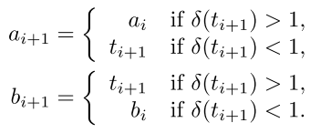
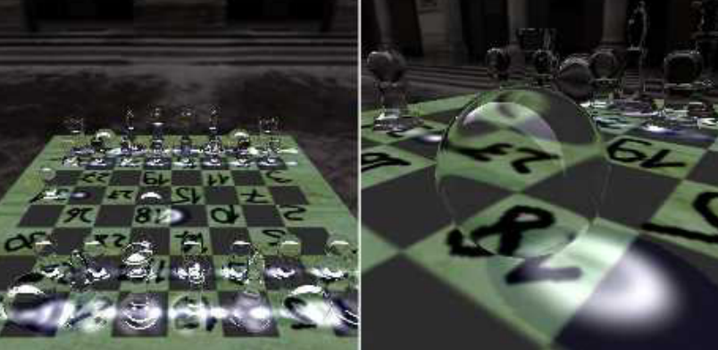
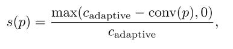
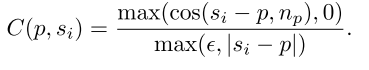

[toc]

# Ray-Tracing with Geometry Impostors

## 1. 介绍

通常情况下，**光线追踪效果**是使用**基于纹理的专门技巧**添加到实时场景中的。这些技巧通常假定**场景中只有一个反射或折射物体**，而且只考虑一个或两个光线的反弹就足够了。在这一章中，我们遵循类似的实用理念，但要**消除这些限制**，以便能够渲染像充满玻璃碎片的完整棋盘这样的场景，甚至是淹没在动画液体中的折射物体。

我们扩展了以前的**近似光线追踪技术**，这些技术是基于==环境距离替身==`environment distance impostors`，以便实时处理**具有多个反射和折射物体的场景**。有两个关键的想法可以做到这一点：

- 首先，我们扭转了`distance impostor`的方法，不是将内部光线与周围环境的几何形状相交，而是将**外部光线与一个物体相交**。我们展示了如何有效地追踪二次反射和折射的光线。
- 第二个想法是**将静态和动态对象分开**。静态环境可以使用经典的`distance impostor`，而只有移动物体的`environment impostors`需要在每一帧中更新。**通过移动物体的光路**可以通过搜索它们的`geometry impostors`来找到。

**本文渲染方法**维护物体网格的`impostors`以及反射或折射物体的`environment impostor`。当这样的物体被渲染时，着色器同时使用`environment impostor`和其他物体的`impostors`来寻找**次级射线的交点**。

## 2. Geometry Impostors

**光线追踪**需要光线与场景几何的相交。为了使其在实时应用中可行，不使用光线与**实际的几何基元**相交，而是使用**近似的表示方法**。通常情况下，场景从**一个巧妙选择的参考点**被渲染到一个纹理中，查询这个纹理获得**相交点**。当射线的原点与参考点不一致时，那么**寻找交点**就成为一个使用**连续的依赖性纹理获取**的搜索过程。关于**如何将几何体渲染成纹理**，以及如何使用这些表示法来搜索交点，有几种方法。这些方法都**使用纹理作为实际几何体的替身**。我们把这些纹理称为==geometry impostors==。

当射线与几何体相交时，下一步是渲染**相交的表面点**，这意味着我们必须找到向射线原点**发射的辐射度**。因此，除了表面点的位置之外，`impostor`的一个`texel`还必须存储**着色信息**。通常情况下，这意味着在创建`impostor`时，要计算和存储**向参考点发射的辐射**。如果**是高度镜面化的表面**，我们需要存储**表面法线向量**，这样我们才能准确地计算**渲染公式**。

如果是**镜面或玻璃状物体**，其表面的颜色通常是一致的，不需要在每个`texel`中存储，但是**表面法线是很重要的**，因为它是计算**二次射线**的必要条件。

### Distance Impostors

`Distance impostors`非常类似于`environment maps`，但它们也包含了**参考点**和`texels`中**可见的表面点**之间的**距离**，这可以方便地存储在**alpha通道**中。它们通常是`cube maps`，可以用**参考点的方向**来定位。如果是**反射和折射物体**，`cube maps`包含**距离和表面法线**，被称为`distance-normal impostor`。

如果不是所有的几何体的点都能从**参考点**看到，**不可见的部分**就会在`impostor`中丢失。因此，这种表示方法对**星形凸起的物体**效果最好。

在本章中，我们使用两种不同类型的`distance impostors`。其中一种是`environment distance impostor`（下图`a`）。这是一个`cube map`，包含了**一个物体的周围几何形状**，因此通常有**多个物体**被渲染到它上面。我们可以假设**所有射线的起点**都在环境内，但是包含的几何体的边界框是未知的。另一种类型的`distance impostor`包含**一个物体**（下图`b`）。要追踪的射线可能来自外部，而物体的边界框是已知的。以这种方式处理的物体通常是**镜子或玻璃物体**，这意味着这些通常是`distance-normal impostors`

### Height Maps

`Height Maps`是在**二维纹理贴图**中对**2.5维几何体**进行编码的一种经典而直接的方式。最突出的例子是`bump mapping`，主要用于为**三角形网格模型**增加细节。为了得到一个**高度贴图**，几何体被渲染到一个**使用正交投影的参考平面**上，每个纹理都包含了**表面点与平面的距离**。有许多位移映射技术，从`bump mapping`到宽松的**锥体追踪**，这些技术解决了 准确度不同的`ray–height map`相交问题。在这些方法中，**二进制搜索**是一种简单易行、可靠有效的技术，尽管它不能保证找到第一个交叉点。

通常情况下，**两个高度图**，存储在**参考平面**两边的位移，以**近似一个实体物体**。这种表示方法需要**一个维度**，沿着这个维度，**实体的深度结构**是简单的，但在其他两个维度上允许有任意的凹陷性。如果实体对参考平面是对称的，一个单一的高度图就足够了。

如果它具有某种**旋转对称性**，那么参考平面可以**围绕对称轴旋转**而不改变几何形状或高度图。在**搜索相交点**时，我们可以将平面像广告牌一样旋转，以获得最佳的结果。**所有的交点搜索算法**在入射光线**垂直于参考平面**到达时**表现最好**。

### Geometry Images

==几何图像==也将表面点映射到纹理上，但**没有投影到图像平面**上，而是使用**经典的UV映射**。因此，寻找与射线的交点不能通过利用纹理坐标和表面点位置的关系进行搜索。取而代之的是在`texel`上建立一个**边界体积层次**，并存储在`mipmap`层中。因此，**相交算法类似于具有边界体积层次结构的光线追踪算法**。好处是任何复杂的几何体都可以被存储，但**相交的计算成本更高**。

## 3. environment distance impostors的相交计算

我们可以把**从参考点可见的环境**看作是一个单一的、流形物体的表面。为了处理那些**什么都看不见的方向**，我们可以假设在一个大的但有限的距离上**有一个天空盒**。射线原点总是在环境表面内，而且总是有一个交点。射线方程为$r(t) = o + td$，其中`o`是射线原点，`d`是射线方向，`t`是射线参数。让我们使用一个**以参考点为原点的坐标系**。用一个点`x`查询环境，返回$\epsilon(x)$，这是环境表面点`s`对`x`**可见的距离**。 我们可以计算`s`为 $ε(x)x/|x|$。

在交点处，$ε(x)=|x|$​，并且比率$|x|/ε(x)$​为`1`。让$δ(t)$​为 $|r(t)|/ε(r(t))$​，这是一个计算给定射线参数`t`处的点的这一比率的函数。如果$δ(t′)<1$​，我们称射线参数`t′`为`undershooting`，如果$δ(t′)>1$​，则为`overshooting`。

我们必须找到**交点的射线参数** $t^*$。我们使用Szirmay-Kalos提出的**迭代过程**，构建一个趋近于$t^*$的**数值序列**$t_0,t_1,...$。上图显示了这些值是如何产生的。我们从第一阶段开始，这个过程称之为==投影搜索==，用**经典的环境映射**，查询射线方向的**距离图**，得到距离$ε(d)$。这就给了我们一个位于$dε(d)$的**环境表面点**。我们在射线上寻找与这个表面点最接近的点。它的射线参数`t0`可以被计算为

该射线点可以再次用于**查询环境距离图**，重新启动该过程。一般来说，迭代过程可以写为

请注意，这个序列在数学上**不能保证收敛到交点**，但它**很容易计算**，对实际场景也很有效。我们仍然需要避免的一种情况是，**该序列振荡而不收敛于实际的解决方案**。因此，我们要跟踪**最大的失调**（$a_i$表示其在第`i`次迭代时的值）和**最小的过调**（在第`i`次迭代时的值$b_i$​）。一旦我们有了这两者之一，我们就可以切换到上图中描述的==假位寻根方法==。我们得到**射线参数**的新猜测为：

我们也会更新`undershooting`或`overshooting`：

Note that it is possible to use the false position root-finding method exclusively, with $a_0 = 0$, which is always an undershooting, and a sufficiently large $b_0$​ to guarantee an overshooting.

## 4. Ray-Object Intersection Using Distance Impostors

首先，我们计算与**对象的边界框**的交点。如果没有，那么也不会有与物体的任何交集。

**射线-环境交点**与**射线-物体交点**之间**最重要的区别**是，射线的原点不在物体内，因此**不能保证有交点**。然而，如果存在交集，那么我们可以把它计算为：从**物体内部**开始，并且朝**相反方向**发出的射线。如果没有相交，算法就会返回一个`false`，很容易检查$δ$值是否接近`1`，这只对**真正的相交点**成立。

## 5. Ray-Object Intersection Using Height Maps

**物体的两边**是由两个`height map impostors`近似的。在寻找与射线的交点时，我们称它们为**近半部**和**远半部**，这取决于**射线的方向**，与射线原点的实际位置无关。`ray–height map`相交问题的解决方案与我们在`distance impostors`中进行的搜索**非常相似**。让$z(x)$为点`x`与参考平面的距离，$h(x)$为`x`在平面上的**正交投影的几何高度**。如果$z(r(a))>h(r(a))$，我们称一个射线参数`a`为`undershooting`。而如果$z(r(b))<h(r(b))$，`b`被称为`overshooting`。从初始搜索范围$(a_0, b_0)$​开始，我们迭代以得到一个**收敛序列**，就像我们在`false position`方法中所做的那样。然而，现在我们使用**二进制搜索**，下一个元素总是被计算为 

首先，我们计算与**参考平面**和**物体的边界盒**的交汇射线参数（见上图）。射线在$t_{plane}$处穿过平面，在$t_{enter}$处进入包围盒，并在$t_{exit}$处离开。如果射线不与边界盒相交，那么也就不会与物体相交。如果$t_{exit} < t_{plane}$（上图中的情况1），我们只需要搜索$t_{enter}$和$t_{exit}$之间**近一半的高度图**。同样地，如果$t_{plane} <t_{tenter}$（情况2），我们只需要搜索**入口和出口之间的远半部高度图**。否则，我们首先搜索$t_{enter}$和$t_{plane}$之间的近一半的高度图（情况`3`和`4a`）。如果没有找到交点，我们也要搜索$t_{plane}$和$t_{exit}$之间的远半部（情况`4b`）。

请注意，**二进制搜索**并不保证能找到第一个交点，在情况`1`和情况`2`中，可能会出现搜索范围的两个端点都是底点的现象。然而，一个紧密拟合的边界盒可以最大限度地减少这些情况，二**元搜索在实践中往往表现得完美无缺**。

## 6. Tracing Multiple Refractions within a Single Object

使用上述任何一种`impostors`——甚至是几何图像——我们可以存储**表面法线**，并使用**找到的交点**的表面法线来生成折射或反射光线。用前面讨论过的方法来追踪这些几何体，可以持续到任意数量的反弹。**一个物体内的两次折射**通常足以得到合理的结果。当物体被增量渲染时，我们仍然可以在像素着色器中使用`impostor`来追踪二次射线。

## 7. Multiple Ray Bounces with Object Impostors Only

像**玻璃物体这样的刚性体**只能在加载模型几何体时对其`impostors`进行一次计算，而像流体这样的动态几何体的`impostors`必须在每一帧进行渲染。相同的物体可以共享`impostors`。一旦场景中的所有物体都有自己的`object impostors`，**构建光线追踪器就很简单**了。简单地说，所有物体必须与所有射线相交，始终保持**最小的正交点**。对于在物体内部开始的射线可以有例外，在这种情况下，只需要搜索包含物体本身的`impostors`即可。通过光栅化可以很容易地找到与眼睛射线的第一个交点，然后在这些第一个反弹点上操作的像素着色器可以执行其余的射线追踪。

然而，对于一个物体相当多的场景来说，这种方法是非常昂贵的。解决这个问题的一个方法是使用**空间细分方案**，如常规网格或**边界体积层次结构**，以**减少交叉计算**的数量。我们发现，维护和遍历这些结构的开销比相交搜索本身要高一个数量级。因此，它们在高对象数时开始产生效果，而在典型的实时渲染场景中则较少。也就是说，一个完整的光线追踪解决方案可以建立在`impostors`和边界体积层次上，而不需要对场景中物体的动态性做出假设。在本章中，我们放弃了这个方案，而选择了对更典型的场景进行实时渲染。

## 8. Multiple Ray Bounces with Environment Distance Impostors Only

场景中的每个反射或折射物体都可以有自己的`environment distance impostor`，在每个像素中存储**传入的辐射度**。如果场景中有任何形式的动态变化，那么在每一帧中都必须重新渲染`environment distance impostor`。在最后的屏幕`pass`中，漫反射物体可以被正常渲染。**折射或反射物体的像素着色器**必须与环境进行简单的**交集搜索**，以获得反射颜色。

请注意，我们可以在创建`environment impostors`时也使用同样的渲染算法，这意味着**适当的反射**会出现在环境贴图本身。当然，在第一帧中，环境贴图将只包含漫反射的颜色信息。在第二帧中，我们可以在创建新的``impostors``时使用第一帧的地图，它已经包含了单个反弹的反射。在以后的帧中，``impostors``将包含**越来越多的反弹**，即使是有些延迟。因此，多`bounce`的渲染是自动的。然而，更新所有`cube map`需要大量的渲染过程，这在每一帧中都是不可行的。应用程序大多通过**只允许单一反射对象或只反射静态环境**来解决这个问题

## 9. Combination of Environment and Object Impostors

只要我们只有很少的物体，`object impostor`就很有效，如果环境是静态的，`environment impostors`就很有效。**在一个典型的场景中，只有少数物体在移动**。因此，对于**静态环境**，可以使用不需要在每一帧中更新的`environment impostors`，而通过使用`object impostors`将**移动的物体**添加回来。

首先，**每个折射或反射的物体**都应该有一个它自己的静态环境的`impostor`，而且只有这些`impostor`必须**定期更新**。我们还需要为**镜面物体**使用`object impostors`，用于**多重折射和与外部光线的交汇**。每当一个反射或折射的物体被渲染时，**二次射线**就会在静态环境中使用被渲染物体的`environment impostors`对**静态环境**进行追踪，并使用它们的`object impostors`对所有**移动物体**进行追踪；这样可以保持最近的结果。

图上说明了这个过程。在渲染表面点`1`，**反射和折射光线**生成，折射光线与`object impostors`进行测试，得到出口点`2`和**第二次折射**。然后，两个出口射线都针对环境（`3`和`4`）和移动物体的`impostors`进行测试。在所描述的例子中，反射光线击中了这样一个物体`5`。这个过程从头开始，使用移动物体的`impostors`（`6`）和`environment impostors`（`7`和`8`）。然而，我们不再测试**退出的反射和折射光线**与其他运动物体的交集，因为这些光线在渲染的图像中很难被发现。

## 10. 焦散和阴影

通过追踪**光源的光路**，可以使用**近似的几何体表示**有效地呈现出`caustics`。`geometry impostors`也可以这样使用。我们在渲染场景时，**将摄像机放在光源处**，用着色器输出经过多次反弹的漫反射表面的**纹理坐标**。然后，这些**被击中的光子**被作为小广告牌溅到`caustic light maps`上。在渲染物体时，`caustic light maps`被用来调控**漫反射颜色**。为了增加阴影，我们使用了**传统的阴影贴图**。

由于**移动物体**造成的`Caustics or shadows`也会导致**静态物体的照明条件**发生变化。这将使静态物体的`environment impostors`失效，迫使我们在**每一帧中更新**它们，危及**实时性能**并破坏了静态和移动物体分离的概念。这个问题有两个解决方案：

- 首先，如果我们能够识别**潜在的焦距和阴影接收器**，我们就可以在**追踪反射和折射光线**时将它们**作为移动物体**来处理。
- 其次，我们可以通过**存储纹理坐标**而不是漫反射颜色来避免静态`environment impostors`的情况。当发现与环境的交叉点时，可以访问漫反射纹理和`caustic light maps`来确定表面颜色。这需要一个**统一寻址的纹理映射**，覆盖完整的静态几何体，它可以是一个单一的UV图集，也可以是一个单独的UV图集的纹理阵列。

## 11. 例子：玻璃棋盘

一个有全套**玻璃棋子**的**漫反射棋盘**——在任何时候只有一个棋子在移动——是本方法的**一个理想场景**。只使用了`7`个网格（棋盘和`6`个棋子类型）；因此只需要七个`impostors`。所有物体都是对称的，由**高度图**准确表示。除了**骑士**之外，所有的棋子都表现出**圆柱形的对称性**，允许我们围绕垂直轴自由旋转**参考平面**。棋盘本身是漫反射的，它是唯一的`caustics`和**阴影**接收器。由于它的**动态照明**，它被当作一个**移动物体**来处理。

在每一帧中，阴影图、`caustics light map`和环境都会被更新。静止物体的`object impostors`和`environment impostor`则保持不变。当渲染一个物体时，像素着色器将**反射和折射的光线**与`environment impostor`、棋盘和移动棋子相交。当一个新的棋子开始移动时，之前移动的棋子就会变成静止的。所有的`environment impostor`必须被更新，以**排除新的移动棋子并包括旧的棋子**。

# Temporal Screen-Space Ambient Occlusion

## 1. 利用时间上的连贯性

**Kuwahara反向重投影技术**允许我们重新使用**旧帧的像素**，并随着时间的推移对其进行完善。这样可以保持**单帧计算的样本数量**较少，同时在短时间内有效地积累了数百个样本。请注意，`AO`有许多有益的特性，使其非常适合于**时间上的一致性**：对光源或观看者**没有方向性依赖**，`AO`技术只考虑**局部邻域的几何形状**，而且只有像素邻域的`SSAO`受到**场景配置变化**的影响。

在这篇文章中，我们特别关注如何使用**反向重投影**来提高**延迟着色管道**中的**SSAO技术的质量**。特别是，我们展示了如何**检测和处理**由移动物体、动画人物和可变形物体引起的**SSAO变化**。上图显示了**时间SSAO**（`TSSAO`）技术与**传统SSAO**的比较。请注意，这种算法是对 "`Fast Soft Shadows With Temporal Coherence`"方法的补充。

## 2. Ambient Occlusion

从**物理的角度**来看，`AO`可以被看作是由于天空造成的**漫反射光照**。一个法线为$n_p$​的表面点的**AO计算方法**是：(**1**)

其中，如果被方向`w`被遮挡住了，$V(p,w)=1$。`D`是一个介于`1`和`0`之间的**单调递减函数**，即从`p`到$ξ$（与最近表面的交点）的距离。在最简单的情况下，`D`是一个**阶梯函数**，只考虑**一定取样半径内的障碍物**，尽管一个**平滑的下降**提供了更好的结果。

### SSAO

`SSAO`方法试图在**屏幕空间**近似**原始AO积分**。已经描述了几个具有不同假设和权衡的SSAO的版本。请注意，我们的算法可以被看作是一种**改进底层SSAO方法**的一般策略。我们假设**任何SSAO方法**都可以被写成**取决于一系列样本**$s_i$​的贡献`C`的**平均值**。(**2**)

为了使用**蒙特卡洛积分**来近似方程（`1`），`SSAO`的贡献函数通常被选择为：

与方程`1`相比，**方向**已经被`p`周围的实**际样本点**所取代，因此$V(p, s_i)$现在是一个**二进制可见度函数**，如果$s_i$从`p`处可见，则为`0`，否则为`1`。这个方法被称为`SSAO`，因为`V`的计算是通过检查$s_i$在**屏幕空间**相对于当前`z-buffer`是否可见。请注意，一些SSAO方法省略了**深度测试**，而$s_i$的贡献取决于**距离和入射角**。

我们假设样本$s_i$已经被**预先计算**并存储在**一个纹理**中，例如，一组均匀分布在半球上的三维点，这些点被转换为`p`的**切线空间**，用于计算`C`。如果省略了这个步骤，取**整个球体**上的样本，那么**样本贡献必须加倍**，以考虑不在上半球的、浪费的样本。$D(.)$是一个与**样本点的距离**有关的函数，可以用来调节`falloff`。

## 3. Reverse Reprojection

**反向重投**将当前帧的图像像素与**世界空间位置相同的前一帧的像素**联系起来。该技术允许在当前帧中重新使用前一帧的像素内容。该技术被证明对各种应用都很有用，比如`shadow mapping`、抗锯齿，甚至是运动模糊。重投技术以`ping-pong`方式使用**两个渲染目标**，一个代表当前帧，一个代表前一帧。我们缓存**AO值**，因此将这个缓冲区称为==AO缓冲区== `ambient-occlusion buffer`。

对于**静态几何**，**重投影在整个帧中是恒定的**，可以在像素着色器中进行，或者在单独的`shading pass`中进行（在**延迟着色**的情况下）。使用前一帧$f-1$​和当前帧$f$​的**视图（V）和投影（P）矩阵**，其中`t`表示一个像素的`post-perspective`位置：（**4**）

在**延迟着色管道**中，我们存储了当前帧和前一帧的`eye-linear depth`，并使用它们来重建**世界空间位置**`p`。由于我们存储了**世界空间的位置**，我们只需要将当前的世界空间位置$p_f$​与之前的**视图投影矩阵**$P_{f-1}V_{f-1}$​进行转换，就可以得到$t_{f-1}$​。从$t_{f-1}$​​中我们计算出**正确的查找坐标**$tex_{f-1}$​​到**AO缓冲区**，通过应用**透视划分**并将结果缩放到$[0..1]$​​的范围（即$tex_{f-1} = \frac{t_{f-1}+1}{2}$）。

### 动态物体

对于**动态场景**，简单的等式`4`不起作用，因为**再现取决于移动物体的变换**。因此，有人建议将完整的顶点变换应用两次，一次使用**当前的变换参数**（建模矩阵、蒙皮等），一次使用**前一帧的参数**。在一个延迟着色管道中，前一个位置$p_f$需要在一个**单独的着色通道**中访问，**变换参数的信息已经丢失**。因此，我们将`3D optical flow` $p_{f-1}-p_f$​作为**另一个着色参数**（与法线、材质等一起）存储在**帧缓冲器**中，对这些偏移值使用比**绝对深度值**更低的精度（`16`位而不是`32`位）。

## 4. 我们的算法

### 随着时间的推移完善SSAO解决方案

我们算法的主要概念是通过使用**重投影**将`AO`（公式`2`）的计算分散到若干帧。 只要有可能，我们就从前一帧中提取，并用当前帧中计算的**新样本的贡献**来完善它。在`f`帧中，我们从`k`个新样本中计算出一个新的贡献$C_f$​：{**5**} {**6**}

其中，权重$w_{f-1}$​​是解决方案中**已经积累的样本数**，或达到收敛后**预定的最大值**。

理论上，这种方法可以使用**任意多的样本**。在实践中，这是不可取的：因为**重投影不是精确的**，需要**双边过滤**来重建，**每一个重投影步骤都会引入一个错误**，并随着时间的推移而加剧。这种误差会随着模糊程度的增加而变得明显。此外，**新计算的样本的影响接近于零**，而以前计算的样本从未被替换。因此，我们将设定一个阈值$w_{max}$​​上，这使得**旧的贡献的影响随着时间的推移而减弱**。因此：{**7**}

是**收敛状态的一个指标**。注意，对于$wmax→∞$​​，方程`5`中的累积贡献对应于方程`2`中的$n→∞$，因此会收敛到**所需积分的正确值**，除了上面讨论的模糊现象。

***实施说明***

值$w_{f-1}$​被存储在**AO缓冲区**的一个单独通道中。为了实现**快速收敛**，我们使用**Halton序列**来生成样本，该序列以其**低差异性**而闻名。作为这个样本集的**起始索引**，我们使用$j_f$​，我们也将其存储在**AO缓冲区**中。总之，**AO缓冲区**的**RGBA通道**存储了以下参数：

- the SSAO solution $C_{f−1}(p)$
-  前一帧的权重$w_{f-1}$
- 开始的索引$j_{f-1}$
- `eye-linear depth` $d_{f-1}$

**当前的索引位置**通过**反向投影**传播到下一帧。为了**防止索引位置被硬件插值**并在序列中引入偏差，重要的是总是从**AO缓冲区**中**最近的像素中心**获取索引值。像素中心可以用：

其中$res_{x,y}$是当前帧的分辨率。

### 检测和处理无效的像素

当重新投射一个片段时，我们需要检查在**前一帧中查找的像素**是否真正对应于**当前的像素**，也就是说，==缓存的AO值是否有效==。如果它变得无效，我们必须相应地使以前的解决方案无效。为了检测这种**无效的像素**，我们要检查是否发生了以下三种情况：

- 当前片段的中断
- 片段的采样邻域的变化
- 在帧缓冲区之外的片段。

***检测中断***

我们通过比较片段的**当前深度**$d_f$和重新投射的**缓存值的深度**$d_{f-1}$​来检查是否有中断。特别是，我们比较`eye-linear`深度值的==相对深度差异==：{**9**}

上诉方程对**深度范围较大的大场景**给出了**稳定的结果**。在近平面不会过度敏感，而在接近远平面区域时则足够敏感。在出现断层的情况下，我们总是通过将$w_{f-1}$​​重设为`0`来**丢弃先前的解决方案**，并计算出一个全新的AO解决方案。

***检测领域的变化***

对于只影响当前像素的方法，如`SSAA`，或纯静态场景中的`SSAO`，**测试不相容性**可能足以避免**大多数时间一致性伪影**。然而，像`SSAO`这样的着色方法是通过**空间采样核**从邻近的像素收集信息。因此，在动态环境中，我们必须考虑到**当前像素的渲染**可能会受到**附近移动物体的影响**。例如，一个箱子从地板上被抬起，在盒子周围的**接触阴影区域**的像素的`SSAO`值会发生变化。

**要检查的邻域的大小**相当于`SSAO`使用的**采样核的大小**。检查一个**像素的完整邻域**将是非常昂贵的，因此我们使用**采样**。实际上，事实证明我们已经有了一组样本，即**用于生成AO的样本**。这意味着**AO采样内核**用于两个目的：计算当前的贡献$C_f(p)$，并测试其有效性。

我们的**无效性方案**在上图中得到了可视化。一个样本$s_i$​的有效性可以通过计算**样本和像素的相对位置变化**来估计。{**10**}

重新投影的位置$s_{i,f-1}$​是由存储的**偏移向量**来计算的（回顾一下，**第一个渲染通道**将**所有像素的偏移向量**存储在帧缓冲区中，以便日后被**SSAO着色通道**访问，也就是==上图右的那根垂直的虚线==）。请注意，对于邻域测试，我们只使用那些位于`p`的**切平面**前面的样本，因为只有这些样本才真正修改了阴影项。理论上，我们也可以检查**表面法线和样本点的矢量之间的角度**是否有变化。然而，这需要存储更多的信息（**前一帧中每个像素的表面法线**），在我们所有的测试中，我们发现计算公式`10`就足够了。

***Smooth invalidation***

使用**二进制阈值**来检测干扰是非常合理的。本着这种精神，对于一个像素的邻域检查，我们可以对所有的样本计算 $δ(s_i)< \epsilon$​​ ，如果任何一个样本违反了这个条件，就放弃这个像素的先前解决方案。然而，考虑到，例如，**一个缓慢变形的表面**，`AO`也将缓慢变化。在这种情况下，**没有必要完全抛弃以前的解决方案**。相反，我们引入一个新的连续的无效定义，将**变化的度量**考虑在内。这个变化的度量是由验证样本位置$s_i$​的$δ(si)$​给出的，如公式`10`所定义。特别是，我们计算出一个介于`0`和`1`之间的**置信值**$conf(s_i)$​​，它表示以前的SSAO解决方案**仍然有效的程度**：

参数`S`控制**失效的平滑性**，在我们目前的实现中被设置为一个值（$15≤S≤30$​​​）。对于不同的`S`值，如果**相对距离**没有变化（$δ(x)=0$​），则置信度为`1`，对于$δ(si)$​​的大值，则接近`0`。之前AO解决方案的**总体置信度**由以下公式给出

我们将其与$w_t$​相乘，以修改方程`6`中**旧解的权重**。另外，为了防止在变化较大的区域出现**闪烁伪象**，如果收敛性小于阈值（例如，对于$conv(p)<0.5$​），我们不增加**样本数组的索引**，以重复使用相同的样本。

***处理缓冲区边界***

落在帧缓冲区外的样本带有不正确的信息，不应该使用。因此，我们为每个像素检查是否**有一个或多个样本**在前一帧中**超出了帧缓冲区**。在这种情况下，我们不使用`Smooth invalidation`，而是完全丢弃之前的值，因为它们是**未定义的**。

### Adaptive Convergence-Aware Spatial Filter

`SSAO`方法通常在**渲染计算后**应用**空间滤波**，以防止**采样率不足**造成的**噪音伪影**。我们也应用空间滤波，但只是在**时间一致性不够**的情况下。通常使用==交叉双边滤波器==的变种，其中通过考虑**深度差异**来避免对边缘的过滤。尽管这种滤波器在形式上是**不可分离的**，但在实时环境中，它通常在`x`和`y`方向上**分别应用**。

与以前的方法相比，我们有**额外的信息**用于这个滤波器，可以大大减少噪音（即我们在像素`p`中的`AO`值的收敛$conv(p)$​​​（公式`7`））。最近被排除的像素可以从**附近的收敛像素**收集**更多的信息**，而不是从其他不可靠的像素。此外，我们直接将过滤核应用于**世界空间距离**。这种应用自动将**深度差异**考虑在内，并能在**高深度差异的情况**下检测出**不连续性**：

其中，`g`是过滤核（例如：高斯）。当一个像素变得更加收敛时，我们使用收缩系数`s`，平稳地收缩**屏幕空间的过滤器支持**：

这样，当收敛达到$c_{adaptive}$时，我们就完全**关闭空间过滤**。我们发现$c_{adaptive}$​的设置在知觉上是不重要的（例如，`0.2`的值会导致不可察觉的过渡）。

***Adaptive sampling***

尽管空间滤波可以减少噪声，但在**采样不足的区域**提供**额外的输入样本**是更有效的。或者，换句话说，一旦AO达到了足够的收敛，我们就可以重复使用计算出的解决方案，从而在没有采样不足的区域使用更少的样本。我们把每一帧**新的AO样本的数量**`k`作为收敛的一个函数来调整。请注意，这些AO样本与上一节中用于空间滤波的屏幕空间样本完全无关，其中**内核大小被调整**，而不是改变样本数量。出于同样的原因，有必要至少生成一个**最小数量的样本**。

此外，由于邻域的变化，需要一定数量的样本来检测无效的像素。为了引入最小数量的分支，我们选择了一个简单的两阶段方案，如果$conv(p)< c_{spatial}$，则采用$k_1$样本，否则采用$k_2$​样本。这需要在着色器中进行不同次数的**AO循环迭代**。

### Optimizations

**核心算法的这些优化**使帧率更快，并且由于更精确而使图像质量更好。

- 随机噪音。在大多数AO方法中，我们通过对每个输入像素的不同随机矢量来旋转采样模式。这种旋转将**欠采样导致的带状伪影**换成了**噪声**。一旦收敛达到**一定的阈值**，我们就**关闭旋转功能**。请注意，这种优化在大多数情况下效果很好，但有时会给**邻域无效化**带来问题，导致一些明显的伪像。
- 局部空间。为了避免大场景中的精度误差，我们将位置值存储在**以当前视点为中心的局部空间**。这些值可以通过将**先前和当前视点**作为参数传递给着色器来**轻松地转换为世界空间的值**。

## 5. SSAO实现

***Algorithm of Ritschel et al.***

Ritschel等人的SSAO方法使用了一个**三维采样核**，以及一个深度测试来查询**样本的可见度**，从而实现了方程`3`中的贡献函数。为了得到一个**线性的SSAO衰减**，我们使用一个在采样球半径上呈**线性的样本分布**。请注意，在这种情况下，我们使用一个恒定的衰减函数$D(x)=1$​——衰减只由样本点的分布引起。与**光线跟踪AO**的区别主要是由**场景的屏幕空间离散化**引起的。

***Algorithm of Fox and Compton***

对要着色的像素周围的深度缓冲区进行采样，并将这些采样解释为`small patches`。虽然在物理上并不准确，但它通常会给出一个**令人愉悦的视觉效果**，因为在使用**大内核**来捕捉**低频AO**时，它能保留**更多的小细节**。缺点是，这种方法容易暴露出底层的`tessellation`。作为补救措施，我们不计算**半球掠射角度的样本**（即余弦小于一个给定的$\epsilon$， 我们用公式`11`：

***Sample generation***

为了获得用于**SSAO的样本**，我们首先使用**Halton序列**在$[0 . .1]$​范围内计算出一些**随机样本**ζ。对于Fox和Compton的方法，我们使用**二维（屏幕空间）样本**，**均匀地分布**在一个**用户指定大小的圆盘**上。然后通过将**相应的观察射线**与深度缓冲器相交并**计算其世界空间位置**，将这些样本从屏幕空间投射到世界空间。我们使用如下公式`12`从**二维Halton样本**ζx,y生成屏幕空间样本$s_i$：

对于Ritschel等人的方法，我们使用在**表面点的切线空间**生成的**三维半球形样本**。从**三维Halton样本**ζx,y,z中，用以下方法创建半球形样本$s_i$：

这个公式使用变量`ζx`和`ζz`，来计算**单位球体上的一个点**（即一个随机的方向），`ζy`来设定**样本距离**r。

***Maximum allowed sample distance***

如果**从像素中心到与深度缓冲区相交点的距离太大**，那么一个样本就很可能造成**错误的闭塞**。然而，引入**允许的最大采样半径**并将其设置为一个**太小的值**，会造成**有效闭塞的采样被遗漏**。我们设置了**最大的允许采样半径**，以拒绝那些距离**比SSAO核的采样半径大2倍以上**的样本。

***Frame buffer borders***

SSAO中固有的一个问题是：**如何处理落在帧缓冲区边界之外的样本**（由**靠近边界的片段**请求）。为了避免由于**深度信息的缺失**而在屏幕边缘出现伪影，我们可以选择计算一个比我们最终在屏幕上显示的**稍大的图像**。根据**SSAO核的大小**和**近平面的大小**，在屏幕的每一侧扩展大约`5-10%`就足够了。

## 6. 限制

//todo