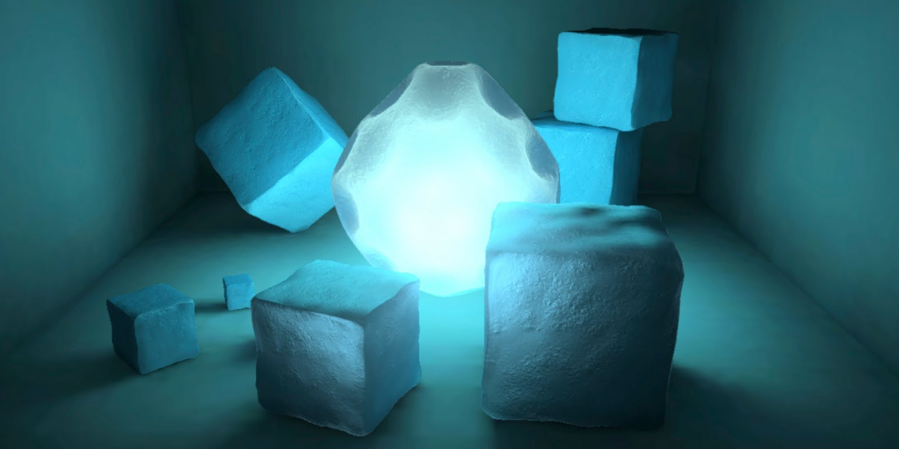
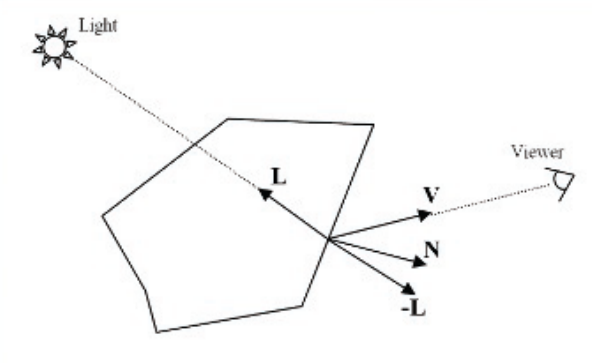
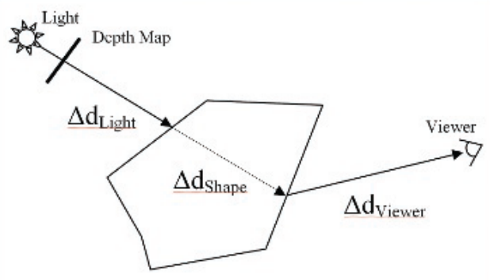
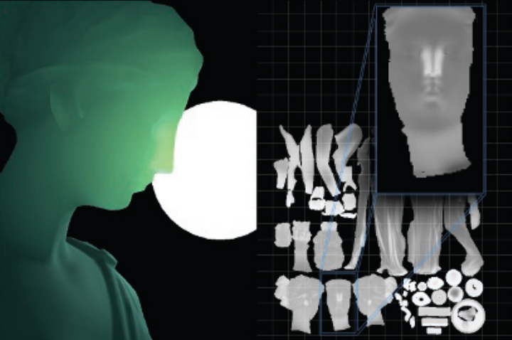
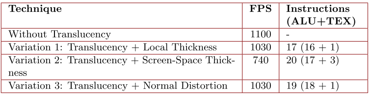
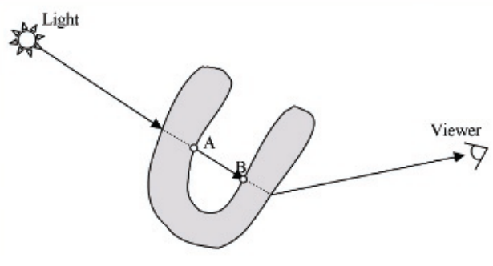
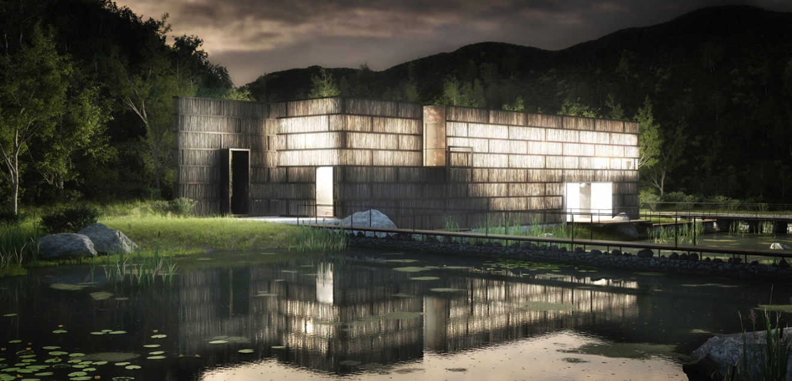
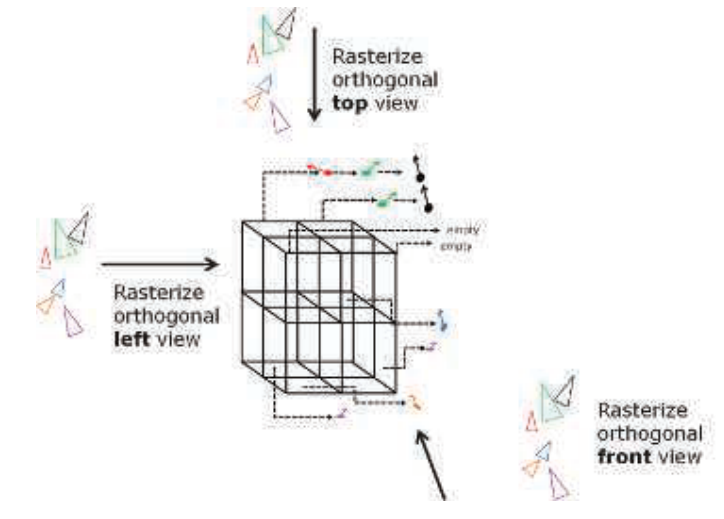
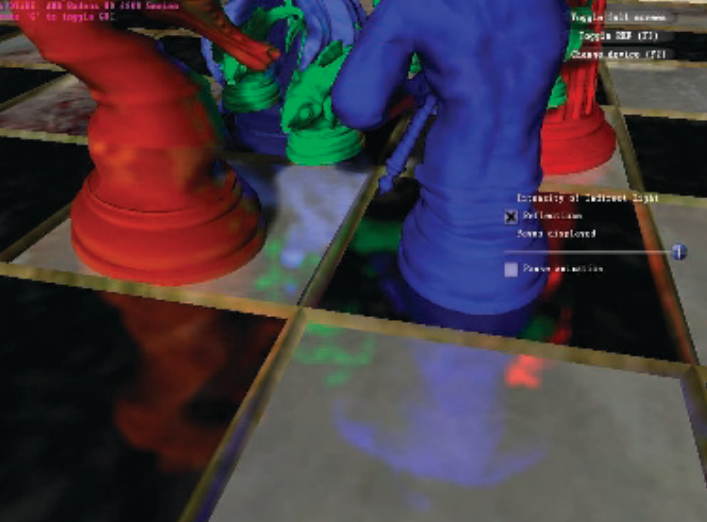

[toc]


# Real-Time Approximation of Light Transport in Translucent Homogenous Media



## 1. 介绍

本章提出了一个快速实时的**半透明同质介质中的光传输近似**，它可以很容易地在**可编程的图形硬件**上实现。


## 2. 寻找半透明

**目标半透明材质**必须表现出令人信服的**漫反射半透明性**，即**在形状内移动的光量**受到同一形状的**不同厚度的影响**。在数学上，这意味着**穿透形状表面的光量**可以用==双向透射分布函数==（`BTDF`）来定义。我们目前的方法试图从**现象上复制内表面扩散**，在这种情况下，在物体内部传播的光线会根据材料特性而散射。这种现象可以用==双向表面散射反射率分布函数==（`BSSRDF`）来描述。通过这项技术，我们希望使用**最小的可用GPU资源**来近似`BSSRDF`。经过仔细分析，我们发现使用**距离衰减的常规漫反射照明**，结合视图矢量和倒置光矢量的**距离衰减点积**，可以模拟物体内部的**基本光传输**（下见图）。



这项技术对许多**简单的形状**都很有效。然而，该技术**没有考虑到厚度问题**，我们不得不回到绘图板上，寻求一个**更有效和更完整的解决方案**。


## 3. 技术：The Way out Is Through

使用上述数学方法，可以创建一个**高度散射材料的粗略模拟**，对于非常简单的物体，如**球体和立方体**，效果很好，因为在运行时使用的大多数灯光都显示出**径向扩散的特性**。在有更复杂的模型的情况下，有必要知道厚度，或者更确切地说，**光在形状内走过的距离**，以便正确计算同一形状内的光传输。这种厚度可以**用深度图来计算**。由深度图决定的参照物，使我们可以很容易地计算出光从光源$∆d_{Light}$，穿过形状$∆d_{Shape}$，到达像素$∆d_{Viewer}$的距离。



不依赖**深度图**，将是有益的。它将消除对**额外的深度渲染`pass`**的需求。在**用半透明渲染的物体**使用自己的深度图进行渲染的情况下，这种方法是可以接受的，因为其**内存和性能成本**已经被摊销了。我们的团队想在这个想法的基础上扩展，寻找一种替代方案，寻求一种能够在各种可编程和半固定管道图形硬件上很好地扩展而**不依赖深度图的技术**。为了完成这个任务，我们的团队需要找到**建立物体厚度的方法**，或者说，物体上应该是半透明或不透明的区域：我们把这个信息定义为==局部厚度==。


### 变体1：计算局部厚度

艺术家们有可能定义**一种纹理**，其中的数值大约代表了**网格的厚度**；深色的数值代表不透明，而明亮的数值代表半透明。这种方法在***《孤岛惊魂》***中得到了有效的证明，对于**树叶等半平坦的表面**来说效果很好。不幸的是，在环境中有许多半透明物体（形状各异），定义形状上哪些区域是半透明的过程是一个**繁琐的手工过程**。为了简化这一过程，我们依靠**法线反转和颜色反转**计算`AO`，这可以在**离线状态**下完成，存储在纹理中。由于`AO`决定了有多少环境光线到达一个表面点，所以我们把这个信息用于**形状的内部**。通过在计算过程中**反转表面法线**，我们可以找到一个近似结果，告诉我们在**均匀介质内部传播的光线**在离开的地方**有多少会被遮挡**。



其结果是一个**具有倒置颜色的纹理**，描述了两种类型的区域，**白色的半透明区域和黑色的不透明区域**（见上图）。在有很好的`tessellation`水平的情况下，有可能在**顶点颜色**中存储这一信息。最后，我们可以使用这些信息来改进光传输的计算。==倒置的AO==给人一种**散射的感觉**，（即**收集光线**），同时使用**单一的距离值**进行基于距离的衰减。

[list 1]()

```c++
// fLightAttenuation == Light attenuation from direct lighting 
// cBRDF == Computed color for BRDF lighting
// cDiffuse == Light Diffuse Color
// cTranslucent == Light Translucency Color

// Compute the BSSRDF 
float fLTDot = pow(saturate(dot(vCamera, vLight)), fLTPower); 
float fLT = fLightAttenuation * tex2D(texInvAO, input.vUV); 
fLT += fLTDot * fLightAttenuation * fLTScale;

// Compute the final color for the BSSRDF (translucency) 
float3 cBSSRDF = lerp(cDiffuse, cTranslucent, fLT) * fLT;

// The final result 
return float4(cBRDF + cBSSRDF, 1.0f);
```


### 变体2：屏幕空间厚度

在你能负担得起**额外的计算**，并且仍然**低于使用深度图的成本**的情况下，这种新技术提供的另一种改进**依赖于屏幕空间的厚度表示**。每个像素的厚度可以很容易地通过**混合模式的技巧**来近似计算。一旦这种局部厚度的替代方法被计算出来，就有可能根据**摄像机与光源的角度**来调整**简化的光传输结果**。

必须明智地使用这种替代方法，因为它不是对每一种情况都有效。鉴于**信息来源于摄像机**，而不是光线，因此有可能只知道**前景表面有多厚**。尽管如此，这个新增的信息可以让我们**改进最终的结果**，并且可以与局部厚度结合起来使用。


你可以使用**屏幕空间的厚度**作为实现**令人信服的半透明性**的唯一手段，而且不需要预先计算的局部厚度。例如，我们可以想象这样一个场景：远处有一盏灯（即在一个隧道里），有许多物体在旋转并流向观看者。这个场景是**屏幕空间厚度**可以提供**积极结果**的一个例子。在物体周围有**明亮的半球形光线**的情况下，**屏幕空间厚度**也是有效的。


### 变体3：Improving Local Surface Variation

作为进一步的改进，我们可以根据**表面法线**来扭曲**倒置的光矢量**，通过显示**局部表面的变化**来改善最终结果。这种改进也可以使用为**表面类型**定制的**额外的噪声法线图**来实现。一个样本就足够了，然而，如果提供更多的样本，最终的结果会更好。如果物体的表面是多孔的，这种方法也相当有效。


## 4. 性能




## 5. 讨论

### 注意事项？最好的情况？

因为这种技术是一种近似的方法，**一些特定的实例不会产生最佳的结果**。下图显示了一个例子，在这个例子中，光线在`A`点进出**凹面体**，在`B`点投下了阴影。



### 延迟渲染

**渲染引擎**正朝着**延迟着色模型**的方向发展。因此，这种技术必须进行相应的调整。鉴于不同项目的递延实现方式不同，提供关于**递延背景下的技术调整**的一般提示是相关的。

该实施方案取决于G-缓冲区的可用空间。在单通道可用的情况下，**局部厚度可以存储为一个灰度值**：这与镜面图的存储方式相同。随后，BSSRDF计算中与光线和视图有关的部分可以与延迟照明通道同时处理。最后的结果可以在计算漫反射照明的同时与场景结合起来。在没有空间来存储局部厚度的情况下，这种技术将不得不在一个额外的通道中进行处理，而半透明的物体将不得不再次被渲染。


# Ray-Traced Approximate Reflections Using a Grid of Oriented Splats



本章介绍了一种**生成动态场景元素**的**近似光线跟踪反射的方法**。它使用了一个动态的三维网格，其中包含了`oriented surface splats`的列表，在GPU上生成反射。产生的反射对**粗糙的反射体**来说是可信的。本章进一步描述了一个未来的实施方案，该方案利用**扁平的分层网格**来提高反射的质量，同时将**三维网格的内存需求**保持在一个可接受的水平。

## 1. 介绍

**可编程硬件的最新进展**允许实时渲染**捕捉动态场景元素属性的数据结构**。本章利用这些能力来构建一个数据结构，允许计算**动态场景元素的近似反射**。到目前为止，实时反射已经通过以下技术的一种或几种组合来实现：

- `Flat Reflector`。镜像摄像机以渲染**反射纹理**。
- 通过**一组环境图**的反射。通常，环境图被用来实现**远处物体的反射**。
- **屏幕空间的反射**。产生一个近似值，**忽略屏幕上不可见物体的反射**。
- **基于图像的反射**。

**DX11光栅化器**被用来生成**场景中动态物体表面**的`splat-based`的中间表示。在本章的上下文中，为每个`splat`存储的**最小属性集**是`splat`中心的**3D位置、表面法线和其他一些用于照明的表面属性**。这种方法分享了**基于图像渲染**的一些好处，因为不再需要访问**完整的场景几何**。光栅化还消除了场景的一些几何复杂性，因为**不跨过像素中心的小三角形**不会产生任何`splat`。

基于GPU的全场景几何体的光线追踪也可以用来产生高质量的反射。然而，**全动态场景的光线追踪**对于实时解决方案来说还不够快。另外，如果光线追踪算法需要解析场**景的全部几何复杂性**，那么它们的内存就会受到限制。这对**非平面反射体**来说可能特别糟糕，因为反射光线一般不会表现出**良好的一致性**。


## 2. 基本算法

生成`splat-based`的反射的算法分**三个阶段**工作。


### 阶段1：生成`splats`网格

为了生成一组好的`point splats`集，我们需要渲染一组**有关几何体的正交视图**。通常情况下，会使用三个视图，例如，**一个顶视图、一个正视图和一个侧视图**。为了有效地渲染这些视图，我们使用**硬件实例化**来复制每个视图的几何体。DX11系统值`SV_InstanceID`在**顶点着色器**中被用来选择**要使用的视图矩阵和正交投影矩阵**。

DX11级图形硬件允许`scattering pixel shaders`。换句话说，**一个像素着色器可以将数据写到缓冲区内的任意位置**。在渲染`splats`时，人们需要**禁用深度测试和背面剔除**，而且实际上并没有绑定**任何有效的渲染目标**，而只有**两个输出缓冲区**用于散射写入。这些输出缓冲区被用来表示一个三维网格，每个网格单元中都有一个`splats`列表。我们通常在**动态场景元素**周围使用一个$64×64×64$​的网格来捕捉`splats`。



我们设置了一个视口，其大小足以沿每个视图方向产生**合理数量的**`splats`。然后，`scattering pixel shaders`被用来为每个像素在**3D网格**中插入一个`splat entry`。请参考上图，了解这个过程的高层抽象。事实上，我们在**像素着色器**中为每个像素构建了一个**小的边界框**，并将定向`splat entry`添加到**三维网格的所有单元**中。这就避免了动态对象的`popping artifacts`。**边界框的大小**通常被选择为网格单元世界空间大小的`25%`左右。每个像素的`splat entry`可以包含以后渲染操作可能需要的每一条信息。==最小的属性集==是：**3D位置、表面法线和其他一些用于照明的表面属性**

[list 1]()

> 清单显示了上面提到的==散射像素着色器的实现==。请注意，该着色器使用了一个**阴影贴图**来对`splats`的着色应用**阴影项**。

```c++
#define CELLS_XYZ 64

struct LINKEDSPLAT {
    float3 pos; 
    float3 n; 
    float3 col; 
    uint prev;
};

struct PS_RenderSceneInput {
    float4 f4Position : SV_POSITION;
    float4 f4Diffuse : COLOR0;
    float2 f2TexCoord : TEXTURE0;
    float3 f3WorldSpacePos : TEXTURE1;
    float3 f3WorldSpaceNormal : TEXTURE2; 
};

RWStructuredBuffer <LINKEDSPLAT > LinkedSplatsBuffer; 
RWByteAddressBuffer StartOffsetBuffer;

uint offset( uint3 pos ) 
{
    return ( pos.x + pos.y * CELLS_XYZ + pos.z * CELLS_XYZ * CELLS_XYZ );
}

void PS_RenderSplats( PS_RenderSceneInput I ) 
{
    // compute initial splat color 
    float4 f4Col = I.f4Diffuse * g_txCurrentObject.Sample(g_SampleLinearWrap, I.f2TexCoord);
    
    // compute shadow term float4 
    f4SMC = mul(float4(I.f3WorldSpacePos.xyz ,1.0f), g_f4x4WorldViewProjLight);
    float2 rtc = float2( 0.0f, 1.0f ) + float2( 0.5f, -0.5f ) * ((1.0f).xx + (f4SMC.xy / f4SMC.w));
    float fShadow = filter_shadow(float3(rtc, f4SMC.z/f4SMC.w) );
    
    LINKEDSPLAT ls;
    ls.pos = I.f3WorldSpacePos.xyz; 
    ls.n = normalize(I.f3WorldSpaceNormal.xyz); 
    ls.col = 1.3f * saturate(fShadow + 0.3f) * f4Col.xyz;
    
    // compute position normalized to grid coord system 
    // g_LBFbox holds left , bottom , front corner of box of grid 
    float3 f3GridP = max(I.f3WorldSpacePos - g_LBFbox.xyz, (0.0f).xxx);
    
    // set up small bounding box around splat (EPS = small number) 
    float3 f3TLBF = max(f3GridP - EPS * g_GridCellSize.xyz, (0.0f).xxx);
    float3 f3TRTB = max(f3GridP + EPS * g_GridCellSize.xyz, (0.0f).xxx);
    
    // figure out the range of cells touching the bb 
    float3 f3Start = min((float(CELLS_XYZ - 1)).xxx, max(f3TLBF * g_InvGridCellSize.xyz, (0.0f).xxx));
    float3 f3Stop = min((float(CELLS_XYZ - 1)).xxx, max(f3TRTB * g_InvGridCellSize.xyz, (0.0f).xxx));
    
    // compute integer range of grid cells to iterate over 
    uint3 start = uint3(f3Start);
    uint3 stop = uint3(f3Stop);
    
    // iterate over cells 
    for( uint zi = start.z; zi <= stop.z; ++zi ) {
    	for( uint yi = start.y; yi <= stop.y; ++yi ) {
        	for( uint xi = start.x; xi <= stop.x; ++xi ) {
            	uint oldOffset;
                
            	// alloc new offset 
                uint newOffset = LinkedSplatsBuffer.IncrementCounter();
                
           		// update grid offset buffer StartOffsetBuffer. 
                InterlockedExchange(4 * offset(uint3(xi ,yi,zi)), newOffset, oldOffset);
            	
                ls.prev = oldOffset;
            	
                // add splat to the grid cell 
                LinkedSplatsBuffer[newOffset] = ls;
        	}
        } 
    } 
}
```


### 阶段2：Lighting of the Splats

根据应用程序的照明要求，可能需要对存储在网格中的`splat`进行**延迟照明操作**。所有延迟的光源和阴影操作必须在`splat`上进行，以计算每个`splat`的最终照明颜色。如果照明模型很简单，那么我们可以在第一阶段进行这些步骤。


### 阶段3：Ray Tracing the Grid of Splats

现在，我们使用`grid of splats`来加速光线的投射，以计算**反射光线击中动态场景几何的位置**。当然，即使在前向渲染的应用中，也可以沿着**反射视图的方向**追踪光线。然而，在渲染主场景时生成的**全屏g-buffer**上运行这一操作会更有效率。使用摄像机的位置、表面法线和每个**g-buffer-pixel**的位置，计算出反射方向。然后，像素着色器从存储在**g-buffer中的表面位置**开始追踪一条穿过网格的射线。对于射线进入的每一个网格单元，都会给单元中的每个`splat`分配一个权重。每个`splat`的亮光颜色乘以权重，所有`splat`的**加权颜色和权重被累积**。对于远离当前**g-buffer像素**的`splat`，所选择的权重将为`0` ，同时也考虑到`splat`中心与追踪光线的距离。因此，距离太远的`splat`也会得到一个零权重。如果所得到的权重之和高于零，着色器就会认为该射线已经击中了表面的`splat`，并返回**累积加权的颜色和累积权重的比率**作为反射的颜色。

[list 2]()

```c++
float4 intersect_splats( float3 orig , float3 dir , 
                        LINKEDSPLAT s0, 
                        LINKEDSPLAT s1, 
                        LINKEDSPLAT s2, 
                        LINKEDSPLAT s3, 
                        float4 f4Mask )
{ 
    float4 w, denom , k, dw;
    
 	// compute initial weights 
    w.x = saturate( dot( normalize( orig - s0.pos ), s0.n ) ); 
    w.y = saturate( dot( normalize( orig - s1.pos ), s1.n ) ); 
    w.z = saturate( dot( normalize( orig - s2.pos ), s2.n ) );
    w.w = saturate( dot( normalize( orig - s3.pos ), s3.n ) );
 
    // compute closest distance to splat 
    // ( ( orig + k * dir ) - s.pos ) * s.n = 0 
    // s.n * orig + k * dir * s.n - s.pos * s.n = 0 
    // k = ( s.pos * s.n - orig * s.n ) / ( dir * s.n ) 
    denom.x = dot( dir , s0.n ); 
    denom.y = dot( dir , s1.n ); 
    denom.z = dot( dir , s2.n ); 
    denom.w = dot( dir , s3.n );
 
    k.x = dot( ( s0.pos - orig ), s0.n ); 
    k.y = dot( ( s1.pos - orig ), s1.n ); 
    k.z = dot( ( s2.pos - orig ), s2.n ); 
    k.w = dot( ( s3.pos - orig ), s3.n );
 
    k /= denom; 
    k *= ( denom != (0.0f).xxxx ? (1.0f).xxxx : (0.0f).xxxx ); 
    w *= ( k > ( 0.0f ).xxxx ) ? ( 1.0f ).xxxx : ( 0.0f ).xxxx;
 
    // change w to reflect distance from splat center 
    float3 temp0 = orig + k.x * dir - s0.pos; 
    dw.x = 0.001f + dot( temp0 , temp0 ); 
    float3 temp1 = orig + k.y * dir - s1.pos; 
    dw.y = 0.001f + dot( temp1 , temp1 ); 
    float3 temp2 = orig + k.z * dir - s2.pos; 
    dw.z = 0.001f + dot( temp2 , temp2 ); 
    float3 temp3 = orig + k.w * dir - s3.pos; 
    dw.w = 0.001f + dot( temp3 , temp3 );
    
    // combine weights 
    w *= ( dw < (0.08f).xxxx ? 1.0f : 0.0f ) * f4Mask;
    

    // compute result 
    return float4( w.x * s0.col + w.y * s1.col + w.z * s2.col 
                  + w.w * s3.col, dot( w, (1.0f).xxxx ) );
}
```


## 3. 结果



