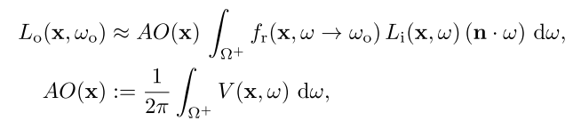

[toc]


# Screen-Space Bent Cones: A Practical Approach (For AO)


我们描述了如何计算`bent normals`，作为`SSAO`的一个廉价副产品。`Bent cones`扩展了`bent normals`以进一步**提高真实性**。这些扩展将**AO的速度和简单性**与**物理上更合理的照明**结合起来。

## 1. 介绍

AO是一种在**物理上不正确但在感知上可信**的**GI近似**。缺乏方向性在视觉上会令人不快，并留下改进的空间。为此，Landis引入了所谓的`bent normals`。虽然`AO`存储的是**平均闭塞度**，但`bent normals`是根据对**最不闭塞的方向的估计**而弯曲的**修正法线**，换句话说，是==平均不闭塞的方向==。

通常情况下，`bent normals`可以很容易地集成到渲染引擎中；唯一需要改变的是**应用法线的弯曲**。通过与相应的AO值相乘来调整弯曲法线的长度，可以在着色计算中**自动整合AO**

在本章中，我们将描述**一种扩展SSAO的技术**。我们的想法是通过依赖屏幕空间的解决方案来保持SSAO的简单性，但增加了`bent normals`的优点。此外，我们还引入了一个新的扩展来进一步提高精确度：`bent cones`。`bent cones`通过存储其**方向的平均值和方差**来捕捉**未排除方向的分布**。


## 2. AO



Landis使用**基于光线追踪的蒙特卡洛积分**来计算**AO的半球形积分**。`bent normals`的概念也可以追溯到Landis的工作中，在那里它被作为**AO的概括**而提出。`bent normals`是以**平均闭塞度**为尺度的**平均自由方向**，用来**代替法线**进行着色。与`AO`不同的是，它们的定义包括**积分内的方向**`ω`：


在光照计算中，`bent normals`只是取代了**表面法线和可见度项**：


在`bent normals`的情况下，**可见度**必须与**方向**相乘，使用`bent normals` $N(x)$​的蒙特卡洛计算，与单独的`AO`相比，计算简单而高效。`SSAO`是基于延迟着色的。我们建议使用`bent cones`，它很容易集成和编程，并能快速产生**平滑的照明**。

通常情况下，`SSAO`是通过计算一个像素`i`的随机点样本`S`的**闭塞情况**来计算的。我们暂时不考虑图像的二维结构，用一维索引`i`来列举所有像素。每个样本都要根据**深度缓冲区**进行测试，以检查是否被离摄像机更近的物体遮挡。如果样本`S`分布在上半球，每个样本$S_i$本身都会被测试**是否有遮挡**。而如果样本`S`是直接选择在`i`的一个**像素邻域**，则检查$S_i$​的**背投点**`back-projected point`是否遮挡了`i`的背投点。

对于一个像素`i`，我们比较它的**相机空间位置**$x_i$​和其他像素的相机空间位置$x_j$​：{**1**}


其中：$\Delta_{ij}:=x_j-x_i$​。直观地说，这个函数对于**阻塞的像素**来说是`0`，否则就是`1`，这取决于它们的**相对位置**，尤其是它们的**相对深度**。$d(∆)$的一个可能实现是$dx(∆)$，定义为：


如果$∆.z$​大于$z_{max}$​​​，通过考虑**不应该投射阴影的离群值**，以及通过包括第`i`个像素的法线可以进行改进：


还可以根据**遮挡者的距离和角度**，用一些**衰减函数**来代替**二元函数**`d`，这将导致**更平滑的AO**。`SSAO`的==基本假设==是，将 "附近 "的遮挡者的**遮挡量相加**，接近于**真实的可见度**。然而，==能见度是一个非线性效应==：在一个方向上，两个遮挡者彼此之间的遮挡不会投下两次阴影。因此，其他方法是通过**深度缓冲区中的射线行进**，为屏幕空间中的一组方向找到**正确的遮挡**。


## 3. 我们的技术


### Bent Normals

我们的技术与所使用的**SSAO类型**大多是**正交的**。我们不只是计算第`i`个像素的AO（公式`1`），而是另外计算一个新的法线$N_{ss}$。背后的==基本原理==是，在**屏幕空间**计算`AO`时，方向$∆_{ij}$​是已知的，可以用来累积一个定义`bent normals`的**无遮挡方向**。因此，我们只需将样本所定义的**归一化的未遮挡方向**相加，并将得到的向量除以**未被遮挡的方向数**：{**2**}


由此产生的`bent normals`是$x_i$​处**未遮挡方向的平均值**。

### Bent Cones

`Bent Cones`是由一个`bent normals augmented by an angle`。由于**未遮挡方向的平均值**给出了`bent normals`，**方差**定义了`angle`。然而，方向需要使用==方向统计==，而不是欧几里得空间中的线性统计。为此，我们使用了一种类似于von Mises-Fisher（vMF）分布中方差计算的方法。在那里，方差是由**非归一化**的`bent normals`的长度近似计算出来的。虽然**vMF分布**是针对球体定义的，但我们估计的是半球上的分布。这导致了对**角度的简单估计**，对应于**未遮挡方向的方差**为：


`bent normals`和`Bent Cones`定义**可见性的球状帽**。下图显示了**可能的无遮挡方向**以及由此产生的`bent normals`和`Bent Cones`。我们将这个上限与计算球形上限内的入射光线的渲染方法结合起来使用，比如**预卷积环境图**。需要注意的是，`clamp`确保了**未遮挡点**的`bent normals`的长度被映射成一个**覆盖整个半球的锥体**。我们只用`Bent Cones`来限制**收集光线的方向**。该`Cone`并不描述**具体的可见度近似值**。我们仍然使用`AO`来估计**整体能见度**。我们可以认为**`cone`描述的是照明颜色，而AO控制的是亮度**。这也使得`cone`不需要非常准确地匹配**实际的能见度配置**。使用一个角度为90度的`cone`意味着只能退回到用`bent normal`进行照明。


### 渲染

对于使用`Bent Cones`的渲染，使用**预卷积的环境图**，其使用`Bent Cones`进行索引。同样的概念也适用于**辐照量**。众所周知，所涉及的卷积可以得到**非常平滑的结果**，没有明显的噪声，这与游戏的感知要求非常吻合。环境光照的预卷积计算了一个方向性函数 $L_p(n)$​。对于每一个可能的法线`n`：


为了查询这个**卷积环境图**，`bent normals`被用来代替`n`：


然而，**预卷积必须假定没有阴影发生**，因为在预卷积的时候，点`X`和它的**可见度**是不知道的。对于`Bent Cones`，我们建议在预卷积中包含一个**代理可见度**，从而形成一个**三变量函数**：


该函数存储了角度为$α$的方向`n`上的``Bent Cones``的**出射辐射度**（上图）。如果$w^/$和`n`形成的角度小于$α$，函数$\overline{V}$返回`1`，否则返回`0`。请注意，通过这样做，随着$α$​的增加，预卷积值会变大。为了包括`Bent Cones`，我们查找**适当的卷积环境图**。该项变成：


方程的最后一部分是对**预卷积的入射光线**进行 "==归一化=="，原因是我们不使用`cone`作为`x`处的**实际可见性的近似值**。相反，我们用它作为一个代理来选择**收集光线的方向**。然后用`AO`来说明**平均能见度**。只有当`AO`和`cone angle`匹配时（$AO(x) = 1 - cos(C(x))$），我们才会得到与使用`cone`作为**可见度近似值**相同的结果。请注意，根据我们对`cone angle`的定义，`spherical cap`通常大于或等于`AO`（$AO(x)≤1-cos(C(x)$）

在实践中，我们将**归一化项**移到**预卷积步骤**。因此，我们将采样限制在`cone`上，这样$\overline{V}(w^/,n,\alpha)$​就会返回`1`，而**归一化**就隐含在其中。因此，我们可以在渲染期间**跳过归一化**（$(1-cos(C(x))^{-1}$​）。在**预卷积过程**中，我们可以通过在所有像素上循环，来精确地进行采样，从而得到一个$O(n^2)$​的复杂度，其中`n`是像素的数量。对于每个输出像素，循环计算所有其他像素的`cone-weighted sum`。如果$\overline{V}(w^/,n,\alpha)$​​返回`0`，则样本被忽略。另外，我们可以使用具有**固定样本集的Monte-Carlo方法**，将复杂性变成$O(nm)$​​，其中`m`是**Monte-Carloc采样的数量**。此

### 几何项

我们使用**启发式方法**将几何项（**入射光线与法线的余弦**）与我们的`Bent Cones`结合起来。**几何项必须是预卷积的一部分**，因为每一个方向的入射光只在此刻已知。 正确地整合几何项将是五维的：二维的平均方向（`bent normals`），一维的锥体角度，二维的表面法线。然而，我们可以通过以下方式近似地计算出正确的几何项 ：


下图说明了`n`和N(x)之间不同角度的启发式方法。如果$(N(x)-n)≈1$，我们可以使用`bent normals`和入射光线之间的余弦，因此，我们的启发式方法很好地接近了几何项。在另一种情况下，如果$(N(x)-n)<1$​，只使用`bent normals`会导致**可见的假象**。幸运的是，如果法线和`bent normals`发散，我们有一个集中的入射光线，而且`Bent Cones`的角度也很小，因此，$(ω-n)≈(N(x)-n)$。


## 4. 实现

我们的方法可以与**不同的SSAO技术**结合使用。差异仍然很小，主要取决于采样半径。`Crytek2D SSAO`使用**二维采样模式**在屏幕空间中分布采样。

`Crytek3D `使用**3D采样模式**将样本分布在空间，并投射到屏幕空间。我们在一个半球中生成样本，然后根据`n`使用**正交基**进行转换。另外，我们增加了射线行进，这极大地改善了`AO`和`bent normals`的质量。

HBAO使用随机的三维方向，通过`marched`找到最高的交叉点。我们在**单位盘**上生成样本，应用**随机偏移**，然后根据`n`进行转换。下列清单给出了显示`AO`和`bent normals`如何在像素着色器中计算的伪代码。

```c++
void main() 
{ 
    // get point properties at pixel i 
    vec3 positionX = backproject(depthTexture(pixelCoordinateI), 			inverseViewProjectionMatrix);
    vec3 normalX = normalTexture(pixelCoordinateI); 

    // get ONB to transform samples 
    mat3 orthoNormalBasis = computeONB(normalX); 
    // select samples for pixel out of pattern 
    int patternOffset = getPatternOffset(pixelCoordinateI);

    float ao = 0.0; 
    int validAODirectionCount = 0; 
    vec3 bentNormal = vec3 (0.0); 
    float unoccludedDirections = 0.0;

    for(int index = 0; index < sampleCount; ++index) 
    { 
        vec3 sampleDirection = orthoNormalBasis * getSampleDirection(index , patternOffset);
        bool isOutlier = false; 
        // use float instead of bool and
        // apply a fall -off function to get smooth AO 
        float visibility = 1.0; 

        // this function tests for occlusion in SS 
        // depending on the actual technique 
        // and sample distribution , 
        // the implementation of this function varies 
        checkSSVisibilityWithRayMarchingSmooth( sampleDirection , 
                                               maxOccluderDistance , 
                                               depthTexture , 
                                               inverseViewProjectionMatrix , 
                                               positionX , normalX , 
                                               rayMarchingSteps , 
                                               rayMarchingStartOffset , 
                                               visibility , isOutlier );

        // we have insufficient information in SS 
        // here , we simply ignore samples , 
        // which cannot be handled properly 
        if(!isOutlier) 
        { 
            validAODirectionCount ++; 
            ao += visibility;

            // for bent normals , we assume , 
            // that outlier occluders are NOT real occluders!
            // sum up unoccluded directions 
            // direction may be partially visible 
            // => only counts accordingly
            bentNormal += normalize(sampleDirection) * visibility; 
            unoccludedDirections += visibility;
        }
    }
    ao /= float(validAODirectionCount); 
    bentNormal /= unoccludedDirections;
}
```

***Filtering***

`Bent Cones`通常需要至少**六个样本**以避免**可见的伪影**。很明显，滤波的质量取决于相邻像素的一致性。我们不直接对`bent normals`进行内插，而是计算出法线和`bent normals`之间的**差值**，然后对其进行过滤。然后将这个变化加回到每个像素的**原始高频法线**上。因此，如下图所示，**法线场本身的细节被保留下来**，而`bent`的信息则被传播出去。


***Preconvolved lighting***

对于**预卷积的环境地图**，我们将$L_p$存储为一个**浮点立方体纹理**。包括可见度的$L_c$的预卷积是**三变量的**，可以使用OpenGL最近的`cube map array`来最有效地存储。这个扩展存储了一个**立方体贴图数组**，可以用一个方向和一个索引来访问。我们将$α$​离散为**八个级别**，并在各级别之间应用**线性滤波**。预卷积的环境图需要一个**高动态范围**，这就是为什么我们选择使用RGB 16位浮点纹理。由于卷积，**低分辨率的立方体地图**提供了足够的质量。

***Practical considerations***

`bent normals`可以用`AO`进行缩放。使用缩放后的`bent normals`进行着色，**AO会自动包含在内**，也避免了进一步的存储需求。对于`Bent Cones`，除了`bent normals`和`AO`之外，不需要额外的存储。对于一些可能的锥体角度，需要一个特殊的预卷积步骤。


# TressFX: Advanced Real-Time Hair Rendering


## 1. 介绍

在这一章中，我们将介绍一种将**头发**渲染成**单个发丝**的实时头发渲染技术，以及如何对该技术进行**修改和优化**，以整合到游戏中并以**最高性能**运行。针对头发的主题将包括**几何体扩展**、**抗锯齿**、光照、阴影，以及使用**每像素链接列表**来实现**独立透明**。


## 2. 几何扩展

我们将**头发的几何数据**表示为由线段组成的单个`strands`。这些线段被表示为连续的顶点。为了在典型的**三角形光栅化图形管道**中渲染头发，每条线段都要经历一个**由两个三角形组成的四边形**的扩展。为了生成这两个三角形，每条线段会产生**六个顶点**。几何图形扩展发生在**顶点着色器**中。下面是**头发几何体扩展**中涉及的两个步骤：
- ***世界空间的毛发纤维半径扩展***：**光栅化的毛发纤维**最终成为每个毛发纤维段的、视平面对齐的==广告牌序列==。当这些广告牌生成时，**单个毛发纤维段**在世界空间中被**毛发纤维半径**扩大。
- ***屏幕空间的像素扩展***。在投影**扩展的毛发纤维顶点**后，会发生额外的扩展，以确保**单个毛发纤维**至少覆盖**一个像素的宽度**，即增加$\sqrt{2}/2=0.71$

参见下列清单，看看这两个描述的步骤是如何在执行**头发几何体扩展的顶点着色器**中进行的。

[list 1]()

```c++
static const uint HairVertexSelection [] = {0, 1, 0, 1, 1, 0}; 
static const float OffsetDir [] = {-1.f, -1.f, 1.f, -1.f, 1.f, 1.f};
static const uint OffsetDirIndex [] = {0, 0, 1, 0, 1, 1};

HairPSInput HairVS( uint vertexId : SV_VertexID ) {
    HairPSInput Output = (HairPSInput)0; 
    float thicknessFactor [] = ... ;// normalized thickness scaler
        
    // two tangents and vertices of the hair fiber segment 
    float3 t[2], v[2];
    
    // calculate right vector for billboarding the hair fiber quad 
    float3 right[] = {cross(t[0], normalize(v[0] - g_vEye)), 
                      cross(t[1], normalize(v[1] - g_vEye))};
    float2 proj_right[] = {normalize(mul(float4(right[0], 0), g_mViewProj).xy), 	
                            normalize(mul(float4(right[1], 0), g_mViewProj).xy)};
    
    // Setting up the indexing for calculating one of the 
    // 6 verts of the 2 triangles making a quad
    // indexing vert 0 to 5 
    uint localVertId = vertexId % GENERATED_VERTEX_COUNT;
    
    // choosing vertex in the fiber segment 
    uint idx = HairVertexSelection[localVertId ];
    
    // choosing which direction to offset from the fiber segment
    uint offDirIndex = OffsetDirIndex[localVertId ];
    
    float4 hairEdgePositions [2]; // 0 is negative , 1 is positive
    
    // World -space expansion 
    hairEdgePositions[0] = float4(v[idx] + -1.f * right[idx] * thicknessFactor[idx] * fiberRadius, 1.f);
    hairEdgePositions[1] = float4(v[idx] + 1.f * right[idx] * thicknessFactor[idx] * fiberRadius, 1.f);
    hairEdgePositions[0] = mul(hairEdgePositions[0], g_mViewProj); 
    hairEdgePositions[1] = mul(hairEdgePositions[1], g_mViewProj);
    
    // Output after screen-space expansion 
    Output.Position = hairEdgePositions[offDirIndex] + hairEdgePositions[offDirIndex].w * OffsetDir[localVertId] * float4(proj_right[idx] * 0.71f / g_WinSize, 0.0f, 0.0f);
    Output.Tangent = t[idx];
    Output.WorldPos = v[idx];

    // Used for image-space-based antialiasing , 
    // for having the nearest edge positions of 
    // the hair fiber in the pixel shader 
    Output.p0 = hairEdgePositions[0].xy / hairEdgePositions[0].w; 
    Output.p1 = hairEdgePositions[1].xy / hairEdgePositions[1].w; 
    return Output;
}
```


## 3. 光照

在顶点着色器中进行**几何扩展**后，在毛发几何通道中，**照明计算**作为像素着色器中的第一个步骤。头发的照明计算来自于[Kajiya and Kay 89]介绍的**毛皮渲染模型**，以及[Marschner等人03]的工作。

### 漫反射

漫反射组件是基于对**圆柱体**应用**朗伯特漫反射照明**。Kajiya的论文提供了漫反射分量的推导，它是通过沿着**半圆柱体的圆周**进行积分，并沿圆周累积**反射漫反射分量**而得到的。该推导以漫射分量的一个简单方程结束：


其中$K_d$​​是**漫反射率**，`t`是头发纤维的切线，`l`是光矢量。根据这一推导，当光线方向**垂直于**头发的切线时，**漫反射成分**将是最强的。


### 高光

Kajiya和Kay 89]所描述的**头发照明模型**中的镜面成分是基于**Phong镜面模型**，其中光线根据**头发的切线方向**从发丝上反射。


其中，$K_s$是高光反射项，$e$是视图向量，$l$是光向量，$e^/$是相应的**反射矢量**。毛发切线`t`和光矢量`l`之间的角度是$θ$，$θ^/$是`e`和毛发纤维切线`t`之间的角度。

### Practical Real-Time Hair Lighting

考虑到定义好的**漫反射和镜面毛发渲染成分**和Marschner的更多分析方法，Scheuermann提出了一个从现象学角度得出的**毛发照明模型**。下图显示了Scheuermann模型试图重现Marschner的论文中描述的真实世界图像中的**双重镜面高光**——主要和次要高光。

- 主要高光向发梢移动，主要受灯光颜色的影响。
- 次级高光向发根方向移动，并受到灯光颜色和头发颜色的影响。

为了结合这两个高光，**主高光的反射矢量**向头发切线的方向移动，从发根指向发梢，而次高光可以以**相反的方式**移动，远离头发纤维切线的方向。


## 4. 阴影和拟合头发自阴影

除了照明计算之外，头发还接受**环境阴影和自阴影**。我们选择**近似计算**自阴影，因为生成和应用自阴影的成本很高。对于近似计算，可以使用一个**常规的阴影图**，它将保持**最接近光源的头发纤维的深度**。这个头发的阴影图可以作为**头发最上层的代表**。使用这个阴影图，可以计算出被遮挡的**纤维的近似数量**，并用于应用一个**体积自阴影项**。由此产生的效果类似于`deep shadow maps`，但成本要低得多。下面是**近似的深度阴影图**的计算：


在这些计算中，`depth range`是被渲染的`hair fragment`和相应的**阴影图深度**之间的距离。`Fiber spacing`和`fiber radius`是可调整参数，有助于在计算**头发自阴影项**时定义**头发的密集程度**。`Fiber radius`是在**几何扩展步骤**中考虑的，所以在调整头发自阴影时，最好调整`fiber spacing`。较大的纤维间距意味着较少的纤维数，这将导致**较轻的自阴影项**。`hair shadow alpha`定义了有多少光能通过每个纤维。

为了照顾到头发投下的阴影以及**自阴影**，头发被渲染到**引擎的阴影贴图**中。由于自阴影**近似计算的性质**，在处理环境对头发投射阴影时，没有必要将头发从**引擎的阴影贴图**中分离出来，因为通常环境物体会离头发有很大的距离。**相对较大的距离将产生大量的纤维**，这将驱动**阴影项**为`0`。


## 5. 抗锯齿

 在照明和阴影计算完成后，对每个**头发像素片元**进行抗锯齿计算。渲染单个头发丝会导致**严重的锯齿问题**。一旦投射到**屏幕空间**，单个发丝看起来就像一条**锯齿状的线**。另外，如果有大量的发丝，锯齿不仅会导致发丝参差不齐，而且在对**一簇发丝**进行着色也会出现**噪音**。对于头发，我们可以利用特殊的几何信息，应用**专门的头发抗锯齿**来提高整体渲染质量。

专门的头发抗锯齿的**另一个重要好处**是可以**模拟单个发丝的薄度**。以前的实时头发渲染模拟会遇到**个别发丝看起来太粗**的问题。应用专门的头发抗锯齿有助于**软化单个发丝的边缘**，这在**发丝宽度为亚像素**时尤为重要。

为了给头发像素应用**抗锯齿**，策略是计算出被毛发纤维覆盖的**屏幕像素的百分比**。这个百分比值被称为==覆盖率==，这个**覆盖率值**直接修改了**头发的alpha**。通过使用覆盖率值来修改头发的$\alpha$​​​，头发像素在靠近发丝的边缘处变得**更加透明**，以产生抗锯齿效果。抗锯齿的一种方法是使用**像素和头发纤维的射线锥交点**。在射线锥体交汇时，与毛发纤维交汇处的**射线锥体截面的面积**被确定，然后**这个面积被毛发纤维覆盖的百分比**成为相应像素的**覆盖值**。

我们采取了另一种方法来应用**专门的、图像空间的头发抗锯齿**。一个**通用抗锯齿方法**启发了我们的图像空间抗锯齿方法，即**几何后处理抗锯齿**（`GPAA`）——位于多边形边缘的像素计算它们与**实际图像空间投影边缘**的距离，这个距离被用来生成**混合权重**。

**基于图像的头发抗锯齿方法**使用**头发纤维边缘的位置**来计算每个头发片段**相对于这些边缘的距离**。像素在毛发纤维之外越远，我们就越是减少覆盖值。像素在毛发纤维内部越远，我们就越要增加覆盖值。一个直接在**毛发纤维边缘的像素**有一个`0.5`的覆盖值。在毛发纤维边缘外0.5个以上像素距离的毛发片段的覆盖率为0，在毛发纤维边缘内0.5个以上像素距离的毛发片段的覆盖率为1（详见下列清单）


在上图中，我们看到一个**毛发纤维段**被投影到屏幕上后的轮廓。图中的蓝线显示了 "毛发纤维边缘 "到 "像素中心 "的距离。这些像素被标记为A、B和C。标记为A的像素的覆盖值接近于0，因为像素中心几乎在毛发纤维之外的半个像素。标记为B的像素是靠近毛发纤维边缘的像素，这导致覆盖值接近0.5。C的像素在毛发纤维内几乎有半个像素的距离，所以这些像素的覆盖率值会接近1。

[list 2]()

```c++
float ImageBasedHairAA(float2 p0, float2 p1, float2 pixelLoc) 
{
    // p0 , p1 , pixelLoc are in d3d clip space (-1 to 1) x (-1 to 1). 
    // p0 and p1 are the two nearest hair fiber edge positions 
    // to the hair fragment being shaded.
    //Scale positions so 1.f = half pixel width 
    p0 *= g_WinSize.xy; 
    p1 *= g_WinSize.xy; 
    pixelLoc *= g_WinSize.xy;
        
    float p0dist = length(p0 - pixelLoc ); 
    float p1dist = length(p1 - pixelLoc ); 
    float hairWidth = length(p0 - p1);
    
    // will be 1.f if pixel outside hair , 0.f if pixel inside hair
    float outside = any(float2(step(hairWidth, p0dist), step(hairWidth ,p1dist)));
    
    // if outside , set sign to -1, else set sign to 1 
    float sign = outside > 0.f ? -1.f : 1.f;
    
    // signed distance 
    //(positive if inside hair , negative if outside hair) 
    float relDist = sign * saturate(min(p0dist, p1dist));
    
    // returns coverage based on the relative distance 
    // 0, if completely outside hair edge 
    // 1, if completely inside hair edge
    return (relDist + 1.f) * 0.5f;
}
```


## 6. 透明度

**头发渲染的透明度对于高质量的实现是很重要的**。透明度与头发的抗锯齿一起工作，有助于模拟**薄薄的单个头发丝**的存在。另外，每个头发片段都有自己的照明和阴影，透明度对**高质量的体积效果**很重要。由于大量的几何形状和大量的可能性，在一个像素内有**大量的透明层**，如何**正确混合头发的许多透明层**成为一个挑战。

**头发的透明度**是通过使用==每像素链接列表的顺序独立透明度==来处理的。对于屏幕上有一个或多个头发层的像素，会生成一个**包含重叠的头发片段的链接列表**。头发的透明度由两个独立的过程来处理。

- 第一个`pass`：A-Buffer Fill，为屏幕上**每个包含头发片段的像素**生成**未排序的链接列表**。
- 第二个`pass`：**排序和绘制**，遍历每个像素的**链接列表**，进行排序和混合。

### Hair Fragment Linked List Node

**链接列表节点**由**颜色、深度和一个下一个节点指针**组成。链接列表节点的每个组成部分都被存储为一个**32位无符号整数**。颜色是最终着色的头发片元，包括用于头发透明混合和头发抗锯齿的$\alpha$​​。头发片段相对于摄像机的深度被存储，这将用于对**链接列表中的头发片段层**进行排序。下一个节点指针指向链接列表中的另一个片段。

### A-Buffer Fill（Pass 1）

在`A-Buffer Fill Pass`中，头发会经过一个**几何通道**，所有的发丝都会被渲染（关于几何通道的更多细节，请参见几何扩展部分），然后每个单独的头发片段都会在像素着色器中被处理。每个头发片段都要经过照明和着色。**专门的头发抗锯齿的覆盖率**计算发生在这里，并被应用于头发片段的`alpha`。最后，该片段被存储在相应的屏幕空间像素的**链接列表**中。

可以使用``early depth stencil ``，所以**头发片段的深度比较**发生在像素着色器执行之前，有效地减少了需要着色和存储在链接列表中的像素的数量。在准备 "排序和绘制 "的过程中，为毛发像素编写了一个`stencil`。排序和绘制通道是一个`fullscreen pass`，所以为了再次使用`early depth stencil `，必须使用**模板比较功能**。


### Sort and Draw（Pass 2）

在排序和绘制过程中，由`A-Buffer Fill Pass`产生的**每像素链接列表**（==PPLL==）被遍历，对最上面的头发像素进行排序，然后生成最终的混合结果。这是一个`fullscreen pass`道，每个像素的位置都被用来查找**相应的每像素链接列表**。

**最上面的片段**被找到并存储在本地。在搜索**最顶层的头发片段**时，其余的头发片段会**无序混合**。然后将本地存储的最顶层的片段**按顺序混合**。找到**最顶层的八个片段**就足够了。一个头发片段对**最终着色结果的最大影响**`m`可以根据层数`n`和一个头发片段可能的最大`α`值来计算：


鉴于这个公式，第八层的影响$≈0.01715$​，这意味着第八层的影响几乎不超过百分之一。 因此，使用前八层足以使**最终着色结果的变化**最小化。排序是使用存储在**链表节点中的深度**进行的。链接列表**简单迭代**，同时保持**当前最上面的头发片段**的本地副本，以便进行简单的比较。


## 7. Integration Specific

到目前为止，本章没有涉及的一件事是==为头发写入深度==，以便头发能够正确地与**基于深度的效果**一起工作，例如景深。我们介绍了**三种不同的处理深度写入的方法**：

- 为所有的头发像素写一个恒定的深度
- 为每个头发像素写**精确的深度**，
- 为每个头发像素写**精确的选择性深度**。

### 恒定深度

在与 "**排序和绘制** "相同的`pass`中，当**全屏四边形**被绘制时，四边形写入平均深度或 "hair object "位置。因为`stencil`是在`Sort and Draw Pass`中使用的，所以**深度写入**可以打开，并设置为**总是通过**，如果**模版比较**成功，则**总是写入**。这是最宽松的方法，开销也是最小的。一个缺点是深度被写入**所有的毛发像素**，即使毛发是稀疏的，而边缘毛发像素的alpha值接近零，会显得**几乎完全透明**。这个缺点意味着基于深度的效果可能会出现一些**明显的视觉伪像**。（ "透明光晕 "的问题）

### 每个像素一个深度

为了获得所有**头发像素的深度数据**，在`Sort and Draw Pass`中，可以使用一个**单独的渲染目标**来捕捉每个像素链接列表中**最接近观察者的头发片段的深度**。在这之后还需要有第二个`pass`，将**收集到的深度信息**复制到**深度缓冲区**。之所以将其分成两个`pass`，而不是在`Sort and Draw Pass`中写入**更精确的深度**，是因为当深度结果受**着色器代码中的流控制**影响时，==通过像素着色器写入深度是不可能的==。（ "透明光晕 "的问题）

### 选择性深度写入

为了解决 "透明光晕 "的问题，这个最后的深度写入方案采取了**选择性写入深度**，在`Sort and Draw Pass`评估最终着色的头发片段，以确定**不透明或接近不透明的头发像素**。评估像素的标准包括检查**头发片元的层数**和最终**用于混合的alpha值**。具有大量毛发片元层或较大的最终α值的像素可以被**标记为不透明**，并在第二道`pass`中捕获和写入**其精确的深度**，就像前面描述的深度写入方案一样。

> 既然接近透明的像素的深度写入会导致"透明光晕 "的问题，那不写不就行了


## 8. 结果


