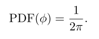
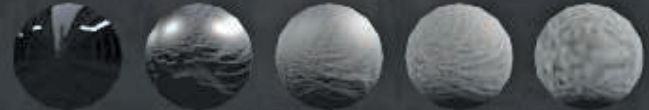

[toc]


# Wire Antialiasing


## 1. 介绍

本章提出了一种解决游戏中一个特定但常见的、**几何锯齿子集**的技术，即**电话线和类似的细长物体**的问题。虽然该技术被称为`Wire Antialiasing`，但它适用于任何**可以被分解为一组圆柱形的物体**。这包括电线、管道、杆子、栏杆、甚至是**几何表示的草**。


## 2. 算法

### 前瞻

非常薄的几何体，如电线，当它变成**亚像素大小**时，往往会退化成**一组闪烁和断开的像素**。为什么会这样呢？从技术角度讲，是可见性函数被**欠采样**。通俗地说，电线只是错过了这些像素。一个像素只有在几何体覆盖了像素中心的情况下才会有渲染。如果电线比像素还细，那么在某些地方，它就会在两个像素中心之间滑动，最终**不对任何像素进行着色**。线越细，问题就越严重。那么，这种技术的想法就是简单地保持**线的宽度**为一个像素或更大。为了模拟一个**亚像素的覆盖**，我们只需通过将`coverage`输出到`alpha`并应用**混合**，来淡化线。

那`MSAA`呢？不幸的是，`MSAA`并不能解决这个问题，但能在一定程度上缓解，但改进是有限的（对于$4\times$，那么我们就允许**半个像素大小的线**）。

虽然`MSAA`不能解决**薄的几何问题**，但它对这种技术仍然是有价值的。虽然我们保证了**无间隙的电线**（使用`Wire Antialiasing`），但我们并没有产生**光滑的抗锯齿结果**。事实上，默认情况下，电线会有锯齿状。所以我们用`MSAA`来去除这些锯齿。因此，尽管启用`MSAA`后**可视性函数采样率**提高了，我们仍然将导线限制在**一个像素的宽度**，并为`MSAA`保留额外的分辨率。因此，我们的技术是独立于`MSAA`的。它也可以在没有`MSAA`的情况下运行，但是电线看起来会和**场景的其他部分**一样存在锯齿（但不会比它们更糟糕）。

### 方法

`wire`在**顶点缓冲区**中的表示方式与通常设计`wire`的方式很相似，但我们需要在运行时改变**这条线的半径**，所以我们不存储最终的顶点位置，而是**存储线的中心**。然后，**最终的顶点位置**将通过**沿法线位移顶点**来计算。为此我们提供了一个世界空间下的**线的半径**。这通常是常数，最好在`c buffer`中传递，但对于某些类型的物体（如天线塔、灯柱和草杆），为每个顶点存储一个半径值可能是有意义的。

第一步是估计我们**允许多小的半径**，而不违反**最小一像素宽度的要求**。这与转换后的**顶点的w值**呈线性关系，这取决于**视场（FOV）角度**和**渲染-目标分辨率**。用通常的方式计算**垂直FOV的投影矩阵**，可以计算出一个恒定的比例因子：


这个值可以计算一次，并作为一个常数传递。然后，**一个像素宽的线半径**是通过乘以**顶点的w值**而得到的。**w值**可以通过**顶点位置**与**视图投影矩阵的最后一行**（或列，取决于使用的矩阵惯例）之间的点乘来找到。一旦我们知道了**一个像素宽的线半径**，我们就可以简单地将半径`clamp`在这个值里。这方面的着色器代码在清单`1`中。

[list 1]()

```c++
// Compute view -space w 
float w = dot(ViewProj[3], float4(In.Position, 1.0f));

// Compute what radius a pixel -wide wire would have 
float pixel_radius = w * PixelScale;

// Clamp radius to pixel size. 
float new_radius = max(Radius, pixel_radius);

float3 position = In.Position + radius * In.Normal;  //Radius ?

// Fade out with the reduction in radius versus original. 
float fade = Radius / new_radius;
```

虽然**调整半径**可以保证我们得到**无缝隙的电线**，但如果我们不同时考虑**原始未展开的电线**的像素覆盖率，那么电线会随着距离的增加而显得**越来越宽**。我们需要做的是通过计算**未扩展线的覆盖率**来进行**补偿**，并相应地**淡化`fade`贡献**。这将使导线具有自然和无锯齿的外观。这可以通过将`coverage`输出到`alpha`并启用**alpha混合**，来实现。如清单`1`中的最后一行所示，**覆盖率消退系数**`coverage fade factor`只是**电线的原始真实半径**除以**扩展半径**。换句话说，如果半径被扩大到两倍，以覆盖一个像素，那么线的宽度是半个像素，覆盖率因此是`0.5`。当距离越远，会显得**越来越暗**，保持细线的外观。


### 光照

我们已经消除了**几何锯齿**，但不幸的是，细线也容易受到**着色锯齿**的影响，因为照明**非常稀疏和伪随机地采样**。当电线达到像素大小时，**任何纹理取样都可能下降到最低的mip-map**，并在默认情况下得到均匀的颜色；然而，在一个像素的过程中，法线可以从直上到直下，会导致**照明的严重锯齿**。处理这个问题的最简单的方法是选择一个**柔和的照明模型**，使其产生最小的锯齿。对于许多电线来说，这已经足够好了，因为它可以很好地融入环境中。然而，即使是这种简单的模型，在插值器上启用**中心点采样**也是至关重要的。**线外采样引入的误差**实在是太大了。


我们已经尝试了`2`种方法，它们的效果都很好，而且还可以结合起来。

- 第一种方法是像往常一样简单地计算照明，然后也计算**半兰伯特**，然后在这两者之间进行`fade`。在测试场景中，一个好的淡化范围是从**大约4个像素宽**，在达到一个像素时完全淡化到半朗伯。根据照明模型和参数，可以进行不同的调整。这种方法的优点是直截了当、简单，而且往往效果相当好。
- 尝试的另一种方法是**将法线在距离上拉平**。`wire`越细，我们就越是将法线向**观看者视角下的中心法线**弯曲。当电线下降到一个像素的宽度时，**法线就会完全变平**，从而产生一个统一的照明结果。由于这只是修改了输入的法线，所以这个方法与任何照明模型都是兼容的，尽管结果可能会有所不同。


# Physically Based Light Probe Generation on GPU :star:


## 1. 光探针理论


对于空间中的某一特定位置，**预积分的照明信息**通常被称为**光探针**。我们为积分定义两个光探针：**漫反射光探针**和**镜面光探针**。


## 2. 在GPU上生成光探针

空间中**某一点的环境光照**可以很容易地通过将场景渲染成**立方图纹理**来表示。当渲染到立方体贴图中时，我们运行**预积分步骤**。在一个探针的预积分步骤完成后，我们转到下一个光探针并重复这个过程。

在**立方体贴图**生成之后，我们需要解决方程中的**渲染积分**。一个著名的生成探针的工具叫做==CubeMapGen== 。这个工具可以用在管道上，从环境中生成**照明信息**。它是开源的，所以如果需要的话，它可以被修改。然而，这个工具使用`CPU`对`specular cube maps`进行预过滤，需要大量的时间来处理高分辨率的`environment map`。因为我们的目标是在**关卡加载时**生成光探针，所以GPU的解决方案似乎更有利。

### 从环境贴图中生成漫反射光探针

首先，我们需要定义**漫反射BRDF**。我们使用归一化`Lambertian BRDF`。它非常简单，容易预积分，也符合所需的视觉质量：


上诉方程中的积分取决于两个矢量：**法线和光照方向**。虽然法线在每个渲染点上是恒定的，但入射光线（$L_i$）在整个半球上是变化的。我们将**立方体贴图**中的每个像素都视为一个光源。因为漫反射BRDF并不取决于视线方向，所以我们对每个可能的法线方向的渲染方程进行积分。我们通过使用`GPU`将渲染方程实时积分并投影到`SH`上。

### 从环境贴图中生成镜面光探针


与漫射光探针一样，我们需要对镜面积分进行预积分。然而，镜面BRDF中的变量很多。为了简化**预积分的BRDF**，我们首先假设材料上既没有菲涅尔效应（`F`）也没有阴影遮蔽（`G`）。这就从公式中删除了F和G项。我们根据**反射方向R**进行积分。此外，立方体贴图的**不同mip级别**对应于**不同的粗糙度值**。法线（`N`）是唯一剩下的未知变量。为了进一步简化积分，我们假设`N`等于`V`，这意味着`R`也等于`V`。因此，==预积分的镜面BRDF==为：{**6**}


假设`N`等于`V`，显然会产生误差。此外，我们还通过删除`F`和`G`项来引入不精确性。在运行时，我们通过乘以**菲涅尔项**来补偿这一误差。 方法非常类似于Brian Karis介绍的`split-sum`。不同的是，通过`split-sum`，他们考虑到了`F`和`G`项，这在间接照明中产生了**更准确的结果**。

***Monte Carlo importance sampling***

为了解决方程`6`中的积分，我们使用下列方程中所示的**蒙特卡洛重要性抽样方法**：


其中$p(x)$​是==概率分布函数==（`PDF`）。

可以把**重要性抽样**看作是：==试图集中在函数中最 "重要 "的区域==。如果我们可以想象一个非常平滑和规则的函数（图`a`），那么采样位置对结果的影响就很小。但是当函数有局部极端时（图`b`），就很难正确估计积分，需要**更多的样本**。重要性抽样有助于捕捉那些**对最终计算结果有较大影响的样本**。


***BRDF importance sampling***

将**BRDF形状**作为一个`PDF`，可以得到一个与积分点非常匹配的采样分布。例如，对于一个镜子一样的表面，关注**反射方向周围的方向**是有意义的，因为这将是**大部分可见光线的来源区域**。为了密切匹配镜面BRDF的形状，我们根据分布函数D和**半矢量H与法线N之间的余弦**建立`PDF`。这是因为`D`对`BRDF`的形状影响最大。与余弦项相乘将有助于进一步的计算。


**GGX微面分布**给我们提供了**围绕法线的半向量的分布**。因此，`PDF`是在**半矢量空间**定义的。然而，积分步骤（方程`6`）需要对**特定视线方向的光向**进行积分。因此，我们需要将`PDF`从半矢量空间转换成光空间（从`PDF(H)`转换成`PDF(L)`）。这种**PDF的转换**是简单的：


因为我们可以用**球面坐标** $j,θ$ 来表示半向量，所以我们可以把`PDF`表示为$PDF(j)$和$PDF(θ)$​的乘法：


$PDF(H)$不依赖于角度$\phi$。所以我们可以简单地推导出：



所以：


通过使用**蒙特卡洛重要性抽样**，以及`PDF(H)`，现在有了所需要的一切来近似**渲染积分的镜面部分**：


其中$w_i$​​是采样的光方向。`PDF`只给了我们某个方向$x$​​的概率。实际上需要的是逆向的；==我们需要能够根据给定的概率生成样本==。我们首先计算我们的**PDF的累积分布函数**（`CDF`）。对于一个值`x`，`CDF`定义了$[0 : 1]$区间上与$PDF(x)$**成比例的均匀分布的值** $ε$​​。虽然`CDF`具有**均匀的单位概率分布**，但它实际上与我们的愿望相反。为了解决我们的问题，我们只需要计算**反的CDF**（下图`b`）。


下面的公式显示了**CDF的正式定义**：


其中，$q=cos(\theta_H)$。我们现在**反转CDF函数**，以产生从均匀值$ε_1,ε_2$，到角度 $\phi,\theta$​​​ 的映射：{**11**} {**12**}


最后，我们现在可以根据方程从$[0 : 1]$中的**均匀分布的随机值**（$ε_1,ε_2$）生成一个方向（ $\phi,\theta$​ ）。将所有这些放在一起，我们得到：

[list 1]()

```c++
//e1 , e2 is pair of two random values 
//Roughness is the current roughness we are integrating for 
//N is the normal 
float3 ImportanceSampleGGX(float e1, float e2, float Roughness, float3 N)
{
    float a = Roughness * Roughness;
    
    // Calculate phi and cosine of theta using Equations (19.11) 
    //and (19.12) 
    float phi = 2 * PI * e1; 
    float cos_theta = sqrt((1 - e2) / (1 + (a * a - 1) * e2)); 
    float sin_theta = sqrt(1 - cos_theta * cos_theta);
    
    // Build a half vector 
    float3 H; 
    H.x = sin_theta * cos(phi); 
    H.y = sin_theta * sin(phi); 
    H.z = cos_theta;
    
    // Transform the vector from tangent space to world space 
    float3 up = abs(N.z) < 0.999? 
    float3 (0,0,1): 
    float3 (1,0,0); 
    float3 right = normalize(cross(up, N)); 
    float3 forward = cross(N, right);
    return right * H.x + forward * H.y + N * H.z;
}

//For the given Roughness and the View vector function 
//samples the environment map using the BRDF importance sampling 
//e1 , e2 is pair of two random values 
//totalWeight the number of the valid samples 
float3 SampleBRDF(float e1, float e2, float Roughness , float3 V) 
{
    float3 N = V; 
    
    // Calculate the H vector using BRDF importance sampling 
    float3 H = ImportanceSampleGGX(e1, e2, Roughness, N); 
    // Calculate the L vector using the standard reflection 
    // equation 
    float3 L = 2 * dot(V, H) * H - V;
    
    float NoL = saturate(dot(N, L));
    
    float3 color = 0; 
    
    //we skip the samples that are not in the same hemisphere 
    //with the normal 
    if( NoL > 0 ) {
    	// Sample the cube map in the direction L 
        color += SampleTex(L).rgb;
    }
	return color;
}
```

我们使用==哈默斯利准随机低差序==，在GPU上生成**均匀分布的随机值** $ε_1,ε_2$​。

[list 2]()

```c++
float radicalInverse(uint bits) {
	bits = (bits << 16u) | (bits >> 16u); 
    bits = ((bits & 0x55555555u) << 1u)|(( bits & 0xAAAAAAAAu) >> 1u); 
    bits = ((bits & 0x33333333u) << 2u)|(( bits & 0xCCCCCCCCu) >> 2u); 
    bits = ((bits & 0x0F0F0F0Fu) << 4u)|(( bits & 0xF0F0F0F0u) >> 4u); 
    bits = ((bits & 0x00FF00FFu) << 8u)|(( bits & 0xFF00FF00u) >> 8u); 
    return float(bits) * 2.3283064365386963e - 10; // / 0x100000000
}

float2 Hammersley(uint i, uint N) 
{
    return float2(float(i) / float(N), radicalInverse(i)); 
}
```


**BRDF重要性取样**（以及一般的重要性取样）的主要问题是**需要大量的样本**，以减少噪声并得到一个**平滑的图像**。当**环境贴图**中存在**高频细节**时，这个问题就更严重了。这样嘈杂的预过滤贴图是一个大问题。我们需要一些**额外的方法**来帮助解决这个问题。




### 预过滤环境贴图

为了保持低噪音水平，每个像素都需要**成千上万的样本**。即使在GPU上对低粗糙度值的每个探针进行预过滤，也可能需要太多的时间。因此，我们使用以下方法来**减少噪声并保持低的样本数**。

这个想法很简单：**当在PDF中数值相对较低的区域存在高频细节时，就会产生噪声**。为了解决这个问题，我们通过创建一个**mip链**过滤掉**高频细节**。这与在**对图像进行下采样**时使用**mip链**来避免锯齿的做法类似。另一方面，对于**高概率的样本，我们仍然从过滤图像中取样**。

我们通过使用一个**采样方向周围的实心角**与环境图中**一个像素所对应的实心角**的比率来进行。在最初的论文中，他们发现，偏置1的mip水平会产生一个较少的噪音结果。然而，在我们的案例中，我们不希望**偏置**，以便为**低粗糙度**保留细节。因此，我们根据**材料的粗糙度**来选择**起始mip**，如清单：

[list 3]()

```c++
float pdf = a / pow(NoH * NoH * (a - 1) + 1, 2); 
pdf = pdf * NoL / (4 * LoH); 
float s_solidangle = 1.0 / (numBRDFSamples * pdf); // sample solid angle

float area = 2 * PI;
float p_solidangle = area / (1.0 * mapW * mapH); // pixel solid angle 

float base_mip = lerp(0, 4, Roughness); // pick starting mip based on roughness

float mipmapLevel = clamp (0.5 * log2(s_solidangle / p_solidangle), base_mip, 5);
```

对环境图进行预过滤可以解决大部分的噪音问题。我们发现**白天的环境效果**很好，因为像素附近的能量是**相对相似的**。然而，对于夜间，虽然结果中没有噪声，但由于极高频率的细节被**过度模糊**，误差仍然较高。因此，我们面临着一个问题：

- 一方面，如果我们不预先过滤环境图，结果就会有**太大的噪音**。
- 另一方面，预过滤会在样本数量少的情况下**产生高误差**。

因此，我们增加了另一种技术，**对具有高粗糙度值的探头进行预积分**。


### 环境贴图重要性采样

之前我们讨论了BRDF的重要性采样，我们使用PDF来匹配BRDF的行为。但是这可能并不总是最好的采样策略。例如，考虑在一个**黑暗的房间**里有**很少的明亮光源**的情况。基于BRDF分布的取样可能会产生许多**错过光源的样本**。在这种情况下，最好改为生成**倾向于指向光源的样本**。

==环境图重要性取样==正好可以实现这一点。我们使用环境图重要性取样，将**样本生成**集中在**具有较高强度的区域**。首先，减少工作的维数，以简化计算。`cube map`纹理采样是基于三维矢量的，但它实际上只有一个**二维的依赖关系**。我们改用**球面坐标**来表示一个方向。我们还需要将球体映射到一个**线性的矩形纹理**。为了做到这一点，我们简单地将**每个`cube map face`**一个接一个地堆叠起来。


为了产生**具有适当概率的样本方向**，我们需要定义`PDF`、`CDF`和**反CDF**（类似于BRDF重要性采样）。然而，在这种情况下，由于环境图**不是分析性的**，我们需要用这些函数的**离散版本**来工作。我们从PDF开始。我们简单地使用**每个像素的发光度**作为**生成PDF的基础**。我们还需要定义**两种类型的PDF**：边际的`marginal`和条件的`conditional`。我们使用**边际PDF**来寻找将从哪一行的像素中采样。**给定一行的PDF之和**是一个随机样本**落在该行的概率**；这就是==边际PDF==。然后我们用这一行的**条件PDF**来寻找**样本落在哪一列**。条件PDF和边际PDF可以用以下公式计算：{**13**} {**14**}


对于我们定义的每一种类型的`PDF`，都有一个相应的`CDF`：**边际和条件CDF**。当一个`PDF`是纯离散的时候，`CDF`可以被计算为：


简而言之，该算法可以描述如下：

- 在$[0 : 1]$范围内生成一个随机数$α$
- 找到一个`i`，其 $CDF(i)≤α$​
- 然后，`i`是产生的样本

因为我们有了`PDF`、`CDF`和**反CDF**，我们现在可以生成**环境贴图样本**。值得注意的是，由于**样本的位置**既不取决于BRDF，也不取决于渲染点的位置和方向，所以样本可以**在CPU上预先生成**。在GPU阶段，我们只是使用这些样本进行积分。因此，最终的样本生成过程可以描述如下：

- 对于`map`上每一行的每个像素，用公式`13`计算**PDF值**。
- 对于每个`j`，将**条件性PDF**值相加，并将其存入边际$PDF(j)$中。
- 对于每一行，用公式`15`建立**条件CDF**。
- 使用**边际PDF**建立**边际CDF**，使用公式`15`。
- 在`CPU`上预生成`n`个样本，并将其传递给GPU。

下列清单显示了使用**分层抽样法**生成`128`个样本的代码。。通过对样本进行分层，我们可以保证在**平均分布的区域**至少有一个样本。这就减少了样本 "聚集 "在某一特定位置的概率。

```c++
// Pregenerate 128 samples on CPU that we will pass to the GPU 
for(int j = 0 ; j < 16; j++) 
    for(int i = 0 ; i < 8; i++) 
    {
		// Generate random values (e1,e2) using the stratified sampling 
        // method 
        float e1 = float(i) / 8.0f + randf() / 8.0f; 
        float e2 = float(j) / 16.0f + randf() / 16.0f;
       
        // Find the row for the sample based on the conditional CDF 
        int row = lower_bound(marginalCDF, e1); 
        
        // Now , using our row , we find the correct column and therefore 
        // sample 
        int column = lower_bound(conditionalCDF[row], e2);
        
        //Get the PDF values of the sample for the further calculation 
        //of the integral on the GPU 
        float pdfRow = marginalPDF[row]; 
        float pdfColumn = conditionalPDF[row][column];
        
        //Save the sample position and PDF values in the array 
        uint32_t index = i + 8 * j; 
        SamplesData[index * 4 + 0] = row; 
        SamplesData[index * 4 + 1] = column; 
        SamplesData[index * 4 + 2] = pdfRow; 
        SamplesData[index * 4 + 3] = pdfColumn;
	}
```

然后我们有一个样本数组，我们将其传递给`GPU`。`GPU `收到flattened $(u, v)$坐标。为了使用这些样本，我们必须首先将 $(u, v)$坐标转换为方向向量，并将`PDF`从 $(u, v)$​分布转换为**实体角度的分布**。PDF的转换可以从环境图的`unwrapping`中得到，我们在一排有六个`cube-map faces`，每个面的视场等于$\frac{\pi}{2}$：


**环境图重要性采样的最终GPU代码**：

[list 1]()：

```c++
// Calculate the outgoing radiance for the sample direction L 

float3 envMapSample (float Roughness, float2 uv, float3 L, float3 N, float pdfV, float pdfU)
{
	// Cosine weight 
    float NoL = saturate(dot(N, normalize(L))); 
    float3 color = unwrapTex.Load(int3(uv.xy, 0)).rgb;
    
    float3 V = N; 
    float3 H = normalize(L + V); 
    float D = GGX(Roughness, H, N); 
    float brdf = D / (4 * NoL);
    
    // Calculate the solid angle 
    // dA (area of cube) = (6*2*2)/N^2 
    // N is a face size 
    // dw = dA / r^3 = dA * pow(x*x + y*y + z*z, -1.5) 
    float dw = (6 * 4.0 / (CUBEMAP_SIZE * CUBEMAP_SIZE )) * pow(L.x * L.x + L.y * L.y + L.z * L.z, -1.5);
    
    // pdfV and pdfU is the PDFs for [0;1] range in a cube map face. 
    // We need to convert them to a solid angle range. 
    // Each face has HALF_PI fov and we have 6 faces. 
    // Solid Angle PDFu (saPDFu) = PDFu * 6 * HALF_PI 
    // Solid Angle PDFv (saPDFv) = PDFv * HALF_PI
    // E = brdf * color * NoL * dw / (saPDFu * saPDFv) 
    return brdf * color * NoL * dw * / (pdfV * pdfU * 6 * PI * PI * 0.5 * 0.5);
}


float3 SampleENV(int index, float Roughness, float3 N, float3 V) 
{

    //Get the position of the sample 
    float2 uv = samples[index].xy;
    
    //Get the PDF values of the current sample. Note that the final 
    //PDF is pdfV * pdfU 
    float pdfV = samples[index].z; 
    float pdfU = samples[index].w;
    
    // Convert the uv sample position to a vector. We need this to 
    // calculate the BRDF 
    float3 L = normalize(uvToVector(uv)); 
    
    // Sample the light coming from the direction L 
    //and calculate the specular BRDF for this direction
    float3 envIS = envMapSample(Roughness, uv, L, N, pdfV, pdfU); 
    return envIS;
}

float3 PreintegrateSpecularLightProbe(float Roughness, int numENVSamples, float3 R)
{
    //For the preintegration, we assume that N = V = R 
    float3 N = R; 
    float3 V = R;
    
    float3 finalColor = 0;
    
    // Sample all of the pregenerated samples 
    for(int i = 0; i < numENVSamples; i++) 
    {
        finalColor += SampleENV(i, Roughness, N, V); 
    } 

    //The final color needs to be divided by the number of samples 
    // based on the Monte Carlo importance sampling definition 
    finalColor /= numENVSamples;

    return finalColor;
}
```


### 组合这两个重要性采样方法

//todo 比较简单


