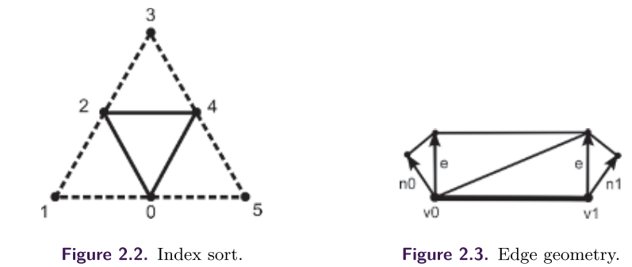

# NPR Effects Using the Geometry Shader


## 1. 之前的工作

==剪影渲染==已经得到了广泛的研究。有两大类算法需要**实时提取剪影**：基于阴影体积的方法和`NPR`。从文献中，我们可以提取两种不同的方法：**物体空间和图像空间算法**。然而，大多数现代算法是在图像空间或混合空间工作的。在本章中，我们关注的是**基于GPU的算法**，我们将介绍这些算法。GPU辅助的算法可以使用多个渲染`pass`来计算剪影。单`pass`方法通常使用某种预计算，以便将相邻信息存储到顶点中，或者利用几何着色器功能，因为这**可以查询相邻信息**。这些算法在一次渲染过程中就能**生成剪影**。

//todo


## 2. 剪影渲染

**剪影渲染**是大多数**NPR特效**中的一个基本元素，因为它在**物体形状的理解**中起着重要作用。在本节中，我们提出了一种新的方法，在**一次渲染过程**中对模型进行检测、生成和纹理处理。

### 算法前瞻

为了在一个步骤中完成整个过程，我们将利用**GPU的一些现代功能**；具体来说，我们将广泛使用**几何着色器**。这个阶段允许进行三角形操作，查询相邻的三角形，并为几何体生成新的三角形。我们的**剪影渲染过程**在管道的不同阶段执行了以下步骤：

- 顶点着色器：顶点以通常的方式被转换到摄像机空间。

- 几何着色器：在这个阶段，通过使用当前三角形及其相邻的信息来检测**属于剪影的边缘**，并生成**相应的几何图形**。
- 像素着色器：对于每个光栅化的片段，它的**纹理坐标**被生成，像素根据从纹理中获得的颜色进行着色。


在我们可以将**一个网格**发送到整个管道之前，我们首先要对**三角形的索引**进行一个**特殊的重新排序**。这将使相邻信息在**几何着色器层面**上可用。为了访问这些信息，我们为每个三角形发送`6`个索引（而不是正常的`3`个），其顺序如下图所示。中心三角形，由`0`、`4`、`2`三个索引，是要分析的。**其余相邻的三角形**需要显示中央三角形的任何一条边**是否属于剪影**。



### 剪影检测和几何生成

我们考虑一个具有**一致方向的三角形**的封闭三角形网格。**三角形的集合**被表示为，$T_1 . . . T_N$​​​。**顶点的集合**是$ℜ^3$​​​中的 $v_1 . . . v_n$​​​，法线由三角形给出：$n_t$​​是三角形 $T_t=[v_i, v_j, v_k]$​​的法线。这个**三角形的法线**被定义为矢量$(vj-vi)×(vk-vi)$​的归一化。给定一个在位置 $x∈ℜ3$ ​​的观察者，如果$(v-x)\cdot n≤0$，我们可以说一个三角形在`v`是**正面的**，否则是背面的。**三角形网格的剪影**是指相邻三角形中的一个是正面朝向，而另一个是背面朝向的边的集合。

为了检测三角形网格中的剪影，我们需要处理三角形，以及**与之共享一条边的三角形**。这个测试是在**几何着色器层面**对被处理的三角形的每条边进行的。为了避免在处理正面和背面的三角形时出现重复的剪影，我们**只为正面三角形生成剪影**。下列清单中的代码显示了如何在几何着色器级别**检测剪影的边缘**。

[list 1]()

```c++
[maxvertexcount (21)] 
void main(triangleadj VERTEXin input[6], 
          inout TriangleStream <VERTEXout > TriStream )
{
    // Calculate the triangle normal and view direction. 
    float3 normalTrian = getNormal(input[0].Pos.xyz, input[2].Pos.xyz, input[4].Pos.xyz);
    float3 viewDirect = normalize(-input[0].Pos.xyz - input[2].Pos.xyz - input[4].Pos.xyz);
    
    //If the triangle is frontfacing 
    [branch]if(dot(normalTrian, viewDirect) > 0.0f) 
    {
    	[loop]for(uint i = 0; i < 6; i += 2) 
        {
        	// Calculate the normal for this triangle. 
            float auxIndex = (i + 2) % 6; 
            float3 auxNormal = getNormal(input[i].Pos.xyz, input[i + 1].Pos.xyz, input[auxIndex].Pos.xyz);
            float3 auxDirect = normalize(-input[i].Pos.xyz - input[i + 1].Pos.xyz - input[auxIndex].Pos.xyz);
            
        	//If the triangle is backfacing 
        	[branch]if(dot(auxNormal ,auxDirect) <= 0.0f) 
            {
                //Here we have a silhouette edge.
            }
		}
	}
}
```

如图2.3所示，一旦一条边（用$\overline{v_0v_1}$​​​​​​​​表示）被确定为**剪影**，我们就应用算法生成作为剪影的几何图形。它由四个三角形组成。**构成四边形的中央三角形**是通过**挤压边缘顶点**生成的，使用**与边缘和视图方向正交的矢量**作为挤压方向。其余的三角形是由**边缘的顶点**按照屏幕上投影的**顶点法线方向**挤压产生的。这种几何体的生成可以在世界空间或屏幕空间中进行。我们通常使用**屏幕空间**，因为这种方式更容易获得**屏幕上尺寸恒定的剪影几何体**。生成这种几何体所需的代码出现在下列清单中

[list 2]()

```c++
// Transform the positions to screen space. 
float4 transPos1 = mul(input[i].Pos, projMatrix); 
transPos1 = transPos1 / transPos1.w; 
float4 transPos2 = mul(input[auxIndex].Pos, projMatrix); 
transPos2 = transPos2 / transPos2.w;

// Calculate the edge direction in screen space. 
float2 edgeDirection = normalize(transPos2.xy - transPos1.xy);

// Calculate the extrude vector in screen space. 
float4 extrudeDirection = float4(normalize(float2(-edgeDirection.y, edgeDirection.x)), 0.0f, 0.0f);

// Calculate the extrude vector along the vertex 
// normal in screen space. 
float4 normExtrude1 = mul(input[i].Pos + input[i].Normal, projMatrix);
normExtrude1 = normExtrude1 / normExtrude1.w; 
normExtrude1 = normExtrude1 - transPos1; 
normExtrude1 = float4(normalize(normExtrude1.xy), 0.0f, 0.0f); 
float4 normExtrude2 = mul(input[auxIndex].Pos + input[auxIndex].Normal, projMatrix);
normExtrude2 = normExtrude2 / normExtrude2.w; 
normExtrude2 = normExtrude2 - transPos2; 
normExtrude2 = float4(normalize(normExtrude2.xy), 0.0f, 0.0f);

// Scale the extrude directions with the edge size. 
normExtrude1 = normExtrude1 * edgeSize; 
normExtrude2 = normExtrude2 * edgeSize; 
extrudeDirection = extrudeDirection * edgeSize;

// Calculate the extruded vertices. f
loat4 normVertex1 = transPos1 + normExtrude1; 
float4 extruVertex1 = transPos1 + extrudeDirection; 
float4 normVertex2 = transPos2 + normExtrude2; 
float4 extruVertex2 = transPos2 + extrudeDirection;

// Create the output polygons. 
VERTEXout outVert;

outVert.Pos = float4(normVertex1.xyz, 1.0f); TriStream.Append(outVert); 
outVert.Pos = float4(extruVertex1.xyz, 1.0f); TriStream.Append(outVert); 
outVert.Pos = float4(transPos1.xyz, 1.0f); TriStream.Append(outVert); 
outVert.Pos = float4(extruVertex2.xyz, 1.0f); TriStream.Append(outVert);
outVert.Pos = float4(transPos2.xyz, 1.0f); TriStream.Append(outVert); 
outVert.Pos = float4(normVertex2.xyz, 1.0f); TriStream.Append(outVert);

TriStream.RestartStrip();
```

### Silhouette Texturing

一旦剪影几何体被生成，很明显，对这个几何体进行纹理处理会增加**可以实现的效果**。为了对剪影几何体进行适当的纹理处理，我们需要**生成纹理坐标**。纹理坐标的生成有点棘手，因为我们需要沿着整个剪影生成连续的坐标。因此，我们不能简单地为每个边缘分配从0到1的坐标，因为如果边缘不是以相同的长度创建，这将导致不规则的坐标分布。相反，我们需要一个**全局性的坐标生成策略**，因为**剪影的每个三角形**都不知道邻近三角形的坐标。从两个纹理坐标`u`和`v`来看，坐标`v`可以简单地定义，因为只要我们离开物体，它就会从`0`变为`1`，如下图所示。

坐标`u`必须以这样的方式产生，即它的值**沿着物体的轮廓**是连续的。为了确保两个相邻的边缘会产生一致的纹理坐标，我们将建立一个取决于顶点在屏幕上的投影位置的函数。结果是，坐标将是连续的，因为相邻的边共享一个顶点。当**几何着色器**将生成的顶点的`x`和`y`坐标以及`v`坐标发送到屏幕上时，这就实现了。像素着色器将重新获取这些坐标作为插值，并生成相应的`u`值。下图`2`显示了这些信息的使用方法。顶点`e`从线性插值中得到它们的坐标，


 //todo


# Alpha Blending as a Post-Process


## 1. 介绍

在这篇文章中，我们将介绍一种**新颖的阿尔法混合技术**，它是为越野赛车游戏《Pure》开发的。


## 2. 替代品

`Dx9`提供了几种渲染**叶子几何**的选择。

- `Alpha blending`。阿尔法混合使用**像素着色器输出的标量值**（$\alpha$）来混合渲染的片段和**目标像素数据**。当用**阿尔法混合**渲染叶子层时，**Z-缓冲器的伪影**是很常见的。如果对渲染的基元**进行排序**，使其先画出**离相机最远的基元**，这在很大程度上可以得到解决。在渲染前对基元进行排序通常会使游戏渲染的**CPU成本过高**，而在**基元相交**的情况下，可能确实**没有一个正确的绘制顺序**。
- `Alpha testing`。阿尔法测试使用**像素着色器输出的二进制值**来确定输出片段**是否可见**。阿尔法测试通常与**`z-buffering`技术**结合在一起，当场景以前后顺序排序时，它可以否定对**几何深度排序**的需要，或者提供**填充率优化**（通过`z-rejection`的方式）。`Alpha testing`是迄今为止最常用的解决方案之一；但是该技术**在阿尔法边缘容易产生锯齿**。
- `Alpha-to-coverage`。Alpha-to-coverage将**像素着色器输出的alpha值**转换为一个**覆盖掩码**。这个覆盖掩码与**标准的多样本覆盖掩码**相结合，以确定哪些样本应该被更新。当`alpha-to-coverage`与`Alpha testing`结合在一起时，边缘更加柔和，同时保持技术优势，即**排序独立**和`z-rejection`。尽管这是对**简单的阿尔法测试**的改进，但与阿尔法混合中获得的**阿尔法梯度**相比，所产生的阿尔法梯度的质量可能很差。当使用低数量的样本或在不支持灵活覆盖掩码的硬件上时，情况尤其如此。


## 3. The Source Artwork

为了模仿自然界丰富的树叶，每棵树和灌木都是由**众多的多边形平面**构成的。这些平面的方向尽可能地随机，从而增加了树叶的感知密度。从下图中可以看出，这导致了**大量的原始交叉**。这引起了两个问题：

- 我们如何对所有**相交的基元**进行**正确排序**？
- 我们要如何处理单个叶子模型中存在的**高度深度复杂性**？


为了正确地对基元进行**深度排序**，我们需要沿着**所有的交叉点**分割基元。然而，这将**大大增加顶点数量**，给我们的内存预算带来沉重负担，同时也会**增加内存带宽的使用**。当叶子被允许对动态影响（如风或物理碰撞）做出反应时，这些问题会进一步加剧。这种影响甚至可能导致相邻的树叶模型相当不可预测地重叠，因此不可能离线优化，而是需要一个**更昂贵的实时解决方案**。


## 4. 初始尝试

由于模型中**基元的相互渗透程度很高**，我们最初以**最简单的方式**实现了**树叶渲染器**，使用了`z-buffering`和`alpha-test`技术的组合。在对`alpha-reference value`进行试验后，我们设法取得了一些合理的结果，但树叶的整体外观有时会显得有点刺眼。

**最令人反感的效果**发生在摄像机从一侧到另一侧进行**缓慢的平移运动**时——随着摄像机的移动，树叶中的$\alpha$​通道的**孔和边缘**（`holes & edges`）会开始闪烁（由于`alpha-test`的**二进制性质**），并经常被每个树叶模型中**存在的高度深度复杂性**所放大。

接下来，我们把注意力转向了`alpha-to-coverage feature`。`Alpha-to-coverage`的渲染将`alpha-test`技术与`multi-sample rendering`结合起来；它在保持`alpha-test`渲染的所有技术优势的同时，产生**更柔和的边缘**。虽然最初的结果是好的，而且**闪光伪影**确实被削弱了。我们还受到了在**MSAA分辨率**下渲染树叶所带来的**填充率和带宽成本增加**的影响。这两种方法似乎都**不能提供足够高的视觉质量**，而且把所有的树叶量化似乎是一种遗憾。

我们需要一些新的东西——我们觉得答案就藏在**树叶的轮廓**里。


## 5. 屏幕空间的`Alpha Mask`


我们设计的解决方案——**屏幕空间阿尔法遮罩**（`SSAM`）——是一种多`pass`的方法，**不需要任何深度分类或几何体分割**。我们的解决方案可以产生与`Alpha blending`相当的结果，同时使用`alpha-test`技术，在每个像素的基础上正确解决**内部重叠**（和**深度交叉**）。

我们使用一个**全屏的后处理**来有效地进行**延迟alpha混合**，类似于**帧缓冲区混合**，混合操作设置为`ADD`；源参数和目标参数分别设置为`SRCALPHA`和`INVSRCALPHA`。`blend`的输入被渲染到三个`RT`中，然后被绑定到纹理采样器上，被最终的**组合后处理像素着色器**所使用。

在内存资源方面，我们至少需要三个屏幕分辨率的`RT`，其中两个至少有三个颜色通道（rtOpaque & rtFoliage），一个至少有两个通道（rtMask），以及一个深度缓冲器（rtDepth）。注意：这是**MSAA渲染目标内存要求**之外的。

### The Opaque Pass (1)


在第一个`pass`中，我们将所有不透明的场景元素渲染到**彩色渲染目标**中：`rtOpaque`（见上图）；产生的深度信息也被保留并存储在**深度缓冲区**：`rtDepth`（见下图）。对于Pure，我们以**2倍MSAA分辨率**渲染不透明场景，并将颜色和深度缓冲区**下采样**到渲染目标中。在**下采样深度信息**时必须小心，因为**应用过滤**会得到不正确的样本。


我们从深度缓冲器中读取一些样本（在`2×MSAA`的情况下是两个），对它们进行比较，并简单地保留**最接近观察者的样本**。我们继续在非MSAA分辨率下进行渲染，因为据观察，`MSAA`对**alpha生成的边缘的质量**几乎没有任何贡献，除了那些几何性质的边缘。在这一点上，根据平台结构的不同，在继续渲染之前，可能有必要将**采样后的图像**复制到`VRAM`中（重新填充）。

此外，在这一点上，可能需要采取一些措施来更新`hierarchical-z`（hi-z）信息，这些信息可能与`rtDepth`有关，并可能优化后续的`depth occluded`的绘制调用。

### The Mask Generation Pass (2)


在第二个`pass`中，生成了一个**渲染树叶的剪影**，或者说是`MASK`（见上图）。**剪影图**渲染到第二个渲染目标`rtFoliage`中，我们使用之前生成的深度缓冲区`rtDepth`来正确解决由不透明场景引起的`depth occlusions`。`Mask`是一个单色的阿尔法通道值的图像，阿尔法值被**加法混合**到一个黑色的背景上，在此期间，我们启用了**深度测试**，并**禁用了背面剔除和深度写入**。

由于**两个基元的加法混合**会产生相同的结果，而**不用考虑绘制顺序**。它似乎是有效生成`Mask`的理想选择。然而，在使用`Mask`时，一些伪影是很明显的：由于所使用的渲染目标的**比特深度有限**，在最后的组合过程中，加法累积的值会**迅速饱和为白色**——即使是在一个适度的深度复杂度下。当靠近观察者的树叶被期望拥有**低阶不透明度**，但在**高树叶深度复杂度**的区域被渲染时，**饱和度最为明显**。

为了生成**高质量的遮罩**，我们需要从剪影中获得**尽可能多的细节**；因此我们在这一过程中把`alpha-reference`渲染状态设置为`0`，以避免排斥**低不透明度的alpha值**。对加法混合的改进是使用**最大混合模式**。在这种情况下，我们建立了一个写入**每个像素的最高alpha值**的图像，实际上就是一个`alpha-z-buffe`。与加法混合一样，我们将**源和目的混合参数**设置为`D3DBLEND_ONE`，但将混合操作改为`D3DBLENDOP_MAX`。从下图中可以看出，**最大混合的`Mask`**包含了更高程度的的结构信息。


> 上面那么多话？本质上，就是在渲染透明物的`pass`（第二个`pass`）中，将每次进行混合的公式不再是$c_o=\alpha_s c_s+c_d$，而是$c_o=max(\alpha_sc_s, c_d)$​（由于这里处理的是遮罩，所以实际上`c`都可以视为常量`1`）

尽管有这些吸引人的特质，当`max-blended mask`在最后的组合过程中被用作**混合因子**，树叶就变成了**完全透明**的样子。我们感到，也许**解决方案就在这两种方法之间**。我们的想法是，也许两种`mask`的**某种线性组合**会是是答案。

***Separate alpha blend enable***

大多数DX9类硬件支持为**颜色和阿尔法通道**指定**独立的混合操作和参数**。通过启用`D3DRS_SEPARATEALPHABLENDENABLE`并设置正确的操作和参数系列，可以同时将`max-blended mask`写入**RGB通道**（作为一个单色图像），并将`additively-blended mask`写入**alpha通道**（见表3.1）。注意：这两个`Mask`在以后的阶段进行合并——在最后的合成过程中作为混合因子使用之前。为了将alpha值发送到**两个混合单元**，我们需要将**alpha值**复制到**所有的颜色通道**上。这需要对**树叶着色器的末端**做一个小的修改，类似于：


### The Color Pass (3)


在第三个`pass`中，我们将**叶子颜色的图像**渲染到最终的渲染目标：`rtFoliage`（见上图），并再次使用`Pass 1`中获得的**深度缓冲区**——存储在`rtDepth`中。为了保持**正确的深度排序**，我们禁用了**背面剔除和alpha混合**，同时启用了`alpha test rendering`、深度测试和深度写入。在这个过程中，启用深度写入还可以确保任何随后渲染的透明物体都能与树叶一起**正确进行深度排序**。

在启用`alpha testing`渲染叶子的颜色时，必须选择一个**合适的阿尔法参考值**。我们把**颜色通道的阿尔法参考值**暴露给艺术家们进行调整。**最终的值**是在两个值之间进行权衡（`clamp`?）。首先是一个足够高的值，以产生视觉上**令人愉悦的阿尔法测试边缘**——对于Pure来说，最终的值$≈128$。其次是一个足够低的值，以尽量减少伪影，$≈64$。

### The Final Composition Pass (4)


在第四个也是最后一个`pass`中，我们渲染了一个全屏后处理，基本上是对不透明图像和叶色图像进行**线性插值**，使用**遮罩图像**作为混合因素。最后的==合成混合方程==类似于 ：


为了确保我们对每个屏幕像素只采样一个`texel`，我们将平台的纹理采样中心考虑在内，并相应地调整纹理坐标。我们现在有**两个遮罩图像**需要处理，即**最大和加法混合的遮罩**。它们需要以某种方式组合成一个**标量混合因子**。在我们的实现中，我们选择使用**线性插值**来组合遮罩。最终组成的混合方程类似于：


**两个遮罩的插值**引入了`maskLerp`值，必须为其选择一个值。像**阿尔法参考值**一样，这是以纯艺术的理由来选择的，也被暴露给艺术团队进行实验。***Pure*** 的最终值是`0.85`


## 6. 阿尔法参考值问题

由于在`Pass 3`中采用了`alpha test rendering`，所以选择了一个**阿尔法参考值**——一个足够高的值，以阻止重叠的边缘显得过于厚重（如前所述，对于***Pure***来说，选择了一个≈64和≈128之间的值）。因此，在叶子与不透明图像混合的地方，有时会出现**类似光晕的混合伪像**。（如下图）


### 清晰的屏幕颜色修复

由于**α-参考值**在颜色通道中被设置为一个比**遮罩生成`pass`**中设置的值**更高的值**，沿**α梯度**向外移动（从`1`到`0`），你实际上可以在**遮罩强度**达到`0`之前耗尽`foliage-color pixels`。这就会在**遮罩强度**低于**α参考值**的像素中显示出**一定比例的背景色**。

Pure采用的解决方案是将`foliage-color pass`的`clear screen color`暴露给艺术家，其想法是通过调整颜色，可以**淡化伪影**，直到它几乎不可见。这种技术效果很好，但感觉不是很理想，特别是由于艺术家们每层只能选择一种颜色。这种颜色还倾向于影响**场景的整体色彩平衡**。

### The Squared Alpha Trick

对最后**组成的像素着色器**的最后一行做了一个**小的修改**，大大改善了混合的质量，几乎完全弥补了**前述的alpha-reference伪影**：


应该注意的是，虽然对**阿尔法通道**进行平方，确实会使**叶子的轮廓**收缩一些。但略微减少`foliage-color pass`（`3`）的**阿尔法参考值**应该可以弥补这一点。

> **叶子的渲染**绝不是渲染游戏的最后一步。还有许多**其他的alpha混合元素**需要集成到场景中：草、光轴和粒子效果。由于在`foliage-color pass`中启用了**深度写入**。这确保了任何**后续的深度测试**都能**正确解决**。


## 7. Source Code

[list 1]()

```c++
//a typical mask rendering pixel shader.

sampler2D foliageTexture : register(s0); 

struct PS_INPUT 
{

    half2 TexCoord : TEXCOORD0; 
};

half4 main(PS_INPUT In) : COLOR 
{

    return tex2D(foliageTexture , In.TexCoord).wwww; 
}
```

[list 2]()

```c++
//the final composition pixel shader. Bibliography

sampler2D rtMask : register(s0); 
sampler2D rtOpaque : register(s1); 
sampler2D rtFoliage : register(s2); 
half maskLerp : register(c0); // 0.85h

half4 main(float2 texCoord: TEXCOORD0) : COLOR 
{
    half4 maskPixel = tex2D(rtMask, texCoord); 
    half4 opaquePixel = tex2D(rtOpaque, texCoord);
    half4 foliagePixel = tex2D(rtFoliage, texCoord);
    half mask = lerp(maskPixel.x, maskPixel.w, maskLerp);
    return lerp(opaquePixel, foliagePixel, mask * mask);
}
```

