[toc]


# Virtual Texture Mapping 101

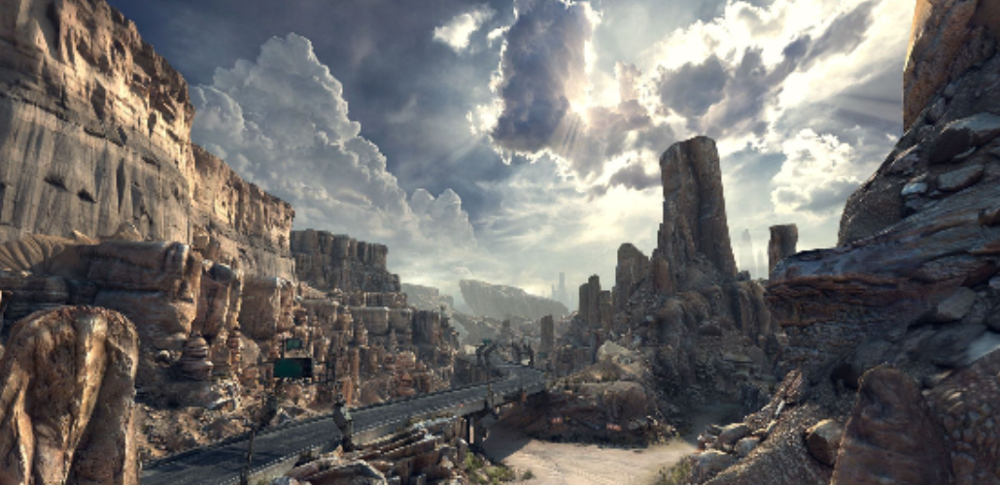

## 1. 介绍

==虚拟纹理映射==（`VTM`）是一种将**纹理所需的显存量**减少到**只取决于屏幕分辨率**的技术：对于一个给定的视角，我们只在显存中**保留纹理的可见部分**，在适当的**MIP映射级别**（见下图）。

在本章中，我们将研究如何实现**一个功能齐全的VTM系统**。

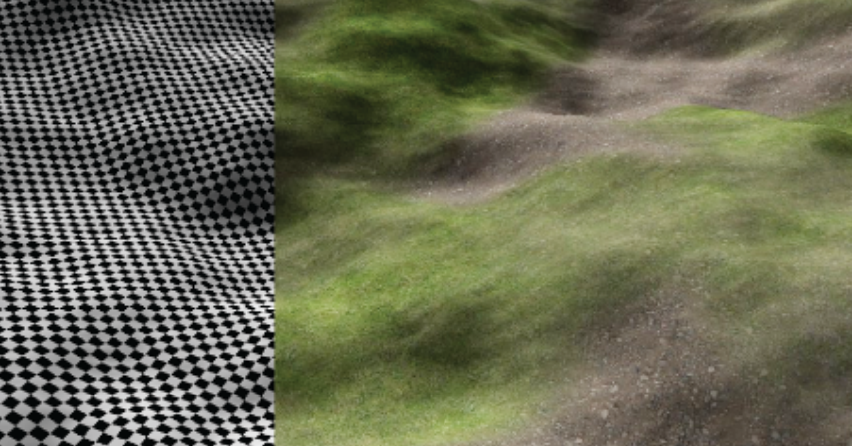


## 2. 虚拟纹理映射

早期的纹理管理方案是为**单一的大纹理**设计的，而最近的**VTM系统**更加灵活，模仿了**操作系统的虚拟内存管理**：纹理被分为小块`tiles`，或`pages`。这些都是**自动缓存的**，并根据**当前渲染视角的需要**加载到`GPU`上。然而，有必要将**对缺失数据的访问**重定向到一个**备用纹理**。这可以防止在渲染中出现 "空洞`holes`"，或者阻塞并等待加载请求的完成。我们的实现受到了Sean Barrett [Barret 08] 的GDC演讲的启发。

如下图所示，我们在每一帧开始时确定哪些`tiles`是**可见的**。我们确定那些没有被缓存的`tiles`，并**从磁盘上请求它们**。在`tiles`被上传到GPU上的`tile cache`后，我们更新一个`indirection texture`或`page table`。最终，我们渲染场景，对**指示纹理**进行初始查找，以确定在`tile cache`中的取样位置。

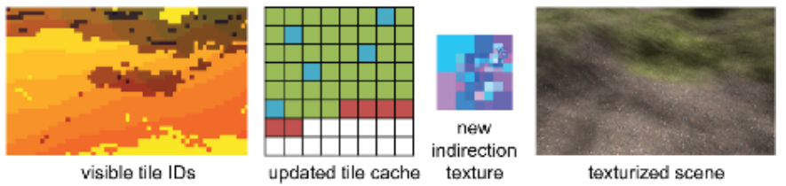

**指示纹理**`indirection texture`是**完整虚拟纹理的缩小版**，其中每个`texel`都指向`tile cache`中的一个`tile`。在我们的例子中，`tile cache`只是GPU上的**一个大纹理**，包含相同分辨率的、小的`square tiles`。这意味着**来自不同MIP图层的`tiles`**覆盖了虚拟纹理的**不同大小的区域**，但大大**简化了`tile cache`的管理**。

### Page Fault Generation

对于每一帧，我们确定**可见的tiles**，在其中识别**尚未加载到GPU上的tiles**，并从磁盘上请求它们。**未来的硬件**可能会通过**本地页面故障`page faults`**来简化这一过程，但我们仍然需要确定**可见的tiles**，替换数据并**重新定向内存访问**。

一个简单的方法是用一个**特殊的着色器**来渲染整个场景，该着色器将**虚拟纹理坐标**转换为`tiles ID`。通过渲染场景的实际几何形状，我们可以很容易地处理`occlusion`。然后，**帧缓冲区**被读回来，与其他管理任务一起**在CPU上处理**。由于`tiles`通常覆盖几个像素，因此可以用**较低的分辨率**渲染`tiles ID`，以减少带宽和处理成本。另外，为了预先获取 "很快 "就能看到的`tiles`，可以**稍微增加视场**。相应的**着色器代码**可以在第`5.2`节找到。

### Page Handler

`page handler`从磁盘加载请求的`tiles`，将它们上传到`GPU`上，并更新`indirection texture`。根据**磁盘延迟**和**摄像机的移动**，加载`tiles`可能成为一个瓶颈。为了说明这一点，我们在一个由**单一虚拟纹理**覆盖的大地形上飞行，并在下图中绘制了每帧的时间。考虑到一个**合理的大贴图缓存**，很少有`tiles`被重新查询，平均每帧的I/O和渲染需要不到`10ms`。然而，在第`512`帧，我们把摄像机转了`180`度，然后**继续向后**。这个掉头动作需要超过100个`tiles`，需要`350ms`的时间来加载。

为了保证渲染的顺利进行，我们只需限制每帧更新的`tiles`数量 。对于不在同一帧内的请求，我们**调整指示纹理**，并将**纹理访问**重定向到`tile cache`中最细的`parent tile`。最粗的级别总是存在的，这就把**负载峰值**分散到了几个帧上。如果**更新限制**大于请求`tiles`的**平均数量**，我们保证最终能赶上请求。在我们的例子中，我们在`95%`的帧中请求少于5块`tiles`，并将**上传限制**设置为非常保守的20块`tiles`。

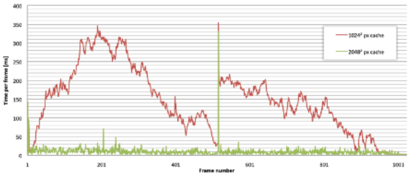

当然，缺失的`tils`会**降低视觉质量**。因此，我们上传**要求的`tiles`及其所有的祖先**，从粗到细进行**优先排序**。这增加了**缓存更新的总数**，但如下图所示，**图像质量**以一种更平衡的方式得到恢复。

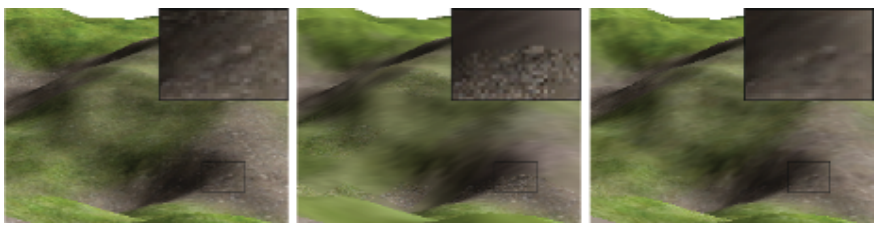

### 渲染

在对表面进行**纹理处理**时，我们使用**虚拟纹理空间**中的片段的**uv坐标**对`indirection texture`进行快速的**无过滤查询**。这就提供了目标`tiles`在缓存中的位置，以及**它的MIP图层**在`indirection texture`的金字塔中的实际分辨率。由于我们的**tiles上传限制**，后者可能与从**片段的MIP贴图层**计算出来的分辨率不同。我们将`tiles`内部的偏移量添加到`tiles`位置，并从`tile cache`中采样。这个偏移量只是**uv坐标的小数部分**，由实际的分辨率来缩放。

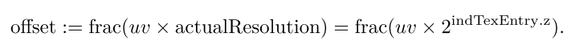

注意，将**实际分辨率**存储为$log2(actualResolution)$​允许我们使用**8位纹理**。完整的着色器代码包括**正确的纹理梯度的计算**（见第`3.3`节）


## 3. 实现细节

### Page Fault Generation

***MIP map level***

为了计算`tiles`着色器中的`tiles ID`，我们需要**虚拟纹理坐标**和**当前的MIP地图级别**。前者直接是**用内插uvs**，但在`DX 9`和`10`硬件上，我们必须使用**梯度指令**手动计算后者：$ddx=(\frac{\delta u}{\delta x},\frac{\delta v}{\delta x})$​和$ddy=(\frac{\delta u}{\delta y},\frac{\delta v}{\delta y})$​​ 是`x`方向和`y`方向的**uv梯度**。利用它们的**最大长度**，我们计算出**MIP MAP级别**为：

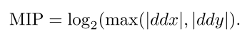

```c++
float ComputeMipMapLevel(float2 UV_pixels, float scale) 
{
    float2 x_deriv = ddx(UV_pixels); 
    float2 y_deriv = ddy(UV_pixels);
    float d = max(length(x_deriv), length(y_deriv));
    return max(log2(d) - log2(scale), 0);
}
```


```c++
float2 UV_pixels = In.UV * VTMResolution;
float mipLevel = ComputeMipMapLevel(UV_pixels, subSampleFactor); 
mipLevel = floor(min(mipLevel, MaxMipMapLevel));

float4 tileID; 
tileID.rg = floor(UV_pixels / (TileRes * exp2(mipLevel))); 
tileID.b = mipLevel; 
tileID.a = TextureID;
return tileID;
```


### Page Handler

***Compressed tiles***

为了有效的渲染，最好是有一个**DXTC压缩`tile cache`**。它在GPU上需要**更少的内存**，并**减少上传和渲染的带宽**。然而，由于**DXTC的压缩率是固定的**，而且相当低，我们使用`JPEG`存储`tiles`，并在上传前将其**转码为DXTC**。这也使我们能够有选择地降低质量。

***Disk I/O***

在我们的教程实现中，为了简单起见，我们将`tiles`存储为**单独的JPEG文件**。然而，读取许多小文件需要缓慢的搜索，并浪费带宽。因此，将`tiles`打包成一个文件是非常重要的，特别是对于像DVD这样**有大扇区的慢速设备**。可以通过只存`2`个MIP图层和计算`2`个其他的MIP图层来**减少存储需求**：如果要求一个中间层，我们就从更细的层中加载**相应的四页**。

***Cache saturation***

未使用的`tiles`被使用**LRU策略**的新请求的`tiles`所覆盖。然而，**当前的工作集**可能仍然不适合在缓存中。在这种情况下，我们删除那些**对视觉质量影响较小的`tiles`**。我们用低分辨率的`tiles`来替换分辨率最高的`tiles`。这与我们的**渐进式更新策略**相得益彰，并迅速释放了**瓷砖缓存**。

***Tile upload***

将`tiles`上传到GPU的速度应该是很快的。使用`DX 9`，我们创建了一个**可管理的纹理**，并让驱动程序处理**上传至GPU的过程**。

***Indirection texture update***

在`tiles`被上传之后，我们通过从头开始重新创建，来更新`indirection texture`。我们首先在其**MIP贴图金字塔的顶部**初始化一个最低分辨率的`tiles`条目，因此每个片段都有一个**有效的回退**。对于每一个更细的层次，我们复制**父纹理的条目**，但用该层次的`tiles`条目来替换副本，如果它们存在于缓存中的话。我们继续这个过程，直到**完整的嵌套纹理金字塔**被填满（见下图）。

如果`tiles`通常是在单一分辨率下看到的，我们可以只上传**最细的级别**到GPU。这就减少了所需的上传带宽，简化了查找工作，并提高了性能。当每个物体都使用一个独特的纹理时，这就足够了，特别是对于地形渲染。

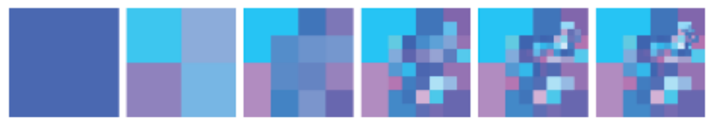


### 渲染

虽然用**虚拟纹理**进行渲染是直截了当的，但正确的过滤，特别是在`tiles`边缘的过滤，却不那么明显。纹理空间中相邻的`tiles`在`tile cache`中很可能不是相邻的。如果要使用硬件过滤单元，过滤就特别有挑战性，因为这些过滤单元依赖于**MIP图和正确的梯度**。下面几段描述了如何使用**各向异性的硬件滤波**，如下图所示，各向异性最大为$4:1$。

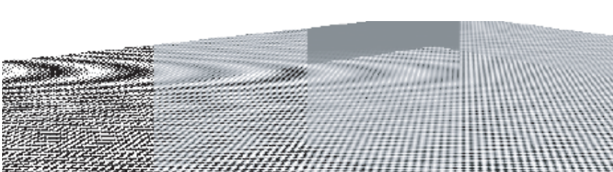

***Texture gradients***

当纹理空间中两个相邻的`tiles`在`tile cache`中**不相邻**时，如下图所示，用于最终纹理查找的uv坐标在相邻的片段之间会有**很大的差异**。这就导致了**大的纹理梯度**，图形硬件将使用一个**非常宽的过滤器**进行采样，产生模糊的接缝。为了解决这个问题，我们从原始的虚拟纹理坐标中手动计算梯度，根据`tiles`的`MIP map level`进行缩放，并将其传递给纹理采样器。

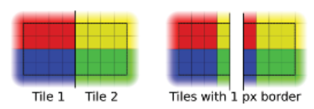

***Tile borders***

即使有了**正确的纹理梯度**，我们仍然要过滤到**邻近的页面**，这些页面很可能包含了完全不同的虚拟纹理部分。为了避免由此产生的**颜色渗漏**，我们需要**添加边框**。我们使用外边界，用一个**四像素的边框**包围我们的$128^2$块瓷砖，使之成为是$136^2$​。这使得分辨率保持在4的倍数，允许我们使用**DXTC**压缩它们，并在硬件中执行$4:1$**各向异性过滤**。

***DXTC border blocks***

如上图所示，给`tiles`添加边界可能会导致**`tiles`边缘**出现**不同的DXTC块**。由于不同的块将被不同地压缩，在虚拟纹理空间中代表相同点的`texels`在两块`tiles`中的值将不一样。这导致了**`tiles`边缘**的颜色渗漏。通过使用一个四像素的外边框，这些与**压缩有关的假象**就会消失。

```c++
//Virtual Texture Lookup 4.

float3 tileEntry = IndTex.Sample(PointSampler, In.UV); 
float actualResolution = exp2(tileEntry.z); 

float2 offset = frac(In.UV * actualResolution) * TileRes;

float scale = actualResolution * TileRes; 
float2 ddx_correct = ddx(In.UV) * scale; 
float2 ddy_correct = ddy(In.UV) * scale;

return TileCache.SampleGrad(TextureSampler, tileEntry.xy + offset, ddx_correct, ddy_correct);
```


# Implementing Fur Using Deferred Shading

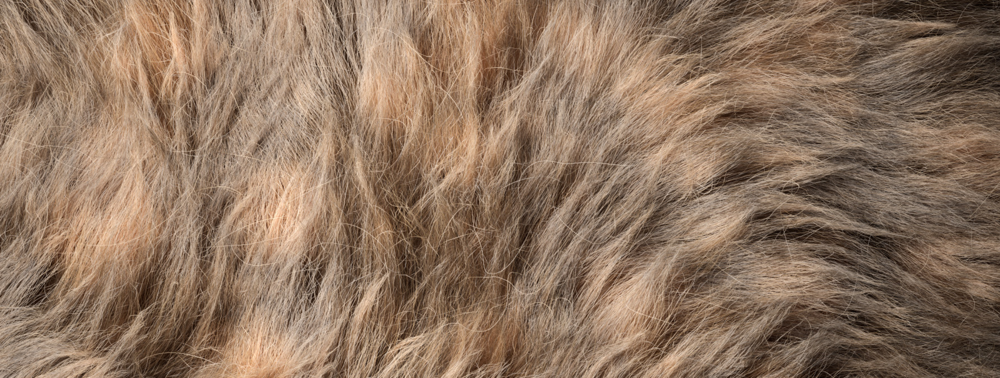

## 1. 介绍

在延迟渲染中，`G-buffer`的格式（下图）定义了所有受光材料和所有光源之间的一个标准接口。每个被分配到受光材料的物体都会向`G-buffer`中写入一组统一的数据，然后由每个光源解释，没有关于原始物体的直接信息。保持这种接口的一个关键优势是，**几何复杂性与照明复杂性脱钩**。这就形成了一个确定的管道，在这个管道中，我们将所有的**几何图形**渲染到`G-buffer`中，删除了几何数据和单个物体之间的联系，除非我们将这些信息存储在`G-buffer`中。然后，我们使用这些信息计算场景中所有光源的光照，创建一个**光照积累缓冲区**。

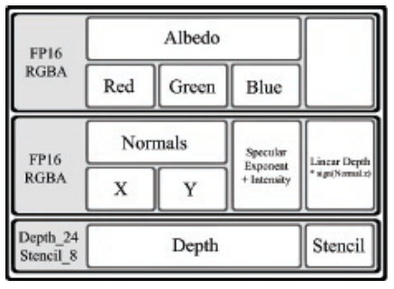

我们可以在材质通道中重新访问这些信息，再次渲染单个网格，并使用**屏幕空间坐标**来识别代表特定物体的**光照积累缓冲区**和**G-缓冲区**的区域。在这之后，一个后处理阶段对**组成缓冲区的内容**进行处理。然而，对相关接口的遵守也对**可以表现的材料和灯光的类型**施加了严格的限制。特别是，延迟渲染解决方案**很难表现透明材料**，因为通过材料看到的表面信息会被丢弃。对于那些以非典型方式反射光线的材质，解决方案也会遇到困难，这可能会增加**所有照明计算的复杂性**和G-缓冲区内所需的信息量。选择`right phases`和缓冲区格式是最大限度提高**延迟渲染能力**的关键。

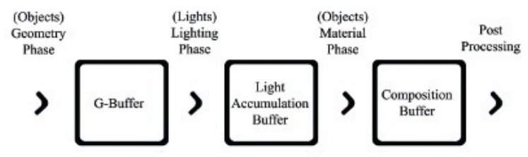


## 2. 毛发

毛皮有许多特性，使它很难使用在延迟渲染解决方案中**表示几何的相同信息格式**。毛皮是一种由许多细线组成的结构性材料，形成一个复杂的体积，而**不是一个连续的表面**。这种结构对于在目前的硬件来说太精细了。由于这种**体积信息**不能存储**在G-缓冲区**中，所以毛皮在接受光线时必须被**近似为一个连续的表面**。

**毛皮的漫反射性质**导致了**次表面散射**；进入毛皮体积的光线在离开介质的不同点之前，被**反射和部分吸收**。单个线`strands`也是透明的，允许光线穿过它们。这通常被看作是一种**光晕效果**；毛皮在光源的映衬下，**从内部照亮了毛皮层**，有效地将**绕着表面地平线的光线**向观察者弯曲。这在具有松散、"蓬松 "结构的毛皮中最为明显（见下图）。

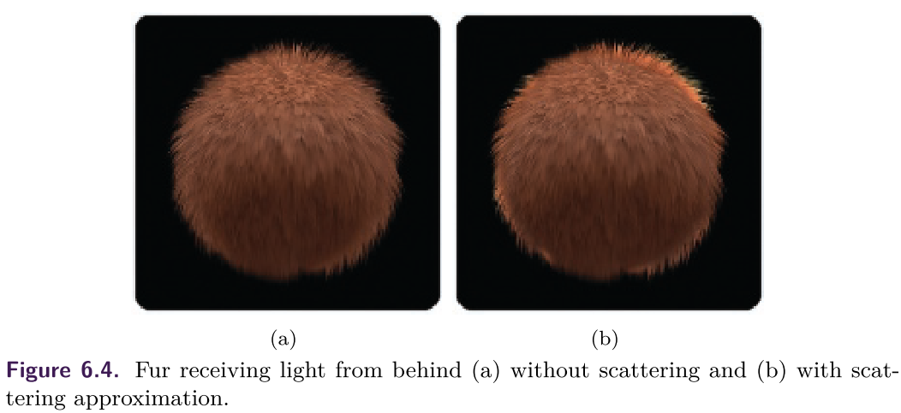

毛皮通常是**不均匀的，有方向性的**，与单个`strands`的结构相结合，创造出**自然的`grain`**。==表面的反射特性==是**各向异性的**，取决于`grain`方向。各向异性发生在以表面纹路为特征的**细脊**`fine ridges`上，如拉丝金属，并导致光线按照**`grain`的方向**反射。这种各向异性在 **"圆滑 "的毛皮**中最为明显，它具有**很强的方向性和相对完整的表面**（见下图）。

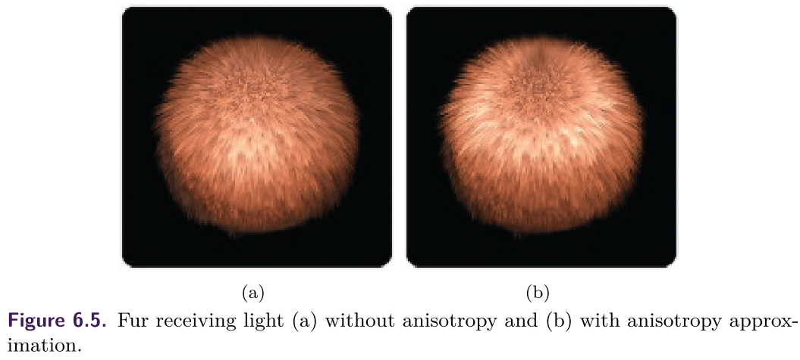


## 3. 技术

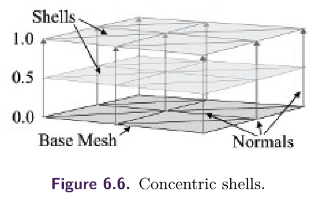

### 使用`Concentric Shells`的体积毛皮渲染技术

**常见的做法**是通过在场景中渲染**体积纹理数据的离散切片**来实时渲染**体积结构**，并使用`alpha blending`来组合结果，例如光与**空气中的尘埃粒子**的交互作用。只要有**足够多的切片**被渲染，累积的结果就会呈现出一个具有**正确透视**、视差`parallax`和`occlusion`的连续外观。

渲染毛皮的`Concentric Shells`方法将**毛皮的体积层**表示为围绕基础网格的**一系列同心壳**；每个壳都是平行于表面毛皮层的**一个切面**。这些壳是通过**再次渲染基础网格**，并将顶点沿着**顶点的法线**向外推开，移动的深度为**毛皮层的几分之一**；毛皮的结构由**包含毛皮重复部分的体积纹理**表示（见上图）。通过在法线之外应用一个**平行于网格表面的偏移量**，我们可以**梳理**`comb`毛皮的体积（见下图）。

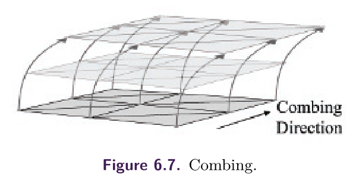

[list]()

```c++
// Get shell depth as normalized distance between base and 
// outer surface. 
float shellDepth = shellIndex * (1.f / numShells);

// Get offset direction vector 
// IN.direction = Combing Direction
float3 dir = IN.normal.xyz + (IN.direction.xyz * shellDepth); 
dir.xyz = normalize(dir.xyz);

// Offset vertex position along fur direction. 
OUT.position = IN.position; 
OUT.position.xyz += (dir.xyz * shellDepth * furDepth * IN.furLength); // ?
OUT.position = mul(worldViewProjection, OUT.position);
```

这种方法还可以通过添加**垂直于网格表面的鳍片`fins`**来进一步增强毛皮绘制，从而提高**轮廓边缘的质量**。然而，作为顶点程序的一部分，`fins`的几何形状不能从基础网格生成，因此这里省略了（关于生成`fins`的几何形状的细节可以在[Lengyel 01]中找到）。

这种技术不能在几何阶段应用，因为**毛皮的结构**是由大量的子像素细节构成的，不能存储在**G-缓冲区**中，因为每个像素必须包含**离散的表面点的值**。因此，在延迟着色中，我们必须在**材料阶段`material phase`**应用**同心壳方法**，从**光照积累缓冲区的一个点**上对每根毛发的**光照和颜色信息**进行采样。这个点的坐标可以通过将**基础网格的顶点位置**转化为屏幕空间来找到，转化的方式与最初在几何阶段的转化方式相同（清单`2`）。

[list 2]()

```c++
// Vertex shader. 
// See (Listing 3.1.1) for omitted content. 
// Output screen position of base mesh vertex. 
OUT.screenPos = mul(worldViewProjection, IN.position);

// ---------------------------- 
// Pixel shader.
IN.screenPos /= IN.screenPos.w;

// Bring values into range (0,1) from (-1,1). 
float2 screenCoord = (IN.screenPos.xy + 1.f.xx) * 0.5f.xx;

// Sample lit mesh color 
color = tex2D(lightAccumulationTexture, screenCoord).
```

### Subsurface Scattering

散射发生在材料中，光线从一个点进入表面，通过**表面下的介质**被内部结构**反射和折射**，并被**部分吸收**，然后从另一个点离开表面（下图）。这种**流出表面的光线**通过创造一种**微妙的光亮**，使表面的照明**看起来更加柔和**。在拟合皮肤**的次表面散射特性**方面已经做了很多工作，皮肤是由**离散层**构成的，每个层都有**独特的反射特性**。其中一个解决方案是将**加权模糊**应用于**表面上积累的光线**。在现有的前向渲染解决方案中，这种模糊通常在**纹理空间**中应用。

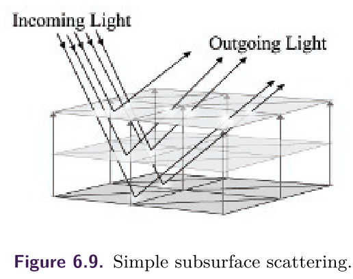

在延迟渲染中，这种技术可以同时应用于**几何体和材料阶段**。

- 在几何阶段，散射可以通过模糊**写入G缓冲区的表面法线**或将网格法线重新计算为**相邻顶点法线的加权和**来进行近似计算。
- 模糊处理可以在**材质阶段**进行，在纹理空间中，以**与毛皮渲染相同的方式**对累积光照进行采样。然后，网格的纹理坐标将被用作顶点位置，在**应用模糊之前**将这些值写入网格的纹理空间。一旦模糊了，这些值就会通过**反转过程**被写回**光积累缓冲区**。另外，**材质阶段的模糊**可以在**屏幕空间**中进行，通过将**模糊内核**定向到**本地表面**，使用存储在每个像素的G缓冲区的法线。

这个解决方案的一个问题是，表面下的散射也会使光线进入物体的背面。在诸如皮肤和毛皮等材料中，它们在更坚实的结构上**形成散射层**，这种光线的转移最常出现在**物体的轮廓边缘**。我们可以通过**弯曲网格轮廓边缘的法线**来调整这个问题，使其**远离观众**，并从**物体后面**取样照明（见图`6.10`和清单`3`）。这样做，这些像素将不再正确地接受直接光照；然后在**模糊阶段**必须考虑到这一点。

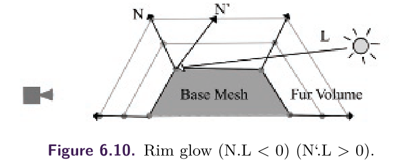

[list 3]() 

```c++
// Pushing edge pixels around edges

// Get normal based for back face samples. 
// Glow strength and falloff are supplied by material values.
half NdotV = saturate(dot(normal.xyz, -view)); 
half rimWeight = glowStrenth * pow(1.f - NdotV, glowFalloff); 
normal.xyz += view.xyz * rimWeight; 
normal.xyz = normalize(normal.xyz);
```

### Anisotropy

**各向异性的光反射**发生在**法线的分布取决于表面方向的表面**下；这种表面的特点往往是**细小的脊线**以统一的方向穿过表面，形成一个 "颗粒`grain`"。

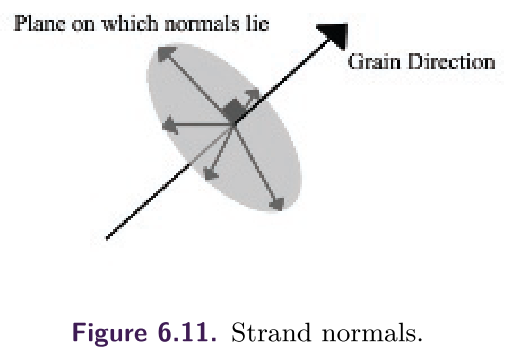

这种独特的照明是由于在各向异性的表面中，`fins`或`strands`，被认为是与`grain`平行的**无限细线**。这些线**没有确定的表面法线**，而是有无限多可能的法线，垂直于其方向辐射出去（见上图）。因此，表面上任何一点的光照计算都必须积分**线周围所有法线的光照**。这在**像素着色器**中是不现实的；最好的解决办法是选择**一个最能代表该点光照的单一法线**。在前向着色中，**各向异性**通常是通过**不同的光照计算**来实现的。这种算法是根据表面的`grain`方向，而不是法线来计算光照。

```c++
//Anisotropic light calculation
Diffuse = sqrt(1 - (<L, T >)ˆ2) 
Specular = sqrt(1 - (<L, T>)ˆ2) sqrt(1 - (<V, T>)ˆ2) - <L, T> <V, T>
```

在延迟着色中，我们无法在**几何阶段**知道任何可能**有助于表面照明的光源性质**，并且受G-buffer接口的约束，无法提供表面法线。因此，我们将**最重要的法线**定义为与`grain direction`和该点的**眼睛矢量**共面的法线（见图6.12）。我们将这个平面的法线计算为`plane’s normal`和`grain direction`的**交乘**（见清单`5`）。

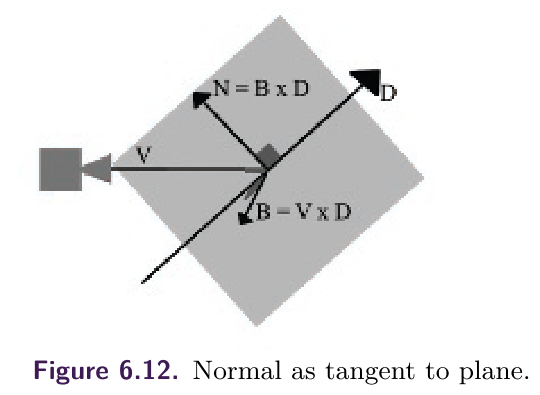

[list 5]()

```c++
// Generate normal from fur direction. 
IN.direction = IN.direction - (dot(IN.direction, normal) * normal); 
IN.direction.xyz = normalize(IN.direction.xyz); 
half3 binorm = cross(IN.eyeVector, IN.direction); 
half3 grainNorm = cross(binorm, IN.direction); 
normalize(grainNorm);
```

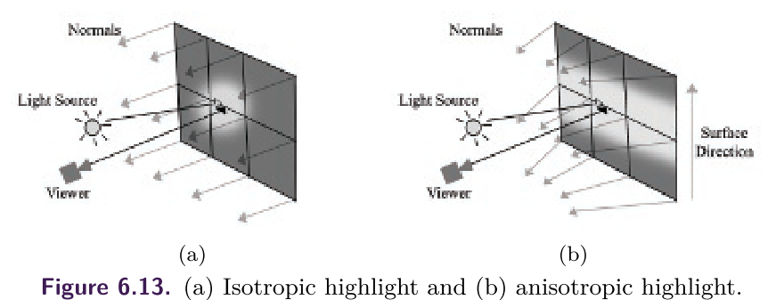

### Stippled Rendering

`Stippled rendering`是一种技术，在这种技术中，只有**图像的某些像素**被写入帧缓冲区，而其他像素则保留其**原始值**。这种技术的灵感来自于在**硬件alpha混合技术**普及之前，游戏中使用的**stippled alpha透明图像**，也被称为`screen-door transparency`。**透明物体的值**只被写入**物体所覆盖的部分像素**，这样就不会完全遮挡住它后面的场景（见清单6.6）。

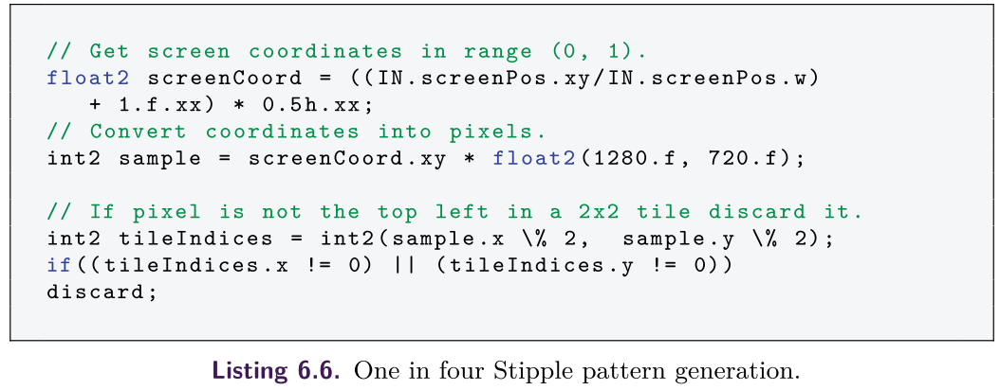


//todo


## 4. 毛皮实现细节

### 资源准备

***Combing direction***

**毛皮解决方案**适用于任何具有顶点位置、法线、切线、双法线和二维纹理坐标的封闭网格。对于大多数资产创建包来说，这是一种相当标准的顶点格式。此外，我们要求每个顶点有一个**RGBA颜色**来定义`combing direction`和给定顶点的**毛皮长度**（见下图）。这个向量在**生成各向异性表面法线**时也被用来**描述表面方向**。**颜色的alpha通道**被用来在每个顶点**局部缩放**全局毛皮长度。

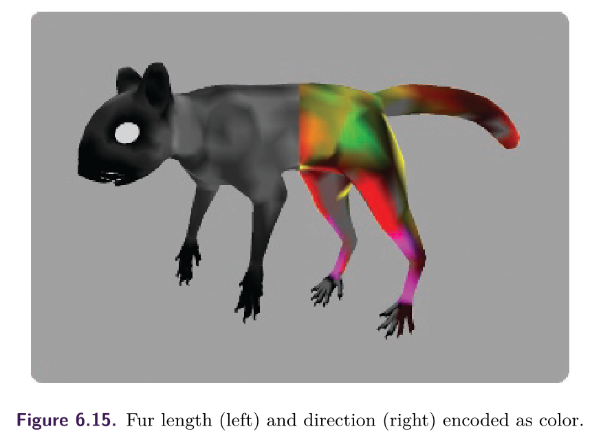

[list 7]()

```c++
// Processing of fur directions

// Build local to tangent space matrix. 
Matrix tangentSpace; 
tangentSpace.LoadIdentity (); 
tangentSpace.SetCol(0, tangent); 
tangentSpace.SetCol(1, binormal); 
tangentSpace.SetCol(2, normal); 
tangentSpace.Transpose ();

// Convert color into vector.
Vector3 dir(pColour[0], pColour[1], pColour[2]); 
dir = (dir * 2.f) - Vector3(1.f);

// Gram Schmidt orthonormalization. 
dir = dir - (dot(dir, normal) * normal); 
dir.Normalise();

// Transform vector into tangent space. 
tangentSpace.TransformInPlace(dir);

// Convert vector into color. 
dir = (dir + Vector3(1.f)) * 0.5; 
pColour[0] = dir.getX(); 
pColour[1] = dir.getY();
pColour[2] = dir.getZ();
```

***Texture data***

为了给**G缓冲区**提供必要的表面信息，材料被分配了一个**RGB反照率图**和一个`lighting map`，其中包含**每个像素的法线信息**和特定像素的**镜面强度和指数**。除此以外，还提供了**第二张反照率图**，以描述照明在**进入毛皮深处时的变化**；在毛线的长度上，**所使用的反照率颜色**是由这张`map`与**表面颜色**混合而成的。

为了表示同心壳渲染所需的毛皮体积，我们选择了**一个高度场**作为生成体积数据集的替代方案。虽然这个解决方案限制了可以描述的体积类型，但为了渲染外壳，它需要存储和访问的纹理信息要少得多。


### Geometry Phase

为了这个技术的目的，**几何阶段被分成了两个过程**。

- 第一个`pass`将**基础网格**渲染到`G-buffer`上。在顶点着色器中，位置、切线和法线被转换为视图空间，而`combing`方向被带入$[-1, 1]$​​范围内的局部空间。像素着色器生成一个新的法线，它与**眼睛和梳理向量**共面，以实现**各向异性的高光**。

  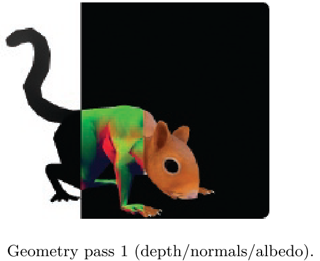

- 第二个`pass`将**毛皮的顶层**渲染成`stipple pattern`，在屏幕上**每四个像素中渲染一个**。顶点着色器与第一个`pass`相同，但是将顶点位置沿着**顶点法线**向外推，其偏移量为**全局毛皮的长度**，并以**顶点颜色的alpha**进行缩放。像素着色器使用**视图矢量和表面法线的点积**来识别可能的剪影边缘；**这些点的法线**通过添加**由该权重值缩放的视图矢量**来调整。

  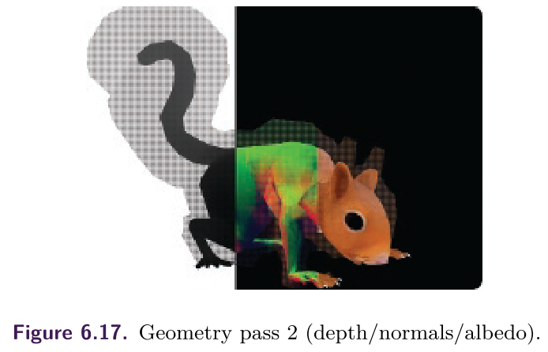


### Light Phase

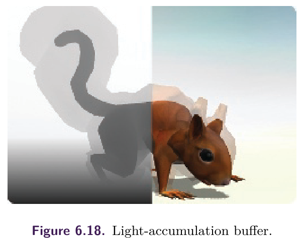


### Material Phase

**渲染的材质阶段**包括从**光照积累缓冲区**中读取数值，并根据**材质的特定品质**来解释这些数值，在这种情况下是通过构建**毛皮的外壳**。在延迟着色中，由于大部分光照值在**光照积累缓冲区**中已经是正确的了，所以需要这些值的副本，毛皮的材质阶段可以在上面进行合成（见图6.18）。分布在毛皮最外层的纹路值会遮挡住下面的毛皮层。为了纠正这一点，所有的毛皮表面都必须使用**最外层的外壳**重新进行处理，同时从**光积累缓冲区**中提取颜色值，从存储在**G缓冲区的线性深度**中提取深度值。对于大多数像素来说，**这些颜色和深度值直接写入组合缓冲区**，然而，在需要采样的地方，会使用**邻近的像素**来代替，有效地从光照积累缓冲区和深度缓冲区中抹去所有的`grain`值。缓冲区现在只包含物体的基本网格，为**合成毛皮的体积层**提供一个基础。毛皮的渲染是通过一系列的`pass`来进行的，每个`pass`通过偏移顶点的位置来渲染一个同心的外壳。该通道还在屏幕空间中构建位置，从这些位置可以获得**对应于基础网格的样本**和对应于最外层外壳的`grain`样本。

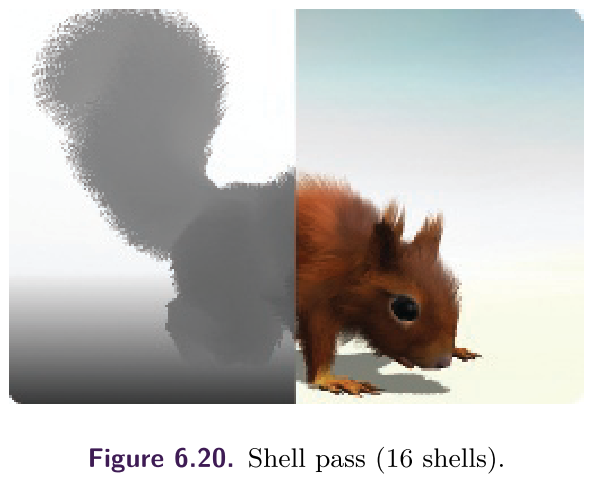

在像素着色器中，这两个样本被从**光积累缓冲区**中检索出来，它们在**G缓冲区中各自的线性深度**也被采样，以便与样本坐标的深度进行比较，从而**纠正遮挡误差**。如果两个样本都有效，则选择**两者的最大值**，以允许物体**边缘散射的光晕效应**。**反照率图**对累积光值的贡献被除掉，然后作为**基础和顶部反照率图的线性插值**重新应用，以考虑到**毛皮的环境遮挡**。毛皮体积的高度场是通过对**材料中的网格UV**进行任意比例的高频率采样的。当插值因子等于并超过存储在高度场中的值时，**smoothstep函数**被用来淡化**当前外壳中的像素**，因此毛皮`strands`以**不同的速度**淡化，创造出**亚像素细节的印象**。


