[toc]


# Large-Scale Terrain Rendering for Outdoor Games

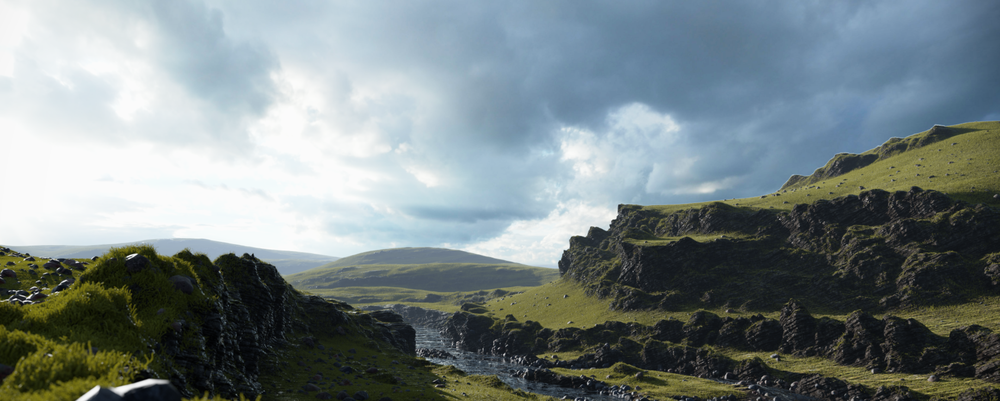

## 1. 介绍

### Geometry Choice

我们选择了**基于网格的地形**，它允许陡峭、不失真的斜坡和不同的分辨率水平，并由艺术家完全控制。我们还选择了存储**压缩的顶点和三角形数据**，而不是执行**即时网格构建和缓存**。


### Texturing Choice

我们的解决方案是基于`tiling atlas texture`的每像素溅射`per-pixel splatting`，因此它在整个地形的表面上**重复使用纹理**，但它不仅仅使用**基于高度和坡度的规则**，与**额外的噪声**来确定特定像素的地形类型，而是也依赖于**预计算的数据**。

这种方法与**流式超高分辨率地图**相比有两个主要优势。首先，所需的存储空间非常低（$<15 MB$​​）。其次，它不会使**流媒体**或**总线传输带宽**饱和。由于渲染和纹理的运行时间评估，相距遥远的摄像机之间的即时切换也得到了解决。另一个优点是**艺术家对纹理的完全控制**，这在仅依靠**程序或基于分形的方法**时可能更困难。

事实证明，通过使用**程序性技术**来扩展**资产创建和渲染**是非常有价值的。这些技术有助于通过**微妙的参数变化**为各种室外艺术资产（树叶、细节对象和地形纹理）创建`basis`，从而节省时间。他们也减少了**内存和带宽的使用**。


## 2. 内容创建和编辑

### 工作流

我们的地形资产来自于**多种DCC工具**。艺术家们创造了**基本的地形布局**和简单的网格对象，设计师可以用它们来测试关卡功能。第一阶段完成后，**基础地形模型**通过**侵蚀工具**获得更多的形态和土壤类型的细节。艺术家可以反复修饰详细的模型，还可以将**环境遮蔽（AO）值**烘烤到网格顶点上。在推进几何学的同时，**代表不同土壤类型的纹理**被编写，并被**地形着色器**使用。在我们的游戏编辑器中，在网格从**COLLADA格式**导入后，会发生以下步骤。在这个导入步骤中，**基本地形被分割成更小的块**，并生成细节级别（`LOD`）。我们还使用**较小的、可涂抹的、可重复使用的物体**来制作岩层，以后称为**网格物体**。内容创建的下一步是对基础地形和游戏编辑器中的网状物体进行**额外的手工绘画**。在这个阶段，土壤类型信息和**颜色的最精细细节**是确定的。最后，**网格和纹理资产**要经过每个平台的**不同压缩路径**。整个过程如下图所示。

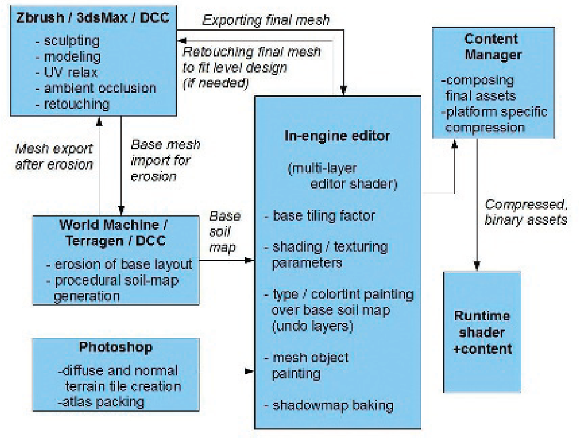


### 确定土壤类型

可以使用多种方法来决定**哪种土壤类型**适用于**地形的特定区域**。由于这一信息在游戏过程中不会改变，因此可以**预计算并离线存储**。


### 存储在查询表中的程序规则

一个查找表（`LUT`）可用于确定在**不同的地形坡度和高度值**下应出现**哪种地形类型**。`LUT`可以存储为**二维纹理**，其参数为沿`u`和`v`轴的**地形坡度和高度**。在运行时，寻址该表需要使用**坡度-高度对**。它的优点是迭代时间快，实现简单，但也有缺点。因为`LUT`是全局应用于地形的，它**不允许艺术家对地形的纹理有局部控制**。此外，由于`LUT`与**地形在游戏世界中的位置**完全脱钩，我们无法在其中存储**局部渲染或色调信息**，如局部土壤类型。我们发现这些缺点的**限制性太大**，于是选择了以下的方法。


### 存储在UV空间平铺图中的程序和手动绘画

另外，我们可以使用覆盖整个地形的`tile-index texture`，并且可以使用**独特的、宽松的UV**进行采样。在我们的案例中，我们使用了**4通道贴图**，在三个通道中编码`color-tint`值（以打破重复模式），在第四通道中编码**地形类型索引**（见下图）。这种方法比第一种方法有多个优点：它可以由艺术需求来**局部控制**，而且它还可以使用**程序性方法**作为基础。唯一的缺点是，它对**地形类数据**使用了**固定的分辨率**，但这未被证明是一个问题。

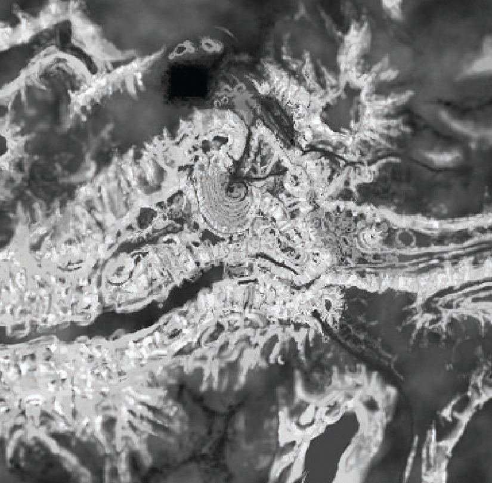

创建`tilemap`是非常直观的。它的**地形索引部分**可以基于从许多**商业地形生成/侵蚀软件程序**中导出的**土壤类型图**（尽管你可能需要将**世界空间类型值**转换为**宽松的UV空间**），或基于全局地形高度和坡度的规则，并通过**噪声**来增强。

**颜色部分的基础**可以再次来自**DCC工具**，来自阴影贴图，也可以是**简单的去饱和的彩色噪声**。在这个基础上，艺术家可以使用**简单的画笔和临时图层**轻松地绘制或修改所选择的地形类型值。**光线投射**被用来确定画笔所接触的`tilemap texels`。

在运行时，`tilemap indices`的**硬件双线性过滤**会自动解决LUT方法中存在的类型混合问题。我们还可以用**DXT5纹理压缩法**来压缩`tilemap`。


### 存储在网格顶点的程序和手动绘画

我们也可以将**含有孔洞、悬垂、扭曲或其他难以放松的区域的几何体**从一般的地形网格中分离出来，或者创建几何体并将其作为**一个可绘制的地形网格对象**。除了更好地融入**基本地形**之外，我们还可以通过使用**共享图集**和稍加**修改的地形着色器**来节省大量的纹理内存。艺术家们可以使用任意的方法和DCC工具**对网格进行UV贴图**，产生一个不重叠的UV，将**接缝和连接**移到不太明显的地方。

**DCC工具**不能直接看到游戏中的相对资产范围和空间比例。为了帮助艺术家进行**UV贴图和适当的平铺**，我们在编辑器导入时，将**基础UV**乘以一个**常量值**。这个值是由**物体的总几何表面**除以其**总UV空间表面**决定的。这样一来，无论在$0 ......1$区域内使用了多少**UV空间**，所有物体和地形的平铺都会完美匹配。另一个帮助艺术家的功能是，如果在DCC工具中再次修改几何形状，允许**已经渲染的网格对象**重新使用它们各自的`painings`。这个功能将**每个对象的绘画**也存储为**一个纹理**，与网格数据一起从编辑器中自动保存。它只在编辑器中使用，每个顶点一个质点，包含UV和土壤类型的信息。

//todo


## 3. 实时渲染

==实时渲染解决方案的基础==是每个像素级别的`texture splatting`。使用一些像素的输入数据和**一个独特的、宽松的UV通道**，着色器可以对不同的`tiling-terrain textures`进行采样，并在它们之间进行混合。

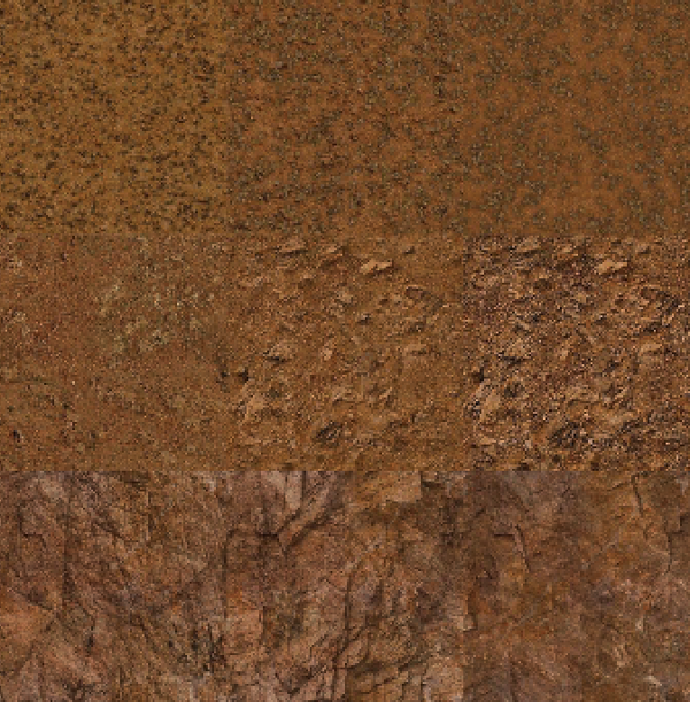

为了减少着色器需要采样的纹理数量，这些`tiling textures`——对应于不同的土壤类型——可以打包到**纹理图集**（见上图） 。不过，在为图集生成`mip levels`时要注意，因为单个`tile-mipmap texels`不能与它们的邻居混合。

对于选择图集的方法，我们希望`tiling`在一个较小的UV区域内`wrap`（因此这有时被称为`subtiling`），例如$0 ..... 0.25$​​​​​，如果我们有一个**4×4的图集**。这也意味着我们不能依赖硬件`texture wrapping`；这必须在着色器中手动执行。正如我们将看到的，这将导致**硬件mip level选择**的问题（不过，纹理数组不需要这些修正）。为了使其正常工作，我们必须知道硬件如何计算**要使用的mip级别**：`GPU`使用在任何给定的2×2像素块中的**屏幕空间纹理坐标的一阶导数**和**纹理本身的尺寸**，来确定**像素与texel的投影比例**，从而找到**合适的mip级别**来使用。为了从图集中访问像素的`tiles`，我们需要模拟该`tiles`的`hardware wrapping`。通过使用`frac()`，我们打破了用于`tile borders`的像素四边形的、屏幕空间的**UV导数连续性**。由于导数会非常大，硬件会从链中选取**最大的miplevel**，这反过来又会导致在`subtiling wraps`时出现一个**一像素宽的接缝**。幸运的是，我们在这里有很多选择：我们可以在纹理过滤、算术逻辑单元（`ALU`）成本、着色器线程数等之间**平衡GPU的负载**。

:one:最安全但最慢的选择是：在从图集采样之前。在`shader`中手动计算mip级别。这可以产生正确的结果，但是**额外的ALU成本**很高，因为我们需要发出需要额外GPU周期的梯度指令，而且纹理需要用**手动指定的mip级别**进行采样，这降低了**许多架构上的采样率**。作为一个副作用，**纹理停滞**`texture stalls`开始出现在管道上。我们可以使用多种方法来缩短这些停顿。一些编译器和平台允许**明确设置**编译后的着色器可以使用的**通用GPU寄存器（GPR）的最大数量**。如果一个着色器使用**较少的GPR**，更多的着色器核心可以**并行运行它**，因此同时进行的线程数量增加。**使用更多的线程**意味着让所有线程**停滞的可能性较小**。在使用统一着色器架构的系统上，人们也可以通过**减少顶点着色器的可用GPR**来增加**像素着色器的GPR数量**。一些平台也有着色器指令，明确地返回硬件在给定像素上使用的mip级别，从而使你不必在着色器中自己计算它。在**远离frac()区域的像素四边形**上使用动态分支和**常规硬件mipmapping**作为加速也可能被证明是有用的。

:two:**计算正确的mip级别**的一个选择是**构建一个纹理**，在纹理本身中**编码mip索引**（例如，第一个mip级在其所有纹理中编码为 "0"，第二个mip级在其所有纹理中编码为 "1"，等等）。这个纹理应该和`atlas tile`有**相同的尺寸**。然后，你可以使用**普通的纹理获取**来对这个纹理进行采样，并允许**硬件选择适当的mip级别**。获取的texel的值将表明硬件选择了哪个mip级别，然后可以用来在`atlas tile`上发出`tex2dlod`指令。动态分支在这里也是一个可行的选择。

:three:我们选择了第三种方案，它是最快的，但确实会导致可以接受的微小伪像。我们简单地使用**常规的tex2D采样**，但我们**只生成mip链的前四个mipmaps**。这意味着GPU要过滤更多的东西，但我们的测量结果表明，只有**7-10%的texels**落入**较大的mip级别**，因此，与使用**降低速度的tex2Dlods**相比，性能影响被认为是最小的。**视觉伪影最小化**，因为**接缝将始终使用第四个mip级**，而且第一级和最后一级之间的颜色差异要小得多。我们还改用了**1×16维的纹理图集**，而不是$4×4$​，因此我们可以**对一个方向使用`hardware texture wrapping`**，将使用`frac()`产生的mip级错误减半，同时还使用**较少的ALU操作**来处理图集。

我们已经有了**漫反射和法线图集**，准备在着色器中采样。为了提高质量，我们在两个附近的`tiles`之间进行混合——使用`interpolated tile index`的小数部分——从同一个图集中读取两次，并使用**各自的UV偏移**。地形和绘画网格的渲染是相同的，并且是基于简单的`lambertian diffuse`和半球形`ambient terms`。阴影贡献是一个**预先计算和模糊的静态阴影图**的查找，与一个**级联的动态和模糊的指数阴影图**（ESM）的**交叉渐变**，以及**烘烤到顶点的AO**组成。可以尝试**更复杂的光照模型**，然而，正确设置的大气设置、雾、高动态范围（HDR）、土壤类型贴图已经提供一个不错的效果。


[list 1]()

```c++
// Runtime terrain shader with tilemap-based per-pixel 
// splatting using atlases (tangent-space lighting ).

static const float TILEMAP_SIZE = 512.0f; 
static const float TILES_IN_ROW = 4.0f; 
static const float MAX_TILE_VALUE = TILES_IN_ROW * TILES_IN_ROW - 1;

struct sVSInput 
{
    float4 Position : POSITION; 
    float3 Normal : NORMAL; 
    float2 UV : TEXCOORD0; 
    float3 Tangent : TEXCOORD1; 
};

struct sVSOutput 
{
	float4 ProjPos : POSITION;
	float2 UV : TEXCOORD0;
	float3 Normal : TEXCOORD1;
	float3 TgLightVec : TEXCOORD2; 
};

float4x3 cWorldMatrix; 
float4x4 cViewProjMatrix; 
float cUVmultiplier; //Terrain -texture tiling factor. 
float3 cCameraPos; 
float3 cSunDirection; 
float3 cSunColor;

// Lighting is in tangent space. 
float3x3 MakeWorldToTangent(float3 iTangent, float3 iNormal) 
{
    float3x3 TangentToLocal = float3x3(iTangent, cross(iNormal, iTangent), iNormal);
    float3x3 TangentToWorld = mul(TangentToLocal, (float3x3)cWorldMatrix);
    float3x3 WorldToTangent = transpose(TangentToWorld);
    return WorldToTangent;
}

sVSOutput vpmain(sVSInput In) {
    sVSOutput Out;
    
    float3 WorldPos= mul(In.Position, cWorldMatrix);
    Out.ProjPos = mul(float4(WorldPos, 1), cViewProjMatrix);
    
    Out.Normal = mul(In.Normal.xyz, (float3x3)cWorldMatrix); 
    
    Out.UV = In.UV * cUVmultiplier;
    
    float3x3 WorldToTangent = MakeWorldToTangent(In.Tangent, In.Normal);
    
    Out.TgLightVec = mul(cSunDirection.xyz, WorldToTangent); 
    
    return Out;
}

sampler2D DiffAtlas; 
sampler2D NormAtlas; 
sampler2D TileTable;

float GetMipLevel(float2 iUV, float2 iTextureSize) 
{
    float2 dx = ddx(iUV * iTextureSize.x); 
    float2 dy = ddy(iUV * iTextureSize.y); 
    float d = max(dot(dx, dx), dot(dy, dy)); 
    return 0.5 * log2(d);
}

float4 fpmain(sVSOutput In) : COLOR {
    float4 TileMapTex = tex2D(TileTable, In.UV / cUVmultiplier);
    float3 ColorTint = TileMapTex.xyz;
    float TileIndex = TileMapTex.w * MAX_TILE_VALUE;
    float MIP = GetMipLevel(In.UV, TILEMAP_SIZE.xx);
    
    float2 fracUV = frac(In.UV); 
    float2 DiffCorrectUV = fracUV / 4.0f;
    
    //Blend types and blend ratio. 
    float type_A = floor(TileIndex); 
    float type_B = ceil(TileIndex); 
    float factor = TileIndex - type_A;
    
    float tmp = floor(type_A / 4); 
    float2 UV_A = DiffCorrectUV + float2(type_A - tmp * 4, tmp) / 4; 
    tmp = floor(type_B / 4); 
    float2 UV_B = DiffCorrectUV + float2(type_B - tmp * 4, tmp) / 4;
    
    // 2 Lookups needed , for blending between layers. 
    float4 colA = tex2Dlod(DiffAtlas, float4(UV_A, 0, MIP)); 
    float4 colB = tex2Dlod(DiffAtlas, float4(UV_B, 0, MIP));
    float4 DiffuseColor = lerp(colA, colB, factor);
    
    float4 normA = tex2Dlod(NormAtlas, float4(UV_A, 0, MIP)); 
    float4 normB = tex2Dlod(NormAtlas, float4(UV_B, 0, MIP)); 
    float4 normtex = lerp(normA, normB, factor);
    
    // Extract normal map. 
    float3 norm = 2 * (normtex.rgb - 0.5);
    float3 tgnormal = normalize(norm);
    
    float NdotL = saturate(dot(tgnormal, normalize(In.TgLightVec)));
    
    float3 SunDiffuseColor = NdotL * cSunColor; 
    float3 Albedo = DiffuseColor.xyz * ColorTint * 2; 
    float3 AmbientColor = 0.5;
    
    float3 LitAlbedo = Albedo * (AmbientColor + SunDiffuseColor); 
    return float4(LitAlbedo, 1);
}
```

 


# Practical Morphological Antialiasing


用`MSAA`有重要的缺点。首先，所消耗的**处理时间的增加**是完全不可忽视的。此外，`MSAA`的局限性还包括，在广泛的平台上，当使用**多个渲染目标**（`MRT`）时，不可能激活多重采样，而延迟着色等基本技术就依赖于此。即使在可以同时激活`MRT`和`MSAA`的平台上（即`DirectX 10`），`MSAA`的实现不简单。`MSAA`的另一个缺点是它==不能平滑非几何边缘==，比如那些使用**阿尔法测试**所产生的边缘，在**渲染植被**时经常出现。因此，在使用`MSAA`时，只有在使用`alpha to coverage `的情况下，植被才能**抗锯齿化**。

在这篇文章中，我们提出了一种技术，结果的质量**介于4倍和8倍MSAA之间**，而时间和内存消耗只是一小部分。它是基于`morphological antialiasing`，它依赖于检测**图像模式**，来减少锯齿。然而，**最初的实现**是在CPU中运行的，需要使用`list`结构，而这无法在`GPU`上实现的。

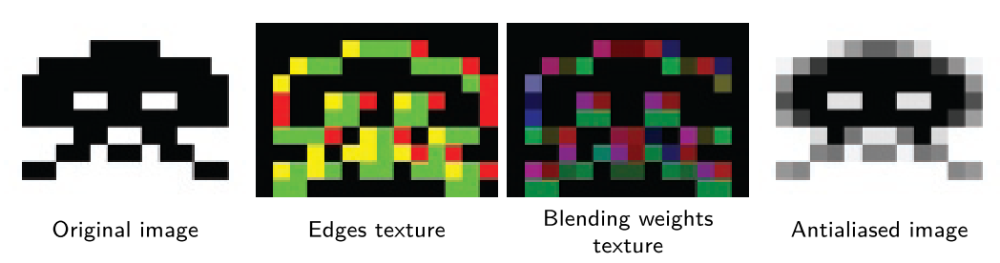

我们的算法实现了积极的优化，在质量和执行时间之间提供了**最佳权衡**。Reshetov搜索**特定的模式**（`U`形、`Z`形和`L`形模式），然后将其分解成**更简单的模式**，这种方法在`GPU`上是不现实的。我们意识到，`pattern type`，也就是**要执行的抗锯齿**，只取决于**四个边缘像素**——只需**两次内存访问**就可以得到。这样一来，原来的算法就被改变了，它使用**纹理结构**而不是列表（上图）。此外，这种方法允许以**对称的方式**处理所有的图案类型，从而避免了将它们分解成**更简单的图案**的必要性。此外，**将某些数值转化为纹理**可以使实现速度更快。最后，为了加速计算，我们广泛使用**硬件双线性插值**，在一次查询中智能地获取多个值，并提供将**获取的值**解码为**未过滤的原始值**的方法。因此，我们的算法可以**由GPU高效执行**，具有**适度的内存占用**，并且可以作为任何游戏架构的**标准渲染管道的一部分**。


## 1. 前瞻

该算法搜索**边缘的模式**，重建**抗锯齿的线条**。一般来说，这可以被看作是对边缘的一种揭示。下面我们简要介绍一下算法：

- 首先，**使用深度值进行边缘检测**（另外，亮度也可以用来检测边缘；这将在第`2.1`节进一步讨论）。

- 然后，对于**属于一个边缘的每个像素**，我们计算从它到该边缘所属的**两端像素的距离**。这些距离定义了该像素**相对于线的位置**。根据边缘在线条中的位置，它将会或不会受到抗锯齿处理的影响。在那些需要修改的边缘（下图左中**包含黄色或绿色区域的边缘**），根据公式`1`进行**混合操作**：

  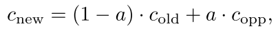

  其中$c_{old}$是此像素的原始颜色，$c_{opp}$是线另一边的像素颜色。`a`是**线的图案类型和线的两端距离的函数**。图案类型由**线条的`crossing edges`**定义，即**与线条垂直的边缘**，因此定义了线条的两端（下图的**垂直绿线**）。为了节省处理时间，我们预先计算这个区域，并将其存储为**双通道纹理**，可以在下图右看到（详见`3.3`节）。

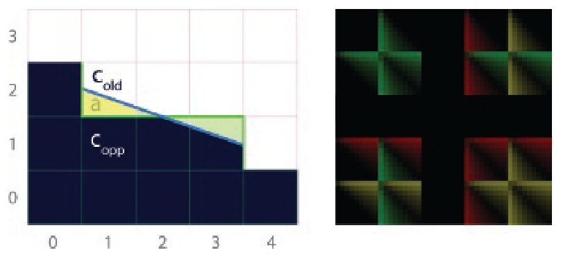

该算法分三个阶段实施，在以下章节中详细解释：

- 在第一个`pass`中，进行**边缘检测**，产生一个**包含边缘的纹理**（见图`1`（左中））。
- 在第二个`pass`中，得到与平滑的边缘相邻的**每个像素的相应混合权重**（即值`a`）（见图`1`（右中））。要做到这一点，我们首先要检测**通过像素的北面和西面边界的每条线的图案类型**，然后计算**每个像素到`crossing edges`的距离**；然后用这些来查询**预先计算的区域纹理**。
- 第三个也是最后一个`pass`是利用前一个过程中**获得的混合权重纹理**，将每个像素与其四邻进行混合。

最后两个`pass`是单独进行的，利用**两个相邻的像素**共享同一边缘的事实，以**节省计算量**。为了做到这一点，在第二个`pass`中，**图案检测和随后的面积计算**是在每个边缘的基础上进行的。最后，在第三个`pass`中，两个相邻的像素将获取**相同的信息**。

此外，使用`stencil buffer`可以让我们只对**包含边缘的像素**进行第二和第三个`pass`，大大**减少了处理时间**。


## 2. 边缘检测

我们使用**深度缓冲区**（如果没有深度信息，则使用亮度值）进行**边缘检测**。对于每个像素，我们得到**相对于上面和左边的像素的深度差**。鉴于**两个相邻的像素**有一个**共同的边界**，我们可以通过这种方式有效地存储**图像中所有像素的边缘**。这个差值被**阈值化**以获得一个**二进制值**，它表示一个像素的边界**是否存在一个边缘**。这个阈值随着分辨率的变化而变化，可以使其与分辨率无关。然后，**左边和上面的边缘**被分别储存在**边缘纹理的红色和绿色通道**中，这将被用作下一个`pass`的输入。

每当使用**基于深度的边缘检测**时，在两个不同角度的平面相遇的地方可能会出现一个问题：**由于样本具有相同的深度，边缘将不会被检测到**。一个常见的解决方案是**增加法线的信息**。然而，在我们的案例中，我们发现使用法线时获得的质量改进，并不值得增加执行时间。


### 使用亮度值进行边缘检测

一个替代方法是使用**亮度信息**来检测**图像的不连续性**。亮度值是由==CIE XYZ（色彩空间）==标准得出的：

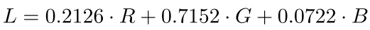

然后，对于每个像素，得到相对于上面和左边的像素的**亮度差异**，其实施**等同于基于深度的检测**。在进行阈值处理以获得二进制值时，我们发现`0.1`是大多数情况下的**适当阈值**。值得注意的是，使用基于亮度或深度的边缘检测并**不影响下面的程序**。

虽然从质量上来说，两种方法都提供了类似的结果，但**基于深度的检测更稳健**，产生的边缘纹理更可靠。而且，我们的技术在使用深度比使用亮度值，**平均少花10%的时间**。亮度值在无法获取深度信息时很有用，因此提供了一种更普遍的方法。此外，**当进行基于深度的检测时，阴影中的边缘将不会被检测到**，而**基于亮度的检测允许对阴影和镜面高光进行抗锯齿**。通过结合亮度、深度和法线，可以获得**质量方面的最佳结果**，但代价是执行时间较长。

清单`1`显示了这个`pass`的源代码，使用**基于深度的边缘检测**。

[list 1]()

```c++
//Edge detection shader

float4 EdgeDetectionPS(float4 position: SV_POSITION, 
                       float2 texcoord: TEXCOORD0) : SV_TARGET 
{ 
    
    float D = depthTex.SampleLevel(PointSampler, texcoord, 0);
    float Dleft = depthTex.SampleLevel(PointSampler, texcoord, 0, -int2(1, 0));
    float Dtop = depthTex.SampleLevel(PointSampler, texcoord, 0, -int2(0, 1));
    
    // We need these for updating the stencil buffer. 
    float Dright = depthTex.SampleLevel(PointSampler, texcoord, 0, int2(1, 0));
    float Dbottom = depthTex.SampleLevel(PointSampler, texcoord, 0, int2(0, 1));
    
    float4 delta = abs(D.xxxx - float4(Dleft, Dtop, Dright, Dbottom));
    float4 edges = step(threshold.xxxx, delta);
    
    if (dot(edges, 1.0) == 0.0) 
    { 
        discard;
    }
    
    return edges;
}
```


## 3. 获得混合权重

为了计算**混合权重**，我们首先利用前一阶段获得的**边缘纹理**，搜索边缘所属的**线条两端的距离**（见第`3.1`节）。一旦知道了这些距离，我们就可以用它们来获取**线条两端的交叉边缘**（见第`3.2`节）。这些交叉边表明我们**正在处理的模式类型**。**到线的两端的距离**和**图案的类型**被用来访问**预先计算的纹理**（见第`3.3`节），在这个纹理中，我们存储的区域被用作最终`pass`的**混合权重**。

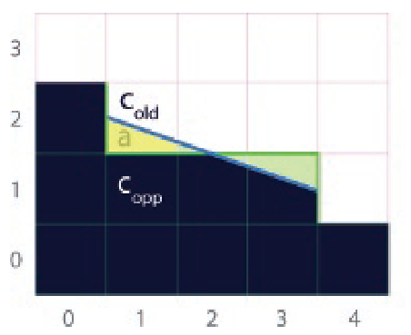

如前所述，**为了在相邻的像素之间共享计算结果**，我们利用**两个相邻的像素共享相同的边界**这一事实，进行面积计算 `on a per-edgel basis`。然而，即使两个相邻的像素共享计算结果，它们各自的`a`值也是不同的：只有一个有混合权重`a`，而对于相反的一个，`a`等于`0`（上图的$(1,2)$和$(1,1)$）。唯一的例外是像素位线的中间（上图中的像素$(2,1)$）；在这种情况下，实际的像素和它的对面**都有一个非零值的`a`**。因此，这个`pass`的输出是一个纹理，对于每个像素，它的**对应边缘的每一边的面积**都被储存起来（我们所说的每一边的面积是指实际像素和它的对面）。这在最终的**混合权重纹理**中产生了**两个北边的值和两个西边的值**。

[list 2]()

```c++
//Blending weights calculation shader

float4 BlendingWeightCalculationPS(float4 position: SV_POSITION,
								   float2 texcoord: TEXCOORD0): SV_TARGET 
{
    
    float4 weights = 0.0;
    float2 e = edgesTex.SampleLevel(PointSampler, texcoord, 0).rg;
    
    [branch] 
    if(e.g)
    { 
        // Edge at north. 
        float2 d = float2(SearchXLeft(texcoord), 
                          SearchXRight(texcoord));
        
        // Instead of sampling between edges , we sample at -0.25, 
        // to be able to discern what value each edgel has. 
        // mad(m, a, d) : x = m * a + d
        float4 coords = mad(float4(d.x, -0.25, d.y + 1.0, -0.25), 
                            PIXEL_SIZE.xyxy, texcoord.xyxy);
        
        float e1 = edgesTex.SampleLevel(LinearSampler, coords.xy, 0).r;
        float e2 = edgesTex.SampleLevel(LinearSampler, coords.zw, 0).r;
        
        weights.rg = Area(abs(d), e1, e2);
    }
    
    [branch] 
    if (e.r) 
    { 
        // Edge at west. 
        float2 d = float2(SearchYUp(texcoord), SearchYDown(texcoord));
   
        float4 coords = mad(float4(-0.25, d.x, -0.25, d.y + 1.0), 
                            PIXEL_SIZE.xyxy, texcoord.xyxy);
        
        float e1 = edgesTex.SampleLevel(LinearSampler, coords.xy, 0).g;
        float e2 = edgesTex.SampleLevel(LinearSampler, coords.zw, 0).g;
        weights.ba = Area(abs(d), e1, e2);
    }
    
    return weights;
}
```


### 寻找距离

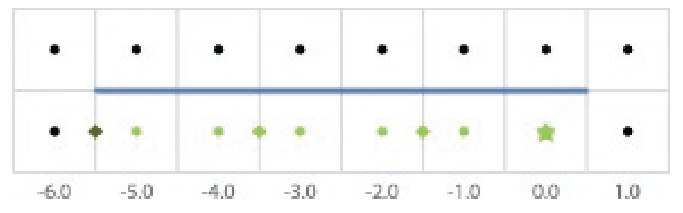

> 在搜索每个像素到线的末端的距离时，使用**硬件双线性过滤**。**每个像素中心的点的颜色**代表该像素在边缘纹理中的值。在这里显示的情况下，对线的左端进行距离搜索是**针对标有星星的像素**。访问边缘纹理的位置，获取成对的像素，用**菱形标记**。这使得我们可以用**相同的访问次数**，来完成**两倍的距离**

**搜索到线两端的距离**是通过**一个迭代算法**进行的，在每个迭代中检查是否已经到达了线的末端。为了加速这一搜索，我们利用了边缘纹理中**存储的信息是二进制**的这一事实——它简单地编码了**边缘是否存在**——并使用**双线性滤波**从像素间的位置进行查询，一次获取两个像素（见上图）。查询的结果可以是：a)、` 0.0`，这意味着两个像素**都不包含边缘**；b) 、`1.0`，这意味着两个像素中**都存在边缘**；或者c) 、`0.5`，当两个像素中**只有一个包含边缘**时，就会返回。如果返回值低于`1`，我们就**停止搜索**。

虽然在某些情况下会出现误差，但在实践中是无法察觉的——由于每次迭代都**有可能跳过两个像素**，所以速度的提高是相当大的。清单`3`显示了其中的一个**距离搜索函数**。为了使该算法在游戏环境中实用，我们将搜索限制在一定的距离内。正如所料，**最大长度越大，抗锯齿的质量就越好**。然而，我们发现，在大多数情况下，距离值在`8`到`12`个像素之间，可以很好地**权衡质量和性能**。

[list 3]()

```c++
//Distance search function (search in the left direction case)

float SearchXLeft(float2 texcoord) 
{ 
    texcoord -= float2 (1.5, 0.0) * PIXEL_SIZE; 
    float e = 0.0; 
    
    // We offset by 0.5 to sample between edges , thus fetching 
    // two in a row. 
    int i;
    for (i = 0; i < maxSearchSteps; i++) 
    { 
        e = edgesTex.SampleLevel(LinearSampler, texcoord, 0).g; 
        // We compare with 0.9 to prevent bilinear access precision 
        // problems. [flatten] 
        if (e < 0.9) break; 
        texcoord -= float2 (2.0, 0.0) * PIXEL_SIZE;
    } 
    
    // When we exit the loop without finding the end , we return 
    // -2 * maxSearchSteps. 
    return min(-2.0 * i - 2.0 * e, -2.0 * maxSearchSteps);
}
```

> 
>
> 这里进行代码理解，举个例子，目前我们传入的像素坐标是上图的`1.0`处（最右边，下面那个），然后我们首先要向左偏移`1.5`个像素距离，这样我们采样的位置就位于`0.0`和`-1.0`中间处，所以会进行双线性插值（但实际上这个特殊位置只会受到左右两边像素的影响），这里采样值是`1.0`，我们就知道这两个像素都是边，所以我们在循环中，应该每次跳两个像素。而一旦采样值低于`1` ，则说明这次验证的两个像素中，左边那个不是边，这个时候就停止迭代，返回这个边的左端点距离此像素的距离。

### 获得Crossing Edges

一旦计算出到**线的两端的距离**，它们就被用来获得`Crossing Edges`。获取一条线末端的交叉边的原始方法是**查询两条边**。一个更有效的方法是**使用双线性过滤**，以类似于距离搜索的方式，**一次性获取两条边**。然而，在这种情况下，我们必须能够区分**每个边的实际值**，所以我们用`0.25`的偏移量进行查询，使我们能够在只有一条边的情况下区分哪条边等于`1.0`。图下显示了双线查询返回的每个**不同数值所对应的交叉边**。

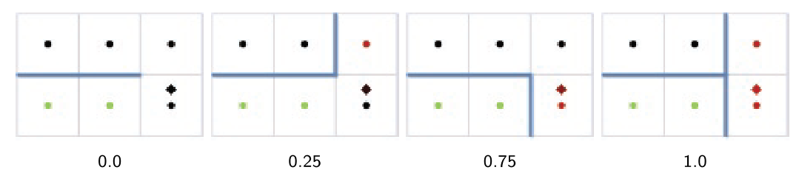

> 以上面的图举例，我们往上偏移`0.25`，这样提供双线性插值，我们可以区分`0.25`和`0.75`这几种情况。

### 预计算区域纹理

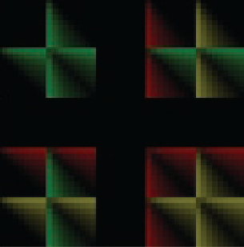


有了**距离和交叉边缘信息**，我们现在就有了计算**当前像素所对应的面积**所需的输入。由于这是一个昂贵的操作，我们选择在**一个四维表**中进行预计算，并将其存储在**一个传统的二维纹理**中（见上图）。这个纹理被分为大小为$9×9$的子纹理，**每个子纹理对应于一个图案类型**（由线的两端取来的交叉边`e1`和`e2`编码）。在每个子纹理内，$(u，v)$坐标对应于**到线的两端的距离**，`8`是可达到的最大距离。如果需要一个**更高的最大距离**，可以**提高分辨率**。关于如何访问预计算的区域纹理的细节，见清单`4`。

为了查询纹理，我们首先将双线过滤的值`e1`和`e2`转换成$0...4$范围内的整数值。值`2`（对应于`e1`或`e2`的值`0.5`）在实践中不可能出现，这就是为什么纹理中**相应的行和列是空的**。在纹理中保持这些空位可以使索引更加简单和快速。**Round指令**是用来避免双线性过滤可能造成的**精度问题**。

按照同样的推理，通过将**两个相邻像素的面积值**存储在**最终混合权重纹理的同一像素**中，**预计算的面积纹理**需要以每个像素为基础来建立。因此，**纹理的每个像素**都存储了两个`a`值，一个用于一个像素，另一个用于其对面。

[list 4]()

```c++
//Precomputed area texture access function

#define NUM_DISTANCES 9 
#define AREA_SIZE (NUM_DISTANCES * 5)

float2 Area(float2 distance, float e1, float e2) 
{ 
    // * By dividing by AREA_SIZE - 1.0 below we are
    // implicitely offsetting to always fall inside a pixel. 
    // * Rounding prevents bilinear access precision problems.
    // round(x) : 最接近x的整数
    float2 pixcoord = NUM_DISTANCES * round(4.0 * float2(e1 , e2)) + distance;
    float2 texcoord = pixcoord / (AREA_SIZE - 1.0); 
    return areaTex.SampleLevel(PointSampler, texcoord, 0).rg;
}
```


## 4. 混合四个邻居

在这最后一个`pass`中，每个像素的最终颜色是根据**权重纹理中存储的面积值**，通过将实际颜色与它的四个邻居混合而获得的。这是通过访问**混合权重纹理的三个位置**来实现的。

- 当前像素，它给我们提供了北部和西部的混合权重；

- 南部的像素；

- 东部的像素。

再一次，为了利用硬件能力，我们使用**四个双线性滤波访问**来混合**当前像素和它的四个邻居**。最后，由于一个像素可能属于四条不同的线，我们找到一个贡献线的平均值。

[list 5]()

```c++
float4 NeighborhoodBlendingPS( float4 position: SV_POSITION, 
                              float2 texcoord: TEXCOORD0 ): SV_TARGET 
{
    float4 topLeft = blendTex.SampleLevel(PointSampler, texcoord, 0);
    float right = blendTex.SampleLevel(PointSampler, texcoord, 0, int2(0, 1)).g;
    float bottom = blendTex.SampleLevel(PointSampler, texcoord, 0, int2(1, 0)).a;
    
    float4 a = float4(topLeft.r, right, topLeft.b, bottom); 
    float sum = dot(a, 1.0);
    
    [branch] 
    if (sum > 0.0) 
    { 
        float4 o = a * PIXEL_SIZE.yyxx; 
        float4 color = 0.0; 
        color = mad(colorTex.SampleLevel(LinearSampler, 
                                         texcoord + float2(0.0, -o.r), 0), a.r, color);
                             
        color = mad(colorTex.SampleLevel(LinearSampler,
                                         texcoord + float2(0.0, o.g), 0), a.g, color);
                             
        color = mad(colorTex.SampleLevel(LinearSampler, 
                                         texcoord + float2(-o.b, 0.0), 0), a.b, color);
                            
        color = mad(colorTex.SampleLevel(LinearSampler, 
                                         texcoord + float2( o.a, 0.0), 0), a.a, color);
                             
        return color / sum;
                            
    } 
    else
    { 
        return colorTex.SampleLevel(LinearSampler, texcoord, 0);                         
    }
}
```


## 5. 结果

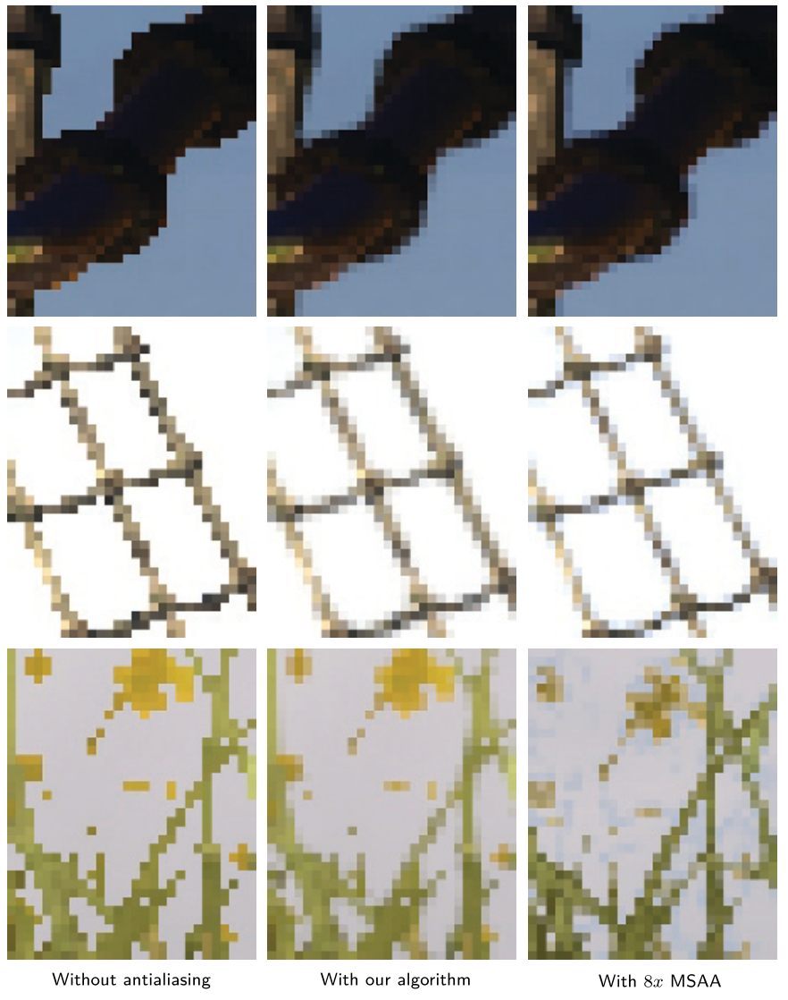


## 6. 讨论

//todo


