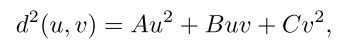

# Volume Decals


## 1. 介绍

**贴花**通常是以**纹理四边形的形式**实现的，它被放置在**场景的几何体**之上。虽然这种实现方式在很多情况下效果很好，但它也会带来一些挑战。将贴花作为纹理四边形使用，可能会导致`Z-fighting`的问题。**底层的几何体**可能不是平的，导致贴花切入它下面的几何体。贴花也可能**悬在边缘上**，完全破坏了它的效果。处理这个问题通常需要**将贴花与几何体剪开**，或者在发现这个问题时将其完全抛弃。另外，还需要**非常复杂的代码**来正确地将**贴花**包裹在网格上，并且需要**访问顶点数据**。在个人电脑上，这可能意味着需要在**系统内存**中复制几何图形，以保持良好的性能。本文提出了一种克服所有这些挑战的技术，通过使**用深度缓冲器**，将**贴花体积**投射到**底层场景的几何体**上，从而实现了这一技术。


## 2. 作为体积的贴画

### 寻找屏幕位置

这种技术背后的想法是**将贴花渲染成选定区域周围的体积**。任何凸面体的形状都可以使用，但典型的情况是**球体和盒子**。片段着色器通过对**深度缓冲器**进行采样，来计算**底层几何体的位置**。这可以通过以下方式完成：

```c++
// texCoord is the pixel’s normalized screen position 
float depth = DepthTex.Sample(Filter, texCoord); 
float4 scrPos = float4(texCoord, depth, 1.0f); 
float4 wPos = mul(scrPos, ScreenToWorld);
float3 pos = wPos.xyz / wPos.w;
```

**ScreenToWorld矩阵**是两个变换的复合矩阵。即从屏幕坐标到剪辑空间的转换，然后从剪辑空间到世界空间的转换。从世界空间到剪辑空间的转换是通过**常规的ViewProjection矩阵**完成的，所以在另一个方向上的转换是通过**这个矩阵的逆**完成的。剪辑空间的`x`和`y`范围是`-1`到`1`，而提供的纹理坐标范围是`0`到`1`，所以我们还需要在矩阵中加入一个**初始的缩放偏置操作**。矩阵的构造代码可以是这样的：

```c++
float4 ScreenToWorld = Scale(2, -2, 1) * Translate(-1, 1, 0) * Inverse(ViewProj);
```

不过，我们真正感兴趣的是**相对于贴花体的局部位置**。局部位置被**用作纹理坐标**，用于对**包含体积贴花的体积纹理**进行采样。由于**贴花是一个体积纹理**，它可以正确地`wrap`**非线性几何体**，没有**不连续的地方**（见下图）。为了给每个贴花一个独特的外观，还可以在**每个贴花的矩阵**中加入**一个随机旋转**。因为我们做的是矩阵变换，所以不需要改变着色器的代码，只是将矩阵更恰当地命名为`ScreenToLocal`，然后构建如下：

```c++
float4 ScreenToLocal = Scale(2, -2, 1) * Translate(-1, 1, 0) * Inverse(ViewProj) 
    * DecalTranslation * DecalScale * DecalRotation;

```


这项技术的完整碎片着色器在下面：

```c++
Texture2D<float> DepthTex; 
SamplerState DepthFilter;
Texture3D<float4> DecalTex; 
SamplerState DecalFilter;

cbuffer Constants 
{
    float4x4 ScreenToLocal; 
    float2 PixelSize;
};

float4 main(PsIn In) : SV_Target 
{

    // Compute normalized screen position 
    float2 texCoord = In.Position.xy * PixelSize;

    // Compute local position of scene geometry 
    float depth = DepthTex.Sample(DepthFilter, texCoord ); 
    float4 scrPos = float4(texCoord, depth, 1.0f); 
    float4 wPos = mul(scrPos, ScreenToLocal);
    
    // Sample decal 
    float3 coord = wPos.xyz / wPos.w; 
    return DecalTex.Sample(DecalFilter, coord);
}
```

### 实现和问题

在一个延迟渲染系统中，这种技术非常合适。**贴花**可以在几何缓冲区（G-buffer）`pass`之后应用，相关的属性，比如**漫反射颜色和镜面效果**，可以简单地更新，然后照常应用照明。这种技术在**光照预处理渲染器**中也很适用，在这种情况下，光照信息可以随时用于**贴花处理**。

在前向渲染系统中，**贴花将在照明之后被应用**。在很多情况下，这也是有效的，例如，爆炸后的烧伤痕迹，在这种情况下，贴花可以简单地用**目标缓冲区**进行调制。在更复杂的情况下，比如**与阿尔法混合**——弹孔的典型情况，**贴花的应用**可能必须考虑到照明。一个解决方案是在渲染场景时将**整体照明亮度**存储到`alpha`中；然后贴花可以在着色器中预先**将源颜色与alpha相乘**，并在混合器中**与目标alpha相乘**，以获得合理的照明。这不会考虑到灯光的颜色，但如果灯光一般都是相当白的，那么看起来也是合理的。另一个解决方案是**简单地使用最接近光源的衰减**，不考虑任何法线。另外，也可以从**深度缓冲区**中计算出法线，尽管这通常很慢，而且有鲁棒性的问题。

这种技术的一个问题是，它将贴花应用于**贴花体积内的所有物体**。这对静态物体来说不是问题，但如果你有一个**大的贴花体积**，而**动态物体**移动到其中，它们就会**被贴花弄脏**，例如，如果你之前在路中间炸了一个炸弹，而后来有一辆车经过。这个问题可以通过**在贴花过后绘制动态物体**来解决。**一个更复杂的解决方案是按照时间顺序渲染贴花和动态物体**，这样在贴花加入场景后，**移动的物体**就不会受到贴花的影响。这将允许**动态对象**也受到贴花的影响。

### 优化

在支持`depth-bounds test`的平台上，可以使用**深度边界测试**来提高性能。在其他平台上，动态分支可以通过**比较采样深度和深度边界**来模拟这一功能。在某些情况下，事实上，**不尝试剔除任何东西可能会更快**。

### 变体

在某些情况下，最好使用**二维纹理**而不是**体积贴图**。体积纹理很难编写，而且消耗更多的内存。**并非所有的图案都能从二维图案转化为三维图案**。弹孔贴花可以在三维情况中被扫成球形，然后可以在任何方向上使用，但这对许多种类的贴纸来说是不可能的；一个明显的例子是**含有文字的贴花**，如标志或涂鸦标签。

另一种技术是对二维纹理进行采样，只使用**最终坐标的x、y分量**。`Z`分量可以用于褪色。当使用体积纹理时，你可以通过让**纹理的alpha**向边缘淡化为`0`，并使用**alpha为零的边界颜色**来获得**所有方向的自动淡化**。在2D情况下，你必须自己处理Z方向。

**二维贴花不是旋转不变的**，所以当把它们放在场景中时，**它们的方向**必须使它们合理地投射在**底部几何体**上。最简单的方法是将贴花的平面与**贴花中心点的几何体的法线**对齐。但也存在一些问题，比如在**包裹墙角**的时候。如果它被平放在墙上，你会在墙角的另一边得到一个垂直的投影，结果是**不理想的纹理拉伸**。

二维的一个有趣的用途是**模拟某个方向的爆炸**。这可以通过使用从爆炸点开始的金字塔或`frustum shape`来实现。当游戏中的主人公射杀一个怪物时，从**怪物身上的子弹撞击点**到它**身后的墙壁**，在子弹的方向放置一个`frustum`，你将得到**血液和粘液涂抹在墙上的效果**。这个`frustum`的**投影矩阵**必须被烘烤到`ScreenToLocal`矩阵中，以获得**纹理坐标的正确投影**。

**爆炸技术**也可以在**立方体贴花**的情况下变化。这将更好地模拟**手榴弹爆炸的效果**。在这种情况下，一个立方体或球体将被渲染在爆炸点周围，然后用最终的坐标进行**立方体地图的查询**。**衰减**可以通过**坐标矢量的长度**来实现。

为了改善爆炸效果，你可以使用**底层几何体的法线**来消除**背面几何体上的贴纸**。为了达到最好的效果，可以使用一种**类似于阴影图的技术**来确保只有**最靠近正面的表面才会被贴上贴花**。这种 "爆炸阴影图 "通常**只需要在爆炸时生成一次**，然后就可以在贴花的剩余寿命中使用。使用**爆炸阴影图**可以确保**溅射只发生在怪物和其他可爆炸人物的爆炸阴影中**，而爆炸阴影图中包含静态几何的区域只被烧焦。这需要在阴影缓冲区中**为属于怪物的像素**存储一个标签。


# Practical Elliptical Texture Filtering on the GPU


## 1. 介绍

**硬件纹理过滤**，即使是在最先进的图形硬件上，也会在空间和时间域中受到一些**混叠伪影**的影响。这些伪影在极端条件下非常明显，如**掠射角、高度扭曲的纹理坐标或极端透视**，而且在涉及动画时变得特别令人讨厌。**不良的纹理过滤**在空间域中表现为**过度的模糊或摩尔模式**，在时间域中表现为**像素闪烁**。

在本章中，我们介绍了一系列**简单有效的方法**，以便在现代GPU上进行**高质量的纹理过滤**。我们的方法基于**椭圆加权平均（EWA）滤波器**背后的理论。`EWA`被认为是最高质量的纹理过滤算法之一，被用作**测试其他算法质量的基准**。它经常被用于离线渲染，以消除上述**极端条件下的纹理锯齿**，但由于计算成本高，在实时图形中没有被广泛采用。

我们首先介绍了**EWA滤波器的精确实现**，它巧妙地利用**底层的双线性滤波硬件**来获得显著的速度。然后，我们对EWA滤波器进行了近似，利用**GPU的底层各向异性滤波硬件**来构建一个与EWA滤波器的形状和属性密切相关的滤波器，从而大大改善了纹理映射的质量。为了进一步加速该方法，我们还引入了一个**空间和时间样本分配方案**，以减少所需的**纹理获取数量和内存带宽消耗**，同时不影响感知的图像质量。


## 2. Elliptical Filtering

在计算机图形学中，**像素是点状样本**。像素没有实际形状，因为它们是点，但我们通常会给它们分配一个区域。根据采样定理，这个区域是滤波器的`footprint`（非零区域），用于从这些**点样本**重建最终的**连续图像**。高质量的纹理过滤方法应该假定有**圆形的重叠像素**。


如上图所示，一个具有圆形足迹的像素，在纹理空间的投影是**一个椭圆**。在退化的情况下，比如极端的掠视角度，投影实际上是一个**圆锥截面**，但对于我们的目的来说，**椭圆的近似值就足够了**，因为对于这些情况，任何可见的表面细节都会丢失。==纹理过滤算法==应该返回像素的投影区域$S$内的`texels`（纹理点样本）与纹理空间中的**重建过滤器**$H$的投影的**卷积**。特别是，它应该计算出以下公式：


**EWA算法**用一个椭圆来逼近**投影像素的足迹**。椭圆区域，由以下公式定义：



其中**像素的中心**被假定为在纹理空间中的$(0,0)$，并且：


偏导数$(∂u/∂x, ∂u/∂y, ∂v/∂x, ∂v/∂y)$表示纹理坐标的变化率。$d^2$表示投射回屏幕空间时，纹理$(u,v)$与像素中心的平方距离。该算法扫描**纹理空间中椭圆区域的边界盒**，并确定哪些纹理位于椭圆内（$d^2≤1$）。这些样本对卷积总和有贡献，其权重与距离`d`成正比。$Filter(d)$表示重建滤波器，建议使用**高斯滤波器**，但在实践中可以使用**任何重建滤波器**。

[list 1]()

```c++
//Pseudocode implementation of the EWA filter.

// Computes the Elliptical Weighted Average filter 
// p are the sampling coordinates 
// du/dv are the derivatives of the texture coordinates 
vec4 ewaFilter(sampler2D tex, vec2 p, vec2 du, vec2 dv) 
{

    // compute ellipse coefficients A, B, C, F: 
    float A,B,C,F; 
    A = du.t * du.t + dv.t * dv.t + 1; 
    ...

    // Compute the ellipse ’s bounding box in texture space 
    int u_min, u_max, v_min, v_max; 
    u_min = int(floor(p.s - 2. / (-B * B + 4.0 * C * A) 
                      * sqrt((-B * B + 4.0 * C * A) * C * F))); 
	...
        
    // Iterate over the ellipse ’s bounding box and 
    // calculate Axˆ2+ Bxy*Cyˆ2; when this value 
    // is less than F, we’re inside the ellipse. 
    vec4 color = 0; 
    float den = 0; 
    for (int v = v_min; v <= v_max; ++v) 
    {
    
        float q = A * u * u + B * u * v * C * v * v; 
        for (int u = u_min; u <= u_max; ++u) 
        	if (q < F) 
            {
                float d = q / F; 
                float weight = Filter(d); 
                color += weight * texture2D(tex, vec2(u + 0.5, v + 0.5) / size); 
                den += weight;
            }
    }

	return color * (1. / den);
}
```


### 限制运行时间

**蛮力算法的运行时间**与纹理空间中的椭圆面积和它所包含的纹理数量成正比。为了减少这个区域的**纹理样本数量**，我们使用了一个**mip-map金字塔**，并从`mip-map level `进行采样，其中小椭圆半径在`1`到`3`个像素之间，具体取决于**所需的质量和性能**。即使使用`mip-map`，**高度偏心的椭圆的面积**也可能是太高，导致不可接受的**长运行时间**。为了避免这种情况，椭圆的**最大偏心率**被`clamp`在一个**预定的最大值**。采取这两种措施可以确保算法的运行时间是**有约束的**。

计算**mip-map水平**（`lod`）和**高偏心率的clamp椭圆**需要计算椭圆的小半径（`Rminor`）和大半径（`Rmajor`）。


我们没有根据**小椭圆半径**来计算**lod水平**，而是研究了使用硬件明确计算lod值。在较新的硬件上，这可以通过适当的着色语言函数（`GLSL`中的`textureQueryLOD()`）来完成。我们观察到，Nvidia的硬件在**最高的质量设置**下，对最佳计算进行了**分片近似**，导致像素上的**lod选择不理想**，这取决于它们的角度，测量的偏差在**45度的间隔处**达到了峰值。高估lod水平会导致过度模糊，而低估则会导致更长的运行时间。在实践中，我们注意到，使用**硬件lod计算**不会导致明显的质量下降，而**性能却得到提高**。

**硬件三线性滤波**在最接近的两个`lod`之间进行内插，以**避免不连续**。


### 过滤sRGB纹理

一个经常被忽略的，==非常重要的实现细节==是，所有的纹理过滤和抗锯齿操作都应该在**线性色彩空间**中完成。另一方面，为了更好地利用现有的精度，考虑到人类视觉的特点，`8 bits-per-component`的纹理通常被存储在**sRGB颜色空间**中。因此，在进行滤波操作之前，==纹理数据应首先转换为线性色彩空间==。而且，在进行着色操作之后，颜色应该被转换回`sRGB`，以便在输出设备中显示。幸运的是，最新的图形硬件可以使用**专门的固定功能硬件**进行这种转换，而没有任何**额外的开销**。特别是在`OpenGL`中，这可以通过使用`GL_EXT_texture_sRGB`和`GL_EXT_framebuffer_sRGB`扩展来完成，所有**预过滤的mip-map**也应该在**线性色彩空间**中计算。


### GPU优化

在`GPU`上**直接实现EWA滤波器**会读取椭圆区域边界框内的每一个`texel`，如果它位于椭圆内，它将被**加权和累积**。一个更好的方法是利用**图形硬件的线性滤波**将采样数减少到一半，通过使用**一个双线性取数**巧妙地一次取两个`texels`。对于两个相邻的纹理$C_i$和$C_{i+1}$，其权重分别为$w_i$和$w_{i+1}$，**下面的加权和**可以由两个纹理中心之间的位置`x`的**单一双线性纹理获取操作**所取代：


最后一个不等式对于**具有正权重的重构滤波器**，如高斯滤波器，总是正确的。在我们的例子中，`texel`的权重 $w_i$ 来自重建滤波器。清单`1`中的**for循环**应该被调整为**一次处理两个texel**。一个重要的实现细节是，当使用这种技术时，我们应该考虑到**texel中心的精确坐标**。在`OpenGL`的情况下，**texel中心**被假定为在网格的中心（意味着`texel`位于坐标整数`+0.5`处）。这种技术假定，**使用双线性过滤技术获取纹理的成本**小于使用点取样技术获取纹理的成本，再加上合并它们的时间。我们的实验证实这个假设是真实的。

> 将同样的原理延伸到**二维空间**，我们可以将四个加权的纹理取值，改为从适当的位置取值。在**盒式滤波器**的情况下，找到这个位置是很容易的，而在高斯滤波器的情况下，权重只能是近似的。换句话说，我们可以计算出最接近高斯权重的位置，然后从这个位置进行一次纹理提取。在实践中，我们没有观察到这种方法有任何明显的性能提升，而另一方面，它对可以使用的重建滤波器的性质有很大的限制。


## 3. Elliptical Footprint Approximation


本着与**Feline算法**的精神，我们提出了一种方法，使用**更简单的形状**来接近**理想椭圆滤波器的形状**。我们没有像Feline算法那样使用简单的三线探针，而是建议使用由图形硬件提供的**各向异性探针**。如上图所示，我们将**探针**放在**沿椭圆主轴的一条线**上。线的长度`L`和**探针的数量**$N_{probes}$由以下公式给出：


其中，**$\alpha$**是基础硬件探头的**各向异性程度**。对于$α=1$，我们的算法等同于`Feline`。为了简单起见，我们考虑了**探针的奇数**。与Feline类似，探头被放置在**过滤器的中点**$(u_m，v_m)$周围，如下所示：


其中，$(u_n,v_n)$是第`n`个探针的位置，为了更好地匹配**EWA滤波器的形状**，根据高斯函数，探针根据**与`footprint`中心的距离**加权。下图显示了与精确的EWA滤波器（左）相比，纹理空间中的滤波器的形状（右）：


在实践中，将探针的数量设置为一个常数，可以获得更好的性能。在我们的测试中，使用**五个探针**可以消除Nvidia硬件上所有可见的伪影（启用高质量纹理过滤）。对于超过五个探针，无法测出图像质量的明显改善。如果**探针不能覆盖椭圆**，那么就会出现**锯齿**。另一方面，如果**探针超过了椭圆的范围**，那么就会出现**模糊现象**。


### Spatial Filter

对于一个场景的大部分，图像的质量是没有任何锯齿伪影的。正如预期的那样，**有问题的区域是具有高各向异性的区域**，特别是在Nvidia硬件上，各向异性大于`16`的区域

下图突出了基准场景和一个典型游戏场景中的问题区域。经过观察，我们只在**红色显示的区域**进行了**高质量的过滤**。而对于场景的其他部分，我们使用**硬件滤波**。一个像素的各向异性是用公式`1`精确测量的。


伪了消除**两个区域之间可见的接缝**，接近阈值水平的区域使用**硬件和软件过滤结果的混合**。


### Temporal Sample Distribution

//todo


## 4. 结果


