[toc]


# An Approximation to the Chapman Grazing-Incidence Function for Atmospheric Scattering

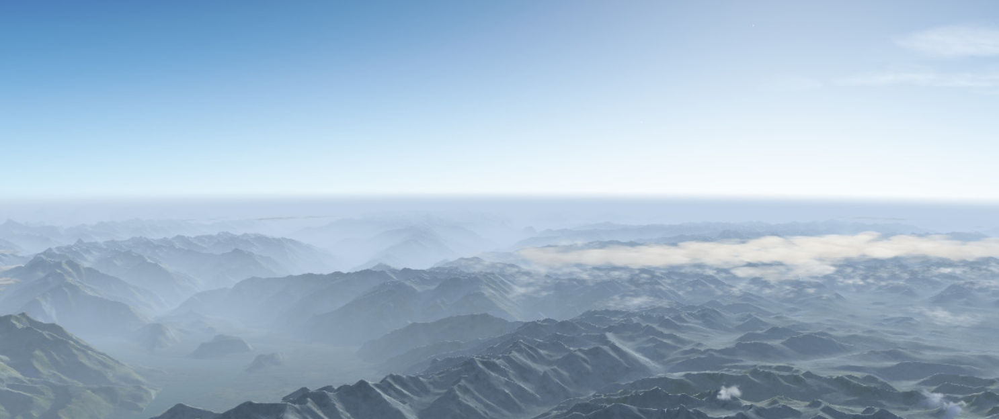


## 1. 介绍

**计算机图形的大气散射**是将大气作为一种**参与媒介**来处理，基本上是 "计算天空的颜色"。一个共同主题是找到有效评估或预计算==Chapman函数==的方法，$Ch(x, χ)$。这是球形对称、指数下降的大气中的**射线的密度积分**。查普曼函数在物理学文献中已经得到了广泛的处理。本文为其计算探索了一个不同的方向：一个便宜到**$Ch(x, χ)$可以被认为是商品`commodity`**的近似值，同时仍然足够准确。


## 2. 大气散射

本节是对大气散射的简要回顾和术语的定义。当光穿过空气时，它将部分被吸收，部分被散射到其他方向。这就产生了**空中透视的现象**。沿着一条路径**不受阻碍的那部分光**是透射率`T`，而由于散射而被加入路径的量是**内散射**`S`：

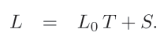

为了得到总的内散射`S`，一般来说，我们必须沿着路径进行积分。然后，在一个特定的点 $S(t)$的散射（$f(\theta)$是相位函数）：

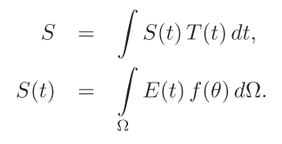

辐照度通常被**离散化为单个贡献的总和**。特别是在白天，最重要的贡献者是太阳，它可以简化为一个定向的点源$E_{sun}$，用于**到达大气边界的辐照度**；$E_{sun}$在从大气边界到$S(t)$的路径上被**透射率**$T_{sun}$所衰减：

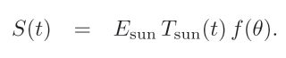

**透射率本身**是空气质量`m`乘以**消光系数**$β$的**指数递减函数**，后者是**散射介质的属性**，可能与波长有关。**空气质量**是沿路径的空气密度$ρ(t)$的积分：

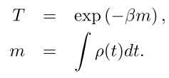


## 3. The Chapman Function

为了**降低算法的复杂性**，最好能有一种有效的方法来计算**沿射线的透射率**。事实证明，这可以简化为对**查普曼函数**的计算。在不丧失一般性的情况下，让我们从**大气层内的观察者**开始一条射线，并将其延伸到无限远（见下图）。这条射线可以追溯到**最低高度的一个点** $r_0$。我们冒昧地称这一点为**近地点**。这里我们定义$t=0$，以及沿射线的**任何一点的高度**如下：

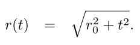

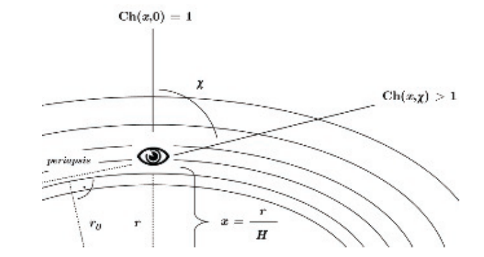

让我们进一步假设**一个球状对称的大气层**，其**密度呈指数下降**，其特征是比例高度`H`：

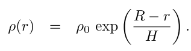

将这些表达式结合起来，就可以得到沿整个射线的积分。**积分边界**与观测者的高度`r`和入射角$χ$呈**三角关系**：

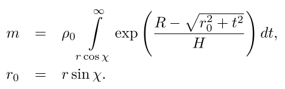

这个积分并没有一个简单的解，除非是在**直视向上看天顶**（$χ=0$）时除外。在这种情况下，沿射线的密度只是观察者上方空气柱的密度。根据密度分布的定义，这是一个尺度高度乘以观察者处的密度。让我们把这个质量称为$m_{⊥}$：

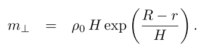

我们可能有一个函数将$m_{⊥}$与 $m$联系起来吗？我们可以，因为这是**查普曼函数**$Ch(x, χ)$：

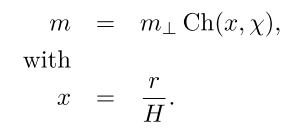

`x`代表**归一化高度**，希腊字母`chi`代表**入射角**。该函数与`scale`无关，通常用表格或近似的数字来表示。为方便起见，下面给出了一个分析性的表达。这是从[Kocifaj 96]中发现的一个**更一般的解决方案**中剥离出来的。

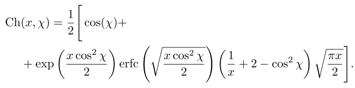

上述表达式对于实时评估并不实用，原因有几个：它包含**互补的误差函数**`erfc`，它本身需要一个数值近似。在大x和小χ的情况下，它的数值表现不好，**exp项**变得非常大，**erfc项**几乎为零。然而，我们使用这个表达式作为我们的基础真实标准，用任意精度的数学软件来评估。


## 4. 实现实时逼近

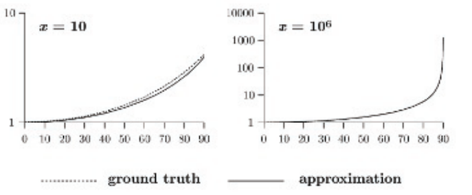

为了更好地理解**查普曼函数**，我们将绘制它的图表（见上图），并观察一些重要的特性。

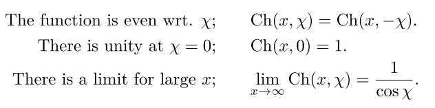

这些特性很容易解释。**偶数的对称性**来自于问题的说明。只有**入射角的余弦**出现在表达式中。这使我们可以将**覆盖范围**缩小到 $0 < χ < 180^o$。其次，由于$Ch(x, χ)$将$m_⊥$与$m$联系起来，它的值对于小入射角必须接近`1`。最后，在`flat earth`的限制下，**查普曼函数必须接近正割函数**。这

些特性可以用来设计我们的近似值。大`x`的极限表明是一个有理的近似，因为我们要应付**一个极点**。运行时间的效率要求尽可能的低阶。所以我们要寻找$cos χ$的**一阶有理函数**，左边接近`1`，右边接近$Ch_{||}(x)$的值，这样的**有理函数**只有一种可能：

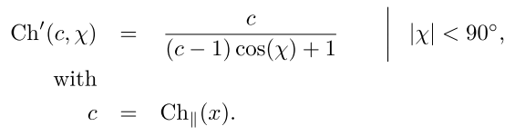

事实证明，**这个低阶函数是一个相当好的近似值**。然而，$χ$的有用范围仅限于$90^o$以下。超过这个角度，近似值就会呈双曲线增长到无限大，而准确的查普曼函数则会呈指数增长，并始终保持有限。我们将寻找处理$χ > 90^o$的方法，但我们必须首先把注意力转向**系数c**。

### 在地平线

如果**观察者的高度是固定的**，我们可以预先计算出一个`c`的值。然而，对于一个移动的观察者，在没有**查普曼函数**可以依靠的情况下，我们需要一个`c`本身的近似值。让我们来看看$Ch_{||}(x)$：

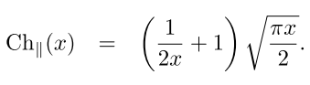

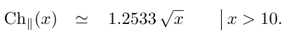

### 在地平线之上

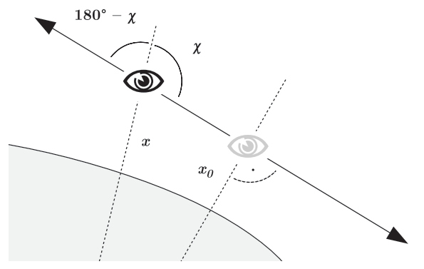

请看上图。沿着一整条线的空气质量$m_L$是**沿着前线的空气质量**，加上**沿着后线的空气质量**：

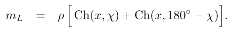

上述方程对沿线的任何一点都必须是真实的。我们可以将观察者移动到近地点，在那里，前向和后向射线都是水平的。用三角法计算，近地点的高度为$x_0 = x sin χ$，密度遵循$ρ*exp(x - x_0)$。因此，另一种表达$m_L$的方式是：

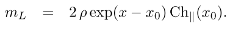

结合上述方程，有可能得出一个特性，即用**反射入射角**来表达查普曼函数本身：

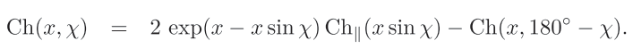

如果**查普曼函数**在$0 < χ < 90^o$的情况下是已知的，那么它对所有$χ$都是已知的。


## 5. 实现

### 数值范围

首先，必须解决一个**数字范围的问题**，当`x`大而$x_0$小的时候就会出现这种情况。`identity formula`包含指数$exp(x - x_0)$，它溢出了。为了补救这种情况，我们引入了一个修改的函数$Ch_h(X, h, χ)$：

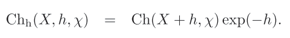

这个函数需要一个**参考高度**`X`和相应的观测者来计算空气质量。

[list 1]()

```c++
float chapman_h( float X, float h, float coschi) 
{
    // The approximate Chapman function 
    // Ch(X+h,chi) times exp2(-h) 
    // X - altitude of unit density 
    // h - observer altitude relative to X 
    // coschi - cosine of incidence angle chi 
    // X and h are given units of the 50%- height
    
    float c = sqrt(X + h); 
    if(coschi >= 0.)
    {
        // chi above horizon 
        return c / (c * coschi + 1.) * exp2(-h);
    } 
    else 
    {
        // chi below horizon , must use identity 
        float x0 = sqrt(1. - coschi * coschi) * (X + h); 
        float c0 = sqrt(x0); 
        return 2. * c0 * exp2(X - x0) - c / (1. - c * coschi) * exp2(-h);
    }

}
```


### Distance Differences

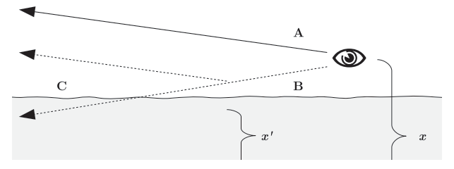

第二个修改涉及到近似值对**路径长度的和与差**保持忠实的能力。特别要注意的是**观察者靠近反射面上方**的情况。考虑上图。假设有接近水平的角度，三段的空气质量$m_A$、$m_B$和$m_C$可以被简化为：

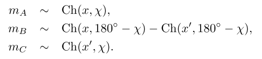

现在的问题是，该近似值是否满足$m_A=m_B+m_C$ ？这将是在水面以上的地平线上实现精确的颜色匹配的要求。简短的回答是，原来的近似值在这个属性上不成立。有理函数中分母的形式，以及因子`1.2533`，阻碍了它。必须对近似值进行修改以实现这一特性；这个新的近似值甚至更简单。

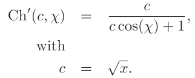


### Using exp2

该代码将专门使用双指数$2^x$而不是自然指数$e^x$。因此，我们将需要把**所有的尺度**转换为双对数。我们需要一个50%高度的$H_{50}$，而不是`scale height` `H`；我们需要**50%的消减系数**：

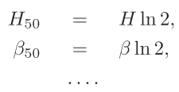

这一变化的原因是，**exp2通常是更有效的函数**。为了进一步优化，一个实现可以采用一个**快速的exp2函数**进行所有散射计算。附录（第11.8节）中介绍了这样一个快速exp2函数的例子。

[list 2]()

```c++
//Function for the transmittance along a ray.

vec3 transmittance(vec3 r, vec3 viewdir) 
{

    // calculate the transmittance along a ray 
    // from point r towards infinity

    float rsq = dot(r,r); 
    float invrl = inversesqrt(rsq); 
    float len = rsq * invrl; 
    float x = len * invH50; 
    float h = x - X50; 
    float coschi = dot(r, viewdir) * invrl; 
    return exp2(-beta50 * H50 * chapman_h(X50, h, coschi));
}
```

```c++
float exp2pp( float x ) {
    // partial precision exp2 , accurate to 12 bits 
    
    const float c[3] = { 5.79525 , 12.52461 , -2.88611 }; 
    int e = round(x); 
    float t = x - e; 
    float m = (t * t + c[0] * t + c[1]) / (c[2] * t + c[1]); 
    return ldexp(m, e);
}
```


## 6. Putting the Chapman Function to Use

### Airmass and Transmittance

用**修改后的查普曼函数**可以很容易地计算出空气质量。你需要知道**观察者的高度**和参考高度（方便地说，这就是**行星半径，或平均海平面**），以及大气的比例高度：

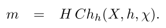

**从空气质量到透射率**只有一小步，因为$T = exp(-βm) $。见清单`2`，有一个函数用于计算**沿直线通过大气层的透射率**。比例高度和消光系数必须是全局可用的。在完整的片段程序中，这个函数被用来计算表面渲染的局部太阳颜色。

### Aerial Perspective

完整的空中透视功能有两种颜色作为结果：==透射率和内散射==。该功能太长，不能在此列出，但在网站上的片段程序中包含了该功能。

```c++
void aerial_perspective(out vec3 T, out vec3 S, in vec3 r0
                        , in vec3 r1, in bool infinite );
```

该函数计算从点$r_0$到点$r_1$的**空中透视**，或者从点$r_0$沿射线通过$r_1$到无限远的空中透视。**所得的透射率**被写入参数`T`，**散射率**被写入参数`S`。在第一步中，函数将射线与**大气层边界**相交，得到积分区间，该区间被细分为固定数量的片段。然后，它以**相反的顺序（从后往前）**迭代所有段。对于每一段，调用**Chapman函数**来计算**空气质量、透射率和内散射**。然后，内散射以**类似于阿尔法混合的方式**沿射线传播。

### The Example Raytracer

//todo


# Volumetric Real-Time Water and Foam Rendering

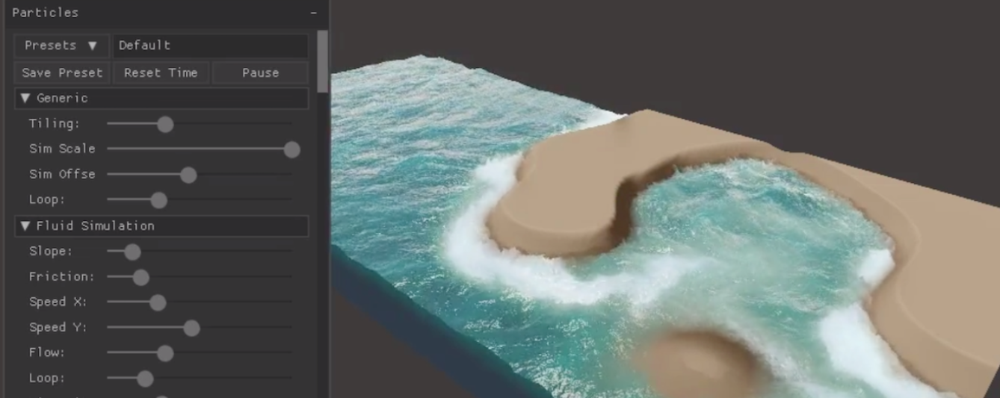

 //TODO

在这一章中，我们提出了一种创建完全动态的**多层实时水渲染方法**。这种方法可以表现**水的体积特性和体积泡沫的物理形成**，从而创造出比以前的实时方法高得多的视觉保真度。它基于一个非常快速的**基于粒子的流体模拟**。


# Inexpensive Antialiasing of Simple Objects

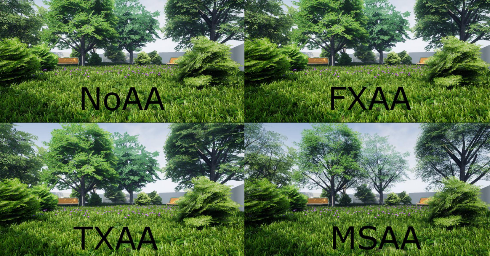


## 1. 介绍

本文探讨了在移动设备上使用==不连续边缘过度绘制==，对简单物体进行**抗锯齿**。这种技术的本质是在**不连续的原始边缘**上渲染一条 **"平滑 "的线**，以覆盖不连续的边缘。这种方法对于渲染那些**轮廓在几何上定义好，或者很容易推导出来的物体**来说是非常有用的。这适用于从GUI元素到**3D定位的2D物体**，甚至是简单的3D物体。对于**有纹理的2D元素**，处理抗锯齿的通常方法是使用**具有半透明边缘的纹理**，依靠纹理采样在边界产生**平滑过渡**。


## 2. Antialiasing via Smoothed Lines

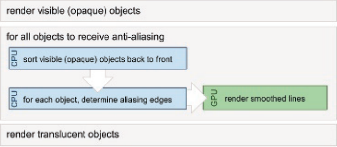

Sander的创始观察是，**3D场景中的锯齿**主要出现在**几何轮廓边缘和折痕边缘**，因此只有沿这些线的像素需要抗锯齿。由于**这些边界可以被描述为线**，而且**线的平滑性**`line smoothing`在硬件中广泛存在，因此可以通过在**锯齿边缘**上渲染平滑的线来减少锯齿。Sander的主要贡献是**找到锯齿边缘的算法**。对于某些应用来说，**潜在的锯齿边缘**是很容易得到的，这使得我们可以很容易地使用这种方法。值得注意的是，这个算法对半透明物体不起作用，而且**对改善纹理锯齿毫无帮助**，包括渲染2D精灵时的锯齿。然而，**硬件纹理过滤**基本上解决了这个问题，而且在大多数**现代移动GPU**上都可以使用。应用该算法只包括**两个步骤**：

+ 确定导致锯齿的几何边缘。
+ 将锯齿边缘渲染成平滑的线条。

在一般情况下，要确定哪些边会导致**锯齿**，并不是一件容易的事。我们请读者参考[Sander等人，01]中的详尽讨论。总之，对于任何可见的物体，应该考虑三组几何边缘：

+ 剪影边缘， 
+ 不连续的边缘，例如，"硬 "边缘或纹理接缝
+ 几何对象之间的交叉边缘。

对于一个**三角形网格**来说，**不连续的边缘**通常是静态的，可以预先计算。而**剪影边缘则会随着观看者的变化而变化**。在处理完全由三角形构成的场景时，**寻找剪影边缘的几何方法**是：找到所有相邻三角形中的一个朝向观众，而另一个朝向观众的边缘。计算几何目标之间的精确交点在计算上很昂贵，[Sander等人，01]中没有提出解决方案。

当渲染线条以覆盖**检测到的锯齿边缘**时，`over alpha-blending`被应用（`src_alpha`，`one_minus_src_alpha`），并且**深度缓冲**被用来实现正确的遮挡。虽然渲染的线条有可能受到`z-fighting`的影响，但`fighting pixels`的颜色与渲染对象的颜色相同。由于平滑线条的主要贡献是**在锯齿对象之外**，所以`z-fighting`引起的问题很小。渲染**多层阿尔法混合像素**时，必须以**从后到前的方式**进行合成。这只是在平滑线重叠的少数像素处出现的问题，使得由**不正确的深度排序**引起的错误大多不被注意到。对于大多数目的来说，只做一个**近似的按物体排序**就足够了，而且**可以考虑完全跳过排序**。

线条的着色应该与锯齿边缘的着色相同，像对底层物体一样**应用照明和纹理**。同样的顶点程序和片段程序也应该在平滑线的渲染过程中应用。由于**锯齿边缘**是渲染网格中的一个边缘，原始顶点数据可以用于平滑线。对于一个边缘有多组顶点数据的模糊情况，必须选择一组。


## 3. 渲染线条

==线条和三角形的光栅化有本质的不同==：三角形生成的`fragment`是包含在三角形内的片段中心，而线条生成的`fragment`是通过以片段中心为中心的 "钻石"（见下图）。在三角形的情况下，顶点值是**线性内插到片段中心的**，而**线生成的片段**总是接收**投射到线中心的栅格化点的值**。

==OpenGL|ES==将片段的覆盖范围定义为**片段与矩形之间的精确重叠区域**。因此，**渲染的线条**为受影响的片段提供了**完美的覆盖值**，使其成为抗锯齿的理想选择。

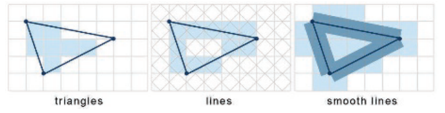

### OpenGL|ES 1.x

==OpenGL|ES 1.x规范==包括渲染**平滑的点和线**的功能，这在 "常规 "OpenGL中也是可用的（见清单`1`）。

[list 1]()

```c++
gl.glLineWidth (1.0f); 
gl.glEnable(GL10.GL_LINE_SMOOTH); 
gl.glBlendFunc(GL10.GL_SRC_ALPHA, GL10.GL_ONE_MINUS_SRC_ALPHA); 
gl.glEnable(GL10.GL_BLEND);
```

### OpenGL|ES 2.x

在==OpenGL|ES2.0==中，**点平滑和线平滑被从规范中删除，并引入了多采样抗锯齿**（`MSAA`），以允许对所有基元进行**抗锯齿**。然而，使用多采样大大增加了处理片段的数量，同时也增加了**深度和颜色缓冲区的内存**。

### General Solution to Smoothed Line Rendering

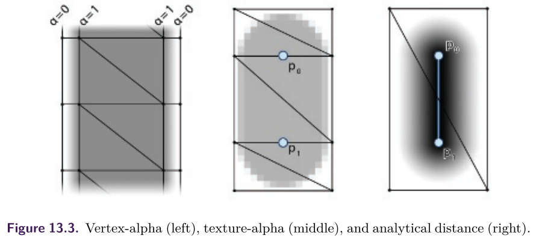

与其依赖**特定的硬件能力**，有几种方法可用于**手动渲染抗锯齿线**。以下三种方法特别值得关注（见上图）。

+ 沿着边缘渲染一个**额外的几何带**，将边界上的**顶点alpha**设置为`0`。
+ 用`masking alpha texture`进行渲染，以**平滑边缘**（可以选择使用**距离场**）。
+ 在**像素着色器**中分析计算**与线段的距离**，并使用映射的距离作为**alpha掩码**。

对于渲染宽度只有**几个像素的线条**，渲染一个**额外的半透明顶点条**是不切实际的，因为它产生了许多**小而薄的三角形**。首先，它不能保证片段中心都包含在三角形内，这就需要**宽的折线**来保证平滑度。其次，由于硬件经常以**2×2像素的四边形**对像素进行着色，处理过程可能被浪费在**不可见的碎片**上。

使用一个**简单的阿尔法纹理**作为掩码，依赖于纹理过滤和预过滤的`mip-maps`来产生一个平滑的结果。使用纹理很容易让我们为线条指定一个**自定义的衰减**，允许增加**对平滑度的控制**。由于纹理可以非常小，例如**32×32像素的灰度**，内存就不是问题了。为了在所有尺度上产生正确的过滤线，为纹理提供一个`mip-map`是很重要的。

**第三种分析计算距离的方案**提供了最精确的结果，能用**着色器**来轻松实现。虽然**每个片段的距离计算**比使用纹理查找需要**更多的ALU指令**，但它仍然是一个可行的选择，因为使用这个着色器只触及**少数片段**。第二种和第三种方法的混合是可能的，对**距离纹理**进行采样并将其映射到一个**alpha值**，可能会对衰减提供更多的控制。另外，**渲染的线条**应该具有有效的深度，以便对**深度剔除**有用。下列选项可用于生成所需的几何图形：

+ 将所有的点投射到**屏幕空间**，挤出**几何线**，再投射回**世界空间**。
+ 在**世界空间**直接渲染**折叠的三角形**，并在顶点着色器中进行**投影后的扩展**。
+ 对于带有几何着色器的硬件，在**几何着色器**中渲染线段并**扩展顶点**。

第二种方法需要访问着色器，并且只需要**少量内存开销**，来存储**顶点ID**。几何着色器，虽然目前在移动硬件上还不能使用，但可以提供最灵活的解决方案，与普通的线条渲染相比，只需要很少的改动。为了保持**向后的兼容性**，我们选择在`CPU`上直接在**世界空间**中生成**所有的线状几何**。这样做的缺点是，每当视图发生变化时，都要创建**新的位置和纹理坐标**。

**生成线型几何的方法**是相当直接的，但为了完整起见，我们在此提供给大家。

对于每个锯齿线段 $\{p_0, p_1\}$来说：

+ 投射$\{p_0, p_1\}$到近平面$\{p_0^{np}, p_1^{np}\}$。

+ 将$\{p_0, p_1\}$扩展为八个顶点$v_{n0-n7}$，在**近平面**上形成线。

+ 从三个点$p_0,p_1$, 和$p_0 +\overline{v}×(p_0-p_1)$生成平面`P`，其中`v`是**世界坐标中的视图向量**。

+ 将$v_{n0-n7}$投影到`P`上，从而得到**世界空间的顶点**。

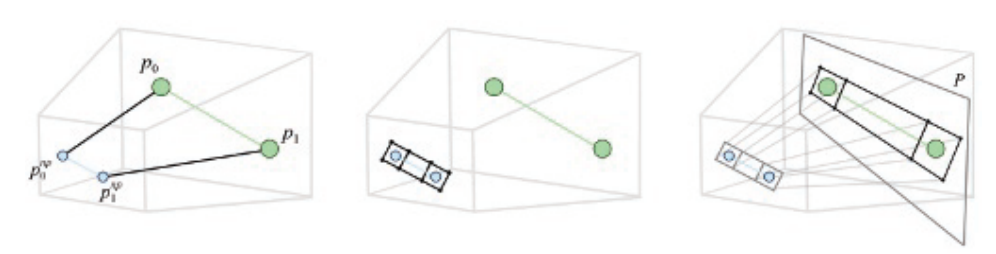

回顾一下，**三角形栅格化**只影响**中心位于三角形内的片段**，有必要渲染**比目标宽度更宽的线条**，以便影响**平滑线渲染**所触及的相同片段。影响与**1像素抗锯齿线相同的片段**所需的最小线宽取决于**角度和偏移**。为了涵盖最坏的情况，可以使用$2\sqrt{2}=2.8$像素的宽度。如果需要，可以通过**人为地增加线条的宽度**来引入更平滑结果。

在渲染过程中，我们希望**alpha遮罩纹理插值**发生在屏幕空间

//todo


## 4. 讨论

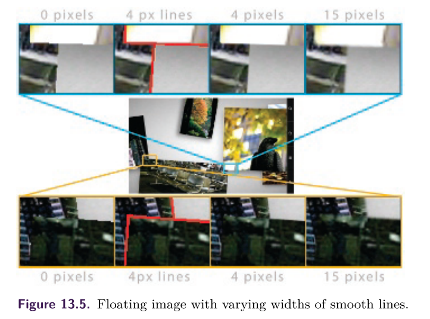