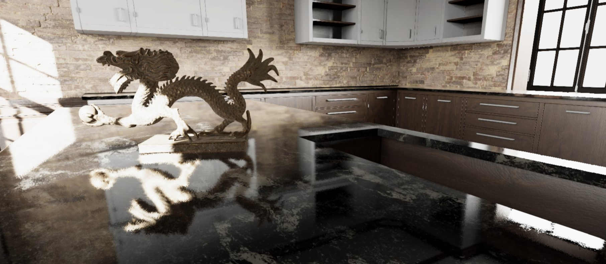
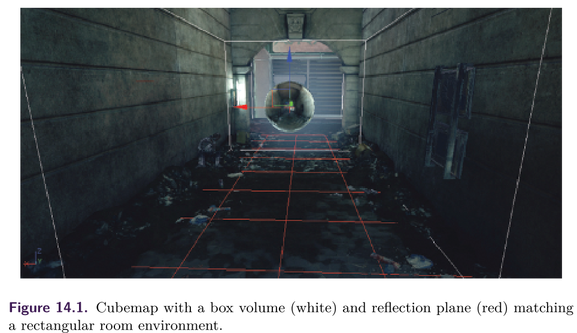
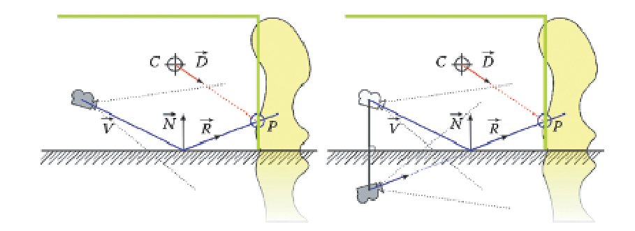
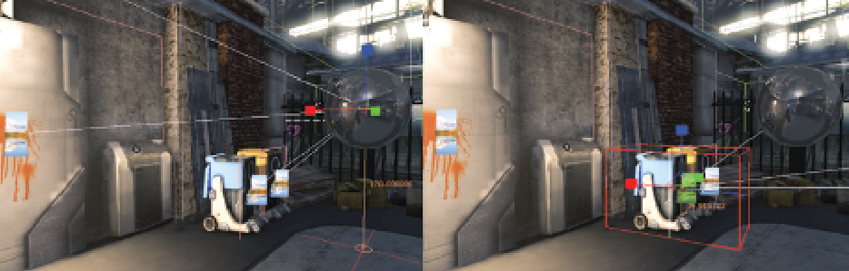
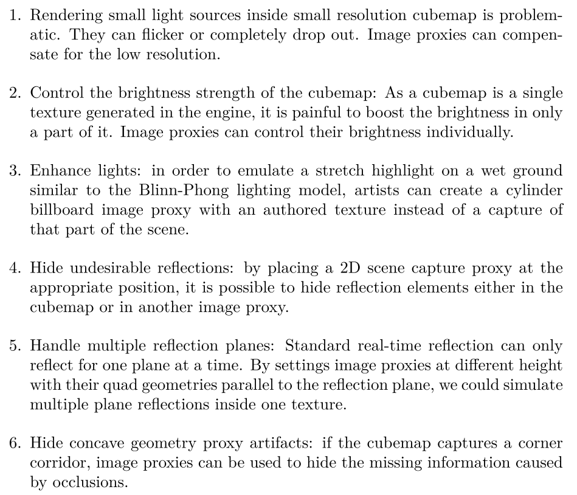
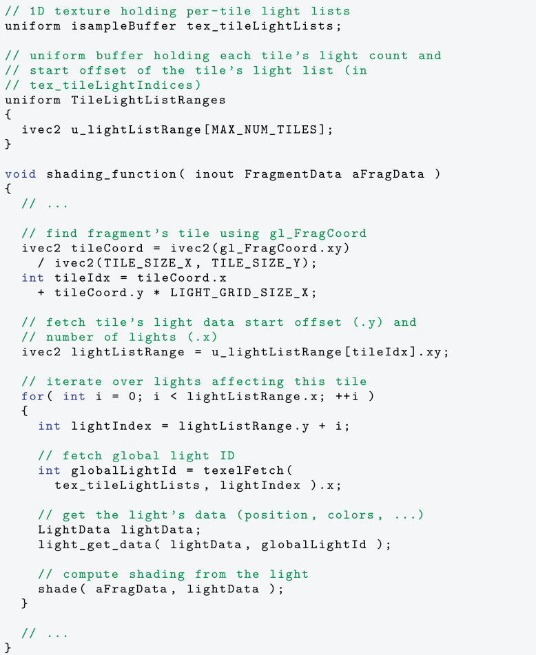
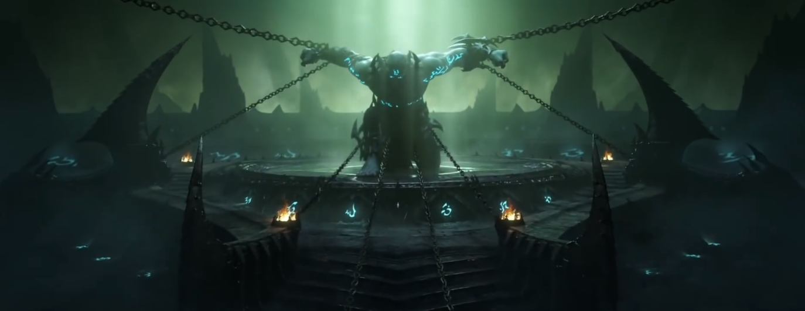
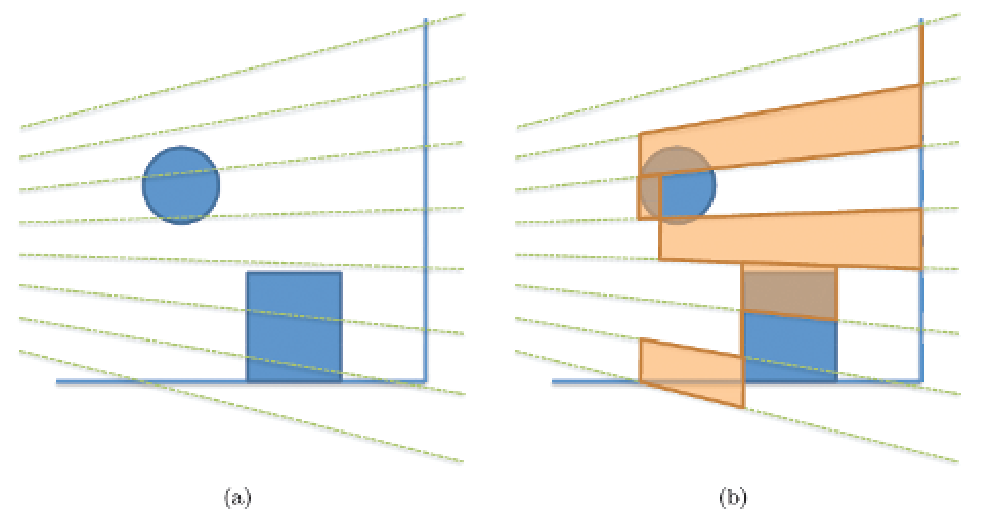
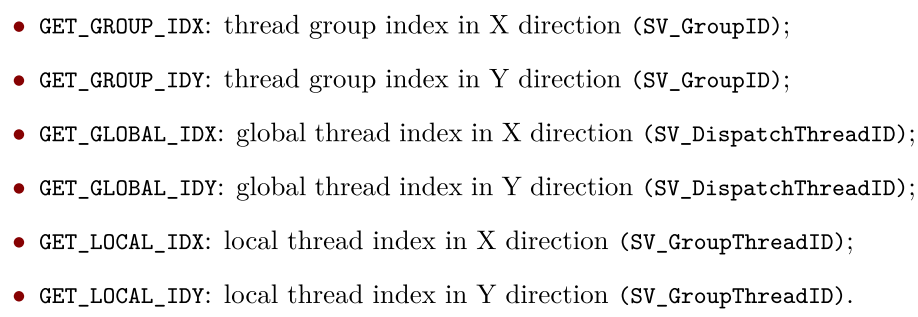

# Practical Planar Reflections Using Cubemaps and Image Proxies




## 1. 介绍

本章介绍了一种新的算法和一套艺术家工具，它允许模拟**平面光泽/镜面反射**。目标是用一种不需要重新渲染**场景几何**的、更便宜的近似方法来取代**精确但昂贵的实时平面反射**——主要用于地面反射。

该算法的原理是将**反射场景的近似值**渲染成一个**二维反射纹理**，然后在**场景渲染的过程**中使用这个纹理。为了建立近似的反射场景，我们为艺术家提供了几个工具，让他们将反射场景与离线生成的元素结合起来：环境贴图和**图像代理**`image proxies`。为了提高质量，当**反射场景中的元素**在反射纹理中被渲染时，我们会针对当前视图进行**视差校正**。为了更新视差校正，每一帧的反射纹理都要更新。


## 2. 生成反射纹理

### 立体反射环境贴图

我们的算法首先是生成一个**反射场景的近似值**。我们试图避免在运行时**重新渲染场景几何的成本**。在这种情况下，近似反射的常用技术是创建一个**环境地图**，比如`cubemap`，由于其硬件效率高，是首选的参数化。将cubemap应用到**地面等平面几何**上，会产生视觉问题，部分原因是**缺乏视差**。图形学文献中提出了几种算法来解决这个问题。所有这些算法都**需要一个几何体代理来表示反射环境**：简单的球体、箱体或立方体深度缓冲区。表面法线的反射视图向量被用来与**代理几何体**相交。从像素世界位置创建一个**反射视图向量**，然后可以用来获取**正确的cubemap样本**。成本和质量随着几何体代理的复杂性而增加。

我们注意到其他没有几何代理的**廉价视差校正方法是可用的**，但它们需要对每个物体进行手动调整。我们对视差问题的解决方案是独特的，因为我们**不使用场景的几何图形**，因为我们在渲染到二维反射纹理时，**无法访问像素的世界位置**。此外，我们将自己**限制在平面反射上**。



我们为艺术家们开发了一些工具，允许在关卡中放置`cubemaps`，并将其与**一个几何代理**联系起来：一个与反射环境相近的**凸面体**。例如，在一个长方形的房间里，艺术家可以在房间的中心放置一个`cubemap`，并定义**一个盒子体积**来接近房间的边界。盒子体积的中心不需要和cubemap的位置一致。由于我们的目标是**平面反射**，所以我们也需要为`cubemap`提供一个反射平面（上图）。**反射面**可以指定为**与cubemap位置的距离**，并由**cubemap的上轴**定向。



为了**修正视差**，我们做了如下观察（见上图）。考虑一个**有地表（哈希线）的场景**，一个由**代理几何体**（**绿色的箱体**）近似的**反射环境（黄色）**和一个摄像机。相机看着地面上的一个位置。反射的视图向量`R`被用来得到**与代理几何体的交点**`P`。然后将`P`与在**中心`C`处拍摄的`cubemap`**一起使用，以恢复**cubemap的采样方向**`D`。如果我们将**摄像机**围绕**反射面**进行反射，那么**反射的摄像机**的新视图向量`V`与之前`R`向量相匹配，并且与同一点`P`相交。从这个观察中，我们可以推断出，为了解决**视差问题**，我们可以简单地将`cubemap`投影到其**几何体代理**上，然后从**反射摄像机的视点**渲染几何体。

渲染过程类似于**标准的实时平面反射渲染**。我们通过**反射面**镜像**View矩阵**来建立**ViewProjection矩阵**，并将其与**倾斜的近剪裁面矩阵**进行组合。然后我们用这个**View-Projection矩阵**渲染**几何体代理的背面**。当我们反射相机时，我们必须反转`winding order`。清单14.1中提供了C++伪代码和着色器代码

[list 1](Pseudocode of parallax-corrected cubemap.)

```c++
// C++ pseudocode 
Matrix Mirror = CreateMirrorMatrix(ReflectionPlaneWS); 
Matrix ReflectView = Mirror * View; 
Matrix ClipProjection = NearObliqueMatrix(ReflectionPlaneVS);
Matrix ViewProjection = View * ClipProjection; 
// Render back face but remember to inverse culling order 
SetInverseFrontFaceCulling (); 
DrawConvexVolume ();

// Shader code 
float4x4 LocalToWorld; 
float4x4 ViewProjection;

VertexMain() 
{     
    float4 PositionWS = mul(LocalToWorld, InPositionOS); 
    float4 PositionSS = mul(ViewProjection, PositionWS); 
    OutPosition = PositionSS; 
    
    // Current direction sampling direction 
    OutDirection = PositionWS.xyz - CubeCenterWS.xyz;
}

PixelMain() 
{ 
    OutColor = texCUBE(CubeTexture , OutDirection);
} 
```


### 图像代理

上一节介绍了将**视差校正的cubemap**投射到**二维反射纹理**上，以接近反射的场景。这种渲染方式有其**局限性**，因为它可能会**遗漏或丢失信息**：动态元素可能会消失，2D纹理的分辨率可能太低，而作为几何体代理的凹面体会遮蔽细节。可以通过**图像代理**来增强`cubemap`对反射场景的渲染贡献。在我们的算法中加入图像代理很容易。我们使用**一个四边形**作为**代表反射场景一部分的图像几何代理**，然后我们像上一节那样**渲染四边形**。

***Creating image proxies***



**图像代理**是一个用自制图像或从场景中捕获的`quad texture`。这个四边形被用作**反射环境的几何近似值**，也就是几何代理。我们为艺术家们开发了一些工具，允许在关卡中放置图像代理，自定义**四边形的大小**，自定义**纹理的分辨率**，并进行二维场景捕捉。**二维捕捉**是通过在我们的游戏编辑器中设置的一个`orthogonal frustum`来完成的。捕捉时将空白区域（渲染过程中未被触及的像素）视为透明。

图像代理与精灵粒子非常相似，它们可以共享许多属性。我们决定采用**精灵粒子功能的一个子集**。图像代理可以 -

- 始终面对摄像机，形成一个**球形广告牌**
- 定义一个**约束轴**，并尝试面对摄像机，但沿该轴旋转，形成一个**圆柱形广告牌**。

- 使用不同的**混合模式**（插值式、加值式）。

### 渲染图像代理

**所有的图像代理都是透明的物体**（这一选择将在本节后面解释），因此在渲染前需要**从后往前排序**，因为我们没有使用Z缓冲区。我们使用**摄像机到图像代理的距离**作为**排序的标准**。为了准确渲染，特别是在图像代理重叠的情况下，我们应该对四边形进行**二进制空间分割**（`BSP`）。**渲染图像代理**类似于立方体地图的渲染。

[list 2]()

```c++
// C++ pseudocode 
Matrix Mirror = CreateMirrorMatrix(ReflectionPlaneWS); 
Matrix ReflectView = Mirror * View; 
Matrix ClipProjection = NearObliqueMatrix(ReflectionPlaneVS); 
Matrix ViewProjection = View * ClipProjection;

// Image proxy specific 
Vector ReflectViewOrigin = Mirror * ViewOrigin; 
Matrix InverseReflectView = ReflectView.Inverse(); 
Vector ViewUp = -InverseReflectView * Vector(0,1,0);

// Following is done for each IP (Image proxy) 
// Calc X and Y sprite vector based on option. 
Vector YVector = IP->LocalToWorld * Vector(0, 1, 0); 
if(IP->bCameraFacing)
{ 
    float ScaleFactor = YVector.Length(); 
    YVector = CameraUp.Normalize() * ScaleFactor;
} 

Vector CameraDirWS = (CameraWS - IP->Location).Normalize();

Vector XVector = IP->LocalToWorld * Vector(1, 0, 0); 
if(IP->bCameraFacing || IP->bCameraFacingReflectionAxis)
{ 
    float ScaleFactor = XVector.Lenght(); 
    XVector = CameraDir ˆ YVector; 
    XVector = XVector.Normalize() * ScaleFactor;
}

// Shader code 
float4x4 LocalToWorld; 
float4x4 ViewProjection; 
float3 IPPosition;

VertexMain() 
{ 
    float3 VPosition = IPPosition + InPosition.x * XVector - InPosition.y * YVector; 
    float4 PositionSS = mul(ViewProjection, float4(VPosition, 1)); 
    OutPosition = PositionSS; 
    UVOut = UV;
} 

float4 IPColor ;

PixelMain() 
{ 
    OutColor = IPColor * tex2D(SpriteTexture, InUV);
}
```

***Best practices***

图像代理是强大的工具，但它们需要艺术家的制作时间。有很多创造性的方法可以使用它们来**增强反射**，我们在这里介绍一些最佳做法




//todo


# Tiled Forward Shading


## 1. 介绍

我们将在本章中探讨`tiled forward shading`算法。`tiled forward shading`是对`tiled deferred shading`的扩展或修改。

==延迟渲染==成功地减少了照明所需的计算量，但代价是**增加了内存需求**和更高的内存带宽使用。`Tiled deferred shading`解决了后者，但**仍然需要大的G-缓冲区**。

`tiled forward shading`试图将`tiled deferred shading`的一个主要优势与**前向渲染的优势**相结合。除了减少内存需求（正向渲染不需要**大的G-buffer**），它还可以实现透明性，实现多着色方案。


## 2. 回顾

`tiled deferred shading`是通过将样本划分为**$N×N$个样本的分层`tiles`**来实现的。然后，灯光被分配给这些`tiles`。我们可以选择计算每块`tile`的**最小和最大Z边界**，这样我们就可以进一步减少影响每块`tile`的灯光数量。

`tiled deferred shading`的好处如下：

- G-buffers对于每个`lit`样本只读一次。
- **帧缓冲区**被写入一次。
- **渲染方程的`Common terms`**可以被分解并计算一次，而不是为每个光照重新计算。
- 每个`tile`中的工作都是连贯的；也就是说，`tile`中的每个样本都需要**相同的工作量**（在相同的灯光上进行迭代），这允许在**类似SIMD的架构**上有效地实现。

为了使`tiled deferred shading`有价值，**大多数灯光**必须有一个**有限的范围**。如果所有的灯光都有可能影响到所有的场景，那么**分层`tile`**显然是没有好处的。`tiled deferred shading`可以被概括为`Tiled Shading`，其中包括**延迟式和正向式**两种方式。基本的`tiled shading`算法看起来如下：

1. 将屏幕分割成`tiles`。
2. 可选：为每块`tile`找到**最小和最大的Z边界**。
3. 为每块`tiles`分配灯光。
4. 对于每个样本：处理影响当前样本`tiles`的所有灯光。

第`1`步基本上是免费的；如果我们使用常规的$N×N$ `tiles`，**细分是隐含的**。为每块`tile`找到**最小和最大的Z边界**是可选的（步骤`2`）。例如，在一个深度复杂度低的场景中，自上而下的视图可能**不允许在Z方向上对灯光进行额外的剔除**。

在`tiled deferred shading`中，步骤`4`中的样本是从**G-buffers**中获取的。在`tiled forward shading`中，样本是在光栅化过程中产生的。我们最近提出了一个对`tiled shading`的扩展，称为`clustered shading`，在性能方面可以更稳健地处理**复杂的光线和几何配置**。然而，`tiled forward shading`的实现要简单得多，而且在更广泛的硬件上工作。


## 3. Tiled Forward Shading: Why?

延迟技术的主要优势，是消除了由于**过度绘制**而导致的过度着色。然而，与正向渲染相比，大多数延迟技术都有以下弱点。
- ==透明度/混合==是很棘手的，因为**传统的G型缓冲区**只允许在缓冲区的**每个位置存储一个样本**。
- **内存存储和带宽要求**较高，而且在`MSAA`和相关技术中变得更加糟糕。

另一方面，正向渲染对透明度有很好的支持：

- 通过alpha混合
- 通过硬件功能**支持MSAA和相关技术**（所需的内存存储更少）。

此外，**前向渲染**还支持为不同的几何形状**提供不同的着色器和材质**。`tiled forward shading`的一个特殊优势是它对**GPU硬件的低要求**。在没有**计算着色器等最新硬件功能**的情况下，也可以实现`tiled forward shading`。另一方面，如果有计算着色器，我们就可以在光照分配时利用这一优势。


## 4. Basic Tiled Forward Shading

***Subdivision of screen***

我们使用常规的$N×N$像素`tiles`（例如，$N=32$）。**非常大的`tiles`**会产生更糟糕的光线分配；每个`tile`会受到更多光源的影响。创建非常小的`tiles`会使光照分配更加昂贵，并**增加所需的内存量**。

***Optional pre-Z pass***

**一个可选的pre-Z`pass`**可以在两个方面提供帮助。首先，如果我们希望在下一步骤中找到`tile`的**Z边界**，那么它就是必需的。其次，在最终的渲染过程中，它可以减少样本数量。当然，预Z通道应该只包括**不透明的几何体**。

***Optional minimum or maximum Z-bounds***

如果存在**深度缓冲区**，例如来自上述的`pre-Z pass`，我们可以使用这些信息来寻找（减少）每个`tile`在Z方向（深度）的扩展。这就产生了更小的`per-tile`边界体积，减少了在灯光分配过程中**影响`tiles`的灯光数量**。根据不同的应用，只找到最小或最大的边界就足够了。

***Light assignment***

接下来，我们必须把灯光分配给`tiles`。这需要一些选择和考虑。在`tiled shading`中，`tiles`的数量相对较少，在`CPU`上进行分配是可行的。如果**灯光的数量相对较少**（例如，几千盏），这一点尤其适用。在CPU上，一个简单的实现是为**每个光源**找到屏幕空间的**轴对齐边界框**（`AABBs`），并循环计算**AABBs的二维区域**内的所有`tiles`。如果我们已经计算出每个`tile`的**最小和最大深度**，我们需要执行一个额外的测试，来丢弃在Z方向上处于`tiles`之外的灯光。

***Rendering and shading***

最后一步是渲染所有的几何体。这个管道看起来几乎就像一个**标准的前向渲染管道**；不同的着色器和相关资源可能会被连接到**不同的几何块**上。




## 5. 支持透明度

//todo


## 6. 支持MSAA

//todo


# Forward+: A Step Toward Film-Style Shading in Real Time



## 1. 介绍

要制作出接近==CG电影风格的高质量渲染==，需要极大的灵活性，以支持**任意的数据格式和着色器**，对表面材料和特殊效果进行**更复杂的渲染**。我们的目标是找到一个能够**最好地满足这些目标的渲染管道**。我们把事情归结为几个具体的要求：

- **材料可能需要同时基于物理和非物理**。技术艺术家会希望建立**由任意复杂的材料组成的大树**。材料类型可能类似于离线渲染器中的材料，如RenderMan、Mental Ray和Maxwell Render着色系统。
- 艺术家们希望能够完全自由地将灯光的数量同时放在一个场景中。
- **渲染数据应该与底层渲染引擎脱钩**。艺术家和程序员应该能够在运行时自由地编写着色器和新材料，以实现快速的周转——**从概念到看到结果应该是快速而简单的**。

我们设计了一个渲染管道，我们相信它能很好地满足这些目标，我们把它称为==Forward+ 渲染管线==


## 2. Forward+

有三个`stages`：

- `Z prepass`。`Z prepass`是前向渲染的一个选项，但是对于Forward+来说，它对于减少**最后着色步骤的像素过绘**是至关重要的。
- `Light culling`。光线剔除是一个计算**影响一个像素的灯光列表**的阶段。
- **最终着色**。最终着色，是对前向渲染中的着色通道的扩展，对整个表面进行着色。一个必要的变化是**将灯光传递给着色器的方式**。在`Forward+`中，**场景中的任何灯光都必须可以从着色器中获取**，而不是像**传统的正向渲染**那样为每个物体绑定一些灯光子集。

### Light Culling

**光线剔除阶段**类似于延迟照明的**光线积累步骤**。光线剔除不是计算照明成分，而是计算重叠在**一个像素上的光源索引列表**。光照列表可以为每个像素计算，这对最终的着色来说是一个更好的选择。然而，**存储每个像素的灯光列表**需要占用大量的内存，并且在**灯光剔除**时需要**大量的计算**。



屏幕被分割成`tiles`，光照索引是按`tiles`计算的（上图）。因此，我们在**光索引缓冲区内存**和最终着色器效率之间做了权衡。通过利用**现代GPU**的计算能力，**光剔除可以完全在GPU上实现**。因此，整个渲染管道可以完全在`GPU`上执行。

### 渲染

**光线剔除**创建了**重叠在每个像素上的灯光列表**，而最终着色则是**通过灯光列表进行循环**，并使用描述**渲染对象表面属性**的材质参数，以及为每个灯光存储的信息，来计算材质。有了**无序访问视图**（`UAV`）的支持，**每个材质实例的信息**可以在传递给材质着色器的**线性结构化缓冲区**中存储和访问。因此，至少在理论上，完整的渲染方程可以不受限制地得到满足，因为**光照积累和渲染**同时发生在一个地方，有**完整的材质和光照信息**。

使用复杂的材质和更精确的照明模型，来提高视觉质量，**计算成本**主要由每个像素上重叠的**灯光的平均数量**乘以**材质计算的平均成本**来决定。使用这种方法，**高像素的超绘**会扼杀性能；因此，**Z预处理**对于最大限度地减少**最终着色的成本**至关重要。


## 3. 实现和优化

**一个标准的前向渲染管线**可以被转换为**Forward+渲染管线**，方法是增加**光剔除阶段**并修改现有的像素着色器，使其**实现Forward+的最终着色阶段**。对于`Z prepass`来说，**没有必要进行修改**，所以我们不描述其实现。由于当前GPU的灵活性，光照阶段可以用多种方式实现。具体来说，直接计算和**可读可写的结构数据缓冲区或UAVs**是利用`Forward+`的关键特征。


### Gather-Based Light Culling

在**光剔除过程**中，计算是按`tiles`为单位进行的。因此，为一个`tile`执行一个线程组是很自然的。一个线程组可以使用**线程组共享内存（从现在开始称为共享内存）**共享数据，这可以减少线程组中**大量的冗余计算**。每个`tiles`的计算都是相同的；因此，我们解释单个`tile`的计算。**光线剔除的计算着色器**是作为一个**二维（2D）工作组**执行的。一个线程组被分配一个**唯一的二维索引**，一个线程组中的线程被分配一个该组中唯一的二维索引。在本小节的伪代码中，以下**宏**被用于这些变量。



第一步是计算**视图空间中的`frustum of a tile`**。为了重建**四个侧面**，我们需要计算`tiles`的四个角点的**视图空间坐标**。有了这四个点和原点，就可以构造出四个侧平面。

```c++
float4 frustum [4]; 
{ 
    // construct frustum 
    float4 v[4]; 
    v[0] = projToView(8 * GET_GROUP_IDX, 8 * GET_GROUP_IDY, 1.f)); 
    v[1] = projToView(8 * (GET_GROUP_IDX + 1), 8 * GET_GROUP_IDY, 1.f)); 
    v[2] = projToView(8 * (GET_GROUP_IDX + 1), 8 * (GET_GROUP_IDY + 1), 1.f));
	v[3] = projToView(8 * GET_GROUP_IDX, 8 * (GET_GROUP_IDY + 1), 1.f)); 
    
    float4 o = make_float4(0.f, 0.f, 0.f, 0.f); 
    for(int i = 0;i < 4;i++) 
        frustum[i] = createEquation(o, v[i], v[(i + 1) & 3]);
}
```

`projToView()`是一个接收**屏幕空间像素索引**和深度值并返回**视图空间坐标**的函数。 `createEquation()`从**三个顶点位置**创建一个**平面方程**。

在这一点上，`frustum`在深度方向上有**无限的长度**；但是。我们可以通过使用`tile`中的**像素的最大和最小深度值**来剪辑`frustum`。为了获得**深度范围**，一个线程首先从**深度缓冲区**读取**指定像素的深度值**，该缓冲区是在**深度预处理**中创建的。然后，它被转换为视图空间的坐标。为了在一个组中的线程之间选择最大和最小值，我们使用**原子操作**来共享内存。

```c++
float depth = depthIn.Load(uint3(GET_GLOBAL_IDX, GET_GLOBAL_IDY, 0));

float4 viewPos = projToView(GET_GLOBAL_IDX, GET_GLOBAL_IDY, depth);

int lIdx = GET_LOCAL_IDX + GET_LOCAL_IDY * 8; 
{
    // calculate bound 
    if(lIdx == 0)// initialize 
    {
        ldsZMax = 0; 
        ldsZMin = 0 xffffffff;
    } 
    
    GroupMemoryBarrierWithGroupSync(); 
    u32 z = asuint(viewPos.z); 
    
    if( depth != 1.f ) 
    {
        AtomMax(ldsZMax, z); 
        AtomMin(ldsZMin, z);
    } 
    GroupMemoryBarrierWithGroupSync(); 
    maxZ = asfloat(ldsZMax); 
    minZ = asfloat(ldsZMin);
}
```

//todo


