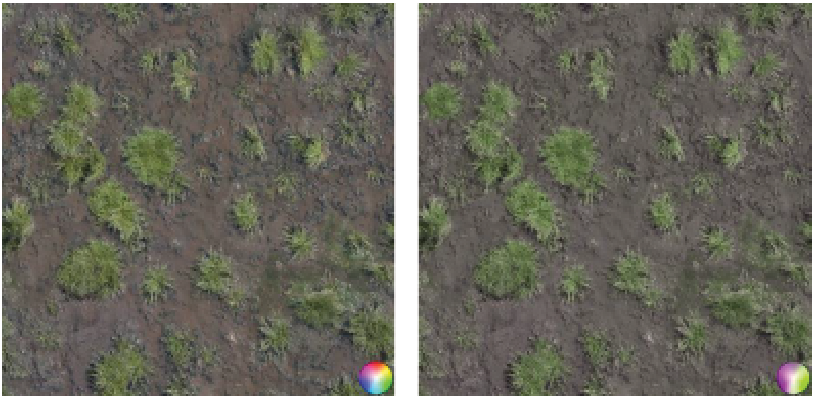

[toc]


# Rasterized Voxel-Based Dynamic Global Illumination


## 1. 介绍

**光栅化的、基于体素的动态全局照明**考虑到场景，尤其是室内，可能包含大量**不同类型的光源**（例如，点光源、聚光灯和定向灯）。同时，它在视觉上产生了良好和稳定的结果，同时保持了**较高的交互帧率**。


## 2. 前瞻

这项技术有效地利用了`DirectX 11`硬件所引入的功能，以实现上述结果。

在第一步中，通过使用硬件光栅器，为场景创建了**一个体素网格表示**。在这里，场景在**没有深度测试**的情况下被渲染到一个**小的二维渲染目标**中，但不是将结果输出到绑定的渲染目标中，而是通过使用**原子函数**将栅格化的像素写入一个**三维读写缓冲器**中。这样一来，**光栅化器就变成了一个 "体素化器"**，有效地创建了一个高度填充的场景的三维网格表示。这个体素网格包含了**几何体的漫反射和法线信息**，随后被用来**生成间接光照**和测试几何体遮挡的情况。由于**每一帧都会重新创建体素网格**，因此所提出的技术是完全动态的，**不依赖任何预计算**。

在第二步，**网格内的体素**被每个光源照亮。然后，照明被转换为**虚拟点光源**（`VPLs`），以**二阶球面谐波系数**的形式存储。图形硬件通过使用**内置的混合阶段**再次得到利用，以便将**每个光源的结果**结合起来。随后，**生成的VPLs**在网格内传播，以产生间接照明。与[Kaplanyan和Dachsbacher 10]提出的`light propagation volume`（LPV）技术相比，既不需要为每个光源创建**反射阴影图**，也不需要事后将**VPLs**注入网格中。


## 3. 实现

这个技术主要可分为五个步骤。

### 创建场景的体素网格表示

我们首先需要定义**立体体素网格的属性**，即它的`extents`、位置和**视图/投影矩阵**。网格与观察者的摄像机**同步移动**，并与**网格单元的边界**永久绑定，以**避免**由于场景的离散体素网格表示而**出现闪烁**。为了正确地将我们的场景映射到体素网格，我们需要使用==正投影==；因此，我们将使用**三个视图矩阵**来获得**更高的场景覆盖率**：一个矩阵用于从后到前的视图，一个矩阵用于从右到左的视图，还有一个用于从上到下的视图。所有其他的计算将完全在`GPU`上完成。

接下来我们渲染**位于网格边界内的场景几何图形**，禁用颜色写入，不进行深度测试，将其渲染到**一个小型的2D渲染目标**中。我们将使用一个$32×32×32$ 的网格；为此，完全可以使用一个$64×64$像素的渲染目标，并使用**最小的可用像素格式**，因为无论如何我们都会将结果输出到一个**读写缓冲区**。基本上，我们通过**顶点着色器**将三角形顶点传递给**几何着色器**。在几何着色器中，我们选择了**三角形最明显的视图矩阵**，以便为基元实现最高数量的光栅化像素。此外，**归一化设备坐标中的三角形大小**被当前绑定的渲染目标的`texel`大小所增加。这样一来，由于当前绑定的渲染目标的分辨率较低而被丢弃的像素仍然会被栅格化。**栅格化的像素**被原子化地写入像素着色器中的**3D读写结构缓冲区**。这样一来，就不需要在几何着色器中**放大几何图形**，以获得场景的**高填充三维网格表示**。

[list 1](Generation of the voxel grid)

```c++
// vertex shader
VS_OUTPUT main(VS_INPUT input) 
{
    VS_OUTPUT output; 
    output.position = float4(input.position, 1.0f); 
    output.texCoords = input.texCoords; 
    output.normal = input.normal; 
    return output;
} 

// geometry shader
static float3 viewDirections[3] = {
    float3(0.0f, 0.0f, -1.0f), // back to front 
    float3(-1.0f, 0.0f, 0.0f), // right to left 
    float3(0.0f, -1.0f, 0.0f) // top to down
};

int GetViewIndex(in float3 normal) 
{
    float3x3 directionMatrix; 
    directionMatrix[0] = -viewDirections[0]; 
    directionMatrix[1] = -viewDirections[1]; 
    directionMatrix[2] = -viewDirections[2]; 
    
    float3 dotProducts = abs(mul(directionMatrix, normal)); 
    float maximum = max(max(dotProducts.x, dotProducts.y), dotProducts.z); 
    
    int index; 
    if(maximum == dotProducts.x) 
        index = 0;
    else if(maximum == dotProducts.y) 
        index = 1;
    else 
        index = 2;
    return index; 
}

[maxvertexcount(3)] 
void main(triangle VS_OUTPUT input[3], inout TriangleStream<GS_OUTPUT> outputStream)
{
    float3 faceNormal = normalize(input[0].normal + input[1].normal+ input[2].normal);
    
    // Get view , at which the current triangle is most visible , in order to 
    // achieve highest possible rasterization of the primitive. 
    int viewIndex = GetViewIndex(faceNormal);
    
    GS_OUTPUT output[3]; 
    [unroll] 
    for(int i = 0;i < 3; i++) 
    {
        output[i].position = mul(constBuffer.gridViewProjMatrices[viewIndex], 
                                 input[i].position);
        output[i].positionWS = input[i].position.xyz; // world -space position 
        output[i].texCoords = input[i].texCoords; 
        output[i].normal = input[i].normal;
    }
    
    // Increase size of triangle in normalized device coordinates by the 
    // texel size of the currently bound render -target. 
    float2 side0N = normalize(output[1].position.xy - output[0].position.xy); 
    float2 side1N = normalize(output[2].position.xy - output[1].position.xy); 
    float2 side2N = normalize(output[0].position.xy - output[2].position.xy); 
    float texelSize = 1.0f / 64.0f; 
    output[0].position.xy += normalize(-side0N + side2N) * texelSize; 
    output[1].position.xy += normalize(side0N - side1N) * texelSize; 
    output[2].position.xy += normalize(side1N - side2N) * texelSize;
    
    [unroll]
     for(int j = 0;j < 3; j++) 
     	outputStream.Append(output[j]);
    
     outputStream.RestartStrip();
}

// pixel shader 
struct VOXEL {
    uint colorMask; // encoded color 
    uint4 normalMasks; // encoded normals 
    uint occlusion; // voxel only contains geometry info if occlusion > 0
}; 

RWStructuredBuffer<VOXEL> gridBuffer : register(u1);

// normalized directions of four faces of a tetrahedron 
static float3 faceVectors[4] = 
{
    float3(0.0f, -0.57735026f , 0.81649661f), 
    float3(0.0f, -0.57735026f , -0.81649661f), 
    float3(-0.81649661f, 0.57735026f, 0.0f), 
    float3(0.81649661f, 0.57735026f, 0.0f)
};

int GetNormalIndex(in float3 normal, out float dotProduct) 
{
    float4x3 faceMatrix; 
    faceMatrix[0] = faceVectors[0]; 
    faceMatrix[1] = faceVectors[1]; 
    faceMatrix[2] = faceVectors[2]; 
    faceMatrix[3] = faceVectors[3]; 
    float4 dotProducts = mul(faceMatrix, normal); 
    float maximum = max(max(dotProducts.x, dotProducts.y), max(dotProducts.z, dotProducts.w));
    
    int index; 
    if(maximum == dotProducts.x) 
        index = 0;
    else if(maximum == dotProducts.y) 
        index = 1;
    else if(maximum == dotProducts.z) 
        index = 2;
    else 
        index = 3;
    
    dotProduct = dotProducts[index]; 
    return index;
}

void main(GS_OUTPUT input) {
    float3 base = colorMap.Sample(colorMapSampler, input.texCoords).rgb;
    
    // Encode color into the lower 24 bit of an unsigned integer , using 
    // 8 bit for each color channel. 
    uint colorMask = EncodeColor(base.rgb);
    
    // Calculate color -channel contrast of color and write value into the 
    // highest 8 bit of the color mask. 
    float contrast = length(base.rrg - base.gbb)/ (sqrt(2.0f) + base.r + base.g + base.b);
    int iContrast = int(contrast * 255.0f); 
    colorMask |= iContrast << 24;
    
    // Encode normal into the lower 27 bit of an unsigned integer , using 
    // for each axis 8 bit for the value and 1 bit for the sign. 
    float3 normal = normalize(input.normal); 
    uint normalMask = EncodeNormal(normal.xyz);
    
    // Calculate to which face of a tetrahedron current normal is closest 
    // and write corresponding dot product into the highest 5 bit of the 
    // normal mask. 
    float dotProduct; 
    int normalIndex = GetNormalIndex(normal, dotProduct); 
    int iDotProduct = int(saturate(dotProduct) * 31.0f); 
    normalMask |= iDotProduct << 27;
    
    // Get offset into voxel grid. 
    float3 offset = (input.positionWS - constBuffer.snappedGridCenter) * constBuffer.invGridCellSize;
    offset = round(offset);
    
    // Get position in voxel grid. 
    int3 voxelPos = int3(16 ,16 ,16) + int3(offset);
    
    // Only output voxels that are inside the boundaries of the grid. 
    if((voxelPos.x > -1) && (voxelPos.x < 32) && (voxelPos.y > -1) 
       && (voxelPos.y < 32) && (voxelPos.z > -1) && (voxelPos.z < 32))
    {
        // Get index into voxel grid. 
        int gridIndex = (voxelPos.z * 1024) + (voxelPos.y * 32) + voxelPos.x;
        
        // Output color. 
        InterlockedMax(gridBuffer[gridIndex].colorMask, colorMask);
        
        // Output normal according to normal index. 
        InterlockedMax(gridBuffer[gridIndex].normalMasks[normalIndex], normalMask);
        
        // Mark voxel that contains geometry information.
        InterlockedMax(gridBuffer[gridIndex].occlusion, 1);
    }
}
```

由于体素是**实际场景的简化表示**，详细的几何信息会丢失。为了在最终的全局照明输出中放大`color bleeding`，在其颜色通道中**具有高差异的颜色**（"对比度"）是首选。通过将对比度值写入**整数颜色掩码的最高8位**，具有最高对比度的颜色将**自动占主导地位**，因为我们用`InterlockedMax()`将结果写入**体素网格**中。由于，例如，**薄的几何体**在一个单一的体素中可以有**相反的法线**，所以不仅是颜色，而且法线也必须被仔细地写入体素中。因此，要确定当前法线与四面体的哪个面最接近。通过将**相应的点积**写入**整数法线掩码的最高5位**，自动选择离每个四面体面最近的法线，因为我们再次用`InterlockedMax()`写入结果。根据检索到的四面体面，法线被写入**体素的相应法线通道**中。之后，当体素被照亮时，会选择**离光矢量最近的法线**，这样就可以获得最佳的照明效果。


由于所有的操作都是使用一个**非常小的渲染目标**（$64×64$像素）进行的，所以这个**生成步骤的速度**快得令人吃惊。上图显示了一张截图，其中**Sponza场景的体素网格表示**被可视化了。为了覆盖整个场景，我们使用了**两个嵌套的体素网格**：一个细分辨率网格用于**靠近观察者的区域**，一个粗分辨率网格用于**远处的区域**。


### 在体素空间创建VPLs

在这一步，我们完全从**先前生成的体素网格**中创建`VPLs`。对于位于**网格边界内的每个光源**，我们渲染一个$32×32$像素的**小四边形**。通过使用硬件实例化，对于每个四边形，我们能够通过**一次绘图调用**来渲染**32个实例**。在通过**顶点着色器**传递顶点后，**几何着色器**将在当前绑定的**2D纹理数组**中选择相应的渲染目标片断。然后，像素着色器将**根据当前光源的类型**，照亮所有包含几何信息的体素。最后，**被照亮的体素**被转换为**VPLs的二阶球面谐波表示**。通过使用**加法硬件混合**，所有光源的结果被自动合并。

[list 2](VPL creation)

```c++
// vertex shader

VS_OUTPUT main(VS_INPUT input, uint instanceID : SV_InstanceID) 
{
    VS_OUTPUT output; 
    output.position = float4(input.position, 1.0f); 
    output.instanceID = instanceID; 
    return output ;
} 

// geometry shader 

struct GS_OUTPUT {
    float4 position : SV_POSITION; 
    uint rtIndex : SV_RenderTargetArrayIndex;
};

[maxvertexcount (4)] 
void main(line VS_OUTPUT input[2], inout TriangleStream<GS_OUTPUT> outputStream)
{
    // Generate a quad from two corner vertices. 
    GS_OUTPUT output[4];
    
    // lower -left vertex 
    output [0].position = float4(input[0].position.x, input[0].position.y, input[0].position.z, 1.0f);
    
    // lower -right vertex
    output[1].position = float4(input[1].position.x, input[0].position.y, input[0].position.z, 1.0f);
    
    // upper -left vertex 
    output[2].position = float4(input[0].position.x, input[1].position.y, input[0].position.z, 1.0f);

    // upper -right vertex 
    output[3].position = float4(input[1].position.x, input[1].position.y, input[0].position.z, 1.0f);
    
    // By using hardware instancing , the geometry shader will be invoked 32 
    // times with the corresponding instance ID. For each invocation the 
    // instance ID is used to determine into which slice of a 2D texture 
    // array the current quad should be rasterized. 
    [unroll] 
    for(int i = 0;i < 4; i++) 
    {
        output[i].rtIndex = input[0].instanceID; 
        outputStream.Append(output[i]); 
    } 
    
    outputStream.RestartStrip();
}

// pixel shader 
StructuredBuffer<VOXEL> gridBuffer : register(t0);

struct FS_OUTPUT 
{
    float4 fragColor0 : SV_TARGET0; // red SH -coefficients 
    float4 fragColor1 : SV_TARGET1; // blue SH -coefficients 
    float4 fragColor2 : SV_TARGET2; // green SH -coefficients
}; 

// Calculate second -order SH -coefficients for clamped cosine lobe function. 
float4 ClampedCosineSHCoeffs(in float3 dir) 
{
    float4 coeffs; 
    coeffs.x = PI / (2.0f * sqrt(PI)); 
    coeffs.y = -((2.0f * PI) / 3.0f) * sqrt(3.0f / (4.0f * PI)); 
    coeffs.z = ((2.0f * PI ) / 3.0f) * sqrt (3.0f / (4.0f * PI)); 
    coeffs.w = -((2.0f * PI)/3.0f) * sqrt (3.0f / (4.0f * PI)); 
    coeffs.wyz *= dir;
    return coeffs;
} 

// Determine which of the four specified normals is closest to the 
// specified direction. The function returns the closest normal and as 
// output parameter the corresponding dot product. 
float3 GetClosestNormal(in uint4 normalMasks, in float3 direction, out float dotProduct)
{
    float4x3 normalMatrix; 
    normalMatrix[0] = DecodeNormal(normalMasks.x); 
    normalMatrix[1] = DecodeNormal(normalMasks.y);
    normalMatrix[2] = DecodeNormal(normalMasks.z); 
    normalMatrix[3] = DecodeNormal(normalMasks.w); 
    float4 dotProducts = mul(normalMatrix, direction);
    
    float maximum = max(max(dotProducts.x, dotProducts.y), max(dotProducts.z, dotProducts.w));

    int index; 
    if(maximum == dotProducts.x) index = 0;
    else if(maximum == dotProducts.y) index = 1;
    else if(maximum == dotProducts.z) index = 2;
    else index = 3;
    
    dotProduct = dotProducts[index]; 
    return normalMatrix[index];
}


PS_OUTPUT main(GS_OUTPUT input) 
{
    PS_OUTPUT output;
    
    // Get index of current voxel. 
    int3 voxelPos = int3(input.position.xy, input.rtIndex); 
    int gridIndex = (voxelPos.z * 1024) + (voxelPos.y * 32) + voxelPos.x;
    
    // Get voxel data and early out , if voxel has no geometry information. 
    VOXEL voxel = gridBuffer[gridIndex]; 
    if(voxel.occlusion == 0) 
        discard;
    
    // Get world -space position of voxel. 
    int3 offset = samplePos - int3(16, 16, 16); 
    float3 position = (float3(offset) * constBuffer.gridCellSize) + constBuffer.snappedGridCenter;
    
    
    // Decode color of voxel. 
    float3 albedo = DecodeColor(voxel.colorMask);
    
    // Get normal of voxel that is closest to the light direction. 
    float nDotL; 
    float3 normal = GetClosestNormal(voxel.normalMasks, lightVecN, nDotL);
    
    // Calculate diffuse lighting according to current light type.
    float3 diffuse = CalcDiffuseLighting(albedo, nDotL);
    
#ifdef USE_SHADOWS
    
    // Calculate shadow term according to current light type with the help 
    // of a shadow map. 
    float shadowTerm = ComputeShadowTerm(position); 
    diffuse *= shadowTerm;
#endif
    
    // Calculate clamped cosine lobe SH -coefficients for VPL. 
    float4 coeffs = ClampedCosineSHCoeffs(normal);
    
    // Output SH -coefficients for each color channel. 
    output.fragColor0 = coeffs * diffues.r; 
    output.fragColor1 = coeffs * diffuse.g; 
    output.fragColor2 = coeffs * diffuse.b;
    return output;
}
```

为了输出**三个颜色通道的二阶SH系数**，我们渲染成三个二维纹理数组，精度为半浮点。由于所有的计算都是在**体素空间**中完成的，并且仅限于体素，而体素实际上包含了几何信息，所以这种技术在各种不同类型的光源数量不断增加的情况下可以很好地扩展。在许多情况下，我们甚至可以放弃使用**点光源和聚光灯的阴影贴图**，而不会对最终的渲染输出产生明显的影响。然而，对于大型的点光源、聚光灯和定向灯，我们确实需要使用**阴影贴图**来避免漏光。在这里，我们可以简单地重复使用在**直接照明步骤中已经创建的阴影贴图**。


### Propagate VPLs

//todo


### Apply Indirect Lighting

//todo


## 4. 结果


# Reducing Texture Memory Usage by 2-Channel Color Encoding


## 1. 介绍

**单一材料的纹理**往往没有表现出很大的色彩变化，只包含**有限的色调范围**，而使用材料表面内的高光和暗光（如阴影）区域所产生的全部亮度范围。这里介绍的方法旨在将**任何给定的纹理**编码为两个通道：一个通道保留**完整的亮度信息**，另一个通道专门用于**色调/饱和度编码**。


## 2. 纹理压缩算法


上图展示了著名的**RGB色彩空间**，它被描绘成一个**单位立方体**。每个源`texel`的颜色对应于这个立方体中的一个点。用**两个通道**来逼近这个空间，实际上意味着我们必须在这个单位立方体中找到**一个嵌入的表面**（二维流形），它尽可能地接近**源纹理的`texels`集**。为了简化解码算法，我们可以使用一个**简单的平面**，或者严格地说，**一个平面与RGB单元立方体的交点**（上图右）。因为我们已经决定，**亮度信息**应该在一个单独的通道中进行**无损编码**，彩色平面应该通过**RGB空间的零亮度原点**（黑色）。因此，==双通道压缩的简化色彩空间是由一个单一的三维向量——平面法线定义的==。


### 颜色平面估计

**拟合一个平面**来近似一组三维点是一项常见的任务，存在各种算法。为了找到**颜色简化的最佳平面**，我们必须采取以下准备步骤。

首先，我们必须记住，**大多数图像文件格式**中的RGB像素颜色值并**不代表线性基色贡献**。为了本算法的目的，我们要在**线性RGB色彩空间**中操作。大多数常见的文件格式都提供**sRGB空间的数值**。虽然内部比较复杂，但这种表示方法可以用**伽马校正**（`2.2`）来转换到**线性空间**。严格来说，我们将在伽马值为`1.1`的RGB空间中操作。虽然这种轻微的非线性对**估计和编码**只有很小的影响，但在解码后转换回**sRGB空间**时，必须使用**相同的简化伽马值**`2`，以避免亮度水平的变化。

在将颜色值转换为**线性RGB空间**后，我们必须记住的另一件事是，**色相感知是RGB成分之间关系的结果，而不是线性的**。为了尽可能正确地匹配色调，我们最好使用**感知上的线性色彩空间**。然而，这将导致**更昂贵的解码阶段**，因此我们将限制自己使用**线性RGB颜色空间**，接受**潜在的轻微色调错误**。尽管如此，为了尽量减少**不在感知上正确的线性RGB空间中操作**的影响，我们可以在**估计平面**之前对空间应用**非均匀缩放**。这将影响**整个RGB通道的误差分布**，允许一些色调，以**牺牲其他色调**为代价，被更紧密地表现出来。这种非均匀缩放的结果是，随着RGB成分的缩小，它们对颜色平面的影响也会缩小，因为沿着缩小的轴线的距离会缩短。由于**色调感知的非线性**，为所有潜在的纹理**一次性定义缩放系数并不容易**，在我们的测试中，它们是根据**样本纹理集**实验性地设置的。首先，我们尝试了**在亮度计算中使用的RGB分量权重**（把最重要的放在`G`上，几乎没有放在`B`上），但实验表明，当用**更平衡的权重**进行估计时，一些材料的纹理得到了更好的体现。为了对各种纹理取得可接受的结果，我们使用了实验中选择的权重集，即红色为$1/2$，绿色为$1$，蓝色为$1/4$。

通过上述两个操作，整个**初始像素颜色处理**可以表示为：


考虑到上述因素，每个`texel`的颜色代表三维空间中的一个点。**最佳的近似颜色平面**将是使该平面与每个点之间的**平方距离之和最小的平面**。因为该平面被假设为经过点$(0,0,0)$，我们可以用**它的法线**来表示。实际上，**点-平面距离**的计算简化为**点积**。注意，由于我们使用的是RGB空间，矢量分量被标记为`r`、`g`和`b`，而不是通常的x、y和z。


**最佳平面法线矢量**是指最小化**点--平面距离**的矢量。 这类问题可以用**最小平方拟合方法**来解决，该方法旨在最小化平方距离之和。我们想要**最小化的近似误差**表示为：


经过**简单的变换**后，变成了：


对于最小化的实现，我们可以使用上述方程来计算**六个部分的和**。然后，我们可以使用**蛮力方法**来测试一组**预定义的潜在法线矢量**，以找到**总近似误差最小的那一个**。因为每次测试都是在**线性时间**内进行的，只需要花费几次乘法和加法，所以这种方法的速度还是可以接受的。

找到最佳颜色平面后的**最后一步**是恢复由颜色分量引起的**颜色空间失真**。因为平面法线是一个表面法线向量，法线的非统一空间缩放的通常规则适用，我们必须用**法线**乘以要使用的**矩阵的反转置**。虽然转置并不影响缩放矩阵，但**矩阵的反转**却影响了缩放，最后的缩放操作是使用非互换权重。


由于所有后续的计算通常都是在**线性RGB空间**中完成的，因此我们不必转换为**sRGB**。


### 计算基颜色

**编码和解码过程的重要参数是两种基色**。切过**RGB单位立方体**的颜色平面形成一个**三角形或四边形**，其中一个角位于点$(0,0,0)$。这个形状中与点$(0,0,0)$**相邻的两个角**被定义为**平面色彩空间的基色**，如下图所示。平面上**所有其他可用的颜色**都位于点$(0,0,0)$和**两个基色点**所形成的角度内。因为**颜色平面**从$(0,0,0)$开始并进入单位立方体，所以**基色点**总是位于**单位立方体的轮廓**上，从点$(0,0,0)$看去。为了找到基色，我们可以简单地计算**与剪影边缘的平面交点**，从而得到所需的一对点。我们必须记住，平面可以划过剪影顶点，甚至嵌入一对剪影边缘。因此，为了计算这些点，我们可以使用一种算法，围绕剪影行走，计算剪影穿过平面的两个点。

现在的关键观察是，我们可以把==色相值==表示为**与跨越平面的向量的角度**，使用两个基色之间的线性插值。为了计算出最终的颜色，我们只需要**调整亮度**，并进行任何所需的最终色彩空间转换。


### 亮度编码

**被编码的颜色的亮度**被直接存储。在颜色被转换到**线性RGB空间**后，我们可以使用一个经典的方程式来获得从sRGB到XYZ颜色空间转换中得出的**感知亮度值**：


由于亮度感知不是线性的，我们使用**2的伽玛值**来存储亮度。这与标准的伽马值`2.2`很接近，代价是高光部分的质量会明显下降。另外，伽马值为`2`意味着：亮度在编码时可以简单地计算其平方根，而在解码时将简单地进行平方。


### Hue计算和编码


为了对**颜色的色调**进行编码，我们必须在近似平面上找到**最接近的合适的颜色**，然后找到**混合基色的比例**以获得适当的色调。上图展示了色相编码过程，可以概述如下。

1. 将**线性RGB空间中的颜色点**投影到颜色平面上。
2. 计算平面上该点的**二维坐标**。
3. 在平面上找到一条通过(0,0,0)和该点的**二维线**。
4. 找出该线与**基色点之间的二维线**的交叉比例，即确定**基色的混合系数**。

第一步是一个**简单的几何运算**。从第二步开始。我们必须对**嵌入平面内的二维坐标**进行几何运算。有了两个基色点`A`和`B`，我们可以计算平面的二维坐标为


然后用**点乘法**计算平面内任何一点的二维坐标。


由于原点和投射到平面上的点都有**相同的二维坐标**，我们可以**完全跳过上述算法中的第1步**。当考虑到嵌入在颜色平面内的点时，**计算色调的基色混合系数的问题**现在被简化为两条线的交叉问题：一条连接两个基色点的线和一条通过原点和被编码平面上的点的线。这给了我们以下的线-线相交方程：


解决这个线性方程的`t`，我们就得到了结果。然后，**这个混合系数**被简单地直接存储在**第二通道**中，完成了**双通道的编码过程**。


## 3. 解码算法

解码算法很简单，见下列清单。首先，基色`bc1`和`bc2`作为**常量数据**被传递，并与来自**第二通道数据的混合因子**混合，从而得到一个具有所需色调的颜色，但亮度不对。这个亮度被计算为`color_lum`。接下来，我们计算出所需的亮度`target_lum`，作为第一通道数据的平方值（因为我们用伽马`2`存储了亮度）。由于得到的颜色处于线性色彩空间，我们可以通过**简单地用当前亮度除以所需亮度，然后乘以颜色来调整亮度**。如果需要，我们当然可以将计算出来的颜色转换为非线性色彩空间，以达到演示的目的。

[list 1]()

```c++
float3 texture_decode(float2 data, float3 bc1, float3 bc2) 
{
    float3 color = lerp(bc1, bc2, data.y); 
    float color_lum = dot(color, float3 (0.2126, 0.7152, 0.0722)); 
    float target_lum = data.x * data.x;
    
    color *= target_lum / color_lum; 
    return color;
}
```


## 4. 编码图像质量




# Particle-Based Simulation of Material Aging


## 1. 介绍

==老化的外观==，是游戏和电影制作中内容艺术家的一项日常任务。非常需要可交互引导的自动模拟，以支持由**交互物体引起的老化效果**的合理性，例如，铁锈的滴落。本章描述了GPU辅助的材料老化模拟，它是基于**可定制的老化规则**和通过颗粒的**材质传输**。


## 2. 前瞻

我们对**风化效应的模拟**是基于**材料运输粒子**——所谓的==伽马子==`gammatons`。伽马子从**云或屋顶排水沟等源头**发射出来，以滴落和分布材料`drip and distribute material`。在撞击时，材料沉积或流走，而伽马射线要么**反弹**，要么**漂浮**，要么被**吸收**（见下图）。最终，静止的材料会受到**老化规则**的影响，例如，将金属变成铁锈，或使地衣生长扩散。为此，静止的材料被储存在一个**纹理图集**中，我们称之为**材质图集**。


下图说明了**模拟管道**。粒子运动和碰撞检测在`CUD`A中完成，使用`Nvidia`的光线追踪引擎`OptiX`。因此，在模拟步骤中，调用一个**CUDA内核**，它**发射并追踪伽马子**。在接下来的两个阶段，即表面更新和伽马子更新，材料在**伽马子和被击中的表面**之间转移。这发生在两个连续的步骤中：一个栅格化`pass`将材料放入**材料图集**，一个转换反馈`pass`更新**伽马子的材料**。此外，我们通过**俄罗斯轮盘赌**确定伽马特的**后续行为**（例如，漂浮、反弹或吸收），并为下一次迭代指定其**速度**。

在接下来的阶段，即老化过程中，**应用老化规则**，例如，在有水和金属的情况下生锈。为了选择规则集，我们使用**动态着色器链接**。基于存储在材料图集中的材料，我们在**合成阶段**为老化的颜色、光泽度、表面法线和高度编制**纹理图**。这些贴图可以用于预览渲染，也可以导出，例如，用于游戏引擎或DCC工具的外部使用。


## 3. 模拟

### 材质图集

为了使风化操作**与场景的复杂性脱钩**，我们将所有**与模拟有关的材料**、表面和归一化数据保存在**一个纹理图集**中，我们将其称为**材料图集**，如下图所描述。因此，由伽马子携带的，或停留在表面上的**材质数量**——后者被存储在图集的`texels`中——可以分配给`8`个可用的槽。在我们的例子中，只需要为水、泥土、金属、木材、有机物、铁锈和石头提供`7`个插槽。


总而言之，材质图集包含：颜色+光泽度（`RGBA8`）、几何法线和切线（`2×RGB16F`）、着色法线（`RGB16F`）、原始高度和当前高度（`2×R16F`）、八个材质量（`2×RGBA8`的ping-pong）、八个原始材质量（`2×RGBA8`），以及一个**纹理与世界的比例**（`RG16F`），用于同等大小的泼溅`splatting`。因此，表面点和**各自的图集坐标**之间的**一对一关系**需要一个参数化，我们使用**标准的DCC工具**半自动地获得这个参数。


### 伽马传输——模拟步骤

为了达到交互式帧率，我们每帧只计算**固定数量的模拟步骤**。**伽马子存储数据**如清单 `1` 所示，包括伽马子在光线追踪过程中携带的`payload`（prd = `payload record` 记录数据传入 **CUDA 内核**），以及单独存储在 OptiX 端（位置）或与 D3D 共享的**持久性数据**（击中的**图集纹理坐标、材料**等）。

[list 1]()

```c++
// Information a gammaton carries during tracing 
struct GammaPayload {
    uint ray_index; // index in the hit buffers 
    uint ray_depth; // number of ray indirections 
    float speed;    // speed (multiplied with direction)
};

// Hit buffer data that is used by OptiX only. 
struct GammaHitOptix {
    float3 position; // position of the gammaton 
};

// Hit buffer data that is shared between DirectX and OptiX 
struct GammaHitShared {
    float3 velocity; // velocity vector 
    int flags;		// midair (yes/no), active (yes/no)
    float2 texcoord; // atlas coord at last hit surface 
    uint2 carriedMaterial; // 8 bytes = 8 material slots 
    int randomSeed;// seed for random number generation
};
```

***Recursive ray tracing***

**启动伽马射线的CUDA入口程序**如清单`2`所示，其工作原理如下。如果一个伽马子处于**活动状态**，即它目前**在半空中或因碰撞而得到一个新的方向**，我们就从它最后的已知位置继续追踪。否则，一个伽马特**不活跃**，即它**离开了模拟域**，在一个几乎水平的表面上停了下来，或者被吸收了。在这种情况下，一个新的伽马子就会被发射出来。这个输入程序依次对**每个伽马射线源**执行，使用**可定制的发射参数**，如位置、方向、速度和分布。为了对所有伽马特子进行**后续的并行处理**，我们为每个源分配一个共享伽马特流的**专属内存范围**。因此，我们为每个源设置一个开始偏移量`g_SourceRayIndexOffset`，如下图所示。**伽马特轨迹**被追踪为一系列**递归的线性步骤**，每个步骤都报告**命中或错过**。


在 OptiX 中，为**相应的事件**调用内核，如列表`3`和`4`所示。在每一步中，我们根据行进的距离来**增加重力**，从而形成**抛物线轨迹**。对于**漂浮的粒子**，重力是**切向作用的**。我们在每次迭代中追踪固定数量的线性步数，直到有一个表面被击中，伽玛顿离开域，或者达到最大递归深度。在后一种情况下，我们将伽玛子标记为`midair`（`flag`）。

[list 2]()

```c++
void gammaton_entry_program() 
{
    // initialize payload 
    Ray ray; GammaPayload prd; 
    prd.ray_index = launch_index + g_SourceRayIndexOffset; 
    prd.ray_depth = 0; // counts recursions
    
    // get gammaton data (ping pong) 
    GammaHitShared& hitshared_i = HitShared_In[prd.ray_index]; 
    GammaHitShared& hitshared_o = HitShared_Out[prd.ray_index];
    
    // if gammaton is alive , continue the ray 
    if (IS_ALIVE(hitshared_i.flags)) 
    {
        // continue from last position 
        ray.origin = HitOptix[prd.ray_index].position; 
        ray.direction = normalize(hitshared_i.velocity); 
        prd.speed = length(hitshared_i.velocity); 
        hitshared_o.carriedMaterial = hitshared_i.carriedMaterial;
    } 
    else // else emit a new ray 
    {
        ray.origin = generateRandomPosition();
        ray.direction = generateRandomDirection();
        prd.speed = g_InitialVelocity; 
        hitshared_o.carriedMaterial = g_StartMaterial;
    } 

    SET_ALIVE(hitshared_o.flags); // set alive 
    SET_BOUNCE(hitshared_o.flags); // flying freely 
    hitshared_o.randomSeed = hitshared_i.randomSeed; // pass seed 
    float maxDist = prd.speed * g_IntegrationStepSize; 
    optixTraceGammaton(ray, prd, maxDist); // launch ray 
}
```

[list 3]()

```c++
void gammaton_closest_hit() 
{
    GammaHitShared& hitshared = HitShared_Out[prd.ray_index];
    float3 v = ray.direction * prd.speed; // velocity 
    float3 phit = ray.origin + t_hit * ray.direction: 
    float3 pnew = phit + attr_normal * EPSILON; // move up
    
    // pick up velocity by fallen distance 
    float s = length(pnew - ray.origin); 
    float dt = s / prd.speed; // time = distance / speed 
    v += dt * gravity;
    
    if (isTooSlow(v)) // too slow?
        SET_DEAD(hitshared.flags);  // set inactive 
    SET_HIT(hitshared.flags);		// we hit a surface
    
    hitshared.texcoord = attr_texcoord; 
    hitshared.velocity = normalize(v) * prd.speed;
    
    // Remember position until next launch 
    GammaHitOptix& gammaState = GammaHitOptixMap[prd.ray_index]; 
    gammaState.position = pnew;
    
    // plant with probability (explained later). 
    plantletPlacement(hitshared.randomSeed, pnew, attr_texcoord);
}
```

> OptiX/CUDA gammmaton closest hit program. Attributes, e.g., attr_normal and attr_texcoord, are passed by the intersection test program.

[list 4]()

```c++
void gammaton_miss () {
    // compute position of gammaton 
    float dt = g_IntegrationStepSize; 
    float3 vold = ray.direction * prd.speed;
    
    float3 pnew = ray.origin + dt * vold; 
    float3 vnew = vold + dt * gravity;
    
    GammaHitShared& hitshared = HitShared_Out[prd.ray_index];
    
    if (leftDomain(pnew)) { // if outside bounding box 
        SET_DEAD(hitshared.flags); 
        return;
    }
    
    // Floating particle moved over edge 
    if (IS_FLOAT(hitshared.flags)) 
    { // float 
        vnew = make_float3 (0,0,0);  // let gammaton fall
    	SET_BOUNCE(hitshared.flags); // free fall
	}

    // gammaton still alive after maximum depth 
    prd.ray_depth ++; 
    if (prd.ray_depth >= MAX__GAMMATON__DEPTH) 
    { 
        HitOptix[prd.ray_index].position = pnew; 
        hitshared.velocity = vnew; 
        SET_ALIVE(hitshared.flags); 
        SET_MIDAIR(hitshared.flags); 
        return;
    } 
    
	prd.speed = length(vnew); 
    Ray ray(pnew, normalize(vnew)); 
    float maxDist = dt * prd.speed; 
    optixTraceGammaton(ray, prd, maxDist); // launch ray
}
```

***Numerical considerations of floating particles***

我们对**伽马的位置**应用了一个**数字偏移** $ϵ$，以**避免**在发射位置出现**自我交叉**。由于**浮动粒子**沿切线向表面移动，它实际上是**在表面上方盘旋**。为了在下一次迭代中产生相交，我们**让射线瞄准表面**，将射线方向沿着被**否定的法线**拉动`h`的量（见下图`1`）。如果发生了反弹事件或者在悬空处没有发现交叉点，我们就让伽马坠子落下来。在撞击时，所产生的速度通常**只起切向作用**，但为了进一步**加快物质的分布**，我们允许艺术家改变撞击粒子的能量损失。为了近似于摩擦，**弹跳的和漂浮的伽马子**都被一个特定的速度减慢了


***Determining transfer rates***

**拾取的材料数量**首先取决于材料类型，例如，为了适应水比石头更易挥发，其次取决于表面上**已经存在的材料**。表面上的初始材料是由**预设的**。系数`g_volatileness`是按材料存储的，可以是资产库的一部分。它们在**每个材料的模拟**之前被设置一次，并可以在其他场景中存储和重复使用。在运行时，还有**一个自由度**：从表面拾取的材料量和添加到伽玛子的材料量之间的**拾取比率** `g_pickUpRatio`。比率为`0`意味着材料只被拾起，而比率为`1`意味着所有的材料都被丢弃。自然，如果这个比例是1:1，我们就获得了材料的保存。把这个比例暴露给艺术家，既可以加速老化过程，也可以通过冲刷材料来逆转，也就是说，**捡起的材料比沉积的多**。转移材料的数量是由列表中的方法决定的。

[list 5]()

```c++
float4 transferRate(float4 surfaceMat, float4 gammaMat) 
{

    float4 delta = surfaceMat * (1 - g_pickUpRatio) 
        - gammaMat * g_pickUpRatio; 
    
    return delta * g_volatileness; 
}
```

***Transport from gammaton to atlas***

为了将材料从**伽马子**转移到**图集**中，我们将所有**击中表面的伽马子**扩展为**四边形**，并使用**多个渲染目标**将转移的材料**溅到**材料图集的纹理中。该程序在清单`6`中概述。一个需要处理的问题是**图集纹理所覆盖的不同区域**，因为更多的空间被保留给详细区域。为了确保斑点在世界空间中的大小相同，我们在几何着色器中通过上述**预先计算的texel到世界的比例**来缩放四边形。请注意，对原始材质的`clamp`（清单`6`的最后一行）保留了表面上的原始材质。这可以防止材料被完全冲走，从而为**老化模拟**持续提供材料输入。

[list 6]()

```c++
void PS_SurfaceUpdate( 
    in float4 gammaPos : SV_Position, // atlas pos of gammaton 
    in float4 gammaMat : MATERIAL,	  // material of gammaton
    out float4 newMat : SV_Target0)   // new surface material
{

    // get current and initial material on surface 
    float4 curMat = g_TexMatCur.Load(gammaPos); 
    float4 orgMat = g_TexMatOrg.Load(gammaPos);

    // calculate transfer rates and update material 
    newMat = curMat - transferRate(curMat, gammaMat); 
    newMat = max(orgMat, newMat); // clamp
}
```

***Transport from atlas to gammaton***

之后，在一个单独的**转换反馈通道**中，通过将**伽马子**作为**点列表**送入渲染管道，更新**伽马子的材质**。在一个几何着色器中，要传输的材料被再次计算，并被添加到伽马体上。此外，我们还选择这个着色器**来处理碰撞**，即为伽马子计算**新的反弹和浮动方向**。在OptiX中也可以这样做。清单 23.7 中概述了各自的几何着色器。我们决定在流中保留**不活动的伽马子**，因为这样可以方便地启动新的伽马子。

[list 7]()

```c++
[maxvertexcount (1)] 
void GS_GammatonUpdate(point GammaHitShared input[1], 
                       inout PointStream<GammaHitShared> PntStream)
{
    GammaHitShared output = input[0]; 
    if (IS_MIDAIR(input[0].Flags) || IS_DEAD(input[0].Flags)) 
    { 
        PntStream.Append(output); // no need to act 
        return;
    } 
    
    // get material at surface and gammaton 
    float4 surfMat = g_TexMatCur.SampleLevel(g_Linear, gammaton.texcoord, 0);
    float4 gammaMat = unpackFromUint(gammaton.carriedMaterial); 
    
    // calculate transfer rates and update material 
    gammaMat += transferRate(surfMat, gammaMat); 
    gammaMat = saturate(gammaMat); // clamp 
    gammaton.carriedMaterial = packToUint(gammaMat);
    
    float roulette = rnd(output.Seed); // random value in [0..1) 
    if(roulette < g_BounceProbability) 
    { 
        SET_BOUNCE(output.Flags); // set bounce
        PhongLobeBounce(output);  // handles bounce
    }
    else if (roulette < g_BounceProbability+g_FloatProbability) 
    { 
        SET_FLOAT(output.Flags);// set float
        PhongLobeBounce(output);// handles float
    } 
    else 
        SET_DEAD(output.Flags); // absorb

    PntStream.Append(output);
}
```

### Aging Rules

除了用**伽马子**运输材料外，**实际的老化过程**是我们系统的另一个关键方面。我们的想法是通过一套通用规则来模拟某些材料**共同发生的时间性老化现象**。在我们的系统中，规则是改变**材料集的着色器接口**的实现。在模拟中，我们通过**动态着色器链接**来分配**所选择的规则组合**。这个概念是对超级着色器和专门的着色器文件集的一种进步，前者的寄存器总是为最坏的情况下的分支分配，后者由于其组合增长而难以维护。

[list 8]()

```c++
struct RuleParams 
{ 
    float Chance; 
    float Speed; /* optional: further parameters */
};

interface IRule 
{ 
    MatProperty Apply(MatProperty mat , RuleParams p);
};

class IRust : IRule 
{ 
    MatProperty Apply(MatProperty mat, RuleParams p); 
    {
        mat.Rust += min(mat.Water, mat.Metal) * p.Speed; 
        return mat;
	}
}; IRust pRust;

/* other rules */ 
IRule pRules[NUM_RULES] = {pRust , /* other instances */ }

OUTPUT PS_AgingProcess(int3 atlasCoord) 
{
    MatProperty mat = READ_SURFACE_MATERIAL(atlasCoord); 
    uint seed = READ_RANDOM_SEED(atlasCoord);
    
    for(int r=0; r<NUM_RULES; r++) 
        if (rnd(seed) < g_RuleParameters[r].Chance) 
            mat = pRules[r].Apply(mat, g_RuleParameters[r]);
    
    OUTPUT.Material = mat; 
    OUTPUT.RandomSeed = seed;
}
```

动态着色器链接在绑定时从**内联选定的功能**（例如，选定的规则）中获得收益，从而实现**最佳的寄存器分配**，同时为规则的定义提供**面向对象的方面**。我们选择通过**渲染全屏四边形**，即通过使用像素着色器，将规则应用于**每个材料图集的`texel`**。规则的参数再次被存储在预设中，并在运行时从一个单一的常量缓冲器中获取。清单`8`中概述了接口、示例实现和各自的像素着色器。实践表明，对于许多涉及的过程，可以通过简单的规则找到合理的近似值，如下所述。

***Rust***

第一条规则是在有水的情况下**对金属进行腐蚀**。我们通过较稀少的材料，来限制**腐蚀速度**。因此，我们将铁锈产生的强度设定为**水和金属量的最小值**。**一个额外的速度参数**为用户提供控制，以调整相对于**彼此的老化过程**，例如，适应腐蚀比地衣生长慢的情况。最后，**创建的铁锈量**被添加到表面上已经存在的铁锈中。

***Decay***

第二条规则用于生产**有机材料和泥土**。在这里，**产生的材料的数量**取决于当前存在的水和木材。其实施与前一条规则类似，不同的是产生两种材料而不是一种。

***Evaporation***

我们增加了一个额外的规则，使**水随着时间的推移而蒸发**；部分原因是为了模拟这一现象，但也有一个实际原因：由于伽马射线源不断地发射水，我们希望**保持场景中的水量有限**，以便更好地控制老化发生的位置。由于我们的材料数量被离散为`256`步，我们以一个**可定制的概率**调用老化规则，以允许**缓慢的腐蚀速度**。因此，所需的随机数是由一个**线性同位素发生器**生成的，因此修改后的随机种子被写在输出端，输入到**下一次迭代**。


### Composition

构成阶段用于**产生老化纹理**，并在随后的两个光栅化过程中实现。在第一遍中，老化的颜色、光泽度和高度图是根据停留在地面上的材料数量来计算的。在第二遍中，我们根据高度来**估计法线**。

//todo


