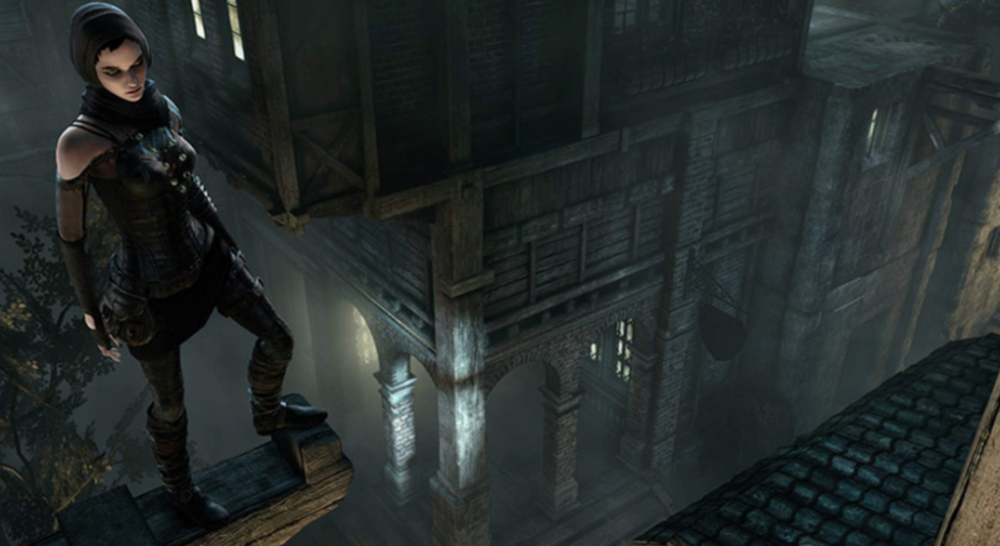
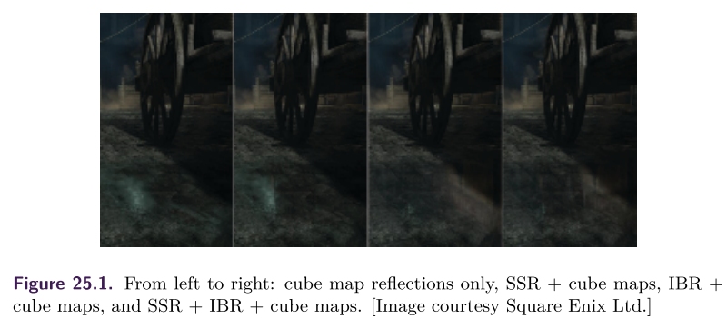
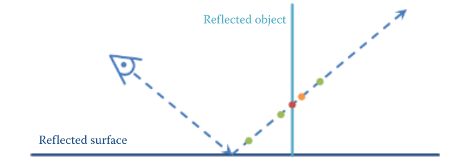
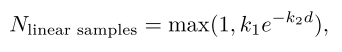
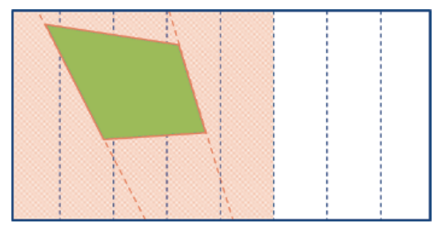
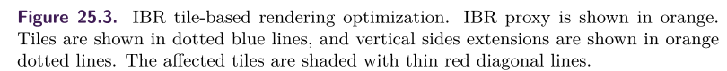
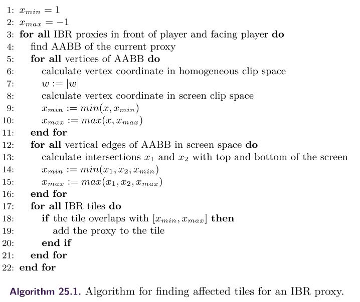
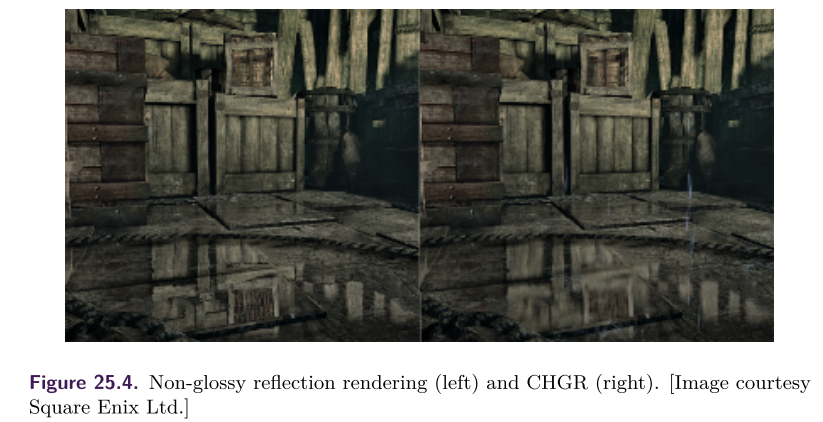
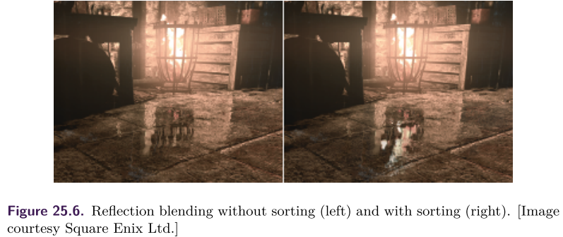

[toc]


# Next-Generation Rendering in Thief




## 1. 介绍

在本章中，我们将介绍==*《Thief》*==中使用的渲染技术，该游戏由Eidos Montreal开发，适用于PC、Playstation 3、Playstation 4、Xbox 360和Xbox One。此外，我们关注专门为下一代平台（即PC、Playstation 4和Xbox One）开发的技术。

我们向读者提供了实施细节和我们在**一系列渲染方法上的经验**。


## 2. 反射

### 相关方法

最早用于实时应用的反射算法之一，是**实时平面反射**（`RTPR`）渲染。这种方法可以为在一个**平面上反射的几何体**提供准确的解决方案，通常用于**水或镜子的反射**。该方法涉及到渲染物体，或者它们的代理，就像通过反射平面看到的那样。根据在反射场景中渲染的东西的数量，有可能平衡性能和质量，但这种技术通常被认为是昂贵的。这种方法的主要缺点是，在实践中，需要几个不同高度和方向的平面来正确模拟玩家周围的环境视图，这将是不可接受的昂贵处理。这使得该技术无法在广泛的环境中使用。

**立体地图反射**是另一种已经使用多年的方法。虽然它们非常快，而且可以处理非平面物体，但立方体地图也有其局限性。与其他技术相比，它们通常**缺乏分辨率和位置性**。人们通常还需要**预先计算立方体地图**，因为在运行时动态生成立方体地图的成本通常过高。这可能会使资产管道更加复杂。预先计算的立方体地图不会反映照明或动态对象的变化。此外，立方体地图在应用于平面时不会产生高质量的反射，这也是我们的主要场景之一。

**屏幕空间反射**（`SSR`）是一种相对较新的技术，已经迅速流行起来。它的性能成本适中，易于集成。此外，它提供了其他技术**难以实现的伟大的接触反射**。然而，SSR容易出现许多伪影，而且不能反映场景中不可见（或屏幕外）的部分。因此，它通常与一些备份技术结合使用。

**基于图像的反射**（`IBR`）是一种**利用平面代理的方法**，以接近复杂的几何形状来加速光线追踪。它是在虚幻引擎3的Samaritan演示中开发并展示的。`IBR`可以在反射定位方面取得良好的效果，并且允许反射器的任意方向。然而，其复杂性随着**代理的数量**而线性增长，这对于大型场景来说可能会变得难以承受。上面讨论的方法的许多变体已经被提出并用于实时渲染。

在实时渲染中使用。例如，**局部的或视差校正的立方体地图**可以说正在成为一个工业标准。在接下来的章节中，我们将介绍我们在==*《Thief》*==中使用的反射系统

### 反射系统前瞻

我们为下一代平台上的反射系统制定了**相当慷慨的性能预算**：`5`毫秒。在此之前，我们实现了**实时的平面反射方法**，其运行时间为`10`毫秒。这个运行时间显然是不可接受的；此外，这种技术只能渲染一个平面的反射。**游戏世界中的大部分反射来自于地面**（湿点、`tile`等），因此我们将自己限制在准水平面上。然而，由于==*《Thief》*==是一个多层次的游戏，我们不能局限于一个反射平面。我们的目标是**准确捕捉人类大小的物体和接触反射**。此外，我们还想捕捉主要地标（如大型建筑）。最后，由于**火把和篝火**是==*《Thief》*==世界中的一个典型光源，我们需要一种方法来**渲染某些透明几何体的反射**。



为了实现这些目标，我们想出了一个**多层反射系统**，如上图所示。==*《Thief》*==的反射系统由以下几层组成：
- **屏幕空间反射**（`SSR`），用于不透明的物体，包括动态的和静态的，在反射面的**一个人的高度内**。
- **基于图像的反射**（`IBR`），用于墙壁和远处的地标； 
- **局部的立方体地图反射**，用于填补`IBR`代理之间的空白。
- **全局立方体地图反射**，这主要是**针对与视线无关的天空盒**。

**每一层都作为前一层的后备解决方案**。首先，`SSR`对深度缓冲区进行**光线步进**。如果它没有足够的信息来渲染一个片段（即反射光线被一些前景物体遮蔽），它就会退回到**基于图像的反射**。如果没有一个**IBR代理**与反射光线相交，那么**局部的立方体地图反射系统**就会发挥作用。最后，如果附近没有合适的局部立方体地图，就会获取**全局立方体贴图**。不同层级之间的过渡是通过**平滑混合**完成的。

### SSR

`SSR`是一种基于图像的反射技术，基于通过**深度缓冲区的光线行进**。我们使用当前帧的颜色缓冲区、法线缓冲区和深度缓冲区。在渲染**半透明的几何体**之前应用`SSR`，以避免出现**透视伪影**。在每个片段，我们使用屏幕上的**uv坐标、获取的深度和投影矩阵**来重建**相机空间位置**。之后，我们沿着反射光线以恒定的步长进行光线行进，直到**沿着光线的分析深度**大于从相同的屏幕空间位置获取的深度缓冲器。最后，通过几个**二进制搜索步骤**来完善交点位置，如下图所示。



这种方法在**反射面和被反射物体的接触处**产生非常准确的反射。然而，`SSR`有几个主要问题。首先，这种方法非常昂贵：在每个片段中，我们需要进行几次可能不一致的（由于反射光线的差异）纹理获取。其次2，反射的信息往往是缺失的。

我们用**几种优化技术**来解决第一个问题。第二个问题是通过**回落到反射系统的后续层**来解决的。

我们通过对**片段的法线**进行近似处理（考虑成垂直于平面向量）来**减少内存流量**。这极大地增加了相邻片段的纹理获取数量，这些纹理可能在一个**动态随机存取存储器（DRAM）**突发中被**凝聚和处理**。然而，这自然会导致**理想的镜面反射**，没有任何法线扰动。此外，当发现与深度缓冲区的**第一个交叉点**时，我们使用**动态分支**来提前退出。尽管这可能会导致**错误的射线—深度缓冲区碰撞检测**，但为了进一步**节省带宽**，我们在精度上做了妥协。

另一个优化是**减少远处片段的样本数量**。我们想出了一个**经验公式**，即减少**与距离指数成正比的步骤数**：



其中，$d$ 是深度。此外，我们对整个着色器使用了一堆**早期输出**。我们检查表面**是否有反射成分**以及**反射矢量是否指向摄像机**。

然而，在实现这样的优化时，应该非常小心。在`if-clause`里面的所有取数都应该用**强制的mipmap级别**来完成；之后使用的所有变量都应该用一个**有意义的默认值**来初始化，而且`if-clause`前面应该有一个**[分支]指令**。原因是shader编译器可能会试图生成一条需要梯度的指令（即`tex2D`），因此会平移一个分支，使优化变得毫无用处。


### IBR

**基于图像的反射**的关键思想是：引入**一个或多个平面四边形反射代理**，并预先将**感兴趣的物体**渲染到其中。在片段着色过程中，我们只需针对**像素着色器中的代理数组**对反射光线进行**光线追踪**。在==*《Thief》*==中，我们的目标是每个场景有大约`50`个**IBR代理**。IBR**背面剔除**可以有效地**减少一半的可见代理数量**。直接的方法导致在目标配置下GPU的时间**远远超过8毫秒**，这是完全不可接受的。因此，我们采用了一系列的加速技术，如下所述。

首先，我们利用了与SSR相同的**正常逼近方法**来增加内存的凝聚力。这使得我们能够进行以下优化：

- 拒绝不面向玩家的平面
- 拒绝玩家身后的平面
- 基于`tile`的IBR渲染

然后对**SSR和IBR**一起进行了`Bump perturbation`

第二，我们引入了基于`tile`的`IBR`。因为我们把自己限制在**准水平反射**上，所以我们把**整个屏幕空间**划分为若干**垂直`tile`**。我们的实验证明，`16`块`tiles`是一个最佳数量。之后，对于每个反射代理，我们计算出**每个顶点的屏幕空间坐标**。如果一个顶点在**近剪辑平面的前面**，我们在**透视分割**之前翻转`w`符号，以便处理近距离的代理。然后，**转换后的顶点的x坐标**可能被用作最小值和最大值，以确定**代理的反射所覆盖的`tiles`**。然而，由于透视投影的原因，这种方法会导致反射被切断，特别是当代理接近**屏幕边界**的时候。为了解决这个问题，我们引入了以下的变通方法。如下图所示，对于**代理的两个垂直面**，我们将它们延伸到与屏幕上下边界的交汇处。由此产生的`X`坐标被用来**减少最小值和/或增加最大值**。该方法的伪码显示在算法`25.1`中。







上面提到的优化大大减少了GPU的时间；然而，如果玩家**直视**，由于**高透视变形**，所有的代理开始占据**几乎所有的`tiles`**。为了缓解这种情况下的**性能下降**，我们在实际的高成本追踪之前，在像素着色器中使用了一个**边界球体测试**来进行早期输出。虽然这种检查在最常见的情况下会使性能下降，但在最坏的情况下，它可以提高GPU的性能，从而使帧率更加稳定。

此外，为了限制帧中活动的**IBR代理的数量**。 我们引入了`IBR room`的概念。从本质上讲，`IBR room`定义了一个`AABB`，使玩家只能从同一`room`的IBR代理中看到**IBR反射**。此外，一个IBR房间的AABB的下平面定义了里面**每个代理的最大反射延伸**。这使我们能够**大幅限制玩家在向下看时的反射数量**。


### Contact-Hardening Glossy Reflection

因为==*《Thief》*==中的大多数反射面都**不是完美的镜面反射体**，我们决定模拟**光泽反射**。`Glossy SSR`反射并不是一个新的功能，我们决定将SSR更进一步，渲染**接触硬化的光泽反射**（`CHGRs`）。下图中显示了一个`CHGR`的例子。我们希望捕捉到的主要现象是，在被反射物体和反射表面的接触点附近，反射是最清晰的。当这**两个表面离得越远，反射就越模糊**。CHGR渲染的算法如下：

- 首先，我们输出**反射面和反射光线击中的、被反射物体的点之间的距离**。因为我们想限制渲染目标的大小，所以我们利用**R8G8B8A8纹理**来处理颜色和深度信息。由于`8`比特不能为距离提供足够的精度，我们在**SSR pass**中把距离打包成**两个8比特通道**，如清单25.1所示。



​		[list 1]()

```c++
//World -space unit is 1 centimeter 
int distanceLo = int(worldSpaceDistance) % 256; 
int distanceHi = int(worldSpaceDistance) / 256;
packedDistance = float2(float(distanceLo) / 255.0f, float(distanceHi) / 255.0f);
```

`IBR Pass`解压深度，执行混合，然后将这个**世界空间的距离**转换成**屏幕空间的距离**，如清单`2`中所示。这样做的原因有两个方面。首先，**屏幕空间距离**自然适合于$[0, 1]$域。由于我们对模糊本身不需要太多的精度，我们可以把它重新打包成一个8位的值，确保自然的混合。其次，**屏幕空间距离为模糊比例提供了一个更好的线索**：如果两者的反射距离相同，**离观看者较远的片段的模糊程度应该低于较近的片段**。

[list 2]()

```c++
float3 reflectedCameraToWorld = reflect(cameraToWorld, worldSpaceNormal);
float reflectionVectorLength = max(length(reflectedCameraToWorld), FP_EPSILON);
float worldSpaceDistance = 255.0f * (packedDistance.x + 256.0f 
                                     * packedDistance.y) / reflectionVectorLength;
... 
// Reflection sorting and blending ... 
float4 screenSpaceReflectedPosition = mul(float4(reflectedPosition, 1), worldToScreen);
screenSpaceReflectedPosition /= screenSpaceReflectedPosition.w;
ReflectionDistance = length(screenSpaceReflectedPosition.xy -screenSpaceFragmentPosition.xy);
```


- 第二步是**稀释距离信息**。对于每个区域，选择**模糊核区域**所覆盖的、所有像素的最大距离。这样做的原因是，距离值会从一个像素突然改变到下一个像素（例如，当一个近距离的反射代理遇到一个遥远的背景像素）。我们希望用**相应区域的最大模糊系数**来模糊这些区域。这有助于**避免**原本模糊物体的**尖锐剪影**。为了节省内存带宽，我们应用了一个两`pass`的、可分离的**扩张最大滤波器**。这为我们提供了一个可接受的近似值。
- 最后，我们用**可调整的可分离核**进行模糊处理。除了根据**距离值**选择**高斯参数**外，我们还采用了以下技巧。首先，我们忽略了镜面强度为`0`的样本，以避免在物体的轮廓处出现`bleeding`。这需要在着色器中对内核进行实时调整。第二，我们遵循与[Andersson 13]相同的启发式方法，因此我们**在垂直方向上比在水平方向上更多地模糊图像**，以达到**更合理的视觉效果**。


### 反射混合

由于我们的**反射系统**由几层组成，我们需要定义如何在它们之间混合。除了**距离因素**外，我们的`SSR pass`还输出一个**混合因素**。这个系数取决于以下几点：

- 高度（我们投下的反射光线越长，它的贡献就越小）
- 追踪精度（光线坐标和获取的深度之间的**深度delta**）。

- 表面倾斜度（表面法线与垂直方向的偏差越大，`SSR`的贡献就越小）。

- 反射光线走向摄像机，或离开屏幕。

之后，`IBR`被合并在上面，输出一个**累积的混合系数**。最后，立方体地图被应用。

然而，当一个**透明的IBR代理**在可能**用SSR反射的对象**前面时，这种方法会引起某些问题。下图显示了这个问题。为了解决这个问题，我们没有**简单地混合SSR和IBR**，而是事先进行**层排序**。我们在**IBR着色器**中创建一个小的（三到四个条目）**反射层数组**，并将`SSR`结果作为第一个元素注入其中。当我们添加一个**后续的IBR追踪结果**时，该数组将保持排序。因此，我们最终只得到**最接近的交叉点**。




### Bump as a Postprocess

如上所述，我们假设`SSR`和`IBR`的法线是朝上的，以应用**加速技术**。此外，为了减少内存带宽，我们以**一半的分辨率**渲染反射。这就削弱了**高频细节**，而高频细节对于反射来说是至关重要的，尤其是在**高度凹凸的表面**上。

为了缓解这个问题，我们在将**反射缓冲区**放大到全分辨率时，将`bump`效果作为一个**后处理**。其主要思想与通用折射方法[非常相似。我们使用**垂直法线和每像素法线之间的差异**来偏移渲染的**反射纹理中的UV**。为了对抗**反射泄漏**`reflection leaking`，如果**新的取值**明显比旧的取值更接近，我们就会恢复到原来的取值。


### Localized Cube Map Reflection

在SSR、IBR和立方体地图反射策略中，立方体贴图最好只包含天幕和一些远处的几何体，因为可玩的环境将由IBR平面映射。只包含天幕和一些远处的几何体，因为可玩的环境将由IBR平面来映射。在这种情况下，只需要一张立方体地图。在实践中，IBR平面有许多孔，并且不能完美地相互连接。这是我们的IBR平面是用可渲染纹理生成的结果。