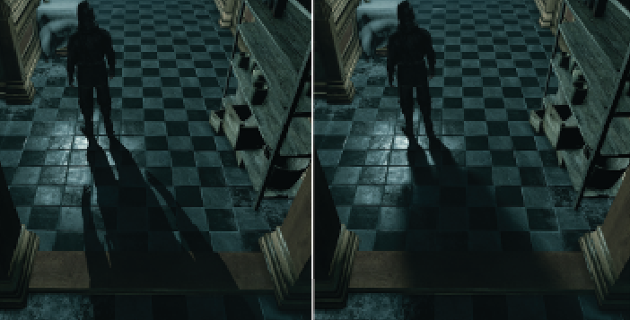
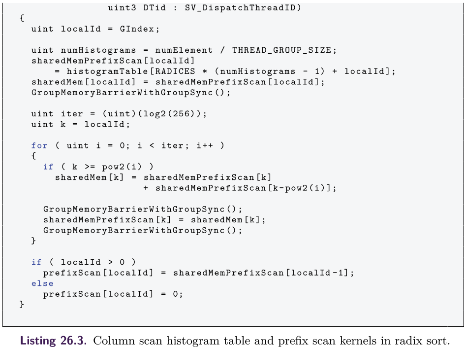

[toc]


# Next-Generation Rendering in Thief


## 1. 介绍

在本章中，我们将介绍==*《Thief》*==中使用的渲染技术，该游戏由Eidos Montreal开发，适用于PC、Playstation 3、Playstation 4、Xbox 360和Xbox One。此外，我们关注专门为下一代平台（即PC、Playstation 4和Xbox One）开发的技术。

我们向读者提供了实施细节和我们在**一系列渲染方法上的经验**。


## 2. 反射

### 相关方法

最早用于实时应用的反射算法之一，是**实时平面反射**（`RTPR`）渲染。这种方法可以为在一个**平面上反射的几何体**提供准确的解决方案，通常用于**水或镜子的反射**。该方法涉及到渲染物体，或者它们的代理，就像通过反射平面看到的那样。根据在反射场景中渲染的东西的数量，有可能平衡性能和质量，但这种技术通常被认为是昂贵的。这种方法的主要缺点是，在实践中，需要几个不同高度和方向的平面来正确模拟玩家周围的环境视图，这将是不可接受的昂贵处理。这使得该技术无法在广泛的环境中使用。

**立体地图反射**是另一种已经使用多年的方法。虽然它们非常快，而且可以处理非平面物体，但立方体地图也有其局限性。与其他技术相比，它们通常**缺乏分辨率和位置性**。人们通常还需要**预先计算立方体地图**，因为在运行时动态生成立方体地图的成本通常过高。这可能会使资产管道更加复杂。预先计算的立方体地图不会反映照明或动态对象的变化。此外，立方体地图在应用于平面时不会产生高质量的反射，这也是我们的主要场景之一。

**屏幕空间反射**（`SSR`）是一种相对较新的技术，已经迅速流行起来。它的性能成本适中，易于集成。此外，它提供了其他技术**难以实现的伟大的接触反射**。然而，SSR容易出现许多伪影，而且不能反映场景中不可见（或屏幕外）的部分。因此，它通常与一些备份技术结合使用。

**基于图像的反射**（`IBR`）是一种**利用平面代理的方法**，以接近复杂的几何形状来加速光线追踪。它是在虚幻引擎3的Samaritan演示中开发并展示的。`IBR`可以在反射定位方面取得良好的效果，并且允许反射器的任意方向。然而，其复杂性随着**代理的数量**而线性增长，这对于大型场景来说可能会变得难以承受。上面讨论的方法的许多变体已经被提出并用于实时渲染。

在实时渲染中使用。例如，**局部的或视差校正的立方体地图**可以说正在成为一个工业标准。在接下来的章节中，我们将介绍我们在==*《Thief》*==中使用的反射系统

### 反射系统前瞻

我们为下一代平台上的反射系统制定了**相当慷慨的性能预算**：`5`毫秒。在此之前，我们实现了**实时的平面反射方法**，其运行时间为`10`毫秒。这个运行时间显然是不可接受的；此外，这种技术只能渲染一个平面的反射。**游戏世界中的大部分反射来自于地面**（湿点、`tile`等），因此我们将自己限制在准水平面上。然而，由于==*《Thief》*==是一个多层次的游戏，我们不能局限于一个反射平面。我们的目标是**准确捕捉人类大小的物体和接触反射**。此外，我们还想捕捉主要地标（如大型建筑）。最后，由于**火把和篝火**是==*《Thief》*==世界中的一个典型光源，我们需要一种方法来**渲染某些透明几何体的反射**。


为了实现这些目标，我们想出了一个**多层反射系统**，如上图所示。==*《Thief》*==的反射系统由以下几层组成：
- **屏幕空间反射**（`SSR`），用于不透明的物体，包括动态的和静态的，在反射面的**一个人的高度内**。
- **基于图像的反射**（`IBR`），用于墙壁和远处的地标； 
- **局部的立方体地图反射**，用于填补`IBR`代理之间的空白。
- **全局立方体地图反射**，这主要是**针对与视线无关的天空盒**。

**每一层都作为前一层的后备解决方案**。首先，`SSR`对深度缓冲区进行**光线步进**。如果它没有足够的信息来渲染一个片段（即反射光线被一些前景物体遮蔽），它就会退回到**基于图像的反射**。如果没有一个**IBR代理**与反射光线相交，那么**局部的立方体地图反射系统**就会发挥作用。最后，如果附近没有合适的局部立方体地图，就会获取**全局立方体贴图**。不同层级之间的过渡是通过**平滑混合**完成的。

### SSR

`SSR`是一种基于图像的反射技术，基于通过**深度缓冲区的光线行进**。我们使用当前帧的颜色缓冲区、法线缓冲区和深度缓冲区。在渲染**半透明的几何体**之前应用`SSR`，以避免出现**透视伪影**。在每个片段，我们使用屏幕上的**uv坐标、获取的深度和投影矩阵**来重建**相机空间位置**。之后，我们沿着反射光线以恒定的步长进行光线行进，直到**沿着光线的分析深度**大于从相同的屏幕空间位置获取的深度缓冲器。最后，通过几个**二进制搜索步骤**来完善交点位置，如下图所示。


这种方法在**反射面和被反射物体的接触处**产生非常准确的反射。然而，`SSR`有几个主要问题。首先，这种方法非常昂贵：在每个片段中，我们需要进行几次可能不一致的（由于反射光线的差异）纹理获取。其次2，反射的信息往往是缺失的。

我们用**几种优化技术**来解决第一个问题。第二个问题是通过**回落到反射系统的后续层**来解决的。

我们通过对**片段的法线**进行近似处理（考虑成垂直于平面向量）来**减少内存流量**。这极大地增加了相邻片段的纹理获取数量，这些纹理可能在一个**动态随机存取存储器（DRAM）**突发中被**凝聚和处理**。然而，这自然会导致**理想的镜面反射**，没有任何法线扰动。此外，当发现与深度缓冲区的**第一个交叉点**时，我们使用**动态分支**来提前退出。尽管这可能会导致**错误的射线—深度缓冲区碰撞检测**，但为了进一步**节省带宽**，我们在精度上做了妥协。

另一个优化是**减少远处片段的样本数量**。我们想出了一个**经验公式**，即减少**与距离指数成正比的步骤数**：


其中，$d$ 是深度。此外，我们对整个着色器使用了一堆**早期输出**。我们检查表面**是否有反射成分**以及**反射矢量是否指向摄像机**。

然而，在实现这样的优化时，应该非常小心。在`if-clause`里面的所有取数都应该用**强制的mipmap级别**来完成；之后使用的所有变量都应该用一个**有意义的默认值**来初始化，而且`if-clause`前面应该有一个**[分支]指令**。原因是shader编译器可能会试图生成一条需要梯度的指令（即`tex2D`），因此会平移一个分支，使优化变得毫无用处。


### IBR

**基于图像的反射**的关键思想是：引入**一个或多个平面四边形反射代理**，并预先将**感兴趣的物体**渲染到其中。在片段着色过程中，我们只需针对**像素着色器中的代理数组**对反射光线进行**光线追踪**。在==*《Thief》*==中，我们的目标是每个场景有大约`50`个**IBR代理**。IBR**背面剔除**可以有效地**减少一半的可见代理数量**。直接的方法导致在目标配置下GPU的时间**远远超过8毫秒**，这是完全不可接受的。因此，我们采用了一系列的加速技术，如下所述。

首先，我们利用了与SSR相同的**正常逼近方法**来增加内存的凝聚力。这使得我们能够进行以下优化：

- 拒绝不面向玩家的平面
- 拒绝玩家身后的平面
- 基于`tile`的IBR渲染

然后对**SSR和IBR**一起进行了`Bump perturbation`

第二，我们引入了基于`tile`的`IBR`。因为我们把自己限制在**准水平反射**上，所以我们把**整个屏幕空间**划分为若干**垂直`tile`**。我们的实验证明，`16`块`tiles`是一个最佳数量。之后，对于每个反射代理，我们计算出**每个顶点的屏幕空间坐标**。如果一个顶点在**近剪辑平面的前面**，我们在**透视分割**之前翻转`w`符号，以便处理近距离的代理。然后，**转换后的顶点的x坐标**可能被用作最小值和最大值，以确定**代理的反射所覆盖的`tiles`**。然而，由于透视投影的原因，这种方法会导致反射被切断，特别是当代理接近**屏幕边界**的时候。为了解决这个问题，我们引入了以下的变通方法。如下图所示，对于**代理的两个垂直面**，我们将它们延伸到与屏幕上下边界的交汇处。由此产生的`X`坐标被用来**减少最小值和/或增加最大值**。该方法的伪码显示在算法`25.1`中。


上面提到的优化大大减少了GPU的时间；然而，如果玩家**直视**，由于**高透视变形**，所有的代理开始占据**几乎所有的`tiles`**。为了缓解这种情况下的**性能下降**，我们在实际的高成本追踪之前，在像素着色器中使用了一个**边界球体测试**来进行早期输出。虽然这种检查在最常见的情况下会使性能下降，但在最坏的情况下，它可以提高GPU的性能，从而使帧率更加稳定。

此外，为了限制帧中活动的**IBR代理的数量**。 我们引入了`IBR room`的概念。从本质上讲，`IBR room`定义了一个`AABB`，使玩家只能从同一`room`的IBR代理中看到**IBR反射**。此外，一个IBR房间的AABB的下平面定义了里面**每个代理的最大反射延伸**。这使我们能够**大幅限制玩家在向下看时的反射数量**。


### Contact-Hardening Glossy Reflection

因为==*《Thief》*==中的大多数反射面都**不是完美的镜面反射体**，我们决定模拟**光泽反射**。`Glossy SSR`反射并不是一个新的功能，我们决定将SSR更进一步，渲染**接触硬化的光泽反射**（`CHGRs`）。下图中显示了一个`CHGR`的例子。我们希望捕捉到的主要现象是，在被反射物体和反射表面的接触点附近，反射是最清晰的。当这**两个表面离得越远，反射就越模糊**。CHGR渲染的算法如下：

- 首先，我们输出**反射面和反射光线击中的、被反射物体的点之间的距离**。因为我们想限制渲染目标的大小，所以我们利用**R8G8B8A8纹理**来处理颜色和深度信息。由于`8`比特不能为距离提供足够的精度，我们在**SSR pass**中把距离打包成**两个8比特通道**，如清单25.1所示。


​		[list 1]()

```c++
//World -space unit is 1 centimeter 
int distanceLo = int(worldSpaceDistance) % 256; 
int distanceHi = int(worldSpaceDistance) / 256;
packedDistance = float2(float(distanceLo) / 255.0f, float(distanceHi) / 255.0f);
```

`IBR Pass`解压深度，执行混合，然后将这个**世界空间的距离**转换成**屏幕空间的距离**，如清单`2`中所示。这样做的原因有两个方面。首先，**屏幕空间距离**自然适合于$[0, 1]$域。由于我们对模糊本身不需要太多的精度，我们可以把它重新打包成一个8位的值，确保自然的混合。其次，**屏幕空间距离为模糊比例提供了一个更好的线索**：如果两者的反射距离相同，**离观看者较远的片段的模糊程度应该低于较近的片段**。

[list 2]()

```c++
float3 reflectedCameraToWorld = reflect(cameraToWorld, worldSpaceNormal);
float reflectionVectorLength = max(length(reflectedCameraToWorld), FP_EPSILON);
float worldSpaceDistance = 255.0f * (packedDistance.x + 256.0f 
                                     * packedDistance.y) / reflectionVectorLength;
... 
// Reflection sorting and blending ... 
float4 screenSpaceReflectedPosition = mul(float4(reflectedPosition, 1), worldToScreen);
screenSpaceReflectedPosition /= screenSpaceReflectedPosition.w;
ReflectionDistance = length(screenSpaceReflectedPosition.xy -screenSpaceFragmentPosition.xy);
```


- 第二步是**稀释距离信息**。对于每个区域，选择**模糊核区域**所覆盖的、所有像素的最大距离。这样做的原因是，距离值会从一个像素突然改变到下一个像素（例如，当一个近距离的反射代理遇到一个遥远的背景像素）。我们希望用**相应区域的最大模糊系数**来模糊这些区域。这有助于**避免**原本模糊物体的**尖锐剪影**。为了节省内存带宽，我们应用了一个两`pass`的、可分离的**扩张最大滤波器**。这为我们提供了一个可接受的近似值。
- 最后，我们用**可调整的可分离核**进行模糊处理。除了根据**距离值**选择**高斯参数**外，我们还采用了以下技巧。首先，我们忽略了镜面强度为`0`的样本，以避免在物体的轮廓处出现`bleeding`。这需要在着色器中对内核进行实时调整。第二，我们遵循与[Andersson 13]相同的启发式方法，因此我们**在垂直方向上比在水平方向上更多地模糊图像**，以达到**更合理的视觉效果**。


### 反射混合

由于我们的**反射系统**由几层组成，我们需要定义如何在它们之间混合。除了**距离因素**外，我们的`SSR pass`还输出一个**混合因素**。这个系数取决于以下几点：

- 高度（我们投下的反射光线越长，它的贡献就越小）
- 追踪精度（光线坐标和获取的深度之间的**深度delta**）。

- 表面倾斜度（表面法线与垂直方向的偏差越大，`SSR`的贡献就越小）。

- 反射光线走向摄像机，或离开屏幕。

之后，`IBR`被合并在上面，输出一个**累积的混合系数**。最后，立方体地图被应用。

然而，当一个**透明的IBR代理**在可能**用SSR反射的对象**前面时，这种方法会引起某些问题。下图显示了这个问题。为了解决这个问题，我们没有**简单地混合SSR和IBR**，而是事先进行**层排序**。我们在**IBR着色器**中创建一个小的（三到四个条目）**反射层数组**，并将`SSR`结果作为第一个元素注入其中。当我们添加一个**后续的IBR追踪结果**时，该数组将保持排序。因此，我们最终只得到**最接近的交叉点**。


### Bump as a Postprocess

如上所述，我们假设`SSR`和`IBR`的法线是朝上的，以应用**加速技术**。此外，为了减少内存带宽，我们以**一半的分辨率**渲染反射。这就削弱了**高频细节**，而高频细节对于反射来说是至关重要的，尤其是在**高度凹凸的表面**上。

为了缓解这个问题，我们在将**反射缓冲区**放大到全分辨率时，将`bump`效果作为一个**后处理**。其主要思想与通用折射方法[非常相似。我们使用**垂直法线和每像素法线之间的差异**来偏移渲染的**反射纹理中的UV**。为了对抗**反射泄漏**`reflection leaking`，如果**新的取值**明显比旧的取值更接近，我们就会恢复到原来的取值。


### Localized Cube Map Reflection

在`SSR`、`IBR`和立方体地图反射策略中，**立方体贴图**最好只包含**天幕和一些远处的几何体**，因为可玩的环境将由`IBR`平面映射。在这种情况下，只需要一张立方体地图。在实践中，`IBR`平面有许多孔，并且不能完美地相互连接。

当**反射光线**进入这些裂缝，并击中天幕时，会产生一个**明亮对比度像素**，因为大多数场景通常**使用的天幕**比环境的其他部分要亮很多。为了解决这个问题，我们使用了**沿可玩路径拍摄的局部立方体地图**。任何在**局部立方体地图范围内的基元**都会在**主渲染通道**中使用它作为**反射的环境颜色**。

从技术上讲，**立方体贴图**可以在屏幕空间中使用`cube map render volumes`，但我们选择了简单地将**立体贴图样本**输出到一个专门的渲染目标。这使得**立方体贴图与材质绑定**，并消除了它与**局部立方体贴图系统**的依赖关系。Thief中的主要渲染通道将输出以下数据：

- material lit color (sRGB8)
- 环境反射颜色 + 漫反射光强度（sRGB8）
- world normal + reflectivity (RGB8)

在生成了`IBR`和`SSR`**半分辨率反射纹理**之后，最终的颜色是通过添加`SSR`、`IBR`和最后的环境反射颜色（即**立方体贴图颜色**）计算出来的。如果材质或平台不支持`IBR/SSR`，那么该颜色将被简单地添加到`material-lit color`中，而不需要**额外的渲染目标**。

请注意，我们需要用**漫反射照明强度**，来降低`IBR`和立方体地图的颜色，因为它们是在默认的照明设置下捕获的，这可能与当前游戏中的照明设置有很大不同。这种比例对于`SSR`来说是不需要的，因为它是实时和准确的，而**IBR代理和立方体地图是预先计算的**。


### Art Pipeline Implications

//todo


## 3. 接触硬化阴影



==接触硬化阴影==`Contact-hardening shadows `（CHSs），类似于`percentage-closer soft shadows`（`PCSSs`），是一种模拟**区域灯动态阴影**的阴影贴图方法。实现的效果是，当施影者和受影者之间的距离越近，阴影就越清晰；当施影者和受影者之间的距离越远，阴影就越模糊（越柔和）。**Thief中的实现**是基于AMD SDK中的方法。这个方法很容易集成，因为它使用**单一光源产生的阴影图**，可以直接替代普通的阴影过滤。这种技术的主要缺点之一是**大量的纹理获取**，在《盗贼》中，我们为Shader Model 5.0实现了一种优化的方法，极大地限制了对阴影贴图的访问。**CHS过程分为三个步骤**，即

- 遮挡器搜索
- 半影计算
- 过滤。

### 遮挡器搜索

第一步包括计算渲染点周围搜索区域内**遮挡器的平均深度**（我们将其称为**平均阻断器深度**）。以渲染点为中心的$N×N$核心网格覆盖了这个搜索区域。如下图所示，这个**平均阻挡器深度值**将被用于**半影计算**。


Shader Model 5.0的新内建`GatherRed()`通过**一次采样四个值**来加速这一步骤。我们决定使用$8×8$的内核大小，这实际上是执行`16`个采样，而不是`Shader Model 4.0`实现的`64`个（见清单25.4）。**增加内核的大小将允许更大的半影区**，但是随着纹理取数的增加，显然**会增加成本**。

因为半影的宽度（或**模糊度**）与**内核的大小**密切相关，而内核的大小取决于`shadow map`的分辨率及其在世界空间的投影，这就导致了当`shadow map`的分辨率或`shadow frustum`的`FOV`发生变化时，在相同的投光器/接收器设置下，**半影的宽度是可变的**。下图显示了这个问题。

为了解决这个问题，我们扩展了CHS，在CHS应用前的预处理中==为阴影贴图生成mips==。这些缩小的操作也是通过使用`GatherRed()`来加速的。然后，在CHS步骤中，我们动态地选择`mip`，使**世界空间中的内核大小**更接近于用户定义的参数。清单`3`显示了如何从这个**用户定义的参数**、**阴影贴图的分辨率**和`shadow frustum`的`FOV`计算出**mip指数**。这个过程可以在`CPU`上完成，结果作为一个参数传递给着色器


[list 3]()

```c++
#define KERNEL_SIZE 8 
float wantedTexelSizeAt1UnitDist = wantedPenumbraWidthAt1UnitDist / KERNEL_SIZE;
float texelSizeAt1UnitDist = 2* TanFOVSemiAngle / shadowMapResolution;
float MaxShadowMip = -log(texelSizeAt1UnitDist / wantedTexelSizeAt1UnitDist) / log(2);
MaxShadowMip = min(float(MIPS_COUNT - 1), max(MaxShadowMip, 0.0)); 
// both BlkSearchShadowMipIndex and MaxShadowMip are passed 
// to the shader as parameters 
int BlkSearchShadowMipIndex = ceil(MaxShadowMip);
```

不幸的是，`GatherRed()`并不允许选择`mip`。因此，如下图所示，`mips`被存储在一个图集中，我们对**纹理坐标**进行偏移以获取所需的mip。这是通过对纹理空间的坐标应用一个**简单的偏移比例**来实现的（见清单`4`）。


为了节省`fragment`指令，如果平均阻挡物深度等于`1.0`（在搜索区域的所有样本中找到阻挡物），则返回`0.0`（完全阴影）；如果平均阻挡物深度等于`0.0`（没有找到阻挡物），则返回`1.0`。

[list 4]()

```c++
#define KERNEL_SIZE 8 
#define BFS2 (KERNEL_SIZE - 1) / 2

float3 blkTc = float3(inTc.xy, inDepth); 
// TcBiasScale is a static array holding the offset -scale 
in the shadow map for every mips. 
float4 blkTcBS = TcBiasScale[BlkSearchShadowMipIndex ]; 
blkTc.xy = blkTcBS.xy + blkTc.xy * blkTcBS.zw; 

// g_vShadowMapDims.xy is the shadow map resolution 
// g_vShadowMapDims.zw is the shadow map texel size 
float2 blkAbsTc = ( g_vShadowMapDims.xy * blkTc.xy ); 
float2 fc = blkAbsTc - floor( blkAbsTc ); 
blkTc.xy = blkTc.xy - ( fc * g_vShadowMapDims.zw ); 
float blkCount = 0; 
float avgBlockerDepth = 0; 

[loop]
for( int row = -BFS2; row <= BFS2; row += 2 ) 
{

    float2 tc = blkTc.xy + float2(-BFS2 * g_vShadowMapDims.z, row * g_vShadowMapDimensions.w);

    [unroll]
    for( int col = -BFS2; col <= BFS2; col += 2 ) 
    {
        float4 depth4 = shadowTex.GatherRed(pointSampler, tc.xy); 
        float4 blk4 = (blkTc.zzzz <= depth4) ? (0).xxxx : (1).xxxx; 
        loat4 fcVec = 0; 
        
        if (row == -BFS2) 
        {
            if (col == -BFS2) 
                fcVec = float4 ((1.0 - fc.y) * (1.0 - fc.x), (1.0 - fc.y), 1, (1.0 - fc.x));

            else if (col == BFS2) 
                fcVec = float4 ((1.0 - fc.y), (1.0 - fc.y) * fc.x, fc.x, 1);

            else fcVec = float4 ((1.0 - fc.y), (1.0 - fc.y), 1, 1);
		} 
        else if (row == BFS2) 
        {
            if (col == -BFS2) 
                fcVec = float4 ((1.0 - fc.x), 1, fc.y, (1.0 - fc.x) * fc.y);
			else if (col == BFS2) 
                fcVec = float4(1, fc.x, fc.x * fc.y, fc.y);
			else 
                fcVec = float4(1, 1, fc.y, fc.y);
		} else 
        {
			if (col == -BFS2) 
                fcVec = float4 ((1.0 - fc.x), 1, 1, (1.0 - fc.x));
            else if (col == BFS2) 
                fcVec = float4(1, fc.x, fc.x, 1);
			else 
                fcVec = float4 (1,1,1,1);
		} 
        blkCount += dot(blk4 , fcVec.xyzw); 
        avgBlockerDepth += dot(depth4 , fcVec.xyzw * blk4); 
        tc.x += 2.0 * g_vShadowMapDims.z;
	}
}
if( blkCount == 0.0 ) // Early out - fully lit 
    return 1.0f;
else if (blkCount == KERNEL_SIZE*KERNEL_SIZE) // Fully shadowed 
    return 0.0f;
avgBlockerDepth /= blkCount;
```


### 半影区计算

基于上一步的**平均阻隔深度值**和用户定义的光宽，计算出一个系数（半影估计）。算法25.2是非常直接的，与许多其他PCSS的实现相同。


### 过滤

最后的CHS步骤包括对**阴影图**进行**动态过滤**，以获得**光的衰减项**。在这一步骤中，我们也利用了阴影图的`mips`。主要的想法是在**阴影的尖锐区域**使用较高的分辨率`mips`，在模糊区域使用较低的`mips`。为了在不同的mips之间有一个连续的、不易察觉的过渡，我们使用从**半影估计**中选出的两个`mips`，并在**线性混合**两个结果之前对每个mips进行一次**过滤操作**（见下图）。这样做可以在整个滤波过程中使用**相同的内核尺寸**（Thief中为8×8），得到一个具有**不同程度模糊性**的真实效果。可能的最高mip指数（对应于`1.0`的半影估计值）与**阻断器搜索步骤**中使用的相同。


如上所述，我们需要在混合之前得到两个选定的`mips`的**衰减项**，然后再将它们混合。通过将**四个矩阵**送入一个**立方B´ezier函数**来计算**动态权重矩阵**，这只取决于**半影的估计**，并用于过滤每个mip。清单25.5显示了如何混合过滤后的mips以获得**最终的阴影衰减项**。

[list 5]()

```c++
#define KERNEL_SIZE 8 
#define FS2 (KERNEL_SIZE - 1) / 2
float Ratio = penumbraWidth; 
float clampedTexRatio = max(MaxShadowMip - 0.001, 0.0); 
float texRatio = min(MaxShadowMip * Ratio , clampedTexRatio); 
float texRatioFc = texRatio - floor(texRatio); 
uint textureIndex = min(uint(texRatio), MIPS_COUNT -2); 
float4 highMipTcBS = TcBiasScale[textureIndex]; // higher res 
float4 lowMipTcBS = TcBiasScale[textureIndex +1]; // lower res 
// Pack mips Tc into a float4 , xy for high mip , zw for low mip 
float4 MipsTc = float4(highMipTcBS.xy + inTc.xy * highMipTcBS.zw, lowMipTcBS.xy + inTc.xy * lowMipTcBS.zw);
float4 MipsAbsTc = (g_vShadowMapDims.xyxy * MipsTc); 
float4 MipsFc = MipsAbsTc - floor(MipsAbsTc); 
MipsTc = MipsTc - (MipsFc * g_vShadowMapDims.zwzw); 
... 
// Apply the same dynamic weight matrix to both mips 
// using ratio along with the corresponding MipsTc and MipsFc ... 
return lerp(highMipTerm , lowMipTerm , texRatioFc);
```

**遮挡器搜索**的阴影贴图访问数为`16`（使用GatherCmpRed()的8×8内核），过滤步骤为`2×16`（使用`GatherCmpRed()`的每个mip的8×8内核），总共有`48`次纹理获取，产生与**阴影分辨率**无关的非常大的penumbras（尽管尖锐区域仍有依赖）。在Shader Model 4.0中，一个使用8×8内核的经典实现将为较小的penumbras执行`128`次访问，这取决于阴影分辨率。


## 4. Lit Particles

另一项补充是对**发光粒子**的支持。在这之前，我们的粒子系统的颜色必须通过手工调整，这意味着**粒子不能对光照变化做出反应**。有了照明支持，粒子看起来更加融入环境，它们似乎对照明的变化有更多的动态反应。

**粒子的照明功能集**包括静态光照地图、静态阴影贴图、投影纹理和最多四个动态灯光。


## 5. Compute-Shader-Based Postprocessing

DirectX 11 API和下一代游戏机硬件的主要创新之一是对**计算着色器**的支持。计算着色器的一个特殊功能是引入了**本地数据存储**（`LDS`），又称**线程组共享内存**（`TGSM`）。LDS是一个**类似缓存的片上存储器**，通常比`VRAM`快，但比**寄存器存储器**慢。人们可以使用`LDS`在同一线程组内运行的着色器线程之间**交换数据**。

这一功能可用于许多应用。一个明显的用途是**减少后处理的带宽**，后处理会计算一个**相当大的半径的卷积**。在 "盗贼 "中，我们将这一功能用于**景深（DoF）计算**。


​	


# Grass Rendering and Simulation with LOD


## 1. 介绍

作为我们以前的**头发技术TressFX**的扩展，我们选择了草，因为它有独特的挑战。我们最初的计划是**支持渲染许多单独的草叶**，覆盖一个宽阔的地形，并使用**刚体和风**来模拟它们的**相互作用**。为了满足要求，我们开发了一个高效且可扩展的==草的细节级别（LOD）系统==。 除了LOD之外，**主从系统**也大大减少了仿真计算量，但仍然保持了仿真的质量。


## 2. 渲染草片

为了使草**看起来更自然**，为草叶获得一个**自然的形状**是至关重要的。我们首先采用了[Bouatouch等人06]中描述的方法，他们以**程序化的方式**生成草叶。对于每个草叶，它的茎被定义为**一条抛物线**，由跟踪一个点的运动形成，从**根部顶点**射出，具有**随机的初始速度和角度**。这种方法简单而有效，但**不能提供草叶几何外观的丰富变化**，因为它们总是抛物线曲线，或高或低，或弯或直。使用这种方法很难生成复杂而自然的草叶，因为草叶仅靠**二次曲线**是很难描述的。

我们发现实例化可以很好地解决这个差异性问题。首先，生成几个草片类型，**每个草片都有固定数量的结`knots`**。在我们的应用中，节数为`16`，这平衡了**仿真的效率**和**叶片形状的平滑性**。此外，我们还试验了不同数量的类型，发现`5`种类型足以创造出具有丰富变化的草场。更多的类型不会损害性能，但也不会增加多少视觉质量。下图显示了我们用一个内部工具创建的五种叶片类型。


为了进一步增加差异，当我们实例化这些叶片类型，并将它们种植在场景中时（我们称之为==生长过程==），我们**将实例化的叶片的方向、长度、宽度和纹理随机化**。例如，对于第五种类型，它的长度可以在`0.1`米和`0.15`米之间变化，并考虑到**正态分布**。

过不均匀地分配刀片类型，进一步加强了变化。其中一些将比其他的更经常被使用。实例化一个特定类型的概率被调整为**最终场景中的最佳外观**。用手或工具创造的草只描述了**茎**。茎在运行时被扩展为**一个叶片**，这样我们就可以分别设置**每个叶片的宽度**。茎中的每条线段都成为一个四边形，即两个三角形。有`16`个结点，因此有`15`个四边形或`30`个三角形。**扩张方向**遵循**草叶的双法线**，而扩张宽度由用户选择。


此外，我们从底部结点到顶部**逐渐减少扩展宽度**，以使叶片尖锐。这种几何扩展首先在一个**几何着色器**中实现，但其性能并不令人满意。然后我们采用了`TressFX`中提出的方法，他们在**顶点着色器**中通过将两个退化的三角形扩展为**正常的、非退化的三角形**来完成几何体扩展。上图说明了**扩展退化三角形的过程**。我们还修改了内部的叶片建模工具，使其输出成为三角形条：**茎中的每个结点**都被复制成与结相同坐标的两个顶点，**一条线段变成两个三角形**。在运行时，我们通过将**结点位置的两个重叠顶点**向相反的方向平移来升级三角形，这个方向由顶点ID的结果决定，例如，`SV_VertexID`

关于渲染，我们在选择草叶的渲染模型方面没有太多的自由。因为在一帧中要渲染成千上万的草叶。它必须是一个**轻量级的渲染模型**，但仍能为草叶创造一个自然的外观。在这种限制下，我们采用了**传统的Phong模型**，并用**半球形环境光**取代其环境成分。**半球形环境光**是对草的真实环境颜色的一个很好的近似值，它被计算为**天光和地光的总和**，如以下公式所示。


其中，`radio`由顶点法线和`up`向量的点乘定义。


## 3. 模拟

就像`TressFX`中的头发模拟一样，每个草叶被表示为**顶点和边缘**。我们通常为每个叶片使用16个顶点，计算着色器的线程组大小为64，但也可以将线程组大小改为32或128。

对于`TressFX`中的头发模拟，在**整合重力**后应用三个约束（**边缘长度、全局形状和局部形状**）。TressFX的头发模拟包括一个 ==“head”İ transform==。这在头发模拟中是需要的，因为角色的头部可以改变其位置和方向，但我们不需要对草进行这种转换。我们也可以**跳过应用全局形状约束**，因为由于没有头部运动，草得到的力要小得多。对于边缘长度约束和局部形状约束，**两到三次的迭代**通常就足够了。

在进入`LOD`之前，模拟的最后一步是运行一个内核，以防止草叶进入地面之下。这可以简单地通过将**每个顶点位置**移动到叶片根部顶点位置之上来实现。


### 主从式系统

==主叶片==是被**主动模拟的草的叶片**。在程序性地生长叶片的过程中，我们安排**主叶片顶点位置**，然后是**从属顶点位置**。我们通常使用`1:4`的**主从叶片比例**，但这个比例在生长过程中很容易改变。在模拟了主叶片后，我们把主叶片的顶点位置复制到它们的从属叶片。这个过程的重要部分是，我们应该添加扰动，使**从属叶片**不完全显示出与主叶片相同的运动。扰动沿着顶点向尖端方向变大，这样叶片可以在尖端之间分离得更宽，**避免平行模式**。也可以根据主叶片的速度来增加或减少扰动，这样，如果主叶片移动得更快，从叶片就会落后得更远。


### 基于距离的排序

对于`LOD`，两个新的**读/写缓冲区**（`QuantizedLODDistance`和`LODSortedStrandIndex`）被添加到`TressFX`。`QuantizedLODDistance`是用来存储从摄像机到每个叶片的距离的。`LODSortedStrandIndex`是用来存储`QuantizedLODDistance`的叶片索引。基本上，这两个缓冲区是**用于排序的键值对**。

我们选择的排序算法必须在`GPU`上有效运行，并支持键值对。另外，我们需要计算有多少个键小于给定的距离阈值，这样我们就可以确定调度的工作项大小。选择==radix排序==可以给我们带来一个额外的好处，即如果我们将**距离值**量化为`8`比特，我们只需要一个通道。通常情况下，==radix排序==需要四次`pass`来对8位弧度的32位键进行排序。


在**模拟主叶片**和**更新从属顶点**后，清单`1`中的`ComputeCamera `计算相机位置到每个叶片的距离。另外，这里还进行了`frustum culling`，如果叶片在摄像机的`frustum`之外，就会分配一个**负的距离值**。我们使用作为用户输入的最大距离，将距离值量化为`8`位。

清单`2`、`3`和`4`显示了**radix排序的完整代码**。输入是`QuantizedLODDistance`和`LODSortedStrandIndex`。`PrefixScan`对`QuantizedLODDistance`的所有元素进行**前缀扫描。**在运行`radix sort`的下一个内核之前，我们在CPU上读取**前缀扫描数据**，并计算**LOD比率**，这是==有效叶片数与总叶片数的比率==。我们使用这个**LOD比率**来计算下一帧中**用于模拟的线程组大小**。

清单`5`显示了我们如何使用**前缀扫描**来获得LOD比率。首先计算出**量化的距离阈值**，然后用**量化的距离阈值**作为索引，简单地读取**前缀扫描数组的值**。





