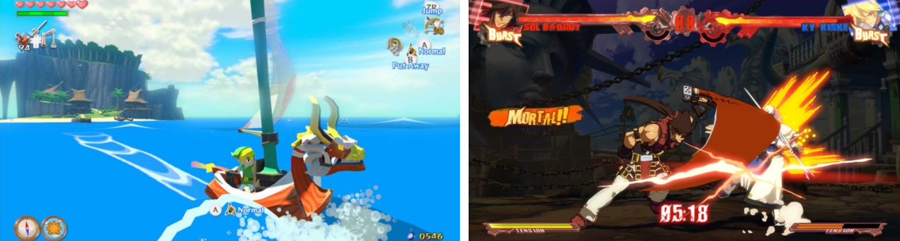
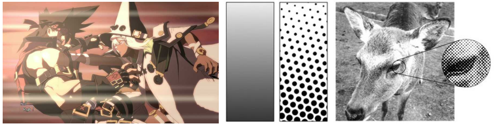
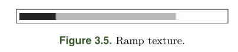
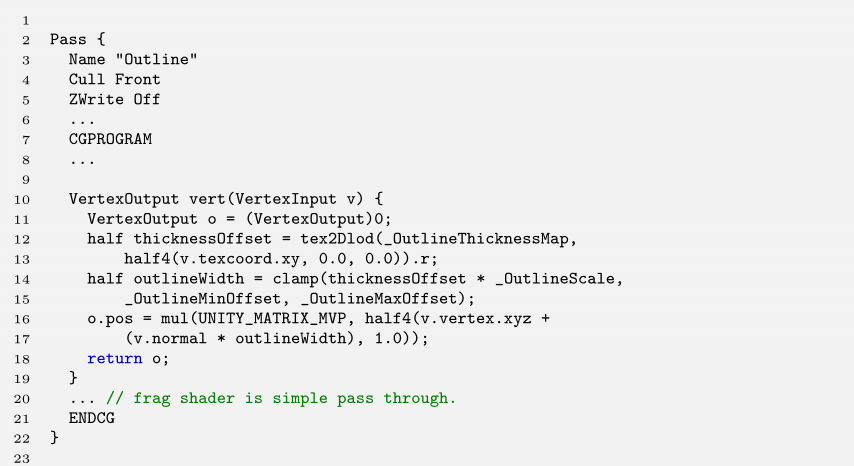
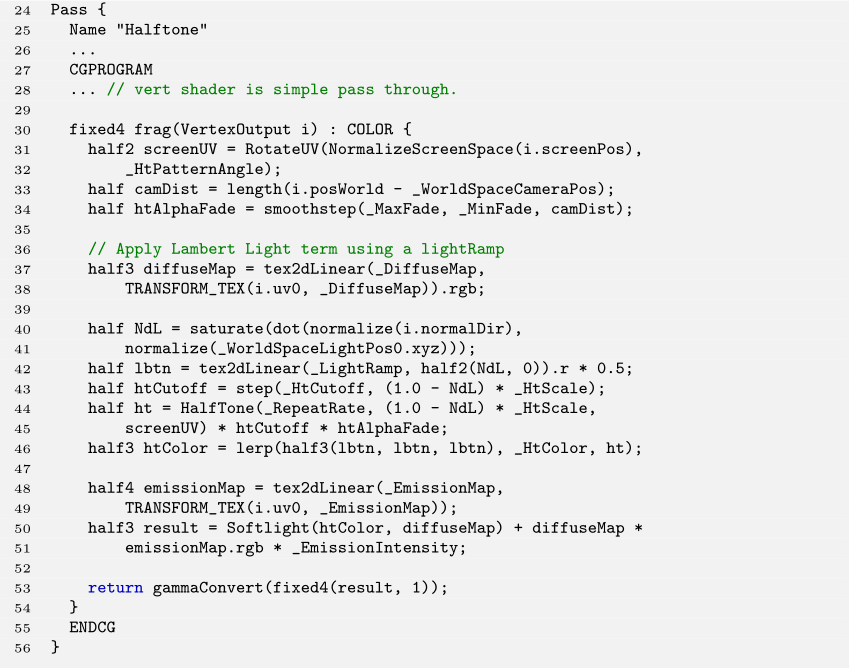

[toc]


# Mobile Toon Shading



## 1. 介绍

在这一章中，作者通过一个移动端的卡通着色技术，来描述一种独特的艺术风格。为了实现这一点，有必要使**3D场景**看起来很**平坦**——通常是通过非现实的照明模型，用较少的渲染颜色，以及通过绘制**对象的轮廓**。视觉效果可以通过使用复制技术（如半色调`halftone`）来进一步加强。==半色调技术==通过使用**不同大小或间隔的几何图形**（通常是**点**），在网格状的图案中模拟**连续色调图像**。


## 2. 技术前瞻

:one:为了实现**卡通化的艺术风格**，作者使用了几种不同的技术组合。为了使三维世界显得平坦，`Toon Shading`很重要。为了模仿动画片中的阴影，亮区和暗区之间的过渡必须是**硬的**（下图左）。另一个艺术特征，是硬轮廓的存在（下图左）。最后，在漫画中观察到的**印刷图案**（也称为**半色调图案**`halftone pattern`）的呈现（下图右），是本文艺术风格构成中的最后一笔。



本文的技术首先对模型进行预处理，并存储**每个面的法线**（用于`flat shading`）和**每个顶点的法线**（用于**生成轮廓**）。然后，在渲染循环的每一次迭代中，使用两个`pass`来组装所需的外观：

+ 在第一个`pass`中，生成基于阈值的、倒置的`hull outline`。
+ 在第二个`pass`中，使用`softlight`混合方程，来混合`albedo`和应用于`flat shading`的**半色调**。

图3.3显示了该技术的概况，图3.4显示了该技术的构成。


## 3. Flat Shading

`flat shading`是通过使用**`light-ramp`纹理**来实现的，以便定义光和模型表面之间的相互作用。$dot(N,L_{light})$被用来对`ramp texture`进行采样。`ramp texture`提供了一个**硬的过渡**，这对以后`fading`半色调图案很有用。




## 4. Soft Light Blending

然后使用==柔光方程==来混合两层图像。该效果根据**混合层**对**基础层**进行**亮化或暗化**。如果混合层中的一个像素颜色比50% 灰色要浅，那么基础层中的相应像素就会被照亮；否则，该像素就会变暗。在数学上：


其中`b`是属于混合层的颜色，`a`属于基础层。在图3.4（c）中，**柔光效果**是用图3.4 (a)作为基础层，图3.4(b)作为混合层。


## 5. Halftone-based Shadows

然后在`flat shading`上应用**半色调图案**。在半色调技术中，图像是用不同颜色和大小的点来印刷的，它们的间距可以不均匀，以便通过一种**视觉错觉**来模拟连续填充的区域。

为了再现**半色调**，作者定义了一个**基于三个参数的函数**：点的重复率、点的大小和紫外线位置。作者的表述是基于屏幕空间的，也就是说，传递给半色调函数的`UV`是`NDC`位置。在归一化之后，能够通过**旋转UV**来旋转半色调图案。该函数计算点的直径和它的中心位置；然后，计算UV相对于中心的距离，最后，考虑到这个距离和**点图案的半径**，执行一个**平滑步骤**。该函数显示在清单3.1中。

```c++
half HalfTone(half RepeatRate , half DotSize , half2 UV)
{
    half size = 1.0 / RepeatRate;
    half2 cellSize = half2(size, size);
    half2 cellCenter = cellSize * 0.5;

    // abs() to avoid negative values after rotation.
    half2 uvlocal = fmod(abs(UV), cellSize);
    half dist = length(uvlocal - cellCenter);
    half radius = cellCenter.x * DotSize;

    // Anti-Aliasing based on differentials
    half threshold = length(ddx(dist) - ddy(dist));
    return smoothstep(dist - threshold, dist + threshold, radius);
}
```

==点的大小==是根据 $dot(N,L_{light})$ 来决定的，而结果是按用户定义的数值来缩放的。作者还定义了一个截止阈值和一个基于相机距离的淡化距离。图3.4（d）显示了应用在`flat shading`上的半色调图案。


## 6. Threshold-based Inverted Hull Outline

最后，需要绘制**模型的轮廓**。通常情况下，模版缓冲区用于绘制轮廓。然而，由于想要一个移动端友好的技术，作者选择了使用计算成本较低的`hull outline`技术。

**倒置的`hull outline `技术**使用一个额外的`pass`来渲染轮廓。轮廓的生成包括 ：

1. 通过在法线方向上推动其顶点，来放大模型
2. 在没有`lighting`的情况下，用一种独特的颜色渲染缩放后的模型，同时剔除`front face`并显示`back face`（第一个`pass`）；
3. 渲染原始模型（第二个`pass`）。

如果**顶点的法线**是相邻表面法线的平均值，这种技术就可以正常工作。这里的问题是，`flat shading`需要使用**表面法线**。作者找到的解决方案是对模型进行预处理，以便在切线处存储**平均法线**。作者还使用了一个阈值图（图3.6（右））来控制应用于每个顶点的比例。


## 7. Implementation

下面可以看到用于组成结果的两个`pass`。一个`emission map`被用于第二个`Pass`的最后，以突出`Diffuse Map`的某些部分：



