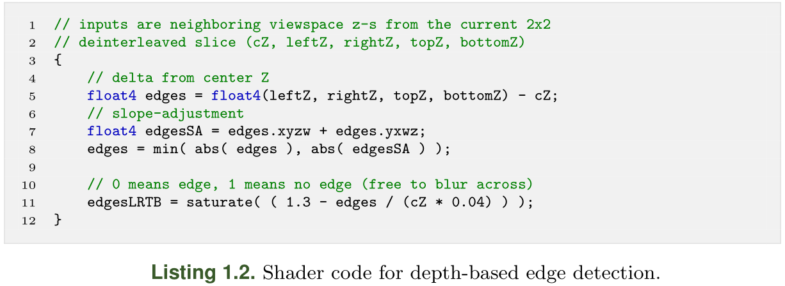

# Scalable Adaptive SSAO

## 1. 前瞻

`SSAO`已经成为实时渲染中产生小规模环境和接触阴影效果的事实标准。随着`TDP`（热设计点）的不断扩大，`GPU`市场的性能范围也随之扩大，以及VR实时性能扩展需求，本文提出了一个以**可扩展方式**实现`SSAO`的框架，以便用**同样的实现方式**，覆盖更广泛的硬件和使用情况。


## 2. 问题说明

在本章发表时，==最常用的全分辨率SSAO技术==只适用于大约`30W TDP`以上的`GPU`，这实际上排除了**轻薄的笔记本电脑**，但也排除了许多最低规格的VR场景。

使用**低于全分辨率的SSAO**（$half \times full$ 或 $half \times half$）来覆盖最低端的质量预设往往是唯一的选择，但这种方法受到质量问题的限制，如**锯齿伪影**，然后需要单独解决。

==自适应SSAO==旨在为`TDP`为`15W`到`150W`以上的独立`GPU`，以及90Hz的VR渲染，提供**全分辨率AO效果**。==渐进式采样内核==足够灵活，允许在缩放范围内逐步进行**质量/性能权衡**的微调。


## 3. ASSAO——前瞻

`ASSAO`是对标准`SSAO`的实现，在质量与性能的权衡方面，为**可扩展性**和**灵活性**进行了调整，因此它适用于更广泛的硬件和使用场景，具有**统一的设置**和**视觉一致性**。**AO的实现**是基于一个`solid angle`的`occlussion mode`，类似于`HBAO`，并采用了**自定义的新型采样内核`disk`**。

**性能和可扩展性的优化**是基于：**深度缓冲区**`mip-map`==预过滤==，$2\times 2$ 版本的缓存友好的==去交织处理==（`deinterleaved processing`）。此外，**渐进式采样内核**允许轻松调整**单个预设性能**，以及**最高端**实施可选的`per-pixel dynamic-importance sampling approach`。本文方法在**高预设**下的主要`passes`（如图1.6所示）是：

1. **准备深度**
   + 将输入的**深度缓冲区**转换为**线性空间**，并将 $2\times 2$ 的`deinterleaved`转化为 $four$ $half\times half$ 的**视图空间**
   + 为所有 $four$ $half\times half$ 深度纹理创建`MIP`
2. **生成`AO`和边缘**，并应用**智能模糊**；对 $four$ $half\times half$ `deinterleaved slice`各循环`4`次。
   + 使用上一步生成的**当前深度片**和输入的法线，生成并输出**AO和边缘**到`R8G8` $hlaf \times half$ 纹理。
   + 应用**边缘感知的智能模糊**。
3. 将前一程序的**四个输出**交织（`Interleave`）在一起，并将**最终的智能模糊**应用于**全分辨率输出的渲染目标**。

**低预设**将跳过**深度mipmap**和**边缘生成**，而**最高/自适应**有一个**额外的基础AO Pass**和其他变化，详见`1.7`节。当输入法线不可用时（例如，对于前向渲染器），会从**步骤1的输入深度**中重建一个全分辨率的法线缓冲区，供**步骤2**使用。


## 4. SSAO——A Quick Refresh

**环境遮蔽**指的是在某些条件下**产生小规模阴影的计算模型**，主要是（但不限于）**环境照明**。屏幕空间指的是只用**深度和（可选）法线缓冲区**作为输入进行计算。这意味着它是一个**后处理过程**，对渲染范围之外的场景、透明或遮挡的几何体没有任何了解——这是它的基本弱点。

> 在许多情况下，SSAO是一个足够好的全局照明的近似值。


## 5. Scaling the SSAO

在本章中，介绍了为实现**可扩展性目标**，而采取的各个步骤。还应该提到的是，由于主要关注的是**提供扩展的框架**，作者已经使其相对容易地在需要时替换**AO逻辑**（主着色器文件中的`SSAOTap`函数），或用**更复杂的效果**来扩展它，如`SSDO` 。

### 5.1 Step by Step Towards Scalable Performance\

:one:**Budgeting**

> **SSAO帧的GPU预算**的行业标准大致==低于或接近帧时间的10%==（`30 FPS`时为`3.3 ms`，`60 FPS`时为`1.6 ms`）。

**:two:Starting point—a simplistic reference algorithm**

为了更好地理解**性能瓶颈**，我们从**基本的SSAO实现**开始（图1.3），使用一个全分辨率的**单Pass像素着色器**，输入**深度和法线**，并输出一个**`ambient-occlusion`项**——用它作为一个参考和性能优化的起点。在这种形式下，**单像素着色器**有少量**固定的设置执行成本**（加载深度和法线，计算半径和采样模式的旋转等），但主要工作在于**迭代深度采样**和计算`occlusion`。`taps`越多（采样和AO 数学）越多，质量和执行成本就越高（见**表1.1**和 图1.4）。


还有**两个变量**对性能有很大影响：==分辨率==和屏幕上的**深度采样内核的大小**。当测量增加分辨率的影响时，看到了几乎2倍的增长。

**纹理采样缓存**效率低下的另一个影响是，使用**简单的测试SSAO着色器**改变**效果半径（**这反过来又改变了采样核的大小）可以使成本**增加3倍**（见表1.3）。


**成本增加的原因**：随着内核的增大，==采样之间的空间连贯性会降低，因此纹理缓存的使用效率会降低==。由于**采样核的大小**取决于**半径设置**和**视图空间距离**，这意味着**执行成本**也会因**场景内容和相机位置的不同**而有很大变化。这显示了简单化算法版本的固有低效率，并指出了==第一个可扩展性障碍==——更好地利用**纹理缓存层次**。过去有两种独立的方法被用来缓解这个问题，与其他SSAO技术不同，`ASSAO`并行使用这两种方法。

**:three:Deinterleaved processing**


在实践中（图1.5），作者把**深度采样模式**分成`4`个独立的模式，每个模式都被限制在$2\times 2$ `sub-quad`的一个像素上。这让我们把**深度缓冲区**（==主要的纹理采样瓶颈==）分成`4`个四分之一大小的缓冲区，然后**为每个缓冲区独立计算AO项**，从而把每个通道的内存域**减少四倍**。然后，在最后将这些结果结合起来（**图1.6**）。将**简单的SSAO**升级为**简单的2×2去交错方法**。


作者尝试使用**4×4的去交错方法**；虽然它完全消除了**缓存一致性的瓶颈**，但**4×4的方法**也有一些不必要的副作用：

+ Todo
+ ...


:four:**Depth mip-maps**

McGuire等人[2012]中介绍的方法是另一种**扩展缓存效率的方法**。其思路是将**深度缓冲区**预先过滤成**MIP级别**，并在采样时使用`mip-mapping`。

首先将**深度缓冲区**去交错成`4`个，然后在每个**去交错的深度缓冲区片**上创建`mip-map`。为了对mip级别的深度进行**降采样**，作者使用了**基于半径的加权平均法**，使用的半径与**AO效应半径**相同（清单1.1）。

```c++
float closestD = min( min( depths.x, depths.y ),
					  min( depths.z, depths.w ) );
float4 weights = saturate( (depths - closestD.xxxx)
				* weightCalcMul.xxxx + weightCalcAdd.xxxx );

float smartAvg = dot( weights, depths ) /
				dot( weights, float4( 1.0, 1.0, 1.0, 1.0 ) );
```

变量`depths`是一个**有四个深度输入的`float4`**；`weightCalcMul`和`weightCalcAdd`是预先计算的常数，用于计算基于效果半径的**线性[0, 1]权重**。`smartAvg`是输出。

对于计算每个`tap`的深度纹理样本`mip level`，我们使用以下公式：
$$
m=log_2(ps)+sk+gk
$$
其中：

+ `ps`是内核屏幕尺寸，单位是像素，在AO着色器中以每像素频率计算。
+ `sk`是基于样本与内核中心距离的**样本偏移**，存储在**样本内核数组**中。它被离线计算为：$log2(sampleLength) + random(-0.4, +0.4))$，存储在`samplecoordinates`数组中，并在AO着色器中采样。
+ `gk`是一个**全局偏移常数**，设置为质量和性能之间的最佳权衡值


随着**AO效果半径**的变化，成本也保持稳定。将**深度mips**与**2×2 deinter-leaved渲染**相结合的另一个好处是：深度mipss可以在没有好处的时候关闭，例如，在低分辨率和低质量预设下，**mip-map预过滤和采样mip级计算**的固定成本高于**更优化的缓存访问**所节省的性能。这有助于在各种硬件和各种分辨率下提供低质量和高质量预设之间的最佳性能。


:five:**Stochastic sampling and smart blur**

为了在合理的性能下获得**高质量的SSAO效果**，需要采用随机的渲染方法。这允许在附近的像素之间**共享AO项**，但要牺牲一些高频的细节。作者使用一个带有缩放变化的`sampling disk rotation`，并应用一个重新构建的模糊通道，来消除产生的噪声。

为了防止在重建模糊过程中，在空间上独立的表面之间泄漏效果，作者使用基于深度的（清单1.2）和（可选的）基于法线的边缘检测（清单1.3中的HLSL着色器代码）来告知**模糊Pass**。




可以注意到，产生的边缘值不是二进制的，而是在[0, 1]范围内——这个小数值用于**淡入或淡出边缘感知模糊**，以避免摄像机或场景物体移动时的**尖锐过渡**和**时间伪影**。这些边缘值在**主AO着色器**中计算一次，并与`occlusion term`一起以每个边缘两比特的压缩格式存储。

+ 在**多Pass着色器**中，**智能模糊**是在每一个去交错的AO缓冲区中独立进行的（见着色器代码中的`PSSmartBlur`）。
+ 在最后的**重建/应用着色器**中（见着色器代码中的`PSApply`）。

如前所述，**边缘检测**和**边缘感知的模糊处理**是在四个去交错的AO结果上独立进行的。这在**相邻的像素**水平线和垂直线之间留下了==一个像素的处理间隙==。为了解决这个问题，在最后的**全分辨率重建**过程中，包括**额外的边缘感知模糊**，它可以弥合这一差距。


> 在边缘感知模糊方面，低质量预设是一个例外——出于性能方面的考虑，不计算边缘，而是使用一个简单的模糊。


## 6. Sampling Kernel

Todo


## 7. Adaptive SSAO

使用**重要性启发法**来提高SSAO效果质量的想法是在[Bavoil和Sainz 2009]中提出的，其中较低分辨率的`SSAO Pass`被用来告知对**后续高分辨率通道**的需求。我们不做低分辨率的`Pass`，而是用有限的样本做一个**标准的全分辨率AO基础Pass**，根据基础Pass的差异计算==重要性图==（图1.17），然后在需要的地方继续增加样本。这种方法增加了大量的固定成本，所以只有在将质量扩展到高预设值之外时才是有益的。


