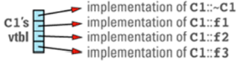
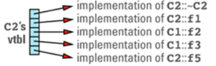
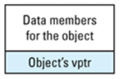
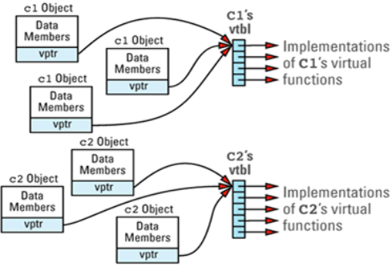
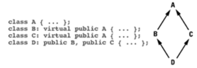
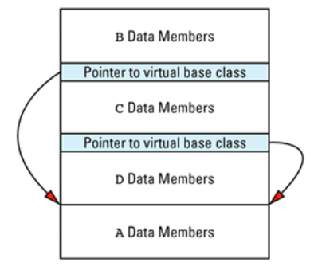
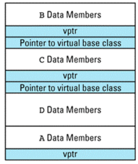
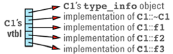
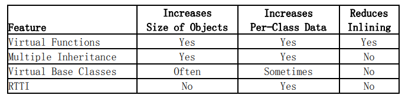

# 1. 条例16：牢记80-20准则

:one:==80-20准则==说的是：大约$20 ％$的代码使用了$80 ％$的程序资源；大约 20%的代码耗用了大约 80％的运行时间；大约 20％的代码使用了 80％的内存；大约 20％的代码执行 80％的磁盘访问；80％的维护投入于大约 20％的代码上。

一方面**80-20准则**表示**大多数时间**你能够编写**性能一般的代码**，因为80％的时间里这些代码的效率不会影响到**整个系统的性能**。

而另一方面这条准则也表示如果你的软件出现了**性能问题**，你将面临一个**困难的工作**，因为你不仅必须找到**导致问题的那一小块代码**的位置，还必须寻找方法**提高它们的性能**。

:two:**用经验**猜测程序那**20％的部分**只会**导致心痛**。**正确的方法**是用==profiler程序==识别。

`profiler `告诉你每条语句执行了多少次，或各函数被调用了多少次。这是一个**作用有限的工具**。

**最好的方法**是用尽可能多的数据`profile`你的软件。


# 2. 条款17：考虑使用lazy evaluation（懒惰计算法）

:one:当你使用了` lazy evaluation` 后，**采用此种方法的类**将推迟**计算工作**直到系统需要这些计算的结果。如果不需要结果，将不用进行计算。`lazy evaluation`广泛适用于各种应用领域，所以将分**四个部分**讲述。 

:two:**引用计数**。​

```c++
class String { ... };
String s1 = "Hello";
String s2 = s1; / 调用 string 拷贝构造函数 
```

通常 `string `拷贝构造函数让 `s2 `被` s1 `初始化后，`s1` 和` s2` 都有自己的**”Hello”拷贝**。 这种拷贝构造函数会引起**较大的开销**。然而这时的`s2` 并不需要这个值的拷贝，因为` s2 `没有被使用。

==懒惰能就是少工作==。不应该赋给` s2 `一个 `s1 `的拷贝，而是让 `s2` 与` s1` 共享一个值。仅仅` string `的值被修改时，共享同一个值的方法才会造成差异：

```c++
s2.convertToUpperCase(); 
```

为了这样执行语句，`string `的` convertToUpperCase `函数应该制作` s2 `值的一个拷贝， 在修改前把这个私有的值赋给` s2`。这时我们不能再懒惰了。

:three:**区别对待读取和写入**。

```c++
String s = "Homer's Iliad"; // 假设是一个 reference-counted string
...
cout << s[3]; // 调用 operator[] 读取 s[3]
s[3] = 'x'; // 调用 operator[] 写入 s[3]
```

我们需要在 `operator[]`里采取不同的措施（**读取还是写入**）。**残酷的事实是我们不可能判断出来**。 通过使用` lazy evaluation `和条款 `M30` 中讲述的 `proxy class`，我们可以**推迟**做出是读操作还是写操作的**决定**，直到我们能判断出正确的答案。 

:four:Lazy Fetching（**懒惰提取**）​。

假设你的程序使用了一些**包含许多字段的大型对象**。 这些对象的**生存期**超越了**程序运行期**，所以它们必须被存储在**数据库**里。每一个对都有一个**唯一的对象标识符**，用来从**数据库**中重新获得对象：

```c++
class LargeObject { // 大型持久对象
public:
    LargeObject(ObjectID id); // 从磁盘中恢复对象
    const string& field1() const; // field 1 的值
    int field2() const; // field 2 的值
    double field3() const; // ...
    const string& field4() const;
    const string& field5() const;
    ...
}; 
```

因为` LargeObject` 对象实例很大，为这样的对象获取所有的数据，**数据库操作的开销将非常大**，特别是如果从**远程数据库**中获取数据和通过**网络**发送数据时。而在这种情况下， 不需要读去所有数据。

```c++
void restoreAndProcessObject(ObjectID id)
{
    LargeObject object(id);
    if (object.field2() == 0) {
    	cout << "Object " << id << ": null field2.\n";
    }
} 
```

这里仅仅需要` filed2 `的值，所以为获取其它字段而付出的努力都是浪费。我们可以这样做：

```c++
const string& LargeObject::field1() const
{
    if (field1Value == 0) {
        从数据库中为 filed 1 读取数据，使field1Value 指向这个值;
    }
    return *field1Value;
}
```

:five:Lazy Expression Evaluation（**懒惰表达式计算**）

最后一个例子来自于数字程序，考虑：

```c++
template<class T>
class Matrix { ... }; // for homogeneous matrices
Matrix<int> m1(1000, 1000); // 一个 1000 ＊ 1000 的矩阵
Matrix<int> m2(1000, 1000); // 同上
...
Matrix<int> m3 = m1 + m2; // m1＋m2 
```

这个计算量相当大（1000000 次加法运算），应该建立一个**数据结构**来表示 `m3` 的值是` m1 `与 `m2 `的和，在用一个` enum `表示它们间是**加法操作**。我们大部分时候只需要**庞大矩阵的一小部分数据**，所以我们每次也应该只对这部分进行计算。


# 3. 条款18：分期摊还期望的计算

:one:这里不存在懒惰，这个条款的核心是**过度热情计算法**：在要求你做某些事情以前就完成它们。

```c++
template<class NumericalType> 
class DataCollection { 
public: 
    NumericalType min() const; 
    NumericalType max() const; 
    NumericalType avg() const; 
    ... 
}; 
```

对于上诉代码，比较明显的，使用**懒惰方法**不是个好选择。隐藏在` over-eager evaluation` 后面的思想是：如果你认为一个计算需要**频繁进行**，你就可以设计一个数据结构高效地处理这些**计算需求**，这样可以降低每次计算需求时的开销。

:two:采用 `over-eager` 最简单的方法就是` caching`（**缓存**）那些已经被计算出来，而以后还有可能需要的值。

:three:`Prefetching`（**预提取**）是另一种方法。你可以把 `prefech `想象成购买大批商品而获得的折扣。例如磁盘控制器从磁盘读取数据时，它们会读取一整块或整个扇区的数据，即使程序仅需要一小块数据。这是**因为一次读取一大块数据比在不同时间读取两个或三个小块数据要快**。而且经验显示如果需要一个地方的数据， 则很可能也需要它旁边的数据。这是**位置相关现象**。

根据书上的例子，我觉得STL的`vector`的**内存分配方式**就是一个好例子，当内存分配完后，会直接将内存扩大两倍，而不是就只增加一个对象的空间。

> 感觉有点：以空间换取时间


# 4. 条款19：理解临时对象的来源

:one:我们平时说的临时变量都是**函数内的局部变量**，在C++中**真正的临时变量是看不见的**。​

建立一个**没有命名的非堆对象**会产生**临时对象**。这种**未命名的对象**通常在**两种条件**下产生：

+ 为了使**函数成功调用**而进行**隐式类型转换**；
+ 函数返回对象时

:two:首先考虑为**使函数成功调用而建立临时对象**这种情况。当传送给函数的对象类型与参数类型**不匹配**时会产生这种情况。

仅当通过**传值（by value）方式**传递对象或**传递常量引用**（reference-to-const）参数时，才会发生这些**类型转换**。当传递一个**非常量引用**时，不会发生这些类型转换。

```c++
void uppercasify(string& str); // 把 str 中所有的字符改变成大写
char subtleBookPlug[] = "Effective C++"; 
uppercasify(subtleBookPlug); // 错误!
```

C++为什么阻止呢？思考下，当我们是**非常量引用**时，我们不保证不对参数进行修改，但如果进行隐式转换产生临时对象，那么修改的就是副本，而不是我们实际需要修改的传入值，所以C++**拒绝进行隐式转换**。

:three:第二种情况就是**函数返回值**（按值返回）。在概念上没有办法避免它。然而概念和现实之间又一个黑暗地带，叫做**优化**，有时你能以某种方法编写返回对象的函数，以允许**编译器**优化**临时对象**。这些优化中，最常见和最有效的是**返回值优化**，这是条款 `M20 `的内容。

:four:==临时对象是有开销的，所以你应该尽可能地去除它们==，然而更重要的是训练 自己寻找可能建立临时对象的地方。


# 5. 条款20：协助完成返回值优化

:one:无论是书上的诸多例子，还是我们平时的见闻，都应该有个模糊的认知：**消除按值传递**是个**错误的尝试**，永远不会获取胜利。

我们应该关心的是怎么减少**返回值传递**导致的**消耗**。

:two:一个技巧是返回`constructor argument`而不是直接返回对象：

```c++
const Rational operator*(const Rational& lhs, const Rational& rhs) 
{ 
    return Rational(lhs.numerator() * rhs.numerator(), lhs.denominator() * rhs.denominator()); 
}
```

看着似乎还是要付出**临时对象**的代价（这种方法还会给你带来很多开销，因为你仍旧必须为在**函数内临时对象**的构造和释放而**付出代价**，你仍旧必须为**函数返回对象**的构造和释放而付出代价）

但C++规则允许**编译器优化不出现的临时对象**（temporary objects out of existence）。因此：

```c++
Rational a = 10; 
Rational b(1, 2); 
Rational c = a * b; // 在这里调用 operator* 
```

**编译器**就会被允许消除在 operator\*内的临时变量和 operator\*返回的临时变量。==它们能在为目标 c 分配的内存里构造 return 表达式定义的对象==。如果你的编译器这样去做，调用` operator*`的临时对象的开销就是`0`：没有建立临时对象。你的代价就是调用一个构造函数――建立 `c `时调用的构造函数。

:three:进一步，还可以将函数声明为`inline`来消除`operator*`的调用开销（代码太大，会有换页开销）：

```c++
// the most efficient way to write a function returning an object 
inline const Rational operator*(const Rational& lhs, const Rational& rhs) 
{
    return Rational(lhs.numerator() * rhs.numerator(), lhs.denominator() * rhs.denominator()); 
} 
```

这种特殊的优化――通过使用函数的 `return` 位置（或者在函数被调用位置用一个对象来替代）来消除**局部临时对象**――是众所周知的和被普遍实现的。它甚至还有一个名字：==返回值优化==（return  value optimization）


# 6. 条款21：通过重载避免隐式类型转化

:one:为什么要避免**隐式转换**，我想看过上诉几个条款后，内心已经有一个理由：不能白嫖啊（要产生**临时对象**）。

那么使用**重载函数**来消除**隐式转换**，但考虑以下情况：

```c++
const UPInt operator+(int lhs, int rhs);	// 错误
```

在 C++中有一条规则是：**每一个重载的`operator`必须带有一个用户定义类型 （user-defined type）的参数**。:star:

> （如果没有这条规则，程序员将能改变**预定义的操作**，这样做肯定把程序引入混乱的境地

:two:必须谨记`80－20` 规则。没有必要实现大量的重载函数，除非你有理由确信程序使用重载函数以后其整体效率会有显著的提高。


# 7. 条款22：考虑用运算符的赋值形式（op=）取代其单独形式（op）

:one:具体分析见书，但原因总结来说：`operator` 的**赋值形式**（operator+=）比**单独形式**（operator+）效率更高。

我们可以使用**赋值形式**来实现**单独形式**：

```c++
// operator- 根据 operator -= 来实现 
const Rational operator-(const Rational& lhs, const Rational& rhs) 
{ 
 	return Rational(lhs) -= rhs; 
}
```


# 8. 条款23：考虑变更程序库

:one:因为不同的程序库在效率、可扩展性、移植 性、类型安全和其他一些领域上蕴含着不同的设计理念，通过变换使用给予**性能更多考虑的程序库**，你有时可以大幅度地提高**软件的效率**。


# 9. 条款24：理解虚函数、多继承、虚基类和RTTI所需的代价

:one:**虚函数**的实现方式是：虚函数表`vtbl`和虚函数表指针`vptr`。​

一个`vtbl`通常是一个**函数指针数组**。在程序中的每个类只要声明了**虚函数**或继承了虚函数，它就有自己的`vtbl`， 并且`vtbl`的项是指向**虚函数实现体**的指针。例如：

```c++
class C1 { 
public: 
    C1(); 
    virtual ~C1(); 
    virtual void f1(); 
    virtual int f2(char c) const; 
    virtual void f3(const string& s); 
    void f4() const; 
    ... 
}; 
```

其虚函数表看起来：（非虚函数不会在表中）



如果有一个 `C2` 类继承自`C1`：

```c++
class C2: public C1 { 
public: 
    C2(); // 非虚函数 
    virtual ~C2(); // 重定义函数 
    virtual void f1(); // 重定义函数
    virtual void f5(char *str); // 新的虚函数 
    ... 
};
```



这个论述引出了**虚函数所需的第一个代价**：你必须为每个包含虚函数的类的 `virtual talbe `留出空间。类的 `vtbl` 的大小与类中声明的**虚函数的数量**成正比（包括从基类继承的虚函数）。

:two:因为在程序里每个类只需要一个`vtbl` 拷贝，所以编译器肯定会遇到一个棘手的问题： **把它放在哪里**。大多数程序和程序库由多个` object`（目标）文件连接而成，但是每个 **object 文件**之间是独立的。哪个`object` 文件应该包含给定类的`vtbl` 呢？编译器厂商分为两个阵营：

+ 为每一个可能需要`vtbl`的 object 文件生成一个 `vtbl` 拷贝。
+ 更普通的设计方法是采用**启发式算法**来决定哪一个`object `文件应该包含类的`vtbl`。通常启发式算法是这样的：要在一个 object 文件中生成一个类的vtbl，要求该 object 文件包含该类的**第一个非内联、非纯虚函数定义** （也就是类的实现体）。因此上述 C1 类的 vtbl 将被放置到包含 C1::~C1 定义的 object 文件里。

> 实际当中，这种启发式算法效果很好。但是如果你过分喜欢声明虚函数为内联函数，如果在类中的所有虚函数都内声明为内联函数，启发式算法就会失败，大多数基于启发式算法的编译器会在每个使用它的object文件中生成一个类的vtbl。在大型系统里，这会导致程序包含同一个类的成百上千个vtbl拷贝！大多数遵循这种启发式算法的编译器会给你一些方法来人工控制vtbl的生成，但是一种**更好的解决此问题的方法是避免把虚函数声明为内联函数。**下面我们将看到，有一些原因导致现在的编译器一般总是忽略虚函数的inline指令。

:three:然后每个**含有虚函数的类**都有一个隐藏的成员`vptr`，指向**虚函数表**：



> 这幅图片表示`vptr`位于对象的底部，但是不要被它欺骗，不同的编译器放置它的位置也不同

存在继承的情况下，一个对象的`vptr`经常被**数据成员**所包围。如果存在**多继承** (Multiple inheritance)，这幅图片会变得更复杂，等会儿我们将讨论它。

如果对象很小，这是一个很大的代价。比如如果你的对象平均只有` 4` 比特的成员数据，那么额外的 `vptr` 会使成员数据大小增加一倍（假设 `vptr `大小为 `4 `比特）

假如我们有一个程序，包含几个`C1`和`C2 `对象。对象、`vptr` 和刚才我们讲述的`vtbl`之间的关系，在程序里我们可以这样去想象：



在实际运行中，**虚函数所需的代价与内联函数有关**。实际上**虚函数不能是内联的**。这 是因为“内联”是指：在编译期间，用被调用的函数体本身来代替函数调用的指令。但是虚函数的“虚”是指：直到运行时才能知道要调用的是哪一个函数。

> 这是虚函数所需的第三个代价：你实际上放弃了使用内联函数。

:four:引入**多继承**，情况更为复杂。在单个对象里有多个`vptr`（每一个基类对应一个）；除了我们已经讨论过的**单独的自己的vtbl**以外，**还得为基类生成特殊的 vtbl。** 因此增加了每个类和每个对象中的虚函数额外占用的空间，而且运行时调用所需的代价也增加了一些。

多继承还会导致**棱形继承**，进而需要**虚继承**。



使用一些编译器（特别是比较老的编译器），`D`对象会产生这样布局：



如果我们把这幅图与前面展示如何把`virtual table pointer` 加入到对象里的图片合并起来，我们就会认识到如果在上述继承体系里的基类` A `有任何虚函数，对象`D `的**内存布局**就是这样的：



还有一点奇怪的是虽然存在**四个类**，但是上述图表只有**三个vptr**。只要编译器喜欢，当然可以生成四个vptr，但是三个已经足够了（**它发现 B 和 D 能够共享一个 vptr**），大多数编译器会利用这个机会来减少编译器生成的额外负担。

:five:最后一个话题：==RRTI==。​

**RTTI** 能让我们在运行时找到**对象和类的有关信息**，所以肯定有某个地方存储了这些信息让我们查询。这些信息被存储在类型为`type_info`的对象里，你能通过使用`typeid`操作符访问一个类的`type_info`对象。 

也是每个类仅需要一个RTTI的拷贝，所以RTTI被设计为在类的vtbl基础上实现。 例如，vtbl 数组的索引 `0` 处可以包含一个 `type_info` 对象的指针，这个对象属于该 vtbl 相对应的类。上述 C1 类的 vtbl 看上去象这样：



:six:下面这个表各是对虚函数、多继承、虚基类以及 RTTI 所需**主要代价**的总结：



