# 1. 条款25：将构造函数和非成员函数虚拟化

:one:行为与**构造函数**相似，而且因为它能建立不同类型的对象，我们称它为**虚拟构造函数**。**虚拟构造函数**是指能够根据输入给它的**数据的不同**而建立**不同类型的对象**。（有点像工厂函数）

还有一种特殊种类的虚拟构造函数――**虚拟拷贝构造函数**――也有着广泛的用途。**虚拟拷贝构造函数**能返回一个**指针**，指向调用该函数的对象的**新拷贝**。因为这种行为特性，虚拟拷贝构造函数的名字一般都是`copySelf`。

```c++
class TextBlock: public NLComponent {
public:
    virtual TextBlock * clone() const // virtual copy
    { return new TextBlock(*this); } // constructor
    ...
};

class Graphic: public NLComponent {
public:
    virtual Graphic * clone() const // virtual copy
    { return new Graphic(*this); } // constructor
    ...
}; 
```

:star:上述代码的实现利用了较宽松的==虚拟函数返回值类型规则==。被派生类**重定义的虚拟函数**不用必须与基类的虚拟函数具有一样的**返回类型**。如果函数的返回类型是一个**指向基类的指针**（或一个引用），那么派生类的函数可以返回一个**指向派生类的指针**（或引用）。

:two:**非成员函数**也不能成为真正的虚拟函数，但可以根据**参数的不同动态类型**而其行为特性也不同。

```c++
class Graphic: public NLComponent {
public:
    virtual ostream& print(ostream& s) const;
    ...
};

inline ostream& operator<<(ostream& s, const NLComponent& c)
{
    return c.print(s);
} 
```

**具有虚行为的非成员函数**很简单。你编写一个**虚函数**来完成工作，然后再写一个**非虚函数**，它什么也不做**只是调用这个虚函数**。为了避免这个句法花招引起**函数调用开销**， 可以**内联**这个非虚函数。


# 2. 条款26：限制某个类所能产生的对象数量:star:

:one:先考虑只允许建立**零个或一个**的情况。可以将类的**构造函数**声明为`private`，然后使用一个函数来生成（==单例模式==）：

```c++
class PrintJob; // forward 声明
 // 参见 Effective C++条款 34
class Printer {
public:
    void submitJob(const PrintJob& job);
    void reset();
    void performSelfTest();
    ...
    friend Printer& thePrinter();

private:
    Printer();
    Printer(const Printer& rhs);
    ...
};

Printer& thePrinter()
{
    static Printer p; // 单个打印机对象
    return p;
} 
```

在`thePrinter`的实现上有两个微妙的不引人注目的地方，值得我们看一看：

- 第一，唯一的`Pritner`对象是位于**函数里的静态成员**而不是在**类中的静态成员**。
  - **类中的静态对象**实际上==总是被构造（和释放），即使不使用该对象==。与此相反，只有第一次执行函数时，才会建立**函数中的静态对象**，所以如果没有调用函数，就不会建立对象。:star:
  - 把 `Printer` 声明为**类中的静态成员**还有一个缺点，它的**初始化时间不确定**。
- 第二个细微之处是**内联**与**函数内静态对象**的关系。**内联**意味着**编译器**用**函数体**替代该对函数的每一个调用。**非成员函数**还有其它的含义。它还意味着 ==internal linkage==（内部链接）。 “**带有内部链接的函数**可能在程序内被**复制**（也就是说**程序的目标代码**可能包含一个以上的内部链接函数的代码），这种复制也包括**函数内的静态对象**。如果建立一个**包含局部静态对象的非成员函数**，你==可能会使程序的静态对象的拷贝超过一个==。

:two:我们可能会认为只需简单地计算**对象的数目**，一旦需要太多的对象，就抛出异常，这样做也许会更好。

```c++
 ...
private:
    static size_t numObjects;
    Printer(const Printer& rhs); // 这里只能有一个 printer，所以不允许拷贝
}; 
-----------------------------------------------
size_t Printer::numObjects = 0;
Printer::Printer()
{
    if (numObjects >= 1) {
        throw TooManyObjects();
    }
    ++numObjects;
}

Printer::~Printer()
{
    --numObjects;
}
```

这种限制建立对象数目的方法有**两个较吸引人的优点**。一个是它是直观的，每个人都能理解它的用途。另一个是很容易推广它的用途，可以允许建立对象最多的数量大于1。 

但是这会存在一个显示的问题，考虑一个派生类`ColorPrinter`，以及：

```c++
Printer p;
ColorPrinter cp; 
```

这两个定义会产生多少` Pritner `对象？答案是**两个**：一个是 `p`，一个是 `cp`。在运行时， 当构造` cp `的基类部分时，会抛出` TooManyObjects`异常。或者`Printer`作为成员被包含在其他类中，也会存在这种错误的**抛异常**。本质上是`Printer`可以存在于**三种不同的环境**：本身、其他派生类的基类、被嵌入到更大的对象中。通常我们只考虑限制第一种情况的数量。

:three:考虑[**1**]的情况，我们可以很容易设计出一个**无法衍生出派生类的类**：

```c++
class FSA {
public:
    // 伪构造函数
    static FSA * makeFSA();
    static FSA * makeFSA(const FSA& rhs);
    ...
private:
    FSA();
    FSA(const FSA& rhs);
    ...
};

FSA * FSA::makeFSA()
{ return new FSA(); }

FSA * FSA::makeFSA(const FSA& rhs)
{ return new FSA(rhs); } 
```

下面这个经过修改的 `Printer `类的代码实现，最多允许 `10 `个 `Printer `对象存在： 

```c++
class Printer {
public:
    class TooManyObjects{};
    // 伪构造函数
    static Printer * makePrinter();
    static Printer * makePrinter(const Printer& rhs);
    ...
private:
    static size_t numObjects; 
    static const size_t maxObjects = 10; // 见下面解释
    Printer();
    Printer(const Printer& rhs);
};

// Obligatory definitions of class statics
size_t Printer::numObjects = 0;
const size_t Printer::maxObjects;

Printer::Printer()
{
    if (numObjects >= maxObjects) {
    	throw TooManyObjects();
    }
    ...
}

Printer::Printer(const Printer& rhs)
{
    if (numObjects >= maxObjects) {
    	throw TooManyObjects();
    }
    ...
}

Printer * Printer::makePrinter()
{ 
	return new Printer; 
}

Printer * Printer::makePrinter(const Printer& rhs)
{ 
	return new Printer(rhs); 
} 
```

:four:一个**具有对象计数功能的基类**。

把**初始化静态成员**撇在一边不说，上述的方法使用起来就像咒语一样灵验，但是另一方面也有些繁琐。如果有大量像 `Printer` 需要**限制实例数量的类**，就必须一遍又一遍地编写一样的代码，每个类编写一次。应该有一种方法能够自动处理这些事情。

很容易地能够编写一个**具有实例计数功能的基类**，然后让像 `Printer `这样的类从该基类继承。我们使用一种更好的方法封装全部的计数功能，不但封装**维护实例计数器的函数**，而且也封装**实例计数器本身**。

```c++
template<class BeingCounted>
class Counted {
public:
    class TooManyObjects{}; // 用来抛出异常
    static int objectCount() { return numObjects; }
    
protected:
    Counted();
    Counted(const Counted& rhs);
    ~Counted() { --numObjects; }
    
private:
	static int numObjects;
 	static const size_t maxObjects;
	void init(); // 避免构造函数的代码重复
};

template<class BeingCounted>
Counted<BeingCounted>::Counted()
{ 
	init(); 
}

template<class BeingCounted>
Counted<BeingCounted>::Counted(const Counted<BeingCounted>&)
{ 
	init(); 
}

template<class BeingCounted>
void Counted<BeingCounted>::init()
{
    if (numObjects >= maxObjects) throw TooManyObjects();
    ++numObjects;
} 
```

现在我们能修改`Printer`类，这样使用 `Counted `模板： 

```c++
class Printer: private Counted<Printer> {
public:
    // 伪构造函数
    static Printer * makePrinter();
    static Printer * makePrinter(const Printer& rhs);
    ~Printer();
    void submitJob(const PrintJob& job);
    void reset();
    void performSelfTest();
    ...
    using Counted<Printer>::objectCount; // 参见下面解释
    using Counted<Printer>::TooManyObjects; // 参见下面解释
    
private:
    Printer();
    Printer(const Printer& rhs);
 }; 
```

`Counted `所做的大部分工作对于 `Printer `的用户来说都是隐藏的，但是这些用户可能很想知道有当前多少 `Printer `对象存在。`Counted `模板提供了 `objectCount `函数，用来提供这种信息，但是因为我们使用 `private` 继承，这个函数在` Printer `类中成为了` private`。为了恢复该函数的` public `访问权，我们使用 `using `声明。

最后还有一点需要注意，必须定义` Counted `内的**静态成员**。对于` numObjects `来说，这很容易——我们只需要在` Counted `的实现文件里定义它即可： 

```c++
template<class BeingCounted> // 定义 numObjects
int Counted<BeingCounted>::numObjects; // 自动把它初始化为 0 
```

对于 `maxObjects `来说，简t单的方法就是什么也不做。我们不对` maxObject `进行初始化。而是让**此类的客户端**提供合适的初始化。`Printer`的作者必须把这条语句加入到一个实现文件里：

```c++
const size_t Counted<Printer>::maxObjects = 10;
```


# 3. 条款27：要求或禁止在堆中产生对象:star:

==不在堆中分配对象，从而保证某种类型的类不会发生内存泄漏==。如果你在**嵌入式系统**上工作，就有可能遇到这种情况，发生在嵌入式系统上的**内存泄漏**是极其严重的。

**:one:要求在堆中建立对象** 

让我们先从**必须在堆中建立对象**开始说起。为了执行这种限制，你必须找到一种方法禁止以调用`new`以外的其它手段建立对象。**非堆对象**在定义它的地方被自动构造，在**生存时间**结束时自动被释放，所以只要禁止使用**隐式的构造函数和析构函数**，就可以实现这种限制。

把这些调用变得不合法的一种**最直接的方法**是把**构造函数**和**析构函数**声明为 `private`。 这样做副作用太大。没有理由让这两个函数都是` private`。**最好让析构函数成为 private**， 让构造函数成为 `public`。可以引进一个专用的**伪析构函数**，用来访问真正的**析构函数**。

```c++
class UPNumber {
public:
    UPNumber();
    UPNumber(int initValue);
    UPNumber(double initValue);
    UPNumber(const UPNumber& rhs);
    // 伪析构函数 (一个 const 成员函数， 因为即使是 const 对象也能被释放。)
    void destroy() const { delete this; }
    ...
private:
	~UPNumber();
};

//然后客户端这样进行程序设计：
UPNumber n; // 错误! (在这里合法， 但是当它的析构函数被隐式地调用时，就不合法了)
UPNumber *p = new UPNumber; //正确
...
delete p; // 错误! 试图调用 private 析构函数
p->destroy(); // 正确 
```

**另一种方法**是把**全部的构造函数**都声明为 `private`。这种方法的缺点是一个类经常有许多构造函数，类的作者必须记住把它们都声明为` private`。否则如果这些函数就会由编译器生成，构造函数包括**拷贝构造函数**，也包括**缺省构造函数**。

通过限制访问一个**类的析构函数或它的构造函数**来阻止建立**非堆对象**，但是在**条款 26** 已经说过，这种方法也禁止了**继承和包容**（containment）。通过把**析构函数**声明为`protected`（同时它的构造函数还保持`public`）就可以解决继承的问题。

:two:**判断一个对象是否在堆中**。​

`UPNumber` 构造函数不可能判断出它是否做为**堆对象的基类**而被调用。也就是说对于`UPNumber`的构造函数来说没有办法侦测到下面两种环境的区别：

```c++
NonNegativeUPNumber *n1 = new NonNegativeUPNumber; // 在堆中
NonNegativeUPNumber n2; //不再堆中
```

或许我们会想到，在`operator new`操作种，设置一个**标志位**，代表是在堆上建立的对象，但是呢，会有诸多问题：例如`new`一个数组、编译器代码执行顺序等问题，具体分析见书。这个思路没有错，我们可以利用这样一个事实：程序的地址空间被做为**线性地址管理**，程序的**栈**从地址空间的**顶部向下扩展**，**堆**则从**底部向上扩展**：

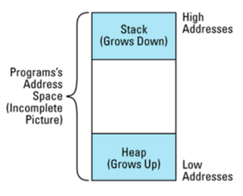

在以这种方法管理**程序内存**的系统里（也有很多不是这样），可能会想能够使用下面这个函数来判断**某个特定的地址**是否在堆中： 

```c++
bool onHeap(const void *address)
{
    char onTheStack; // 局部栈变量
    return address < &onTheStack;
} 
```

这个函数背后的思想很有趣。在` onHeap `函数中` onTheSatck `是一个**局部变量**。因此它在**栈**上。当调用 `onHeap` 时，它的**栈框架**（`stack frame`）(也就是它的` activation record`) 被放在**程序栈的顶端**，因为**栈**在结构上是**向下扩展**的（趋向**低地址**），`onTheStack `的地址肯定比**任何栈中的变量或对象**的地址小。如果参数 `address` 的地址小于 `onTheStack `的地址， 它就不会在**栈**上，而是肯定在**堆**上。 

但我们别忘了**静态对象**，一般系统完整的情况如下：

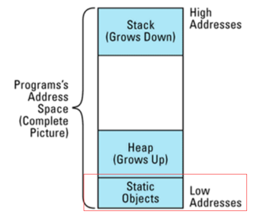

而我们貌似完美的`onHeap`不能辨别**堆对象**和**静态对象**。继续修补程序？令人伤心的是不仅**没有一种可移植的方法**来判断对象**是否在堆上**，而且连能在多数时间正常工作的**“准可移植”的方法**也没有。

如果你发现自己实在为**对象是否在堆中**这个问题所困扰，一个可能的原因是你想知道**对象是否能在其上安全调用 delete**。幸运的是，“判断是否能够删除一个指针”比“判断一个指针指向的事物是否在堆上”要容易。因为对于前者我们只需要一个` operator new `返回的**地址集合**。

```c++
void *operator new(size_t size)
{
 void *p = getMemory(size); //调用一些函数来分配内存，处理内存不够的情况
 把 p 加入到一个被分配地址的集合;
 return p;
}

void operator delete(void *ptr)
{
    releaseMemory(ptr); // return memory to free store
    从被分配地址的集合中移去 ptr;
}

bool isSafeToDelete(const void *address)
{
    返回 address 是否在被分配地址的集合中;
} 
```

有**三种因素**制约着对这种设计方式的使用（具体见书）。更好的方法是使用一种抽象`mixin`基类

```c++
class HeapTracked { // 混合类; 跟踪从 operator new 返回的 ptr
public: 
    class MissingAddress{}; // 异常类，见下面代码
    virtual ~HeapTracked() = 0;
    static void *operator new(size_t size);
    static void operator delete(void *ptr);
    bool isOnHeap() const;
    
private:
    typedef const void* RawAddress;
    static list<RawAddress> addresses;
}; 
```

```c++
// mandatory definition of static class member
list<RawAddress> HeapTracked::addresses;

// HeapTracked 的析构函数是纯虚函数，使得该类变为抽象类。
// (参见 Effective C++条款 14). 然而析构函数必须被定义，所以我们做了一个空定义。.
HeapTracked::~HeapTracked() {}

void * HeapTracked::operator new(size_t size)
{
    void *memPtr = ::operator new(size); // 获得内存
    addresses.push_front(memPtr); // 把地址放到 list 的前端
    return memPtr;
}

void HeapTracked::operator delete(void *ptr)
{
    //得到一个 "iterator"，用来识别 list 元素包含的 ptr；有关细节参见条款 35
    list<RawAddress>::iterator it = find(addresses.begin(), addresses.end(), ptr);
    // 如果发现一个元素则删除该元素
    if (it != addresses.end()) { 
        addresses.erase(it); 
        ::operator delete(ptr); 
    } 
    else { 
        // 否则 ptr 就不是用 operator new 分配的，所以抛出一个异常
        throw MissingAddress();
    }
}

bool HeapTracked::isOnHeap() const
{
    // 得到一个指针，指向*this 占据的内存空间的起始处，有关细节参见下面的讨论
    const void *rawAddress = dynamic_cast<const void*>(this);
    // 在 operator new 返回的地址 list 中查到指针
    list<RawAddress>::iterator it = find(addresses.begin(), addresses.end(), rawAddress);
    return it != addresses.end();
} 
```

使用这个类，即使是最初级的程序员也可以在类中加入**跟踪堆中指针**的功能。他们所需要做的就是让他们的类从` HeapTracked` 继承下来。例如我们想判断` Assert `对象指针指向的是否是**堆对象**： 

```c++
class Asset: public HeapTracked {
private:
    UPNumber value;
    ...
}; 
```

`HeapTracked `这样的**混合类**有一个缺点，它不能用于**内建类型**。

:three:**禁止堆对象** 

与此相反的领域是“**禁止在堆中建立对象**”。通常对象的建立这样**三种情况**：对象被直接实例化；对象做为派生类的基类被实例化；对象被嵌入到其它对象内。我们将按顺序地讨论它们。

**禁止用户直接实例化对象很简单**，因为总是调用` new `来建立这种对象，你能够禁止用户调用` new`。你不能影响 `new `操作符的**可用性**，但是你能够利用` new `操作符总是调用 `operator new `函数这点（参见条款 M8），来达到目的。可以自己声明这个函数，而且可以把它声明为` private`。

```c++
class UPNumber {
private:
    static void *operator new(size_t size);
    static void operator delete(void *ptr);
    ...
}; 

//test
UPNumber n1; // okay
static UPNumber n2; // also okay
UPNumber *p = new UPNumber; // error! attempt to call private operator new
```

把 `operator new `声明为 `private `就足够了，但是把 `operator new `声明为` private`，而 把` operator delete `声明为` public`，这样做有些怪异，所以除非有绝对需要的原因，否则不要把它们分开声明。

有趣的是，把 `operator new` 声明为` private `经常会阻碍` UPNumber` 对象做为一个位于**堆中的派生类对象的基类**被实例化。因为` operator new `和 `operator delete` 是==自动继承的==， 如果 `operator new `和 `operator delete `没有在**派生类**中被声明为 `public`（ overwrite），它们就会继承基类中` private `的版本。 

`UPNumber` 的 `operator new `是` private `这一点，不会对包含 `UPNumber` 成员对象的**对象的分配**产生任何影响： 

```c++
class Asset {
public:
    Asset(int initValue);
    ...
        
private:
 	UPNumber value;
};

Asset *pa = new Asset(100); // 正确, 调用Asset::operator new 或::operator new, 不是UPNumber::operator new 
```

正像没有可移植的方法来判断地址是否在堆中一样，也没有可移植的方法判断地址**是否不在堆中**，但学下上诉技巧总是好的。


# 4. 条款28：灵巧指针

:one:就是智能指针，一般模板如下：

```c++
template<class T>	//灵巧指针对象模板
class SmartPtr {
public:
    SmartPtr(T* realPtr = 0); // 建立一个灵巧指针, 指向 dumb pointer 所指的对象。未初始化的指针缺省值为 0(null)
    SmartPtr(const SmartPtr& rhs); // 拷贝一个灵巧指针
    ~SmartPtr(); // 释放灵巧指针
    SmartPtr& operator=(const SmartPtr& rhs);
    T* operator->() const; // dereference 一个灵巧指针以访问所指对象的成员
    T& operator*() const; // dereference 灵巧指针
    
private:
 	T *pointee; // 灵巧指针所指的对象
}; 
```

:two:灵巧指针的构造、赋值和析构。​

灵巧指针**拷贝构造函数**、**赋值操作符函数**和**析构函数**的实现由于（所指对象的）所有权的问题所以有些复杂。如果一个灵巧指针拥有它指向的对象，当它被释放时必须负责删除这个对象。

看一下标准C++类库中` auto_ptr `模板

```c++
template<class T>
class auto_ptr {
public:
    auto_ptr(T *ptr = 0): pointee(ptr) {}
    ~auto_ptr() { delete pointee; }
    ...
private:
	T *pointee;
}; 
...
auto_ptr<TreeNode> ptn1(new TreeNode);
auto_ptr<TreeNode> ptn2 = ptn1; // 调用拷贝构造函数会发生什么情况？
auto_ptr<TreeNode> ptn3;
ptn3 = ptn2; // 调用 operator=;会发生什么情况?
```

如果我们只拷贝内部的` dumb pointer`，会导致两个` auto_ptr `指向一个相同的对象。这是一个灾难，因为当释放` auto_ptr `时每个` auto_ptr `都会删除它们所指的对象。另一种方法是通过调用` new`，建立一个**所指对象的新拷贝**。这确保了不会有许多指向同一个对象的` auto_ptr`，但是建立（以后还得释放）新对象会造成**不可接受的性能损耗**。

:three:如果 `auto_ptr `禁止**拷贝和赋值**，就可以消除这个问题，但是采用“当 auto_ptr 被拷贝和赋值时，对象所有权随之被传递”的方法，是一个**更具灵活性的解决方案**： 

```c++
template<class T>
class auto_ptr {
public:
    ...
    auto_ptr(auto_ptr<T>& rhs); // 拷贝构造函数
    auto_ptr<T>& operator=(auto_ptr<T>& rhs);
    ...
};

template<class T>
auto_ptr<T>::auto_ptr(auto_ptr<T>& rhs)
{
    pointee = rhs.pointee; // 把*pointee 的所有权传递到 *this
    rhs.pointee = 0; // rhs 不再拥有任何东西
}

template<class T>
auto_ptr<T>& auto_ptr<T>::operator=(auto_ptr<T>& rhs)
{
    if (this == &rhs) // 如果这个对象自我赋值什么也不要做
        return *this; 
    delete pointee; // 删除现在拥有的对象
    pointee = rhs.pointee; // 把*pointee 的所有权从 rhs 传递 *this
    rhs.pointee = 0;
    return *this;
} 
```

:four:智能指针的**析构函数**（简单版本）通常是这样：

```c++
template<class T>
SmartPtr<T>::~SmartPtr()
{
    if (*this owns *pointee) {
        delete pointee;
    }
} 
```

:five:让我们把注意力转向智能指针的核心部分，`operator*`和`operator->`函数。前者返回所指的对象：

```c++
template<class T>
T& SmartPtr<T>::operator*() const
{
    perform "smart pointer" processing;
    return *pointee;
} 
```

注意**返回类型**是一个**引用**。理由和之前的各个相关条款大致相同。

```c++
template<class T>
T* SmartPtr<T>::operator->() const
{
    perform "smart pointer" processing;
    return pointee;
} 
```

:six:测试灵巧指针是否为`NULL`​

目前为止我们讨论的函数能让我们建立、释放、拷贝、赋值、`dereference` 灵巧指针。 但是有一件我们做不到的事情是：发现灵巧指针为` NULL`。

在灵巧指针类里加入一个 `isNull `成员函数是一件很容易的事，但是没有解决当测试` NULL `时**灵巧指针的行为**与 `dumb pointer `不相似的问题。另一种方法是提供**隐式类型转换操作符**，允许编译上述的测试。一般应用于这种目的的类型转换是 `void* `：

```c++
template<class T>
class SmartPtr {
public:
 ...
 operator void*(); // 如果灵巧指针为 null，返回 0， 否则返回非 0。
 ... 
}; 
SmartPtr<TreeNode> ptn;
...
if (ptn == 0) ... // 现在正确
if (ptn) ... // 也正确
if (!ptn) ... // 正确
```

它有一个缺点：在一些情况下虽然大多数程序员希望它调用失败，但是函数确实能够成功地被调用（参见条款 M5）。特别是它允许灵巧指针与完全不同的类型之间进行比较： 

```c++
SmartPtr<Apple> pa;
SmartPtr<Orange> po;
...
if (pa == po) ... // 这能够被成功编译! 
```

有一种**两全之策**可以提供合理的测试` null `值的语法形式，同时把不同类型的灵巧指针之间进行**比较的可能性**降到最低。这就是在灵巧指针类中重载 `operator!`，当且仅当**灵巧指针**是一个**空指针**时，`operator!`返回` true`： 

```c++
template<class T>
class SmartPtr {
public: 
    ...
    bool operator!() const; // 当且仅当灵巧指针是空值，返回 true。
    ... 
};
```

```c++
SmartPtr<TreeNode> ptn;
...
if (!ptn) { 
	...  // ptn 是空值
}
else {
	... // ptn 不是空值
}

if (ptn == 0) ... // 仍然错误
if (ptn) ... // 也是错误的 

//仅在这种情况下会存在不同类型之间进行比较
SmartPtr<Apple> pa;
SmartPtr<Orange> po;
...
if (!pa == !po) ... // 能够编译
```

:seven:把**灵巧指针**转变成` dumb `指针，在**灵巧指针模板**中增加指向` T` 的` dumb `指针的**隐式类型转换操作符**：

```c++
void normalize(Tuple *pt); 

template<class T> // 同上
class DBPtr {
public:
    ...
    operator T*() { return pointee; }
    ...
};
DBPtr<Tuple> pt; 

...
normalize(pt); // 能够运行
```

并且这个函数也消除了**测试空值**的问题：

```c++
if (pt == 0) ... // 正确, 把 pt 转变成Tuple*
if (pt) ... // 同上
if (!pt) ... // 同上 (reprise) 
```

然而，它也有**类型转换函数**所具有的缺点（几乎总是这样，看**条款 M5**）。它使得用户能够很容易地直接访问` dumb` 指针，绕过了**“类指针（pointer-like）”对象**所提供的**“灵巧” 特性**:

```c++
void processTuple(DBPtr<Tuple>& pt)
{
    Tuple *rawTuplePtr = pt; // 把 DBPtr<Tuple> 转变成Tuple*
    使用 raw TuplePtr 修改 tuple;
} 
```

通常，**灵巧指针**提供的“灵巧”行为特性是设计中的主要组成部分，所以允许用户使用` dumb` 指针会导致**灾难性的后果**。例如，如果 `DBPtr `实现了条款 M29 中**引用计数**的功能，允 许客户端直接对` dumb `指针进行操作很可能破坏**“引用计数”数据结构**，而导致引用计数错误。

甚至即使你提供一个从**灵巧指针**到` dumb `指针的**隐式转换操作符**，灵巧指针也不能真正地做到与 `dumb `指针互换。因为从**灵巧指针**到` dumb `指针的转换是“**用户定义类型转换**”，在==同一时间编译器进行这种转换的次数不能超过一次==。

而且这种**自定义类型转换**还会暴露一个大`BUG`：

```c++
DBPtr<A> pt = new A;
... 
delete pt;
```

这段代码按理来说不能通过编译，因为我们不能`delete`一个对象（`pt`），但是事实上会通过。因为`delete`时，编译器会尽可能保证程序调用成功，会将`pt`智能指针对象转换为`A*`，然会删除这个堆对象。然后呢？当pt析构时，会再次删除这个堆对象——**一个对象被删除了两次**！

所以说，除非必要，不要使用:seven:的这个方法！

:eight:智能指针和**继承类到基类的类型转换**。

这两者分开来都是好小伙，但是合在一起呢？

```c++
class A;
class B : public A;
class C : public C;
void func(const auto_ptr<A>&);
...
auto_ptr<B> b;
auto_ptr<C> c;
func(b);  //error
func(c);  //error
```

套上**智能指针**之后，它们在**编译器**眼中就不是一家人了。解决方法很简单，核心思想：对于可以进行**隐式类型转换**的每个**智能指针**都提供这样一个操作符：

```c++
class SmartPtr<Cassette> {
public:
    operator SmartPtr<MusicProduct>() 
    { 
        return SmartPtr<MusicProduct>(pointee); 
    } 
...
private:
    Cassette *
}; 
```

这个方法有两个缺点，第一：必须**人为特化**智能指针类。第二：可能必须添加许多**类型转换符**。因为你指向的对象可以位于**继承层次中很深的位置**，你必须为直接或间接继承的**每一个基类**提供一个**类型转换符**。（为什么不仅定义直接基类的转换操作符，然后层层转换？别忘了，==编译器同一时间只进行一次自定义类型的转换操作==）

一个更好的办法是使用==成员模板==：

```c++
template<class T> // 模板类，指向 T
class SmartPtr { // 灵巧指针
public:
    SmartPtr(T* realPtr = 0);
    T* operator->() const;
    T& operator*() const;
    
    template<class newType>
    operator SmartPtr<newType>() 
    {
    	return SmartPtr<newType>(pointee);
    }
    ...
}; 
```

> 假设编译器有一个指向 T 对象的灵巧指针， 它要把这个对象转换成指向“T 的基类”的灵巧指针。编译器首先检查 SmartPtr的类定义，看其有没有声明明确的类型转换符，但是它没有声明。编译器然后检查是否存在一个成员函数模板，并可以被实例化成它所期望的类型转换。它发现了一个这样的模板（带有形式类型参数 newType），所以它把 newType 绑定成 T 的基类类型来实例化模板。这时，惟一的问题是实例化的成员函数代码能否被编译： 指针 pointee 是指向 T 类型的，把它转变成指向其基类（public 或 protected）对象的指针必然是合法的，因此类型转换操作符能够被编译，可以成功地把指向 T 的灵巧指针隐式地类型转换为指向“T 的基类”的灵巧指针。

这种方法可以成功地用于**任何合法的指针类型转换**。如果你有 `dumb`指针 `T1*`和另一种 `dumb` 指针` T2*`，当且仅当你能隐式地把` T1*`转换为 `T2*`时，你就能够隐式地把指向 `T1` 的灵巧指针类型转换为指向 `T2` 的灵巧指针类型。 

总结来说：最好的方法是使用**成员模板**生成**类型转换函数**，在会产生**二义性结果**的地方使用 `casts`。这不是一个完美的方法，不过已经很不错了，在一些情况下需去除**二义性**，所付出的代价与**灵巧指针提供的复杂功能**相比还是值得的。 

:nine:**灵巧指针**和 `const`

具体见书。


# 5. 条款29：引用计数

:one:考虑如下类：

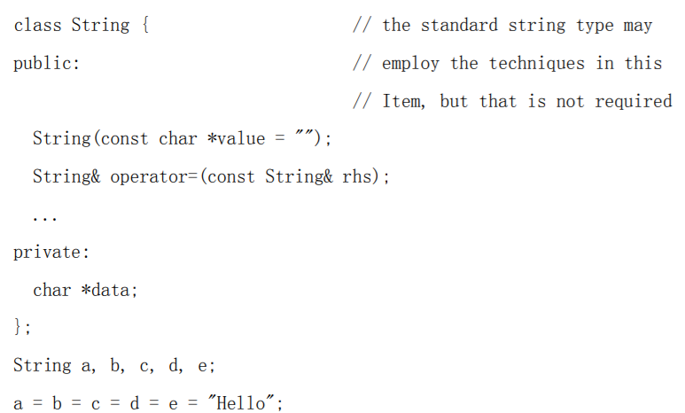

通常来说，是这样的：

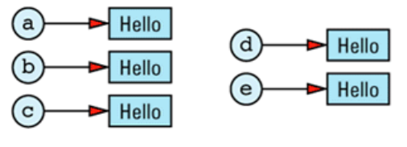

其冗余是显然的。在一个理想的世界中，我们希望将上图改为这样：

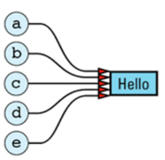

保存当前**共享/引用同一个值的对象数目**的需求意味着我们的那张图必须增加一个**计数值**（引用计数）： 

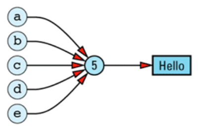

**:two:实现引用计数**。​

在开始之前，认识到“**我们需要一个地方来存储这个计数值**”是很重要的。这个地方不能在` String `对象内部，因为需要的是每个 `String `值一个**引用计数值**，而不是每个` String `对象一个引用计数。这意味着 String 值和引用计数间是**一一对应**的关系，所以我们将创建一个类来保存**引用计数及其跟踪的值**。我们叫这个类` StringValue`，又因为它唯一的用处就是帮助我们实现` String `类，所以我们将它嵌套在 `String `类的**私有区**内。

为了便于` Sting` 的所有成员函数读取其**数据区**，我们将 `StringValue` 申明为` struct`。需要知道的是：将一个` struct` 内嵌在**类的私有区**内，能便于这个类的所有成员访问这个结构，但阻止了其它任何人对它的访问（除了友元）：

```c++
class String {
public:
 ... // the usual String member functions go here
private:
 struct StringValue { ... }; // holds a reference count and a string value
 StringValue *value; // value of this String
};
```

具体实现

```c++
class String {
private:
    struct StringValue {
        int refCount;
        char *data;
        StringValue(const char *initValue);
        ~StringValue();
	};
 ...
};

String::StringValue::StringValue(const char *initValue) : refCount(1)
{
	data = new char[strlen(initValue) + 1];
 	strcpy(data, initValue);
}

String::StringValue::~StringValue()
{
 	delete [] data;
}
```

这是其所有的一切，很清楚，这不足以实现**带引用计数的 `String` 类**。一则，没有**拷贝构造函数**和**赋值运算**（见 `Item E11`）；二则，没有提供对` refCount` 的操作。别担心，少掉的功能将由 `String `类提供。`StringValue` 的**主要目的**是提供一个空间**将一个特别的值和共享此值的对象的数目联系起来**。`StringValue` 给了我们这个，这就足够了。

:three:我们现在开始处理 `String` 的成员函数。首先是**构造函数**：

```c++
class String {
public:
    String(const char *initValue = "");
    String(const String& rhs);
    ...
};
```

第一个**构造函数**实现得尽可能简单。我们用传入的 `char *`字符串创建了一个新的 `StringValue `对象，并将我们正在构造的` string `对象指向这个新生成的` StringValue`： 

```c++
String::String(const char *initValue) : value(new StringValue(initValue))
{} 
...
String s1("More Effective C++");
String s2("More Effective C++");
```

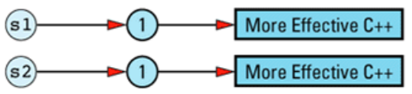

> 消除这样的副本是可能的：通过让 String（或 StringValue）对象跟踪已存在的 StringValue 对象，并只在是不同串时才创建新的对象。但这样的改进有些偏离目标。于是， 我将它作为习题留给读者。

`String `的**拷贝构造函数**很高效：新生成的 `String `对象与被拷贝的对象共享相同的 `StringValue` 对象： 

```c++
String::String(const String& rhs) : value(rhs.value)
{
	++value->refCount;
}
...
String s1("More Effective C++");
String s2 = s1; 
```

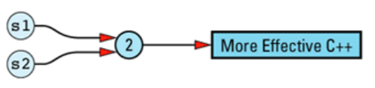

`String`类的**析构函数**同样容易实现，因为大部分情况下它不需要做任何事情：

```c++
String::~String()
{
 	if (--value->refCount == 0) delete value;
} 
```

转到**赋值操作**，

```c++
String& String::operator=(const String& rhs)
{
    // do nothing if the values are already the same; this subsumes the usual test of
    // this against &rhs (see Item E17)
    if (value == rhs.value) { 
        return *this;
    } 
  
    if (--value->refCount == 0) { 
        delete value; 
    }
    value = rhs.value;
    ++value->refCount;
    return *this;
}
```

:four:**写时拷贝​**

围绕我们的带**引用计数**的` String `类，考虑一下**数组下标操作**（`[]`），它允许字符串中的单个字符被读或写：

```c++
class String {
public:
    const char& operator[](int index) const; // for const Strings
    char& operator[](int index); // for non-const Strings
    ...
};
```

这个函数的` const `版本的实现很容易，因为它是一个**只读操作**，`String `对象的值不受影响： 

```c++
const char& String::operator[](int index) const
{
	return value->data[index];
} 
```

非` const `的`operator[]`版本就是一个完全不同的故事了。它可能是被调用了来**读一个字符**，也可能被调用了来**写一个字符**。但不幸的是，编译器无法告诉我们其具体是读还是写。所以我们必须保守地假设所有调用**非const operator[]**的行为都是为了**写操作**。

为了安全地实现**非const的operator[]**，我们必须确保没有其它 `String `对象在共享这个可能被修改的 `StringValue `对象。简而言之，当我们返回 `StringValue `对象中的一个字符的引用时，必须确保这个 `StringValue `的**引用计数**是` 1`。

```c++
char& String::operator[](int index)
{
    if (value->refCount > 1) {
        --value->refCount; 
        value =  new StringValue(value->data); 
    }
    return value->data[index];
} 
```

:five:**指针、引用与写时拷贝​**

```c++
String s1 = "Hello";
char *p = &s1[1]; 
String s2 = s1;
```


下面这样的语句将有不受欢迎的结果： 

```c++
*p = 'x'; // modifies both s1 and s2! 
```

至少有**三种方法**来应付这个问题：

- 第一个是**忽略它**，假装它不存在。这是实现带引用计数的` String` 类的类库中令人痛苦的常见问题。
- 稍微好些的方法是**明确说明它的存在**。通常是将它写入文档，或多或少地说明：别这么做。如果你这么做了，结果为未定义。
- 第三个方法是**排除这个问题**。它不难实现，但它将**降低**一个值**共享于对象间的次数**。 它的本质是这样的：在每个 `StringValue `对象中增加一个**标志**以指出它是否为**可共享的**。在最初（对象可共享时）将标志打开，在**非const的operator[]**被调用时将它关闭。一旦标志被设为 `false`，它将**永远保持**在这个状态

```c++
class String {
private:
    struct StringValue {
        int refCount;
        bool shareable; // add this
        char *data;
        StringValue(const char *initValue);
        ~StringValue();
    };
    ...
};

String::StringValue::StringValue(const char *initValue) : refCount(1), shareable(true)
{
    data = new char[strlen(initValue) + 1];
    strcpy(data, initValue);
}

String::StringValue::~StringValue()
{
	delete [] data;
} 

String::String(const String& rhs)
{
    if (rhs.value->shareable) {
        value = rhs.value;
        ++value->refCount;
    }
    else {
        value = new StringValue(rhs.value->data);
    } 
}

char& String::operator[](int index)
{
    if (value->refCount > 1) {
        --value->refCount;
        value = new StringValue(value->data);
    }
    value->shareable = false; // add this
    return value->data[index];
} 
```

:six:**带引用计数的基类**

如果我们将**引用计数的代码**写成与**运行环境无关**的，并能在需要时将它**嫁接到其它类**上？当然很好。很幸运，有一个方法可以实现它（至少完成了绝大部分必须的工作）。 

第一步是构建一个**基类** `RCObject`，任何需要引用计数的类都必须**从它继承**。`RCObject` 封装了引用计数功能，如增加和减少引用计数的函数。它还包含了当这个值不再被需要时摧毁值对象的代码（也就是引用计数为` 0 `时）。最后，它包含了一个字段以跟踪这个值对象**是否可共享**，并提供查询这个值和将它设为 `false `的函数。

```c++
class RCObject {
public:
    RCObject();
    RCObject(const RCObject& rhs);
    RCObject& operator=(const RCObject& rhs);
    virtual ~RCObject() = 0;
    void addReference();
    void removeReference();
    void markUnshareable();
    bool isShareable() const;
    bool isShared() const;
private:
    int refCount;
    bool shareable;
}; 
```

实现代码

```c++
RCObject::RCObject() : refCount(0), shareable(true) {}

RCObject::RCObject(const RCObject&) : refCount(0), shareable(true) {}

RCObject& RCObject::operator=(const RCObject&)
{ 
    return *this; 
}

RCObject::~RCObject() {} 

void RCObject::addReference() 
{ 
	++refCount; 
}

void RCObject::removeReference()
{ 
	if (--refCount == 0) delete this; 
}

void RCObject::markUnshareable()
{ 
	shareable = false; 
}

bool RCObject::isShareable() const
{ 
	return shareable; 
}

bool RCObject::isShared() const
{ 
	return refCount > 1; 
} 
```

可能很奇怪，我们在**所有的构造函数**中都将 `refCount `设为了 `0`。这看起来违反直觉。确实，最少，构造这个 `RCObject `对象的对象引用它！在它构造后，只需构造它的对象简单地将 `refCount` 设为 `1 `就可以了，所以我们没有将这个工作放入` RCObject` 内部。这使得最终的代码看起来很简短。

另一个奇怪之处是**拷贝构造函数**也将` refCount `设为 `0`，而不管被拷贝的 `RCObject `对象 的` refCount `的值。这是因为我们正在构造**新的值对象**，而这个新的值对象总是未被共享的， 只被它的构造者引用。再一次，构造者负责将 `refCount `设为正确的值。

`RCObject` 的**赋值运算**看起来完全出乎意料：**它没有做任何事情**。这个函数不太可能被调用的。`RCObject` 是**基于引用计数来共享的值对象**的基类，**它不该被从一个赋给另外一个**， 而**应该是拥有这个值的对象被从一个赋给另外一个**。在我们这个设计里，我们不期望` StringValue`对象被从一个赋给另外一个，我们期望在**赋值过程**中只有` String `对象被涉及。 在` String` 参与的赋值语句中，`StringValue` 的值没有发生变化，**只是它的引用计数被修改了**。

为了使用我们新写的**引用计数基类**，我们将 `StringValue` 修改为是从 `RCObject `继承而得到**引用计数功能**的：

```c++
class String {
private:
    struct StringValue: public RCObject { 
        char *data;
        StringValue(const char *initValue);
        ~StringValue();
    };
    StringValue *value; // value of this String 
    ...
};

String::StringValue::StringValue(const char *initValue)
{
    data = new char[strlen(initValue) + 1];
    strcpy(data, initValue);
}

String::StringValue::~StringValue()
{
 	delete [] data;
} 
```

:seven:**自动的引用计数处理**

`RCObject `类给了我们一个存储**引用计数**的地方，并提供了**成员函数**供我们**操作引用计数**，但调用这些函数的动作还必须被手工加入其它类中。仍然需要在 `String `的**拷贝构造函数**和**赋值运算函数**中调用` StringValue` 的 `addReference `和 `removeReference` 函数。这很笨拙。我们想将这些调用也移入一个可重用的类中，以使得 `String `这样的类的作者不用再担心引用计数的任何细节。能实现吗？C++支持这样的重用吗？ 

能。没有一个简单的方法将所有引用计数方面的工作从所有的类中移出来；**但有一个方法可以从大部分类中将大部分工作移出来**。（在一些类中，你可以消除所有引用计数方面 的代码，但我们的 `String `类不是其中之一。有一个成员函数搞坏了这件事，它是我们的老对头：**非 const 版本的 operator[]**。别放心上，我们最终制服了这家伙。）

我们必须操作 `StringValue `对象的` refCount` 字段，只要任何时候任一个**指向它的指针**身上发生了任何有趣的事件。“有趣的事件”包括：拷贝指针、给指针赋值和销毁指针。如果我们能够**让指针自己检测这些事件**并自动地执行对`refCount `字段的必须操作，那么我们就自由了。不幸的是，指针功能很弱，对任何事情作检测并作出反应都是不可能的。还好，有一个办法来增强它们：用**行为类似指针的对象**替代它们，但那样要多做很多工作了。 

这样的对象叫**智能指针**，你可以在 `Item M28 `这看到它的更多细节。就我们这儿的用途， 只要知道这些就足够了：**智能指针对象**支持**成员选择**（`->`）和**反引用**（`*`）这两个操作符，

```c++
// template class for smart pointers-to-T objects. T must support the RCObject interface, 
// typically by inheriting from RCObject
template<class T>
class RCPtr {
public:
    RCPtr(T* realPtr = 0);
    RCPtr(const RCPtr& rhs);
    ~RCPtr();
    RCPtr& operator=(const RCPtr& rhs);
    T* operator->() const; // see Item 28
    T& operator*() const; // see Item 28
private:
    T *pointee; // dumb pointer this object is emulating
    void init(); // common initialization
}; 
```

```c++
template<class T>
RCPtr<T>::RCPtr(T* realPtr): pointee(realPtr)
{
    init();
}

template<class T>
RCPtr<T>::RCPtr(const RCPtr& rhs): pointee(rhs.pointee)
{
    init();
}

template<class T>
void RCPtr<T>::init()
{
 	if (pointee == 0) { 
 		return; 
    
	if (pointee->isShareable() == false) { 
 		pointee = new T(*pointee);
 	} 

    pointee->addReference(); // note that there is now a
} 
```

问题是这个：当 `init `需要创建` value `的一个新拷贝时（因为已存在的拷贝处于**不可共享状态**），它执行下面的代码：

```c++
 pointee = new T(*pointee)
```

`pointee `的类型是指向 `T `的指针,所以这一语句构建了一个新的` T `对象，并用**拷贝构造函数**进行了初始化。由于 `RCPtr` 是在 `String `类内部，`T `将是 `String::StringValue`，所以上面的语句将调用` String::StringValue` 的**拷贝构造函数**。我们没有为这个类申明**拷贝构造函数**，所以编译器将为我们生成一个。这个**生成的拷贝构造函数**遵守 C++的自动生成拷贝构造函数的**原则**，只拷贝了 `StringValue` 的数据 `pointer`，而没有拷贝所指向的` char *`字符串。这样的行为对几乎任何类（而不光是**引用计数类**）都是灾难，这就是为什么你应该养成**为所有含有指针的类提供拷贝构造函数**（和**赋值运算**）的习惯（见 Item E11）。

`RCPtr`模板的正确行为取决于 `T`含有**正确的值拷贝行为**（如深拷贝）的拷贝构造函数。我们必须在 `StringValue`中增加这样的一个构造函数： 

```c++
String::StringValue::StringValue(const StringValue& rhs)
{
    data = new char[strlen(rhs.data) + 1];
    strcpy(data, rhs.data);
} 
```

```c++
template<class T>
RCPtr<T>& RCPtr<T>::operator=(const RCPtr& rhs)
{
    if (pointee != rhs.pointee) { 
        if (pointee) {
       		pointee->removeReference(); 
        } 
        pointee = rhs.pointee;
        init(); 
    } 
    return *this;
} 
```

**析构函数**很容易。当一个 `RCPtr` 被析构时，它只是简单地将它对引用计数对象的引用移除： 

```c++
template<class T>
RCPtr<T>::~RCPtr()
{
 	if (pointee)pointee->removeReference();
} 
```

```c++
template<class T>
T* RCPtr<T>::operator->() const { return pointee; }

template<class T>
T& RCPtr<T>::operator*() const { return *pointee; } 
```

:eight:合在一起

够了！完结！最后，我们将各个部分放在一起，构造一个基于可重用的 `RCObject `和 `RCPtr `类的带**引用计数**的 `String `类。

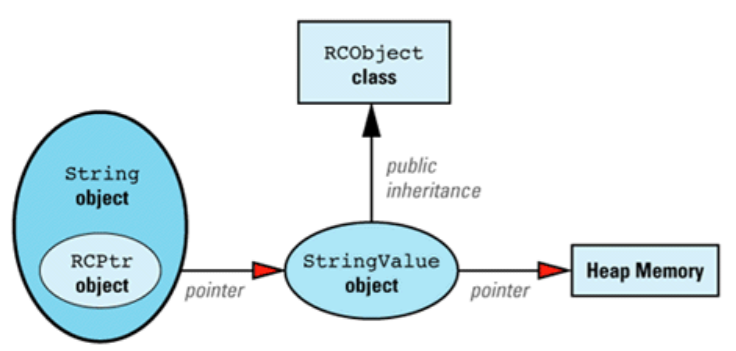

```c++
template<class T> 
class RCPtr { 
public: 
    RCPtr(T* realPtr = 0);
    RCPtr(const RCPtr& rhs);
    ~RCPtr();
    RCPtr& operator=(const RCPtr& rhs);
    T* operator->() const;
    T& operator*() const;
private:
    T *pointee;
    void init();
}; 
```

```c++
class RCObject { 
    void addReference();
    void removeReference();
    void markUnshareable(); 
    bool isShareable() const;
    bool isShared() const;
        
protected:
    RCObject();
    RCObject(const RCObject& rhs);
    RCObject& operator=(const RCObject& rhs);
    virtual ~RCObject() = 0;
    
private:
    int refCount;
    bool shareable;
};
```

```c++
class String { 
public:
    String(const char *value = "");
    const char& operator[](int index) const;
    char& operator[](int index);
    
private:
    // class representing string values
    struct StringValue: public RCObject {
        char *data;
        StringValue(const char *initValue);
        StringValue(const StringValue& rhs);
        void init(const char *initValue);
        ~StringValue();
    };
    
    RCPtr<StringValue> value;
}; 
```

```c++
RCObject::RCObject() : refCount(0), shareable(true) {}

RCObject::RCObject(const RCObject&) : refCount(0), shareable(true) {}

RCObject& RCObject::operator=(const RCObject&)
{ return *this; }

RCObject::~RCObject() {}

void RCObject::addReference() { ++refCount; }

void RCObject::removeReference()
{ 
    if (--refCount == 0) delete this; 
}

void RCObject::markUnshareable()
{ 
    shareable = false; 
}

bool RCObject::isShareable() const
{ 
    return shareable; 
}
bool RCObject::isShared() const
{ 
    return refCount > 1; 
}

//这是 RCPtr 的实现：
template<class T>
void RCPtr<T>::init()
{
    if (pointee == 0) return;
    if (pointee->isShareable() == false) {
        pointee = new T(*pointee);
    } 
    pointee->addReference();
}

template<class T>
RCPtr<T>::RCPtr(T* realPtr) : pointee(realPtr)
{ 
    init(); 
}

template<class T>
RCPtr<T>::RCPtr(const RCPtr& rhs) : pointee(rhs.pointee)
{ 
    init(); 
}

template<class T>
RCPtr<T>::~RCPtr()
{ 
    if (pointee)pointee->removeReference(); 
}

template<class T>
RCPtr<T>& RCPtr<T>::operator=(const RCPtr& rhs)
{
    if (pointee != rhs.pointee) {
        if (pointee) pointee->removeReference();
        pointee = rhs.pointee;
        init();
    }
    return *this;
}

template<class T>
T* RCPtr<T>::operator->() const 
{ 
    return pointee; 
}

template<class T>
T& RCPtr<T>::operator*() const 
{ 
    return *pointee; 
}

//这是 String::StringValue 的实现：
void String::StringValue::init(const char *initValue)
{
    data = new char[strlen(initValue) + 1];
    strcpy(data, initValue);
}

String::StringValue::StringValue(const char *initValue)
{ 
    init(initValue); 
}

String::StringValue::StringValue(const StringValue& rhs)
{ 
    init(rhs.data); 
}

String::StringValue::~StringValue()
{ 
    delete [] data; 
} 

//string
String::String(const char *initValue) : value(new StringValue(initValue)) {}

const char& String::operator[](int index) const
{ 
    return value->data[index]; 
}

char& String::operator[](int index)
{
    if (value->isShared()) {
        value = new StringValue(value->data);
    }
    value->markUnshareable();
    return value->data[index];
}

```

> 这当然全都很漂亮。谁能反对减少代码？谁能反对成功的封装？然而，这个全新的 String 类本身对用户的冲击远胜过它的实现细节，这才是真正的闪光点。如果没有什么消 息是好消息的话，这本身就是最好的消息。String 的接口没有改变！我们增加了引用计数，我们增加了标记某个 String 的值为不可共享的能力，我们将引用计数功能移入一个新类， 我们增加了灵巧指针来自动处理引用计数，但用户的一行代码都不需要修改。当然，我们改 变了 String 类的定义，所以用户需要重新编译和链接，但他们在自己代码上的投资受到了 完全的保护。你看到了吗？封装确实是个很好的东西。 

:nine: **在现存类上增加引用计数**

到现在为止，我们所讨论的都假设我们能够访问**有关类的源码**。但如果我们想让一个位于支撑库中而**无法修改的类**获得**引用计数**的好处呢？不可能让它们从` RCObject` 继承的， 所以也不能对它们使用灵巧指针 `RCPtr`。

只要对我们的设计作**小小的修改**，我们就可以将**引用计数**加到**任意类型**上。 我们增加一个新类` CountHolder` 以处理**引用计数**，它从` RCObject` 继承。我们让` CountHolder` 包含一个指针指向 `Widget`。然后用等价的灵巧指针` RCIPter `模板替代` RCPtr `模板，它知道 `CountHolder` 类的存在。

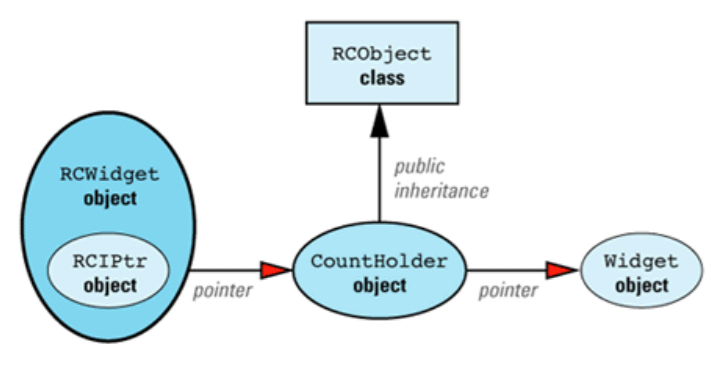

```c++
template<class T> 
class RCIPtr {
public:
    RCIPtr(T* realPtr = 0);
    RCIPtr(const RCIPtr& rhs);
    ~RCIPtr();
    RCIPtr& operator=(const RCIPtr& rhs);
    const T* operator->() const; 
    T* operator->(); 
    const T& operator*() const;
    T& operator*();
    
private:
    struct CountHolder: public RCObject {
        ~CountHolder() { delete pointee; }
        T *pointee;
    };
    
    CountHolder *counter;
    void init();
    void makeCopy(); // see below
};

template<class T>
void RCIPtr<T>::init()
{
    if (counter->isShareable() == false) {
        T *oldValue = counter->pointee;
        counter = new CountHolder;
        counter->pointee = new T(*oldValue);
    }
    counter->addReference();
}

template<class T>
RCIPtr<T>::RCIPtr(T* realPtr) : counter(new CountHolder)
{
  counter->pointee = realPtr; 
  init();
}

template<class T>
RCIPtr<T>::RCIPtr(const RCIPtr& rhs) : counter(rhs.counter)
{ 
    init(); 
}

template<class T>
RCIPtr<T>::~RCIPtr()
{ 
    counter->removeReference(); 
}

template<class T>
RCIPtr<T>& RCIPtr<T>::operator=(const RCIPtr& rhs)
{
    if (counter != rhs.counter) {
        counter->removeReference();
        counter = rhs.counter;
        init();
    }
    return *this;
}

template<class T> 
void RCIPtr<T>::makeCopy() 
{ 
    if (counter->isShared()) {
        T *oldValue = counter->pointee;
        counter->removeReference();
        counter = new CountHolder;
        counter->pointee = new T(*oldValue);
        counter->addReference();
    }
}

template<class T> // const access;
const T* RCIPtr<T>::operator->() const // no COW needed
{ 
    return counter->pointee; 
}

template<class T> // non-const
T* RCIPtr<T>::operator->() // access; COW
{ 
    makeCopy(); return counter->pointee; 
} 

template<class T> // const access;
const T& RCIPtr<T>::operator*() const // no COW needed
{ 
    return *(counter->pointee); 
}

template<class T> // non-const
T& RCIPtr<T>::operator*() // access; do the
{ 
    makeCopy(); 
    return *(counter->pointee); 
} // COW thing 
```


# 6. 条款30：代理类

:one:考虑创建一个维度可以是变量的**二维数组类**：

```c++
template<class T>
class Array2D {
public:
    Array2D(int dim1, int dim2);
    ...
}; 
```

我们应该能够使用`[]`来**索引数组**，最初的想法可能是声明一个`operator[][]`函数，但实际上`C++`并不没有这个玩意。换个思路，或许可以这样：

```c++
template<class T>
class Array2D {
public:
    // declarations that will compile
    T& operator()(int index1, int index2);
    const T& operator()(int index1, int index2) const;
    ...
};
...
cout << data(3, 6);     
```

但这样的话，我们的类看起来和**内嵌数组**一点也不像。让我们仔细想想数组，其实可以分解为`n`个`m`维的向量，那么，实际上，我们可以：

```c++
template<class T> 
class Array2D {
public:
    class Array1D {
    public:
        T& operator[](int index);
        const T& operator[](int index) const;
        ...
    };
    
    Array1D operator[](int index);
    const Array1D operator[](int index) const;
    ...
}; 
```

现在，下列写法合理了：

```c++
Array2D<float> data(10, 20);
...
cout << data[3][6]; // fine
```

这里，`data[3]`返回一个` Array1d `对象，在这个对象上的` operator[]`操作返回二维数组中$(3,6)$位置上的浮点数。

每个 `Array1D `对象扮演的是一个**一维数组**，而这个**一维数组**没有在使用 `Array2D` 的程序中出现。扮演其它对象的对象通常被称为**代理类**`Proxy class`。在这个例子里，`Array1D `是一个**代理类**。 它的实例扮演的是一个**在概念上不存在的一维数组**。

:two:现在我们可以考虑来区分`operator[]`上进行的是读还是写操作了。

我们的方法基于这个事实：也许不可能在` operator[]`内部区分左值还是右值操作，但仍然能区别对待读操作和写操作，如果将**判断读还是写的行为**推迟到我们知道` operator[]`的结果被怎么使用之后的话。我们所需要的是有一个方法将读或写的判断推迟到 `operator[]`返回之后。（这是 `lazy `原则（见 Item M17）的一个例子。） 

==proxy类==可以让我们得到我们所需要的时机，因为我们可以修改` operator[]`让它返回 一个（代理字符的）`proxy `对象而不是**字符本身**。我们可以等着看这个 `proxy `怎么被使用。 如果是读它，我们可以断定 `operator[]`的调用是读。如果它被写，我们必须将` operator[] `的调用处理为写。 

但首先要理解我们使用的 `proxy` 类。在 `proxy `类上只能做三件事： 

-  **创建它**，也就是指定它扮演哪个字符。 
- 将它作为赋值操作的目标，在这种情况下可以将赋值真正作用在它扮演的字符上。 这样被使用时，proxy 类扮演的是**左值**。 
-  用其它方式使用它。这时，代理类扮演的是**右值**。

```c++
class String { 
public: 
    class CharProxy { 
    public:
        CharProxy(String& str, int index); // creation
        CharProxy& operator=(const CharProxy& rhs); // lvalue
        CharProxy& operator=(char c);
        operator char() const; // rvalue
    private:
        String& theString; 
        int charIndex; 
    };
    
    const CharProxy operator[](int index) const; 
    CharProxy operator[](int index);
    ...
	
    friend class CharProxy;

private:

    RCPtr<StringValue> value;
}; 
```

这是 `String` 的 `opertator[]`函数的代码：

```c++
const String::CharProxy String::operator[](int index) const
{
 	return CharProxy(const_cast<String&>(*this), index);
}

String::CharProxy String::operator[](int index)
{
 	return CharProxy(*this, index);
} 
```

每个函数都创建和返回一个 `proxy `对象来代替字符。根本没有对那个字符作任何操作： 我们将它推迟到**直到我们知道是读操作还是写操作**。 

注意 ，`operator[] `的 `const` 版本返回一个 `const `的 `proxy `对象。因为 `CharProxy::operator=`是个非 `const`的成员函数，这样的 `proxy`对象不能作赋值的目标使用。 因此，不管是从 `operator[]`的 `const `版本返回的` proxy `对象，还是它所扮演的字符都不能作左值使用。很方便啊，它正好是我们想要的 `const `版本的 `operator[]`的行为。

```c++
String::CharProxy::CharProxy(String& str, int index) : theString(str), charIndex(index) {}

// 将 proxy 对象作右值使用时很简单－－只需返回它所扮演的字符就可以了：
String::CharProxy::operator char() const
{
	return theString.value->data[charIndex];
} 
```

我们可以将`CharProxy `的赋值操作实现如下：

```c++
String::CharProxy& String::CharProxy::operator=(const CharProxy& rhs)
{
    // if the string is sharing a value with other String objects,
    // break off a separate copy of the value for this string only
    if (theString.value->isShared()) {
        theString.value = new StringValue(theString.value->data);
    }
    // now make the assignment: assign the value of the char
    // represented by rhs to the char represented by *this
    theString.value->data[charIndex] = rhs.theString.value->data[rhs.charIndex];
    return *this;
} 

String::CharProxy& String::CharProxy::operator=(char c)
{
    if (theString.value->isShared()) {
        theString.value = new StringValue(theString.value->data);
    }
    theString.value->data[charIndex] = c;
    return *this; 
}
```

:three:**局限性​**

使用 `proxy `类是个区分` operator[]`作**左值**还是**右值**的好方法，但它不是没有缺点的。 我们很喜欢 `proxy `对象对其所扮演的对象的无缝替代，但这很难实现。这是因为，**右值不只是出现在赋值运算的情况下**，那时，`proxy `对象的行为就和实际的对象不一致。

如果你想让`++` `--`作用在` operator[]`上， 必须为` Arrar::Proxy `类定义所有这些函数。这是一个极大量的工作，你可能不愿意去做 。不幸的是，你要么去做这些工作，要么没有这些操作，不能两全。 

这部分具体见书 。

:four:  **总结**

`Proxy `类可以完成一些其它方法很难甚至不可能实现的行为：

- **多维数组**是一个例子
- **左/右值的区分**是第二个
- **限制隐式类型转换**（见 Item M5）是第三个

同时，`proxy `类也有缺点。作为函数返回值，`proxy `对象是临时对象，它们必须被构造和析构。这不是免费的，虽然**此付出**能从具备了**区分读写的能力**上得到更多的**补偿**。`Proxy `对象的存在增加了**软件的复杂度**，因为额外增加的类使得事情更难设计、实现、 理解和维护。 

在很多情况下，`proxy `对象可以完美替代实际对象。当它们可以工作时，通常也是没有其它方法可采用的情况。 


# 7. 条款31：让函数根据一个以上对象来决定怎么虚拟

:one:考虑这样一个例子（具体描述见书）：

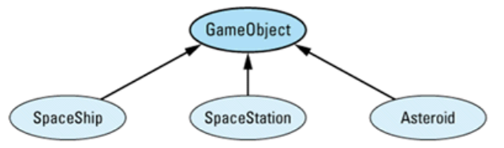

现在，假设你开始进入**程序内部**，写代码来检测和处理**物体间的碰撞**。你会提出这样一个函数：

```c++
void checkForCollision(GameObject& object1, GameObject& object2)
{
    if (theyJustCollided(object1, object2)) {
    	processCollision(object1, object2);
    }
    else {
    	...
    }
} 
```

问题来了。当你调用` processCollision()`时，你知道 `object1 `和 `object2 `正好相撞， 并且你知道发生的结果将取决于` object1`和 `object2`的**真实类型**，但你并不知道其**真实类型**； 你所知道的就只有它们是`GameObject `对象。如果碰撞的处理过程只取决于 `object1`的动态类型，你可以将 `processCollision()`设为虚函数，并调用`object1.processColliion(object2)`。如果只取决于` object2 `的动态类型，也可以同样处理。 但现在，**取决于两个对象的动态类型**。虚函数体系只能作用在一个对象身上，它不足以解决问题。

你需要的是一种==作用在多个对象上的虚函数==。`C++`没有提供这样的函数。所以必须找到一个方法来解决这个被称为**二重调度**（`double dispatch`）的问题。

有几个方法可以考虑，但没有哪个是没有缺点的，这不该奇怪。C++没有直接提供“double dispatch”，所以你必须自己完成编译器在**实现虚函数**时所做的工作。

:two:**用虚函数加RTTI​**

**虚函数**实现了一个**单一调度**，这只是我们所需要的一半；编译器为我们实现虚函数， 所以我们在 `GameObject` 中申明一个**虚函数** `collide`。这个函数被派生类以通常的形式重载：

```c++
class GameObject {
public:
    virtual void collide(GameObject& otherObject) = 0;
    ...
};

class SpaceShip: public GameObject {
public:
    virtual void collide(GameObject& otherObject);
    ...
}; 
```

实现==二重调度==的最常见方法就是和**虚函数体系**格格不入的` if...then...else `链。在这种刺眼的体系下，我们首先是发现` otherObject `的真实类型，然后测试所有的可能：

```c++
// if we collide with an object of unknown type, we throw an exception of this type:
class CollisionWithUnknownObject {
public:
    CollisionWithUnknownObject(GameObject& whatWeHit);
    ...
};

void SpaceShip::collide(GameObject& otherObject)
{
    const type_info& objectType = typeid(otherObject);
    if (objectType == typeid(SpaceShip)) {
        SpaceShip& ss = static_cast<SpaceShip&>(otherObject);
        //process a SpaceShip-SpaceShip collision;
    }
    else if (objectType == typeid(SpaceStation)) {
        SpaceStation& ss = static_cast<SpaceStation&>(otherObject);
        //process a SpaceShip-SpaceStation collision;
    }
    else if (objectType == typeid(Asteroid)) {
        Asteroid& a = static_cast<Asteroid&>(otherObject);
        //process a SpaceShip-Asteroid collision;
    }
    else {
        throw CollisionWithUnknownObject(otherObject);
    }
} 
```

我们的代价是**几乎放弃了封装**，因为每个` collide `函数都必须知道所以**其它同胞类**中的版本。尤其是，如果增加一个新的类时，我们必须更新每一个基于`RTTI`的 `if...then...else `链以处理这个新的类型。即使只是忘了一处，程序都将有一个 `bug`，而且它还不显眼。

这样的程序本质上是**没有可维护性**的。扩充这样的程序最终是不可想象的。当我们用 `RTTI `实现二重调度时，我们正退回到过去的苦日子中。

:three:**只使用虚函数**

这个方法和`RTTI`方法有同样的基本构架。 `collide` 函数被申明为虚，并被所有派生类**重定义**，此外，它还被每个类重载，每个重载处理一个派生类型：

```c++
class SpaceShip; // forward declarations
class SpaceStation;
class Asteroid;

class GameObject {
public:
    virtual void collide(GameObject& otherObject) = 0;
    virtual void collide(SpaceShip& otherObject) = 0;
    virtual void collide(SpaceStation& otherObject) = 0;
    virtual void collide(Asteroid& otherobject) = 0;
    ...
};

class SpaceShip: public GameObject {
public:
    virtual void collide(GameObject& otherObject);
    virtual void collide(SpaceShip& otherObject);
    virtual void collide(SpaceStation& otherObject);
    virtual void collide(Asteroid& otherobject);
    ...
}; 
```

其基本原理就是**用两个单一调度实现二重调度**，也就是说有**两个单独的虚函数调用**： 第一次决定第一个对象的动态类型，第二次决定第二个对象动态类型。和前面一样，第一次虚函数调用带的是 `GameObject `类型的参数。其实现是令人吃惊地简单： 

```c++
void SpaceShip::collide(GameObject& otherObject)
{
	otherObject.collide(*this);
}

void SpaceShip::collide(SpaceShip& otherObject)
{
    process a SpaceShip-SpaceShip collision;
}

void SpaceShip::collide(SpaceStation& otherObject)
{
    process a SpaceShip-SpaceStation collision;
}

void SpaceShip::collide(Asteroid& otherObject)
{
    process a SpaceShip-Asteroid collision;
}
```

一点都不混乱，也不麻烦，没有` RTTI`，也不需要为意料之外的对象类型**抛异常**。不会有意料之外的类型的，这就是使用虚函数的好处。实际上，如果没有那个**致命缺陷**的话，它就是实现二重调度问题的完美解决方案。

这个缺陷是，和前面看到的` RTTI `方法一样：**每个类都必须知道它的同胞类**。当增加新类时，所有的代码都必须更新。不过，更新方法和前面不一样。确实，没有` if...then...else `需要修改，但通常是更差：**每个类都需要增加一个新的虚函数**。

> 总结一下就是：如果你需要实现二重调度，最好的办法是修改设计以取消这个需要。 如果做不到的话，虚函数的方法比 RTTI 的方法安全，但它限制了你的程序的可控制性（取决于你是否有权修改头文件）。另一方面，RTTI 的方法不需要重编译，但通常会导致代码无法维护。

:four:**模拟虚函数表​**。

如果这么做了，不但使得你基于` RTTI `的代码更具效率（**下标索引**加**函数指针的反引用**通常比 `if...then...else `高效，产生的代码也少），同样也将`RTTI `的使用范围限定在一处：**初始化函数指针数组的地方**。

对` GameObjcet `继承体系中的函数作一些修改： 

```c++
class GameObject {
public:
    virtual void collide(GameObject& otherObject) = 0;
    ...
};

class SpaceShip: public GameObject {
public:
    virtual void collide(GameObject& otherObject);
    virtual void hitSpaceShip(SpaceShip& otherObject);
    virtual void hitSpaceStation(SpaceStation& otherObject);
    virtual void hitAsteroid(Asteroid& otherobject);
    ...
};

void SpaceShip::hitSpaceShip(SpaceShip& otherObject)
{
 	process a SpaceShip-SpaceShip collision;
}

void SpaceShip::hitSpaceStation(SpaceStation& otherObject)
{
 	process a SpaceShip-SpaceStation collision;
}
void SpaceShip::hitAsteroid(Asteroid& otherObject)
{
 	process a SpaceShip-Asteroid collision;
}
```

和开始时使用的基于` RTTI `的方法相似，`GameObjcet `类只有一个处理碰撞的函数，它实现**必须的二重调度**的第一重。和后来的**基于虚函数的方法**相似，每种碰撞都由一个独立的函数处理，不过不同的是，这次，这些函数有着不同的名字，而不是都叫` collide`。**放弃重载**是有原因的，你很快就要见到的：

在` SpaceShip::collide` 中，我们需要一个方法来映射参数 `otherObject `的动态类型到一个**成员函数指针**（指向一个适当的**碰撞处理函数**）。一个简单的方法是创建一个**映射表**， 给定的类名对应恰当的**成员函数指针**。直接使用一个这样的**映射表**来实现` collide `是可行的，但如果增加一个中间函数` lookup` 时，将更好理解。`lookup `函数接受一个 `GameObject `参数，返回**相应的成员函数指针**。 

```c++
class SpaceShip: public GameObject {
private:
    typedef void (SpaceShip::*HitFunctionPtr)(GameObject&);
    static HitFunctionPtr lookup(const GameObject& whatWeHit);
    ...
};

void SpaceShip::collide(GameObject& otherObject)
{
    HitFunctionPtr hfp = lookup(otherObject); // find the function to call
    if(hfp) { 
        (this->*hfp)(otherObject);
    }
    else {
        throw CollisionWithUnknownObject(otherObject);
    }
} 
```

剩下的就是实现` lookup` 了。提供了一个**对象类型**到**成员函数指针**的映射表后，`lookup` 自己很容易实现，但创建、初始化和析构这个映射表是个有意思的问题。 

这样的数组应该在它被使用前**构造和初始化**，并在不再被需要时**析构**。我们可以使用` new `和 `delete `来手工创建和析构它，但这时怎么保证在初始化以前不被使用呢？更好的解决方案是让编译器自动完成，在` lookup `中把这个数组申明为==静态==就可以了。这样，它在第一次调用` lookup `前构造和初始化，在 `main` 退出后的某个时刻被**自动析构**。

可以使用**标准模板库**提供的 `map` 模板来实现**映射表**：

```c++
class SpaceShip: public GameObject {
private:
    typedef void (SpaceShip::*HitFunctionPtr)(GameObject&);
    typedef map<string, HitFunctionPtr> HitMap;
    ...
};

SpaceShip::HitFunctionPtr SpaceShip::lookup(const GameObject& whatWeHit)
{
    static HitMap collisionMap;
    
    // look up the collision-processing function for the type of whatWeHit. The value returned is a pointer-like
 	// object called an "iterator" (see Item 35).
    HitMap::iterator mapEntry = collisionMap.find(typeid(whatWeHit).name());

    // mapEntry == collisionMap.end() if the lookup failed; this is standard map behavior. Again, see Item 35.
    if (mapEntry == collisionMap.end()) return 0;

    // If we get here, the search succeeded. mapEntry points to a complete map entry, 
    //which is a  (string, HitFunctionPtr) pair. 
    // We want only the second part of the pair, so that's what we return.
    return (*mapEntry).second; 
}

```

现在来看 `collisionMap` 的**初始化**。我们只需写一个**私有的静态成员函数** `initializeCollisionMap `来构造和初始化我们的**映射表**，然后用其**返回值**来初始化 `collisionMap`（避免资源泄露，使用**智能指针**）： 

```c++
class SpaceShip: public GameObject {
private:
    static HitMap* initializeCollisionMap();
    ...
};

SpaceShip::HitFunctionPtr SpaceShip::lookup(const GameObject& whatWeHit)
{
    static auto_ptr<HitMap> collisionMap(initializeCollisionMap()); 
    ...
} 
```

实现` initializeCollisionMap `的最清晰的方法看起来是这样的：

```c++
SpaceShip::HitMap * SpaceShip::initializeCollisionMap()
{
    HitMap *phm = new HitMap;
    (*phm)["SpaceShip"] = &hitSpaceShip;
    (*phm)["SpaceStation"] = &hitSpaceStation;
    (*phm)["Asteroid"] = &hitAsteroid;
    return phm;
} 
```

**不能编译通过**。因为 `HitMap `被申明为包容一堆**指向成员函数的指针**，它们全带同样的参数类型，也就是 `GameObject`。虽然 `SpaceShip`、`SpaceStation` 和` Asteroid `能被隐式的转换为 `GameObject`，但对**带这些参数类型的函数指针可没有这样的转换关系**。 

只有一个办法：将所有的函数都改为接受` GameObject `类型： 

```c++
class GameObject { // this is unchanged
public:
    virtual void collide(GameObject& otherObject) = 0;
    ...
};

class SpaceShip: public GameObject {
public:
    virtual void collide(GameObject& otherObject);
    // these functions now all take a GameObject parameter
    virtual void hitSpaceShip(GameObject& spaceShip);
    virtual void hitSpaceStation(GameObject& spaceStation);
    virtual void hitAsteroid(GameObject& asteroid);
    ...
};
```

` initializeCollisionMap `函数：

```c++
SpaceShip::HitMap * SpaceShip::initializeCollisionMap()
{
    HitMap *phm = new HitMap;
    (*phm)["SpaceShip"] = &hitSpaceShip;
    (*phm)["SpaceStation"] = &hitSpaceStation;
    (*phm)["Asteroid"] = &hitAsteroid;
    return phm;
} 
```

**碰撞函数**现在得到的是一个更基本的` CameObject` 参数而不是期望中的**派生类类型**。要想得到我们所期望的东西，必须在每个碰撞函数开始处采用` dynamic_cast`：

```c++
void SpaceShip::hitSpaceShip(GameObject& spaceShip)
{
    SpaceShip& otherShip = dynamic_cast<SpaceShip&>(spaceShip);
    process a SpaceShip-SpaceShip collision;
}

void SpaceShip::hitSpaceStation(GameObject& spaceStation)
{
    SpaceStation& station = dynamic_cast<SpaceStation&>(spaceStation);
    process a SpaceShip-SpaceStation collision;
}
void SpaceShip::hitAsteroid(GameObject& asteroid)
{
    Asteroid& theAsteroid = dynamic_cast<Asteroid&>(asteroid);
    process a SpaceShip-Asteroid collision;
} 
```

:five:**使用非成员函数的碰撞处理函数​**

将**碰撞处理函数**从类里移出来，我们在给用户提供**类定义的头文件**时，不用带上任何碰撞处理函数。我们可以将**实现碰撞处理函数的文件**组织成这样： 

```c++
#include "SpaceShip.h"
#include "SpaceStation.h"
#include "Asteroid.h"

namespace { // unnamed namespace — see below
    // primary collision-processing functions
    void shipAsteroid(GameObject& spaceShip, GameObject& asteroid);
    
    void shipStation(GameObject& spaceShip, GameObject& spaceStation);
    
    void asteroidStation(GameObject& asteroid, GameObject& spaceStation);
    ...
        
    // secondary collision-processing functions that just implement symmetry: swap the parameters and call a primary function
    void asteroidShip(GameObject& asteroid, GameObject& spaceShip)
    { 
        shipAsteroid(spaceShip, asteroid); 
    }
    
    void stationShip(GameObject& spaceStation, GameObject& spaceShip)
    { 
        shipStation(spaceShip, spaceStation); 
    }
    
    void stationAsteroid(GameObject& spaceStation, GameObject& asteroid)
    { 
        asteroidStation(asteroid, spaceStation); 
    }
    ...
        
    // see below for a description of these types/functions
    typedef void (*HitFunctionPtr)(GameObject&, GameObject&);
    typedef map< pair<string,string>, HitFunctionPtr > HitMap;
    
    pair<string,string> makeStringPair(const char *s1, const char *s2);、
    HitMap * initializeCollisionMap();
    HitFunctionPtr lookup(const string& class1, const string& class2);
} // end namespace

void processCollision(GameObject& object1, GameObject& object2)
{
    HitFunctionPtr phf = lookup(typeid(object1).name(), typeid(object2).name());
    if (phf) 
        phf(object1, object2);
    else 
        throw UnknownCollision(object1, object2);
} 
```

用了**无名的命名空间**来包含实现碰撞处理函数所需要的函数。==无名命名空间中的东西是当前编译单元（其实就是当前文件）私有的==。（很像被申明为文件范围内`static`的函数一样）

> ==有了命名空间后，文件范围内的 static 已经不赞成使用了==，你应该尽快让自 己习惯使用**无名的命名空间**（只要编译器支持）。 

```c++
// we use this function to create pair<string,string> objects from two char* literals. It's used in
// initializeCollisionMap below. Note how this function enables the return value optimization (see Item 20).
namespace { 
    pair<string,string> makeStringPair(const char *s1, const char *s2)
    { 
        return pair<string,string>(s1, s2); 
    }
} 

namespace { 
    HitMap * initializeCollisionMap()
    {
        HitMap *phm = new HitMap;
        (*phm)[makeStringPair("SpaceShip","Asteroid")] = &shipAsteroid;
        (*phm)[makeStringPair("SpaceShip", "SpaceStation")] = &shipStation;
        ...
        return phm;
    }
} 
```

`lookup `函数也必须被修改以处理` pair`对象，并将它作为映射表的第一部分： 

```c++
namespace { // I explain this below — trust me
    HitFunctionPtr lookup(const string& class1, const string& class2)
    {
        static auto_ptr<HitMap> collisionMap(initializeCollisionMap());
        // see below for a description of make_pair
        HitMap::iterator mapEntry = collisionMap->find(make_pair(class1, class2));
        if (mapEntry == collisionMap->end()) return 0;
        return (*mapEntry).second;
    }
} // end namespace 

```

最终达到了我们的目的。如果增加了新的` GaemObject `的子类，现存类**不需要重新编译**（除非它们用到了新类）。没有了 `RTTI` 的混乱和` if...then...else `的**不可维护**。增加 一个新类只需要做明确定义了的局部修改：在` initializeCollisionMap` 中增加一个或多个**新的映射关系**，在` processCollision `所在的无名的命名空间中申明一个**新的碰撞处理函数**。 我们花了很大的力气才走到这一步，但至少努力是值得的。是吗？也许吧。 

:six:**继承和模拟虚函数表​**

我们还有**最后一个问题**需要处理。（如果，此时你奇怪老有最后一个问题要处理，你将认识到设计一个**虚函数体系**的难度）我们所做的一切将工作得很好，只要我们不需要在调用**碰撞处理函数**时进行**向基类映射的类型转换**。假设我们开发的这个游戏某些时刻必须区分贸易飞船和军事飞船，我们将对继承体系作如下修改：

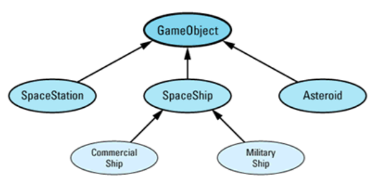

假设贸易飞船和军事飞船在**碰撞过程中的行为是一致的**。于是，我们期望可以使用**相同的碰撞处理函数**（在增加这两类以前就有的那个）。在一个` MilitaryShip `对象和 一个 `Asteroid `对象碰撞时，我们期望调用

```c++
void shipAsteroid(GameObject& spaceShip, GameObject& asteroid); 
```

它不会被调用的。实际上，抛了一个` UnknownCollision `的异常。因为 `lookup `在根据类型名`MilitaryShip`和`Asteroid`在 `collisionMap`中查找函数时没有找到。虽然`MilitaryShip `可以被转换为一个 `SpaceShip`，但 `lookup` 却不知道这一点

而且，没有没有一个简单的办法来告诉它。如果你需要实现**二重调度**，并且需要这儿的**向上类型映射**，**你只能采用我们前面讨论的二次虚函数调用的方法**（同时也意味着**增加新类**的时候，所有人都**必须重新编译**）。

:seven:**初始化模拟虚函数表**（再次讨论）​

按目前情况来看，我们的设计完全是**静态的**。每次我们注册一个**碰撞处理函数**，我们就不得不永远留着它。如果我们想在游戏运行过程中增加、删除或修改碰撞处理函数，将怎么样？不提供。 

但是是可以做到的。我们可以将**映射表**放入一个**类**，并由它提供动态修改映射关系的成员函数。例如：

```c++
class CollisionMap {
public:
    typedef void (*HitFunctionPtr)(GameObject&, GameObject&);

    void addEntry(const string& type1, const string& type2, HitFunctionPtr collisionFunction, bool symmetric = true); // see below

    void removeEntry(const string& type1, const string& type2);
    
    HitFunctionPtr lookup(const string& type1, const string& type2);
    
    // this function returns a reference to the one and only map — see Item 26
    static CollisionMap& theCollisionMap();
    
private:
    
    // these functions are private to prevent the creation of multiple maps — see Item 26
    CollisionMap();
    CollisionMap(const CollisionMap&);
};
```

它自动增加**对称的映射关系**，只要 `addEntry `被调用时可选参数` symmetric `被设为` true`。借助于 `CollisionMap `类，每个想增加映射关系的用户可以直接这么做： 

```c++
void shipAsteroid(GameObject& spaceShip, GameObject& asteroid);
CollisionMap::theCollisionMap().addEntry("SpaceShip", "Asteroid",  &shipAsteroid);

void shipStation(GameObject& spaceShip, GameObject& spaceStation);
CollisionMap::theCollisionMap().addEntry("SpaceShip", "SpaceStation"  &shipStation);
```

必须确保**在发生碰撞前就将映射关系加入了映射表**。一个方法是让 `GameObject `的子类在构造函数中进行确认。这将导致在运行期的一个**小小的性能开销**。另外一个方法是创建一个` RegisterCollisionFunction `类： 

```c++
class RegisterCollisionFunction {
public:
    RegisterCollisionFunction(const string& type1, const string& type2, CollisionMap::HitFunctionPtr collisionFunction, bool symmetric = true)
    {
        CollisionMap::theCollisionMap().addEntry(type1, type2, collisionFunction, symmetric); 
    }
}; 
```

这不会改变**实现多重调度没有完美解决方法**的事实。

