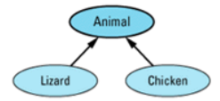
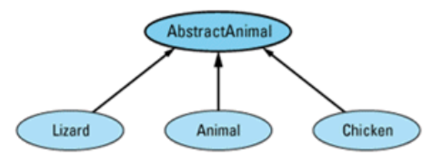
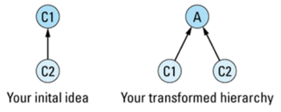

# 1. 条款32：在未来时态下开发程序

略。


# 2. 条款33：将非尾端类设计为抽象类

:one:考虑这样一个继承关系和代码：



```c++
Lizard liz1;
Lizard liz2;
Animal *pAnimal1 = &liz1;
Animal *pAnimal2 = &liz2;
...
*pAnimal1 = *pAnimal2; 
```

这里有两个问题：

- 第一，最后一行的赋值运算调用的是`Animal`类的，虽然相关对象的类型是`Lizard`。结果，只有 `liz1` 的` Animal `部分被修改。这是**部分赋值**，其 `Lizard `成员部分没被改变。 
- 第二个问题是**真的有程序员把代码写成这样**。用指针来给对象赋值并不少见，特别是那些对 `C `有丰富经验而转移到` C++`的程序员。所以，我们应该将赋值设计得更合理的。

一个解决方法是将**赋值运算**申明为**虚函数**。如果 `Animal::operator=`是虚函数，那句赋值语句将调用 `Lizard` 的赋值操作：（返回类型可以不一致，但参数类型必须一致）

```c++
virtual Lizard& operator=(const Animal& rhs);
...
virtual Chicken& operator=(const Animal& rhs); 
```

但此时我们遇到了**新的问题**：

```c++
Lizard liz;
Chicken chick;
Animal *pAnimal1 = &liz;
Animal *pAnimal2 = &chick;
...
*pAnimal1 = *pAnimal2; // assign a chicken to a lizard! 
```

我们打开**了混合类型操作**的门。 这使得我们处境艰难。我们应该**允许**通过指针进行**同类型赋值**，而**禁止**通过同样的指针进行**混合类型赋值**。

只能在运行期区分它们，可以使用` dynamic_cast`来实现：

```c++
Lizard& Lizard::operator=(const Animal& rhs)
{
    // make sure rhs is really a lizard
    const Lizard& rhs_liz = dynamic_cast<const Lizard&>(rhs);
    proceed with a normal assignment of rhs_liz to *this;
} 
```

这个函数只在 `rhs `确实是 `Lizard `类型时将它赋给`*this`。如果` rhs `不是` Lizard `类型， `dynamic_cast` 转换失败时抛的` bad_cast` 类型的**异常**。

:two:考虑有些编译器不支持`dynamic_cast`，最容易的方法是在 `Animal `中将 `operator=`置为` private`。于是，`Lizard `对象可以赋值给` Lizard` 对象，`Chicken `对象可以赋值给 `Chicken `对象，但部分或混合类型赋值被禁止：

```c++
Lizard liz1, liz2;
...
liz1 = liz2; // fine
Chicken chick1, chick2;
...
chick1 = chick2; // also fine
Animal *pAnimal1 = &liz1;
Animal *pAnimal2 = &chick1;
...
*pAnimal1 = *pAnimal2;  // error! 
```

不幸的是，`Animal` 也是实体类，这个方法同时将 `Animal `对象间的赋值评定为**非法**了。而且，它也使得不可能正确实现` Lizard `和 `Chicken` 类的**赋值操作**，因为**派生类的赋值操作函数**有责任调用其**基类的赋值操作函数**。

后面这个问题可以通过将 `Animal::operator=`申明为`protected `来解决，但依然不能允许`animal`之间的赋值。最容易的事情是排除` Animal `对象间赋值的需求，其最容易的实现方法是将 `Animal `设计为**抽象类**。作为抽象类，`Animal `不能被**实例化**，所以也就没有了 `Animal `对象间**赋值的需求**了。当然，这导致了一个新问题，因为我们最初的设计表明 `Animal `对象是**必须的**。

:three:有一 个很容易的解决方法：不用将` Animal `设为**抽象类**，我们创一个新类，叫 `AbstractAnimal` ，来包含 `Animal`、`Lizard`、`Chikcen` 的共有属性，并把它设为**抽象类**：



```c++
class AbstractAnimal {
protected:
    AbstractAnimal& operator=(const AbstractAnimal& rhs);
public:
    virtual ~AbstractAnimal() = 0; // see below
 ...
};

class Animal: public AbstractAnimal {
public:
    Animal& operator=(const Animal& rhs);
    ...
};

class Lizard: public AbstractAnimal {
public:
    Lizard& operator=(const Lizard& rhs);
    ...
}; 
```

用如 `AbstractAnimal `这样的**抽象基类**替换如` Animal `这样的**实体基类**，其好处远比简单地使得 `operator=`的行为易于了解。它也减少了你试图**对数组使用多态**的可能。然而，这个技巧**最大的好处**发生在**设计的层次**上，因 为这种替换强迫你明确地认可**有用处的抽象行为的实体**。也就是说，它使得你为**有用的原型**（concept）创造了新的抽象类，即使你并不知道这个**有用的原型**的存在。

如果你有两个实体类 `C1` 和 `C2 `并且你喜欢` C2 `**公有继承**自 `C1`，你应该将两个类的**继承层次**改为三个类的继承层次，通过创造一个**新的抽象类** `A `并将` C1 `和` C2 `都从它继承：



这种修改的**重要价值**是强迫你确定**抽象类A**。很清楚，`C1 `和 `C2 `有共性；这就是为什么它们用**公有继承**联系在一起的原因。修改后，你必须确定**这些共性**到底是什么。而且，你必须用` C++`的类将这些**共性**组织起来，它将不再是模糊不清的东西了，它到达了一个**抽象类型的层次**，有明确定义的**成员函数**和**语义**。

这一切导致了一些令人不安的思考。毕竟，**每个类**都完成了**某些类型的抽象**，我们不应该在此继承体系中创造**两个类**来针对**每个原型**吗？不应该，这样的**继承体系**是难以理解的，难以维护的，编译的代价很昂贵。这不是**面向对象设计**的目的。 

> 其目的是：确认有用的抽象，并强迫它们（并且只有它们）放入如抽象类这样的实体。

在**一个原型**第一次被需要时，我们**无法证明**同时创造一个**抽象类**和一个**实体类**是正确的，但第二次需要时，我们就能够这么做是**正确的**。

:four:最后，一般的规则是：==非尾端类应该是抽象类==。在处理**外来的类库**时，你可能需要**违背这个规则**；但对于你能控制的代码，遵守它可以提高程序的可靠性、健壮性、可读性、可扩展性。


# 3. 条款34：如何在同一程序中混合使用`C++`和`C`

:one:第一步，也是万物之始，确保**C++编译器**和**C编译器**兼容。确认兼容后，还有**四个要考虑的问题**：名变换，静态初始化，内存动态分配，数据结构兼容。 

:two:**名变换​**

名变换，就是`C++`**编译器**给程序的**每个函数**换一个**独一无二的名字**。在 `C `中，这个过程是不需要的，因为没有**函数重载**，但几乎所有 C++程序都有**函数重名**。

考虑这样一个情况，`DrawLine`是一个`C`函数，但`C++`编译器依然会给他一个名变换，例如`xyzzy`，如果尽在C范围内的`obj`文件内，自然没什么问题，但一旦链接到`C++`环境下的程序时，`C++`会报错，因为它找不到`xyzzy`。

要解决这个问题，你需要一种方法来告诉**C++编译器**不要在这个函数上进行**名变换**。使用`C++`的 `extern "C"`指示：

```c++
extern "C"
void drawLine(int x1, int y1, int x2, int y2); 
```

不要将 `extern "C"`看作是申明这个函数是用 `C` 语言写的，应该看作是申明**这个函数应该被当作好像C写的一样**而进行调用。不管如何，它总意味着一件事：**名变换被禁止了**。

`extern "C"`可以对**一组函数**生效，只要将它们放入**一对大括号**中： 

```c++
extern "C" { // disable name mangling for
    // all the following functions
    void drawLine(int x1, int y1, int x2, int y2);
    void twiddleBits(unsigned char bits);
    void simulate(int iterations);
    ...
}
```

这样使用`extern "C"`**简化**了维护那些必须同时供` C++`和 `C `使用的**头文件的工作**。当用 C++编译时，你应该加`extern "C"`，但用 C 编译时，不应该这样。通过只在**C++编译器**下定义的宏`__cplusplus`，你可以将头文件组织成这样：

```c++
#ifdef __cplusplus
extern "C" {
#endif
    void drawLine(int x1, int y1, int x2, int y2);
    void twiddleBits(unsigned char bits);
    void simulate(int iterations);
    ...
#ifdef __cplusplus
}
#endif
```

> 顺便提一下，没有**标准的名变换规则**。**不同的编译器**可以随意使用**不同的变换方式**

:three:**静态初始化​**

需要面对一个`C++`中的·事实：在 `main` **执行前**和**执行后**都有大量代码被执行。尤其是，**静态的类对象**和定义在全局的、命名空间中的或文件体中的**类对象的构造函数**通常在` main` 被执行前就被调用。这个过程称为==静态初始化==。通过静态初始化产生的对象也要在**静态析构过程**中调用其**析构函数**；这个过程通常发生在`main`结束运行之后。 

为了解决`main()`应该**首先被调用**，而对象又需要在 `main()`执行前被构造的**两难问题**， 许多编译器在` main()`的最开始处插入了一个**特别的函数**，由它来负责**静态初始化**。同样地， 编译器在`main()`结束处插入了一个函数来**析构静态对象**。产生的代码通常看起来象这样： 

```c++
int main(int argc, char *argv[])
{
    performStaticInitialization(); // generated by the implementation

    the statements you put in main go here;

    performStaticDestruction(); // generated by the implementation
} 

```

因为这种**初始化**和**析构**静态对象的方法是如此通用，只要**程序的任意部分**是`C++`写的，你就应该用`C++`写 `main()`函数。这并不意味着你需要重写C代码。只要将 `C `写的 `main()`改名为`realMain()`，然后用` C++`版本的 `main()`调用` realMain()`：

```c++
extern "C" // implement this function in C
int realMain(int argc, char *argv[]); 

int main(int argc, char *argv[]) // write this in C++
{
    return realMain(argc, argv);
} 
```

> 如果不能用 C++写main()，你就有麻烦了，因为没有其它办法确保静态对象的构造和析构函数被调了。不是说没救了，只是处理起来比较麻烦一些。编译器生产商们知道这个问题，几乎全都提供了一个额外的体系来启动静态初始化和静态析构的过程。

:four:**动态内存分配​**

现在提到**动态内存分配**。==通行规则==很简单：`C++`部分使用` new `和` delete`， `C `部分使用 `malloc`和 `free`。只要` new `分配的内存使用 `delete `释放，`malloc `分配的内存用 `free `释放，那么就没问题。

:five:**数据结构的兼容性​**

最后一个问题是在`C++`和 `C `之间传递数据。不可能让` C `的函数了解` C++`的特性，**它们的交互**必须限定在 **C 可表示的概念上**。

:six:总结：

如果想在同一程序下混合 C++与 C 编程，记住下面的==指导原则==： 

- 确保 `C++`和 `C `编译器产生兼容的` obj `文件。 
- 将在两种语言下都使用的函数申明为` extern 'C'` 
- 只要可能，用` C++`写 `main()`。 
- 总用 `delete `释放 `new `分配的内存；总用 `free `释放 `malloc `分配的内存。 
- 将在两种语言间传递的东西限制在用 `C `编译的数据结构的范围内；这些结构的 `C++ `版本可以包含非虚成员函数。


